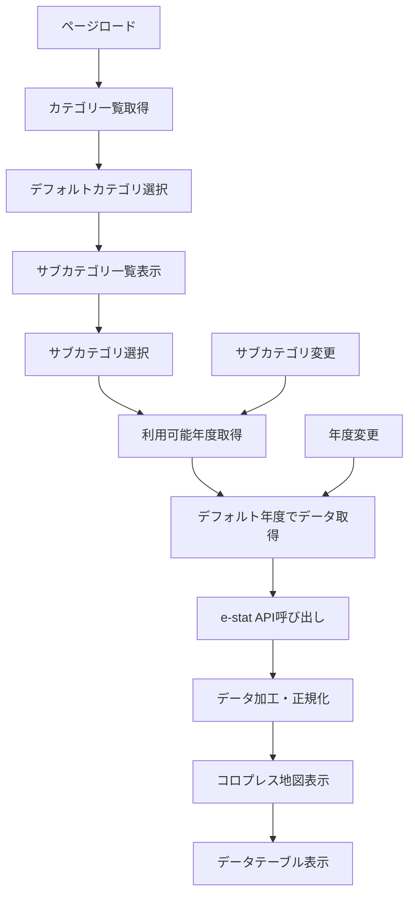

# e-stat APIを使用したコロプレス地図表示機能の設計方針

## 概要

このドキュメントでは、e-stat APIから都道府県統計データを取得し、カテゴリ・サブカテゴリに分類してコロプレス地図で表示する機能の設計方針を定義します。

## 現在のプロジェクト状況

### 既存の実装
- **技術スタック**: Next.js 15, React 19, TypeScript, D3.js, Tailwind CSS
- **状態管理**: Jotai（アトミック状態管理）
- **データベース**: Cloudflare D1
- **地図ライブラリ**: D3.js + TopoJSON
- **既存のコロプレス地図**: `ChoroplethMap.tsx`コンポーネントが実装済み
- **既存のe-stat統合**: API呼び出し、データ処理、表示機能が実装済み

### 既存のページ構成
- `/estat/statsdata` - 統計データ取得・表示
- `/estat/prefecture-ranking` - 都道府県ランキング表示
- `/estat/metainfo` - メタ情報管理
- `/estat/statslist` - 統計表リスト

## 機能要件

### 1. カテゴリ・サブカテゴリ分類システム

#### 主要カテゴリ
1. **人口・世帯**
   - 人口総数、世帯数、人口密度
   - 年齢別人口、高齢化率
   - 出生率、死亡率

2. **経済・産業**
   - 県内総生産、一人当たり県民所得
   - 産業別従業者数、製造業出荷額
   - 農業産出額、観光客数

3. **社会・インフラ**
   - 教育（学校数、進学率）
   - 医療（病院数、医師数）
   - 交通（道路密度、駅数）

4. **環境・地理**
   - 森林面積、可住地面積
   - 気象データ（降水量、気温）
   - 自然災害発生件数

#### データ構造
```typescript
interface CategoryData {
  id: string;
  name: string;
  description: string;
  subcategories: SubcategoryData[];
}

interface SubcategoryData {
  id: string;
  categoryId: string;
  name: string;
  description: string;
  statsTables: StatsTableInfo[];
  unit: string;
  dataType: 'numerical' | 'percentage' | 'rate';
}

interface StatsTableInfo {
  statsDataId: string;
  tableName: string;
  lastUpdated: string;
  availableYears: string[];
}
```

### 2. 画面設計

#### レイアウト構成
```
┌─────────────────────────────────────────────────────────────────┐
│ Header Navigation                                               │
├─────────────────────────────────────────────────────────────────┤
│ │ Sidebar │ Main Content Area                                  │
│ │         │ ┌─────────────────────────────────────────────────┐ │
│ │Category │ │ Category/Subcategory Selector                   │ │
│ │Tree     │ ├─────────────────────────────────────────────────┤ │
│ │         │ │ Year/Time Period Selector                       │ │
│ │         │ ├─────────────────────────────────────────────────┤ │
│ │         │ │ Choropleth Map Display                         │ │
│ │         │ │ ┌─────────────────────────────────────────────┐ │ │
│ │         │ │ │ SVG Map with Color Coding                   │ │ │
│ │         │ │ │ Legend & Controls                           │ │ │
│ │         │ │ └─────────────────────────────────────────────┘ │ │
│ │         │ ├─────────────────────────────────────────────────┤ │
│ │         │ │ Data Table (Prefecture Ranking)                │ │
│ │         │ └─────────────────────────────────────────────────┘ │
└─────────────────────────────────────────────────────────────────┘
```

#### コンポーネント構成
```typescript
// メインページコンポーネント
export default function ChoroplethMapPage() {
  // 状態管理とデータフェッチング
}

// カテゴリ選択サイドバー
export const CategorySidebar: React.FC<{
  categories: CategoryData[];
  selectedCategory: string | null;
  selectedSubcategory: string | null;
  onCategorySelect: (categoryId: string) => void;
  onSubcategorySelect: (subcategoryId: string) => void;
}> = () => {};

// 年度・期間選択コンポーネント
export const YearSelector: React.FC<{
  availableYears: string[];
  selectedYear: string;
  onYearChange: (year: string) => void;
}> = () => {};

// 地図表示コンポーネント（既存のChoroplethMapを拡張）
export const EnhancedChoroplethMap: React.FC<{
  data: FormattedValue[];
  category: CategoryData;
  subcategory: SubcategoryData;
  options: MapVisualizationOptions;
}> = () => {};

// データテーブルコンポーネント
export const PrefectureDataTable: React.FC<{
  data: FormattedValue[];
  sortBy: 'name' | 'value';
  sortOrder: 'asc' | 'desc';
}> = () => {};
```

## データ取得設計

### 1. API設計パターン

#### エンドポイント構成
```typescript
// カテゴリ・サブカテゴリ情報取得
GET /api/choropleth/categories
Response: CategoryData[]

// 特定サブカテゴリのデータ取得
GET /api/choropleth/data?subcategoryId={id}&year={year}
Response: {
  data: FormattedValue[];
  metadata: {
    subcategory: SubcategoryData;
    year: string;
    lastUpdated: string;
    source: string;
  };
}

// 利用可能な年度一覧取得
GET /api/choropleth/years?subcategoryId={id}
Response: {
  availableYears: string[];
  defaultYear: string;
}
```

### 2. データフロー

#### データ取得フロー


#### キャッシュ戦略
1. **カテゴリ情報**: アプリケーション起動時に取得、セッション中は保持
2. **統計データ**:
   - ブラウザキャッシュ: 24時間
   - サーバーキャッシュ: Cloudflare D1に保存
   - 更新頻度: 統計表の更新頻度に応じて設定

### 3. e-stat API統合

#### APIパラメータマッピング
```typescript
interface EstatApiMapping {
  // 統計表ID（サブカテゴリごとに定義）
  statsDataId: string;

  // 地域フィルター（都道府県レベル）
  cdArea: '01000-47000'; // 都道府県コード範囲

  // 時系列フィルター
  cdTime?: string; // 年度指定

  // カテゴリフィルター（統計項目）
  cdCat01?: string; // 分類事項1
  cdCat02?: string; // 分類事項2
  cdCat03?: string; // 分類事項3
}
```

#### データ変換処理
```typescript
// e-stat APIレスポンスから地図表示用データへの変換
export function transformEstatToMapData(
  estatResponse: EstatStatsDataResponse,
  subcategory: SubcategoryData
): FormattedValue[] {
  // 1. データの抽出と正規化
  // 2. 都道府県コードのマッピング
  // 3. 数値の型変換とフォーマット
  // 4. 表示用データの生成
}
```

## 技術実装詳細

### 1. ファイル構成
```
src/
├── app/
│   └── choropleth/
│       └── page.tsx                 # メインページ
├── components/
│   └── choropleth/
│       ├── CategorySidebar.tsx      # カテゴリ選択
│       ├── YearSelector.tsx         # 年度選択
│       ├── EnhancedChoroplethMap.tsx # 拡張地図コンポーネント
│       └── PrefectureDataTable.tsx  # データテーブル
├── lib/
│   └── choropleth/
│       ├── categories.ts            # カテゴリ定義
│       ├── api-client.ts           # API呼び出し
│       └── data-transformer.ts      # データ変換
└── types/
    └── choropleth.ts               # 型定義
```

### 2. 状態管理（Jotai）
```typescript
// アトム定義
export const selectedCategoryAtom = atom<string | null>(null);
export const selectedSubcategoryAtom = atom<string | null>(null);
export const selectedYearAtom = atom<string | null>(null);
export const categoriesAtom = atom<CategoryData[]>([]);
export const mapDataAtom = atom<FormattedValue[]>([]);
export const loadingAtom = atom<boolean>(false);
export const errorAtom = atom<string | null>(null);

// 派生アトム
export const availableSubcategoriesAtom = atom((get) => {
  const categories = get(categoriesAtom);
  const selectedCategory = get(selectedCategoryAtom);
  return categories.find(c => c.id === selectedCategory)?.subcategories || [];
});
```

### 3. データベース設計
```sql
-- カテゴリマスター
CREATE TABLE choropleth_categories (
  id TEXT PRIMARY KEY,
  name TEXT NOT NULL,
  description TEXT,
  display_order INTEGER,
  created_at DATETIME DEFAULT CURRENT_TIMESTAMP
);

-- サブカテゴリマスター
CREATE TABLE choropleth_subcategories (
  id TEXT PRIMARY KEY,
  category_id TEXT REFERENCES choropleth_categories(id),
  name TEXT NOT NULL,
  description TEXT,
  unit TEXT,
  data_type TEXT CHECK(data_type IN ('numerical', 'percentage', 'rate')),
  stats_data_id TEXT NOT NULL, -- e-stat統計表ID
  display_order INTEGER,
  created_at DATETIME DEFAULT CURRENT_TIMESTAMP
);

-- データキャッシュ
CREATE TABLE choropleth_data_cache (
  id TEXT PRIMARY KEY,
  subcategory_id TEXT REFERENCES choropleth_subcategories(id),
  year TEXT,
  data JSON,
  cached_at DATETIME DEFAULT CURRENT_TIMESTAMP,
  expires_at DATETIME
);
```

## 実装計画

### フェーズ1: 基盤構築（1-2週間）
1. カテゴリ・サブカテゴリマスターデータ作成
2. 基本的なUI コンポーネント実装
3. データベーススキーマ設計・実装
4. 既存ChoroplethMapコンポーネントの拡張

### フェーズ2: データ統合（2-3週間）
1. e-stat API統合ロジック実装
2. データ変換・正規化処理
3. キャッシュ機能実装
4. エラーハンドリング強化

### フェーズ3: UI/UX向上（1-2週間）
1. レスポンシブデザイン対応
2. アクセシビリティ向上
3. パフォーマンス最適化
4. ユーザビリティテスト

### フェーズ4: 機能拡張（1週間）
1. データエクスポート機能
2. 比較表示機能
3. 時系列アニメーション
4. 詳細分析ツール

## 参考データ

### 主要な e-stat 統計表ID例
- 人口総数: `0000010101` (国勢調査)
- 県内総生産: `0000040001` (県民経済計算)
- 製造業出荷額: `0000020101` (工業統計調査)

### カラースキーム設定
- **数値データ**: Blues, Greens, Oranges
- **比較データ**: RdYlBu, RdYlGn, Spectral
- **割合データ**: PuBuGn, YlOrRd

## 注意点

1. **e-stat API制限**: リクエスト頻度制限に注意（1秒間に10リクエスト以下）
2. **データ更新頻度**: 統計表によって更新頻度が異なるため、キャッシュ戦略を適切に設定
3. **パフォーマンス**: 大量のデータを扱うため、仮想化やページネーション実装を検討
4. **アクセシビリティ**: 色覚異常者向けのカラーパレット対応
5. **SEO対応**: 統計データの検索エンジン最適化

## まとめ

本設計方針により、ユーザーが直感的に統計データを探索し、視覚的に理解できるコロプレス地図表示システムを構築します。既存の技術スタックを最大限活用しつつ、段階的な実装により安定した機能提供を目指します。