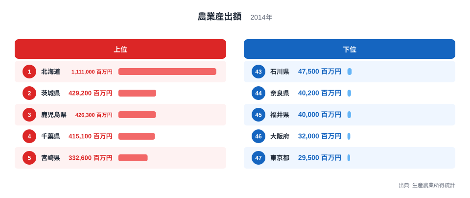
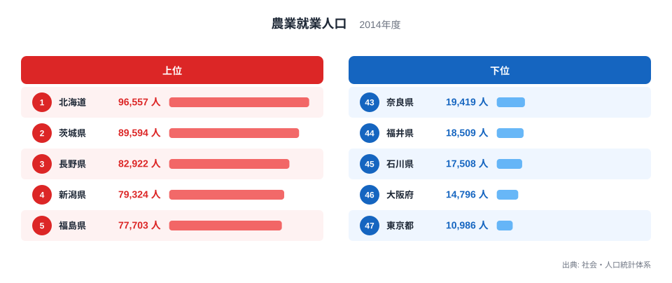
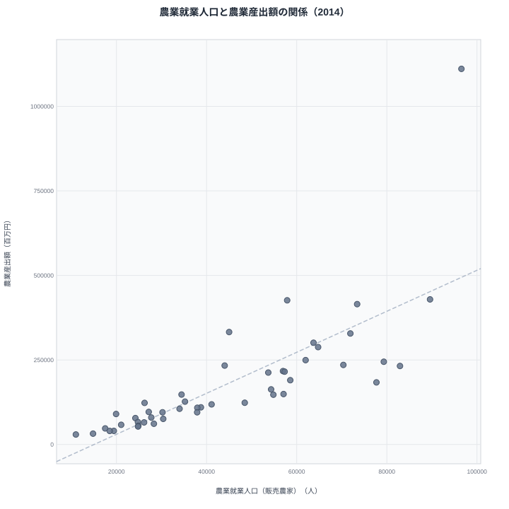
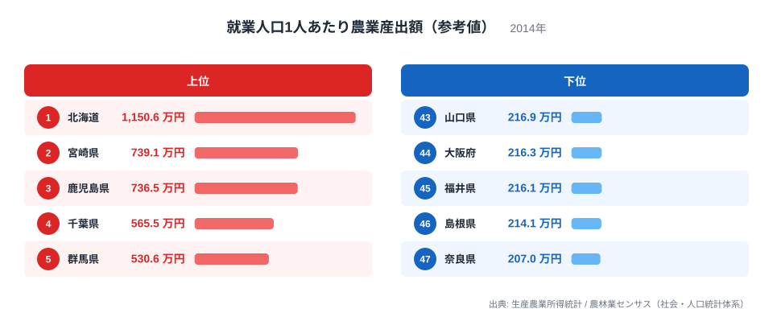

農業産出額が大きい県は、農業の担い手も多い県なのでしょうか。2014年の47都道府県で、農業産出額と農業就業人口（販売農家）を重ねてみると、順位の並びはよく揃います。順位相関は0.92で、産出額が1位の北海道と2位の茨城県は、就業人口でも同じ1位と2位に並びます。

ところが、産出額を就業人口で割った「1人あたり」の参考値に直すと、様子が変わります。北海道は1,150.6万円なのに対し、最下位の奈良県は207.0万円で、差は5.6倍に開きます。宮崎県は就業人口が21位なのに産出額は5位、鹿児島県は就業人口13位で産出額は3位です。逆に長野県、新潟県、福島県は就業人口が3位から5位と多いのに、産出額は13位、10位、18位にとどまります。

人数の多さと産出額の大きさは同じ方向を向いていますが、1人が生み出す額は県によって大きく違います。これが、この記事の結論です。以下では、まず2つの指標を同じ2014年にそろえたうえで、それぞれの上位と下位、散布図で見える関係の強さ、1人あたりにしたときに入れ替わる県の順に確かめます。

## 農業産出額は北海道が1兆円を超え、東京の37.7倍

<source-link href="/ranking/agricultural-output">農業産出額ランキングをもっと見る</source-link>

2014年の農業産出額は、北海道が1兆1,110億円で全国1位です。2位は茨城県の4,292億円、3位は鹿児島県の4,263億円、4位は千葉県の4,151億円、5位は宮崎県の3,326億円と続きます。北海道は2位の茨城県の2.6倍にあたり、2位以下の県が数千億円台で並ぶなかで、1県だけが桁違いに抜けています。

下位は東京都の295億円、大阪府の320億円、福井県の400億円、奈良県の402億円、石川県の475億円です。1位の北海道と最下位の東京都の差は37.7倍で、このあと見る就業人口の差や1人あたりの差よりも大きな開きです。

上位の顔ぶれは地理的に3つに分かれます。広大な農地を持つ北海道、大消費地の東京に近い関東の茨城県と千葉県、そして南九州の鹿児島県と宮崎県です。下位は東京都と大阪府の大都市圏に、福井県、奈良県、石川県のように農地の限られた北陸・近畿の県が加わります。

[仮説] 北海道の突出は農地の広さ、南九州は単価の高い畜産や園芸、茨城県と千葉県は大消費地向けの野菜といった、品目構成の違いが産出額の差をつくっている可能性があります。この記事のデータには品目の内訳が含まれないので、確かめるには都道府県別の品目別産出額を見る必要があります。

> [!NOTE]
> 産出額の最新年は2024年ですが、就業人口の側で比べられる年は2014年の1時点だけです。10年離れた値を同じ表で割ると別の時代の人数と金額を混ぜることになるため、両方とも2014年に統一しました。なお2014年の産出額は社会・人口統計体系の百万円値で、2024年の公表値とは精度が異なります。

## 農業就業人口も上位は同じ顔ぶれだが、長野と新潟、福島が割り込む

<source-link href="/ranking/agricultural-employment-population">農業就業人口ランキングをもっと見る</source-link>

農業就業人口（販売農家）は、北海道が9万6,557人で1位、茨城県が8万9,594人で2位です。ここまでは産出額の順位と同じですが、3位は長野県の8万2,922人、4位は新潟県の7万9,324人、5位は福島県の7万7,703人で、産出額の上位5県には入っていなかった県が並びます。産出額で3位の鹿児島県、5位の宮崎県は、就業人口ではそれぞれ13位と21位です。

下位は東京都の1万986人、大阪府の1万4,796人、石川県の1万7,508人、福井県の1万8,509人、奈良県の1万9,419人です。1位の北海道は最下位の東京都の8.8倍です。ここで注目したいのは、産出額の差が37.7倍だったのに対して、人数の差は8.8倍にとどまることです。産出額の開きは人数の開きの4倍以上あり、人数だけでは産出額の差を説明できない余地が、すでにこの時点で見えています。

この指標は販売農家の就業人口です。販売農家以外の経営や、農業法人などの組織が抱える人手が含まれているかどうかは、このデータからは確認できません。したがって、ここで見ている人数は農業に関わる人の総数ではなく、あくまでこの調査が数えた範囲の人数です。

就業人口は人数を数えた値で、働いた時間の長さは反映しません。同じ1人でも、年間を通じて農業に専念する人と、他の仕事の合間に農作業をする人とでは、産出額への寄与は違いますが、その違いはこの指標には現れません。1人あたりの比較に入る前に、この前提を頭に置いておく必要があります。

## 散布図で見ると、並びは揃うが金額は北海道に引っ張られる

あわせて見る: [農業産出額ランキング](/ranking/agricultural-output) / [農業就業人口ランキング](/ranking/agricultural-employment-population)

47都道府県を、横軸に就業人口、縦軸に産出額としてプロットしたのが上の散布図です。ピアソンの相関係数は0.758で、右上がりの関係がはっきり出ています。さらに順位だけで測った順位相関は0.920まで上がります。人数が多い県ほど産出額も大きい、という並びの揃い方は、金額の関係よりも順位の関係でいっそう強いことがわかります。

この差は、北海道が1県だけ全体の傾きから外れていることで生まれます。北海道を除いた46県で計算し直すと、相関係数は0.836に上がります。北海道の就業人口は9万6,557人で、2位の茨城県の1.08倍にすぎません。それなのに産出額は茨城県の2.6倍あり、散布図でも右上に1点だけ高く離れています。就業人口が近い県どうしでも産出額がこれだけ違うという事実が、1人あたりの比較に進む理由になります。

2位以下の県は、散布図の左下に固まっています。そのなかでも傾きから上に外れるのが宮崎県と鹿児島県で、下に外れるのが福島県、長野県、新潟県です。後者は就業人口が3位から5位と多いのに、産出額はその人数から想像される水準に届いていません。

> [!WARNING]
> 相関係数が高いことは、担い手が多いから産出額が大きいという因果を意味しません。産出額が大きい県ほど多くの人手が必要になる逆向きの関係や、県の農地の広さが両方を押し上げる共通要因の可能性があります。また、産出額は農業全体の推計額、就業人口は販売農家に限った人数で、対象の範囲がそろっているとは確認できません。産出額は暦年、就業人口は年度区分の値で、基準日も同じではありません。

## 1人あたりにすると、北海道と南九州が抜け、福島と長野は下位に沈む

あわせて見る: [就業者1人当たり農業産出額（別の定義の指標）](/ranking/agricultural-output-per-employed-person)

産出額を就業人口で割った1人あたりの値は、北海道が1,150.6万円で1位、宮崎県が739.1万円で2位、鹿児島県が736.5万円で3位、千葉県が565.5万円で4位、群馬県が530.6万円で5位です。下位は奈良県の207.0万円、島根県の214.1万円、福井県の216.1万円、大阪府の216.3万円、山口県の216.9万円で、1位と最下位の差は5.6倍です。47県の産出額の合計8兆4,279億円を、就業人口の合計209万6,662人で割ると約402万円になり、北海道はその約2.9倍にあたります。中央の24位は新潟県の308.6万円です。

産出額の順位と就業人口の順位を並べると、入れ替わりの大きい県が2つのグループに分かれます。1つ目は、少ない人手で上位に入る県です。宮崎県は就業人口21位で産出額5位、鹿児島県は就業人口13位で産出額3位、群馬県は就業人口22位で産出額12位です。この3県はいずれも1人あたりが5位以内に入っています。

2つ目は、人手が多いのに1人あたりが伸びない県です。福島県は就業人口5位で産出額18位、1人あたりは236.4万円で41位です。長野県は就業人口3位、産出額13位で、1人あたりは280.0万円の30位です。新潟県は就業人口4位、産出額10位で、1人あたりは308.6万円の24位です。

[仮説] 1つ目のグループは単価の高い畜産や施設園芸の比率が高く、2つ目のグループは兼業や小規模な経営が多く、人数の割に産出額が伸びにくい構造にある可能性があります。確かめるには、品目別の産出額と、専業・兼業別や年齢別の就業人口を同じ年で並べる必要があります。

大都市圏の動きも見逃せません。東京都は産出額も就業人口も最下位ですが、1人あたりは268.5万円で34位です。農業の規模が小さいことと、1人あたりが低いことは別の話で、1人あたりの最下位グループには東京都ではなく、奈良県、島根県、福井県、大阪府、山口県が入っています。沖縄県も就業人口42位、産出額33位と規模は小さいのに、1人あたりは452.4万円で10位に入ります。

> [!TIP]
> 1人あたりの順位より、産出額の順位と就業人口の順位の差を見ると読み違いにくくなります。宮崎県のように就業人口の順位より産出額の順位が大きく上にある県は、人数以外の要因が強く働いている可能性があります。逆に福島県のように下にある県は、人数が産出額に結びつきにくい理由を探す手がかりになります。

この1人あたりの値は、労働時間や設備、品目構成を調整した労働生産性ではありません。分子と分母の範囲もそろっていないので、県の優劣や努力の差を示す数字として読まないでください。ここで示しているのは、人数の並びと金額の並びがどこで食い違うかを見つけるための参考値です。リンク先の別指標は農業就業者を分母にした2018年度の値で、定義も年も異なるため、この記事の値とは直接比べられません。

## 比べて言えること、言えないこと

- 順位の並び：農業産出額と農業就業人口は、2014年の47都道府県で順位相関が0.920と高く、産出額の大きい県は人手も多い傾向があります。
- 北海道の位置：北海道は産出額も就業人口も1位ですが、就業人口が茨城県の1.08倍なのに産出額は2.6倍で、1人あたりは1,150.6万円と2位の宮崎県の約1.6倍あります。
- 1人あたりの差：1人あたりの参考値は、最大の北海道と最小の奈良県で5.6倍の差があり、産出額の差37.7倍は人数の差8.8倍だけでは説明できません。
- 食い違う県：宮崎県、鹿児島県、群馬県は少ない人手で上位に入り、福島県、長野県、新潟県は人手が多いのに産出額が伸びていません。理由は[仮説]の段階で、品目別と専兼業別のデータで検証が必要です。
- 言えないこと：相関から因果は言えず、1人あたりの値は労働生産性ではなく、2024年の最新の姿でもありません。

農業の強さは、物差しによって答えが変わります。耕地1ha当たりで測り直すと、北海道が下位に沈む逆転が起きることは、[農業王国・北海道、なぜ「土地効率」では下位なのか](/blog/agriculture-hokkaido-dominance)で扱っています。農家の総所得で見たときの北海道の位置は[農業日本一の北海道は、農家総所得では何位なのか](/blog/sixth-industry-direct-sales)が、担い手の減少と農地の関係は[耕作放棄地42.3万ha、なぜ東北に集中?](/blog/farmland-crisis-abandoned-land)が参考になります。農業分野の指標は[農業カテゴリ](/category/agriculture)から探せます。北海道の県ページは[こちら](/areas/01000)です。

## データについて

産出額は、農産物の品目別の生産数量に農家庭先販売価格を乗じるなどして推計した、1月から12月の農業生産の金額です。農業者の手取り所得とは異なります。就業人口は社会・人口統計体系の「農業就業人口（販売農家）」で、農林業センサスを元にした値です。この指標で比べられる年は、社会・人口統計体系で2014年度とされる1時点だけでした。

1人あたり産出額は、百万円単位の産出額に100を掛けて就業人口で割り、万円単位にそろえ、小数第2位を四捨五入した値です。相関係数は、結合した47点から再計算できます。両指標の2014年値は、いずれも公開データの同じ年区分から取得しています。
