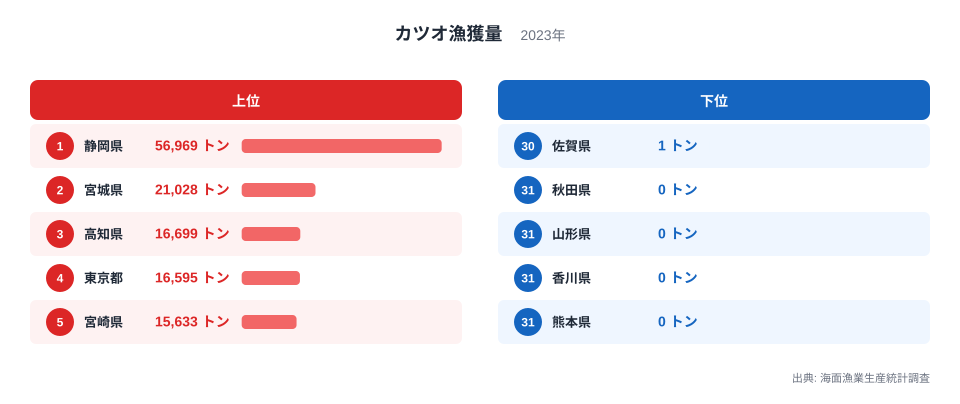
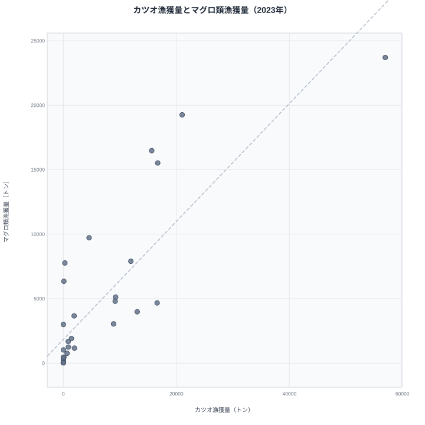
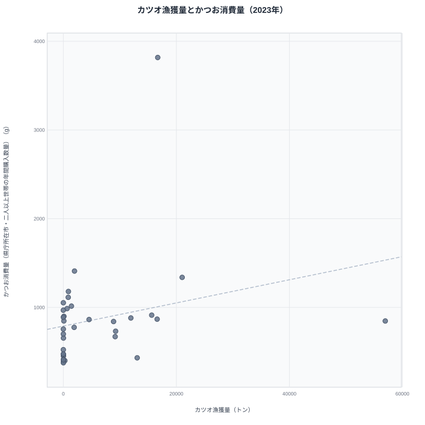

「カツオ日本一はどこか」という問いには、統計の答えと食卓の実感で食い違いが生まれます。本記事は農林水産省「海面漁業生産統計調査」の2023年の値で都道府県別の漁獲量を見ます。この調査で都道府県別の値がそろっている最新の年が2023年で、2019年から2022年は表が揃わず、本記事では扱えません。2023年の表に値がある34都道府県で見ると、[静岡県](/areas/22000)は56,969トンで1位、[宮城県](/areas/04000)は21,028トンで2位です。静岡県の漁獲量は宮城県の約2.7倍にのぼります。ところが、生鮮カツオの水揚げ量が最も多い港を問われると、答えは宮城県の気仙沼港です。宮城県が2023年9月に発行したメールマガジンは、気仙沼港の生鮮カツオの水揚量を「26年連続日本一」と伝えています。同じ「カツオ日本一」でも、統計の県別順位では静岡、生鮮の水揚げ港では気仙沼と、答えが二つに割れているのです。この食い違いは、二つの数字の物差しが違うことから生じます。本記事ではその物差しの違いを整理し、マグロ類の漁獲量や家庭のかつお消費量と2023年の値で比べます。

## 2023年のカツオ漁獲量は静岡が約3割

1位の静岡県は56,969トン、2位の宮城県は21,028トン、3位の高知県は16,699トン、4位の東京都は16,595トン、5位の宮崎県は15,633トンです。2023年の表で値のある34都道府県の漁獲量を足すと192,207トンで、静岡県はその29.6%、宮城県は10.9%を占めます。上位5県の合計は126,924トンで、全体の66.0%です。なお、この「全体」は表に値がある34都道府県の合計であって、全国の漁獲量そのものではありません。表に行がない都道府県は合計に入っていません。3位の高知県と4位の東京都の差は104トンしかなく、順位は僅差で入れ替わりうる位置にあります。下位は秋田県・山形県・香川県・熊本県の4県が0トンで、同率の31位です。その上の30位は佐賀県の1トンです。

2015年と比べると、上位の顔ぶれと量が大きく動いています。2015年の静岡県は81,295トン、東京都は26,686トン、三重県は25,867トン、宮城県は19,828トン、高知県は14,893トンでした。2023年の静岡県は56,969トンで、2015年から24,326トン、29.9%減っています。東京都は16,595トンで37.8%減、三重県は11,952トンで53.8%減り、2015年の3位から7位に下がりました。反対に、宮城県は21,028トンで6.1%増、高知県は16,699トンで12.1%増、宮崎県は15,633トンで12.2%増、新潟県は13,072トンで21.6%増です。ただし、この比較には注意が要ります。2015年の表は30県、2023年の表は34県と行の数が違い、取り出した表も別なので、合計や全体シェアを2015年と2023年で並べて増減を論じることはできません。県ごとの値を比べるにとどめています。2018年の静岡県は81,042トン、宮城県は31,291トンで、2023年はそれぞれ56,969トンと21,028トンです。2019年から2022年の表がないため、この減少がどの年に起きたのかは分かりません。

> [!NOTE]
> この統計は海面漁業の漁獲量で、海のない栃木・群馬・埼玉・山梨・長野・岐阜・滋賀・奈良の8県は対象外です。残る39都道府県のうち、2023年の表に行があるのは34県で、京都府・大阪府・兵庫県・岡山県・広島県の5府県は行そのものがありません。行がないことと0トンは別で、行がない府県を「カツオが獲れない県」と読むことはできません。

<source-link href="/ranking/fishery-species-catch-bonito">カツオ漁獲量の都道府県ランキング詳細を見る</source-link>

## 二つの「日本一」は物差しが違う

カツオの水揚げ拠点として名前が挙がるのが、静岡県の焼津港と宮城県の気仙沼港です。一般には、焼津港は遠洋で操業するカツオ漁船の母港として冷凍カツオの流通を担い、気仙沼港は三陸沖で獲れた生鮮カツオの水揚げで知られる、と説明されます。ただし、この統計に冷凍と生鮮の内訳はありません。港と流通の話は一般的な説明であり、本記事の数値で確かめたものではありません。確かめられるのは、気仙沼港の生鮮カツオ水揚量が2023年9月時点で26年連続日本一と宮城県が発信していること、そして統計の県別順位では静岡県が宮城県の約2.7倍だということです。

ここで、ランキングの数字が港の水揚げ量ではないことに気をつけてください。静岡県の56,969トンも宮城県の21,028トンも、焼津港や気仙沼港だけの水揚げ量ではありません。統計の県別順位と気仙沼港の「生鮮カツオ水揚量日本一」は、少なくとも次の3点で物差しが違います。

- 対象の違い: 気仙沼港の数字は生鮮カツオの水揚量です。一方、農林水産省の調査概要ページの用語の説明は、漁獲量を「漁ろう作業により得られた水産動植物の採捕時の原形重量」とし、「船内で加工された塩蔵品、冷凍品、缶詰等はその漁獲物を採捕時の原形重量に換算した」と書いています。つまり統計の静岡県の値は、生鮮と冷凍を合わせた採捕量です。
- 集計単位の違い: 気仙沼港の数字は港ごとの水揚げです。統計の漁獲量は都道府県ごとの値で、焼津港や気仙沼港という港の単位では分かれていません。
- 計上先の違い: 同じ概要ページは、昭和39年の沿革に「属地統計であった本統計を、水産行政の展開に対応するため属人統計へ転換」と記し、Q&Aでも「集計値は、海面漁業経営体の所在地に計上（属人統計）しております」と説明しています（2026年10月8日に確認）。漁獲量は、獲れた海や水揚げされた港ではなく、漁業経営体の所在地に計上されます。

この統計だけでは、3つの違いがそれぞれどれだけ順位の食い違いに効いているのかを分けることはできません。静岡県の値のうち焼津港がどれだけを占めるのか、宮城県の値のうち気仙沼港がどれだけなのかも、分かりません。分かるのは、二つの「日本一」が同じ物差しで測った結果ではないので、一方がもう一方を否定しているわけではない、ということです。

> [!TIP]
> 都道府県別の漁獲量を「その県の海で獲れた量」と読むと誤ります。計上先は漁業経営体の所在地なので、遠くの海で操業する船団を多く抱える県は、近くの海に魚がいなくても値が大きくなりえます。県の順位は、海の豊かさではなく、漁業の担い手がどこにいるかを映す数字です。

## マグロ類と連動する、カツオの「拠点型」の分布

カツオの漁獲量が多い県は、マグロ類の漁獲量も多い傾向があります。2023年にカツオとマグロ類の両方の行がある31県で計算した相関係数はr=0.839です。順位の相関を表すスピアマンの順位相関係数も0.846と、ほぼ同じ強さでした。マグロ類の漁獲量は、静岡県が23,704トンで1位、宮城県が19,257トンで2位、宮崎県が16,480トンで3位、高知県が15,523トンで4位です。カツオの上位5県のうち4県は、マグロ類でも上位4県に入っています。この計算に使えなかったのは、カツオの行がない京都・大阪・兵庫・岡山・広島の5府県と、マグロ類の行がない愛知・佐賀・熊本の3県です。

図の右上に1点だけ大きく離れているのが静岡県で、横軸のカツオが56,969トン、縦軸のマグロ類が23,704トンです。この強い相関は、この1県に引っ張られている面があります。静岡県を除いた30県で計算し直すと、r=0.797にやや下がりますが、強い連動は残ります。つまり、静岡県の存在だけでは説明できない広がりがあります。カツオ漁獲量が小さい県は、マグロ類も小さい県がほとんどです。[仮説] この連動は魚同士の関係ではなく、属人統計の性質上、遠洋・近海の船団を抱える経営体の所在地が、カツオとマグロ類の両方の値を同時に押し上げているためかもしれません。検証には、漁業経営体の階層別・所在地別の表で、県ごとの大型漁船の経営体数とカツオ・マグロ類の漁獲量を突き合わせる必要があります。本記事ではそこまで確かめていません。

> [!WARNING]
> r=0.839は二つの量が一緒に動く度合いを示す数字で、一方が他方の原因という意味ではありません。県数も31と少なく、静岡県と宮城県の2県が大きな値を持つため、ほんの数県の動きで相関係数は変わります。静岡県を除いたr=0.797は強い連動が残る目安ですが、真因の証明ではありません。

<source-link href="/ranking/fishery-species-catch-tuna">マグロ類漁獲量の都道府県ランキング詳細を見る</source-link>

## 獲る県と食べる県はほとんど重ならない

食べる側を総務省「家計調査」のかつお消費量で見ると、並びはまったく別になります。ここでのかつお消費量は、都道府県庁所在市の二人以上の世帯が1年間に購入した量の平均で、単位はグラムです。県民全体や個人の消費量ではなく、世帯平均を県の漁獲量と並べた大まかな傾向として読んでください。2023年のかつお消費量は、高知県が3,817グラムで1位、茨城県が1,410グラムで2位、宮城県が1,339グラムで3位でした。高知県は漁獲量でも3位なので、獲る側と食べる側がそろう例外的な県です。宮城県も漁獲量2位、消費量3位で、獲る側と食べる側の両方で上位に入ります。

図の最上部、縦軸の3,817グラムにある点が高知県で、横軸の漁獲量は16,699トンです。一方、図の右端、横軸56,969トンにある漁獲量1位の静岡県は、縦軸の消費量が847グラムで22位にとどまります。漁獲量4位の東京都は868グラムで19位、6位の新潟県は432グラムで41位です。反対に、消費量2位の茨城県の漁獲量は1,976トンで12位、消費量6位の山形県の漁獲量は0トンです。消費量7位の奈良県は1,047グラムですが、内陸県なので漁獲量の統計には出てきません。漁獲量の行がある34県で、漁獲量とかつお消費量の相関係数を計算するとr=0.243でした。順位の相関は0.347です。静岡県を除くとr=0.436に上がりますが、それでもマグロ類との連動と比べれば、はるかに弱い関係です。

この弱さには、数え方の違いも効いています。漁獲量は漁業経営体の所在地に計上された量、消費量は県庁所在市の家計が買った量で、同じ県でも見ている母集団がまったく違います。獲った魚が獲った県で食べられるとは限らず、流通を経て別の県の食卓に並びます。「獲る側の二極」と「食べる側の分布」は重ならない、というのがこの節の結論です。なお、高知県の消費量の高さや、東北・北関東の消費量が高い理由は、本記事のデータでは確かめていません。

<source-link href="/ranking/bonito-consumption-quantity">かつお消費量の都道府県ランキング詳細を見る</source-link>

## 「0トン」と「行がない」は別──ランキングの読み方

カツオ漁獲量のランキングを読むときは、「0トン」と「値がない」を区別する必要があります。2023年の表で0トンなのは、秋田県・山形県・香川県・熊本県の4県です。海に面しているのに行そのものがないのは、京都府・大阪府・兵庫県・岡山県・広島県の5府県です。この5府県を「漁獲ゼロ」とは書けません。たとえば京都府には、2015年の表に8トンの値があります。行がない理由が、個別の経営体が特定されないようにする秘匿なのか、別の事情なのかは、本記事のデータでは分かりません。[仮説] 行がない府県の少なくとも一部は、秘匿による非公表かもしれません。検証するには、海面漁業生産統計調査の2023年の表で、当該府県のセルに付いた記号を e-Stat で確認する必要があります。

0トンの意味にも注意が要ります。この統計の単位はトンなので、0は完全に漁獲がなかったのか、単位未満の量なのかを、本記事では確かめていません。実際、0トンの県は年によって入れ替わっています。2015年に0トンだったのは山形・石川・島根・熊本の4県で、2023年の石川県は9トン、島根県は20トンと、わずかに値があります。ゼロの県が年ごとにどう入れ替わるのかは、姉妹編の[カツオ漁獲「ゼロの県」は年ごとに顔ぶれが変わる](/blog/bonito-catch-zero-prefectures-gap)で詳しく見ています。

下位を見ると、ゼロの手前にも小さな値の県が並びます。佐賀県は1トン、北海道は4トン、愛知県は6トン、石川県は9トン、山口県は13トンです。上位の静岡県とは桁が3つ以上違います。一方で、日本海側にも大きな値の県があります。新潟県は13,072トンで6位、鳥取県は8,893トンで10位です。「カツオは太平洋岸でしか獲れない」と決めつけられないことを、この2県が示しています。水産の地域差は[農林水産・水産カテゴリ](/category/agriculture)の他の指標と合わせて見ると、産地の偏りがより立体的に見えてきます。

## まとめ

- 2023年のカツオ漁獲量は、静岡県が56,969トンで1位、宮城県が21,028トンで2位、高知県が16,699トンで3位です。
- 静岡県は表に値がある34都道府県の合計の29.6%、上位5県で66.0%を占めます。
- 「統計の県別1位の静岡」と「生鮮カツオの水揚げ日本一の気仙沼」は、対象（生鮮のみか採捕全体か）・集計単位（港別か県別か）・計上先（属人計上）の3点で物差しが違い、この統計だけでは差を分けられません。
- マグロ類漁獲量とはr=0.839と強く連動しますが、かつお消費量とはr=0.243と弱い関係です。
- 0トンは秋田・山形・香川・熊本の4県、行がないのは京都・大阪・兵庫・岡山・広島の5府県で、この二つは別のものとして読む必要があります。
