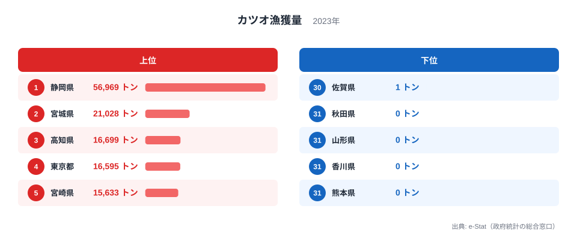

「カツオが獲れない県」は、年が変わっても同じ顔ぶれなのでしょうか。農林水産省「海面漁業生産統計調査」の2023年の表で、カツオの漁獲量が0トンと記録されているのは秋田県・山形県・香川県・熊本県の4県だけです。海のない内陸8県を除く39都道府県のうち、表に行があるのは34県で、残る京都府・大阪府・兵庫県・岡山県・広島県の5府県は行そのものがありません。つまり、正の値がないのは9県で、30県は1トン以上の値を持っています。さらに、2015年・2016年・2017年・2018年・2023年の5つの年の表を並べると、5回とも0トンだった県は1つもありません。最も多い山形県でも、0トンは5回のうち4回で、2016年は行がありませんでした。ゼロの県は固定した顔ぶれではなく、年ごとに入れ替わっています。この記事では、その入れ替わりと、日本海側でも大きな値の県があることを、実際の値で確かめます。

本記事は[カツオ日本一が静岡と宮城で割れる理由](/blog/bonito-catch-prefecture)の姉妹編です。前記事は上位の静岡県と宮城県を扱いました。本記事はその反対側、下位とゼロに焦点を当てます。

## 2023年は0トンが4県、行がないのが5府県

図の上位5県は、静岡県の56,969トン、宮城県の21,028トン、高知県の16,699トン、東京都の16,595トン、宮崎県の15,633トンです。下位5県は、30位の佐賀県が1トン、31位の秋田県・山形県・香川県・熊本県が0トンで、4県が同率で並びます。ランキングの最下位は、1県ではなく4県の同率です。

ここで大切なのは、0トンの4県と、行がない5府県を分けて読むことです。0トンは「表に行があり、値が0」という意味です。行がないのは「値が公表されていない」という意味で、0トンと同じではありません。5府県を0トンの県と同じに数えると、ゼロの県が実際より多く見えてしまいます。2023年の39都道府県は、値が1トン以上の30県、0トンの4県、行がない5府県に分かれます。0トンの4県は[秋田県](/areas/05000)、[山形県](/areas/06000)、[香川県](/areas/37000)、[熊本県](/areas/43000)です。

> [!NOTE]
> 訂正: この記事の旧版は、2015年の表で「漁獲ゼロ13県」と書いていましたが、2015年に0トンだったのは山形・石川・島根・熊本の4県で、残りの9県は行がなく、ゼロではありませんでした。行がない9県には、岩手・茨城・鳥取のように、別の年には16トンから9,290トンの値がある県も含まれます。行がない県までゼロに数えた誤りを、本記事で訂正します。

<source-link href="/ranking/fishery-species-catch-bonito">カツオ漁獲量の都道府県ランキング詳細を見る</source-link>

> [!NOTE]
> 内陸8県（栃木・群馬・埼玉・山梨・長野・岐阜・滋賀・奈良）は海面漁業統計の対象外で、0トンでも行なしでもなく、そもそも母集団に入りません。順位に入れていないので、ランキングの最下位に内陸県が並ぶことはありません。

## 5つの年の表を並べると、ゼロの顔ぶれは入れ替わる

ここで取り上げたのは、累年統計の最終年である2015年から続く2016年・2017年・2018年と、都道府県の値がそろう最新の2023年の、5つの年の表です。2014年以前の表もありますが、2015年以降の動きに絞りました。0トンの県と、行がない沿岸県の数は、年ごとにこう変わります。

- 2015年は30県の行があり、0トンは山形・石川・島根・熊本の4県、行がない沿岸県は9県でした。
- 2016年は32県の行があり、0トンは京都・島根の2県、行がない沿岸県は7県でした。
- 2017年は29県の行があり、0トンは山形の1県、行がない沿岸県は10県でした。
- 2018年は33県の行があり、0トンは秋田・山形・兵庫の3県、行がない沿岸県は6県でした。
- 2023年は34県の行があり、0トンは秋田・山形・香川・熊本の4県、行がない沿岸県は5県でした。

0トンの顔ぶれを県ごとに追うと、入れ替わりの大きさが分かります。山形県は2015年・2017年・2018年・2023年に0トンで、2016年だけ行がありません。熊本県は2015年に0トン、2018年に7トン、2023年に再び0トンと動きます。島根県は2015年と2016年に0トンでしたが、2023年には20トンです。石川県も2015年の0トンから、2023年の9トンへ増えています。ただし、この統計の単位はトンなので、0トンが完全に漁獲がなかったことなのか、1トンに満たない量なのかは、本記事では確かめていません。石川県が0トンから1トン、2トン、4トン、9トンと段階的に増えたことは、0に単位未満の量が含まれる可能性を示唆します。

一方、5つの表すべてで行がなかった沿岸県が3つあります。大阪府・岡山県・広島県です。この3府県は、一度も値が公表されていません。兵庫県は2018年に0トンの行があるだけで、ほかの4つの表には行がありません。香川県も、2023年に0トンの行が現れるまでは、4つの表で行がありませんでした。行がある年とない年が混在することは、「ゼロ」と「行なし」が連続していて、表の作り方や公表の基準に左右されている可能性を示します。

ここまで見えたことは、「0トンの県」という分類が、1年の表を切り取ったときだけの姿だということです。年が変われば、同じ県が0トンから数トン、数十トンの値に動きます。逆に、数千トンの値があった県が別の年の表では行ごと消えることもあります。茨城県は2015年の表に行がありませんが、2016年は2,708トン、2018年は2,727トン、2023年は1,976トンと、安定して大きな値があります。2015年の行がないことを「茨城県はゼロ」と読むと、事実と食い違います。

> [!WARNING]
> 2018年と2023年の間の、2019年から2022年の4年は、都道府県の値がそろった表がなく、ここでは扱えません。5つの表の間隔は一定ではないので、年を線でつないで「増えた」「減った」の推移として読むことはできません。比べられるのは、同じ県の同じ年の値どうしだけです。

## 日本海側は「全滅」ではない

カツオは太平洋の黒潮に乗って回遊するので、日本海側では獲れない、という説明をよく目にします。2023年の表は、この見方が単純すぎることを示します。日本海に面する県を並べると、新潟県は13,072トンで6位、鳥取県は8,893トンで10位です。どちらも、上位10県に入っています。福井県は28トン、島根県は20トン、富山県は17トン、石川県は9トンと小さな値で、秋田県と山形県は0トンです。同じ日本海側でも、桁が3つ以上違う県が並んでいます。

特に鳥取県は、2023年に8,893トンと大きいのに、2015年・2017年・2018年の表には行がありません。2016年には9,290トンの値があります。行がある年は9,000トン近い値を持つ県が、別の年の表では行ごと現れません。この食い違いは「鳥取県は2015年にゼロだった」という読み方を明確に退けます。年によって行がある・ない、というだけで、鳥取県のカツオ漁獲が本当に途切れたかどうかは、この表からは判断できません。[新潟県](/areas/15000)と[鳥取県](/areas/31000)の大きな値の理由も、本記事のデータでは確かめていません。

[仮説] 漁獲量は漁業経営体の所在地に計上される属人統計なので、日本海に面した県でも、遠洋や太平洋で操業する船団を抱える経営体が多い県は値が大きくなる可能性があります。農林水産省の調査概要ページは、集計値を「海面漁業経営体の所在地に計上（属人統計）」と説明しています（2026年10月8日に確認）。検証するには、漁業経営体の階層別・所在地別の表で、新潟県と鳥取県の大型漁船の経営体数と、カツオの漁獲量を突き合わせる必要があります。

太平洋側にも、同じ見直しが必要です。岩手県と茨城県を「太平洋に面しているのにゼロの県」と見る説明があります。しかし2023年の表では、茨城県は1,976トンで12位、岩手県は100トンで20位と、どちらも正の値があります。2015年の表に行がなかっただけで、ゼロだったわけではありません。「太平洋側なのにゼロ」という前提そのものが、2023年の表では成り立ちません。

## 瀬戸内海の5府県は、獲れないのか公表されないのか

大阪府・兵庫県・岡山県・広島県・香川県の5府県は、瀬戸内海や大阪湾に面しています。2023年の表では、香川県は0トン、大阪府・兵庫県・岡山県・広島県は行がありません。この5府県は「瀬戸内海は閉鎖性の内海で、回遊魚のカツオは入ってこない」と説明されることがあります。しかし、今回の表から言えるのは、もっと控えめなことです。

大阪府・岡山県・広島県は、確認した5つの表すべてで行がありません。兵庫県は2018年にだけ0トンの行があります。香川県は2023年にだけ0トンの行があります。5府県のどこにも、1トン以上の値が付いた年は、確認した表の中にありませんでした。これは、カツオの漁獲がごく少ないか、公表されていないことを示しますが、漁獲が実際にないから行がないのか、量が少なくて公表の基準を満たさないのかは、区別できません。[仮説] 行がない府県の少なくとも一部は、経営体が特定されないようにする秘匿による非公表かもしれません。検証するには、海面漁業生産統計調査の該当年の表で、当該府県のセルに付いた記号を e-Stat で確認する必要があります。それまでは、5府県を「獲れない県」とは書かず、「公表値がない」「0トンの年がある」と書くのが安全です。

瀬戸内海がカツオの回遊路かどうか、その地域の主要な漁業が何かといった説明は、この統計表からは確かめられません。本記事は統計の値で裏づけられる範囲に絞り、それらは書きません。水産の地域差は[農林水産・水産カテゴリ](/category/agriculture)の他の指標と合わせて見ると、産地の偏りがより立体的に見えてきます。

## まとめ

- 2023年のカツオ漁獲量が0トンなのは秋田・山形・香川・熊本の4県で、行がないのは京都・大阪・兵庫・岡山・広島の5府県です。
- 2015年・2016年・2017年・2018年・2023年の5つの表で、5回とも0トンだった県はありません。山形県が最多の4回です。
- 0トンの顔ぶれは年ごとに入れ替わり、島根県は0トンから20トンに、石川県は0トンから9トンに動きました。
- 日本海側でも新潟県は13,072トン、鳥取県は8,893トンと大きな値で、「日本海側は全滅」とは言えません。
- 「ゼロ」と「行なし」は別のものとして読み、1年の表だけで「獲れない県」を決めないことが、この統計を読むときの基本です。

## データについて

- 都道府県別の値は、農林水産省「海面漁業生産統計調査」のカツオ漁獲量の2023年の表を使いました。
- 2015年・2016年・2017年・2018年の値は、同じ統計の別の年の表から、同じ県の値だけを控えとして使っています。年ごとに取り出した表が異なるため、年をまたいだ合計は求めていません。
- 2019年から2022年は、都道府県の値がそろった表がなく、本記事では扱っていません。
- 内陸8県（栃木・群馬・埼玉・山梨・長野・岐阜・滋賀・奈良）は海面漁業統計の対象外のため除外し、39都道府県を母集団としています。
