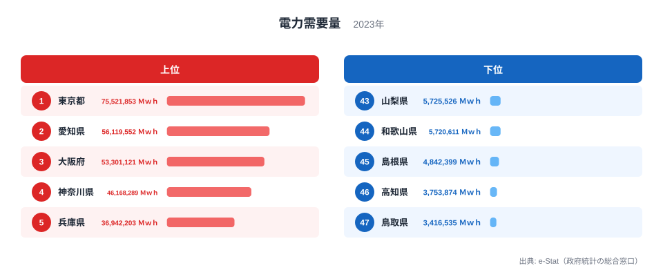

## 積み上げ面で「構成変化」を読む

折れ線グラフが時系列の「絶対値の推移」を表すグラフだとしたら、積み上げ面チャート（Stacked Area Chart）は **「構成比の推移」** を表すグラフです。たとえば家庭用・産業用・業務用の電力消費の内訳が、長い期間でどう入れ替わってきたか。総量の動きが小さくても、内訳の比率は大きく動いていることがあります。

ところがこの「積み上げ面」、自分の手で書こうとすると意外に詰まる場面が多いものです。系列の **並び順**（一番下にどれを置くか、上にどれを置くか）、**ベースライン**（0 から積むのか中央から積むのか）、**正規化**（絶対値か 100% か）——選択肢が多すぎて、最初の 1 枚を出すまでに半日溶けたりします。

D3.js には `d3.stack()` という標準モジュールがあって、これらの選択を `stackOrder` と `stackOffset` という 2 つのオプションで切り替えられます。本記事の主役はまさにここです。

Claude Code に **「家庭用は変動が大きいから下に置きたくない」** とか **「全体量より構成比を強調したい」** といった **目的を自然言語で伝える** だけで、order 6 種類 × offset 5 種類 = 30 通りある組み合わせの中から、適切な 1 つを提案してもらうワークフローを紹介します。

シリーズ全 20 本のうち Part 14 です。前回までで棒グラフ・ヒートマップ・コロプレス・散布図・レーダー・箱ひげ・bar chart race などを扱ってきました。今回扱う積み上げ面とその派生である **ストリームグラフ（stream graph）** は、時系列データを 1 枚で見せる手法としてはひと味違う表現力を持っています。

この記事のゴールは次の 3 点です。

- e-Stat にある電力の表の範囲を確かめ、足りない分をどう扱うかを決める
- D3 + React で積み上げ面チャートを描く（コードの骨格を公開）
- `stackOrder` / `stackOffset` の選択を Claude Code との会話で決める

それでは始めましょう。

## まず実データを見る: 都道府県別の電力需要量

抽象的な話に入る前に、stats47 が e-Stat から取り込んだ実データを 1 枚見ておきましょう。下は 2023 年度の **都道府県別 電力需要量** の上位 5 県と下位 5 県です。



1 位は東京都で 75,521,853 Ｍｗｈ、最下位の鳥取県は 3,416,535 Ｍｗｈ。その差は約 22.1 倍にもなります。上位は東京・愛知・大阪・神奈川・兵庫と、人口と産業が集中する大都市圏が並びます。下位は鳥取・高知・島根・和歌山・山梨と、人口規模の小さい県が連なります。電力需要は人口と産業活動の大きい県ほど大きいため、ランキングは人口分布の鏡像のような顔つきになります。

<source-link href="/ranking/electricity-demand">電力需要量ランキング（47都道府県）をもっと見る</source-link>

> [!NOTE]
> 「電力需要量」は発電量ではなく、需要側の電力量です（社会・人口統計体系の指標で、元の統計は電気事業便覧）。発電所の立地県は発電量が大きくても、需要量の順位は高くありません。2023 年度の需要量は福島県が 19 位、福井県が 36 位です。発電量と需要量を取り違えると、原発立地県を「電力大量消費県」と誤読してしまうので注意してください。

この記事で解説する積み上げ面チャートは、こうした「県別のスナップショット」ではなく、**全国計の用途別の内訳が時系列でどう入れ替わるか** を 1 枚で語らせるための表現です。同じ電力データでも、見せたい問いが違えばチャートの型もガラッと変わる、という対比として頭に置いておいてください。なお本記事では作り方に集中するため、時系列は手で用意した仮の値で進めます（理由は次の節で説明します）。

## 使うデータ: 用途別の電力消費（家庭用 / 産業用 / 業務用）と取得元の候補

今回扱うのは「**用途別の電力消費量**」です。主な公表元は資源エネルギー庁です。データの素性として知っておきたいのは次の点です。

- **用途区分**: 一般には「家庭用」「産業用」「業務用（オフィス・商業施設）」のように分けて語られます。ただし e-Stat の電力調査統計の表の区分は契約の種類（定額電灯・従量電灯・低圧電力・業務用電力・特別高圧など 18 個程度）で、用途との対応は近似になります（たとえば特別高圧や高圧の契約には、工場もオフィスビルも含まれます）
- **単位**: 電力調査統計の表も冒頭のランキングも MWh（メガワット時）です
- **時系列**: 月次と年度があり、本記事では **年度** を例に扱います（下に出てくる JSON の値は、形を示すための仮の数字です）
- **粒度**: 今回は **全国計の用途別時系列** を主軸にします（紹介する電力調査統計の表は、都道府県ではなく電力会社の区分で集計されています）

主な取得元候補は、次のように整理できます。

- **電力調査統計（資源エネルギー庁）**: e-Stat には「3-(1)用途別電灯電力需要実績」（statsDataId 0003409159）などの表があります。ただし収載は 2013〜2015 年度の月次・年度で、区分も電灯・電力・特定規模需要といった契約の種類になっています
- **都道府県別エネルギー消費統計（資源エネルギー庁）**: 部門別（産業・家庭・業務・運輸）の分け方で、本記事の 4 区分に近いです。ただし値は電力に限らないエネルギー全体の消費量（TJ）です。e-Stat ではファイルで配布されていて、API の表ではありません

> [!WARNING]
> e-Stat の統計表は、改定のたびに新しい ID の表が追加されることがあります。記事に書かれた ID を使う前に、Part 2 で紹介した `/search-estat` スキルで表名と収載期間を確かめてください。古い表を使い続けて、新しい年が入っていないことに気付かないのが、量産時にハマりやすい落とし穴です。

時系列の積み上げ面では「**系列数が多すぎないこと**」が読みやすさの鍵です。家庭用・産業用・業務用の 3 系列にとどめ、必要なら「その他（運輸・農業など）」を 4 つ目として加える程度に抑えるのが定石です。10 系列を積み上げたチャートは、ほぼ確実に何が起きているかわからなくなります。

## Step 1: 表の範囲を確かめ、データの形を決める

実データで描くなら、まず使える表の範囲を確かめます。stats47 のリポジトリでは、`/search-estat` で表を探し、`/inspect-estat-meta` で分類と年の範囲を確かめるのが入口です（`/fetch-estat-data` は 1 年分の都道府県別ランキングを取る道具で、全国計の時系列を取る用途には作られていません）。

Claude Code に投げるプロンプトはこんな感じです。

```text
/search-estat で「電力調査統計 用途別」を検索し、見つかった表を
/inspect-estat-meta で調べてください。

知りたいこと:
- 収載されている年度と月の範囲
- 用途（契約の種類）の分類コードと名前の一覧
- 「家庭用 / 産業用 / 業務用 / その他」の4区分にまとめられるか。
  まとめられない場合は、その理由と代わりに使える区分
```

電力調査統計の「3-(1)用途別電灯電力需要実績」（0003409159）なら、答えは次のようになります。収載は 2013 年 4 月〜2016 年 3 月の月次と年度で、分類コードは 28 個（合計・小計と自家消費などを含みます）で、契約の種類は 18 個程度です。本記事が想定する「用途 4 区分 × 長い年度の系列」は、この表からは作れません。

押さえておきたいポイントが 3 つあります。

1. **表の範囲を先に確かめます**。取得するときは `cdTimeFrom/To` を使わずに全期間を取り、メモリで絞るのが stats47 の規約（`.claude/rules/estat-api.md`）です。キャッシュのキーが分散しないためです。
2. **区分の対応づけを最初に決めます**。契約の種類（定額電灯・従量電灯 A・B・C・業務用電力・特別高圧など）を 4 区分にまとめる規則を先に書いておかないと、28 個の分類コードを前に手が止まります。対応は近似なので、規則は注記に残します。
3. **欠損は 0 で埋めません**。`0` を入れると、後でストリームグラフを描いたときに「その年だけくびれる」絵になります。保存するときは `null` のまま残し、描画するときに `NaN` として扱います（Step 2 で説明します）。

ここから先は、チャートの作り方に集中するため、次の形の JSON を手で用意して進めます。値は形を示すための仮の数字（単位なし）で、実データではありません。

```json
[
  { "fiscalYear": 1990, "household": 20, "industry": 45, "business": 20, "other": 8 },
  { "fiscalYear": 2000, "household": 25, "industry": 46, "business": 26, "other": 8 },
  { "fiscalYear": 2010, "household": 30, "industry": 42, "business": 32, "other": 9 },
  { "fiscalYear": 2020, "household": 29, "industry": 36, "business": 31, "other": 8 },
  { "fiscalYear": 2025, "household": 29, "industry": 35, "business": 30, "other": 8 }
]
```

「年度 × 4 系列」の wide フォーマットです。これが D3 の `stack()` にそのまま食わせられる形になります。

## Step 2: d3.stack の stackOrder を比較する

ここから本題です。D3 の `d3.stack()` は次のような関数を返します。

```js
const stack = d3.stack()
  .keys(["household", "industry", "business", "other"])
  .order(d3.stackOrderNone)
  .offset(d3.stackOffsetNone);

const series = stack(data);
// series は [
//   [[y0, y1], [y0, y1], ...],  // household
//   [[y0, y1], [y0, y1], ...],  // industry
//   ...
// ]
```

各系列ごとに「各年度の `[下端, 上端]`」のペアが返ってきます。あとは `d3.area()` を被せれば描けます。

欠損の扱いはここで決めます。`d3.stack()` は値を数値に変換するので、`null` を渡すとそのまま `0` になり、0 を入れたのと同じくくびれます。欠けた年度は `.value((d, key) => d[key] ?? NaN)` で `NaN` にして渡し、描画側の `d3.area().defined(...)` で線を切ります（offset の計算は `NaN` を飛ばして積みます）。

ここで重要なのが `.order()` の選択です。同じデータでも、系列の重ね順を変えると **見える物語がガラッと変わります**。選べる順序は次の 6 種類です。

- **`stackOrderNone`**: `.keys()` で指定した順に積みます。用途を意味のある並びで固定したいなど、順序に意味があるときに使います
- **`stackOrderAppearance`**: 各系列のピーク（最大値）が早く来る順に下から積みます。InsideOut の下ごしらえにも使われています
- **`stackOrderAscending`**: 合計値が小さい系列を下に置きます。「上に行くほど大きい系列」と読ませたいときに向きます
- **`stackOrderDescending`**: 合計値が大きい系列を下に置きます。「下に行くほど大きい系列」が安定して見えます
- **`stackOrderInsideOut`**: ピークの早い系列ほど中央に、遅い系列ほど外側に置きます。ストリームグラフ向きで、後述します
- **`stackOrderReverse`**: `keys()` の逆順に積みます。レジェンドと積み上げの順序を揃えたいときに使います

特に **`stackOrderInsideOut`** はストリームグラフのための並べ替えです。系列をピークの早い順に並べ、ピークの早い系列から順に、その時点で積み上げた合計が小さいほうの側（下側か上側）へ足していきます。後から伸びる系列が帯の縁に出るので、`stackOffsetWiggle` と組み合わせると、ストリームグラフらしい波打つ形になります。

並べ替えの効果は、順序の規則から読めます。`stackOrderNone` は指定した順のまま、`stackOrderDescending` は合計の大きい系列が土台になり、`stackOrderInsideOut` はピークの早い系列が中央に寄ります。上の仮のデータなら、ピークが最も早いのは 2000 年度の産業用なので、InsideOut では産業用が中央寄り（下から 2 番目）に入ります。同じ数値でも、並べ替えるだけで目に入る順番が変わります。

使い分けの目安は次のとおりです。

- **読者が業界関係者**（電力会社・行政）なら `stackOrderNone` で、`keys()` に渡した順のまま固定します（Step 4 のコードでは産業用が一番下）
- **読者が一般読者** なら `stackOrderDescending` で「下に大きい系列」が安定して見えるようにします
- **ストーリーが「構成の変化」自体** なら `stackOrderInsideOut` でストリームグラフ化します

## Step 3: stackOffset でベースラインを切り替える

`.offset()` はベースライン（一番下の位置）の決め方を切り替えます。主に使うのは次の 4 種類です（5 種類目の Diverging は後で触れます）。

- **`stackOffsetNone`**: y = 0 から積みます（通常の積み上げ）。絶対値の推移を見せたいときに使います
- **`stackOffsetExpand`**: 各時点で合計を 1（100%）に正規化します。構成比の推移を見せたいときに使います
- **`stackOffsetSilhouette`**: 中央線を上下対称にします。対称型のストリームグラフ向きです
- **`stackOffsetWiggle`**: 各系列の傾きの 2 乗誤差を最小化します。変動を抑えたストリームグラフ向きです

`stackOffsetExpand` を使うと、合計が常に 100% に揃った積み上げ面が描けます。上の仮のデータなら「2010 年度をピークに総量が約 1 割減る一方、産業用の比重は 1990 年度の 48% から 2025 年度の 34% まで下がっている」という構図がはっきり見えます。**絶対値の増減を隠して構成比の変化を強調する** 表現として有効です。

一方で `stackOffsetWiggle` は、ストリームグラフ専用のオフセットです。各系列の「揺れ幅」が最小になるようにベースラインを調整します。**系列の増減が「川の流れ」のように滑らかに見える** のが特徴で、データジャーナリズム系の記事でよく見るあの絵になります。

`stackOffsetSilhouette` も似ていますが、こちらは単純に「中央線で上下対称」にするだけです。Wiggle ほど洗練された見た目にはなりませんが、計算が軽くて安定します。

4 種類のベースラインの違いをまとめると、`stackOffsetNone` は素直に総量の増減が読め、`stackOffsetExpand` は総量が消えて構成比だけが浮かび上がります。`stackOffsetSilhouette` と `stackOffsetWiggle` はどちらも中央寄せの「帯」になりますが、Wiggle のほうが各系列の輪郭が滑らかで、変化の流れが直感的に追えます。

> [!TIP]
> 「同じデータが 4 通りの物語を語る」のは積み上げ面の面白さでもあり、怖さでもあります。先に「絶対値を見せたいのか／構成比を見せたいのか」を 1 文で言語化してから D3 のオプションに翻訳すると、選択がぶれません。迷ったら `stackOffsetNone`（0 ベース）が最も誤読を生みにくい無難な初手です。

**どれを選ぶかは、伝えたいメッセージで決めます**。それを言語化してから D3 のオプションに翻訳する、というのが Claude Code との会話の出番になります。

## Step 4: Claude Code に「stream graph に」と頼む

ここからが今回の山場です。`stackOrder` と `stackOffset` の組み合わせは 6 × 5 = 30 通りあり、機械的に総当たりするのは現実的ではありません。かと言って D3 のドキュメントを読み込んで「Wiggle と InsideOut を組み合わせる」と判断するのも、慣れていないと時間がかかります。

そこで Claude Code に **「データの性質」と「伝えたいこと」** を投げて、適切な組み合わせを提案してもらいます。

たとえば、こんなプロンプトを投げます。

```text
電力消費の時系列データ（1990〜2025 年度の仮の値、家庭用・産業用・業務用・その他の4系列）を
積み上げ面チャートで可視化します。次の特徴を踏まえて、d3.stack の order と
offset の組み合わせを提案してください。

データの特徴（上の JSON の仮の値から読んだもの）:
- 総量は1990 → 2010年度で約2割増え、2010 → 2025年度で約1割減る
- 産業用は2000年度をピークに減り、2025年度は2000年度より約24%少ない
- 家庭用と業務用は2010年度まで増え、2025年度は2010年度より3〜6%少ない
- その他は8〜9でほぼ横ばい

伝えたいメッセージ:
「総量がピークを過ぎて減る中で、産業用の比重が下がっている」

要件:
- d3.stackOrder* と d3.stackOffset* のどれを使うか
- 候補を3つ挙げて、それぞれの強み/弱みを比較
- 色設計の方針もセットで提案
```

返ってくる回答の例を整理すると、次の 3 候補になります。

- **候補 1（`stackOrderInsideOut` × `stackOffsetWiggle`）**: 構成変化の物語を最も雄弁に語り、stream graph の美観が出ます。一方で絶対値が読みづらく、報告書向きではありません
- **候補 2（`stackOrderDescending` × `stackOffsetExpand`）**: 構成比を 100% 正規化で見せ、シェアの変化が一目瞭然になります。一方で総量がピークを過ぎて減る動きが見えなくなります
- **候補 3（`stackOrderNone`（keys の順で固定）× `stackOffsetNone`（0 ベース））**: 絶対値と構成の両方が読め、最も「正統」です。一方でインパクトが弱く、変化の物語性に欠けます

候補 1 は「インパクト重視」、候補 2 は「構成比を強調」、候補 3 は「報告書としての正確性」。それぞれ別の文脈で使い分けるべき、という整理です。

「総量より構成」を見せたいなら、**候補 2（Descending × Expand）** が第一候補になります。読者が「絶対値はどう動いているのか」も確かめたい場合に備えて、**候補 3 を補足の図として並べる** 二段構えも有効です。

Claude Code に頼むメリットは、**自分が無意識に避けていた組み合わせを提示してくれる** ところです。Wiggle × InsideOut のストリームグラフは「派手すぎる」と思って最初から外しがちな組み合わせですが、要件を渡すと候補の 1 つとして長所と短所を並べてくれるので、比べたうえで外すかどうかを決められます。

実際の React + D3 のコードは、次のような骨格になります（要点を抜粋）。`mode` で 3 つの表現を切り替えつつ、`d3.stack()` の設定を組み立てる部分が肝です。

```tsx
import * as d3 from "d3";
import { useMemo } from "react";

type Datum = {
  fiscalYear: number;
  household: number;
  industry: number;
  business: number;
  other: number;
};

const KEYS = ["industry", "business", "household", "other"] as const;
const COLORS: Record<(typeof KEYS)[number], string> = {
  industry: "#1f77b4",   // 産業用: 青
  business: "#ff7f0e",   // 業務用: オレンジ
  household: "#2ca02c",  // 家庭用: 緑
  other: "#9467bd",      // その他: 紫
};

function useStackedSeries(data: Datum[], mode: "normal" | "expand" | "stream") {
  return useMemo(() => {
    const stack = d3.stack<Datum>().keys([...KEYS]);

    if (mode === "expand") {
      stack.order(d3.stackOrderDescending).offset(d3.stackOffsetExpand);
    } else if (mode === "stream") {
      stack.order(d3.stackOrderInsideOut).offset(d3.stackOffsetWiggle);
    } else {
      stack.order(d3.stackOrderNone).offset(d3.stackOffsetNone);
    }

    return stack(data);
  }, [data, mode]);
}
```

`mode` を `"normal" | "expand" | "stream"` で受けて、3 種類の表現を 1 関数で切り替えられるようにしてあります。**ロジックの差分は `.order()` と `.offset()` の 2 行だけ** です。これが D3 の `d3.stack()` モジュール設計のうまいところで、表現を切り替えるためにロジック本体を書き換える必要がありません。

描画側は、`useStackedSeries` が返した `series` を `d3.area()` に通して `path` を作るだけです。`x` は年度に対する `scaleLinear`、`y` は積み上げ後の `[下端, 上端]` 全体の extent に合わせた `scaleLinear` を使います。曲線補間には `curve(d3.curveCatmullRom.alpha(0.5))` を指定するのがポイントです。直線補間（`curveLinear`）だと積み上げ面がカクカクして見栄えが悪く、特に stream graph では滑らかさが命なので Catmull-Rom か Basis を入れます。各系列の `path` の `fill` を上記 `COLORS` から引き、`opacity` を 0.85 ほどに落として重なりを馴染ませると、用途別の帯がきれいに分離して見えます。

## Step 5: 色設計 — 用途ごとに「意味色」を与える

積み上げ面の色は、単なる識別ラベルではなく **意味を持たせる** ことができます。電力消費の例だと、用途ごとに連想される色があって、それを当てはめると読者が凡例を見ずに区別できるようになります。

採用例として、次のマッピングが使えます。

- **産業用 → `#1f77b4`（青）**: 工場・重工業を連想させる落ち着いた色合い
- **業務用 → `#ff7f0e`（オレンジ）**: オフィス照明の温かみのイメージ
- **家庭用 → `#2ca02c`（緑）**: 生活・電灯・身近さのイメージ
- **その他 → `#9467bd`（紫）**: 運輸・農業など多様な内訳をまとめる中立色

この 4 色は `d3-scale-chromatic` の `schemeCategory10` の色です。もう少し穏やかな色合いにしたいなら、`schemeTableau10`（先頭は `#4e79a7`・`#f28e2c`・`#e15759`）に替える手もあります。赤緑系の色覚の特性によってはオレンジと緑が見分けにくくなることがあるので、色だけに頼らず、面の上に系列名を直接書き添えると確実です。

色を決めるときに気をつけたい NG パターンが 3 つあります。

1. **似た色相を隣に配置しないことです**。`industry`（青）の上に `business`（水色）を置くと境界がボヤけます。今回はオレンジを挟むことで明確に分離しています。
2. **全部パステルにしないことです**。淡い色だけで構成すると、面が重なる部分が灰色っぽく濁って見えます。**1 つは彩度の高い色** を入れます（今回はオレンジ）。
3. **赤を使うときは慎重にします**。赤は「警告・減少」の連想が強いので、産業用の減少を示したい時くらいに限定します。

色について Claude Code に頼むと、D3 の配色スキームをもとにした提案がすぐに返ってきます。「産業用の比重が下がっていく流れを伝えたい」と一言添えるだけで、**ストーリーに合った色順** まで提案してくれるのが頼もしいところです。

## つまずきポイントと対処

積み上げ面チャートでよく当たる落とし穴を 3 つ挙げます。

### 1. 負値を含むと積み上げが破綻する

`d3.stack()` は基本的に **正の値の積み上げ** を想定しています。負値が混じると `[y0, y1]` の関係が逆転して、面が反転したり重なったりします。

電力消費のような統計データでは負値はあまり出ませんが、たとえば「自然エネルギーの自家発電を消費から差し引く」といった処理を入れると、ある時点だけ負値になることがあります。対策は次の 3 通りです。

- 負値の系列を別チャート（折れ線など）として独立させます
- 正値は 0 の上に、負値は 0 の下に積む `stackOffsetDiverging` を使います
- 入力データ側で負値を 0 にクリップします（情報損失と引き換えになります）

`d3.stackOffsetDiverging` は 5 種類目の offset で、正値は上に・負値は下にそれぞれ積み上げる挙動になります。

### 2. 欠損年度をどう扱うか

積み上げ面は **連続した時系列** を前提としています。途中の年度が抜けると、area path のジオメトリが破綻します。

対応パターンは 3 つです。

- **前後の年度から補間して埋める**: 入力データの段階で欠けた年度の値を補間します（`curve` は描線の形を決めるだけで、欠損は埋めません）。ただし **欠損があることを隠してしまう** ので、データの透明性は落ちます
- **欠損年度はチャートから除外する**: 連続部分のみを表示し、欠損は注釈で「○○年データなし」と表記します
- **欠損を別色で塗る**: 灰色で「データなし」帯を入れます。視覚的にもっとも誠実ですが、実装は重くなります

電力調査統計で長い系列を作るときにも、似た問題に当たります。e-Stat の「3-(1)用途別電灯電力需要実績」（0003409159）は 2016 年 3 月分で終わり、事業者の区分（一般電気事業者など）も 2016 年 4 月の電力小売全面自由化より前のものです。これより後の期間を別の表から取ってつなぐと、境目で区分が変わります。そうした系列では、**チャートに注釈を入れる** のが基本姿勢です。`text` 要素で「2016 年度から区分が変わる」と書き添えるだけでも、読者は十分察してくれます。

### 3. 軸スケールを固定するか自動か

`stackOffsetExpand` を使うと y 軸は常に `[0, 1]` になり、`stackOffsetWiggle` を使うと中央線がデータ依存で揺れます。これらを **同じページで切り替え可能なチャートにする** 場合、y 軸の表記が頻繁に変わるので「あれ、何の軸だっけ？」と読者を混乱させがちです。

対策としては次のいずれかになります。

- モード切替時に **y 軸を非表示にします**（特に stream graph では y 軸の数字に意味がないので、非表示にするのが定石です）
- y 軸ラベルをモードごとに切り替えます（`%` / `MWh` / `（相対値）` など）
- そもそも切り替えチャートにせず、**別チャートとして並べます**

切り替えチャートにする場合は、`stream` モードのときだけ y 軸ラベルを隠す形にしておくと収まりが良くなります。y 軸を消すことで「これは構成の物語であって絶対値ではない」と暗に伝わるようにする、という割り切りです。

## まとめ

- 積み上げ面チャートは時系列の **構成変化** を 1 枚で見せる手法です
- D3 の `d3.stack()` は `.order()` と `.offset()` の 2 つで挙動が決まります
- `stackOrder*` は系列の重ね順を決めます（Appearance / Ascending / Descending / InsideOut / None / Reverse）
- `stackOffset*` はベースラインの決め方を決めます（None / Expand / Silhouette / Wiggle / Diverging）
- Claude Code に **「データの特徴」と「伝えたいメッセージ」** を伝えると、30 通りの組み合わせから適切な 1 つを提案してくれます
- 色は **用途ごとに意味色** を与えると凡例なしでも区別できます

`d3.stack()` という小さなモジュールに、これだけの表現バリエーションが詰まっているのは改めてすごいことです。そして「どれを選ぶか」という設計判断こそが、AI ペアプログラミングの醍醐味を一番感じる部分でもあります。なお、県別の電力データそのものに興味が湧いた方は、[エネルギーカテゴリの統計一覧](https://stats47.jp/category/energy) から関連ランキングをたどれます。

## 次回予告: Part 15 - Small Multiple

次回は **Small Multiple**（小さな複数）の手法を扱います。47 都道府県の時系列を「小さなチャートを 47 個並べる」という、Tufte が提唱した古典的だけど強力な可視化手法です。1 枚の積み上げ面で見せきれない情報量を、視線を動かすだけで把握できるレイアウトになります。

Claude Code との会話では、**「47 個のサブチャートを並べたい。レイアウトとサイズを提案して」** という相談から始まる構成になります。前回の[Part 13: 農業産出額の流れをサンキー](https://stats47.jp/blog/cc-estat-13-agri-sankey)や、シリーズ最初の[Part 1: Claude Code × e-Stat 環境構築](https://stats47.jp/blog/cc-estat-01-setup)とあわせて読むと、可視化手法の引き出しが一気に増えます。次回もお楽しみに。
