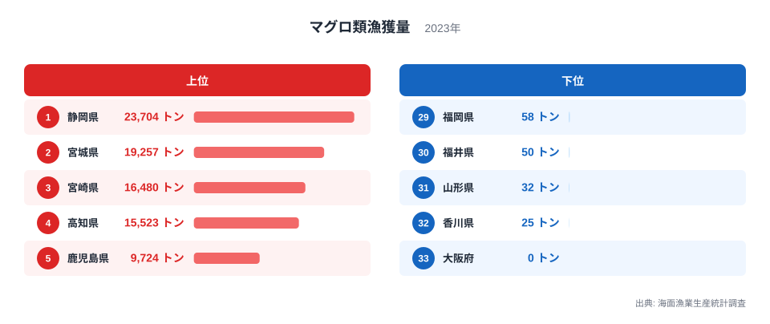
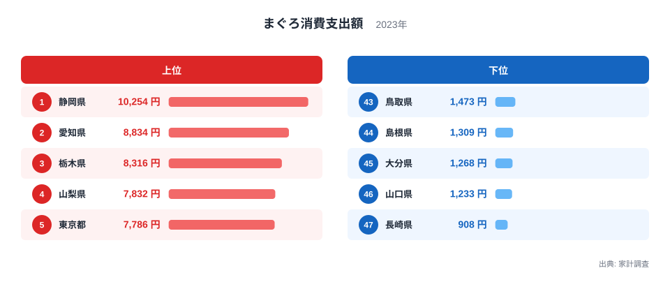
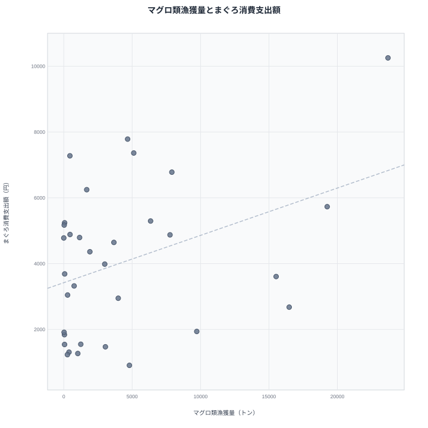
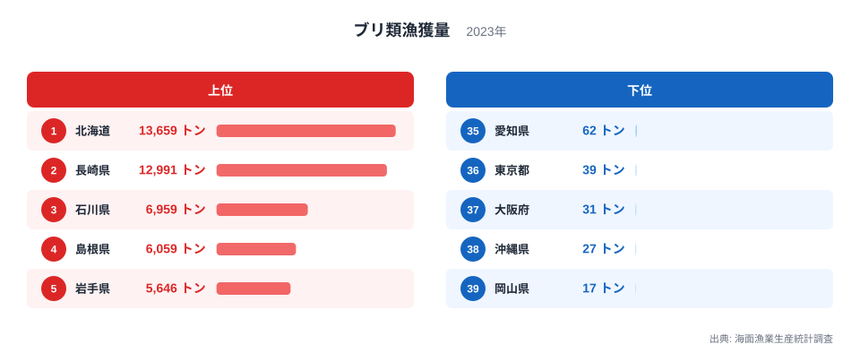
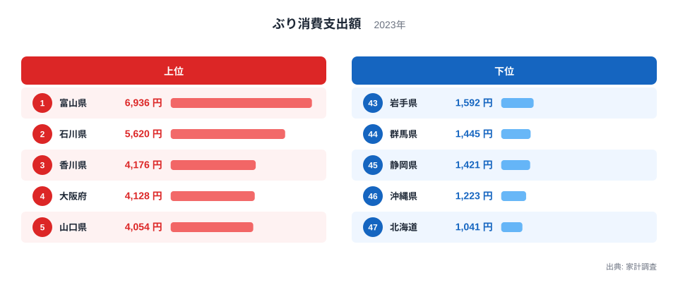
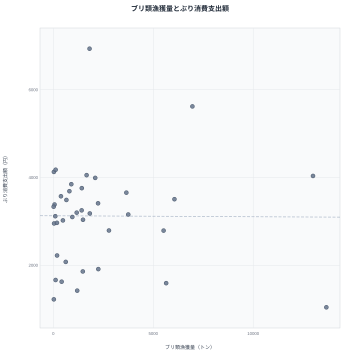

魚を多く獲る県は、その魚をたくさん食べる県でもあるのでしょうか。直感的にはそう思えますが、2023年のデータで確かめると、答えは魚種によって変わり、さらに「静岡県を入れるかどうか」でも変わります。農林水産省「海面漁業生産統計調査」の漁獲量と総務省「家計調査」の消費支出額を同じ2023年で突き合わせたところ、獲れる県と食べる県がはっきり重なるのはマグロの静岡県くらいで、全体としては大きくずれていました。

先に結論を言うと、マグロは静岡県が漁獲量でも消費支出額でも全国1位で、この1県だけを見れば「産地=消費地」です。ところが33都道府県の散布図で相関係数を出すと0.38にとどまり、静岡県を除くと0.15まで下がります。ブリは漁獲量1位の北海道が消費支出額では47位の最下位で、消費支出額1位の富山県は漁獲量で14位です。相関係数は-0.01で、ほぼ無相関でした。

> [!NOTE]
> 漁獲量は海面漁業生産統計調査の暦年値で、海に面しない内陸8県（栃木・群馬・埼玉・山梨・長野・岐阜・滋賀・奈良）は対象外。2019〜2022年は都道府県の値がそろって公表されていないため、漁獲量の最新年は2023年。消費支出額も同じ2023年にそろえ、家計調査の最新年（2024年）は使っていない。消費支出額は都道府県庁所在市の二人以上世帯が1年間に使った金額で、県民全体の平均ではない。

## マグロ類漁獲量｜上位は太平洋側の県

2023年のマグロ類漁獲量は、静岡県が23,704トンで1位、宮城県が19,257トンで2位、宮崎県が16,480トンで3位、高知県が15,523トンで4位、鹿児島県が9,724トンで5位です。上位5県はいずれも太平洋に面しており、1位の静岡県は2位の宮城県の1.2倍、5位の鹿児島県の2.4倍にあたります。[仮説] マグロ類は外洋を回遊する魚で、遠洋や近海のマグロ漁船の水揚げが集まる港を持つ県に、漁獲が偏るのではないでしょうか。検証には、県別の水揚げ港と漁船の統計が必要です。

下位は福岡県58トン、福井県50トン、山形県32トン、香川県25トン、大阪府0トンです。大阪府は統計表に0トンと載っている値で、きわめて少ないことは読み取れますが、単位に満たない少量なのか実績がないのかまでは、表からは区別できません。

内陸8県に加えて、愛知県・兵庫県・岡山県・広島県・佐賀県・熊本県の6県は、2023年の統計表にマグロ類の値そのものが載っていません。値が載っていない理由は表からは分かりません。この記事では、値のない県を0トンとはみなさず、順位にも散布図にも入れていません。値がないことと0であることは別で、0として混ぜると相関が人工的にゆがむためです。そのため、マグロのランキングと散布図は33都道府県の話になります。

<source-link href="/ranking/fishery-species-catch-tuna">マグロ類漁獲量ランキングをもっと見る</source-link>

## まぐろ消費支出額｜上位5県のうち3県は漁獲ランキングに登場しない

2023年のまぐろ消費支出額は、静岡県が10,254円で1位、愛知県が8,834円で2位、栃木県が8,316円で3位、山梨県が7,832円で4位、東京都が7,786円で5位です。静岡県は漁獲量でも1位なので、ここだけを見れば産地と消費地が重なっています。ところが、愛知県・栃木県・山梨県の3県は、先ほどのマグロ類漁獲量ランキングに現れません。栃木県と山梨県は海に面しておらず、愛知県は2023年の統計表にマグロ類の値が載っていない県です。

首都圏も上位に並びます。東京都に続き、神奈川県が7,363円で6位、千葉県が7,278円で7位です。[仮説] マグロは冷凍や冷蔵の輸送網が整った魚で、産地から離れていても流通しやすいため、消費支出額の大小は漁獲量よりも各地の食習慣に左右されているのではないでしょうか。検証には、冷凍と鮮魚を分けた購入データか、他の魚介との支出配分の比較が必要です。

下位は長崎県908円、山口県1,233円、大分県1,268円、島根県1,309円、鳥取県1,473円で、いずれも西日本の県です。1位の静岡県は最下位の長崎県の11.3倍にあたります。長崎県のマグロ類漁獲量は4,800トンで33県中10位ですが、消費支出額は47位でした。[仮説] 西日本では、まぐろ以外の魚が日常の食卓に選ばれやすく、魚介への支出がまぐろに向かっていないのではないでしょうか。検証には、家計調査の魚介類の品目別支出を県庁所在市ごとに比べる必要があります。

<source-link href="/ranking/tuna-consumption-expenditure">まぐろ消費支出額ランキングをもっと見る</source-link>

## マグロの散布図｜右上がりは静岡県が引っ張っている

漁獲量の値がある33都道府県で、マグロ類漁獲量（横軸）とまぐろ消費支出額（縦軸）を、いずれも2023年で散布図にしました。点線は回帰直線で、右上がりの傾きはあるものの、点はかなり散らばっています。相関係数は0.38で、弱い正の相関です。図の右端で最上段にある点が静岡県で、漁獲量23,704トン・消費支出額10,254円と、直線の上側に乗っています。この1県を除いた32都道府県で計算し直すと、相関係数は0.15まで下がり、ほぼ関係がなくなります。つまり「獲れる県はよく食べる」という右上がりの関係の大半は静岡県1県が作っており、他の32都道府県だけではほぼ関係がありません。

直線から大きく下にはずれている点もあります。縦軸の最下段にある点が長崎県で、漁獲量4,800トン・消費支出額908円です。横軸が15,000トンを超える静岡県・宮城県・宮崎県・高知県の4点のうち、宮崎県は16,480トンに対して消費支出額が2,677円と、静岡県の4分の1ほどです。宮崎県は漁獲量が3位の産地ですが、消費支出額は47都道府県中33位にとどまり、高知県も漁獲量4位に対して26位です。

逆に、直線の上側に大きく出ているのは首都圏の3都県ですが、理由は同じではありません。千葉県は漁獲量が450トンで33県中23位と少ないのに、消費支出額は7,278円と高く出ています。東京都は4,667トンで11位、神奈川県は5,115トンで9位と漁獲量は中位で、そのうえで消費支出額が7,786円と7,363円と、直線より3,200円から3,700円ほど上にあります。横軸5,000トン前後・縦軸7,000円台の2点が東京都と神奈川県です。[仮説] 人口の多い大消費地には全国から冷凍や冷蔵のマグロが集まり、千葉県のように漁獲が少ない県でも、東京都や神奈川県のように漁獲が中位の県でも、地元で獲れる量とは別に消費が積み上がるのではないでしょうか。検証には、県別の市場への入荷量が必要です。

> [!WARNING]
> この散布図は、漁獲量の値がある33都道府県だけの関係。消費支出額2位の愛知県、3位の栃木県、4位の山梨県は漁獲量の値がなく、図に載らない。大阪府は統計表の値が0トンのため図に含めており、除くと相関係数は0.40。相関があっても、漁獲量が消費を生んだとも、消費が漁獲を呼んだとも言えない。

## ブリ類漁獲量｜北海道と長崎が1万トン超で並ぶ

2023年のブリ類漁獲量は、北海道が13,659トンで1位、長崎県が12,991トンで2位です。3位の石川県は6,959トンで、1位と2位の約半分にとどまり、続く島根県が6,059トン、岩手県が5,646トンです。上位5県は、北海道、日本海側の石川県と島根県、東北の太平洋側の岩手県、東シナ海に面した長崎県と、海域がばらけています。マグロのように太平洋側へ集中していないことが、ブリの漁獲の特徴です。

下位は愛知県62トン、東京都39トン、大阪府31トン、沖縄県27トン、岡山県17トンです。内湾に面した愛知県・東京都・大阪府・岡山県と、離島の県である沖縄県が並びます。ブリ類は内陸8県を除く39都道府県のすべてに値があり、マグロのように値のない県は出ていません。そのため、ブリの散布図は39県で描けます。

<source-link href="/ranking/fishery-species-catch-yellowtail">ブリ類漁獲量ランキングをもっと見る</source-link>

## ぶり消費支出額｜漁獲上位とは別の顔ぶれ

2023年のぶり消費支出額は、富山県が6,936円で1位、石川県が5,620円で2位、香川県が4,176円で3位、大阪府が4,128円で4位、山口県が4,054円で5位です。ブリ類漁獲量の上位5県と見比べると、重なるのは石川県だけです。富山県の漁獲量は1,814トンで39県中14位、香川県は118トンで32位、大阪府は31トンで37位にすぎません。

富山県の1位は、ブリの食文化の強さで説明されることが多く、冬の寒ブリや、年末年始にブリを食べる習慣が知られています。[仮説] 地元の漁獲量よりも、こうした食習慣が消費支出額を押し上げているのではないでしょうか。検証には、月別の家計調査データで、年末年始に支出が集中しているかを確かめる必要があります。

下位は北海道1,041円、沖縄県1,223円、静岡県1,421円、群馬県1,445円、岩手県1,592円です。1位の富山県は最下位の北海道の6.7倍にあたります。漁獲量1位の北海道が最下位で、漁獲量5位の岩手県も43位と、漁獲の多い県でも消費支出額が低い県が下位に入っています。北海道の消費支出額は札幌市の二人以上世帯の値である点に注意が必要です。

<source-link href="/ranking/yellowtail-consumption-expenditure">ぶり消費支出額ランキングをもっと見る</source-link>

## ブリの散布図｜北海道が右端の最下段、相関は-0.01

漁獲量の値がある39都道府県で、ブリ類漁獲量（横軸）とぶり消費支出額（縦軸）を、2023年で並べました。点は右上がりにも右下がりにもならず、回帰直線はほぼ水平です。相関係数は-0.01で、無相関です。

最も目立つのは右端の北海道です。漁獲量13,659トンは39県で最大なのに、消費支出額は1,041円と図の最下段にあります。そのすぐ左にある、横軸12,991トンで縦軸4,035円の点が長崎県で、同じ漁獲量の規模でも消費支出額は約3.9倍違います。逆に、図の最上段にあるのが富山県です。漁獲量は1,814トンと少ないのに、消費支出額は6,936円で、直線から最も上に離れています。図の左端近くには、漁獲量が100トン前後以下なのに消費支出額が4,100円台の点が2つあり、これが香川県の118トン・4,176円と大阪府の31トン・4,128円です。

[仮説] ブリは、産地での水揚げ量よりも、冬の寒ブリや年末年始の行事食のように地域の食習慣と結びついた魚で、漁獲の少ない県でも他の地域から買って食べる文化があるため、漁獲量と消費支出額が切り離されるのではないでしょうか。検証には、県別の月別支出と、市場への入荷量が必要です。

> [!TIP]
> 相関係数は、1つの県を除くだけで大きく動くことがある。ブリで北海道を除いた38県で計算し直すと0.22、マグロで静岡県を除くと0.15。どの県が離れているかを図で確かめ、その県を除いても傾向が残るかを見ると、1県に引っ張られた相関を見分けられる。

## まとめ

- マグロ類は静岡県が漁獲量23,704トン、消費支出額10,254円でどちらも1位ですが、33都道府県の相関係数は0.38にとどまり、静岡県を除くと0.15まで下がります
- まぐろ消費支出額の上位5県のうち、愛知県・栃木県・山梨県の3県は漁獲量の値がなく、散布図に載りません
- ブリ類は漁獲量1位の北海道が13,659トンで、消費支出額は47位の1,041円です。消費支出額1位の富山県は6,936円で、漁獲量は14位です
- ブリ類の39都道府県での相関係数は-0.01でほぼ無相関で、北海道を除いても0.22と弱い関係にとどまります
- 値の載っていない県は0として扱わず、両方の値がある県だけで相関を計算しました。相関は因果を示さないため、産地と消費地のずれの理由は、食習慣や流通を調べる追加データで確かめる必要があります
