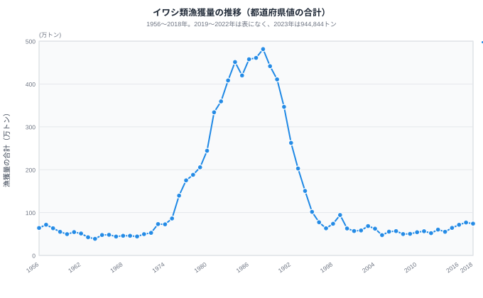
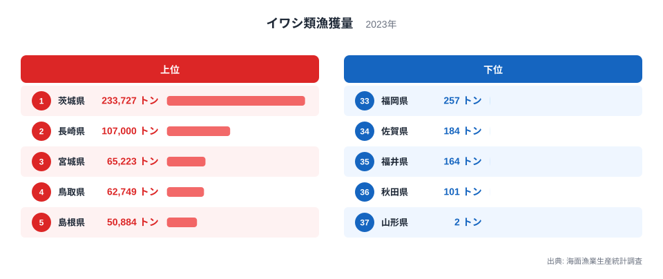

「静岡のカツオ」「青森のホタテ」「兵庫の松葉ガニ」──これらの特産イメージは、最新の漁獲量でも成り立つのでしょうか。2023年の都道府県別データで確かめると、静岡県はカツオ類で首位を保ち、兵庫県は松葉ガニの首位を鳥取県に譲りました。青森県のホタテガイは漁獲量の表では416トンですが、この表に養殖は含まれないため、特産かどうかは判定できません。

一方で、北海道のホタテガイ・スケトウダラ・コンブ類は2023年も9割を超え、寡占は動いていません。海面漁業生産統計調査の魚種別・都道府県別データ（1956〜2018年と2023年）から12魚種を、首位県が固定される魚種と入れ替わる魚種に分けて読みます。とくにイワシ類は、1988年のピークと比べれば80%減ですが、底だった2005年の約2.0倍まで戻っていて、特産の地図が書き換わっています。

> [!NOTE]
> 本データは海面漁業の漁獲量で、養殖の収獲量は含みません。海のない8県（栃木・群馬・埼玉・山梨・長野・岐阜・滋賀・奈良）は0トンではなく集計外です。年は1956〜2018年と2023年だけで、2019〜2022年は都道府県別の値がそろわず欠けています。本文の「合計」は値が載っている都道府県の合計で、2023年はサンマを除いて全国値とほぼ一致します。サンマは一部の県の値が公表されず、合計が全国値より約4%少なくなります。

## 2023年も崩れない北海道の1県寡占──ホタテ・スケトウダラ・コンブ

[北海道](/areas/01000)が9割を超える魚種は、12魚種のうち3つです。ホタテガイは合計330,592トンのうち北海道が330,176トンで99.9%、スケトウダラは合計123,002トンのうち113,731トンで92.5%、コンブ類は合計44,841トンのうち42,536トンで94.9%を占めました。2013〜2018年の北海道の割合は、ホタテガイが99.1〜99.7%、スケトウダラが90.0〜97.1%、コンブ類が90.2〜97.3%で、2023年はいずれもこの幅の中です。つまり寡占は強まったのではなく、同じ水準で動いていません。ほかの魚種は首位県でも15.7%から51.0%にとどまります。最も高い北海道のサンマの51.0%も、一部の県の値が公表されない合計に対する割合です。

ただし、この寡占は昔からの固定ではありません。ホタテガイの北海道の割合は1970年が43.6%、1975年が36.5%で、この2年は青森県が北海道を上回っていました。合計が1975年の30,274トンから2023年の330,592トンへ10.9倍に増える中で、北海道は11,036トンから330,176トンへ29.9倍に伸び、割合は1980年の82.7%、2000年の99.0%と上がりました。

スケトウダラは逆の動きです。北海道の割合は1960年が94.6%、1990年が67.7%、2000年が87.6%、2023年が92.5%と、下がってから戻りました。1990年から2023年にかけて、北海道は590,014トンから113,731トンへ81%減ったのに対し、北海道以外は281,394トンから9,271トンへ97%減っています。割合が戻ったのは北海道が増えたからではなく、北海道以外の縮小のほうが大きかったからです。時期は1977年の200海里水域の設定と重なりますが、因果はこの表だけでは確かめられません。

コンブ類は1956年から北海道が中心で、割合は最も低い1970年でも79.4%でした。3魚種に共通するのは冷たい海という条件だと説明されることが多いものの、この表に水温は含まれないため、確かめるには海域別の水温データとの突き合わせが必要です。

> [!WARNING]
> 古い年の東京都は、東京の漁場を表しません。1972年のスケトウダラは東京都が1,466,890トンで、合計3,035,285トンの半分近くを占めました。1968年のズワイガニも東京都が32,593トンで、合計61,679トンの半分を超えます。計上の基準は遠洋で操業する漁船の所属先などの影響が考えられますが、この表からは確かめられません。昔の都道府県別の順位や割合を、特産地の根拠にしないでください。

あわせて見る: [ホタテガイ漁獲量ランキング](/ranking/fishery-species-catch-scallop) / [スケトウダラ漁獲量ランキング](/ranking/fishery-species-catch-pollock) / [コンブ類漁獲量ランキング](/ranking/fishery-species-catch-kelp)

## イワシは消えたのではなく、底から戻ってきた

イワシ類の合計は、1988年に4,814,223トン（約481万トン）でピークを迎え、1995年には1,016,350トンと79%減りました。2005年の474,172トンで底を打つと、2015年は642,366トン、2018年は741,437トンと増え、2023年は944,844トンに達しています。1988年に比べれば80%減ですが、2005年の約2.0倍、2015年から47%増です。2023年の時点で「イワシが消えた」とは言えません。

折れ線は2018年で止めています。2019〜2022年の都道府県別の値が表になく、2018年と2023年を線でつなぐと、5年の空白を連続した変化に見せてしまうためです。2018年までの形は、1970年の441,576トンから1980年の2,441,960トン、1988年の4,814,223トンへの急増と、その後の急減です。数十年規模の変動があると見るのが自然ですが、原因はこの表からは分かりません。また「イワシ類」はマイワシ・ウルメイワシ・カタクチイワシ・シラスの合計で、1988年のピークと2023年が同じ魚種構成かどうかも、この表では確かめられません。

<source-link href="/ranking/fishery-species-catch-sardine">イワシ類漁獲量ランキング（都道府県別）をもっと見る</source-link>

2023年の上位は、[茨城県](/areas/08000)が233,727トン、長崎県が107,000トン、宮城県が65,223トン、鳥取県が62,749トン、島根県が50,884トンです。茨城県だけで合計の24.7%を占め、上位5県の合計は519,583トンで全体の55.0%と、2015年の47.1%から集中が進みました。茨城県は1988年も937,379トンで首位でしたが、2013〜2015年は千葉県・三重県・長崎県が首位で、茨城県が首位に戻ったのは2016年からです。

2015年と比べると、太平洋側で場所が動いています。太平洋側の北寄りにある千葉県・茨城県・福島県・宮城県の4県の合計は115,819トンから387,423トンへ3.3倍に増え、三重県は65,501トンから14,558トン、宮崎県は62,823トンから21,030トンへ減りました。来遊域の変化によるものかもしれませんが、確かめるには魚種別・海域別の資源データが要ります。日本海側も一様ではなく、鳥取県と島根県は上位に入る一方、下位の5県は福岡県257トン、佐賀県184トン、福井県164トン、秋田県101トン、山形県2トンです。東京都と沖縄県は2023年の値が載っていません。

## 首位県が入れ替わる魚種、動かない魚種

首位県が一度も変わらない魚種は、12魚種のうち7つです。2013〜2018年と2023年の7つの年で、ホタテガイ・スケトウダラ・コンブ類・サンマは北海道、カツオ類とマグロ類は静岡県、タイ類は長崎県が毎回首位でした。2023年のカツオ類は静岡県が56,969トンで合計の29.6%、2015年の81,295トンからは減りましたが、首位は動いていません。

残る5魚種は、年によって首位が変わります。イワシ類は先に見たとおりです。スルメイカ（いか類のうちスルメイカだけの値）は北海道と青森県が入れ替わり、2023年は青森県が5,370トン、北海道が5,012トンで差は358トンでした。合計は2015年の128,838トンから21,199トンへ84%減っています。ブリ類は2013〜2018年に長崎県と島根県が首位を分け合い、2023年は北海道が13,659トンで首位に立ちました。ズワイガニは次の節で扱います。

サバ類は2018年まで茨城県が首位で、2015年は143,403トン、2018年は104,900トンでしたが、2023年は16,253トンに減り、長崎県が76,146トンで首位に立ちました。合計も2015年の529,921トンから269,635トンへ49%減っています。サンマは北海道が首位を保つものの、2023年の合計は24,697トンで、2015年の110,945トンの約2割です。北海道の割合は1970年以降37.4%から57.5%の範囲にあり、1県が9割を占める3魚種とは性格が異なります。

> [!TIP]
> 首位県は1年だけで判断しないでください。複数年で首位が動く魚種は、特産地として固定された姿より、その年の水揚げに左右される姿として読むほうが安全です。

12魚種の中で最も漁獲量が多い魚種を県ごとに見ると、2015年はイワシ類が19県、サバ類が7県、マグロ類が4県などに割れていましたが、2023年はイワシ類が25県と、39県の過半を占めました。トン数での比較なので、水揚げ重量の出やすいイワシ類が有利になりやすく、12魚種以外の魚も含まれません。それでも、イワシ類が最多の県が6県増えたことは、2023年の水揚げがイワシ類に傾いたことを示します。

あわせて見る: [サバ類漁獲量ランキング](/ranking/fishery-species-catch-mackerel) / [スルメイカ漁獲量ランキング](/ranking/fishery-species-catch-japanese-squid) / [サンマ漁獲量ランキング](/ranking/fishery-species-catch-pacific-saury) / [カツオ類漁獲量ランキング](/ranking/fishery-species-catch-bonito)

## ズワイガニは量が半減しても、日本海側に残る

ズワイガニの合計は、2015年の4,412トンから2023年の2,392トンへ46%減りました。それでも産地は日本海側に集まっていて、鳥取県が533トン、兵庫県が524トン、福井県が450トン、石川県が351トン、新潟県が206トンです。この5県は2023年に合計の86.3%を占め、同じ5県の2015年の71.1%から高まりました。2015年は北海道が977トンありましたが、2023年は75トンで92%減っています。

首位は2015年が兵庫県の1,064トン、2023年が鳥取県の533トンで、鳥取県と兵庫県の差は9トンです。2017年は北海道が972トンで兵庫県の942トンを上回っていて、この魚種の首位は僅差で動いています。兵庫県・鳥取県・福井県の3県を合わせた割合は、2015年の55.7%から2023年の63.0%へ上がりました。量が減るなかで「松葉ガニ」「越前ガニ」といった呼び名のある産地へ集中しており、日本海側の特産という姿は崩れていません。少量でも特産として知られる理由に、量が少なく単価が高いことが挙げられますが、この表に価格は含まれず、確かめるには市場価格のデータが要ります。

あわせて見る: [ズワイガニ漁獲量ランキング](/ranking/fishery-species-catch-snow-crab)

## まとめ──北海道の寡占は固定、回遊魚は入れ替わる

- **固定される特産**: 2023年の北海道はホタテガイ99.9%・スケトウダラ92.5%・コンブ類94.9%で、2013〜2018年と同じ水準です。首位県が7つの年で一度も変わらない魚種は12魚種のうち7つです。
- **入れ替わる特産**: イワシ類の首位は2013〜2015年に千葉県・三重県・長崎県と動き、2016年以降は茨城県です。サバ類の茨城県は2015年の143,403トンから2023年の16,253トンへ減りました。
- **量の変化**: イワシ類は1988年比で80%減でも2005年の約2.0倍です。スルメイカは2015年比で84%減、サンマは約2割になりました。
- **読み方の注意**: 2019〜2022年は欠けており、2018年と2023年の間の動きは分かりません。「静岡のカツオ」は2023年も首位、「兵庫の松葉ガニ」は首位の鳥取県に9トン差で次ぎ、「青森のホタテ」は養殖を含まないこの表では判定できません。

農林水産分野の指標は[カテゴリのページ](/category/agriculture)からも探せます。
