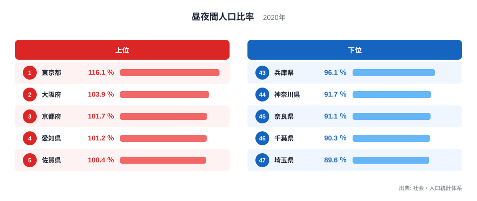
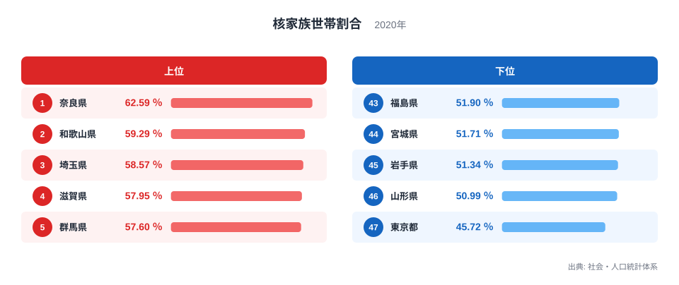
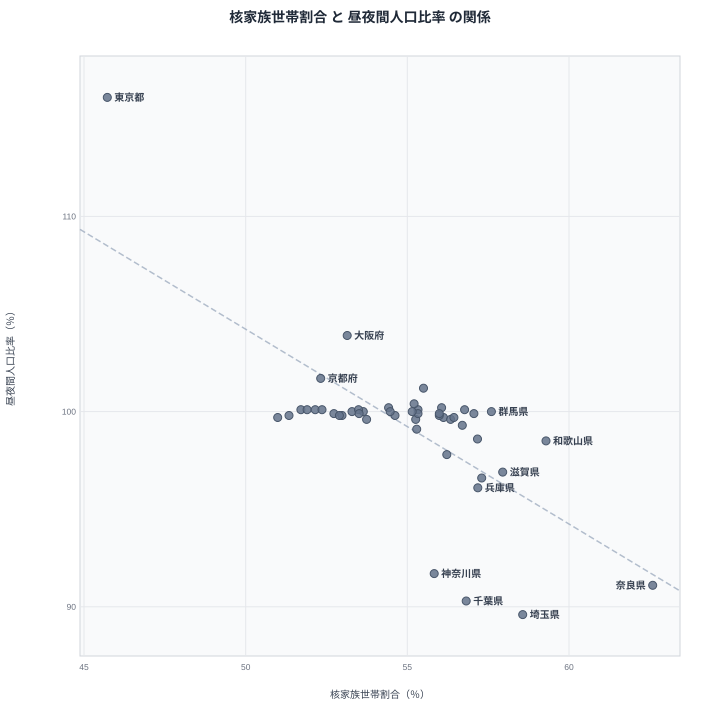

核家族の世帯が多い県ほど、昼間の人口は夜より少なくなるのでしょうか。2020年の国勢調査で見ると、答えはおおむね「はい」です。核家族世帯割合の上位10県のうち8県が、昼夜間人口比率の下位10県に入っています。反対に、核家族の割合が全国で最も低い東京都は、昼夜間人口比率が116.1％で全国1位です。

ただし相関係数は-0.71で、東京都を除くと-0.58まで下がります。強い関係に見えても、その一部は東京都と首都圏、近畿の数県が作っているかもしれません。この記事では、まず両方の指標のランキングを並べ、そのうえで散布図に直し、外れ値を外したときに関係がどこまで残るかを確かめます。

## 昼夜間人口比率は、東京都以外はほぼ平らです

昼夜間人口比率は、昼間人口を夜間人口(常住人口)で割って100を掛けた値です。100を超えれば通勤や通学で人が入ってくる県、100を下回れば出ていく県を意味します。

<source-link href="/ranking/day-time-population-ratio">昼夜間人口比率ランキングをもっと見る</source-link>

2020年は、東京都が116.1％で1位、大阪府が103.9％で2位、京都府が101.7％で3位、愛知県が101.2％で4位、佐賀県が100.4％で5位でした。下位は、埼玉県が89.6％で47位、千葉県が90.3％で46位、奈良県が91.1％で45位、神奈川県が91.7％で44位、兵庫県が96.1％で43位です。1位と最下位の差は1.3倍で、東京都と埼玉県という両端の差がそのまま表れています。

目を引くのは、真ん中の平らさです。6位の石川県から35位の熊本県までの30県は、99.6％から100.2％のわずか0.6ポイントの幅に収まっています。100を超える県は14都道府県あるものの、そのほとんどは100.1％前後で、実質的に昼夜の人口が釣り合っている県です。つまりこの指標で「昼に人が集まる県」「昼に人が減る県」と呼べるのは、両端の十数県に限られます。

下位5県の所在地を見ると、東京圏の埼玉県、千葉県、神奈川県と、近畿の奈良県、兵庫県に分かれます。いずれも東京都または大阪府と県境を接している県です。

> [!NOTE]
> 昼夜間人口比率は、常住地と通勤・通学先が別の県にある人の動きだけで決まります。県内で通勤が完結していれば、人口がどれだけ多くても100に近づきます。昼間人口の実数ランキングとは別の指標です。

## 核家族が多い上位10県のうち8県は、昼夜間人口比率の下位10県です

核家族世帯割合は、一般世帯のうち、夫婦のみ、夫婦と子、ひとり親と子で構成される世帯が占める割合です。一人暮らしの単独世帯は核家族に含まれません。

<source-link href="/ranking/nuclear-family-households-ratio">核家族世帯割合ランキングをもっと見る</source-link>

上位は、奈良県が62.59％で1位、和歌山県が59.29％で2位、埼玉県が58.57％で3位、滋賀県が57.95％で4位、群馬県が57.6％で5位でした。下位は、東京都が45.72％で47位、山形県が50.99％で46位、岩手県が51.34％で45位、宮城県が51.71％で44位、福島県が51.9％で43位です。1位と最下位の差は1.4倍にとどまり、昼夜間人口比率の1.3倍と並ぶ小さな幅です。

核家族割合の上位10県は、奈良県、和歌山県、埼玉県、滋賀県、群馬県、岐阜県、兵庫県、三重県、宮崎県、千葉県です。このうち、群馬県と宮崎県を除く8県が、昼夜間人口比率の下位10県(38位から47位)に入っています。前の節で見た昼夜間人口比率の下位5県も、神奈川県を除く4県が核家族割合の上位10県にいます。逆の外れ方もあり、神奈川県は核家族割合が55.83％で20位と中位なのに、昼夜間人口比率は91.7％で44位です。

核家族割合の下位側は、2種類の県が並んでいます。東京都は単独世帯(寮や下宿の単身者を含みます)の割合が50.24％で全国1位で、核家族と単独世帯を足すと約96％に達します。一方で山形県は、核家族割合が低いだけでなく単独世帯割合も28.43％で47位です。核家族でも単独でもない世帯が約2割(20.6％)を占める計算です。この残りには、核家族以外の親族世帯のほか、親族以外の世帯も含まれます。同じ「核家族が少ない」でも、東京都は単身世帯が多いことが理由で、山形県は核家族でも単独でもない世帯が多いことが理由です。

## 散布図にすると相関係数は-0.71、東京都を除くと-0.58です

2つの指標を47都道府県の点として重ねたのが次の散布図です。横軸が核家族世帯割合、縦軸が昼夜間人口比率で、右下に向かうほど「核家族が多く、昼に人が出ていく県」です。

あわせて見る: [核家族世帯割合ランキング](/ranking/nuclear-family-households-ratio)・[昼夜間人口比率ランキング](/ranking/day-time-population-ratio)

相関係数は-0.71で、人口規模の影響を取り除いた偏相関も-0.70とほぼ変わりません。点の並びは、左上に東京都が1点だけ大きく離れ、右下に奈良県、埼玉県、千葉県、神奈川県が固まり、やや上に兵庫県が続く形をしています。図には、本文で名前を挙げる県を書き込みました。東京都は1点で関係を引っ張っているため、東京都を除いた46県で計算し直すと相関係数は-0.58に下がりました。順位だけで見た順位相関も-0.59で、東京都を除くか、順位に直すと、関係は「強い」から「中程度」に弱まります。

関係が東京都以外にも残るかを見るために、さらに外していきます。東京都、埼玉県、千葉県、神奈川県の東京圏4都県を除いた43県では相関係数が-0.66でした。これに大阪府、京都府、兵庫県、奈良県の4府県を加えた8都府県を除くと、39県で-0.46まで下がります。この8都府県は、昼夜間人口比率の上位3県(東京都、大阪府、京都府)と下位5県(埼玉県、千葉県、奈良県、神奈川県、兵庫県)にあたり、近畿の滋賀県と和歌山県は39県に残っています。近畿の6府県だけを外した41県では-0.67で、ほとんど変わりません。東京圏4都県と近畿6府県(上の8都府県に滋賀県と和歌山県を加えた10都府県)を外した37県では-0.33です。負の関係は残りますが、東京圏と近畿をあわせて外すほど弱まります。

ただし、この弱まりは、東京圏や近畿の通勤圏が関係を作っている大きさを測ったものではありません。縦軸の両端にある県を外せば、縦軸の散らばりそのものが狭まり、相関係数は下がりやすくなります。実際、昼夜間人口比率が100から最も離れた8県(京都府の代わりに岐阜県が入ります)を除いても-0.47で、上の8都府県を除いた-0.46とほとんど変わりません。47県から無作為に8県を外す計算を1万回繰り返すと、相関係数の中央値は-0.73で、-0.46以上に弱まったのは0.7％でした。大都市圏の県が関係を強めている可能性はありますが、その大きさは、縦軸の端にいることの効果と、この計算だけでは切り分けられません。

もう一つの疑問は、核家族の少なさが単に単独世帯の多さの裏返しではないか、という点です。核家族割合と単独世帯割合は同じ一般世帯を分母にした構成比なので、一方が高ければ他方が低くなりやすい関係にあります。実際、[単独世帯割合](/ranking/single-person-household-ratio)と昼夜間人口比率の相関係数は0.47ですが、東京都を除くと0.16に落ちます。単独世帯が多いほど昼に人が集まるという関係は、ほぼ東京都だけの話です。これに対し、単独世帯割合の影響を取り除いても、核家族割合と昼夜間人口比率の偏相関は-0.64と強いままです。核家族の多さと昼夜間人口比率の間には、単独世帯割合の違いだけでは説明できない関係が残っています。

> [!TIP]
> 外れ方を見ると読み方が変わります。群馬県は核家族割合が57.6％で5位ですが、昼夜間人口比率は100.0％で16位とほぼ釣り合っています。核家族が多いだけでは、通勤の出入りの大きさは決まりません。[仮説] 大都市の通勤圏に入っているかどうかが、もう一つの鍵です。検証には、県境をまたぐ通勤者の人数を示すデータが必要です。

## 因果とは言えない理由と、次に確かめること

> [!WARNING]
> ここで示したのは47都道府県の集計値同士の相関です。核家族の世帯が実際に他県へ通勤しているかどうかは、この図からは分かりません。県全体の平均なので、同じ県の中の市区町村ごとの違いも見えません。

[仮説] 子育て世帯が、地価や家賃の高い都心を避けて隣県の住宅地に住み、働き手は都心へ通勤するため、核家族の多い住宅地ほど昼間の人口が減るという説明です。住宅の取得しやすさや通勤圏の広がり、産業の立地といった共通の背景が、核家族の多さと昼夜間人口比率の両方を動かしている可能性も残ります。検証には、市区町村間の通勤流動と世帯の年齢構成を組み合わせた分析が必要で、この記事の47点だけでは確かめられません。

もう一つ、見落としやすい点があります。昼夜間人口比率は年齢別の内訳を持たないので、昼に出ていくのが働く世代なのか通学する子どもなのかは区別できません。県外の学校へ通う子どもが含まれる可能性もありますが、その寄与は今回のデータでは切り分けられていません。

通勤時間そのものは、別の調査(住宅・土地統計調査、2018年)で見られます。通勤90分超の世帯の割合は、埼玉県が最も高くなっています。母集団と調査年が違い、昼夜間人口比率との関係を調べた結果ではないため本記事の図には使いませんが、関心のある方は[通勤90分超の世帯が多い県](/blog/long-commute-telework-potential)の記事を参照してください。昼夜間人口比率が最下位の埼玉県の事情は[埼玉が昼夜人口比率で全国最下位の理由](/blog/population-density-urbanization)に、昼間人口の実数と比率の見方は[昼間人口1位だけでは吸引力は分からない](/blog/day-time-population-prefecture-gap)にまとめています。県ごとの人口と世帯の姿は[埼玉県](/areas/11000)や[奈良県](/areas/29000)の県ページでも確かめられます。人口に関する他の指標は[人口カテゴリ](/category/population)から探せます。

## データについて

使った指標は、昼夜間人口比率と核家族世帯割合で、どちらも2020年の国勢調査を社会・人口統計体系から引いた値です。単独世帯割合も同じ2020年の国勢調査で、相関係数のうち図に描いていないもの(東京都を除いた値、単独世帯割合を取り除いた偏相関、順位相関)は、散布図と同じ47点から本記事のために計算し直した値です。除外した県の組を変えた相関(近畿6府県だけを外した41県、東京圏4都県と近畿6府県を外した37県、昼夜間人口比率が100から最も離れた8県を外した39県、無作為に8県を外す1万回の計算)も、同じ47点から計算し直した値です。無作為の計算は乱数の種を固定した結果で、中央値と割合は種によって少し変わります。人口を統制した偏相関は、サイトの相関スナップショットの値(統制変数は2025年の総人口)を使っています。無作為除外の乱数の種(47)、統制に使った総人口の年、各除外の相関は、再現用の計算スクリプトと散布図の出典ファイルに記録しています。

当初は一般世帯数、人口性比、昼間人口の3指標を組み合わせる企画でした。一般世帯数と昼間人口は実数なので、人口の多い県が上位に並ぶだけの比較になります。人口性比は2024年の人口推計で、2020年の国勢調査とは年も調査も異なるため、同じ図には重ねませんでした。そのため、人口規模に左右されない比率同士の組み合わせに改めています。

## まとめ

- 昼夜間人口比率は、東京都が116.1％で1位、埼玉県が89.6％で47位で、差は1.3倍です。6位から35位までの30県は100前後に収まります。
- 核家族世帯割合は、奈良県が62.59％で1位、東京都が45.72％で47位で、差は1.4倍です。
- 核家族割合の上位10県のうち8県が、昼夜間人口比率の下位10県に入ります。
- 相関係数は-0.71ですが、東京都を除くと-0.58、東京圏4都県と大阪府・京都府・兵庫県・奈良県の4府県(昼夜間人口比率の上位3県と下位5県)を除くと-0.46に弱まります。負の関係は残りますが、縦軸の両端を外せば弱まりやすいため、大都市圏の寄与の大きさは切り分けられていません。
- 単独世帯割合の影響を取り除いても偏相関は-0.64で、核家族の多さは単独世帯の少なさの言い換えではありません。ただし因果は未確認です。
