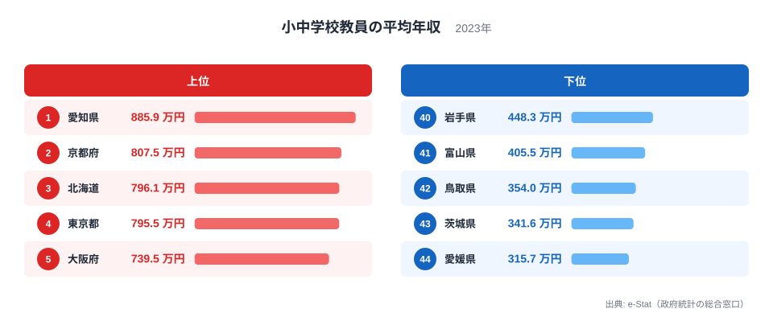
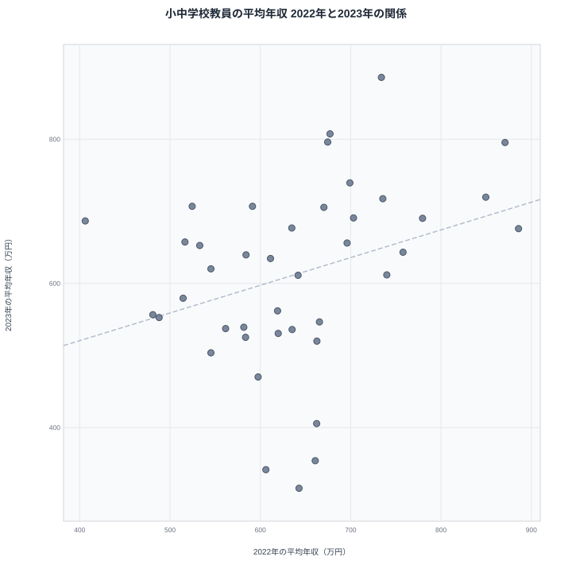
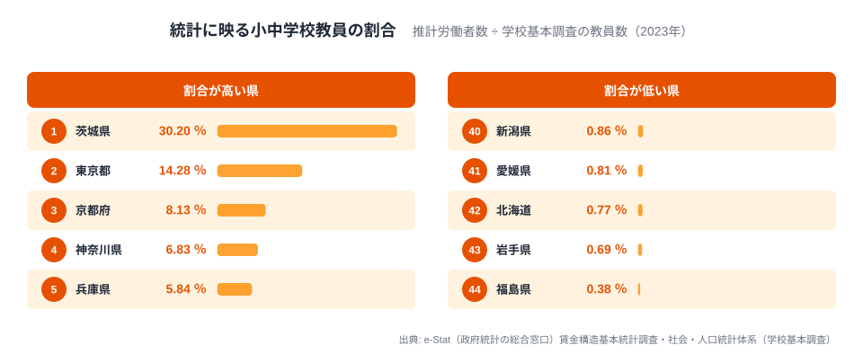
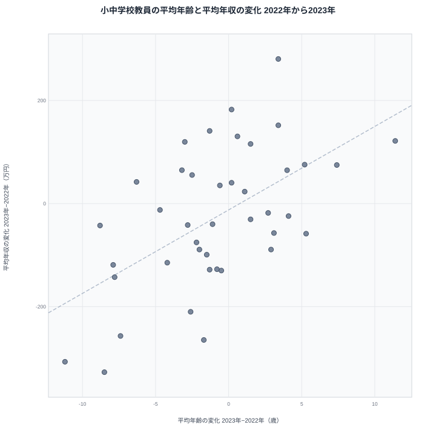

小中学校教員の平均年収を都道府県別に並べると、2023年は愛知県が885.9万円で1位、愛媛県が315.7万円で最下位となり、差はおよそ2.8倍に開きます。ただし、この数字は公立学校の教員だけを集めた統計ではありません。厚生労働省の賃金構造基本統計調査から推計された小中学校教員の標本平均で、県の教員全体の待遇を測ったものではありません。

同じ指標を2020年から2023年まで並べ直すと、1位は2020年が東京都、2021年が京都府、2022年が千葉県、2023年が愛知県と、4年間で4つの県に入れ替わっています。愛媛県の平均年収は2022年の642.85万円から2023年の315.72万円へ、1年でほぼ半分になりました。

タイトルの問いに先に答えると、首位が毎年変わる理由の一つは、統計に映る教員の顔ぶれが年ごとに入れ替わっていることです（**[仮説]**）。同じ表の平均年齢が北海道、鳥取県、愛媛県、鹿児島県の4県で1年に8歳以上動いていたことがこの仮説を一部裏づけますが、県ごとの待遇の違いとどちらがどれだけ効いているかは確かめられていません。

もう一つ押さえたいのは、この統計が映している小中学校教員の数が少ないことです。調査結果から推計された2023年の小中学校教員は全国で32,960人にとどまり、学校基本調査の小学校教員数と中学校教員数を合わせた671,782人の約4.9%でした。この記事では、2023年の順位を確かめたうえで、年別の動きと推計人数、平均年齢を手がかりに、県別の順位をどこまで読めるかを整理します。

## 2023年の上位5県と下位5県

<source-link href="/ranking/school-teacher-annual-income">教員平均年収ランキングの全件データを見る</source-link>

2023年の小中学校教員の平均年収は、上位5県が1位の愛知で885.9万円、2位の京都で807.5万円、3位の北海道で796.1万円、4位の東京で795.5万円、5位の大阪で739.5万円でした。大都市圏の都府県が並ぶなかに、北海道が3位で入っています。

下位5県は、44位の愛媛が315.7万円、43位の茨城が341.6万円、42位の鳥取が354.0万円、41位の富山が405.5万円、40位の岩手が448.3万円です。愛媛は四国、茨城は関東、鳥取は中国、富山は北陸、岩手は東北にあり、特定の地域にまとまっていません。同じ関東地方に4位の東京都がある茨城県が、下位から2番目に入っている点も目を引きます。

最大の愛知と最小の愛媛の差は約570万円で、倍率では2.8倍です。ここまでは、県別ランキングでよく見る読み方です。ただ、この並びを制度や地域の特性で説明する前に、同じ指標の過去の年がどうなっていたかを確かめる必要があります。次の節で、2020年から2023年までを並べます。

> [!NOTE]
> ここでの「教員平均年収」は、賃金構造基本統計調査（統計表ID 0003445758）の一般労働者・男女計・小中学校教員について、6月のきまって支給する現金給与額を12倍し、前年1年間の賞与その他特別給与額を加えた推計年収です。公立学校の教員だけに限った統計ではなく、税・社会保険料などを引く前の標本平均で、個人の実際の年収ではありません。厚生労働省の「調査の概要」（令和5年）は、調査の範囲を「教育，学習支援業」を含む16大産業の、常用労働者5人以上の民営事業所と、10人以上の公営事業所と書いています。ただし、これは調査全体の標本の範囲で、この表の集計に公営事業所が含まれるかは未確認です（「データについて」を参照）。

## 首位も最下位も、4年間で一度も同じ県にならない

同じ指標を2020年から2023年まで取り直すと、1位も最下位も毎年入れ替わっています。値がある県の数は年によって違い、2020年は38県、2021年は43県、2022年と2023年はどちらも44県です。

1位は、2020年が東京都で813.8万円、2021年が京都府で822.17万円、2022年が千葉県で885.89万円、2023年が愛知県で885.89万円でした。最下位は、2020年が茨城県で322.2万円、2021年が石川県で245.16万円、2022年が長崎県で406.17万円、2023年が愛媛県で315.72万円です。1位も最下位も、4年間で一度も同じ県になっていません。

2022年の千葉県と2023年の愛知県は、小数第2位まで同じ885.89万円です。別の県の別の年で同じ値が出るのは珍しいため、e-Stat の元の値から計算し直しました。千葉県の2022年は、月例給与454.6千円を12倍して賞与3,403.7千円を足した8,858.9千円です。愛知県の2023年は、月例給与516.1千円を12倍して賞与2,665.7千円を足した、やはり8,858.9千円でした。取り込みの誤りではなく、偶然の一致です。

極端に低い値にも事情があります。2021年の石川県の245.16万円は、推計労働者数が40人で、年間賞与がちょうど0.0千円と公表されている値です。月例給与204.3千円を12倍しただけの金額が、そのまま年収として計算されています。2020年に最下位だった茨城県の322.2万円も、推計労働者数が10人で、賞与は0.0千円でした。

## 同じ県でも1年で順位が大きく動く

図は、横軸が2022年、縦軸が2023年の平均年収で、両方の年に値がある41県だけを描いています。前年に高い県が翌年も高ければ、点は右上がりの線に沿って並びますが、実際の点は広く散らばっています。2022年から2023年にかけて平均年収が100万円以上動いた県は41県のうち19県、200万円以上動いた県は6県でした。200万円以上動いたのは、愛媛、鳥取、長崎、茨城、富山、千葉です。四国、中国、九州、関東、北陸にまたがり、動いた県は地域にまとまっていません。

愛媛県の平均年収は、2021年が692.05万円、2022年が642.85万円、2023年が315.72万円と推移し、2023年は1年で327.13万円、ほぼ半分に下がりました。順位でいえば、11位、20位、44位と動いた計算です。反対に長崎県は、2022年の406.17万円から2023年の686.67万円へ280.5万円上がり、44位から14位に上がっています。北海道は、年を追うごとに平均年収が上がり続けました。2020年は435.78万円、2021年は589.68万円、2022年は674.61万円、2023年は796.09万円で、順位も34位、25位、13位、3位と上がっています。

[愛媛県の統計データを見る](/areas/38000)

前年との関係を数字にしても、関連はあるものの弱いことが分かります。両方の年に値がある県どうしで、前年の年収と翌年の年収の相関係数を計算すると、2020年と2021年は0.34、2021年と2022年は0.37、2022年と2023年は0.32でした。いずれも正の相関ですが、1に近いほど「前年に高い県は翌年も高い」と言える水準には遠く、前年の順位は翌年の順位を予想する手がかりとしては弱いデータです。4年間で3位以内に2回以上入ったのは、東京都と愛知県が各3回、京都府が2回の3県だけです。大阪府、兵庫県、千葉県、北海道は、3位以内に入ったのが4年間で1回だけでした。

## 統計に映る小中学校教員は全体の約5%

2023年の賃金構造基本統計調査が推計した小中学校教員は、全国で32,960人でした。一方、学校基本調査の小学校教員数と中学校教員数を47都道府県で合計すると、2023年度は671,782人です。推計人数はその約4.9%にすぎません。両者は対象の決め方が同じではないため、この割合は厳密な捕捉率ではなく、規模の目安として読む必要があります。分母の教員数が本務者だけなのか、国公私立のどれを含むのかも確かめられていません。

厚生労働省の「調査の概要」が書く調査の範囲と、この約4.9%という数字がどう結びつくのか、つまり県内のどの学校の教員がこの統計に入っているのかは、公表されている資料から確かめられていません。確かなのは、この統計の平均が、小中学校の教員全体の約4.9%にあたる人数を代表する回答から作られていることです。

<source-link href="/ranking/elementary-school-teachers">小学校教員数ランキングを見る</source-link>

あわせて見る: [中学校教員数ランキング](/ranking/junior-high-school-teachers)

県別に見ると、割合は大きくばらつきます。2023年に割合が最も高かったのは茨城県の30.2%で、推計4,650人を学校基本調査の教員数15,396人で割った値です。東京都は14.3%で、推計8,120人です。一方、年収1位の愛知県は1.8%で推計730人、年収が最下位の愛媛県は0.8%で推計60人、年収3位の北海道は0.8%で推計230人にすぎません。割合が最も低いのは福島県の0.4%で、推計40人でした。2023年に値がある44県のうち、推計人数が500人以下の県は32県、100人以下の県は6県で、中央値は275人です。つまり、年収3位の北海道の平均796.1万円は、道内の小中学校教員約3万人のうち、この統計が推計の対象として数えた230人分の平均です。

推計人数そのものも、同じ県の中で年ごとに大きく変わります。2022年と2023年の両方に値がある41県のうち、推計人数が2倍以上に増えたか、半分以下に減った県は12県ありました。茨城県は780人から4,650人へ約6倍に増え、愛媛県は400人から60人に、千葉県は2,750人から1,010人に減っています。この12県のうち、平均年収が100万円以上動いたのは9県でした。推計人数の変化が2倍未満の29県では、100万円以上動いたのは10県にとどまります。ただし、この差は「2倍」という線引きで大きく出るもので、1.5倍で区切ると、人数が1.5倍以上に増えたか3分の2以下に減った25県のうち13県（52%）、それ以外の16県のうち6県（38%）と差は縮まります。推計人数がほとんど変わらなかった県でも大きく動いています。京都府は推計1,080人から1,100人、兵庫県は1,450人から1,680人とほぼ同じ規模でしたが、平均年収はどちらも約130万円動きました。

ただし、推計人数が多ければ安定するわけでもありません。推計人数が約6倍に増えた茨城県では、平均年収が606.23万円から341.57万円へ下がりました。推計人数が2,750人から1,010人へ減ったものの、なお千人規模の千葉県でも、平均年収は885.89万円から675.93万円へ約210万円下がっています。

> [!WARNING]
> 「推計労働者数」は、調査に回答した結果を全体に引き伸ばして推計した人数で、実際に調査票に答えた教員の人数ではありません。実際の回答者数はこの表に載っておらず、推計が数十人の県の平均は、ごく少数の教員の給与に左右されます。しかも推計人数は10人単位で公表されており、40人や60人といった小さな値は、丸めの影響も受けます。

## 平均年齢が1年で10歳以上動く県もある

同じ統計表には、年収と同じ小中学校教員・男女計について、平均年齢と平均勤続年数の項目もあります。これを見ると、統計に映る教員の顔ぶれが年ごとに入れ替わっている様子が見えてきます。

全国の平均年齢は、2020年から順に42.4歳、42.0歳、42.5歳、41.0歳と、ほぼ一定です。ところが県別に見ると、同じ県の平均年齢が1年で大きく動いています。2022年から2023年にかけて、愛媛県は45.1歳から36.6歳へ、鳥取県は44.8歳から33.6歳へ、富山県は40.3歳から32.9歳へ下がり、北海道は36.0歳から47.4歳へ上がりました。北海道は平均勤続年数も2.8年から15.4年に延びています。両方の年に値がある41県のうち、平均年齢が5歳以上動いた県は11県で、8歳以上動いたのは愛媛県、鳥取県、鹿児島県、北海道の4県でした。鳥取県は2020年から順に44.6歳、32.2歳、44.8歳、33.6歳と、1年おきに10歳以上上下し、平均年収も661.11万円、327.22万円、660.84万円、353.96万円と、高い年と低い年を交互に繰り返しています。

同じ教員の集まりなら、1年たって平均年齢が上がるのはおよそ1歳です。県の小中学校教員全体の平均年齢が1年で8歳以上動くことは、まず起こりません。このことから、少なくともこれらの県では、統計に映る教員の顔ぶれが年ごとに大きく入れ替わっていると読むのが自然です。推計10人だった2020年の茨城県は、平均年齢が61.5歳、平均勤続年数が0.5年で、ごく少数の集まりがそのまま県の平均になった例でした。

図は、横軸が平均年齢の変化、縦軸が平均年収の変化で、両方の年に値がある41県を描いています。点は右上がりに並ぶ傾向があり、平均年齢が上がった県では年収も上がり、下がった県では年収も下がりやすい関係でした。年収の変化と平均年齢の変化の相関係数は0.562、平均勤続年数の変化との相関係数は0.242で、年齢のほうが年収の動きと一緒に動いています。ただし、年齢が年収を決めたとまでは言えません。年齢の高い教員が入ったから年収が上がったのか、年収の高い教員が入ったら年齢も高かったのかは、この表からは区別できないためです。年齢がほとんど変わらないのに年収が動く県もあります。京都府は41.4歳から42.0歳、兵庫県は44.6歳から44.1歳とほぼ同じ年齢でしたが、平均年収は京都府が約130万円上がり、兵庫県が約130万円下がりました。年齢の変化は年収の変化と同時に起きる傾向があるものの、年齢がほとんど動かない県でも年収は動いており、すべての県に当てはまる関係ではありません。

## 順位をどう読むか

ここまでの事実を並べると、この指標の県別順位は、県の教員の待遇差をそのまま映した並びとは読めません。理由は3つあります。1つ目は、1位も最下位も毎年入れ替わっていることです。2つ目は、前年との相関係数が0.32から0.37にとどまり、愛媛県のように1年で300万円以上動く県があることです。3つ目は、統計に映る教員が小中学校教員全体の約4.9%で、県によっては推計数十人にとどまり、平均年齢が1年で10歳以上動く県もあることです。

**[仮説]** 平均が年ごとに大きく動く原因は、調査に入る小中学校教員の顔ぶれが年ごとに入れ替わることかもしれません。この仮説は、次の3つの事実で一部確かめられました。1つ目は、同じ県の推計人数が2倍以上に増えたか半分以下に減った12県のうち9県、割合にして4分の3で平均年収が100万円以上動いたのに対し、それ以外の29県では10県、割合にして約3分の1だったことです。2つ目は、同じ集まりなら1年で1歳ほどしか上がらない平均年齢が、北海道、鳥取県、愛媛県、鹿児島県の4県で8歳以上動いたことです。3つ目は、2022年から2023年の年収の変化と平均年齢の変化の相関係数が、両方の年に値がある41県で0.562だったことです。ただし、この相関は年の組によって違い、2020年から2021年は36県で0.198、2021年から2022年は40県で0.530でした。ただし、確かめられたのは、人数や年齢の変化と平均の変化が同じ県で同時に起きていることまでで、因果は分かりません。人数の線引きを1.5倍にすると差は縮まり、2022年から2023年に平均年齢の変化が2歳以内なのに年収が100万円以上動いた県も8県あり、茨城県は264.7万円、京都府と兵庫県は約130万円動いたため、年齢で見える顔ぶれの入れ替わりだけで説明できるとも言えません。検証には、県別の回答者数と、どの設置者・どの事業所の教員が入っているかの内訳が必要ですが、公表されている資料では確認できていません。

**[仮説]** 公立学校の給与にかかわる地域手当や、管理職の比率といった要因も、県の平均を左右する候補です。ただし、本記事には県別の手当額や管理職の比率のデータがなく、これらは検証していません。年齢と勤続年数は同じ表から取れたため上で確かめましたが、1年で平均がほぼ半分になった愛媛県のような動きを年齢の変化だけでどこまで説明できるかは、このデータからは分かりません。さらに、この表の集計に公立学校が含まれるかも確認できていないため、公立学校に固有の手当が効くかどうかは、前提から未確認です。

> [!TIP]
> この指標を使うときは、1年分の順位ではなく、同じ県の複数年の動きと、e-Stat の表に載っている労働者数（推計人数）と平均年齢をセットで見てください。その平均がどれだけ少数の教員で作られているか、前の年から顔ぶれが入れ替わった可能性があるかの手がかりになります。推計人数が数十人の県の値や、平均年齢が前の年から5歳以上動いた県の値は、順位が高くても低くても、参考程度にとどめるのが安全です。

[労働・賃金カテゴリの他の指標を見る](/category/laborwage)

## データについて

この記事の2023年の値と順位は、ランキングページと同じ小中学校教員の平均年収を、値の高い順に並べたものです。値の単位は万円で、2023年は44都道府県分あり、青森県・福井県・徳島県の3県には値がありません。「44位」は全国の最下位ではなく、値がある44都道府県の中での最下位を指します。値がない理由は、このデータからは確かめられません。

年別の比較に使った2020年から2022年の値も、同じ指標を同じ方法で取得したものです。相関係数は、2つの年の両方に値がある都道府県だけを対象に、年収そのものの値からピアソンの相関係数を計算しました。対象になった県の数は、2020年と2021年で36県、2021年と2022年で40県、2022年と2023年で41県です。散布図の41県は、2022年と2023年のどちらか一方、または両方に値がない青森県、岩手県、山形県、石川県、福井県、徳島県の6県を除いています。

推計労働者数、月例給与、賞与の値は、e-Stat の同じ統計表（賃金構造基本統計調査の統計表ID 0003445758、職種は小・中学校教員、男女計）から取得しました。労働者数は10人単位で公表されているため、10倍して人数にしています。年収は、月例給与の千円単位の値を12倍して賞与を足し、10で割って万円にしました。この計算で、ランキングページの4年分の値169件すべてと、差が0.02万円未満で一致することを確かめています。学校基本調査の教員数は、社会・人口統計体系の小学校教員数と中学校教員数を、2023年度の都道府県別に合計した値です。割合は、推計労働者数をこの教員数で割って求めました。分母の教員数が本務者だけなのか兼務者を含むのか、国公私立のどれを含むのかは、この記事で使った資料では確認できていません。

平均年齢と平均勤続年数は、賃金構造基本統計調査の同じ統計表（統計表ID 0003445758）の表章項目から取得しました。表章項目の番号は、年齢が2022年は01、他の年は33で、勤続年数が2022年は02、他の年は34です。平均年齢と年収の変化の関係は、2022年と2023年の両方に値がある41県について、2023年から2022年を引いた変化量どうしでピアソンの相関係数を計算しました。除外したのは、青森県、岩手県、山形県、石川県、福井県、徳島県の6県です。

調査の範囲は、厚生労働省の[賃金構造基本統計調査 調査の概要（令和5年）](https://www.mhlw.go.jp/toukei/itiran/roudou/chingin/kouzou/z2023/dl/gaiyo.pdf)によります。この資料は令和5年の速報の「調査の概要」で、書かれている範囲は調査全体の標本の範囲です。本文が使っている統計表（職種（特掲））の集計に、公営事業所、つまり公立学校の教員が含まれるかどうかは、この資料でも、統計表の分類項目（表章項目、性別、職種、地域、時間軸）でも確かめられていません。公営事業所が含まれない場合は、約4.9%の割合を求めた節が、私立学校の教員に近い集まりを見ている可能性がありますが、これは未検証です。学校基本調査の設置者別の教員数を県別に突き合わせれば確かめられます。

## まとめ

- 2023年の1位は愛知県の885.9万円、最下位は愛媛県の315.7万円で、開きはおよそ2.8倍です。
- 1位は2020年が東京都、2021年が京都府、2022年が千葉県、2023年が愛知県と毎年変わり、最下位も毎年違う県でした。
- 愛媛県は2022年の642.85万円から2023年の315.72万円へ、1年でほぼ半分に下がりました。
- 前年との相関係数は0.32から0.37にとどまり、2022年から2023年に200万円以上動いた県は41県のうち6県でした。
- この統計が映す小中学校教員は2023年に全国で32,960人で、学校基本調査の教員数の約4.9%です。年収3位の北海道は推計230人でした。
- 同じ表の平均年齢は、2022年から2023年に愛媛県が45.1歳から36.6歳へ、鳥取県が44.8歳から33.6歳へ下がり、北海道が36.0歳から47.4歳へ上がりました。全国の平均年齢は2020年から順に42.4歳、42.0歳、42.5歳、41.0歳とほぼ一定でした。2022年から2023年の年収の変化と平均年齢の変化の相関係数は41県で0.562ですが、ほかの年の組では0.198と0.530で、年によって強さが違います。
- 推計人数が2倍以上に増えたか半分以下に減った12県のうち9県で、平均年収が100万円以上動きました。順位の入れ替わりには、県ごとの待遇の違いだけでなく、調査に入る教員の顔ぶれの変化も重なっている可能性があります（**[仮説]**。平均年齢の動きは仮説を一部裏づけますが、線引きを1.5倍にすると差は縮まり、人数も年齢も変わらない県でも大きく動くので、どちらがどれだけ効いているかはこのデータでは分かりません）。
