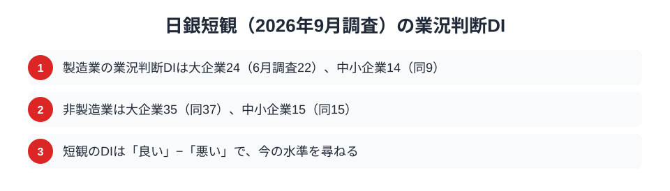
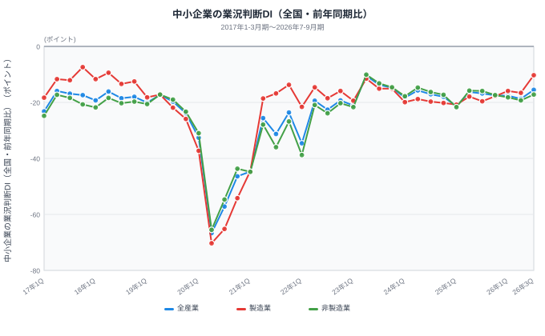
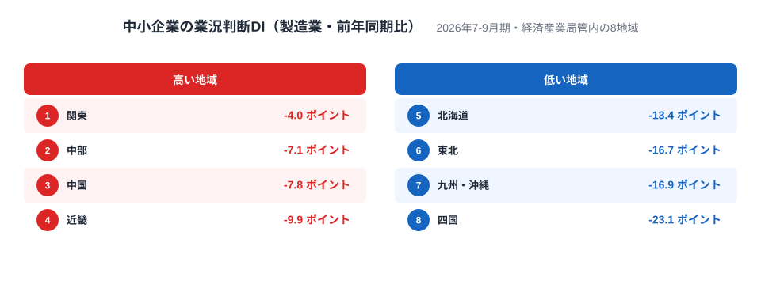
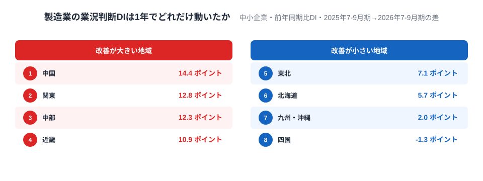
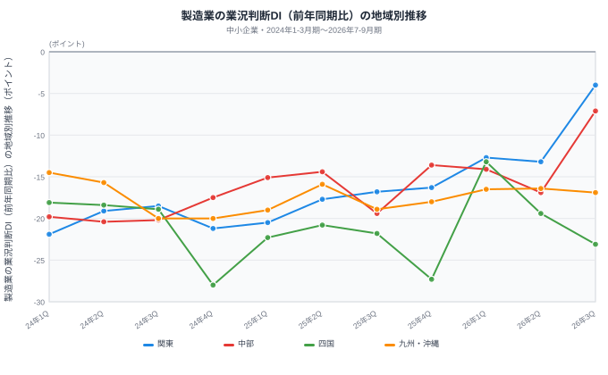
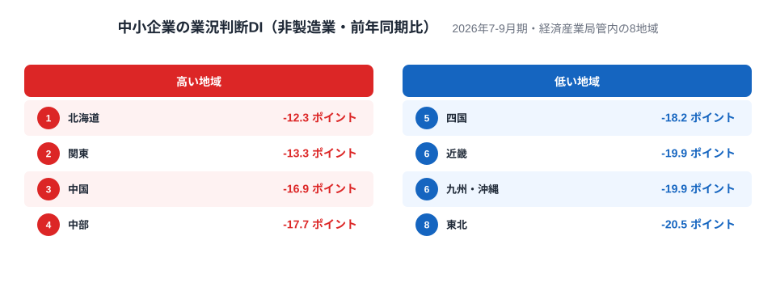
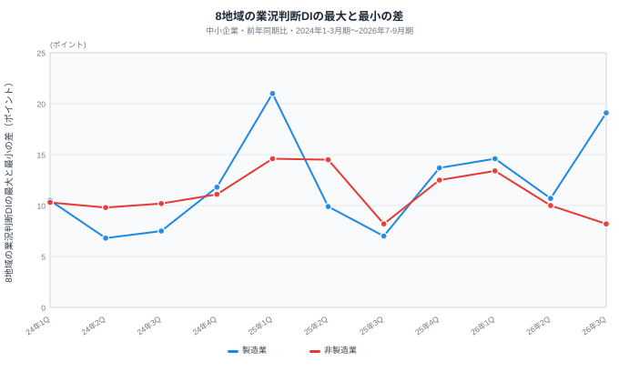

2026年10月1日に公表された日銀短観では、大企業の製造業の業況判断DIが24と、前回の6月調査の22から上がりました。一方で、大企業の非製造業は37から35へ下がっています。では、中小企業の回答は、地域によって同じように好転しているのでしょうか。

中小企業庁と中小機構が四半期ごとに公表する中小企業景況調査には、全国と経済産業局管内の8地域の業況判断DIがあります。この記事では、2026年7-9月期の最新値を使って、地域差がどこで、どのくらい開いているのかを見ていきます。

> [!NOTE]
> 景況感を47都道府県で同じ基準のまま比べられる公式データはありません。中小企業景況調査が公表するのは全国と8地域の値だけで、都道府県別の値は存在しないため、この記事では県ではなく地域で比べます。

この図は、日銀短観の2026年9月調査の業況判断DIを、大企業と中小企業、製造業と非製造業で並べたものです。製造業は大企業が24、中小企業が14で、6月調査から大企業は22から、中小企業は9から上がりました。非製造業は大企業が35で37から下がり、中小企業は15のまま変わっていません。

ここで注意したいのは、短観のDIは「良い」と答えた企業から「悪い」と答えた企業を引き、今の状況を尋ねている点です。この記事で使う中小企業景況調査とは問い方が違うため、中小企業景況調査の数値とは比べられません。短観は、この記事の問いを立てるための背景として使います。

## 全国の中小企業は、1年前より悪化と答える企業が減った

この記事で使う業況判断DIは、前年同期と比べて好転したと答えた企業の割合から、悪化したと答えた企業の割合を引いた値で、単位は％ポイントです。今の景気の高さではなく1年前との比較なので、マイナスは、悪化と答えた企業が好転と答えた企業を上回っているという意味です。値が上がるのは、好転と答える企業が増えたか、悪化と答える企業が減ったときです。

この図は、中小企業景況調査の全国の推移です。2026年7-9月期は、全産業が▲15.5、製造業が▲10.3、非製造業が▲17.2でした。2020年4-6月期には全産業が▲66.7、製造業が▲70.3、非製造業が▲65.5まで落ち込んでいたので、そこからはマイナス幅が大きく縮んでいます。

注目したいのは製造業です。▲10.3は2018年4-6月期の▲9.4以来の高い値で、その期より後に▲10.3以上になった期はありません。1年前の2025年7-9月期は▲19.6でしたから、1年間で9.3ポイント上がった計算です。ただし、これは全国をならした値です。次の節から、8地域に分けて見ます。

## 製造業の8地域は、関東と四国で大きく分かれる

2026年7-9月期の製造業DIを8地域で比べると、最も高いのは関東の▲4.0、次いで中部の▲7.1、中国の▲7.8、近畿の▲9.9でした。反対に低いほうでは、北海道が▲13.4、東北が▲16.7、九州・沖縄が▲16.9、そして最も低い四国は▲23.1です。関東と四国の差は19.1ポイントになります。

上位には、関東、中部、中国、近畿という本州の4地域が並びました。これらの地域にどれだけ製造業が集まっているかは、この調査からは分かりません。県の単位で確かめる方法は、この節の最後で紹介します。

全国の製造業の企業コメントには、新潟の機械器具製造業から、AI関連や自動化の需要を背景に設備投資が堅調で、半導体やデータセンター向けの投資、工作機械の受注も好調だという声がありました。製造業ではこうした声もある、という例の一つです。この調査から、1社のコメントを特定の地域の数字や地域差の説明に結びつけることはできません。

もう一つ、回答の数にも注意が必要です。2026年7-9月期の製造業の回答は、北海道で150社、四国で315社と少なく、関東は1,207社でした。回答が少ない地域ほど、1四半期の数字は大きく振れます。この順位を固定した序列として読むのは避けたいところです。

<source-link href="/ranking/employment-location-quotient-manufacturing">製造業の従業者特化係数ランキングをもっと見る</source-link>

製造業の地域構造を、都道府県の単位で知りたい場合は、製造業の従業者特化係数のランキングが手がかりになります。従業者特化係数は、全国平均と比べてどれだけ製造業に従事する人が集まっているかを示す指標です。[製造業の事業所数の地域差](/blog/manufacturing-establishments-prefecture-gap)や[製造品出荷額の都道府県ランキング](/blog/manufacturing-shipment-prefecture-ranking)もあわせて読むと、どの地域に製造業が集まっているかを確認できます。

あわせて見る: [製造品出荷額等ランキング](/ranking/manufacturing-shipment-amount) / [有効求人倍率ランキング](/ranking/active-job-opening-ratio)

## 1年間の変化では、四国だけがマイナス

値の高さだけでなく、1年前からの変化も見ます。2025年7-9月期から2026年7-9月期にかけての製造業DIの差は、中国が+14.4ポイント、関東が+12.8ポイント、中部が+12.3ポイント、近畿が+10.9ポイントと、上位4地域が10ポイント以上上がりました。東北は+7.1ポイント、北海道は+5.7ポイント、九州・沖縄は+2.0ポイントです。

そして四国だけが▲1.3ポイントと、8地域で唯一のマイナスでした。ただし、四国の1年前の▲21.8も、2024年1-3月期から続く11期の振れ幅である▲13.2から▲28.0の範囲にあります。▲1.3ポイントという変化は小さく、四国の通常の振れの範囲内と見るのが適切です。

もう一つ、基準にした期の特徴も押さえておく必要があります。基準の2025年7-9月期は、8地域の製造業DIの最大と最小の差が7.0ポイントで、11期の中でほぼ最小でした。ほかの期は、2025年1-3月期が21.0、2025年10-12月期が13.7、2026年1-3月期が14.6です。基準期の差が小さかったため、1年前との比較では地域差が開いたように見えやすくなります。

中国は、1年間で上がった幅が最大でした。反対に、九州・沖縄は値が下位で、上がった幅も小さい地域です。報告書は、全産業のDIが九州・沖縄以外の7地域で改善し、九州・沖縄は低下したと記し、同地域については令和8年熊本地震が発生したことにも触れています。ただし、地震とDIの関係をこの調査から読み取ることはできません。

この図は、関東、中部、四国、九州・沖縄の4地域について、2024年1-3月期から2026年7-9月期までの11期を追ったものです。関東は2026年4-6月期に▲13.2へ下がったあと、7-9月期に▲4.0へ上がりました。中部は2025年7-9月期に▲19.4へ、2026年4-6月期に▲16.9へ下がっています。中部の+12.3ポイントは、基準にした2025年7-9月期の落ち込みで、大きく見えている可能性があります。九州・沖縄は▲14.5から▲20.0の間で、ほぼ横ばいに近い動きです。

四国は振れが大きい地域です。2024年10-12月期に▲28.0、2025年10-12月期に▲27.3と、大きく下振れした期がある一方、2026年1-3月期には▲13.2まで上がっています。そのため、四国の最新の▲23.1が、1期だけの落ち込みなのか、続く傾向なのかは、この図だけでは判断できません。数四半期の様子を見てから評価すべきです。

## 非製造業は、どの地域もマイナスが大きい

非製造業の2026年7-9月期は、北海道が▲12.3、関東が▲13.3、中国が▲16.9、中部が▲17.7、四国が▲18.2、近畿が▲19.9、九州・沖縄が▲19.9、東北が▲20.5でした。製造業と違い、最も高い北海道でも▲12.3と、全地域が▲12.3以下に収まっています。最高の北海道と最低の東北の差は8.2ポイントで、製造業の19.1ポイントよりかなり小さくなっています。

製造業で首位だった関東は、非製造業でも2位です。一方、中部は4位、近畿は6位タイで、製造業のときほどの高さはありません。製造業で高かった地域の値が、非製造業でそのまま高くなっているわけではないことが分かります。

非製造業の企業コメントには、コストと人手の声が目立ちます。滋賀の宿泊業からは、インバウンドが戻ってきた一方で、食材、リネン、燃料などのコストが上がっているという声がありました。香川の建設業からは、受注は増えたが、材料費や借入金利の上昇と人手不足が重いという声が寄せられています。需要が戻っても収益に結びつきにくい様子がうかがえますが、これも個々の企業のコメントとして読むのが適切です。

## 地域差は、製造業で広がり、非製造業で縮んだ

最後に、8地域のDIの最大と最小の差が、どう動いてきたかを見ます。製造業は2025年7-9月期に7.0ポイントでしたが、2026年7-9月期には19.1ポイントまで広がりました。1年で12.1ポイント拡大した計算です。

ただし、「過去最大」や「初めて」とは言えません。2025年1-3月期にも21.0ポイントあり、このときは北海道の製造業が大きく落ち込んだ期でした。製造業の地域差は、上がる地域と上がらない地域に分かれたときにも、特定の地域が大きく下がったときにも開きます。今回は前者の色合いが強い開き方ですが、回答が少ない地域があるため、翌期以降にまた縮む可能性もあります。

非製造業の最大と最小の差は、2026年7-9月期が8.2ポイントで、この11期の中では最小に並ぶ値でした。2025年7-9月期も8.2ポイントです。非製造業は、地域によって差が開くというより、どの地域もマイナスが大きいまま並んでいる、と見たほうが実態に近いでしょう。

## 読み方の注意と、次に見るべきデータ

この記事の数字を読むうえで、押さえておきたい点は3つあります。1つ目は、DIが前年同期との比較であることです。マイナスは景気が悪いという意味ではなく、1年前より悪化したと答えた企業が好転したと答えた企業を上回っているという意味です。2つ目は、製造業の回答が北海道で150社、四国で315社と少なく、1期だけの動きを傾向として断定できないことです。3つ目は、企業コメントや同じ時期の出来事が、地域差の原因だと決められるわけではないことです。

この調査は地域単位が最小なので、都道府県の差は見えません。県の単位で製造業の厚みや雇用の強さを確かめるなら、[製造品出荷額の都道府県ランキング](/blog/manufacturing-shipment-prefecture-ranking)や[経済カテゴリのランキング一覧](/category/economy)が手がかりになります。次の四半期で、四国の動きが戻るのか、製造業の地域差がさらに開くのかを見ておくと、今回の結果が一時的な振れだったかどうかを判断できます。

## データについて

- 8地域は経済産業局の管内区分です。関東には新潟、長野、山梨、静岡を含み、中部は愛知、岐阜、三重、富山、石川、近畿には福井を含みます。九州・沖縄は九州各県と沖縄県です。
- 業況判断DIは、前年同期と比べて好転と答えた企業の割合から、悪化と答えた企業の割合を引いたもので、単位は％ポイントです。
- 地域差は、8地域のDIの最大値から最小値を引いた値です。1年間の変化は、2026年7-9月期の値から2025年7-9月期の値を引いて求めました。
- 日銀短観のDIは、中小企業景況調査とは問い方が異なるため、両者の数値は比べていません。
