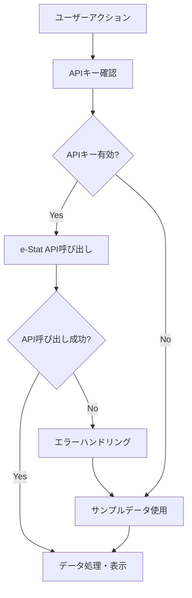

# API設計仕様

## 概要

地域統計ダッシュボードでは、e-Stat APIを使用して日本の地域統計データを取得します。APIキーがない場合のフォールバックとして、サンプルデータも提供しています。

## e-Stat API

### 基本情報

- **API名**: e-Stat API
- **ベースURL**: `https://api.e-stat.go.jp/rest/3.0/app/json`
- **認証**: アプリケーションID（APIキー）
- **データ形式**: JSON
- **制限**: 1日あたりのリクエスト数制限あり

### 認証設定

#### 環境変数

```bash
# .env.local
NEXT_PUBLIC_ESTAT_APP_ID=your-actual-app-id
```

#### APIキーの取得方法

1. [e-Stat API](https://www.e-stat.go.jp/api/)にアクセス
2. ユーザー登録・ログイン
3. アプリケーションIDを申請
4. 承認後にAPIキーを取得

### APIエンドポイント

#### 統計データ取得

```http
GET /getStatsData?appId={appId}&statsDataId={statsDataId}&metaGetFlg=Y&cntGetFlg=N
```

**パラメータ**
- `appId`: アプリケーションID（必須）
- `statsDataId`: 統計データID（必須）
- `metaGetFlg`: メタデータ取得フラグ（Y/N）
- `cntGetFlg`: 件数取得フラグ（Y/N）

**レスポンス例**
```json
{
  "GET_STATS_DATA": {
    "STATISTICAL_DATA": {
      "DATA_INF": {
        "NUMBER": "8",
        "RESULT": {
          "STATUS": "0",
          "ERROR_MSG": ""
        }
      },
      "TABLE_INF": {
        "ID": "0003109941",
        "STAT_NAME": "人口推計",
        "GOV_ORG": "総務省",
        "STATISTICS_NAME": "人口推計",
        "TITLE": "人口推計（2015年基準）"
      },
      "CLASS_INF": {
        "CLASS_OBJ": [
          {
            "ID": "cat01",
            "NAME": "年齢（3区分）",
            "CLASS": [
              {
                "CODE": "001",
                "NAME": "0～14歳"
              }
            ]
          }
        ]
      },
      "DATA": {
        "VALUE": [
          {
            "tab": "tab1",
            "cat01": "001",
            "area": "13100",
            "time": "2015",
            "value": "13515271"
          }
        ]
      }
    }
  }
}
```

### エラーハンドリング

#### HTTPステータスコード

- `200`: 成功
- `400`: リクエストエラー
- `401`: 認証エラー
- `403`: アクセス拒否
- `404`: データが見つからない
- `429`: レート制限
- `500`: サーバーエラー

#### エラーレスポンス例

```json
{
  "error": {
    "code": "400",
    "message": "Invalid appId",
    "details": "アプリケーションIDが無効です"
  }
}
```

## サンプルデータ（フォールバック）

### データ構造

```typescript
interface SampleData {
  population: Array<{
    year: string;
    value: number;
  }>;
  gdp: Array<{
    year: string;
    value: number;
  }>;
  unemployment: Array<{
    year: string;
    value: number;
  }>;
  demographics: Array<{
    age: string;
    value: number;
  }>;
}
```

### サンプルデータ例

```json
{
  "population": [
    { "year": "2015", "value": 13515271 },
    { "year": "2016", "value": 13547910 },
    { "year": "2017", "value": 13570224 },
    { "year": "2018", "value": 13587000 },
    { "year": "2019", "value": 13592926 },
    { "year": "2020", "value": 13515271 },
    { "year": "2021", "value": 13420510 },
    { "year": "2022", "value": 13345194 }
  ],
  "gdp": [
    { "year": "2015", "value": 93.2 },
    { "year": "2016", "value": 94.8 },
    { "year": "2017", "value": 97.1 },
    { "year": "2018", "value": 98.1 },
    { "year": "2019", "value": 98.8 },
    { "year": "2020", "value": 95.1 },
    { "year": "2021", "value": 97.8 },
    { "year": "2022", "value": 100.0 }
  ],
  "unemployment": [
    { "year": "2015", "value": 3.4 },
    { "year": "2016", "value": 3.1 },
    { "year": "2017", "value": 2.8 },
    { "year": "2018", "value": 2.4 },
    { "year": "2019", "value": 2.3 },
    { "year": "2020", "value": 2.8 },
    { "year": "2021", "value": 2.8 },
    { "year": "2022", "value": 2.6 }
  ],
  "demographics": [
    { "age": "0-14歳", "value": 12.1 },
    { "age": "15-64歳", "value": 59.4 },
    { "age": "65歳以上", "value": 28.5 }
  ]
}
```

## データ取得フロー

### 1. 正常フロー



### 2. エラーハンドリング

```typescript
try {
  const response = await fetch(apiUrl);
  
  if (!response.ok) {
    throw new Error(`HTTP error! status: ${response.status}`);
  }
  
  const data = await response.json();
  return processApiData(data);
  
} catch (error) {
  console.error('API呼び出しエラー:', error);
  
  // フォールバックデータを使用
  return getFallbackData();
}
```

## データ変換・処理

### 1. APIデータの正規化

```typescript
function processApiData(apiResponse: any): NormalizedData {
  const { DATA, TABLE_INF } = apiResponse.GET_STATS_DATA.STATISTICAL_DATA;
  
  return {
    population: extractPopulationData(DATA.VALUE),
    gdp: extractGdpData(DATA.VALUE),
    unemployment: extractUnemploymentData(DATA.VALUE),
    demographics: extractDemographicsData(DATA.VALUE),
    metadata: {
      source: 'e-Stat API',
      lastUpdated: new Date().toISOString(),
      tableInfo: TABLE_INF
    }
  };
}
```

### 2. 地域別データの調整

```typescript
function adjustDataForRegion(data: NormalizedData, regionCode: string): RegionData {
  return {
    ...data,
    regionCode,
    regionName: getRegionName(regionCode),
    // 地域固有の調整処理
  };
}
```

## パフォーマンス最適化

### 1. キャッシュ戦略

- **ブラウザキャッシュ**: 静的データのキャッシュ
- **APIレスポンスキャッシュ**: 短時間のデータキャッシュ
- **サンプルデータ**: オフライン時のフォールバック

### 2. レート制限対応

```typescript
class RateLimiter {
  private requests: number = 0;
  private resetTime: number = Date.now() + 24 * 60 * 60 * 1000; // 24時間
  
  async checkLimit(): Promise<boolean> {
    if (Date.now() > this.resetTime) {
      this.requests = 0;
      this.resetTime = Date.now() + 24 * 60 * 60 * 1000;
    }
    
    if (this.requests >= 1000) { // 1日1000回制限
      return false;
    }
    
    this.requests++;
    return true;
  }
}
```

### 3. バッチ処理

```typescript
async function batchFetchData(regionCodes: string[]): Promise<RegionData[]> {
  const batchSize = 5; // 同時リクエスト数制限
  const results: RegionData[] = [];
  
  for (let i = 0; i < regionCodes.length; i += batchSize) {
    const batch = regionCodes.slice(i, i + batchSize);
    const batchPromises = batch.map(code => fetchRegionData(code));
    
    const batchResults = await Promise.all(batchPromises);
    results.push(...batchResults);
    
    // レート制限を考慮した待機
    if (i + batchSize < regionCodes.length) {
      await new Promise(resolve => setTimeout(resolve, 1000));
    }
  }
  
  return results;
}
```

## セキュリティ考慮事項

### 1. APIキーの保護

- **環境変数**: サーバーサイドでのみ使用
- **クライアントサイド**: APIキーを直接露出しない
- **ローテーション**: 定期的なAPIキーの更新

### 2. 入力検証

```typescript
function validateRegionCode(code: string): boolean {
  const validCodes = ['11', '12', '13', '14', '15', '16', '17', '23', '27', '28'];
  return validCodes.includes(code);
}

function sanitizeApiResponse(data: any): any {
  // XSS対策などのサニタイゼーション
  return JSON.parse(JSON.stringify(data));
}
```

### 3. CORS設定

```typescript
// next.config.ts
const nextConfig = {
  async headers() {
    return [
      {
        source: '/api/:path*',
        headers: [
          { key: 'Access-Control-Allow-Origin', value: '*' },
          { key: 'Access-Control-Allow-Methods', value: 'GET, POST, OPTIONS' },
          { key: 'Access-Control-Allow-Headers', value: 'Content-Type' },
        ],
      },
    ];
  },
};
```

## テスト戦略

### 1. ユニットテスト

```typescript
describe('API Data Processing', () => {
  test('should normalize API response correctly', () => {
    const mockApiResponse = createMockApiResponse();
    const result = processApiData(mockApiResponse);
    
    expect(result.population).toBeDefined();
    expect(result.gdp).toBeDefined();
    expect(result.metadata.source).toBe('e-Stat API');
  });
  
  test('should handle API errors gracefully', async () => {
    const mockFetch = jest.fn().mockRejectedValue(new Error('Network error'));
    global.fetch = mockFetch;
    
    const result = await fetchRegionData('13');
    expect(result.source).toBe('サンプルデータ（エラー時のフォールバック）');
  });
});
```

### 2. 統合テスト

```typescript
describe('API Integration', () => {
  test('should fetch real data with valid API key', async () => {
    const result = await fetchRegionData('13');
    expect(result.population.length).toBeGreaterThan(0);
  });
  
  test('should respect rate limits', async () => {
    const promises = Array(10).fill(null).map(() => fetchRegionData('13'));
    const results = await Promise.all(promises);
    
    // レート制限の確認
    expect(results.some(r => r.source.includes('レート制限'))).toBe(true);
  });
});
```

## 監視・ログ

### 1. API呼び出しログ

```typescript
function logApiCall(endpoint: string, status: number, responseTime: number) {
  console.log({
    timestamp: new Date().toISOString(),
    endpoint,
    status,
    responseTime,
    userAgent: navigator.userAgent
  });
}
```

### 2. エラー監視

```typescript
function logApiError(error: Error, context: any) {
  console.error({
    timestamp: new Date().toISOString(),
    error: error.message,
    stack: error.stack,
    context
  });
  
  // 外部監視サービスへの送信
  if (process.env.NODE_ENV === 'production') {
    sendToErrorMonitoring(error, context);
  }
}
```

### 3. パフォーマンス監視

```typescript
function measureApiPerformance<T>(fn: () => Promise<T>): Promise<T> {
  const start = performance.now();
  
  return fn().finally(() => {
    const end = performance.now();
    const duration = end - start;
    
    if (duration > 5000) { // 5秒以上かかる場合
      console.warn(`Slow API call: ${duration}ms`);
    }
  });
}
```

## 今後の拡張

### 1. 新しいデータソース

- **他の統計API**: 総務省、厚生労働省など
- **リアルタイムデータ**: 気象庁、交通情報など
- **民間データ**: 企業の統計データなど

### 2. データ形式の拡張

- **CSV/Excel**: データエクスポート機能
- **JSON-LD**: 構造化データの提供
- **GraphQL**: 柔軟なデータクエリ

### 3. リアルタイム機能

- **WebSocket**: リアルタイムデータ更新
- **Server-Sent Events**: プッシュ通知
- **Service Worker**: オフライン対応
