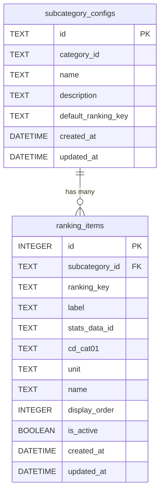

# データベース設計ドキュメント

## 概要

stats47 プロジェクトのデータベース設計について説明します。このドキュメントでは、ランキング設定管理のための新しいテーブル設計と、既存のテーブルとの関係について詳述します。

## テーブル設計

### 1. サブカテゴリ設定テーブル (`subcategory_configs`)

サブカテゴリの基本情報とデフォルト設定を管理します。

#### スキーマ

```sql
CREATE TABLE subcategory_configs (
  id TEXT PRIMARY KEY,              -- 'land-area', 'land-use'
  category_id TEXT NOT NULL,        -- 'landweather'
  name TEXT NOT NULL,               -- '土地面積', '土地利用'
  description TEXT,
  default_ranking_key TEXT,         -- デフォルトの統計項目
  created_at DATETIME DEFAULT CURRENT_TIMESTAMP,
  updated_at DATETIME DEFAULT CURRENT_TIMESTAMP
);
```

#### フィールド説明

| フィールド            | 型   | 説明                         | 例                           |
| --------------------- | ---- | ---------------------------- | ---------------------------- |
| `id`                  | TEXT | サブカテゴリの一意識別子     | `'land-area'`                |
| `category_id`         | TEXT | 親カテゴリの ID              | `'landweather'`              |
| `name`                | TEXT | サブカテゴリの表示名         | `'土地面積'`                 |
| `description`         | TEXT | サブカテゴリの説明           | `'都道府県別の土地面積統計'` |
| `default_ranking_key` | TEXT | デフォルトで表示する統計項目 | `'totalAreaExcluding'`       |

### 2. ランキング項目テーブル (`ranking_items`)

各サブカテゴリの統計項目とその設定を管理します。

#### スキーマ

```sql
CREATE TABLE ranking_items (
  id INTEGER PRIMARY KEY AUTOINCREMENT,
  subcategory_id TEXT NOT NULL,     -- 'land-area', 'land-use'
  ranking_key TEXT NOT NULL,        -- 'totalAreaExcluding'など
  label TEXT NOT NULL,              -- '総面積（除く）'
  stats_data_id TEXT NOT NULL,      -- '0000010102'
  cd_cat01 TEXT NOT NULL,           -- 'B1101'
  unit TEXT NOT NULL,               -- 'ha'
  name TEXT NOT NULL,               -- '総面積（北方地域及び竹島を除く）'
  display_order INTEGER DEFAULT 0,
  is_active BOOLEAN DEFAULT 1,
  created_at DATETIME DEFAULT CURRENT_TIMESTAMP,
  updated_at DATETIME DEFAULT CURRENT_TIMESTAMP,
  UNIQUE(subcategory_id, ranking_key)
);
```

#### フィールド説明

| フィールド       | 型      | 説明                        | 例                                   |
| ---------------- | ------- | --------------------------- | ------------------------------------ |
| `subcategory_id` | TEXT    | サブカテゴリ ID（外部キー） | `'land-area'`                        |
| `ranking_key`    | TEXT    | 統計項目の一意識別子        | `'totalAreaExcluding'`               |
| `label`          | TEXT    | UI 表示用のラベル           | `'総面積（除く）'`                   |
| `stats_data_id`  | TEXT    | e-Stat API の統計表 ID      | `'0000010102'`                       |
| `cd_cat01`       | TEXT    | e-Stat API のカテゴリコード | `'B1101'`                            |
| `unit`           | TEXT    | データの単位                | `'ha'`, `'%'`                        |
| `name`           | TEXT    | 統計項目の正式名称          | `'総面積（北方地域及び竹島を除く）'` |
| `display_order`  | INTEGER | 表示順序                    | `1, 2, 3...`                         |
| `is_active`      | BOOLEAN | アクティブフラグ            | `true/false`                         |

### 3. ランキング設定ビュー (`v_ranking_configs`)

サブカテゴリとランキング項目を結合したビューです。

```sql
CREATE VIEW v_ranking_configs AS
SELECT
  sc.id as subcategory_id,
  sc.category_id,
  sc.name as subcategory_name,
  sc.description,
  sc.default_ranking_key,
  ri.ranking_key,
  ri.label,
  ri.stats_data_id,
  ri.cd_cat01,
  ri.unit,
  ri.name as ranking_name,
  ri.display_order,
  ri.is_active,
  ri.created_at,
  ri.updated_at
FROM subcategory_configs sc
LEFT JOIN ranking_items ri ON sc.id = ri.subcategory_id AND ri.is_active = 1
ORDER BY sc.id, ri.display_order;
```

## テーブル間の関係



## 使用例とクエリサンプル

### 1. サブカテゴリのランキング項目を取得

```sql
-- land-areaのすべてのランキング項目を取得
SELECT
  ranking_key,
  label,
  stats_data_id,
  cd_cat01,
  unit,
  name,
  display_order
FROM ranking_items
WHERE subcategory_id = 'land-area'
  AND is_active = 1
ORDER BY display_order;
```

### 2. デフォルトランキング項目を取得

```sql
-- サブカテゴリのデフォルトランキング項目を取得
SELECT
  sc.default_ranking_key,
  ri.stats_data_id,
  ri.cd_cat01,
  ri.unit,
  ri.name
FROM subcategory_configs sc
JOIN ranking_items ri ON sc.id = ri.subcategory_id
  AND sc.default_ranking_key = ri.ranking_key
WHERE sc.id = 'land-area';
```

### 3. ビューを使用した複雑なクエリ

```sql
-- サブカテゴリとランキング項目の完全な情報を取得
SELECT
  subcategory_name,
  ranking_key,
  label,
  stats_data_id,
  cd_cat01,
  unit,
  display_order
FROM v_ranking_configs
WHERE subcategory_id = 'land-use'
ORDER BY display_order;
```

## インデックス設計

パフォーマンス向上のためのインデックス：

```sql
-- サブカテゴリ検索用
CREATE INDEX idx_subcategory_configs_category ON subcategory_configs(category_id);

-- ランキング項目検索用
CREATE INDEX idx_ranking_items_subcategory ON ranking_items(subcategory_id);
CREATE INDEX idx_ranking_items_active ON ranking_items(is_active);
CREATE INDEX idx_ranking_items_display_order ON ranking_items(display_order);

-- 複合ユニーク制約
CREATE UNIQUE INDEX idx_ranking_items_unique ON ranking_items(subcategory_id, ranking_key);
```

## データ管理

### データの追加

新しいサブカテゴリを追加する場合：

```sql
-- 1. サブカテゴリ設定を追加
INSERT INTO subcategory_configs (id, category_id, name, description, default_ranking_key)
VALUES ('new-subcategory', 'category-id', '新サブカテゴリ', '説明', 'default-key');

-- 2. ランキング項目を追加
INSERT INTO ranking_items (subcategory_id, ranking_key, label, stats_data_id, cd_cat01, unit, name, display_order)
VALUES
  ('new-subcategory', 'item1', '項目1', 'stats-id', 'cat01', 'unit', '項目名', 1),
  ('new-subcategory', 'item2', '項目2', 'stats-id', 'cat02', 'unit', '項目名', 2);
```

### データの更新

ランキング項目の設定を変更する場合：

```sql
-- 表示順序の変更
UPDATE ranking_items
SET display_order = 5
WHERE subcategory_id = 'land-area' AND ranking_key = 'habitableArea';

-- アクティブ状態の変更
UPDATE ranking_items
SET is_active = 0
WHERE subcategory_id = 'land-area' AND ranking_key = 'majorLakeArea';
```

### データの削除

ランキング項目を削除する場合：

```sql
-- 論理削除（推奨）
UPDATE ranking_items
SET is_active = 0
WHERE subcategory_id = 'land-area' AND ranking_key = 'item-to-remove';

-- 物理削除（注意が必要）
DELETE FROM ranking_items
WHERE subcategory_id = 'land-area' AND ranking_key = 'item-to-remove';
```

## マイグレーション

### 既存データベースへの追加

```sql
-- 1. テーブル作成
-- ranking_items.sql の内容を実行

-- 2. シードデータの投入
-- database/seeds/ranking_items_seed.sql の内容を実行

-- 3. データ確認
SELECT COUNT(*) FROM subcategory_configs;
SELECT COUNT(*) FROM ranking_items;
```

### ロールバック

```sql
-- テーブルとビューの削除
DROP VIEW IF EXISTS v_ranking_configs;
DROP TABLE IF EXISTS ranking_items;
DROP TABLE IF EXISTS subcategory_configs;
```

## パフォーマンス考慮事項

1. **キャッシュ戦略**: API レスポンスに 5 分間のキャッシュを設定
2. **インデックス**: 頻繁に検索されるカラムにインデックスを設定
3. **ビュー**: 複雑な結合クエリをビューで簡素化
4. **フォールバック**: データベース接続失敗時のフォールバック機能

## セキュリティ考慮事項

1. **入力検証**: API エンドポイントでの入力値検証
2. **SQL インジェクション対策**: プリペアドステートメントの使用
3. **アクセス制御**: 管理画面での適切な権限管理
4. **データバリデーション**: データベースレベルでの制約設定
