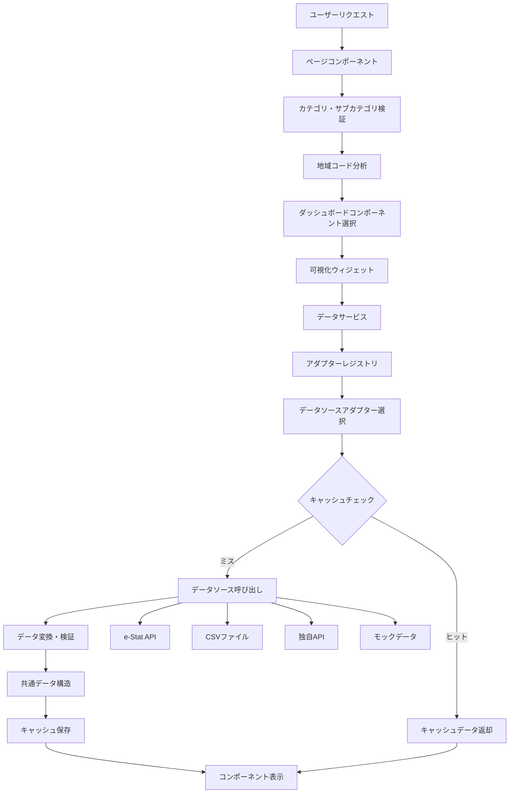

# データフロー

## 概要

ダッシュボードドメインのデータフローは、様々なデータソース（e-Stat API、CSV、独自 API 等）から取得した統計データを、共通のデータ構造に変換し、全国・都道府県・市区町村の 3 階層で効率的に表示するための一連の処理フローです。アダプターパターンにより、データソースの抽象化と統一されたデータ処理を実現しています。

## データフロー全体図



## データ取得ライフサイクル

### 1. リクエスト受信

```typescript
// ページコンポーネントでのリクエスト処理
export default async function DashboardPage({ params }: PageProps) {
  const { category, subcategory, areaCode } = await params;

  // 1. パラメータ検証
  const validationResult = validateParameters({
    category,
    subcategory,
    areaCode,
  });
  if (!validationResult.isValid) {
    notFound();
  }

  // 2. 地域レベル判定
  const areaLevel = determineAreaLevel(areaCode);

  // 3. ダッシュボードコンポーネント選択
  const DashboardComponent = getDashboardComponentByArea(
    subcategory,
    areaCode,
    category,
    areaLevel
  );

  return (
    <DashboardComponent
      category={category}
      subcategory={subcategory}
      areaCode={areaCode}
      areaLevel={areaLevel}
    />
  );
}
```

### 2. データ取得フック

```typescript
// ダッシュボードデータ取得フック
export function useDashboardData(params: AdapterParams, areaCode?: string) {
  const [data, setData] = useState<DashboardData | null>(null);
  const [loading, setLoading] = useState(true);
  const [error, setError] = useState<Error | null>(null);

  useEffect(() => {
    const fetchData = async () => {
      try {
        setLoading(true);
        setError(null);

        // データサービスの呼び出し
        const result = await DashboardDataService.fetchData(params);
        setData(result);
      } catch (err) {
        setError(err as Error);
        console.error("データ取得エラー:", err);
      } finally {
        setLoading(false);
      }
    };

    fetchData();
  }, [params.source, JSON.stringify(params.query)]);

  return { data, loading, error };
}
```

### 3. データ取得サービス

```typescript
// ダッシュボードデータ取得サービス
export class DashboardDataService {
  private static registry: AdapterRegistry;
  private static cache: CacheService;
  private static errorHandler: ErrorHandler;

  static async fetchDashboardData(
    params: AdapterParams
  ): Promise<DashboardData> {
    const cacheKey = this.generateCacheKey(params);

    try {
      // 1. キャッシュチェック
      const cachedData = await this.cache.get(cacheKey);
      if (cachedData) {
        return cachedData;
      }

      // 2. アダプター選択
      const adapter = await this.registry.getBestAdapter(params);
      if (!adapter) {
        throw new Error(`Unsupported data source: ${params.source}`);
      }

      // 3. データ取得
      const rawData = await adapter.fetchData(params);

      // 4. データ検証
      const validation = adapter.validate(rawData);
      if (!validation.isValid) {
        throw new ValidationError(validation.errors);
      }

      // 5. データ変換
      const transformedData = await adapter.transform(rawData);

      // 6. キャッシュ保存
      await this.cache.set(cacheKey, transformedData);

      return transformedData;
    } catch (error) {
      const dashboardError = this.errorHandler.handleAdapterError(
        error,
        params.source
      );
      throw dashboardError;
    }
  }

  private static generateCacheKey(params: AdapterParams): string {
    return `dashboard:${params.source}:${JSON.stringify(params.query)}`;
  }
}
```

## 階層別データ取得戦略

### 全国レベルデータ取得

```typescript
// 全国データ取得
export async function fetchNationalData(
  statsDataId: string,
  areaCode: string
): Promise<NationalDashboardData> {
  const params: AdapterParams = {
    source: "estat",
    query: {
      statsDataId,
      cdCat01: "A1101",
      areaCode: "00000", // 全国
    },
  };

  const data = await DashboardDataService.fetchDashboardData(params);

  // 都道府県ランキングデータの取得
  const rankingParams: AdapterParams = {
    source: "estat",
    query: {
      statsDataId,
      cdCat01: "A1101",
      areaCode: "00000",
      aggregation: "ranking",
    },
  };

  const rankingData = await DashboardDataService.fetchDashboardData(
    rankingParams
  );

  return {
    nationalData: data,
    prefectureRanking: rankingData.values,
    choroplethData: rankingData.values.map((item) => ({
      prefectureCode: item.areaCode,
      value: item.value,
      name: item.areaName,
    })),
  };
}
```

### 都道府県レベルデータ取得

```typescript
// 都道府県データ取得
export async function fetchPrefectureData(
  statsDataId: string,
  areaCode: string
): Promise<PrefectureDashboardData> {
  // 都道府県データの取得
  const prefectureParams: AdapterParams = {
    source: "estat",
    query: {
      statsDataId,
      cdCat01: "A1101",
      areaCode,
    },
  };

  const prefectureData = await DashboardDataService.fetchDashboardData(
    prefectureParams
  );

  // 全国データとの比較用
  const nationalParams: AdapterParams = {
    source: "estat",
    query: {
      statsDataId,
      cdCat01: "A1101",
      areaCode: "00000",
    },
  };

  const nationalData = await DashboardDataService.fetchDashboardData(
    nationalParams
  );

  // 市区町村ランキングデータの取得
  const municipalityParams: AdapterParams = {
    source: "estat",
    query: {
      statsDataId,
      cdCat01: "A1101",
      areaCode,
      aggregation: "ranking",
    },
  };

  const municipalityRanking = await DashboardDataService.fetchDashboardData(
    municipalityParams
  );

  return {
    prefectureData,
    nationalComparison: {
      national: nationalData.values[0],
      prefecture: prefectureData.values[0],
    },
    municipalityRanking: municipalityRanking.values,
    neighboringPrefectures: await getNeighboringPrefectures(areaCode),
  };
}
```

### 市区町村レベルデータ取得

```typescript
// 市区町村データ取得
export async function fetchMunicipalityData(
  statsDataId: string,
  areaCode: string
): Promise<MunicipalityDashboardData> {
  // 市区町村データの取得
  const municipalityParams: AdapterParams = {
    source: "estat",
    query: {
      statsDataId,
      cdCat01: "A1101",
      areaCode,
    },
  };

  const municipalityData = await DashboardDataService.fetchDashboardData(
    municipalityParams
  );

  const prefectureCode = getPrefectureCodeFromMunicipality(areaCode);

  // 都道府県データとの比較用
  const prefectureParams: AdapterParams = {
    source: "estat",
    query: {
      statsDataId,
      cdCat01: "A1101",
      areaCode: prefectureCode,
    },
  };

  const prefectureData = await DashboardDataService.fetchDashboardData(
    prefectureParams
  );

  // 都道府県内ランキングの取得
  const rankingParams: AdapterParams = {
    source: "estat",
    query: {
      statsDataId,
      cdCat01: "A1101",
      areaCode: prefectureCode,
      aggregation: "ranking",
    },
  };

  const prefectureRanking = await DashboardDataService.fetchDashboardData(
    rankingParams
  );

  // 周辺市区町村の取得
  const neighboringMunicipalities = await getNeighboringMunicipalities(
    areaCode
  );

  return {
    municipalityData,
    prefectureComparison: {
      prefecture: prefectureData.values[0],
      municipality: municipalityData.values[0],
    },
    prefectureRanking: prefectureRanking.values,
    neighboringMunicipalities,
    municipalityMapData: await getMunicipalityMapData(prefectureCode),
  };
}
```

## キャッシュ戦略

### 多層キャッシュシステム

```typescript
// 多層キャッシュの実装
export class MultiLayerCache {
  private memoryCache = new Map<string, CachedData>();
  private r2Cache: R2Service;
  private d1Cache: D1Database;

  constructor(r2Service: R2Service, d1Cache: D1Database) {
    this.r2Service = r2Service;
    this.d1Cache = d1Cache;
  }

  async get(key: string): Promise<any> {
    // 1. メモリキャッシュをチェック
    const memoryData = this.memoryCache.get(key);
    if (memoryData && !this.isExpired(memoryData)) {
      return memoryData.data;
    }

    // 2. R2キャッシュをチェック
    const r2Data = await this.r2Cache.get(key);
    if (r2Data) {
      // メモリキャッシュに保存
      this.memoryCache.set(key, r2Data);
      return r2Data.data;
    }

    // 3. D1データベースをチェック
    const d1Data = await this.d1Cache.get(key);
    if (d1Data) {
      // メモリキャッシュに保存
      this.memoryCache.set(key, d1Data);
      return d1Data.data;
    }

    return null;
  }

  async set(key: string, data: any, ttl: number = 3600): Promise<void> {
    const cachedData = {
      data,
      timestamp: Date.now(),
      ttl,
    };

    // メモリキャッシュに保存
    this.memoryCache.set(key, cachedData);

    // R2キャッシュに保存（非同期）
    this.r2Cache.set(key, cachedData, ttl).catch(console.error);

    // D1データベースに保存（非同期）
    this.d1Cache.set(key, cachedData, ttl).catch(console.error);
  }

  private isExpired(cachedData: CachedData): boolean {
    return Date.now() - cachedData.timestamp > cachedData.ttl;
  }
}
```

### キャッシュキー生成

```typescript
// キャッシュキーの生成
export function generateCacheKey(
  params: { statsDataId: string; cdCat01: string },
  areaCode: string,
  additionalParams?: Record<string, any>
): string {
  const baseKey = `dashboard:${params.statsDataId}:${params.cdCat01}:${areaCode}`;

  if (additionalParams) {
    const paramString = Object.entries(additionalParams)
      .sort(([a], [b]) => a.localeCompare(b))
      .map(([key, value]) => `${key}=${value}`)
      .join("&");
    return `${baseKey}:${paramString}`;
  }

  return baseKey;
}
```

## エラーハンドリング

### エラーレベルの定義

```typescript
// エラーレベルの定義
export enum ErrorLevel {
  CRITICAL = "critical", // システム全体に影響
  ERROR = "error", // 機能に影響
  WARNING = "warning", // 一部機能に影響
  INFO = "info", // 情報レベル
}

// エラーハンドリング
export class DashboardErrorHandler {
  static handleError(error: unknown, context: string): DashboardError {
    console.error(`Dashboard Error in ${context}:`, error);

    if (error instanceof EstatApiError) {
      return {
        level: ErrorLevel.ERROR,
        code: "ESTAT_API_ERROR",
        message: "統計データの取得に失敗しました",
        details: {
          context,
          statsDataId: error.statsDataId,
          originalError: error.message,
        },
        timestamp: new Date(),
      };
    }

    if (error instanceof ValidationError) {
      return {
        level: ErrorLevel.WARNING,
        code: "VALIDATION_ERROR",
        message: "データの検証に失敗しました",
        details: {
          context,
          validationErrors: error.errors,
        },
        timestamp: new Date(),
      };
    }

    if (error instanceof CacheError) {
      return {
        level: ErrorLevel.WARNING,
        code: "CACHE_ERROR",
        message: "キャッシュの取得に失敗しました",
        details: {
          context,
          cacheKey: error.cacheKey,
        },
        timestamp: new Date(),
      };
    }

    // 予期しないエラー
    return {
      level: ErrorLevel.CRITICAL,
      code: "UNKNOWN_ERROR",
      message: "予期しないエラーが発生しました",
      details: {
        context,
        error: String(error),
      },
      timestamp: new Date(),
    };
  }
}
```

### フォールバック戦略

```typescript
// フォールバック戦略の実装
export class FallbackStrategy {
  static async fetchDataWithFallback(
    params: { statsDataId: string; cdCat01: string },
    areaCode: string
  ): Promise<DashboardData> {
    try {
      // 1. 通常のデータ取得を試行
      return await DashboardDataService.fetchDashboardData(params, areaCode);
    } catch (error) {
      console.warn("通常のデータ取得に失敗、フォールバックを試行:", error);

      try {
        // 2. キャッシュからの取得を試行
        return await this.fetchFromCache(params, areaCode);
      } catch (cacheError) {
        console.warn(
          "キャッシュからの取得に失敗、サンプルデータを使用:",
          cacheError
        );

        // 3. サンプルデータの使用
        return await this.getSampleData(params, areaCode);
      }
    }
  }

  private static async fetchFromCache(
    params: { statsDataId: string; cdCat01: string },
    areaCode: string
  ): Promise<DashboardData> {
    const cacheKey = generateCacheKey(params, areaCode);
    const cachedData = await MultiLayerCache.get(cacheKey);

    if (!cachedData) {
      throw new Error("キャッシュデータが見つかりません");
    }

    return cachedData;
  }

  private static async getSampleData(
    params: { statsDataId: string; cdCat01: string },
    areaCode: string
  ): Promise<DashboardData> {
    // サンプルデータの生成
    return {
      values: [
        {
          areaCode,
          value: Math.floor(Math.random() * 1000000),
          unit: "人",
          categoryCode: params.cdCat01,
          categoryName: "サンプルデータ",
          timeCode: "2023",
          timeName: "2023年",
        },
      ],
      areas: [],
      categories: [],
      years: [],
      metadata: {
        areaCode,
        lastUpdated: new Date().toISOString(),
        source: "Sample Data",
        isFallback: true,
      },
    };
  }
}
```

## パフォーマンス最適化

### 並列データ取得

```typescript
// 並列データ取得の実装
export class ParallelDataFetcher {
  static async fetchMultipleData(
    requests: Array<{
      params: { statsDataId: string; cdCat01: string };
      areaCode: string;
    }>
  ): Promise<Array<{ data: DashboardData | null; error: Error | null }>> {
    const concurrency = 3; // 同時実行数
    const results: Array<{ data: DashboardData | null; error: Error | null }> =
      [];

    for (let i = 0; i < requests.length; i += concurrency) {
      const batch = requests.slice(i, i + concurrency);

      const batchResults = await Promise.allSettled(
        batch.map(async (request) => {
          try {
            const data = await DashboardDataService.fetchDashboardData(
              request.params,
              request.areaCode
            );
            return { data, error: null };
          } catch (error) {
            return { data: null, error: error as Error };
          }
        })
      );

      results.push(
        ...batchResults.map((result) =>
          result.status === "fulfilled"
            ? result.value
            : { data: null, error: result.reason }
        )
      );

      // レート制限対応のため待機
      if (i + concurrency < requests.length) {
        await new Promise((resolve) => setTimeout(resolve, 1000));
      }
    }

    return results;
  }
}
```

### データプリフェッチ

```typescript
// データプリフェッチの実装
export class DataPrefetcher {
  static async prefetchRelatedData(
    category: string,
    subcategory: string,
    areaCode: string
  ): Promise<void> {
    const areaLevel = determineAreaLevel(areaCode);

    // 関連データのプリフェッチ
    const prefetchPromises: Promise<any>[] = [];

    if (areaLevel === "national") {
      // 主要都道府県のデータをプリフェッチ
      const majorPrefectures = ["13000", "27000", "23000"]; // 東京、大阪、愛知
      prefetchPromises.push(
        ...majorPrefectures.map((prefCode) =>
          this.prefetchPrefectureData(category, subcategory, prefCode)
        )
      );
    } else if (areaLevel === "prefecture") {
      // 主要市区町村のデータをプリフェッチ
      const majorMunicipalities = await getMajorMunicipalities(areaCode);
      prefetchPromises.push(
        ...majorMunicipalities.map((muniCode) =>
          this.prefetchMunicipalityData(category, subcategory, muniCode)
        )
      );
    }

    // 非同期でプリフェッチを実行
    Promise.allSettled(prefetchPromises).catch(console.error);
  }

  private static async prefetchPrefectureData(
    category: string,
    subcategory: string,
    prefectureCode: string
  ): Promise<void> {
    // 都道府県データのプリフェッチ
    const cacheKey = `prefetch:${category}:${subcategory}:${prefectureCode}`;
    // プリフェッチロジックの実装
  }

  private static async prefetchMunicipalityData(
    category: string,
    subcategory: string,
    municipalityCode: string
  ): Promise<void> {
    // 市区町村データのプリフェッチ
    const cacheKey = `prefetch:${category}:${subcategory}:${municipalityCode}`;
    // プリフェッチロジックの実装
  }
}
```

## 監視とログ

### パフォーマンス監視

```typescript
// パフォーマンス監視の実装
export class PerformanceMonitor {
  private static metrics: Map<string, PerformanceMetric> = new Map();

  static recordTiming(operation: string, duration: number): void {
    const metric = this.metrics.get(operation) || {
      operation,
      count: 0,
      totalDuration: 0,
      averageDuration: 0,
      minDuration: Infinity,
      maxDuration: 0,
    };

    metric.count++;
    metric.totalDuration += duration;
    metric.averageDuration = metric.totalDuration / metric.count;
    metric.minDuration = Math.min(metric.minDuration, duration);
    metric.maxDuration = Math.max(metric.maxDuration, duration);

    this.metrics.set(operation, metric);
  }

  static getMetrics(): PerformanceMetric[] {
    return Array.from(this.metrics.values());
  }

  static resetMetrics(): void {
    this.metrics.clear();
  }
}

// パフォーマンス測定デコレータ
export function measurePerformance(operation: string) {
  return function (
    target: any,
    propertyName: string,
    descriptor: PropertyDescriptor
  ) {
    const method = descriptor.value;

    descriptor.value = async function (...args: any[]) {
      const start = performance.now();

      try {
        const result = await method.apply(this, args);
        const end = performance.now();
        PerformanceMonitor.recordTiming(operation, end - start);
        return result;
      } catch (error) {
        const end = performance.now();
        PerformanceMonitor.recordTiming(operation, end - start);
        throw error;
      }
    };
  };
}
```

### ログ管理

```typescript
// ログ管理の実装
export class DashboardLogger {
  private static logLevel: LogLevel = LogLevel.INFO;

  static setLogLevel(level: LogLevel): void {
    this.logLevel = level;
  }

  static debug(message: string, context?: any): void {
    if (this.logLevel <= LogLevel.DEBUG) {
      console.log(`[DEBUG] ${message}`, context);
    }
  }

  static info(message: string, context?: any): void {
    if (this.logLevel <= LogLevel.INFO) {
      console.log(`[INFO] ${message}`, context);
    }
  }

  static warn(message: string, context?: any): void {
    if (this.logLevel <= LogLevel.WARN) {
      console.warn(`[WARN] ${message}`, context);
    }
  }

  static error(message: string, context?: any): void {
    if (this.logLevel <= LogLevel.ERROR) {
      console.error(`[ERROR] ${message}`, context);
    }
  }
}
```

## まとめ

データフローは、ダッシュボードドメインの中核となる処理フローです。主な特徴は以下の通りです：

1. **アダプターパターン**: 様々なデータソースを統一されたインターフェースで処理
2. **階層別戦略**: 全国・都道府県・市区町村で最適化されたデータ取得
3. **多層キャッシュ**: メモリ・R2・D1 の 3 層キャッシュによる高速化
4. **エラーハンドリング**: 包括的なエラー処理とフォールバック戦略
5. **パフォーマンス最適化**: 並列処理、プリフェッチ、監視による最適化
6. **監視・ログ**: パフォーマンス監視とログ管理による運用性向上
7. **拡張性**: 新しいデータソースの容易な追加

このデータフローにより、ユーザーは高速で信頼性の高い統計データを閲覧することができ、将来的なデータソースの拡張にも柔軟に対応できます。
