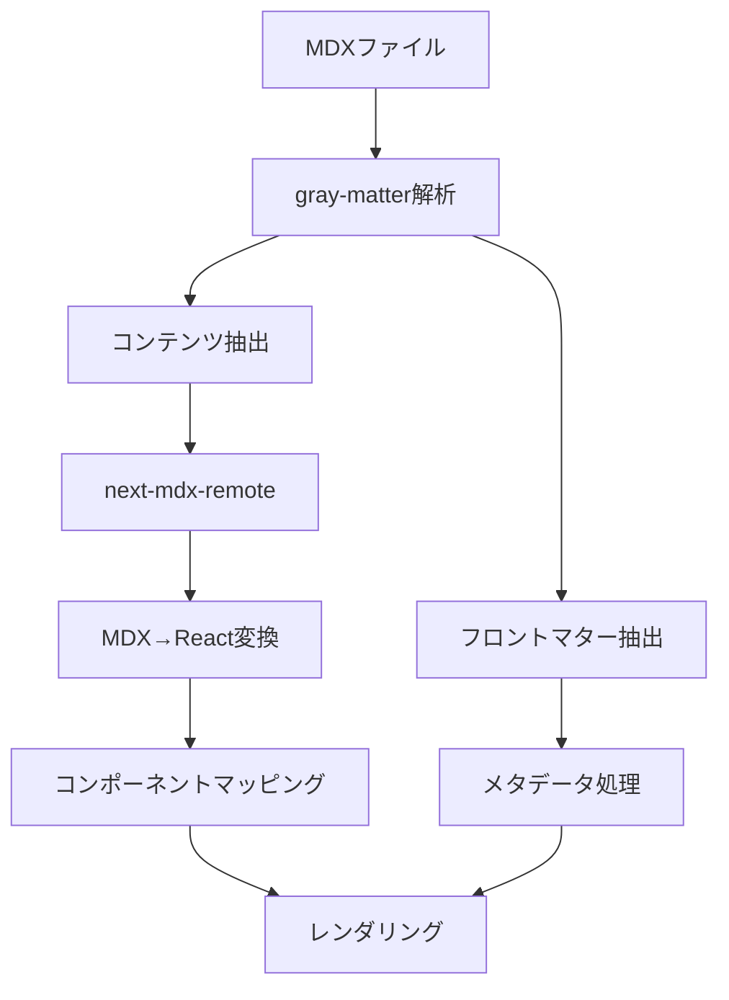

# MDXアーキテクチャ設計

## 概要

MDXアーキテクチャは、MarkdownとJSXを組み合わせたMDXファイルを、Reactコンポーネントとしてレンダリングする仕組みを定義します。

## 技術スタック

### コアライブラリ

1. **next-mdx-remote**
   - MDXファイルのリモートレンダリング
   - サーバーサイドでのMDX処理
   - カスタムコンポーネントのマッピング

2. **gray-matter**
   - フロントマターの解析
   - YAML形式のメタデータ抽出
   - コンテンツとメタデータの分離

3. **rehype/remark**
   - MDX変換プラグイン
   - シンタックスハイライト
   - リンクの最適化

4. **shiki**
   - コードブロックのシンタックスハイライト
   - テーマ対応（ライト/ダークモード）
   - 多言語対応

## レンダリングフロー



### 詳細フロー

1. **ファイル読み込み**
   ```typescript
   const fileContent = await fs.readFile(filePath, 'utf-8');
   ```

2. **フロントマター解析**
   ```typescript
   const { data: frontmatter, content } = matter(fileContent);
   ```

3. **MDX変換**
   ```typescript
   const mdxSource = await serialize(content, {
     mdxOptions: {
       rehypePlugins: [rehypeHighlight, rehypeSlug],
       remarkPlugins: [remarkGfm],
     },
   });
   ```

4. **コンポーネントマッピング**
   ```typescript
   <MDXRemote source={mdxSource} components={mdxComponents} />
   ```

## コンポーネントマッピング

### 基本HTMLタグ

```typescript
export const mdxComponents: MDXComponents = {
  h1: ({ children }) => (
    <h1 className="text-4xl font-bold mt-8 mb-4">{children}</h1>
  ),
  h2: ({ children }) => (
    <h2 className="text-3xl font-bold mt-6 mb-3">{children}</h2>
  ),
  h3: ({ children }) => (
    <h3 className="text-2xl font-bold mt-4 mb-2">{children}</h3>
  ),
  p: ({ children }) => (
    <p className="my-4 leading-relaxed">{children}</p>
  ),
  code: CodeBlock,
  pre: ({ children }) => (
    <pre className="bg-gray-100 dark:bg-gray-800 p-4 rounded-lg overflow-x-auto">
      {children}
    </pre>
  ),
  img: ({ src, alt }) => (
    
  ),
};
```

### カスタムコンポーネント

```typescript
// アラートコンポーネント
export const Alert = ({ type, children }: AlertProps) => {
  const alertStyles = {
    info: 'bg-blue-50 border-blue-200 text-blue-800',
    warning: 'bg-yellow-50 border-yellow-200 text-yellow-800',
    error: 'bg-red-50 border-red-200 text-red-800',
    success: 'bg-green-50 border-green-200 text-green-800',
  };

  return (
    <div className={`p-4 border-l-4 rounded ${alertStyles[type]}`}>
      {children}
    </div>
  );
};

// コールアウトコンポーネント
export const Callout = ({ type, children }: CalloutProps) => {
  return (
    <div className={`p-4 rounded-lg border ${getCalloutStyles(type)}`}>
      {children}
    </div>
  );
};
```

### 可視化コンポーネント

```typescript
// D3.jsコンポーネント
export const ChoroplethMap = (props: ChoroplethMapProps) => {
  return <ChoroplethMapComponent {...props} />;
};

// Rechartsコンポーネント
export const LineChart = (props: LineChartProps) => {
  return <LineChartComponent {...props} />;
};

// ランキング専用コンポーネント
export const PrefectureRankingMap = (props: RankingMapProps) => {
  return <ChoroplethMap {...props} />;
};
```

## プラグイン設定

### Rehypeプラグイン

```typescript
const rehypePlugins = [
  rehypeHighlight,        // シンタックスハイライト
  rehypeSlug,            // 見出しにID付与
  rehypeAutolinkHeadings, // 見出しリンク
  rehypeCodeTitles,      // コードブロックタイトル
];
```

### Remarkプラグイン

```typescript
const remarkPlugins = [
  remarkGfm,             // GitHub Flavored Markdown
  remarkMath,            // 数式サポート
  remarkBreaks,          // 改行サポート
];
```

## パフォーマンス最適化

### 静的生成

```typescript
export async function generateStaticParams() {
  const articles = await getAllBlogArticles();
  
  return articles.map((article) => ({
    slug: article.slug,
  }));
}
```

### 遅延読み込み

```typescript
const LazyChart = dynamic(() => import('./Chart'), {
  loading: () => <ChartSkeleton />,
  ssr: false,
});
```

### キャッシュ戦略

```typescript
const CACHE_TTL = 60 * 60; // 1時間

export async function getCachedMDX(slug: string) {
  const cacheKey = `mdx:${slug}`;
  
  const cached = await kv.get(cacheKey);
  if (cached) {
    return JSON.parse(cached);
  }
  
  const mdx = await compileMDX(slug);
  await kv.put(cacheKey, JSON.stringify(mdx), {
    expirationTtl: CACHE_TTL
  });
  
  return mdx;
}
```

## エラーハンドリング

### MDX解析エラー

```typescript
try {
  const mdxSource = await serialize(content, mdxOptions);
  return mdxSource;
} catch (error) {
  console.error('MDX parsing error:', error);
  throw new Error(`MDX parsing failed: ${error.message}`);
}
```

### コンポーネントエラー

```typescript
const ErrorBoundary = ({ children }: { children: React.ReactNode }) => {
  return (
    <ErrorBoundary
      fallback={<div>コンポーネントの読み込みに失敗しました</div>}
    >
      {children}
    </ErrorBoundary>
  );
};
```

## セキュリティ考慮事項

### XSS対策

```typescript
const sanitizeOptions = {
  allowedTags: ['h1', 'h2', 'h3', 'p', 'strong', 'em', 'code'],
  allowedAttributes: {
    'a': ['href', 'title'],
    'img': ['src', 'alt', 'width', 'height'],
  },
};
```

### コンテンツ検証

```typescript
const validateMDXContent = (content: string) => {
  // 危険なパターンの検出
  const dangerousPatterns = [
    /<script/i,
    /javascript:/i,
    /on\w+\s*=/i,
  ];
  
  return !dangerousPatterns.some(pattern => pattern.test(content));
};
```

## テスト戦略

### 単体テスト

```typescript
describe('MDX Components', () => {
  test('Alert component renders correctly', () => {
    render(<Alert type="info">Test message</Alert>);
    expect(screen.getByText('Test message')).toBeInTheDocument();
  });
});
```

### 統合テスト

```typescript
describe('MDX Rendering', () => {
  test('renders MDX with custom components', async () => {
    const mdxSource = await serialize(testMDXContent);
    render(<MDXRemote source={mdxSource} components={mdxComponents} />);
    
    expect(screen.getByText('Test Heading')).toBeInTheDocument();
  });
});
```

## 今後の拡張

- **数式サポート**: KaTeX統合
- **図表サポート**: Mermaid統合
- **インタラクティブ要素**: カスタムフォーム
- **多言語対応**: i18n統合
