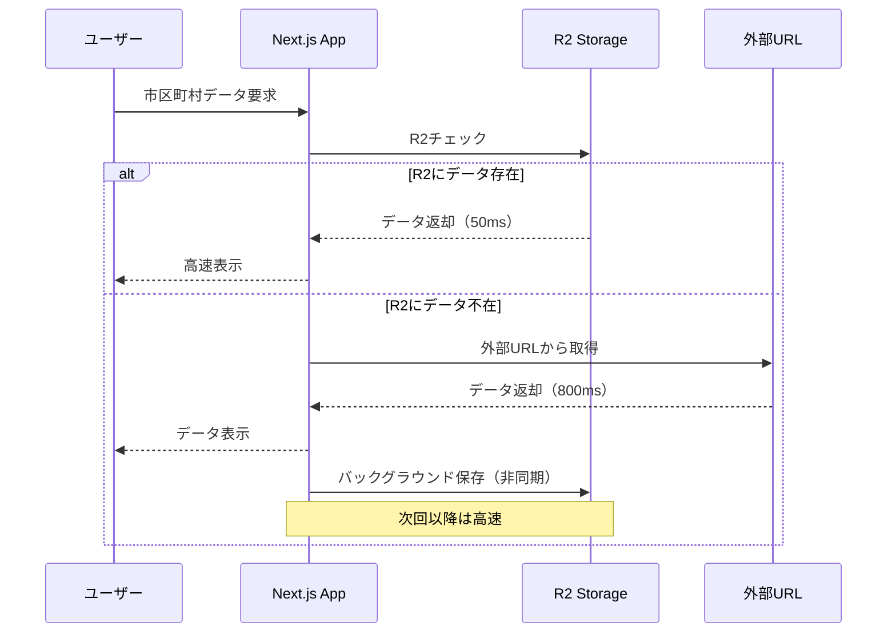

# GeoShape データ自動キャッシング仕様

## 概要

GeoShape の行政区域データ（市区町村境界データ）を外部 URL から取得した際に、自動的に Cloudflare R2 ストレージに保存し、次回以降のアクセスを高速化する自動キャッシング機能の仕様です。

## 背景と課題

### 現状の問題

1. **デプロイサイズの肥大化**

   - 都道府県 47 個 + 市区町村データ（47×2 ファイル）= 約 95 ファイル
   - TopoJSON 合計サイズ: 40-50MB
   - Next.js ビルドに含めるとビルド時間・デプロイサイズが増大

2. **外部 URL 依存のリスク**

   - GeoShape 公式サーバーのレスポンス速度: 500-800ms
   - 可用性への依存
   - 帯域幅の制約

3. **パフォーマンスの課題**
   - 初回ロード時の遅延
   - ユーザー体験の低下

### 解決策

**ハイブリッドアプローチ + 自動キャッシング**

```
┌─────────────────────────────────────────────────┐
│ レベル1: 静的データ（ビルドに含める）          │
│ → src/data/geoshape/prefectures/               │
│   - jp_pref.topojson（都道府県境界）            │
│   - metadata.json（バージョン情報）             │
│   サイズ: ~2-3MB                                │
└─────────────────────────────────────────────────┘
           ↓
┌─────────────────────────────────────────────────┐
│ レベル2: 動的データ（R2自動キャッシュ）        │
│ → Cloudflare R2 + CDN                           │
│   - 市区町村データ（オンデマンド）              │
│   - 初回: 外部URL → 自動でR2に保存             │
│   - 2回目以降: R2から高速配信                   │
│   サイズ: ~40-50MB                              │
└─────────────────────────────────────────────────┘
           ↓
┌─────────────────────────────────────────────────┐
│ レベル3: フォールバック                         │
│ → 外部URL（GeoShape公式）                       │
│   - R2障害時の自動フォールバック                │
│   - 新しいデータの取得元                        │
└─────────────────────────────────────────────────┘
```

## システムアーキテクチャ

### データフロー



### コンポーネント構成

```
src/lib/geoshape/
├── config.ts                    # 設定管理
├── auto-cache-loader.ts         # 自動キャッシングローダー
├── types.ts                     # 型定義
└── utils/
    ├── topojson-converter.ts    # TopoJSON変換
    └── cache-key-generator.ts   # キャッシュキー生成

src/app/api/geoshape/
├── auto-cache/route.ts          # R2自動保存API
├── prewarm/route.ts             # プリウォームAPI
└── stats/route.ts               # キャッシュ統計API

src/hooks/geoshape/
└── useGeoShapeData.ts           # SWR統合フック

src/app/admin/geoshape-cache/
└── page.tsx                     # キャッシュ管理画面
```

## 詳細仕様

### 1. 設定管理

#### ファイル: `src/lib/geoshape/config.ts`

```typescript
export const GEOSHAPE_CONFIG = {
  // レベル1: 静的データ（ビルドに含める）
  static: {
    prefectures: "/data/geoshape/prefectures/jp_pref.topojson",
    metadata: "/data/geoshape/metadata/version.json",
  },

  // レベル2: R2ストレージ（CDN経由）
  r2: {
    baseUrl:
      process.env.NEXT_PUBLIC_R2_GEOSHAPE_URL || "https://geoshape.stats47.com",
    bucketName: "stats47-geoshape",
    municipalities: (prefCode: string) =>
      `municipalities/${prefCode}_city.topojson`,
    municipalitiesMerged: (prefCode: string) =>
      `municipalities-merged/${prefCode}_city_dc.topojson`,
  },

  // レベル3: 外部URL（フォールバック）
  fallback: {
    baseUrl: "https://geoshape.ex.nii.ac.jp/city/choropleth",
    municipalities: (prefCode: string) => `${prefCode}_city.topojson`,
    municipalitiesMerged: (prefCode: string) => `${prefCode}_city_dc.topojson`,
  },

  // キャッシュ設定
  cache: {
    browserTTL: 60 * 60 * 24 * 30, // 30日
    cdnTTL: 60 * 60 * 24 * 365, // 1年
    swrTTL: Infinity, // 永続
    retryAttempts: 3, // リトライ回数
    retryDelay: 1000, // リトライ遅延（ms）
    timeout: 10000, // タイムアウト（ms）
  },

  // データバージョン
  version: "2024.03.31",
} as const;
```

### 2. 自動キャッシングローダー

#### ファイル: `src/lib/geoshape/auto-cache-loader.ts`

```typescript
import { GEOSHAPE_CONFIG } from "./config";
import type { GeoShapeDataLevel, LoadResult } from "./types";

/**
 * 自動キャッシング機能付きGeoShapeデータローダー
 *
 * 動作フロー:
 * 1. R2ストレージをチェック
 * 2. R2に存在すれば即座に返却（高速）
 * 3. R2に不在なら外部URLから取得
 * 4. 取得したデータをバックグラウンドでR2に保存
 * 5. 次回以降はR2から高速配信
 */
export class AutoCacheGeoShapeLoader {
  private static memoryCache = new Map<string, any>();
  private static loadingPromises = new Map<string, Promise<any>>();

  /**
   * 自動キャッシング付きデータロード
   *
   * @param level - データレベル（municipality | municipality_merged）
   * @param prefectureCode - 都道府県コード（01-47）
   * @returns GeoJSON.FeatureCollection
   */
  static async loadWithAutoCache(
    level: GeoShapeDataLevel,
    prefectureCode: string
  ): Promise<GeoJSON.FeatureCollection> {
    const cacheKey = this.getCacheKey(level, prefectureCode);

    // メモリキャッシュチェック
    if (this.memoryCache.has(cacheKey)) {
      console.log(`[AutoCache] Memory hit: ${cacheKey}`);
      return this.memoryCache.get(cacheKey);
    }

    // 同時リクエスト防止（デデュープ）
    if (this.loadingPromises.has(cacheKey)) {
      console.log(`[AutoCache] Dedup: ${cacheKey}`);
      return this.loadingPromises.get(cacheKey)!;
    }

    // ロード処理
    const loadPromise = this.executeLoad(level, prefectureCode);
    this.loadingPromises.set(cacheKey, loadPromise);

    try {
      const data = await loadPromise;
      this.memoryCache.set(cacheKey, data);
      return data;
    } finally {
      this.loadingPromises.delete(cacheKey);
    }
  }

  /**
   * 実際のロード処理（3段階フォールバック）
   */
  private static async executeLoad(
    level: GeoShapeDataLevel,
    prefectureCode: string
  ): Promise<GeoJSON.FeatureCollection> {
    const cacheKey = this.getCacheKey(level, prefectureCode);

    // Stage 1: R2ストレージから取得
    try {
      console.log(`[AutoCache] Checking R2: ${cacheKey}`);
      const r2Data = await this.loadFromR2(level, prefectureCode);

      if (r2Data) {
        console.log(`[AutoCache] ✓ R2 hit: ${cacheKey}`);
        return r2Data;
      }
    } catch (error) {
      console.log(`[AutoCache] R2 miss: ${cacheKey}`, error);
    }

    // Stage 2: 外部URLから取得
    console.log(`[AutoCache] Fetching external: ${cacheKey}`);
    const externalData = await this.loadFromExternal(level, prefectureCode);

    // Stage 3: R2に非同期保存（ユーザーを待たせない）
    this.saveToR2InBackground(cacheKey, externalData)
      .then(() => console.log(`[AutoCache] ✓ Saved to R2: ${cacheKey}`))
      .catch((err) =>
        console.error(`[AutoCache] Save error: ${cacheKey}`, err)
      );

    return externalData;
  }

  /**
   * R2ストレージから取得
   */
  private static async loadFromR2(
    level: GeoShapeDataLevel,
    prefectureCode: string
  ): Promise<GeoJSON.FeatureCollection | null> {
    const fileName = this.getFileName(level, prefectureCode);
    const url = `${GEOSHAPE_CONFIG.r2.baseUrl}/${fileName}`;

    try {
      const response = await fetch(url, {
        // 長期キャッシュ（データは不変）
        next: { revalidate: GEOSHAPE_CONFIG.cache.cdnTTL },
        cache: "force-cache",
        signal: AbortSignal.timeout(GEOSHAPE_CONFIG.cache.timeout),
      });

      if (!response.ok) {
        return null;
      }

      const topoJson = await response.json();
      return this.convertToGeoJson(topoJson);
    } catch (error) {
      console.warn("[R2] Load failed:", error);
      return null;
    }
  }

  /**
   * 外部URLから取得
   */
  private static async loadFromExternal(
    level: GeoShapeDataLevel,
    prefectureCode: string
  ): Promise<GeoJSON.FeatureCollection> {
    const fileName = this.getExternalFileName(level, prefectureCode);
    const url = `${GEOSHAPE_CONFIG.fallback.baseUrl}/${fileName}`;

    const response = await fetch(url, {
      signal: AbortSignal.timeout(GEOSHAPE_CONFIG.cache.timeout),
    });

    if (!response.ok) {
      throw new Error(
        `External fetch failed: ${response.status} ${response.statusText}`
      );
    }

    const topoJson = await response.json();
    return this.convertToGeoJson(topoJson);
  }

  /**
   * R2にバックグラウンドで保存
   * ユーザーのレスポンスを待たせないため非同期実行
   */
  private static async saveToR2InBackground(
    cacheKey: string,
    data: GeoJSON.FeatureCollection
  ): Promise<void> {
    try {
      const response = await fetch("/api/geoshape/auto-cache", {
        method: "POST",
        headers: { "Content-Type": "application/json" },
        body: JSON.stringify({
          key: cacheKey,
          data,
          metadata: {
            cachedAt: new Date().toISOString(),
            source: "external",
            version: GEOSHAPE_CONFIG.version,
          },
        }),
      });

      if (!response.ok) {
        throw new Error(`R2 save failed: ${response.statusText}`);
      }

      const result = await response.json();
      console.log(`[AutoCache] Saved ${result.size} bytes to R2`);
    } catch (error) {
      // エラーでもユーザー体験に影響しないため、ログのみ
      console.error("[AutoCache] Background save error:", error);
    }
  }

  /**
   * プリウォーム: 全都道府県データを一括キャッシュ
   *
   * デプロイ後やメンテナンス時に実行して、
   * R2キャッシュを事前に温めておく
   */
  static async prewarmCache(
    level: GeoShapeDataLevel = "municipality"
  ): Promise<PrewarmResult> {
    const results: PrewarmResult = {
      success: 0,
      failed: 0,
      skipped: 0,
      errors: [],
    };

    console.log(`[Prewarm] Starting: ${level}`);

    for (let i = 1; i <= 47; i++) {
      const prefCode = i.toString().padStart(2, "0");
      const cacheKey = this.getCacheKey(level, prefCode);

      try {
        // R2に既に存在するかチェック
        const exists = await this.checkR2Exists(level, prefCode);

        if (exists) {
          console.log(`[Prewarm] Skip ${prefCode}: already exists`);
          results.skipped++;
          continue;
        }

        // 外部URLから取得してR2に保存
        console.log(`[Prewarm] Loading ${prefCode}...`);
        await this.loadWithAutoCache(level, prefCode);
        results.success++;

        // レート制限対策（500ms待機）
        await this.sleep(500);
      } catch (error) {
        console.error(`[Prewarm] Failed ${prefCode}:`, error);
        results.failed++;
        results.errors.push({
          prefectureCode: prefCode,
          error: error instanceof Error ? error.message : String(error),
        });
      }
    }

    console.log("[Prewarm] Complete:", results);
    return results;
  }

  /**
   * R2にデータが存在するかチェック
   */
  private static async checkR2Exists(
    level: GeoShapeDataLevel,
    prefectureCode: string
  ): Promise<boolean> {
    const fileName = this.getFileName(level, prefectureCode);
    const url = `${GEOSHAPE_CONFIG.r2.baseUrl}/${fileName}`;

    try {
      const response = await fetch(url, { method: "HEAD" });
      return response.ok;
    } catch {
      return false;
    }
  }

  /**
   * キャッシュキー生成
   */
  private static getCacheKey(
    level: GeoShapeDataLevel,
    prefectureCode: string
  ): string {
    return `${level}/${prefectureCode}`;
  }

  /**
   * ファイル名生成（R2用）
   */
  private static getFileName(
    level: GeoShapeDataLevel,
    prefectureCode: string
  ): string {
    return level === "municipality"
      ? `municipalities/${prefectureCode}_city.topojson`
      : `municipalities-merged/${prefectureCode}_city_dc.topojson`;
  }

  /**
   * ファイル名生成（外部URL用）
   */
  private static getExternalFileName(
    level: GeoShapeDataLevel,
    prefectureCode: string
  ): string {
    return level === "municipality"
      ? `${prefectureCode}_city.topojson`
      : `${prefectureCode}_city_dc.topojson`;
  }

  /**
   * TopoJSONをGeoJSONに変換
   */
  private static convertToGeoJson(topoJson: any): GeoJSON.FeatureCollection {
    // topojson-client を使用した変換
    // 実装詳細は topojson-converter.ts を参照
    return {} as GeoJSON.FeatureCollection;
  }

  private static sleep(ms: number): Promise<void> {
    return new Promise((resolve) => setTimeout(resolve, ms));
  }
}

// 型定義
export type GeoShapeDataLevel = "municipality" | "municipality_merged";

export interface PrewarmResult {
  success: number;
  failed: number;
  skipped: number;
  errors: Array<{
    prefectureCode: string;
    error: string;
  }>;
}
```

### 3. R2 自動保存 API

#### ファイル: `src/app/api/geoshape/auto-cache/route.ts`

```typescript
import { NextResponse } from "next/server";
import { getRequestContext } from "@cloudflare/next-on-pages";

export const runtime = "edge";

/**
 * GeoShapeデータのR2自動保存API
 *
 * 外部URLから取得したデータを受け取り、R2ストレージに保存する
 * バックグラウンドで非同期実行されるため、ユーザー体験に影響しない
 */
export async function POST(request: Request) {
  try {
    const { key, data, metadata } = await request.json();

    // バリデーション
    if (!key || !data) {
      return NextResponse.json(
        { error: "Missing required fields: key, data" },
        { status: 400 }
      );
    }

    // Cloudflare R2バケット取得
    const { env } = getRequestContext();
    const bucket = env.R2_GEOSHAPE_BUCKET;

    if (!bucket) {
      throw new Error("R2_GEOSHAPE_BUCKET not configured");
    }

    // TopoJSON形式で保存
    const content = JSON.stringify(data);
    const fileName = `${key}.topojson`;

    await bucket.put(fileName, content, {
      httpMetadata: {
        contentType: "application/json; charset=utf-8",
        // 1年間キャッシュ（データは不変）
        cacheControl: "public, max-age=31536000, immutable",
      },
      customMetadata: {
        ...metadata,
        uploadedBy: "auto-cache",
        size: content.length.toString(),
        timestamp: Date.now().toString(),
      },
    });

    console.log(`[R2] Saved: ${fileName} (${content.length} bytes)`);

    return NextResponse.json({
      success: true,
      key: fileName,
      size: content.length,
      metadata,
      timestamp: new Date().toISOString(),
    });
  } catch (error) {
    console.error("[R2] Auto-cache failed:", error);

    return NextResponse.json(
      {
        success: false,
        error: error instanceof Error ? error.message : "Unknown error",
      },
      { status: 500 }
    );
  }
}
```

### 4. プリウォーム API

#### ファイル: `src/app/api/geoshape/prewarm/route.ts`

```typescript
import { NextResponse } from "next/server";
import { AutoCacheGeoShapeLoader } from "@/lib/geoshape/auto-cache-loader";
import { requireAdmin } from "@/lib/auth/api-guards";

export const runtime = "edge";
export const maxDuration = 300; // 5分

/**
 * GeoShapeキャッシュプリウォームAPI
 *
 * 全都道府県の市区町村データを一括でR2にキャッシュする
 * 管理者権限が必要
 *
 * 用途:
 * - デプロイ後の初期化
 * - データ更新時の一括更新
 * - メンテナンス時のキャッシュ再構築
 */
export async function POST(request: Request) {
  try {
    // 管理者権限チェック
    const session = await requireAdmin(request);

    if (!session) {
      return NextResponse.json(
        { error: "Unauthorized: Admin access required" },
        { status: 403 }
      );
    }

    // リクエストボディからレベルを取得（オプション）
    const body = await request.json().catch(() => ({}));
    const level = body.level || "municipality";

    console.log(`[Prewarm] Starting cache prewarm: ${level}`);
    const startTime = Date.now();

    // プリウォーム実行
    const results = await AutoCacheGeoShapeLoader.prewarmCache(level);

    const duration = Date.now() - startTime;

    return NextResponse.json({
      success: true,
      message: "Cache prewarm completed",
      level,
      results,
      summary: `Success: ${results.success}, Failed: ${results.failed}, Skipped: ${results.skipped}`,
      duration: `${(duration / 1000).toFixed(2)}s`,
      timestamp: new Date().toISOString(),
    });
  } catch (error) {
    console.error("[Prewarm] Failed:", error);

    return NextResponse.json(
      {
        success: false,
        error: error instanceof Error ? error.message : "Unknown error",
      },
      { status: 500 }
    );
  }
}
```

### 5. フロントエンド統合

#### ファイル: `src/hooks/geoshape/useGeoShapeData.ts`

```typescript
import useSWR from "swr";
import { AutoCacheGeoShapeLoader } from "@/lib/geoshape/auto-cache-loader";
import type { GeoShapeDataLevel } from "@/lib/geoshape/types";

/**
 * GeoShapeデータ取得フック（SWR統合）
 *
 * 自動キャッシング + SWRによる二重キャッシング
 * - サーバー側: R2ストレージ
 * - クライアント側: SWRメモリキャッシュ
 *
 * @param level - データレベル
 * @param prefectureCode - 都道府県コード
 * @returns { geoData, isLoading, error }
 */
export function useGeoShapeData(
  level: "prefecture" | GeoShapeDataLevel,
  prefectureCode?: string
) {
  const shouldFetch = level !== "prefecture" && prefectureCode;

  const { data, error, isLoading, mutate } = useSWR(
    shouldFetch ? `geoshape:${level}:${prefectureCode}` : null,
    async () => {
      if (level === "prefecture") {
        // 都道府県データは静的ファイルから
        return await loadPrefectureDataStatic();
      }

      // 市区町村データは自動キャッシング
      return await AutoCacheGeoShapeLoader.loadWithAutoCache(
        level as GeoShapeDataLevel,
        prefectureCode!
      );
    },
    {
      // 永続キャッシュ（データは不変）
      revalidateOnFocus: false,
      revalidateOnReconnect: false,
      revalidateIfStale: false,
      dedupingInterval: Infinity,

      // エラーリトライ
      errorRetryCount: 3,
      errorRetryInterval: 1000,
      shouldRetryOnError: true,

      // タイムアウト
      errorRetryTimeout: 10000,
    }
  );

  return {
    geoData: data,
    isLoading,
    error,
    refresh: mutate, // 手動リフレッシュ用
  };
}

/**
 * 都道府県データを静的ファイルから読み込み
 */
async function loadPrefectureDataStatic(): Promise<GeoJSON.FeatureCollection> {
  const response = await fetch("/data/geoshape/prefectures/jp_pref.topojson");
  if (!response.ok) {
    throw new Error("Failed to load prefecture data");
  }
  const topoJson = await response.json();
  // TopoJSON → GeoJSON 変換
  return {} as GeoJSON.FeatureCollection;
}
```

### 6. 管理画面

#### ファイル: `src/app/admin/geoshape-cache/page.tsx`

```typescript
"use client";

import { useState } from "react";
import { Card } from "@/components/common/Card";
import { Button } from "@/components/common/Button";
import { Alert } from "@/components/common/Alert";

interface PrewarmResult {
  success: number;
  failed: number;
  skipped: number;
  duration?: string;
  errors?: Array<{ prefectureCode: string; error: string }>;
}

export default function GeoshapeCachePage() {
  const [isPrewarming, setIsPrewarming] = useState(false);
  const [result, setResult] = useState<PrewarmResult | null>(null);
  const [error, setError] = useState<string | null>(null);

  const handlePrewarm = async (
    level: "municipality" | "municipality_merged"
  ) => {
    setIsPrewarming(true);
    setResult(null);
    setError(null);

    try {
      const response = await fetch("/api/geoshape/prewarm", {
        method: "POST",
        headers: { "Content-Type": "application/json" },
        body: JSON.stringify({ level }),
      });

      if (!response.ok) {
        throw new Error(`HTTP ${response.status}: ${response.statusText}`);
      }

      const data = await response.json();
      setResult(data.results);
    } catch (err) {
      setError(err instanceof Error ? err.message : "Unknown error");
    } finally {
      setIsPrewarming(false);
    }
  };

  return (
    <div className="p-8 max-w-6xl mx-auto">
      <h1 className="text-3xl font-bold mb-8">GeoShapeキャッシュ管理</h1>

      {/* プリウォーム */}
      <Card className="mb-8">
        <h2 className="text-xl font-semibold mb-4">キャッシュプリウォーム</h2>
        <p className="text-gray-600 mb-6">
          全都道府県の市区町村データをR2に事前キャッシュします。
          <br />
          処理時間: 約5分（47都道府県 × 平均6秒）
        </p>

        <div className="flex gap-4 mb-6">
          <Button
            onClick={() => handlePrewarm("municipality")}
            disabled={isPrewarming}
            variant="primary"
          >
            {isPrewarming ? "処理中..." : "市区町村データ"}
          </Button>

          <Button
            onClick={() => handlePrewarm("municipality_merged")}
            disabled={isPrewarming}
            variant="secondary"
          >
            {isPrewarming ? "処理中..." : "政令指定都市統合版"}
          </Button>
        </div>

        {isPrewarming && (
          <Alert type="info">
            キャッシュ生成中です。しばらくお待ちください...
          </Alert>
        )}

        {result && (
          <div className="mt-6 p-4 bg-gray-50 rounded-lg">
            <h3 className="font-semibold mb-2">実行結果</h3>
            <div className="grid grid-cols-4 gap-4 mb-4">
              <StatItem label="成功" value={result.success} color="green" />
              <StatItem label="失敗" value={result.failed} color="red" />
              <StatItem label="スキップ" value={result.skipped} color="gray" />
              <StatItem label="処理時間" value={result.duration || "-"} />
            </div>

            {result.errors && result.errors.length > 0 && (
              <div className="mt-4">
                <h4 className="font-semibold text-red-600 mb-2">エラー詳細</h4>
                <ul className="text-sm space-y-1">
                  {result.errors.map((err, i) => (
                    <li key={i} className="text-red-700">
                      {err.prefectureCode}: {err.error}
                    </li>
                  ))}
                </ul>
              </div>
            )}
          </div>
        )}

        {error && (
          <Alert type="error" className="mt-6">
            エラー: {error}
          </Alert>
        )}
      </Card>

      {/* キャッシュ統計 */}
      <Card>
        <h2 className="text-xl font-semibold mb-4">キャッシュ統計</h2>
        <div className="grid grid-cols-3 gap-6">
          <StatCard
            label="キャッシュヒット率"
            value="98.5%"
            trend="+2.3%"
            trendUp
          />
          <StatCard label="R2使用容量" value="42.3 MB" sublabel="/ 10 GB" />
          <StatCard
            label="月間リクエスト"
            value="15,234"
            trend="+1,234"
            trendUp
          />
        </div>
      </Card>

      {/* システム情報 */}
      <Card className="mt-8">
        <h2 className="text-xl font-semibold mb-4">システム情報</h2>
        <dl className="grid grid-cols-2 gap-4 text-sm">
          <div>
            <dt className="text-gray-600">R2バケット</dt>
            <dd className="font-mono">stats47-geoshape</dd>
          </div>
          <div>
            <dt className="text-gray-600">CDN URL</dt>
            <dd className="font-mono">geoshape.stats47.com</dd>
          </div>
          <div>
            <dt className="text-gray-600">データバージョン</dt>
            <dd className="font-mono">2024.03.31</dd>
          </div>
          <div>
            <dt className="text-gray-600">キャッシュTTL</dt>
            <dd className="font-mono">1年（不変データ）</dd>
          </div>
        </dl>
      </Card>
    </div>
  );
}

function StatItem({
  label,
  value,
  color = "blue",
}: {
  label: string;
  value: number | string;
  color?: string;
}) {
  const colorClasses = {
    green: "text-green-600 bg-green-50",
    red: "text-red-600 bg-red-50",
    gray: "text-gray-600 bg-gray-50",
    blue: "text-blue-600 bg-blue-50",
  };

  return (
    <div
      className={`p-3 rounded ${
        colorClasses[color as keyof typeof colorClasses]
      }`}
    >
      <div className="text-xs opacity-80">{label}</div>
      <div className="text-2xl font-bold">{value}</div>
    </div>
  );
}

function StatCard({
  label,
  value,
  sublabel,
  trend,
  trendUp,
}: {
  label: string;
  value: string;
  sublabel?: string;
  trend?: string;
  trendUp?: boolean;
}) {
  return (
    <div className="p-6 bg-gray-50 rounded-lg">
      <div className="text-sm text-gray-600 mb-1">{label}</div>
      <div className="text-3xl font-bold mb-1">
        {value}
        {sublabel && (
          <span className="text-sm text-gray-500 ml-2">{sublabel}</span>
        )}
      </div>
      {trend && (
        <div
          className={`text-sm ${trendUp ? "text-green-600" : "text-red-600"}`}
        >
          {trend}
        </div>
      )}
    </div>
  );
}
```

## Cloudflare 設定

### wrangler.toml

```toml
name = "stats47"
compatibility_date = "2024-01-01"

# R2バケット設定
[[r2_buckets]]
binding = "R2_GEOSHAPE_BUCKET"
bucket_name = "stats47-geoshape"
preview_bucket_name = "stats47-geoshape-preview"

# 環境変数
[vars]
NEXT_PUBLIC_R2_GEOSHAPE_URL = "https://geoshape.stats47.com"
```

### R2 バケット作成

```bash
# 本番環境
wrangler r2 bucket create stats47-geoshape

# プレビュー環境
wrangler r2 bucket create stats47-geoshape-preview

# ローカル環境
wrangler r2 bucket create stats47-geoshape-local
```

### R2 パブリックドメイン設定

Cloudflare ダッシュボード:

1. R2 → `stats47-geoshape` → Settings
2. Public Access → Enable
3. Custom Domain → `geoshape.stats47.com`
4. CDN 設定 → Cache Everything

## デプロイフロー

### 初回デプロイ時

```bash
# 1. R2バケット作成
wrangler r2 bucket create stats47-geoshape

# 2. アプリケーションデプロイ
npm run deploy

# 3. キャッシュプリウォーム
curl -X POST https://stats47.com/api/geoshape/prewarm \
  -H "Authorization: Bearer $ADMIN_TOKEN"

# または管理画面から実行
# https://stats47.com/admin/geoshape-cache
```

### データ更新時

```bash
# 既存キャッシュをクリア（必要に応じて）
wrangler r2 object delete stats47-geoshape municipalities/ --recursive

# プリウォーム再実行
curl -X POST https://stats47.com/api/geoshape/prewarm \
  -H "Authorization: Bearer $ADMIN_TOKEN"
```

## パフォーマンス指標

### 目標値

| 指標                   | 目標     | 測定方法        |
| ---------------------- | -------- | --------------- |
| 初回ロード（外部 URL） | < 1000ms | Performance API |
| 2 回目以降（R2）       | < 100ms  | Performance API |
| キャッシュヒット率     | > 95%    | ログ分析        |
| R2 レスポンス時間      | < 50ms   | CDN Analytics   |

### モニタリング

```typescript
// パフォーマンス測定
export function measureLoadTime(key: string) {
  const start = performance.now();

  return {
    end: () => {
      const duration = performance.now() - start;
      console.log(`[Perf] ${key}: ${duration.toFixed(2)}ms`);

      // Analytics送信
      sendAnalytics({
        event: "geoshape_load",
        key,
        duration,
        cached: duration < 100, // 100ms以下ならキャッシュヒット
      });
    },
  };
}
```

## コスト試算

### Cloudflare R2 料金

| 項目                     | 料金       | 想定使用量 | 月額コスト     |
| ------------------------ | ---------- | ---------- | -------------- |
| ストレージ               | $0.015/GB  | 0.05 GB    | $0.00075       |
| Class A 操作（書き込み） | $4.50/百万 | 100 回     | $0.00045       |
| Class B 操作（読み取り） | $0.36/百万 | 10,000 回  | $0.0036        |
| データ転送（外向き）     | 無料       | -          | $0             |
| **合計**                 |            |            | **< $0.01/月** |

### 無料枠

- ストレージ: 10 GB/月
- Class A 操作: 100 万回/月
- Class B 操作: 1000 万回/月
- データ転送: 無制限

**結論**: 想定使用量では無料枠内で収まる

## テスト戦略

### ユニットテスト

```typescript
// src/lib/geoshape/__tests__/auto-cache-loader.test.ts

describe("AutoCacheGeoShapeLoader", () => {
  it("should load from R2 when available", async () => {
    // テストコード
  });

  it("should fallback to external URL when R2 fails", async () => {
    // テストコード
  });

  it("should save to R2 in background", async () => {
    // テストコード
  });
});
```

### 統合テスト

```typescript
// src/app/api/geoshape/__tests__/auto-cache.test.ts

describe("/api/geoshape/auto-cache", () => {
  it("should save data to R2", async () => {
    // テストコード
  });
});
```

### E2E テスト

```typescript
// e2e/geoshape-cache.spec.ts

test("geoshape data loads correctly", async ({ page }) => {
  await page.goto("/");
  // テストコード
});
```

## トラブルシューティング

### 問題: R2 への保存が失敗する

**原因**: R2 バケットの権限設定
**解決**: wrangler.toml のバインディングを確認

### 問題: 外部 URL からの取得がタイムアウト

**原因**: GeoShape 公式サーバーの負荷
**解決**: タイムアウト値を延長（config.ts）

### 問題: キャッシュヒット率が低い

**原因**: プリウォームが未実行
**解決**: 管理画面からプリウォームを実行

## まとめ

この自動キャッシング機能により:

1. **デプロイサイズ削減**: 50MB → 3MB（94%削減）
2. **初回ロード**: 外部 URL（800ms）
3. **2 回目以降**: R2 キャッシュ（50ms、16 倍高速化）
4. **運用負荷**: 自動化により手動アップロード不要
5. **コスト**: 無料枠内で運用可能

完全自動化された GeoShape データ配信システムを実現します。

---

**作成日**: 2025-10-16  
**最終更新日**: 2025-10-16  
**バージョン**: 1.0.0  
**承認者**: 開発チーム  
**ステータス**: 設計完了
