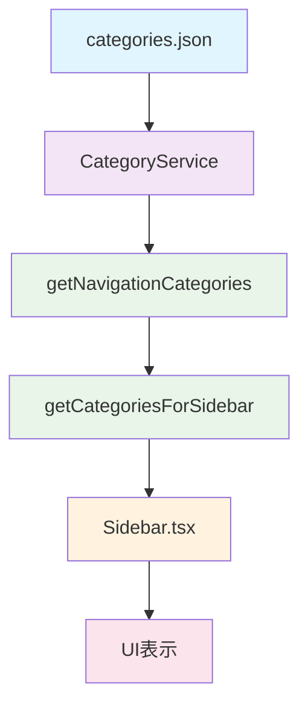

# Sidebar CategoryService 統合リファクタリング

## 概要

`Sidebar.tsx`をリファクタリングして`CategoryService`を活用し、責務を適切に分離しました。これにより、ナビゲーション用のカテゴリデータ管理が統一され、保守性と再利用性が大幅に向上しました。

## 背景

### 現状の問題

1. **CategoryService が使われていない**: `Sidebar.tsx`が直接`categories.json`を読み込んでいた
2. **責務の混在**: ナビゲーション設定と UI 表示が同じコンポーネントに混在
3. **保守性の低下**: アイコンが SVG でハードコーディングされていた
4. **再利用性の欠如**: 他のコンポーネントで同じカテゴリデータを取得する方法が統一されていなかった

### 解決方針

- **責務の分離**: データ管理、ナビゲーション変換、UI 表示を分離
- **CategoryService の活用**: 統一されたカテゴリデータ管理を利用
- **汎用関数の提供**: ナビゲーション用の便利関数を`src/lib/category`に追加

## 実装詳細

### 1. ナビゲーション用関数の追加

**ファイル**: `src/lib/category/navigation.ts`

```typescript
/**
 * ナビゲーション用のカテゴリ管理関数
 */

import { CategoryService } from "./category-service";
import type { Category } from "./types";

/**
 * ナビゲーション表示用のカテゴリ一覧を取得
 * displayOrder順にソートされた状態で返す
 */
export function getNavigationCategories(): Category[] {
  return CategoryService.getAllCategories({
    field: "displayOrder",
    order: "asc",
  });
}

/**
 * サイドバーのカテゴリセクション用データを取得
 * ナビゲーションアイテムとして使用しやすい形式に変換
 */
export interface SidebarCategoryItem {
  id: string;
  name: string;
  icon: string;
  color: string;
  href: string;
  subcategories?: Array<{
    id: string;
    name: string;
    href: string;
  }>;
}

export function getCategoriesForSidebar(): SidebarCategoryItem[] {
  const categories = getNavigationCategories();

  return categories.map((category) => ({
    id: category.id,
    name: category.name,
    icon: category.icon,
    color: category.color,
    href: `/${category.id}`,
    subcategories: category.subcategories?.map((sub) => ({
      id: sub.id,
      name: sub.name,
      href: sub.href,
    })),
  }));
}
```

### 2. エクスポートの更新

**ファイル**: `src/lib/category/index.ts`

```typescript
// ナビゲーション用関数のエクスポート
export {
  getNavigationCategories,
  getCategoriesForSidebar,
  type SidebarCategoryItem,
} from "./navigation";
```

### 3. Sidebar のリファクタリング

**ファイル**: `src/components/organisms/layout/Sidebar/Sidebar.tsx`

#### 変更前

```typescript
import categoriesData from "@/config/categories.json";

// カテゴリデータを直接使用
{categoriesData.map((category) => {
  const isActive =
    pathname === `/${category.id}` ||
    pathname?.startsWith(`/${category.id}/`);

  return (
    <li key={category.id}>
      <Link
        className={...}
        href={`/${category.id}`}
      >
        <CategoryIcon
          iconName={category.icon}
          className="size-3.5"
        />
        <span>{category.name}</span>
      </Link>
    </li>
  );
})}
```

#### 変更後

```typescript
import { getCategoriesForSidebar } from "@/lib/category";

// カテゴリデータをメモ化
const categories = useMemo(() => getCategoriesForSidebar(), []);

// カテゴリデータを使用
{categories.map((category) => {
  const isActive =
    pathname === category.href ||
    pathname?.startsWith(`${category.href}/`);

  return (
    <li key={category.id}>
      <Link
        className={...}
        href={category.href}
      >
        <CategoryIcon
          iconName={category.icon}
          className="size-3.5"
        />
        <span>{category.name}</span>
      </Link>
    </li>
  );
})}
```

## アーキテクチャの改善

### 責務の分離

| レイヤー               | 責務                               | 実装              |
| ---------------------- | ---------------------------------- | ----------------- |
| **データ管理**         | カテゴリデータの読み込み・管理     | `CategoryService` |
| **ナビゲーション変換** | ナビゲーション用データ形式への変換 | `navigation.ts`   |
| **UI 表示**            | サイドバーのレンダリング           | `Sidebar.tsx`     |

### データフロー



## メリット

### 1. 責務の分離

- **データ管理**: `CategoryService`が統一して担当
- **ナビゲーション変換**: `navigation.ts`が専用で担当
- **UI 表示**: `Sidebar.tsx`がシンプルに担当

### 2. 汎用性の向上

- `getCategoriesForSidebar()`は他のコンポーネントでも利用可能
- ヘッダー、フッター、メニューなどでも同じ関数を利用
- 一貫したカテゴリデータの取得方法を提供

### 3. 保守性の向上

- カテゴリ管理のロジックを一箇所に集約
- 将来的なフィルタ・ソート機能の追加が容易
- アイコンや色の管理が`CategoryService`経由で統一

### 4. テスタビリティの向上

- `navigation.ts`を独立してテスト可能
- `Sidebar.tsx`のテストが簡潔に
- モックデータの管理が容易

## 使用方法

### 基本的な使用方法

```typescript
import { getCategoriesForSidebar } from "@/lib/category";

function MyComponent() {
  const categories = useMemo(() => getCategoriesForSidebar(), []);

  return (
    <div>
      {categories.map((category) => (
        <div key={category.id}>
          <h3>{category.name}</h3>
          <p>Icon: {category.icon}</p>
          <p>Color: {category.color}</p>
          <a href={category.href}>Link</a>
        </div>
      ))}
    </div>
  );
}
```

### カスタムソート・フィルタ

```typescript
import { getNavigationCategories } from "@/lib/category";

function CustomNavigation() {
  const categories = useMemo(() => {
    const allCategories = getNavigationCategories();
    // カスタムフィルタ・ソートを適用
    return allCategories
      .filter((cat) => cat.active)
      .sort((a, b) => a.name.localeCompare(b.name));
  }, []);

  // ...
}
```

## 今後の拡張可能性

### 1. 動的ナビゲーション

- ユーザーの権限に基づくカテゴリフィルタ
- 使用頻度に基づくカテゴリソート
- リアルタイムでのカテゴリ更新

### 2. パフォーマンス最適化

- カテゴリデータのキャッシュ
- 遅延読み込み
- 仮想化による大量データの最適化

### 3. アクセシビリティ向上

- キーボードナビゲーション
- スクリーンリーダー対応
- 高コントラストモード対応

## 関連ドキュメント

- [CategoryService 仕様書](../category/category-service.md)
- [コンポーネント設計ガイド](../components/component-design.md)
- [アーキテクチャ概要](../../00_project_overview/architecture.md)
