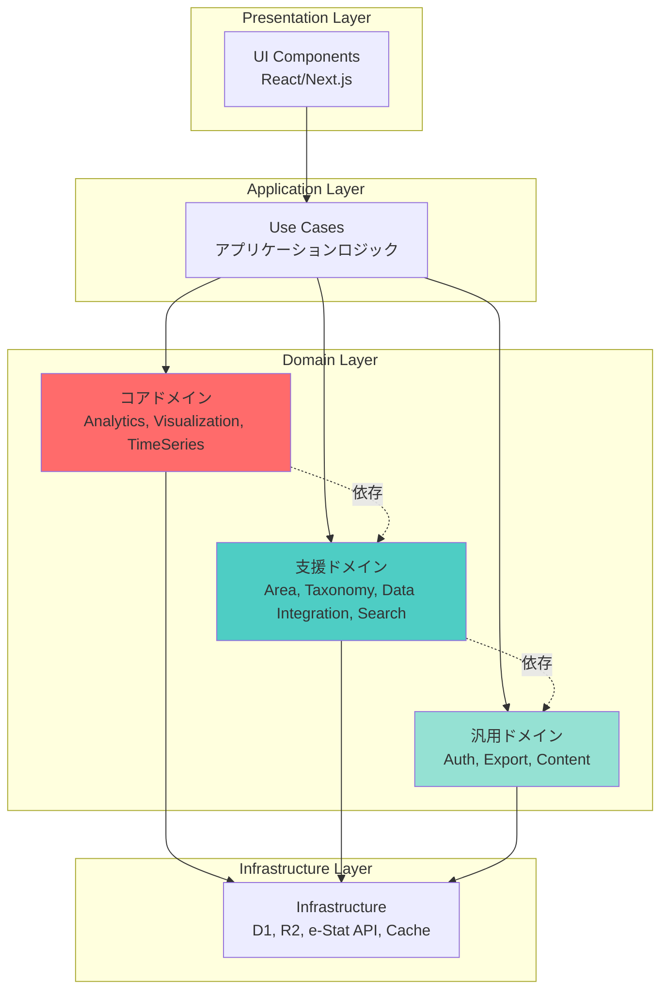

# DDDドメイン分類概要

## 目次

1. [概要](#概要)
2. [ドメイン分類](#ドメイン分類)
3. [ドメイン間の依存関係](#ドメイン間の依存関係)
4. [各ドメイン詳細設計](#各ドメイン詳細設計)

---

## 概要

このドキュメントは、stats47 プロジェクトをドメイン駆動設計（Domain-Driven Design, DDD）の原則に基づいて再構成するためのドメイン分類を定義します。

### DDD の主要な利点

- **ビジネスロジックの明確化**: ドメイン知識がコードに反映される
- **保守性の向上**: 関心の分離により変更が局所化される
- **拡張性**: 新しいドメインの追加が容易
- **テスタビリティ**: ドメインロジックが独立してテスト可能
- **チーム開発**: ドメインごとに担当を分けやすい

### ユビキタス言語

プロジェクト内で統一された用語を使用することで、開発者とドメインエキスパート間のコミュニケーションを円滑にします。

---

## ドメイン分類

ドメイン駆動設計では、ドメインを以下の 3 つのカテゴリーに分類します：

1. **コアドメイン（Core Domain）**: ビジネスの競争優位性を生み出す中核機能
2. **支援ドメイン（Supporting Domain）**: コアドメインを支える重要機能
3. **汎用ドメイン（Generic Domain）**: 標準的な機能（既製品で代替可能）

### ドメイン全体像

| ドメイン名 | 分類 | 責務 |
|-----------|------|------|
| Analytics | コアドメイン | ランキング計算、比較分析、傾向分析、統計サマリー生成、地域プロファイル生成、地域の強み検出、類似地域検出 |
| TimeSeries Analysis | コアドメイン | 複数年度データの取得・管理、CAGR計算、トレンドライン計算、前年比・前年同期比計算、時系列グラフ生成、複数地域の時系列比較 |
| Visualization | コアドメイン | 地図表示（コロプレスマップ）、グラフ生成、チャート設定管理、色スケール管理、凡例生成、歴史的行政区域データの管理、データソース表記の生成 |
| Area Management | 支援ドメイン | 都道府県・市区町村の階層構造管理、地域コードの検証と変換、地理形状データ管理、地域検索・フィルタリング、歴史的行政区域の変遷管理 |
| Taxonomy Management | 支援ドメイン | 分類体系の管理（カテゴリ・タグ・メタデータ）、階層構造とフラット構造の統合管理、ナビゲーション機能、複合フィルタリング、分類ベース検索 |
| Data Integration | 支援ドメイン | 外部API（e-Stat、World Bank、OECD等）との統合、データ取得・変換・正規化、APIパラメータマッピング、キャッシュ管理（R2/D1）、データ品質管理 |
| Search | 支援ドメイン | 全文検索エンジン、検索インデックス管理、検索演算子処理、オートコンプリート、サジェスト機能、検索履歴管理、ファセット検索、スペルチェック |
| Authentication & Authorization | 汎用ドメイン | ユーザー認証、セッション管理、権限制御、ロール管理 |
| Export | 汎用ドメイン | CSV/Excel/PDF出力、フォーマット変換、ダウンロード管理、エクスポートジョブ管理 |
| Content Management | 汎用ドメイン | ブログ記事管理、MDXコンテンツ処理、関連記事生成、SEO最適化 |

### レイヤー構造



---

## ドメイン間の依存関係

### レイヤー間の依存方向

```
【依存方向: 上位 → 下位】

Presentation Layer (UI)
        ↓
Application Layer (Use Cases)
        ↓
Domain Layer (Business Logic)
        ↓
Infrastructure Layer (Data Access)
```

### ドメイン間の依存

```
【依存方向: コア → 支援 → 汎用】

コアドメイン
  ├── Analytics Domain
  │   ↓ 依存
  └── Visualization Domain
      ↓ 依存
支援ドメイン
  ├── Area Domain
  ├── Taxonomy Domain            # ← 拡張（タグ管理追加）
  ├── Data Integration Domain
  └── Search Domain              # ← 新規追加
      ↓ 依存
汎用ドメイン
  ├── Auth Domain
  ├── Export Domain
  └── Content Domain
      ↓ 依存
共有カーネル
  └── Shared Value Objects & Utilities
```

### 依存関係の原則

1. **上位レイヤーは下位レイヤーに依存できる**
   - Presentation → Application → Domain → Infrastructure

2. **下位レイヤーは上位レイヤーに依存してはいけない**
   - インターフェースを使った依存性逆転の原則（DIP）を適用

3. **コアドメインは他のドメインに依存しない**
   - ビジネスロジックの純粋性を保つ

4. **支援ドメインはコアドメインを支援するが、逆は不可**
   - 一方向の依存のみ

5. **汎用ドメインは独立している**
   - どのドメインからも利用可能

---

## 各ドメイン詳細設計

### コアドメイン

- [Analytics ドメイン](../02_ドメイン設計/01_コアドメイン/01_Analytics.md) - 統計分析ドメイン
- [Visualization ドメイン](../02_ドメイン設計/01_コアドメイン/02_Visualization.md) - 可視化ドメイン
- [TimeSeries ドメイン](../02_ドメイン設計/01_コアドメイン/03_TimeSeries.md) - 時系列分析ドメイン

### 支援ドメイン

- [Area Management ドメイン](../02_ドメイン設計/02_支援ドメイン/01_AreaManagement.md) - 地域管理ドメイン
- [Taxonomy Management ドメイン](../02_ドメイン設計/02_支援ドメイン/02_TaxonomyManagement.md) - 分類体系管理ドメイン
- [Data Integration ドメイン](../02_ドメイン設計/02_支援ドメイン/03_DataIntegration.md) - データ統合ドメイン
- [Search ドメイン](../02_ドメイン設計/02_支援ドメイン/04_Search.md) - 検索ドメイン

### 汎用ドメイン

- [Authentication ドメイン](../02_ドメイン設計/03_汎用ドメイン/01_Authentication.md) - 認証・認可ドメイン
- [Export ドメイン](../02_ドメイン設計/03_汎用ドメイン/02_Export.md) - エクスポートドメイン
- [Content Management ドメイン](../02_ドメイン設計/03_汎用ドメイン/03_ContentManagement.md) - コンテンツ管理ドメイン

### 共有カーネル

- [共有カーネル](../02_ドメイン設計/00_共有カーネル/README.md) - 共通の値オブジェクトとユーティリティ

---

## 推奨ディレクトリ構造

```
src/
├── domain/                          # ドメイン層（ビジネスロジック）
│   ├── analytics/                   # 【コアドメイン】統計分析
│   ├── visualization/               # 【コアドメイン】可視化
│   ├── time-series/                 # 【コアドメイン】時系列分析
│   ├── area/                        # 【支援ドメイン】地域管理
│   ├── taxonomy/                    # 【支援ドメイン】分類体系管理
│   ├── data-integration/            # 【支援ドメイン】データ統合
│   ├── search/                      # 【支援ドメイン】検索
│   ├── auth/                        # 【汎用ドメイン】認証
│   ├── export/                      # 【汎用ドメイン】エクスポート
│   └── content/                     # 【汎用ドメイン】コンテンツ
├── application/                     # アプリケーション層（ユースケース）
├── infrastructure/                  # インフラストラクチャ層
├── presentation/                    # プレゼンテーション層（UI）
└── shared/                          # 共有カーネル
```

---

## 関連ドキュメント

- [システムアーキテクチャ](02_システムアーキテクチャ.md)
- [プロジェクト構造](03_プロジェクト構造.md)
- [技術スタック](01_技術スタック.md)

---

**更新履歴**:

- 2025-01-20: 初版作成（DDDドメイン分類.mdから概要部分を抽出）
