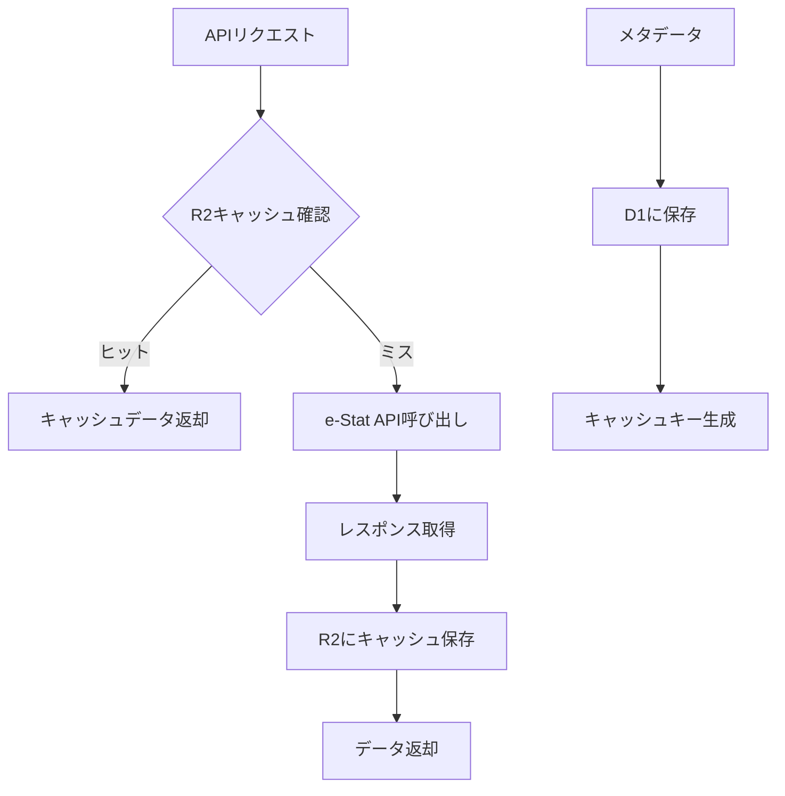

# システムアーキテクチャ

## 概要

stats47 は、Next.js 15 の App Router を使用したフルスタック Web アプリケーションです。地域統計データの可視化とランキング表示を提供し、SSR/ISR/CSR を適切に使い分けて高速でユーザーフレンドリーな体験を実現します。

> **データ基盤の詳細**: 本ドキュメントはアプリケーションアーキテクチャを扱います。**ローカル D1 → R2 snapshot → 配信** のデータフロー詳細は **`11_データ基盤設計.md`** が唯一の真実源。本ドキュメントは概要のみを記載し、詳細はそちらを参照してください。

## 全体アーキテクチャ

### アーキテクチャ図

```
┌─────────────────────────────────────────────────────────────┐
│                        Frontend Layer                       │
├─────────────────────────────────────────────────────────────┤
│  Next.js 15 App Router                                      │
│  ├── (public) - 公開ページ                                  │
│  └── (stats) - 統計データページ                             │
├─────────────────────────────────────────────────────────────┤
│  React 19 Components                                        │
│  ├── Server Components (SSR/ISR)                           │
│  └── Client Components (CSR)                               │
├─────────────────────────────────────────────────────────────┤
│  Visualization Libraries                                    │
│  ├── D3.js (地図可視化・時系列・高度なグラフ)                │
│  └── Leaflet/Mapbox (地図レンダリング)                      │
├─────────────────────────────────────────────────────────────┤
│  State Management                                            │
│  ├── Jotai (グローバル状態)                                 │
│  └── React State (ローカル状態)                             │
└─────────────────────────────────────────────────────────────┘
                                ↓
┌─────────────────────────────────────────────────────────────┐
│                      Data Access Layer                      │
├─────────────────────────────────────────────────────────────┤
│  SWR (データフェッチ・キャッシング)                          │
│  ├── API Routes (Next.js)                                  │
│  └── Direct DB Access                                      │
├─────────────────────────────────────────────────────────────┤
│  Analysis Services                                          │
│  ├── TimeSeriesService (時系列分析)                         │
│  ├── ChoroplethService (地図可視化)                         │
│  └── CalculationCache (計算結果キャッシュ)                  │
└─────────────────────────────────────────────────────────────┘
                                ↓
┌─────────────────────────────────────────────────────────────┐
│                      Data Layer (本番)                       │
├─────────────────────────────────────────────────────────────┤
│  Cloudflare R2 (本番唯一の data source)                     │
│  ├── snapshots/ranking-items/all.json                       │
│  ├── snapshots/ranking-values/<rk>/<area>/<year>.json       │
│  ├── snapshots/correlation/by-ranking-key/<rk>.json         │
│  ├── snapshots/blog/all.json                                │
│  ├── snapshots/page-components/all.json                     │
│  └── ... (他 11 ドメインの snapshot、詳細は 11_データ基盤設計.md)│
│                                                              │
│  Cloudflare D1 (本番では使用しない)                         │
│  └── Phase 10 (2026-04-29) で完全撤廃済み                   │
│                                                              │
│  ローカル D1 (開発者 PC、source of truth)                   │
│  ├── source of truth、8.4 GB SQLite                         │
│  └── exporter で R2 snapshot に変換                         │
└─────────────────────────────────────────────────────────────┘
                                ↓
┌─────────────────────────────────────────────────────────────┐
│                    External Services                        │
├─────────────────────────────────────────────────────────────┤
│  e-Stat API / MLIT 国土数値情報 / その他                    │
│  └── 取り込みスキル経由でローカル D1 に投入（本番は経由しない）│
└─────────────────────────────────────────────────────────────┘
```

## レンダリング戦略

### 戦略選択指針

| データ特性             | レンダリング方式 | 適用例                                 |
| ---------------------- | ---------------- | -------------------------------------- |
| 初期体験重要・共有可能 | SSR/ISR          | ランディングページ、ランキング初期表示 |
| ユーザー依存・頻更新   | CSR+SWR          | 絞り込み、個別設定                     |
| 静的・変更頻度低       | SSG              | カテゴリ一覧、ヘルプページ             |

### 実装パターン

#### Server Components（SSR/ISR）

```typescript
// サーバーサイドでデータ取得
export default async function RankingPage() {
  const data = await getRankingData();
  return <RankingDisplay data={data} />;
}
```

#### Client Components（CSR）

```typescript
"use client";
export default function InteractiveFilter() {
  const { data, mutate } = useSWR("/api/filtered-data", fetcher);
  return <FilterComponent data={data} onFilter={mutate} />;
}
```

## データ基盤

詳細は **`11_データ基盤設計.md`** を参照。要点のみ:

### 環境別データソース戦略

| 環境            | データソース                              | 用途                      |
| --------------- | ----------------------------------------- | ------------------------- |
| **mock**        | JSON fixture（vitest）                    | オフラインテスト          |
| **development** | ローカル D1 (`.local/d1/`) + ローカル R2  | ローカル開発              |
| **staging**     | （未使用）                                | -                         |
| **production**  | **リモート R2 のみ**（D1 binding なし）   | 本番運用                  |

### 配信フロー

```
[ローカル D1 (source of truth)]
        ↓ exporter (/export-snapshots)
[ローカル R2 (.local/r2/)]
        ↓ /push-r2
[リモート R2 (stats47 bucket)]
        ↓ fetchFromR2AsJson + in-memory cache
[apps/web (Cloudflare Workers)]
```

### 主要テーブル / snapshot

- **ランキング設定**: `ranking_items`, `surveys`, `categories` → `snapshots/{ranking-items,surveys,categories}/all.json`
- **ランキング値**: `observations` (旧 `ranking_data`) → `snapshots/ranking-values/<rk>/<areaType>/<year>.json` (29,642 partitions)
- **AI コンテンツ**: `ranking_ai_content` → `snapshots/ai-content/all.json`
- **相関分析**: `correlation_analysis` → `snapshots/correlation/...`
- **ブログ**: `articles` + `tags` + `article_tags` → `snapshots/blog/all.json`
- **ダッシュボード設定**: `page_components` → `snapshots/page-components/all.json`

完全な対応表は `11_データ基盤設計.md` §2.3 / §2.4 / §4 を参照。

### ダッシュボードシステム（page_components ベース）

ダッシュボード（KPI・チャート）は `page_components` テーブルで管理する。

**アーキテクチャ**:
- **DB 層**: ローカル D1 の `page_components` テーブル + `page_component_assignments`（割当）
- **配信**: exporter で `snapshots/page-components/all.json` に出力 → reader が in-memory cache
- **コンポーネント層**: `<DynamicDashboard>` / `<DynamicComponent>` で動的レンダリング

新規ダッシュボード追加 = `page_components` への INSERT + 再 export → push-r2。コードは触らない。

## 状態管理アーキテクチャ

### Jotai ベースの状態管理

#### 状態の分類

```typescript
// 1. プリミティブ状態
export const themeAtom = atomWithStorage<Theme>("theme", "light");
export const selectedCategoryAtom = atom<string | null>(null);

// 2. 派生状態
export const effectiveThemeAtom = atom((get) => {
  const theme = get(themeAtom);
  const mounted = get(mountedAtom);
  return mounted ? theme : "light";
});

// 3. 非同期状態
export const dataAtom = atom(async () => {
  const response = await fetch("/api/data");
  return response.json();
});

// 4. 書き込み専用状態（アクション）
export const toggleThemeAtom = atom(null, (get, set) => {
  const current = get(themeAtom);
  set(themeAtom, current === "light" ? "dark" : "light");
});
```

### 状態の永続化

```typescript
// localStorage連携
export const themeAtom = atomWithStorage<Theme>("theme", "light");

// カスタム永続化
export const customAtom = atomWithStorage("custom-key", defaultValue, {
  getItem: (key) => localStorage.getItem(key),
  setItem: (key, value) => localStorage.setItem(key, value),
  removeItem: (key) => localStorage.removeItem(key),
});
```

## API 設計

### RESTful API 原則

#### レスポンス形式

```typescript
// 成功レスポンス
interface SuccessResponse<T> {
  success: true;
  data: T;
  meta?: {
    pagination?: PaginationMeta;
    filters?: FilterMeta;
  };
}

// エラーレスポンス
interface ErrorResponse {
  success: false;
  error: {
    code: string;
    message: string;
    details?: unknown;
  };
}
```

#### エンドポイント設計

```typescript
// GET /api/ranking/{category}/{subcategory}
// GET /api/ranking/{category}/{subcategory}/{rankingKey}
// GET /api/dashboard/{category}/{subcategory}/{areaCode}
```

## パフォーマンス最適化

### 3 層キャッシュアーキテクチャ

#### L1: クライアントキャッシュ（SWR）

- **用途**: ユーザーセッション内でのデータキャッシュ
- **TTL**: 5 分〜1 時間（データ種別による）
- **実装**: SWR + React Query

#### L2: CDN/Edge キャッシュ（Cloudflare）

- **用途**: 地理的に分散したキャッシュ
- **TTL**: 1 時間〜24 時間
- **実装**: Cloudflare CDN + Cache-Control ヘッダー

#### L3: オブジェクトストレージキャッシュ（R2）

- **用途**: 重い計算結果と地理データの永続化
- **TTL**: 1 日〜1 週間
- **実装**: Cloudflare R2 + カスタムキャッシュキー

### R2 ストレージキャッシュ戦略

#### 地理データキャッシュ

```typescript
// キャッシュキー例
const geoCacheKey = `geo:topojson:${year}:${level}:${resolution}`;
// 例: "geo:topojson:2023:prefecture:low"

// TTL設定
const GEO_CACHE_TTL = 7 * 24 * 60 * 60; // 7日
```

#### e-Stat API レスポンスキャッシュ

```typescript
// キャッシュキー例
const estatCacheKey = `estat:${apiType}:${hash(parameters)}`;
// 例: "estat:getStatsData:abc123def456"

// TTL設定
const ESTAT_CACHE_TTL = 24 * 60 * 60; // 24時間
```

#### 計算結果キャッシュ

```typescript
// キャッシュキー例
const calcCacheKey = `calc:${operation}:${hash(inputData)}`;
// 例: "calc:cagr:def789ghi012"

// TTL設定
const CALC_CACHE_TTL = 6 * 60 * 60; // 6時間
```

### D1 と R2 の使い分け基準（2026-05 改訂）

本番ランタイムは D1 を使わない（撤廃済）。以下はローカル D1 と R2 snapshot の役割分担:

| データ種別                 | 保管場所         | 理由                                |
| -------------------------- | ---------------- | ----------------------------------- |
| **取り込み生データ**       | ローカル D1     | source of truth、構造化、検索・結合可 |
| **加工済データ（配信用）** | R2 snapshot     | 静的、本番 fetch、in-memory cache 効く |
| **e-Stat API レスポンス**  | R2（cache）     | 取り込み時の API 呼び出し削減        |
| **地理データ (TopoJSON)**  | R2              | バイナリ、大容量、読み取り専用       |
| **計算結果（一時）**       | ローカル D1 + R2 | D1 で計算 → R2 export → ローカル DROP |

### e-Stat API キャッシュフロー



### キャッシュ実装例

```typescript
// EstatCacheService
export class EstatCacheService {
  async getCachedResponse(
    apiType: string,
    parameters: Record<string, any>
  ): Promise<any> {
    const cacheKey = this.generateCacheKey(apiType, parameters);

    // R2からキャッシュを確認
    const cached = await this.r2Client.get(cacheKey);
    if (cached) {
      return JSON.parse(cached);
    }

    // e-Stat APIを呼び出し
    const response = await this.callEstatApi(apiType, parameters);

    // R2にキャッシュ保存
    await this.r2Client.put(cacheKey, JSON.stringify(response), {
      metadata: {
        ttl: ESTAT_CACHE_TTL,
        createdAt: new Date().toISOString(),
        apiType,
        parameters: JSON.stringify(parameters),
      },
    });

    return response;
  }

  private generateCacheKey(
    apiType: string,
    parameters: Record<string, any>
  ): string {
    const paramHash = crypto
      .createHash("sha256")
      .update(JSON.stringify(parameters))
      .digest("hex")
      .substring(0, 12);

    return `estat:${apiType}:${paramHash}`;
  }
}
```

### キャッシング戦略（従来）

1. **SWR キャッシング**: クライアントサイドでのデータキャッシュ
2. **ISR**: 静的生成とインクリメンタル再生成
3. **CDN**: Cloudflare CDN による静的ファイル配信
4. **データベースクエリ最適化**: インデックスとクエリ最適化

### バンドル最適化

1. **Dynamic Import**: 必要時のみコンポーネントをロード
2. **Tree Shaking**: 未使用コードの除去
3. **Code Splitting**: ページ単位での分割
4. **Turbopack**: 高速ビルドツールの活用
5. **ライブラリ最適化**: D3.js の部分読み込み

### 時系列分析の最適化

1. **データポイント制限**: 最大 100 年分のデータポイント
2. **計算メモ化**: CAGR、移動平均の結果キャッシュ
3. **段階的読み込み**: 初期表示は基本データ、詳細は遅延読み込み
4. **Web Workers**: 重い計算処理のバックグラウンド実行

### 地図可視化の最適化

1. **TopoJSON 使用**: GeoJSON より 30-80%軽量
2. **SVG レンダリング**: 47 都道府県程度なら SVG が最適
3. **Canvas レンダリング**: 大量データ時は Canvas 使用
4. **地理データ圧縮**: 不要な精度の除去
5. **ズームレベル最適化**: 表示レベルに応じたデータ切り替え

## 監視・ログ

### 監視戦略

1. **Cloudflare Analytics**: パフォーマンス監視
2. **Error Boundary**: React エラーハンドリング
3. **API エラーログ**: サーバーサイドエラーの記録
4. **パフォーマンスメトリクス**: Core Web Vitals の監視

## 関連ドキュメント

- [技術スタック](./技術スタック.md)
- [プロジェクト構造](./03_プロジェクト構造.md)
- [DDDドメイン分類](./04_DDDドメイン分類.md)
