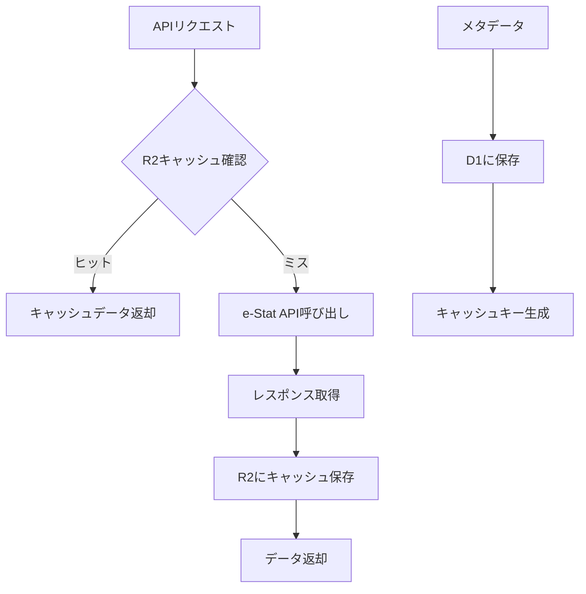

# システムアーキテクチャ

> **⚠️ データ層の正典は [`19_完全DBレス設計.md`](./19_完全DBレス設計.md)。**
> 本ドキュメントの「Data Layer / データベースアーキテクチャ」節の一部は doc 19 (2026-05-29 完全DBレス採択) 以前の記述で、
> **永続/リモート D1 を編集元 SSOT とする旧モデル (3 層 sources/indicators/observations 等) が残っている**。
> 現状は: **SSOT = git TS (設定・運用エンティティ) + R2 (観測値・配信) の二つだけ**。永続/リモート D1 は廃止。
> Derived (area_profiles / correlations) は **エフェメラル計算 → R2**。`ローカル D1 を直接 INSERT/UPDATE` する箇所は
> **`git TS 定義 → 生成スクリプトで R2`** に読み替えること。本番が R2 snapshot のみ読む点は不変。

## 概要

stats47 は、Next.js 15 の App Router を使用したフルスタック Web アプリケーションです。地域統計データの可視化とランキング表示を提供し、SSR/ISR/CSR を適切に使い分けて高速でユーザーフレンドリーな体験を実現します。

## 全体アーキテクチャ

### アーキテクチャ図

```
┌─────────────────────────────────────────────────────────────┐
│                        Frontend Layer                       │
├─────────────────────────────────────────────────────────────┤
│  Next.js 15 App Router                                      │
│  ├── (public) - 公開ページ                                  │
│  └── (stats) - 統計データページ                             │
├─────────────────────────────────────────────────────────────┤
│  React 19 Components                                        │
│  ├── Server Components (SSR/ISR)                           │
│  └── Client Components (CSR)                               │
├─────────────────────────────────────────────────────────────┤
│  Visualization Libraries                                    │
│  ├── D3.js (地図可視化・時系列・高度なグラフ)                │
│  └── Leaflet/Mapbox (地図レンダリング)                      │
├─────────────────────────────────────────────────────────────┤
│  State Management                                            │
│  ├── Jotai (グローバル状態)                                 │
│  └── React State (ローカル状態)                             │
└─────────────────────────────────────────────────────────────┘
                                ↓
┌─────────────────────────────────────────────────────────────┐
│                      Data Access Layer                      │
├─────────────────────────────────────────────────────────────┤
│  SWR (データフェッチ・キャッシング)                          │
│  ├── API Routes (Next.js)                                  │
│  └── R2 snapshot fetch (fetchFromR2AsJson) ※DB query なし   │
├─────────────────────────────────────────────────────────────┤
│  Analysis Services                                          │
│  ├── TimeSeriesService (時系列分析)                         │
│  ├── ChoroplethService (地図可視化)                         │
│  └── CalculationCache (計算結果キャッシュ)                  │
└─────────────────────────────────────────────────────────────┘
                                ↓
┌─────────────────────────────────────────────────────────────┐
│                      Data Layer                             │
├─────────────────────────────────────────────────────────────┤
│  Cloudflare R2 (オブジェクトストレージ — production の唯一の│
│                  app データソース、Phase 8/10 完了)         │
│  ├── app/home/featured.json                                │
│  ├── app/ranking/{key}/values.json (+ item / ai-content /  │
│  │                                   page-cards)           │
│  ├── app/category/{key}/items.json                         │
│  ├── app/survey/all.json + app/survey/{id}/items.json      │
│  ├── app/areas/{code}/profile.json                         │
│  ├── app/correlation/by-ranking-key/{key}.json             │
│  ├── app/blog/all.json + app/page-components/all.json      │
│  ├── app/affiliate-ads/all.json                            │
│  ├── app/ports/... + app/fishing-ports/all.json            │
│  └── gis/ / ges/ / sns/ (非 Web アプリデータ)              │
├─────────────────────────────────────────────────────────────┤
│  オーサリング SSOT (永続 D1 なし — 完全DBレス doc 19)       │
│  ├── git TS: 設定・運用エンティティ                         │
│  │     (page_components / theme_metrics / categories /      │
│  │      themes / surveys / affiliate_ads / sns_posts)       │
│  ├── R2: 観測値 (app/stats/<metric>/*.json)                 │
│  ├── Reference (再生成): articles(article.md) / estat_catalog│
│  │     / prefectures / cities / ports / fishing_ports       │
│  └── Derived (エフェメラル計算→R2): area_profiles / 相関     │
│  ※ schema 定義 (packages/database/schema) は型ソース/テスト  │
│     用に残置。使い捨てビルドキャッシュ SQLite は SSOT でない │
└─────────────────────────────────────────────────────────────┘
                                ↓
┌─────────────────────────────────────────────────────────────┐
│                    External Services                        │
├─────────────────────────────────────────────────────────────┤
│  e-Stat API                                                 │
│  ├── 統計データ取得                                         │
│  └── メタデータ取得                                         │
└─────────────────────────────────────────────────────────────┘
```

## レンダリング戦略

### 戦略選択指針

| データ特性             | レンダリング方式 | 適用例                                 |
| ---------------------- | ---------------- | -------------------------------------- |
| 初期体験重要・共有可能 | SSR/ISR          | ランディングページ、ランキング初期表示 |
| ユーザー依存・頻更新   | CSR+SWR          | 絞り込み、個別設定                     |
| 静的・変更頻度低       | SSG              | カテゴリ一覧、ヘルプページ             |

### 実装パターン

#### Server Components（SSR/ISR）

```typescript
// サーバーサイドでデータ取得
export default async function RankingPage() {
  const data = await getRankingData();
  return <RankingDisplay data={data} />;
}
```

#### Client Components（CSR）

```typescript
"use client";
export default function InteractiveFilter() {
  const { data, mutate } = useSWR("/api/filtered-data", fetcher);
  return <FilterComponent data={data} onFilter={mutate} />;
}
```

## データベースアーキテクチャ

### 環境別データソース戦略

| 環境            | データソース  | 接続方法                    | 用途                      |
| --------------- | ------------- | --------------------------- | ------------------------- |
| **オーサリング (設定/運用)** | git TS | `packages/data-configs/` 他の TS 定義 | 設定・運用エンティティの SSOT |
| **観測値** | Cloudflare R2 | `app/stats/<metric>/*.json` | 観測値の SSOT |
| **production app** | Cloudflare R2 (snapshot JSON) | `https://storage.stats47.jp/app/...` | 本番配信 (D1 binding なし) |
| **ビルドキャッシュ (任意)** | ローカル SQLite | `packages/database/.data/stats47.sqlite` | 使い捨て・再生成可能。SSOT ではない |

**重要 (完全DBレス → doc 19)**: SSOT は **git TS と R2 の二つだけ**。production app は 2026-04-29 以降 Cloudflare D1 binding を持たず、Phase F (2026-05-30) で実行時 D1 query = 0。永続/リモート D1 は廃止。ローカル SQLite は「再生成可能な使い捨てビルドキャッシュ / エフェメラル集計エンジン」で、編集元 SSOT ではない。

### データフロー

```
[git TS 定義 (設定・運用 SSOT)] ──生成スクリプト──▶ [R2 app/<domain>/...]
[R2 観測値 (app/stats/...)]      ──エフェメラル計算──▶ [R2 派生 snapshot]
                                                        ↓ (fetch)
                                              [Server Component → Page]
```

### 主要エンティティ (SSOT 別)

| 種別 | SSOT | 該当 |
|---|---|---|
| 観測値 | **R2** | `app/stats/<metric>/{values,cities,ports,migration-flow}.json` |
| Authored / 設定・運用 | **git TS** → 生成で R2 | `page_components` / `theme_metrics` / `categories` / `themes` / `surveys` / `affiliate_ads` / `sns_posts` |
| Reference (外部に真実源) | 再生成 | `articles` (article.md) / `estat_catalog` (e-Stat API) / `prefectures` / `cities` / `ports` / `fishing_ports` |
| Derived (計算) | **エフェメラル → R2** | `area_profiles` / `correlations` |

> 旧「3 層モデル (sources / indicators / observations)」は Phase 6 で観測値を R2 に移行した時点で廃止。永続テーブルは持たない (schema 定義は型ソース / テスト基盤として残置)。

### 動的ダッシュボードシステム

`page_components` (313 行) + `page_component_assignments` (331 行) でテーマ / エリア / ランキング各ページのチャート構成を DB 駆動で管理。

**アーキテクチャ**:
- **定義 (SSOT)**: `page_components` の定義は **git TS** が SSOT (完全DBレス。Phase E で git TS → R2 直接生成に移行予定)
  - page_type: `theme` / `area-category` / `area` / `ranking` / `city-category`
- **配信**: `app/page-components/all.json` → R2 経由で production app に配信
- **生成**: git TS 定義 → 生成スクリプトで R2 (横断整合性はビルド時に検証)。手編集 JSON / 永続 D1 を SSOT にしない

**メリット**:
- ダッシュボード追加: **DB レコード追加のみ** (コード変更ゼロ)
- ranking_page_cards (旧 専用テーブル) は 2026-05-04 に統合済み (PR #204)

## 状態管理アーキテクチャ

### Jotai ベースの状態管理

#### 状態の分類

```typescript
// 1. プリミティブ状態
export const themeAtom = atomWithStorage<Theme>("theme", "light");
export const selectedCategoryAtom = atom<string | null>(null);

// 2. 派生状態
export const effectiveThemeAtom = atom((get) => {
  const theme = get(themeAtom);
  const mounted = get(mountedAtom);
  return mounted ? theme : "light";
});

// 3. 非同期状態
export const dataAtom = atom(async () => {
  const response = await fetch("/api/data");
  return response.json();
});

// 4. 書き込み専用状態（アクション）
export const toggleThemeAtom = atom(null, (get, set) => {
  const current = get(themeAtom);
  set(themeAtom, current === "light" ? "dark" : "light");
});
```

### 状態の永続化

```typescript
// localStorage連携
export const themeAtom = atomWithStorage<Theme>("theme", "light");

// カスタム永続化
export const customAtom = atomWithStorage("custom-key", defaultValue, {
  getItem: (key) => localStorage.getItem(key),
  setItem: (key, value) => localStorage.setItem(key, value),
  removeItem: (key) => localStorage.removeItem(key),
});
```

## API 設計

### RESTful API 原則

#### レスポンス形式

```typescript
// 成功レスポンス
interface SuccessResponse<T> {
  success: true;
  data: T;
  meta?: {
    pagination?: PaginationMeta;
    filters?: FilterMeta;
  };
}

// エラーレスポンス
interface ErrorResponse {
  success: false;
  error: {
    code: string;
    message: string;
    details?: unknown;
  };
}
```

#### エンドポイント設計

```typescript
// GET /api/ranking/{category}/{subcategory}
// GET /api/ranking/{category}/{subcategory}/{rankingKey}
// GET /api/dashboard/{category}/{subcategory}/{areaCode}
```

## パフォーマンス最適化

### 3 層キャッシュアーキテクチャ

#### L1: クライアントキャッシュ（SWR）

- **用途**: ユーザーセッション内でのデータキャッシュ
- **TTL**: 5 分〜1 時間（データ種別による）
- **実装**: SWR + React Query

#### L2: CDN/Edge キャッシュ（Cloudflare）

- **用途**: 地理的に分散したキャッシュ
- **TTL**: 1 時間〜24 時間
- **実装**: Cloudflare CDN + Cache-Control ヘッダー

#### L3: オブジェクトストレージキャッシュ（R2）

- **用途**: 重い計算結果と地理データの永続化
- **TTL**: 1 日〜1 週間
- **実装**: Cloudflare R2 + カスタムキャッシュキー

### R2 ストレージキャッシュ戦略

#### 地理データキャッシュ

```typescript
// キャッシュキー例
const geoCacheKey = `geo:topojson:${year}:${level}:${resolution}`;
// 例: "geo:topojson:2023:prefecture:low"

// TTL設定
const GEO_CACHE_TTL = 7 * 24 * 60 * 60; // 7日
```

#### e-Stat API レスポンスキャッシュ

```typescript
// キャッシュキー例
const estatCacheKey = `estat:${apiType}:${hash(parameters)}`;
// 例: "estat:getStatsData:abc123def456"

// TTL設定
const ESTAT_CACHE_TTL = 24 * 60 * 60; // 24時間
```

#### 計算結果キャッシュ

```typescript
// キャッシュキー例
const calcCacheKey = `calc:${operation}:${hash(inputData)}`;
// 例: "calc:cagr:def789ghi012"

// TTL設定
const CALC_CACHE_TTL = 6 * 60 * 60; // 6時間
```

### D1 と R2 の使い分け基準

| データ種別         | ストレージ | 理由                            |
| ------------------ | ---------- | ------------------------------- |
| **ユーザー設定**   | D1         | トランザクション必要、ACID 保証 |
| **メタデータ**     | D1         | 構造化データ、検索・結合必要    |
| **API レスポンス** | R2         | 非構造化、大容量、読み取り専用  |
| **地理データ**     | R2         | バイナリファイル、大容量        |
| **計算結果**       | R2         | 一時的、大容量、キャッシュ用途  |

### e-Stat API キャッシュフロー


```mermaid
graph TD
    A[APIリクエスト] --> B{R2キャッシュ確認}
    B -->|ヒット| C[キャッシュデータ返却]
    B -->|ミス| D[e-Stat API呼び出し]
    D --> E[レスポンス取得]
    E --> F[R2にキャッシュ保存]
    F --> G[データ返却]

    H[メタデータ] --> I[D1に保存]
    I --> J[キャッシュキー生成]
```

### キャッシュ実装例

```typescript
// EstatCacheService
export class EstatCacheService {
  async getCachedResponse(
    apiType: string,
    parameters: Record<string, any>
  ): Promise<any> {
    const cacheKey = this.generateCacheKey(apiType, parameters);

    // R2からキャッシュを確認
    const cached = await this.r2Client.get(cacheKey);
    if (cached) {
      return JSON.parse(cached);
    }

    // e-Stat APIを呼び出し
    const response = await this.callEstatApi(apiType, parameters);

    // R2にキャッシュ保存
    await this.r2Client.put(cacheKey, JSON.stringify(response), {
      metadata: {
        ttl: ESTAT_CACHE_TTL,
        createdAt: new Date().toISOString(),
        apiType,
        parameters: JSON.stringify(parameters),
      },
    });

    return response;
  }

  private generateCacheKey(
    apiType: string,
    parameters: Record<string, any>
  ): string {
    const paramHash = crypto
      .createHash("sha256")
      .update(JSON.stringify(parameters))
      .digest("hex")
      .substring(0, 12);

    return `estat:${apiType}:${paramHash}`;
  }
}
```

### キャッシング戦略（従来）

1. **SWR キャッシング**: クライアントサイドでのデータキャッシュ
2. **ISR**: 静的生成とインクリメンタル再生成
3. **CDN**: Cloudflare CDN による静的ファイル配信
4. **データベースクエリ最適化**: インデックスとクエリ最適化

### バンドル最適化

1. **Dynamic Import**: 必要時のみコンポーネントをロード
2. **Tree Shaking**: 未使用コードの除去
3. **Code Splitting**: ページ単位での分割
4. **Turbopack**: 高速ビルドツールの活用
5. **ライブラリ最適化**: D3.js の部分読み込み

### 時系列分析の最適化

1. **データポイント制限**: 最大 100 年分のデータポイント
2. **計算メモ化**: CAGR、移動平均の結果キャッシュ
3. **段階的読み込み**: 初期表示は基本データ、詳細は遅延読み込み
4. **Web Workers**: 重い計算処理のバックグラウンド実行

### 地図可視化の最適化

1. **TopoJSON 使用**: GeoJSON より 30-80%軽量
2. **SVG レンダリング**: 47 都道府県程度なら SVG が最適
3. **Canvas レンダリング**: 大量データ時は Canvas 使用
4. **地理データ圧縮**: 不要な精度の除去
5. **ズームレベル最適化**: 表示レベルに応じたデータ切り替え

## 監視・ログ

### 監視戦略

1. **Cloudflare Analytics**: パフォーマンス監視
2. **Error Boundary**: React エラーハンドリング
3. **API エラーログ**: サーバーサイドエラーの記録
4. **パフォーマンスメトリクス**: Core Web Vitals の監視

## 関連ドキュメント

- [技術スタック](./技術スタック.md)
- [プロジェクト構造](./03_プロジェクト構造.md)
- [DDDドメイン分類](./04_DDDドメイン分類.md)
