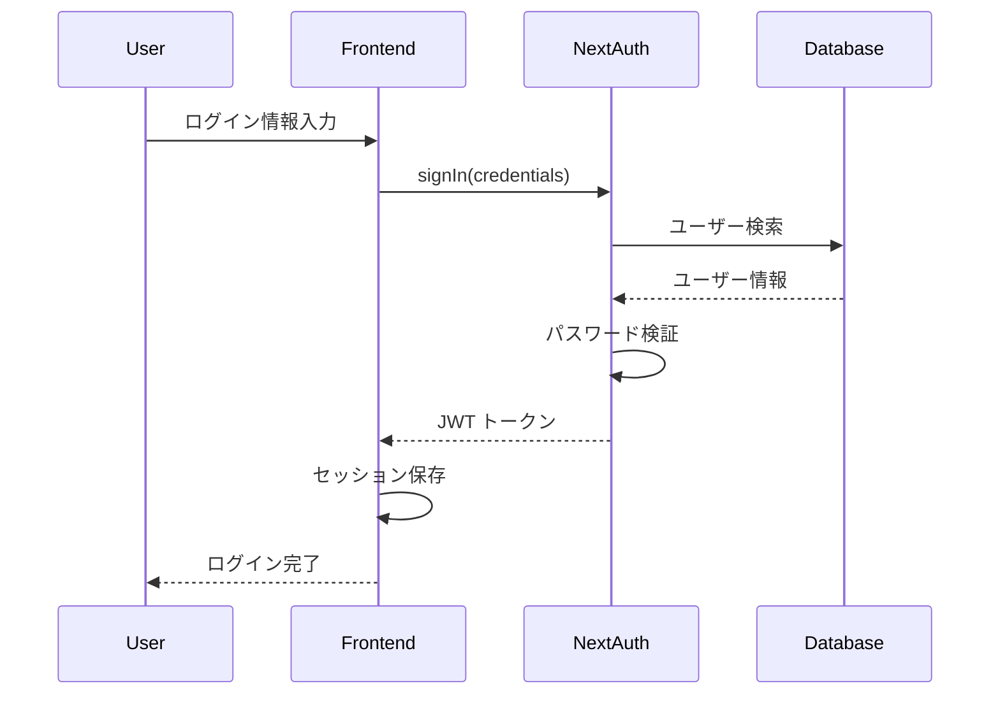
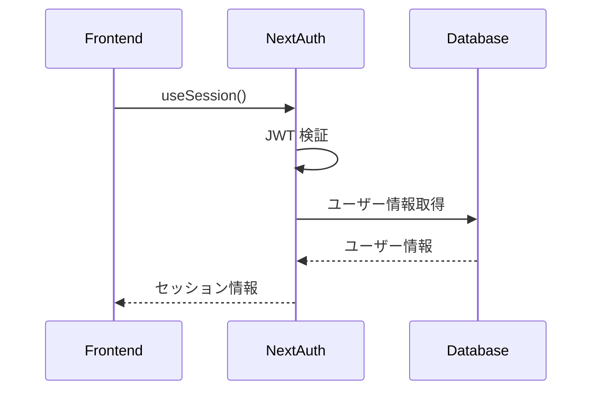
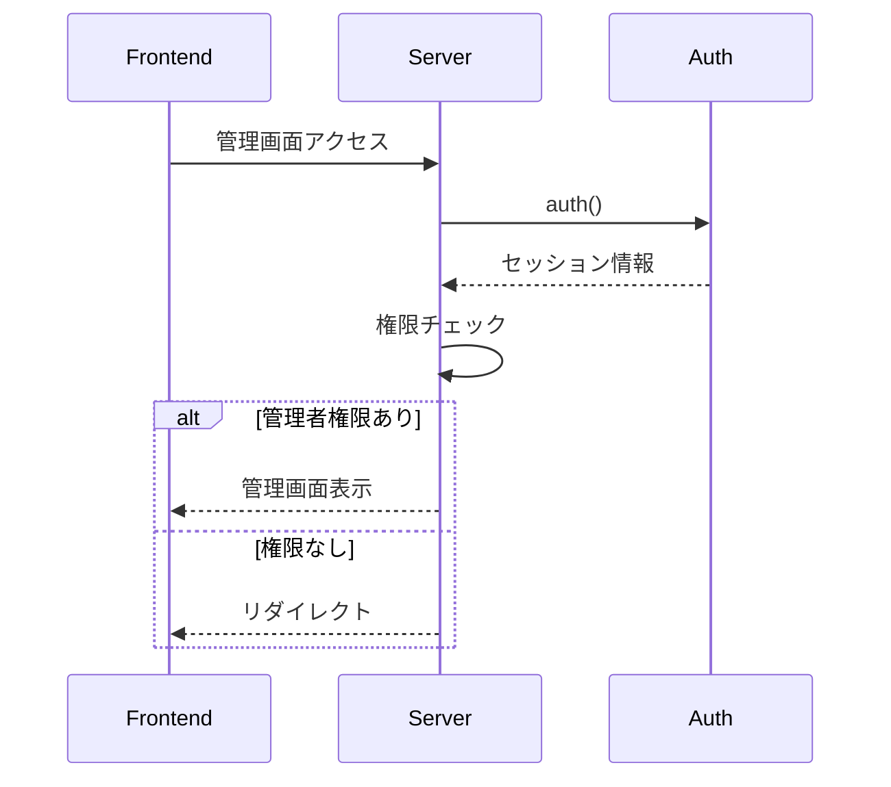

# Auth（認証）ドメイン完全ガイド

## 目次

1. [概要・責任](#概要責任)
2. [技術スタック](#技術スタック)
3. [アーキテクチャ設計](#アーキテクチャ設計)
4. [データベース設計](#データベース設計)
5. [認証フロー](#認証フロー)
6. [NextAuth 実装ガイド](#nextauth実装ガイド)
7. [Server Actions 実装](#server-actions実装)
8. [セキュリティ対策](#セキュリティ対策)
9. [テスト戦略](#テスト戦略)
10. [トラブルシューティング](#トラブルシューティング)

---

# 概要・責任

## ドメインの責任

認証（Auth）ドメインは、Stats47 プロジェクトにおけるユーザー認証・認可・セッション管理を統合管理します。

### 主な責任

1. **ユーザー認証**: メールアドレス/パスワードによる認証、OAuth 認証
2. **セッション管理**: JWT 戦略によるステートレスなセッション管理
3. **権限管理**: 役割ベースのアクセス制御（RBAC）
4. **ユーザー管理**: ユーザー情報の作成、更新、削除
5. **セキュリティ**: パスワードハッシュ化、CSRF 保護、レート制限

### 主要機能

1. **通常ログイン機能**

   - メールアドレス/ユーザー名 + パスワードでのログイン
   - パスワードハッシュ化（bcryptjs）
   - セッション管理（JWT）

2. **OAuth 連携ログイン**

   - Google アカウントでログイン
   - LINE アカウントでログイン
   - OAuth 2.0 / OpenID Connect

3. **新規登録機能**

   - メールアドレスベースの新規登録
   - メール認証（オプション）
   - パスワード強度チェック

4. **ユーザー管理機能（管理者専用）**

   - ユーザー一覧表示
   - ユーザー詳細情報
   - ユーザーの有効化/無効化
   - 役割（ロール）管理

5. **プロフィール編集機能**

   - ユーザー情報の編集
   - パスワード変更
   - アカウント連携管理

6. **役割ベースのアクセス制御（RBAC）**
   - 管理者（admin）：すべての機能にアクセス可能
   - 一般ユーザー（user）：閲覧のみ

---

# 技術スタック

## 使用技術の選定理由

### NextAuth.js v5 (Auth.js)

**選定理由:**

- **業界標準**: React/Next.js エコシステムで最も広く使用されている認証ライブラリ
- **セキュリティ**: セキュリティベストプラクティスが組み込まれている
- **豊富なプロバイダー**: OAuth、Credentials、2FA など多様な認証方式をサポート
- **TypeScript サポート**: 型安全性を提供
- **Cloudflare Workers 対応**: ステートレスな JWT 戦略で Cloudflare 環境に最適
- **メンテナンス性**: 活発なコミュニティとドキュメント

### 技術スタック一覧

| 項目               | 技術                       | バージョン |
| ------------------ | -------------------------- | ---------- |
| 認証ライブラリ     | **NextAuth (Auth.js)**     | v5         |
| プロバイダー       | **Credentials**            | -          |
| セッション戦略     | **JWT**                    | -          |
| パスワードハッシュ | **bcryptjs**               | -          |
| データベース       | **Cloudflare D1 (SQLite)** | -          |
| フロントエンド     | **Next.js 15**             | v15        |
| 状態管理           | **useSession**             | -          |

---

# アーキテクチャ設計

## アーキテクチャ概要

```
┌─────────────────┐    ┌──────────────────┐    ┌─────────────────┐
│   Frontend      │    │   NextAuth       │    │   Database      │
│   (React)       │◄──►│   (Auth.js)      │◄──►│   (D1)          │
│                 │    │                  │    │                 │
│ - useSession()  │    │ - JWT Strategy   │    │ - users table   │
│ - SessionProvider│    │ - Credentials    │    │ - sessions table│
│ - signIn()      │    │ - Callbacks      │    │                 │
└─────────────────┘    └──────────────────┘    └─────────────────┘
```

## ファイル構成

```
src/
├── app/
│   ├── api/auth/[...nextauth]/route.ts
│   ├── admin/page.tsx
│   ├── profile/page.tsx
│   └── layout.tsx
├── features/auth/
│   ├── lib/auth.ts
│   ├── components/
│   │   ├── LoginForm/
│   │   ├── RegisterForm/
│   │   ├── AuthModal/
│   │   └── HeaderAuthSection/
│   ├── actions/
│   └── types/
└── hooks/
    └── useTheme.ts
```

## 環境別動作

| 環境     | 認証動作     | データソース                |
| -------- | ------------ | --------------------------- |
| **Mock** | 認証バイパス | `data/mock/auth/users.json` |
| **API**  | 認証必須     | Cloudflare D1               |
| **本番** | 認証必須     | Cloudflare D1               |

---

# データベース設計

## users テーブル

```sql
CREATE TABLE users (
  id TEXT PRIMARY KEY,
  email TEXT UNIQUE NOT NULL,
  username TEXT UNIQUE NOT NULL,
  password_hash TEXT NOT NULL,
  name TEXT,
  role TEXT NOT NULL DEFAULT 'user' CHECK (role IN ('admin', 'user')),
  is_active BOOLEAN NOT NULL DEFAULT 1,
  created_at DATETIME NOT NULL DEFAULT CURRENT_TIMESTAMP,
  updated_at DATETIME NOT NULL DEFAULT CURRENT_TIMESTAMP,
  last_login DATETIME
);
```

## インデックス

```sql
CREATE INDEX idx_users_email ON users(email);
CREATE INDEX idx_users_username ON users(username);
CREATE INDEX idx_users_role ON users(role);
CREATE INDEX idx_users_active ON users(is_active);
```

---

# 認証フロー

## ログインフロー



## セッション管理フロー



## 権限チェックフロー



---

# NextAuth 実装ガイド

## 環境変数設定

### 必須環境変数

```bash
# NextAuth設定
AUTH_SECRET=your-secret-key-here
NEXTAUTH_URL=http://localhost:3000

# データベース（Cloudflare D1）
DATABASE_URL=your-d1-database-url

# OAuth（オプション）
GOOGLE_CLIENT_ID=your-google-client-id
GOOGLE_CLIENT_SECRET=your-google-client-secret
LINE_CLIENT_ID=your-line-client-id
LINE_CLIENT_SECRET=your-line-client-secret
```

## NextAuth 設定

```typescript
// src/features/auth/lib/auth.ts
import NextAuth from "next-auth";
import Credentials from "next-auth/providers/credentials";
import bcrypt from "bcryptjs";

export const authConfig: NextAuthConfig = {
  secret: process.env.AUTH_SECRET,
  providers: [
    Credentials({
      name: "credentials",
      credentials: {
        email: { label: "Email", type: "email" },
        password: { label: "Password", type: "password" },
      },
      async authorize(credentials) {
        if (!credentials?.email || !credentials?.password) {
          return null;
        }

        try {
          const db = await getDataProvider();
          const user = await db
            .prepare("SELECT * FROM users WHERE email = ?")
            .bind(credentials.email)
            .first();

          if (!user) return null;

          const isValidPassword = await bcrypt.compare(
            credentials.password as string,
            user.password_hash as string
          );

          if (!isValidPassword || !user.is_active) {
            return null;
          }

          return {
            id: user.id,
            name: user.name,
            email: user.email,
            username: user.username,
            role: user.role,
          };
        } catch (error) {
          console.error("Authorization error:", error);
          return null;
        }
      },
    }),
  ],
  callbacks: {
    async session({ session, token }) {
      if (token) {
        session.user.id = token.id as string;
        session.user.username = token.username as string;
        session.user.role = token.role as "admin" | "user";
      }
      return session;
    },
    async jwt({ token, user }) {
      if (user) {
        token.id = user.id;
        token.username = user.username || "";
        token.role = user.role || "user";
      }
      return token;
    },
  },
  pages: {
    signIn: "/login",
    signOut: "/logout",
    error: "/login",
  },
  session: {
    strategy: "jwt",
    maxAge: 30 * 24 * 60 * 60, // 30日
    updateAge: 24 * 60 * 60, // 24時間ごとに更新
  },
};
```

## 型定義

```typescript
// src/features/auth/types/index.ts
declare module "next-auth" {
  interface Session {
    user: {
      id: string;
      name?: string | null;
      email?: string | null;
      image?: string | null;
      username?: string;
      role: "admin" | "user";
    };
  }

  interface User {
    id: string;
    name?: string | null;
    email?: string | null;
    image?: string | null;
    username?: string;
    role: "admin" | "user";
  }
}

declare module "next-auth/jwt" {
  interface JWT {
    id: string;
    username: string;
    role: "admin" | "user";
  }
}
```

---

# Server Actions 実装

## 管理画面の Server Actions 化

### 変更前（フルクライアント）

```typescript
"use client";

export default function AdminPage() {
  const { data: session } = useSession();
  const { users, isLoading, error, toggleUserStatus } = useAdminUsers();

  if (!session?.user || session.user.role !== "admin") {
    return <AdminAccessDenied />;
  }

  return <UserManagementTable onToggleStatus={toggleUserStatus} />;
}
```

### 変更後（ハイブリッド）

```typescript
// サーバーコンポーネント
export default async function AdminPage() {
  const session = await auth();

  if (!session?.user || session.user.role !== "admin") {
    redirect("/");
  }

  const users = await fetchUsers();
  const stats = calculateUserStats(users);

  return (
    <div>
      <AdminPageHeader />
      <AdminStatsCards stats={stats} />
      <UserManagementTableServer users={users} />
    </div>
  );
}
```

## Server Actions 実装

```typescript
// src/features/auth/actions/index.ts
"use server";

import { auth } from "@/features/auth/lib/auth";
import { getDataProvider } from "@/infrastructure/database";

export async function fetchUsers() {
  const session = await auth();

  if (!session?.user || session.user.role !== "admin") {
    throw new Error("Unauthorized");
  }

  const db = await getDataProvider();
  const users = await db
    .prepare("SELECT * FROM users ORDER BY created_at DESC")
    .all();

  return users.results || [];
}

export async function toggleUserStatus(userId: string, isActive: boolean) {
  const session = await auth();

  if (!session?.user || session.user.role !== "admin") {
    throw new Error("Unauthorized");
  }

  const db = await getDataProvider();
  await db
    .prepare(
      "UPDATE users SET is_active = ?, updated_at = CURRENT_TIMESTAMP WHERE id = ?"
    )
    .bind(isActive ? 1 : 0, userId)
    .run();

  return { success: true };
}
```

## メリット

1. **パフォーマンス向上**: サーバーサイドでデータ取得
2. **セキュリティ向上**: サーバーサイドで認証・認可チェック
3. **SEO 対応**: サーバーサイドレンダリング
4. **バンドルサイズ削減**: クライアントサイドの JavaScript 削減

---

# セキュリティ対策

## パスワードセキュリティ

```typescript
import bcrypt from "bcryptjs";

// パスワードハッシュ化
const saltRounds = 12;
const hashedPassword = await bcrypt.hash(password, saltRounds);

// パスワード検証
const isValid = await bcrypt.compare(password, hashedPassword);
```

## CSRF 保護

NextAuth.js が自動的に CSRF 保護を提供：

```typescript
// CSRFトークンは自動生成・検証
const csrfToken = await getCsrfToken();
```

## レート制限

```typescript
// ログイン試行回数制限
const MAX_LOGIN_ATTEMPTS = 5;
const LOCKOUT_DURATION = 15 * 60 * 1000; // 15分

// 実装例
const loginAttempts = await getLoginAttempts(email);
if (loginAttempts >= MAX_LOGIN_ATTEMPTS) {
  throw new Error("Too many login attempts");
}
```

## セッションセキュリティ

```typescript
// JWT設定
session: {
  strategy: "jwt",
  maxAge: 30 * 24 * 60 * 60, // 30日
  updateAge: 24 * 60 * 60, // 24時間ごとに更新
},

// Cookie設定
cookies: {
  sessionToken: {
    name: "authjs.session-token",
    options: {
      httpOnly: true,
      sameSite: "lax",
      path: "/",
      secure: process.env.NODE_ENV === "production",
    },
  },
},
```

---

# テスト戦略

## ユニットテスト

```typescript
// src/features/auth/__tests__/auth.test.ts
import { describe, it, expect, vi } from "vitest";
import { authConfig } from "@/features/auth/lib/auth";

describe("Auth Configuration", () => {
  it("should have correct providers", () => {
    expect(authConfig.providers).toHaveLength(1);
    expect(authConfig.providers[0].name).toBe("credentials");
  });

  it("should have JWT strategy", () => {
    expect(authConfig.session?.strategy).toBe("jwt");
  });
});
```

## 統合テスト

```typescript
// src/features/auth/__tests__/integration.test.ts
import { describe, it, expect } from "vitest";
import { fetchUsers } from "@/features/auth/actions";

describe("Auth Integration", () => {
  it("should fetch users for admin", async () => {
    // Mock admin session
    const users = await fetchUsers();
    expect(Array.isArray(users)).toBe(true);
  });
});
```

## E2E テスト

```typescript
// tests/e2e/auth.spec.ts
import { test, expect } from "@playwright/test";

test("should login successfully", async ({ page }) => {
  await page.goto("/login");
  await page.fill('[data-testid="email"]', "admin@example.com");
  await page.fill('[data-testid="password"]', "password");
  await page.click('[data-testid="login-button"]');

  await expect(page).toHaveURL("/admin");
});
```

---

# トラブルシューティング

## よくある問題

### 1. セッションが取得できない

**原因**: 環境変数の設定ミス
**解決策**:

```bash
# .env.local
AUTH_SECRET=your-secret-key-here
NEXTAUTH_URL=http://localhost:3000
```

### 2. データベース接続エラー

**原因**: D1 データベースの設定ミス
**解決策**:

```bash
# wrangler.toml
[[d1_databases]]
binding = "DB"
database_name = "stats47-db"
database_id = "your-database-id"
```

### 3. パスワードハッシュ化エラー

**原因**: bcryptjs の設定ミス
**解決策**:

```typescript
// 正しい実装
const saltRounds = 12;
const hashedPassword = await bcrypt.hash(password, saltRounds);
```

### 4. 権限チェックが動作しない

**原因**: セッションコールバックの設定ミス
**解決策**:

```typescript
callbacks: {
  async session({ session, token }) {
    if (token) {
      session.user.role = token.role;
    }
    return session;
  },
}
```

## デバッグ方法

### 1. セッション情報の確認

```typescript
// デバッグ用
console.log("Session:", session);
console.log("User:", session?.user);
console.log("Role:", session?.user?.role);
```

### 2. データベースクエリの確認

```typescript
// デバッグ用
const users = await db
  .prepare("SELECT * FROM users WHERE email = ?")
  .bind(email)
  .first();
console.log("User query result:", users);
```

### 3. NextAuth ログの確認

```typescript
// auth.ts
export const authConfig: NextAuthConfig = {
  debug: process.env.NODE_ENV === "development",
  // ...
};
```

## パフォーマンス最適化

### 1. データベースインデックス

```sql
CREATE INDEX idx_users_email ON users(email);
CREATE INDEX idx_users_role ON users(role);
```

### 2. セッションキャッシュ

```typescript
// セッション情報のキャッシュ
const sessionCache = new Map();
```

### 3. クエリ最適化

```typescript
// 必要なフィールドのみ取得
const user = await db
  .prepare("SELECT id, email, role FROM users WHERE email = ?")
  .bind(email)
  .first();
```

---

## 参考資料

- [NextAuth.js Documentation](https://next-auth.js.org/)
- [Auth.js Documentation](https://authjs.dev/)
- [Cloudflare D1 Documentation](https://developers.cloudflare.com/d1/)
- [bcryptjs Documentation](https://github.com/dcodeIO/bcrypt.js)
- [Next.js 15 Documentation](https://nextjs.org/docs)
