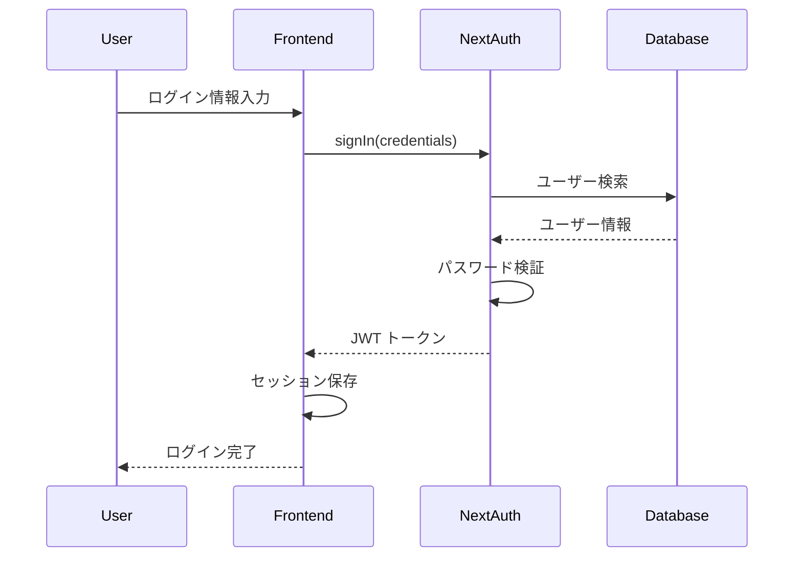
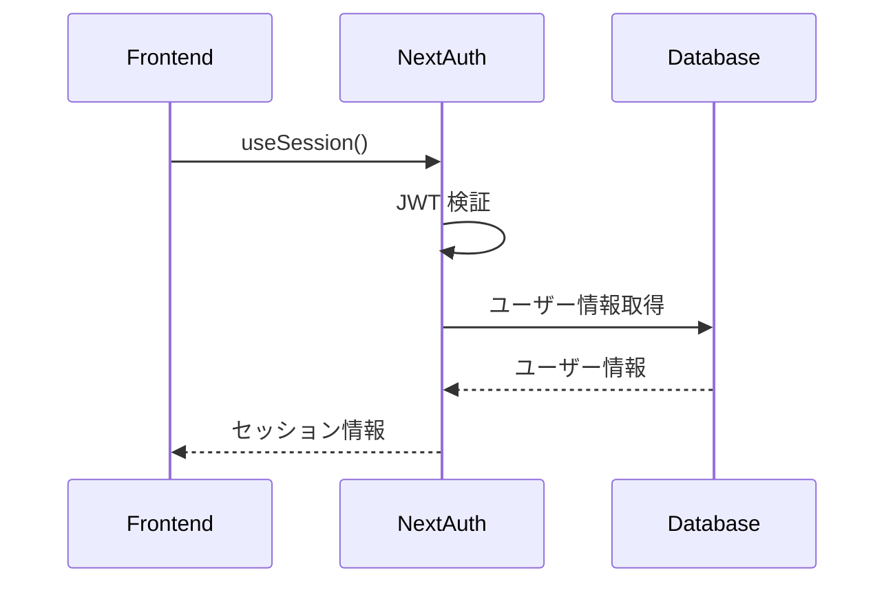
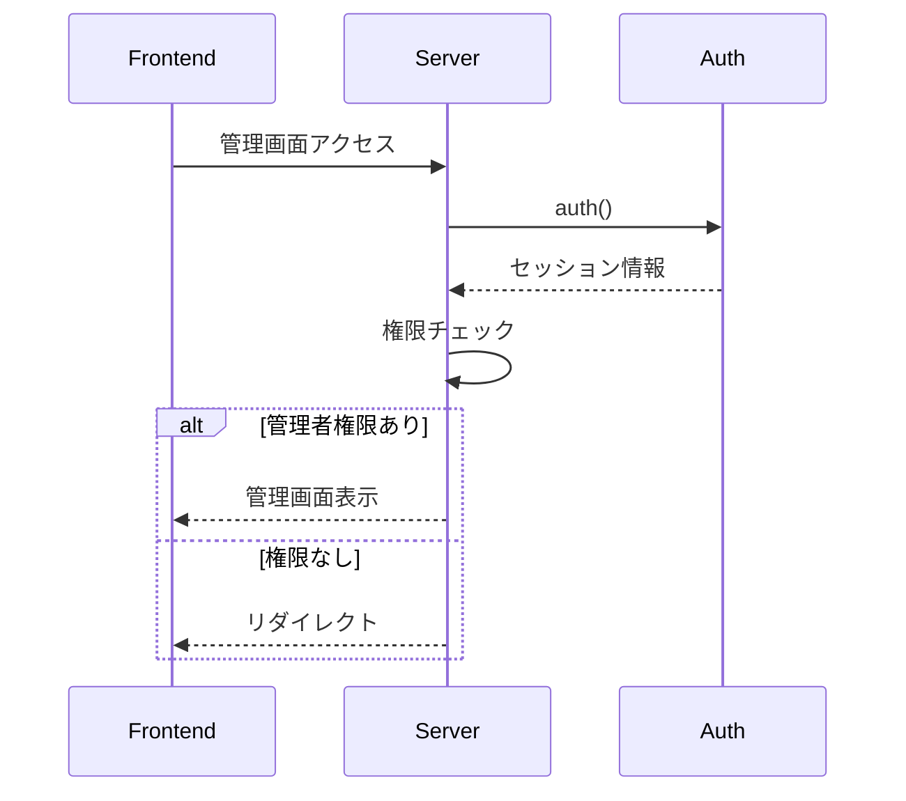

# Auth（認証）ドメイン設計

## 概要

Auth（認証）ドメインは、Stats47 プロジェクトの汎用ドメインの一つで、ユーザー認証とセッション管理を担当します。NextAuth.js (Auth.js) v5 を基盤とした認証システムを提供し、ユーザー登録、ログイン、セッション管理、権限制御、OAuth 連携など、認証・認可に関するすべての機能を提供します。

### ビジネス価値

- **セキュリティの確保**: 適切な認証・認可により、システムのセキュリティを保証
- **ユーザー体験の向上**: シームレスなログイン・ログアウト体験の提供
- **権限管理**: 細かい権限制御により、適切なアクセス制御を実現
- **コンプライアンス**: セキュリティ要件への準拠
- **スケーラビリティ**: 外部プロバイダー連携による拡張性

---

## 目次

1. [責務](#責務)
2. [ドメインモデル](#ドメインモデル)
3. [アーキテクチャ設計](#アーキテクチャ設計)
4. [データベース設計](#データベース設計)
5. [認証フロー](#認証フロー)
6. [セキュリティ対策](#セキュリティ対策)
7. [主要機能](#主要機能)
8. [ドメインサービス](#ドメインサービス)
9. [関連ドメイン](#関連ドメイン)
10. [将来の拡張計画](#将来の拡張計画)

---

## 責務

1. **ユーザー認証**: メールアドレス/パスワードによる認証、OAuth 認証
2. **セッション管理**: JWT 戦略によるステートレスなセッション管理
3. **権限管理**: 役割ベースのアクセス制御（RBAC）
4. **ユーザー管理**: ユーザー情報の作成、更新、削除
5. **セキュリティ**: パスワードハッシュ化、CSRF 保護、レート制限
6. **OAuth 統合**: Google、LINE などの外部プロバイダー連携

---

## ドメインモデル

### 主要エンティティ

#### User（ユーザー）

ユーザーの基本情報を管理するエンティティ。

**属性**:

- `id`: ユーザー ID (UUID)
- `email`: メールアドレス（ログイン ID、一意）
- `username`: ユーザー名（一意）
- `passwordHash`: パスワードハッシュ（bcrypt）
- `name`: 表示名
- `role`: ロール（'admin' | 'user'）
- `isActive`: 有効フラグ
- `createdAt`: 作成日時
- `updatedAt`: 更新日時
- `lastLoginAt`: 最終ログイン日時

**型定義**:

```typescript
interface User {
  id: string;
  email: string;
  username: string;
  passwordHash: string;
  name?: string;
  role: "admin" | "user";
  isActive: boolean;
  createdAt: string;
  updatedAt: string;
  lastLoginAt?: string;
}
```

#### Session（セッション）

JWT ベースのセッション管理（NextAuth.js の JWT 戦略を使用）。

**属性**:

- `token`: JWT トークン
- `expiresAt`: 有効期限（30 日間）
- `userId`: ユーザー ID
- `role`: ユーザーロール

#### Role（ロール）

現在のシステムでは 2 つのロールを定義。

| ロール  | 説明         | 権限                                   |
| ------- | ------------ | -------------------------------------- |
| `user`  | 一般ユーザー | 閲覧のみ                               |
| `admin` | 管理者       | すべての機能にアクセス可能（管理画面） |

---

## アーキテクチャ設計

### 技術スタック

| 項目               | 技術                       | バージョン | 選定理由                     |
| ------------------ | -------------------------- | ---------- | ---------------------------- |
| 認証ライブラリ     | **NextAuth (Auth.js)**     | v5         | 業界標準、セキュリティ対応   |
| プロバイダー       | **Credentials**            | -          | メールアドレス認証           |
| セッション戦略     | **JWT**                    | -          | Cloudflare Workers 対応      |
| パスワードハッシュ | **bcryptjs**               | -          | セキュアなハッシュ化         |
| データベース       | **Cloudflare D1 (SQLite)** | -          | サーバーレス対応             |
| フロントエンド     | **Next.js 15**             | v15        | 公式サポート                 |
| 状態管理           | **useSession**             | -          | NextAuth 組み込みフック      |

### ファイル構成

```
src/
├── app/
│   ├── api/auth/[...nextauth]/route.ts
│   ├── admin/page.tsx
│   ├── profile/page.tsx
│   └── layout.tsx
├── features/auth/
│   ├── lib/
│   │   └── auth.ts                           # NextAuth設定
│   ├── components/
│   │   ├── LoginForm/                        # ログインフォーム
│   │   ├── RegisterForm/                     # 登録フォーム
│   │   └── AuthModal/                        # 認証モーダル
│   ├── actions/
│   │   └── index.ts                          # Server Actions
│   └── types/
│       └── index.ts                          # 型定義
└── middleware.ts                              # ルート保護
```

### アーキテクチャ概要

```
┌─────────────────┐    ┌──────────────────┐    ┌─────────────────┐
│   Frontend      │    │   NextAuth       │    │   Database      │
│   (React)       │◄──►│   (Auth.js)      │◄──►│   (D1)          │
│                 │    │                  │    │                 │
│ - useSession()  │    │ - JWT Strategy   │    │ - users table   │
│ - SessionProvider│    │ - Credentials    │    │ - sessions table│
│ - signIn()      │    │ - Callbacks      │    │                 │
└─────────────────┘    └──────────────────┘    └─────────────────┘
```

### 環境別動作

| 環境     | 認証動作     | データソース                |
| -------- | ------------ | --------------------------- |
| **Mock** | 認証バイパス | `data/mock/auth/users.json` |
| **API**  | 認証必須     | Cloudflare D1               |
| **本番** | 認証必須     | Cloudflare D1               |

---

## データベース設計

認証ドメインのデータベース設計の詳細は [データベース設計ドキュメント](../04_インフラ設計/01_データベース設計.md#認証) を参照してください。

### users テーブル

```sql
CREATE TABLE users (
  id TEXT PRIMARY KEY,
  email TEXT UNIQUE NOT NULL,
  username TEXT UNIQUE NOT NULL,
  password_hash TEXT NOT NULL,
  name TEXT,
  role TEXT NOT NULL DEFAULT 'user' CHECK (role IN ('admin', 'user')),
  is_active BOOLEAN NOT NULL DEFAULT 1,
  created_at DATETIME NOT NULL DEFAULT CURRENT_TIMESTAMP,
  updated_at DATETIME NOT NULL DEFAULT CURRENT_TIMESTAMP,
  last_login DATETIME
);
```

### インデックス

```sql
CREATE INDEX idx_users_email ON users(email);
CREATE INDEX idx_users_username ON users(username);
CREATE INDEX idx_users_role ON users(role);
CREATE INDEX idx_users_active ON users(is_active);
```

---

## 認証フロー

### ログインフロー



### セッション管理フロー



### 権限チェックフロー



---

## セキュリティ対策

### セキュリティ機能一覧

| 機能                 | 実装方法                              | 目的                           |
| -------------------- | ------------------------------------- | ------------------------------ |
| **パスワードハッシュ** | bcryptjs（salt rounds: 12）           | パスワードを安全に保存         |
| **CSRF保護**         | NextAuth.js 自動実装                  | クロスサイトリクエストフォージェリ防止 |
| **レート制限**        | ログイン試行制限（5回/15分）           | ブルートフォース攻撃防止       |
| **セッション管理**    | JWT（30日間有効、24時間ごとに更新）    | 安全なセッション管理           |
| **権限チェック**      | ミドルウェア + Server Actions          | 不正アクセス防止               |

### セッション設定

- **戦略**: JWT（ステートレス）
- **有効期限**: 30日間
- **更新間隔**: 24時間ごとに更新
- **Cookie設定**: httpOnly, sameSite: lax, secure（本番環境）

---

## 主要機能

### 認証機能一覧

| 機能               | 説明                                      | 対象ユーザー           |
| ------------------ | ----------------------------------------- | ---------------------- |
| **ログイン**       | メールアドレス/パスワード認証              | 一般ユーザー/管理者    |
| **登録**           | 新規アカウント作成                        | 一般ユーザー           |
| **ログアウト**     | セッション終了                            | 一般ユーザー/管理者    |
| **プロフィール編集** | ユーザー情報の変更                        | 一般ユーザー/管理者    |
| **ユーザー管理**   | ユーザー一覧、有効化/無効化               | 管理者のみ             |
| **権限管理**       | ロール設定（admin/user）                  | 管理者のみ             |

### 権限チェック

- **ミドルウェア**: ルート単位で認証/認可チェック
- **Server Actions**: API呼び出し時の権限チェック
- **クライアントコンポーネント**: UI表示の条件分岐

---

## ドメインサービス

### AuthService（認証サービス）

認証とセッション管理を実装するサービス層。

**責務**:

- ユーザー認証
- セッション管理
- 権限チェック

**主要機能**:

- `login(email, password)`: ログイン処理
- `logout()`: ログアウト処理
- `getCurrentUser()`: 現在のユーザー取得
- `checkPermission(role)`: 権限チェック

### UserService（ユーザーサービス）

ユーザー情報の管理を実装するサービス層。

**責務**:

- ユーザー情報の取得、更新
- ユーザーの有効化/無効化

**主要機能**:

- `getUser(userId)`: ユーザー情報取得
- `updateUser(userId, data)`: ユーザー情報更新
- `toggleUserStatus(userId, isActive)`: ステータス切り替え
- `getAllUsers()`: 全ユーザー取得（管理者専用）

---

## 関連ドメイン

- **Ranking ドメイン**: 認証されたユーザーのランキングデータアクセス
- **Dashboard ドメイン**: ユーザー別ダッシュボード表示
- **Visualization ドメイン**: 認証されたユーザーの可視化データ表示

---

## 将来の拡張計画

### フェーズ 1（実装済み）

- ✅ 基本的なユーザー認証（メールアドレス/パスワード）
- ✅ セッション管理（JWT戦略）
- ✅ 権限管理（RBAC：admin/user）
- ✅ ユーザー管理（CRUD）
- ✅ パスワードハッシュ化（bcrypt）

### フェーズ 2（計画中）

- ⬜ OAuth連携（Google、LINE）
- ⬜ レート制限の実装
- ⬜ JWT無効化機構
- ⬜ 監査ログ
- ⬜ メール認証

### フェーズ 3（検討中）

- ⬜ 2要素認証（2FA）
- ⬜ パスワードリセット機能
- ⬜ アカウント連携管理
- ⬜ ユーザープロフィール拡張（画像アップロードなど）

---

**更新履歴**:

- 2025-01-26: 設計ドキュメントとして整理（地域管理と同スタイル）
- 2025-01-20: 初版作成
