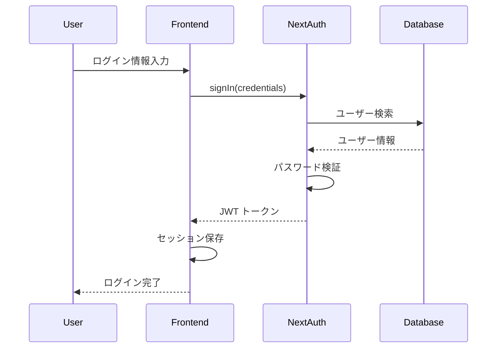
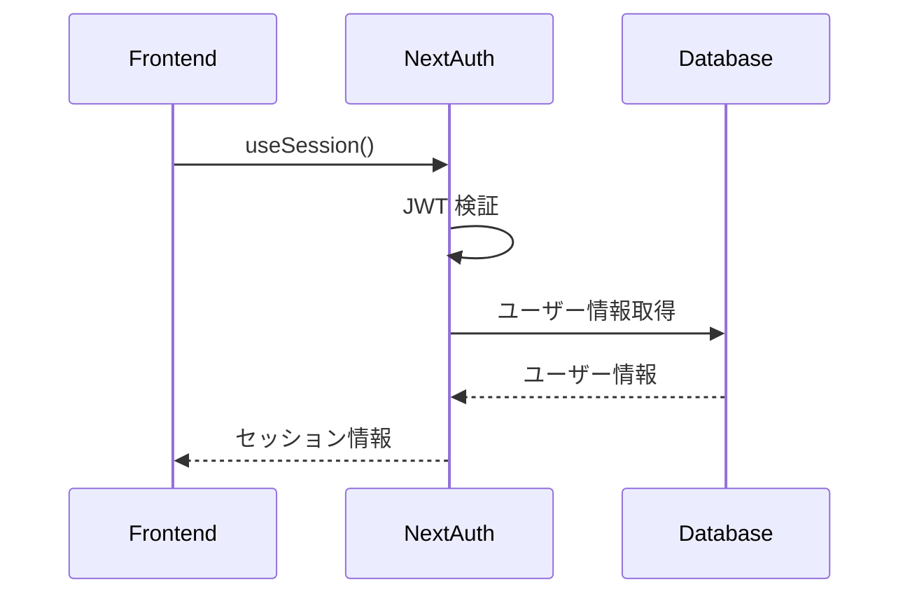
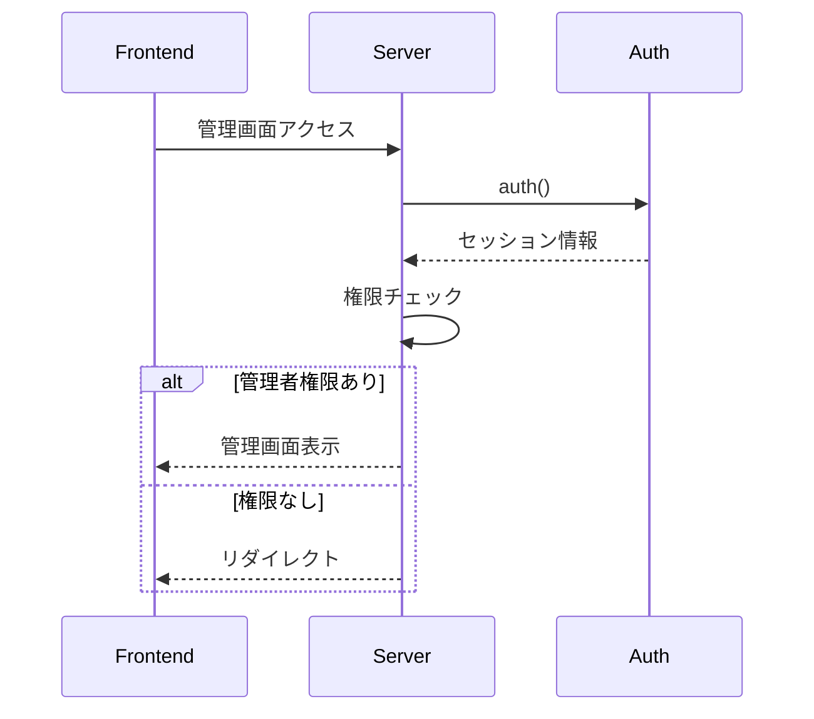
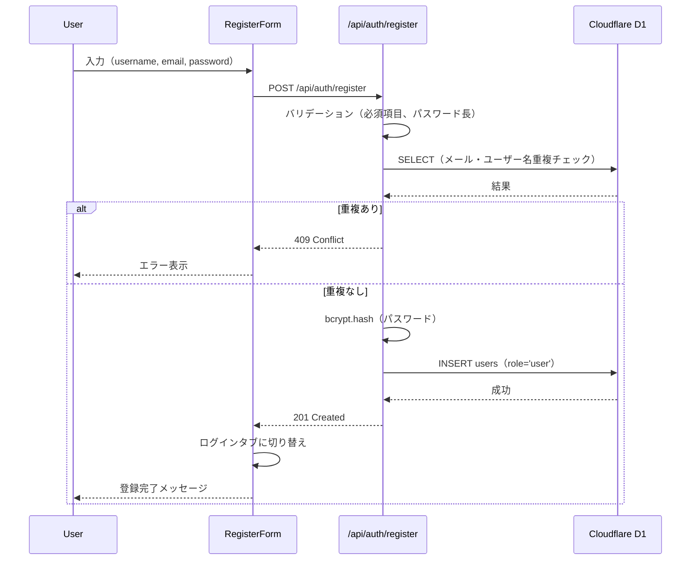
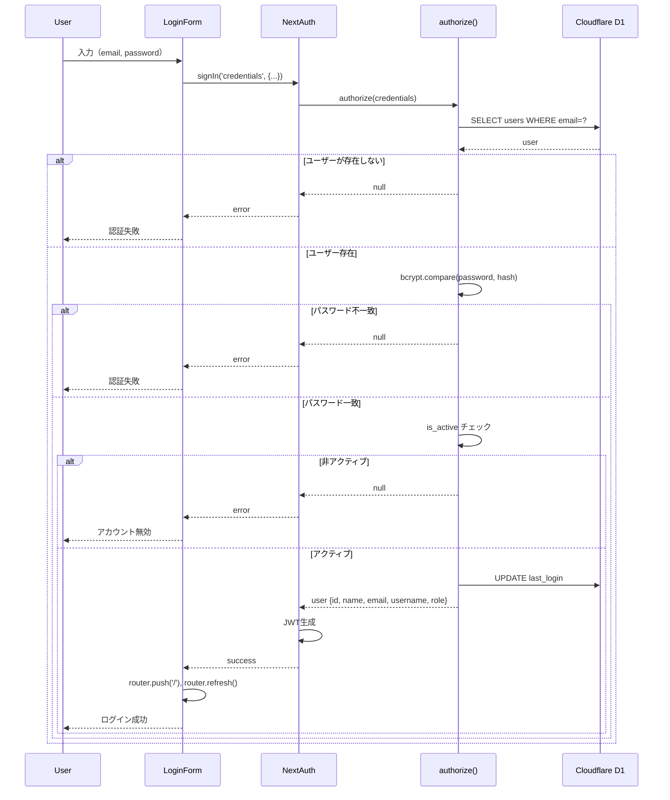

# Auth（認証）ドメイン完全ガイド

## 目次

1. [概要・責任](#概要責任)
2. [技術スタック](#技術スタック)
3. [アーキテクチャ設計](#アーキテクチャ設計)
4. [データベース設計](#データベース設計)
5. [認証フロー](#認証フロー)
6. [NextAuth 実装ガイド](#nextauth実装ガイド)
7. [Server Actions 実装](#server-actions実装)
8. [セキュリティ対策](#セキュリティ対策)
9. [テスト戦略](#テスト戦略)
10. [トラブルシューティング](#トラブルシューティング)

---

# 概要・責任

## ドメインの責任

認証（Auth）ドメインは、Stats47 プロジェクトにおけるユーザー認証・認可・セッション管理を統合管理します。

### 主な責任

1. **ユーザー認証**: メールアドレス/パスワードによる認証、OAuth 認証
2. **セッション管理**: JWT 戦略によるステートレスなセッション管理
3. **権限管理**: 役割ベースのアクセス制御（RBAC）
4. **ユーザー管理**: ユーザー情報の作成、更新、削除
5. **セキュリティ**: パスワードハッシュ化、CSRF 保護、レート制限

### 主要機能

1. **通常ログイン機能**

   - メールアドレス/ユーザー名 + パスワードでのログイン
   - パスワードハッシュ化（bcryptjs）
   - セッション管理（JWT）

2. **OAuth 連携ログイン**

   - Google アカウントでログイン
   - LINE アカウントでログイン
   - OAuth 2.0 / OpenID Connect

3. **新規登録機能**

   - メールアドレスベースの新規登録
   - メール認証（オプション）
   - パスワード強度チェック

4. **ユーザー管理機能（管理者専用）**

   - ユーザー一覧表示
   - ユーザー詳細情報
   - ユーザーの有効化/無効化
   - 役割（ロール）管理

5. **プロフィール編集機能**

   - ユーザー情報の編集
   - パスワード変更
   - アカウント連携管理

6. **役割ベースのアクセス制御（RBAC）**
   - 管理者（admin）：すべての機能にアクセス可能
   - 一般ユーザー（user）：閲覧のみ

---

# 技術スタック

## 使用技術の選定理由

### NextAuth.js v5 (Auth.js)

**選定理由:**

- **業界標準**: React/Next.js エコシステムで最も広く使用されている認証ライブラリ
- **セキュリティ**: セキュリティベストプラクティスが組み込まれている
- **豊富なプロバイダー**: OAuth、Credentials、2FA など多様な認証方式をサポート
- **TypeScript サポート**: 型安全性を提供
- **Cloudflare Workers 対応**: ステートレスな JWT 戦略で Cloudflare 環境に最適
- **メンテナンス性**: 活発なコミュニティとドキュメント

### 技術スタック一覧

| 項目               | 技術                       | バージョン |
| ------------------ | -------------------------- | ---------- |
| 認証ライブラリ     | **NextAuth (Auth.js)**     | v5         |
| プロバイダー       | **Credentials**            | -          |
| セッション戦略     | **JWT**                    | -          |
| パスワードハッシュ | **bcryptjs**               | -          |
| データベース       | **Cloudflare D1 (SQLite)** | -          |
| フロントエンド     | **Next.js 15**             | v15        |
| 状態管理           | **useSession**             | -          |

---

# アーキテクチャ設計

## アーキテクチャ概要

```
┌─────────────────┐    ┌──────────────────┐    ┌─────────────────┐
│   Frontend      │    │   NextAuth       │    │   Database      │
│   (React)       │◄──►│   (Auth.js)      │◄──►│   (D1)          │
│                 │    │                  │    │                 │
│ - useSession()  │    │ - JWT Strategy   │    │ - users table   │
│ - SessionProvider│    │ - Credentials    │    │ - sessions table│
│ - signIn()      │    │ - Callbacks      │    │                 │
└─────────────────┘    └──────────────────┘    └─────────────────┘
```

## ファイル構成

```
src/
├── app/
│   ├── api/auth/[...nextauth]/route.ts
│   ├── admin/page.tsx
│   ├── profile/page.tsx
│   └── layout.tsx
├── features/auth/
│   ├── lib/auth.ts
│   ├── components/
│   │   ├── LoginForm/
│   │   ├── RegisterForm/
│   │   ├── AuthModal/
│   │   └── HeaderAuthSection/
│   ├── actions/
│   └── types/
└── hooks/
    └── useTheme.ts
```

## 環境別動作

| 環境     | 認証動作     | データソース                |
| -------- | ------------ | --------------------------- |
| **Mock** | 認証バイパス | `data/mock/auth/users.json` |
| **API**  | 認証必須     | Cloudflare D1               |
| **本番** | 認証必須     | Cloudflare D1               |

---

# データベース設計

## users テーブル

```sql
CREATE TABLE users (
  id TEXT PRIMARY KEY,
  email TEXT UNIQUE NOT NULL,
  username TEXT UNIQUE NOT NULL,
  password_hash TEXT NOT NULL,
  name TEXT,
  role TEXT NOT NULL DEFAULT 'user' CHECK (role IN ('admin', 'user')),
  is_active BOOLEAN NOT NULL DEFAULT 1,
  created_at DATETIME NOT NULL DEFAULT CURRENT_TIMESTAMP,
  updated_at DATETIME NOT NULL DEFAULT CURRENT_TIMESTAMP,
  last_login DATETIME
);
```

## インデックス

```sql
CREATE INDEX idx_users_email ON users(email);
CREATE INDEX idx_users_username ON users(username);
CREATE INDEX idx_users_role ON users(role);
CREATE INDEX idx_users_active ON users(is_active);
```

---

# 認証フロー

## ログインフロー



## セッション管理フロー



## 権限チェックフロー



---

# NextAuth 実装ガイド

## 環境変数設定

### 必須環境変数

```bash
# NextAuth設定
AUTH_SECRET=your-secret-key-here
NEXTAUTH_URL=http://localhost:3000

# データベース（Cloudflare D1）
DATABASE_URL=your-d1-database-url

# OAuth（オプション）
GOOGLE_CLIENT_ID=your-google-client-id
GOOGLE_CLIENT_SECRET=your-google-client-secret
LINE_CLIENT_ID=your-line-client-id
LINE_CLIENT_SECRET=your-line-client-secret
```

## NextAuth 設定

```typescript
// src/features/auth/lib/auth.ts
import NextAuth from "next-auth";
import Credentials from "next-auth/providers/credentials";
import bcrypt from "bcryptjs";

export const authConfig: NextAuthConfig = {
  secret: process.env.AUTH_SECRET,
  providers: [
    Credentials({
      name: "credentials",
      credentials: {
        email: { label: "Email", type: "email" },
        password: { label: "Password", type: "password" },
      },
      async authorize(credentials) {
        if (!credentials?.email || !credentials?.password) {
          return null;
        }

        try {
          const db = await getDataProvider();
          const user = await db
            .prepare("SELECT * FROM users WHERE email = ?")
            .bind(credentials.email)
            .first();

          if (!user) return null;

          const isValidPassword = await bcrypt.compare(
            credentials.password as string,
            user.password_hash as string
          );

          if (!isValidPassword || !user.is_active) {
            return null;
          }

          return {
            id: user.id,
            name: user.name,
            email: user.email,
            username: user.username,
            role: user.role,
          };
        } catch (error) {
          console.error("Authorization error:", error);
          return null;
        }
      },
    }),
  ],
  callbacks: {
    async session({ session, token }) {
      if (token) {
        session.user.id = token.id as string;
        session.user.username = token.username as string;
        session.user.role = token.role as "admin" | "user";
      }
      return session;
    },
    async jwt({ token, user }) {
      if (user) {
        token.id = user.id;
        token.username = user.username || "";
        token.role = user.role || "user";
      }
      return token;
    },
  },
  pages: {
    signIn: "/login",
    signOut: "/logout",
    error: "/login",
  },
  session: {
    strategy: "jwt",
    maxAge: 30 * 24 * 60 * 60, // 30日
    updateAge: 24 * 60 * 60, // 24時間ごとに更新
  },
};
```

## 型定義

```typescript
// src/features/auth/types/index.ts
declare module "next-auth" {
  interface Session {
    user: {
      id: string;
      name?: string | null;
      email?: string | null;
      image?: string | null;
      username?: string;
      role: "admin" | "user";
    };
  }

  interface User {
    id: string;
    name?: string | null;
    email?: string | null;
    image?: string | null;
    username?: string;
    role: "admin" | "user";
  }
}

declare module "next-auth/jwt" {
  interface JWT {
    id: string;
    username: string;
    role: "admin" | "user";
  }
}
```

---

# Server Actions 実装

## 管理画面の Server Actions 化

### 変更前（フルクライアント）

```typescript
"use client";

export default function AdminPage() {
  const { data: session } = useSession();
  const { users, isLoading, error, toggleUserStatus } = useAdminUsers();

  if (!session?.user || session.user.role !== "admin") {
    return <AdminAccessDenied />;
  }

  return <UserManagementTable onToggleStatus={toggleUserStatus} />;
}
```

### 変更後（ハイブリッド）

```typescript
// サーバーコンポーネント
export default async function AdminPage() {
  const session = await auth();

  if (!session?.user || session.user.role !== "admin") {
    redirect("/");
  }

  const users = await fetchUsers();
  const stats = calculateUserStats(users);

  return (
    <div>
      <AdminPageHeader />
      <AdminStatsCards stats={stats} />
      <UserManagementTableServer users={users} />
    </div>
  );
}
```

## Server Actions 実装

```typescript
// src/features/auth/actions/index.ts
"use server";

import { auth } from "@/features/auth/lib/auth";
import { getDataProvider } from "@/infrastructure/database";

export async function fetchUsers() {
  const session = await auth();

  if (!session?.user || session.user.role !== "admin") {
    throw new Error("Unauthorized");
  }

  const db = await getDataProvider();
  const users = await db
    .prepare("SELECT * FROM users ORDER BY created_at DESC")
    .all();

  return users.results || [];
}

export async function toggleUserStatus(userId: string, isActive: boolean) {
  const session = await auth();

  if (!session?.user || session.user.role !== "admin") {
    throw new Error("Unauthorized");
  }

  const db = await getDataProvider();
  await db
    .prepare(
      "UPDATE users SET is_active = ?, updated_at = CURRENT_TIMESTAMP WHERE id = ?"
    )
    .bind(isActive ? 1 : 0, userId)
    .run();

  return { success: true };
}
```

## メリット

1. **パフォーマンス向上**: サーバーサイドでデータ取得
2. **セキュリティ向上**: サーバーサイドで認証・認可チェック
3. **SEO 対応**: サーバーサイドレンダリング
4. **バンドルサイズ削減**: クライアントサイドの JavaScript 削減

---

# セキュリティ対策

## パスワードセキュリティ

```typescript
import bcrypt from "bcryptjs";

// パスワードハッシュ化
const saltRounds = 12;
const hashedPassword = await bcrypt.hash(password, saltRounds);

// パスワード検証
const isValid = await bcrypt.compare(password, hashedPassword);
```

## CSRF 保護

NextAuth.js が自動的に CSRF 保護を提供：

```typescript
// CSRFトークンは自動生成・検証
const csrfToken = await getCsrfToken();
```

## レート制限

```typescript
// ログイン試行回数制限
const MAX_LOGIN_ATTEMPTS = 5;
const LOCKOUT_DURATION = 15 * 60 * 1000; // 15分

// 実装例
const loginAttempts = await getLoginAttempts(email);
if (loginAttempts >= MAX_LOGIN_ATTEMPTS) {
  throw new Error("Too many login attempts");
}
```

## セッションセキュリティ

```typescript
// JWT設定
session: {
  strategy: "jwt",
  maxAge: 30 * 24 * 60 * 60, // 30日
  updateAge: 24 * 60 * 60, // 24時間ごとに更新
},

// Cookie設定
cookies: {
  sessionToken: {
    name: "authjs.session-token",
    options: {
      httpOnly: true,
      sameSite: "lax",
      path: "/",
      secure: process.env.NODE_ENV === "production",
    },
  },
},
```

---

# テスト戦略

## ユニットテスト

```typescript
// src/features/auth/__tests__/auth.test.ts
import { describe, it, expect, vi } from "vitest";
import { authConfig } from "@/features/auth/lib/auth";

describe("Auth Configuration", () => {
  it("should have correct providers", () => {
    expect(authConfig.providers).toHaveLength(1);
    expect(authConfig.providers[0].name).toBe("credentials");
  });

  it("should have JWT strategy", () => {
    expect(authConfig.session?.strategy).toBe("jwt");
  });
});
```

## 統合テスト

```typescript
// src/features/auth/__tests__/integration.test.ts
import { describe, it, expect } from "vitest";
import { fetchUsers } from "@/features/auth/actions";

describe("Auth Integration", () => {
  it("should fetch users for admin", async () => {
    // Mock admin session
    const users = await fetchUsers();
    expect(Array.isArray(users)).toBe(true);
  });
});
```

## E2E テスト

```typescript
// tests/e2e/auth.spec.ts
import { test, expect } from "@playwright/test";

test("should login successfully", async ({ page }) => {
  await page.goto("/login");
  await page.fill('[data-testid="email"]', "admin@example.com");
  await page.fill('[data-testid="password"]', "password");
  await page.click('[data-testid="login-button"]');

  await expect(page).toHaveURL("/admin");
});
```

---

# トラブルシューティング

## よくある問題

### 1. セッションが取得できない

**原因**: 環境変数の設定ミス
**解決策**:

```bash
# .env.local
AUTH_SECRET=your-secret-key-here
NEXTAUTH_URL=http://localhost:3000
```

### 2. データベース接続エラー

**原因**: D1 データベースの設定ミス
**解決策**:

```bash
# wrangler.toml
[[d1_databases]]
binding = "DB"
database_name = "stats47-db"
database_id = "your-database-id"
```

### 3. パスワードハッシュ化エラー

**原因**: bcryptjs の設定ミス
**解決策**:

```typescript
// 正しい実装
const saltRounds = 12;
const hashedPassword = await bcrypt.hash(password, saltRounds);
```

### 4. 権限チェックが動作しない

**原因**: セッションコールバックの設定ミス
**解決策**:

```typescript
callbacks: {
  async session({ session, token }) {
    if (token) {
      session.user.role = token.role;
    }
    return session;
  },
}
```

## デバッグ方法

### 1. セッション情報の確認

```typescript
// デバッグ用
console.log("Session:", session);
console.log("User:", session?.user);
console.log("Role:", session?.user?.role);
```

### 2. データベースクエリの確認

```typescript
// デバッグ用
const users = await db
  .prepare("SELECT * FROM users WHERE email = ?")
  .bind(email)
  .first();
console.log("User query result:", users);
```

### 3. NextAuth ログの確認

```typescript
// auth.ts
export const authConfig: NextAuthConfig = {
  debug: process.env.NODE_ENV === "development",
  // ...
};
```

## パフォーマンス最適化

### 1. データベースインデックス

```sql
CREATE INDEX idx_users_email ON users(email);
CREATE INDEX idx_users_role ON users(role);
```

### 2. セッションキャッシュ

```typescript
// セッション情報のキャッシュ
const sessionCache = new Map();
```

### 3. クエリ最適化

```typescript
// 必要なフィールドのみ取得
const user = await db
  .prepare("SELECT id, email, role FROM users WHERE email = ?")
  .bind(email)
  .first();
```

---

## 参考資料

- [NextAuth.js Documentation](https://next-auth.js.org/)
- [Auth.js Documentation](https://authjs.dev/)
- [Cloudflare D1 Documentation](https://developers.cloudflare.com/d1/)
- [bcryptjs Documentation](https://github.com/dcodeIO/bcrypt.js)
- [Next.js 15 Documentation](https://nextjs.org/docs)

# Authentication（認証）ドメイン

## 概要

Authentication（認証）ドメインは、stats47 プロジェクトの汎用ドメインの一つで、ユーザー認証とセッション管理を担当します。NextAuth.js (Auth.js) v5 を基盤とした認証システムを提供し、ユーザー登録、ログイン、セッション管理、権限制御、OAuth 連携など、認証・認可に関するすべての機能を提供します。

### ドメインの責務と目的

1. **ユーザー認証**: メールアドレス/パスワード、OAuth プロバイダーによる認証
2. **セッション管理**: JWT ベースのセッション管理とセキュリティ
3. **権限制御**: ロールベースのアクセス制御（RBAC）
4. **ユーザー管理**: アカウント作成、更新、無効化
5. **セキュリティ**: パスワードハッシュ化、レート制限、監査ログ
6. **OAuth 統合**: Google、LINE などの外部プロバイダー連携

### ビジネス価値

- **セキュリティの確保**: 適切な認証・認可により、システムのセキュリティを保証
- **ユーザー体験の向上**: シームレスなログイン・ログアウト体験の提供
- **権限管理**: 細かい権限制御により、適切なアクセス制御を実現
- **コンプライアンス**: セキュリティ要件への準拠
- **スケーラビリティ**: 外部プロバイダー連携による拡張性

## アーキテクチャ

### 技術スタック

| 項目               | 技術                       | バージョン |
| ------------------ | -------------------------- | ---------- |
| 認証ライブラリ     | **NextAuth (Auth.js)**     | v5         |
| プロバイダー       | **Credentials, OAuth**     | -          |
| セッション戦略     | **JWT**                    | -          |
| パスワードハッシュ | **bcryptjs**               | -          |
| データベース       | **Cloudflare D1 (SQLite)** | -          |
| アダプター         | **@auth/d1-adapter**       | -          |

### ファイル構成

```
src/
├── app/
│   └── api/
│       └── auth/
│           ├── [...nextauth]/route.ts      # NextAuth エンドポイント
│           └── register/route.ts           # ユーザー登録 API
├── lib/
│   └── auth/
│       ├── auth.ts                        # NextAuth 設定
│       ├── api-guards.ts                  # API 権限チェック
│       └── token-blacklist.ts             # JWT 無効化
├── middleware.ts                          # ルート保護
├── hooks/
│   └── useAuth.ts                        # 認証カスタムフック
├── components/
│   └── auth/
│       ├── LoginForm.tsx                  # ログインフォーム
│       ├── RegisterForm.tsx               # 登録フォーム
│       ├── AuthModal.tsx                  # 認証モーダル
│       ├── withAuth.tsx                   # HOC
│       └── RequireAuth.tsx                # 条件レンダリング
└── types/
    └── next-auth.d.ts                     # NextAuth 型定義
```

## データベース設計

### テーブル設計

**users テーブル**:

```sql
CREATE TABLE users (
  id TEXT PRIMARY KEY,              -- UUID
  name TEXT,                        -- 表示名
  email TEXT UNIQUE NOT NULL,       -- メールアドレス（ログインID）
  emailVerified DATETIME,           -- メール確認日時
  image TEXT,                       -- プロフィール画像
  username TEXT UNIQUE,             -- ユーザー名
  password_hash TEXT,               -- ハッシュ化パスワード
  role TEXT DEFAULT 'user',         -- 'admin' or 'user'
  is_active BOOLEAN DEFAULT 1,      -- アクティブフラグ
  last_login DATETIME,              -- 最終ログイン
  session_version INTEGER DEFAULT 1, -- セッションバージョン
  created_at DATETIME DEFAULT CURRENT_TIMESTAMP,
  updated_at DATETIME DEFAULT CURRENT_TIMESTAMP
);
```

**Auth.js 必須テーブル**:

```sql
CREATE TABLE accounts (...);        -- OAuth プロバイダー情報
CREATE TABLE sessions (...);        -- セッション情報（未使用: JWT戦略）
CREATE TABLE verification_tokens (...);  -- メール確認トークン
```

**トークンブラックリスト（オプション）**:

```sql
CREATE TABLE token_blacklist (
  jti TEXT PRIMARY KEY,           -- JWT ID
  user_id TEXT NOT NULL,          -- ユーザーID
  expires_at DATETIME NOT NULL,   -- トークンの有効期限
  reason TEXT,                    -- 無効化理由
  created_at DATETIME DEFAULT CURRENT_TIMESTAMP
);
```

## 主要エンティティ

### User（ユーザー）

ユーザーの基本情報を管理するエンティティ。

**属性:**

- `id`: ユーザー ID (UUID)
- `email`: メールアドレス（ログイン ID）
- `username`: ユーザー名
- `passwordHash`: パスワードハッシュ（bcrypt）
- `name`: 表示名
- `image`: プロフィール画像 URL
- `role`: ロール（'admin' | 'user'）
- `isActive`: 有効フラグ
- `emailVerified`: メール認証済みフラグ
- `lastLoginAt`: 最終ログイン日時
- `sessionVersion`: セッションバージョン（JWT 無効化用）
- `createdAt`: 作成日時

### Session（セッション）

JWT ベースのセッション管理（NextAuth.js の JWT 戦略を使用）。

**属性:**

- `token`: JWT トークン
- `expiresAt`: 有効期限（30 日間）
- `userId`: ユーザー ID
- `role`: ユーザーロール
- `sessionVersion`: セッションバージョン（無効化用）

### Role（ロール）

現在のシステムでは 2 つのロールを定義。

| ロール  | 説明         | デフォルト |
| ------- | ------------ | ---------- |
| `user`  | 一般ユーザー | ✓          |
| `admin` | 管理者       | -          |

**型定義**:

```typescript
interface Session {
  user: {
    id: string;
    username: string;
    role: "admin" | "user"; // 型安全なロール定義
  } & DefaultSession["user"];
}
```

## 認証フロー

### 1. ユーザー登録フロー



### 2. ログインフロー



### 3. セッション管理

**NextAuth.js 設定**:

```typescript
session: {
  strategy: "jwt",              // JWT戦略
  maxAge: 30 * 24 * 60 * 60,    // 30日間有効
  updateAge: 24 * 60 * 60,      // 24時間ごとに更新
},

callbacks: {
  async session({ session, token }) {
    // JWTトークンからセッションにユーザー情報を注入
    if (session.user && token) {
      session.user.id = token.id as string;
      session.user.username = token.username as string;
      session.user.role = token.role as "admin" | "user";
    }
    return session;
  },
  async jwt({ token, user }) {
    // ログイン時にユーザー情報をJWTに追加
    if (user) {
      token.id = user.id;
      token.username = user.username || "";
      token.role = user.role || "user";
    }
    return token;
  },
}
```

### 4. ミドルウェアによるルート保護

```typescript
export default auth((req) => {
  const { pathname } = req.nextUrl;
  const isLoggedIn = !!req.auth;
  const isAdmin = req.auth?.user?.role === "admin";

  // 認証が必要なパス
  const protectedPaths = ["/profile", "/admin"];
  const isProtectedPath = protectedPaths.some((path) =>
    pathname.startsWith(path)
  );

  // 管理者専用パス
  const adminPaths = ["/admin"];
  const isAdminPath = adminPaths.some((path) => pathname.startsWith(path));

  // 未認証ユーザーを保護されたパスから除外
  if (isProtectedPath && !isLoggedIn) {
    const homeUrl = new URL("/", req.url);
    homeUrl.searchParams.set("auth", "true");
    homeUrl.searchParams.set("callbackUrl", pathname);
    return Response.redirect(homeUrl);
  }

  // 非管理者を管理者専用パスから除外
  if (isAdminPath && !isAdmin) {
    return Response.redirect(new URL("/", req.url));
  }

  return;
});
```

## コンポーネント設計

### 1. 認証フォーム

#### LoginForm（ログインフォーム）

```typescript
interface LoginFormProps {
  onSuccess?: () => void;
  onError?: (error: string) => void;
}

export function LoginForm({ onSuccess, onError }: LoginFormProps) {
  const [email, setEmail] = useState("");
  const [password, setPassword] = useState("");
  const [error, setError] = useState("");
  const [isLoading, setIsLoading] = useState(false);

  const handleSubmit = async (e: FormEvent) => {
    e.preventDefault();
    setIsLoading(true);
    setError("");

    try {
      const result = await signIn("credentials", {
        email,
        password,
        redirect: false,
      });

      if (result?.error) {
        setError("メールアドレスまたはパスワードが正しくありません");
        onError?.(result.error);
      } else {
        onSuccess?.();
        router.push("/");
        router.refresh();
      }
    } catch (error) {
      setError("ログイン中にエラーが発生しました");
      onError?.(error.message);
    } finally {
      setIsLoading(false);
    }
  };

  return (
    <form onSubmit={handleSubmit} className="space-y-4">
      <div>
        <label htmlFor="email" className="block text-sm font-medium">
          メールアドレス
        </label>
        <input
          id="email"
          type="email"
          value={email}
          onChange={(e) => setEmail(e.target.value)}
          required
          className="mt-1 block w-full rounded-md border border-gray-300 px-3 py-2"
        />
      </div>
      <div>
        <label htmlFor="password" className="block text-sm font-medium">
          パスワード
        </label>
        <PasswordInput value={password} onChange={setPassword} required />
      </div>
      {error && <div className="text-red-600 text-sm">{error}</div>}
      <button
        type="submit"
        disabled={isLoading}
        className="w-full bg-indigo-600 text-white py-2 px-4 rounded-md hover:bg-indigo-700 disabled:opacity-50"
      >
        {isLoading ? "ログイン中..." : "ログイン"}
      </button>
    </form>
  );
}
```

#### RegisterForm（登録フォーム）

```typescript
interface RegisterFormProps {
  onSuccess?: () => void;
  onError?: (error: string) => void;
}

export function RegisterForm({ onSuccess, onError }: RegisterFormProps) {
  const [formData, setFormData] = useState({
    username: "",
    email: "",
    password: "",
    confirmPassword: "",
  });
  const [error, setError] = useState("");
  const [isLoading, setIsLoading] = useState(false);

  const handleSubmit = async (e: FormEvent) => {
    e.preventDefault();
    setIsLoading(true);
    setError("");

    if (formData.password !== formData.confirmPassword) {
      setError("パスワードが一致しません");
      setIsLoading(false);
      return;
    }

    try {
      const response = await fetch("/api/auth/register", {
        method: "POST",
        headers: { "Content-Type": "application/json" },
        body: JSON.stringify({
          username: formData.username,
          email: formData.email,
          password: formData.password,
        }),
      });

      if (response.ok) {
        onSuccess?.();
        // ログインフォームに切り替え
      } else {
        const data = await response.json();
        setError(data.error || "登録に失敗しました");
        onError?.(data.error);
      }
    } catch (error) {
      setError("登録中にエラーが発生しました");
      onError?.(error.message);
    } finally {
      setIsLoading(false);
    }
  };

  return (
    <form onSubmit={handleSubmit} className="space-y-4">
      <div>
        <label htmlFor="username" className="block text-sm font-medium">
          ユーザー名
        </label>
        <input
          id="username"
          type="text"
          value={formData.username}
          onChange={(e) =>
            setFormData((prev) => ({ ...prev, username: e.target.value }))
          }
          required
          className="mt-1 block w-full rounded-md border border-gray-300 px-3 py-2"
        />
      </div>
      <div>
        <label htmlFor="email" className="block text-sm font-medium">
          メールアドレス
        </label>
        <input
          id="email"
          type="email"
          value={formData.email}
          onChange={(e) =>
            setFormData((prev) => ({ ...prev, email: e.target.value }))
          }
          required
          className="mt-1 block w-full rounded-md border border-gray-300 px-3 py-2"
        />
      </div>
      <div>
        <label htmlFor="password" className="block text-sm font-medium">
          パスワード
        </label>
        <PasswordInput
          value={formData.password}
          onChange={(value) =>
            setFormData((prev) => ({ ...prev, password: value }))
          }
          required
        />
      </div>
      <div>
        <label htmlFor="confirmPassword" className="block text-sm font-medium">
          パスワード確認
        </label>
        <PasswordInput
          value={formData.confirmPassword}
          onChange={(value) =>
            setFormData((prev) => ({ ...prev, confirmPassword: value }))
          }
          required
        />
      </div>
      {error && <div className="text-red-600 text-sm">{error}</div>}
      <button
        type="submit"
        disabled={isLoading}
        className="w-full bg-green-600 text-white py-2 px-4 rounded-md hover:bg-green-700 disabled:opacity-50"
      >
        {isLoading ? "登録中..." : "アカウント作成"}
      </button>
    </form>
  );
}
```

### 2. 認証コンポーネント

#### withAuth（HOC）

```typescript
interface WithAuthOptions {
  requireAuth?: boolean; // 認証が必要
  requireAdmin?: boolean; // 管理者権限が必要
  redirectTo?: string; // リダイレクト先
}

export function withAuth<P extends object>(
  Component: ComponentType<P>,
  options: WithAuthOptions = {}
) {
  const {
    requireAuth = true,
    requireAdmin = false,
    redirectTo = "/",
  } = options;

  return function ProtectedComponent(props: P) {
    const { isAuthenticated, isAdmin, isLoading } = useAuth();
    const router = useRouter();

    useEffect(() => {
      if (isLoading) return;

      if (requireAuth && !isAuthenticated) {
        router.push(
          `${redirectTo}?auth=true&callbackUrl=${window.location.pathname}`
        );
        return;
      }

      if (requireAdmin && !isAdmin) {
        router.push(redirectTo);
        return;
      }
    }, [isAuthenticated, isAdmin, isLoading, router]);

    if (isLoading) {
      return (
        <div className="flex items-center justify-center min-h-screen">
          <div className="animate-spin rounded-full h-8 w-8 border-b-2 border-indigo-600"></div>
        </div>
      );
    }

    if (requireAuth && !isAuthenticated) return null;
    if (requireAdmin && !isAdmin) return null;

    return <Component {...props} />;
  };
}
```

#### RequireAuth（条件レンダリング）

```typescript
interface RequireAuthProps {
  children: ReactNode;
  requireAdmin?: boolean;
  fallback?: ReactNode;
}

export function RequireAuth({
  children,
  requireAdmin = false,
  fallback = null,
}: RequireAuthProps) {
  const { isAuthenticated, isAdmin, isLoading } = useAuth();

  if (isLoading) {
    return <div className="animate-pulse bg-gray-200 h-8 w-32 rounded"></div>;
  }

  if (!isAuthenticated) return fallback;
  if (requireAdmin && !isAdmin) return fallback;

  return <>{children}</>;
}
```

### 3. カスタムフック

#### useAuth

```typescript
export function useAuth() {
  const { data: session, status } = useSession();

  const isLoading = status === "loading";
  const isAuthenticated = status === "authenticated";
  const isAdmin = session?.user?.role === "admin";

  return {
    session,
    isLoading,
    isAuthenticated,
    isAdmin,
  };
}
```

## API 設計

### 1. 認証 API

#### ユーザー登録 API

```typescript
// POST /api/auth/register
export async function POST(request: Request) {
  try {
    const { username, email, password } = await request.json();

    // バリデーション
    if (!username || !email || !password) {
      return NextResponse.json(
        { error: "必須項目が不足しています" },
        { status: 400 }
      );
    }

    if (password.length < 8) {
      return NextResponse.json(
        { error: "パスワードは8文字以上で入力してください" },
        { status: 400 }
      );
    }

    // 重複チェック
    const existingUser = await db
      .prepare("SELECT id FROM users WHERE email = ? OR username = ?")
      .bind(email, username)
      .first();

    if (existingUser) {
      return NextResponse.json(
        { error: "メールアドレスまたはユーザー名が既に使用されています" },
        { status: 409 }
      );
    }

    // パスワードハッシュ化
    const passwordHash = await bcrypt.hash(password, 10);

    // ユーザー作成
    const userId = crypto.randomUUID();
    await db
      .prepare(
        "INSERT INTO users (id, username, email, password_hash, role, is_active) VALUES (?, ?, ?, ?, ?, ?)"
      )
      .bind(userId, username, email, passwordHash, "user", 1)
      .run();

    return NextResponse.json(
      { message: "アカウントが作成されました" },
      { status: 201 }
    );
  } catch (error) {
    return NextResponse.json(
      { error: "サーバーエラーが発生しました" },
      { status: 500 }
    );
  }
}
```

#### ログイン API（NextAuth.js 経由）

```typescript
// NextAuth.js 設定
export const authConfig: NextAuthConfig = {
  providers: [
    CredentialsProvider({
      name: "credentials",
      credentials: {
        email: { label: "Email", type: "email" },
        password: { label: "Password", type: "password" },
      },
      async authorize(credentials) {
        if (!credentials?.email || !credentials?.password) {
          return null;
        }

        const user = await db
          .prepare("SELECT * FROM users WHERE email = ? AND is_active = 1")
          .bind(credentials.email)
          .first();

        if (!user) {
          return null;
        }

        const isValidPassword = await bcrypt.compare(
          credentials.password,
          user.password_hash
        );

        if (!isValidPassword) {
          return null;
        }

        // 最終ログイン日時更新
        await db
          .prepare("UPDATE users SET last_login = datetime('now') WHERE id = ?")
          .bind(user.id)
          .run();

        return {
          id: user.id,
          email: user.email,
          username: user.username,
          name: user.name,
          role: user.role,
        };
      },
    }),
  ],
  // ... その他の設定
};
```

### 2. 権限チェック API

#### API Guards

```typescript
// src/infrastructure/auth/api-guards.ts
export async function requireAuth() {
  const session = await auth();

  if (!session?.user) {
    return {
      error: NextResponse.json(
        { error: "認証が必要です", code: "UNAUTHORIZED" },
        { status: 401 }
      ),
      session: null,
    };
  }

  return { error: null, session };
}

export async function requireAdmin() {
  const { error, session } = await requireAuth();

  if (error) return { error, session: null };

  if (session!.user.role !== "admin") {
    return {
      error: NextResponse.json(
        { error: "管理者権限が必要です", code: "FORBIDDEN" },
        { status: 403 }
      ),
      session: null,
    };
  }

  return { error: null, session };
}
```

#### 使用例

```typescript
// src/app/api/admin/users/route.ts
import { requireAdmin } from "@/infrastructure/auth/api-guards";

export async function GET() {
  const { error, session } = await requireAdmin();
  if (error) return error;

  // 管理者のみが実行可能な処理
  const users = await db.prepare("SELECT * FROM users").all();
  return NextResponse.json(users);
}
```

## セキュリティ対策

### 1. パスワードセキュリティ

- **ハッシュ化**: bcrypt を使用（salt rounds: 10）
- **強度チェック**: 8 文字以上、大文字・小文字・数字・記号の組み合わせ
- **レート制限**: ログイン試行回数制限（5 回/15 分）

### 2. セッションセキュリティ

- **JWT 戦略**: ステートレス認証
- **有効期限**: 30 日間（リメンバーミー機能）
- **即座無効化**: セッションバージョン方式で実現
- **HTTPS**: 本番環境では必須

### 3. レート制限

```typescript
// Upstash Redis を使用したレート制限
export const loginRateLimit = new Ratelimit({
  redis: Redis.fromEnv(),
  limiter: Ratelimit.slidingWindow(5, "15 m"),
  analytics: true,
  prefix: "ratelimit:login",
});

// ログイン時のレート制限チェック
const { success, remaining } = await loginRateLimit.limit(identifier);
if (!success) {
  return null; // ログイン失敗
}
```

### 4. 監査ログ

```typescript
// 認証イベントのログ記録
await auditService.logSuccessfulLogin(userId, ipAddress, userAgent);
await auditService.logFailedLogin(email, ipAddress, userAgent, reason);
await auditService.logLogout(userId);
await auditService.logPasswordChange(userId, success);
```

## 実装パターン

### 1. 権限チェックの統一

#### パターン 1: useAuth フック（推奨）

```typescript
// すべてのコンポーネントで統一使用
const { isAdmin, isLoading, isAuthenticated, session } = useAuth();

if (isLoading) return <LoadingView />;
if (!isAuthenticated) return <LoginPrompt />;
if (requireAdmin && !isAdmin) return <AccessDenied />;
```

#### パターン 2: RequireAuth コンポーネント

```typescript
// 宣言的な権限制御
<RequireAuth requireAdmin>
  <AdminDashboard />
</RequireAuth>

<RequireAuth fallback={<LoginButton />}>
  <UserContent />
</RequireAuth>
```

#### パターン 3: withAuth HOC

```typescript
// ページレベルの保護
export default withAuth(AdminPage, { requireAdmin: true });
export default withAuth(ProfilePage, { requireAuth: true });
```

### 2. API Route での権限チェック

```typescript
// 統一された権限チェック
export async function POST(request: Request) {
  const { error, session } = await requireAdmin();
  if (error) return error;

  // 処理（sessionは確実に存在）
  const userId = session.user.id;
  // ...
}
```

### 3. エラーハンドリング

```typescript
// 統一されたエラーレスポンス
export const AuthErrors = {
  UNAUTHORIZED: {
    error: "認証が必要です",
    code: "UNAUTHORIZED",
    status: 401,
  },
  FORBIDDEN: {
    error: "この操作を実行する権限がありません",
    code: "FORBIDDEN",
    status: 403,
  },
  INVALID_CREDENTIALS: {
    error: "メールアドレスまたはパスワードが正しくありません",
    code: "INVALID_CREDENTIALS",
    status: 401,
  },
} as const;
```

## 実装手順

### フェーズ 1: 基盤整備（1-2 日）

#### Step 1.1: 権限チェックユーティリティの作成

- [ ] `src/infrastructure/auth/api-guards.ts` を作成
  - `requireAuth()` 関数
  - `requireAdmin()` 関数
- [ ] `src/infrastructure/auth/api-responses.ts` を作成
  - エラーレスポンスの統一定義
- [ ] ユニットテストを作成
  - `src/infrastructure/auth/__tests__/api-guards.test.ts`

#### Step 1.2: 認証コンポーネントの作成

- [ ] `src/components/auth/withAuth.tsx` を作成（HOC）
- [ ] `src/components/auth/RequireAuth.tsx` を作成
- [ ] `src/components/auth/AuthLoadingView.tsx` を作成（共通ローディング）

#### Step 1.3: useAuth フックの改善

- [ ] `src/hooks/auth/useAuth.ts` にメモ化を追加
- [ ] デバッグログをオプション化
- [ ] TypeScript の型を厳密化

### フェーズ 2: 既存コードのリファクタリング（2-3 日）

#### Step 2.1: useSession → useAuth への移行

- [ ] `src/app/admin/page.tsx` - useAuth に変更
- [ ] `src/app/profile/page.tsx` - useAuth に変更
- [ ] `src/components/layout/Header.tsx` - useAuth に変更

#### Step 2.2: API Route の権限チェック統一

- [ ] `src/app/api/ranking-items/route.ts` - requireAdmin 使用
- [ ] `src/app/api/admin/users/route.ts` - requireAdmin 使用
- [ ] その他の Admin API - requireAdmin 使用

### フェーズ 3: セキュリティ強化（2-3 日）

#### Step 3.1: JWT 無効化機構の実装

- [ ] `users` テーブルに `session_version` カラムを追加
- [ ] マイグレーションファイルを作成
- [ ] `src/infrastructure/auth/auth.ts` の `jwt` コールバックに検証ロジックを追加
- [ ] ログアウト時にバージョンをインクリメント

#### Step 3.2: レート制限の実装

- [ ] Upstash Redis アカウントを作成（無料枠）
- [ ] `@upstash/ratelimit` と `@upstash/redis` をインストール
- [ ] `src/infrastructure/rate-limit.ts` を作成
- [ ] ログイン API にレート制限を追加
- [ ] 登録 API にレート制限を追加

#### Step 3.3: エラーハンドリングの改善

- [ ] `sonner` をインストール（トースト通知）
- [ ] `src/app/layout.tsx` に Toaster を追加
- [ ] ログインフォームのエラーメッセージを詳細化
- [ ] セッション期限切れ時の通知を追加

### フェーズ 4: テストの追加（2-3 日）

#### Step 4.1: ユニットテスト

- [ ] `src/infrastructure/auth/__tests__/api-guards.test.ts`
- [ ] `src/hooks/__tests__/useAuth.test.ts`
- [ ] `src/components/auth/__tests__/RequireAuth.test.tsx`
- [ ] `src/components/auth/__tests__/withAuth.test.tsx`

#### Step 4.2: 統合テスト

- [ ] 認証フローの統合テスト
- [ ] 権限チェックの統合テスト
- [ ] ミドルウェアの統合テスト

#### Step 4.3: E2E テスト

- [ ] ログインフローの E2E テスト
- [ ] 管理者専用ページのアクセステスト
- [ ] 権限不足時のリダイレクトテスト

## まとめ

### 現状の評価

**良い点**:

- NextAuth (Auth.js) の適切な使用
- JWT 戦略による高速な認証
- ミドルウェアによるルート保護
- `useAuth` カスタムフックの存在

**改善が必要な点**:

- コードの重複（useSession の直接使用）
- セキュリティ対策の不足（レート制限、JWT 無効化）
- エラーハンドリングの不足
- テストの欠如

### 改善による効果

| 項目               | Before | After | 効果           |
| ------------------ | ------ | ----- | -------------- |
| コード重複         | 多数   | 統一  | **保守性+50%** |
| セキュリティ       | 中     | 高    | **リスク-70%** |
| エラーハンドリング | 弱     | 強    | **UX+40%**     |
| テストカバレッジ   | 0%     | 80%+  | **品質+80%**   |

### 推奨実装順序

1. **フェーズ 1（必須）**: 基盤整備
   - API Guards、RequireAuth、withAuth の作成
2. **フェーズ 2（必須）**: リファクタリング
   - useAuth への統一、API Route の権限チェック統一
3. **フェーズ 3（推奨）**: セキュリティ強化
   - レート制限、JWT 無効化、エラーハンドリング
4. **フェーズ 4（推奨）**: テスト追加
   - ユニット、統合、E2E テスト
5. **フェーズ 5（オプション）**: ドキュメント整備

**総所要時間**: 8-12 日

---

**更新履歴**:

- 2025-01-20: 初版作成
- 2025-01-20: 認証システム実装ガイドと現状分析を統合
