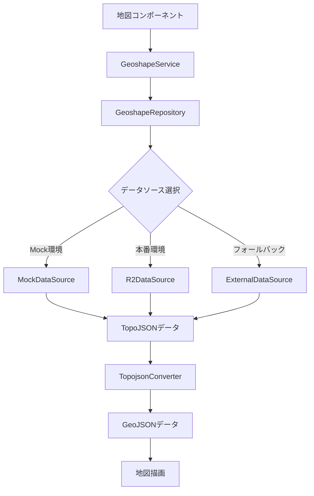

# Geoshape ドメイン - 技術設計書

## 概要

Geoshape ドメインは、地理データ（TopoJSON/GeoJSON）の取得、変換、キャッシュ管理を担当する支援ドメインです。都道府県や市区町村の境界データを効率的に管理し、地図描画ドメインに提供します。

## 責務

- **地理データの取得**: Mock、R2 ストレージ、外部 API からのデータ取得
- **データ変換**: TopoJSON から GeoJSON への変換
- **キャッシュ管理**: メモリキャッシュと R2 ストレージによる効率的なデータ管理
- **データソース抽象化**: 複数のデータソースを統一インターフェースで管理

## アーキテクチャ

### ドメイン構造

```
src/features/gis/geoshape/
├── types/                    # 型定義
│   └── index.ts
├── config/                   # 設定管理
│   └── geoshape-config.ts
├── repositories/             # データアクセス層
│   ├── geoshape-repository.ts    # メインリポジトリ
│   ├── mock-data-source.ts       # Mockデータソース
│   ├── r2-data-source.ts         # R2ストレージデータソース
│   └── external-data-source.ts   # 外部APIデータソース
├── services/                 # ビジネスロジック層
│   └── geoshape-service.ts
├── utils/                    # ユーティリティ
│   └── topojson-converter.ts
└── index.ts                  # エクスポート
```

### データフロー



## データソース戦略

### 3 段階フォールバック

1. **メモリキャッシュ**: アプリケーション内での高速アクセス
2. **R2 ストレージ**: 24 時間キャッシュによる外部 API 呼び出し削減
3. **外部 API**: Geoshape リポジトリからの最新データ取得

### キャッシュ戦略

- **メモリキャッシュ**: 24 時間有効期限
- **R2 ストレージ**: 24 時間有効期限、バックグラウンド更新
- **SWR**: クライアントサイドでの追加キャッシュ

## 型定義

### 主要な型

```typescript
// TopoJSON型
export interface TopoJSONTopology {
  type: "Topology";
  objects: Record<string, TopoJSONGeometryCollection>;
  arcs: number[][][];
  transform?: {
    scale: [number, number];
    translate: [number, number];
  };
  bbox?: [number, number, number, number];
}

// GeoJSON Feature型
export interface PrefectureFeature {
  type: "Feature";
  properties: {
    prefCode: string;
    prefName: string;
    [key: string]: any;
  };
  geometry: GeoJSON.Geometry;
}
```

## 設定

### 環境変数

```bash
# R2ストレージ設定
R2_ACCOUNT_ID=your_account_id
R2_ACCESS_KEY_ID=your_access_key_id
R2_SECRET_ACCESS_KEY=your_secret_access_key
R2_BUCKET_NAME=your_bucket_name
R2_GEOSHAPE_DATA_URL=https://your-r2-domain.com/geoshape

# Mock環境設定
NEXT_PUBLIC_USE_MOCK_DATA=true
```

### 設定ファイル

```typescript
export const geoshapeConfig: GeoshapeConfig = {
  mockDataPath: "/data/mock/gis/geoshape/jp_pref.l.topojson",
  externalApiUrl: "https://geoshape.ex.nii.ac.jp",
  r2BucketPath: "geoshape/cache/2023",
  cacheMaxAge: 86400, // 24時間
};
```

## API

### GeoshapeService

```typescript
// 都道府県のGeoJSON FeatureCollectionを取得
static async getPrefectureFeatures(options?: FetchOptions): Promise<PrefectureFeatureCollection>

// 特定の都道府県のFeatureを取得
static async getPrefectureFeature(prefCode: string, options?: FetchOptions): Promise<PrefectureFeature | null>

// 都道府県コードのリストを取得
static async getPrefectureCodes(options?: FetchOptions): Promise<string[]>

// データソースの可用性をチェック
static async checkDataSources(): Promise<{mock: boolean, r2: boolean, external: boolean}>
```

### GeoshapeRepository

```typescript
// 都道府県TopoJSONデータを取得（3段階フォールバック）
static async getPrefectureTopology(options?: FetchOptions): Promise<FetchResult<TopoJSONTopology>>

// メモリキャッシュをクリア
static clearMemoryCache(): void

// キャッシュステータスを取得
static getCacheStatus(): {memoryCache: number, r2Available: boolean, externalAvailable: boolean}
```

## エラーハンドリング

### エラータイプ

- `GeoshapeError`: 基本エラー
- `DataSourceError`: データソースエラー
- `CacheError`: キャッシュエラー

### エラー処理戦略

1. **フォールバック**: データソースが失敗した場合、次のソースを試行
2. **ログ出力**: 詳細なエラー情報をコンソールに出力
3. **ユーザー通知**: 最終的にデータが取得できない場合、ユーザーに通知

## パフォーマンス考慮事項

### データサイズ最適化

- **TopoJSON 使用**: GeoJSON より約 1/10 のサイズ
- **低解像度データ**: 初期実装では低解像度 TopoJSON を使用
- **メモリキャッシュ**: 2 回目以降のアクセスは高速

### 非同期処理

- **バックグラウンド保存**: R2 ストレージへの保存は非同期
- **並列処理**: 複数のデータソースチェックを並列実行

## 将来の拡張

### 予定されている機能

- **市区町村データ**: 都道府県に加えて市区町村レベルのデータ対応
- **高解像度データ**: 中・高解像度 TopoJSON の対応
- **リアルタイム更新**: データの自動更新機能
- **データ検証**: TopoJSON/GeoJSON データの妥当性チェック

### 拡張ポイント

- **新しいデータソース**: 他の地理データプロバイダーとの連携
- **カスタム投影法**: 地域に特化した投影法の追加
- **データ変換**: 他の地理データ形式への変換機能
