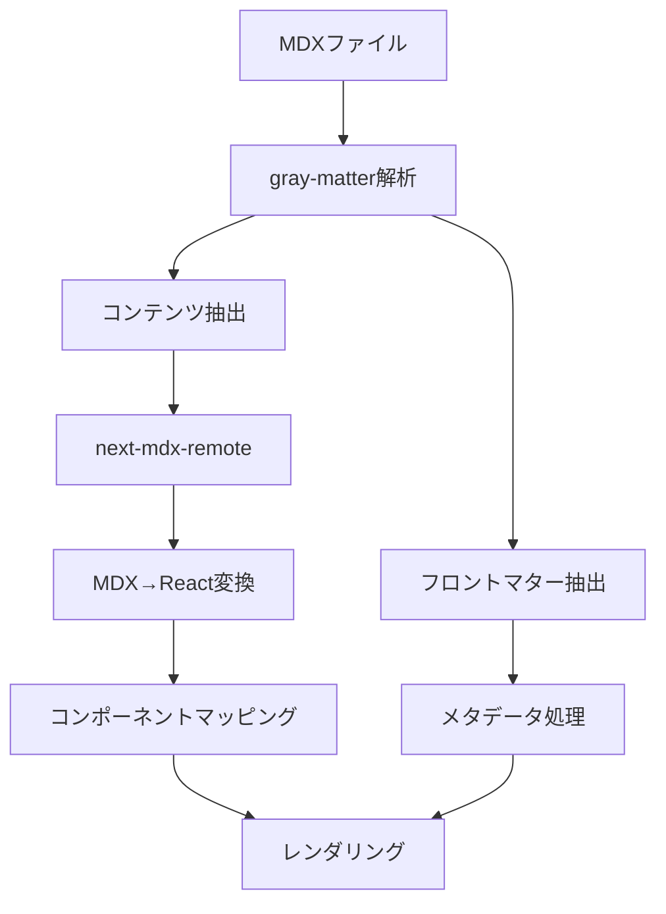

# Content（コンテンツ管理）ドメイン

## 概要

Content（コンテンツ管理）ドメインは、stats47 プロジェクトの汎用ドメインの一つで、MDX/Markdown ベースのブログシステムとコンテンツ管理を担当します。統計データの可視化を含む豊かなコンテンツを提供し、ユーザーにデータドリブンな分析記事を提供します。

### ドメインの責務と目的

1. **MDX/Markdown 処理**: ファイルの読み込み、解析、変換
2. **ブログ機能**: 記事の作成、管理、公開
3. **フロントマター管理**: メタデータ、SEO 設定、可視化設定の管理
4. **コンポーネントマッピング**: React コンポーネントの MDX への注入
5. **コンテンツレンダリング**: 静的 HTML 生成、動的レンダリング
6. **検索機能**: コンテンツの全文検索（FlexSearch）
7. **エンゲージメント機能**: コメント、関連記事、シェア機能
8. **SEO 最適化**: 検索エンジン最適化とパフォーマンス向上

### ビジネス価値

- **コンテンツマーケティング**: 統計データ分析の専門コンテンツでブランド認知度向上
- **ユーザーエンゲージメント**: インタラクティブな可視化コンポーネントで滞在時間延長
- **SEO 効果**: 構造化されたコンテンツで検索エンジンでの可視性向上
- **データドリブンコンテンツ**: 統計データと連携した説得力のある記事作成
- **コミュニティ形成**: コメント機能でユーザー間の議論を促進

## 汎用ドメインとしての特徴

- **データ取得なし**: コアドメインのデータを直接取得しない
- **コンポーネント中立**: どんな React コンポーネントでも表示可能
- **技術的関心事**: MDX 処理、構文解析、レンダリングエンジン
- **再利用性**: stats47 以外のプロジェクトでも利用可能

## ディレクトリ構造

```
src/infrastructure/content/
├── model/
│   ├── Content.ts           # コンテンツエンティティ
│   ├── Frontmatter.ts       # フロントマター VO
│   ├── ContentType.ts       # コンテンツタイプ VO
│   └── Slug.ts              # スラッグ VO
├── service/
│   ├── ContentService.ts    # コンテンツ管理サービス
│   ├── MdxService.ts        # MDX 処理サービス
│   └── SearchService.ts     # 検索サービス
└── repository/
    └── ContentRepository.ts # ファイルシステムアクセス
```

## 主要エンティティ

### Content

コンテンツの集約ルートエンティティ

**プロパティ**:

- `id`: コンテンツ ID
- `slug`: URL 用スラッグ
- `title`: タイトル
- `content`: MDX コンテンツ本体
- `frontmatter`: メタデータ
- `publishedAt`: 公開日時
- `updatedAt`: 更新日時

**ビジネスメソッド**:

- `isPublished()`: 公開済みかチェック
- `getExcerpt(length?: number)`: 要約文を取得
- `getReadingTime()`: 読了時間を計算

### Frontmatter（値オブジェクト）

フロントマター情報を表す値オブジェクト

**プロパティ**:

- `title`: タイトル
- `description`: 説明
- `tags`: タグリスト
- `category`: カテゴリ
- `ogImage`: OGP 画像
- `seoSettings`: SEO 設定

**メソッド**:

- `getMetaDescription()`: メタディスクリプションを取得
- `getOgTags()`: OGP タグを生成
- `hasTag(tag: string)`: 指定タグの存在チェック

### ContentType（値オブジェクト）

コンテンツタイプを表す値オブジェクト

**値**:

- `blog`: ブログ記事
- `documentation`: ドキュメント
- `page`: 静的ページ

**メソッド**:

- `getDisplayName()`: 表示名を取得
- `getDefaultTemplate()`: デフォルトテンプレートを取得

### Slug（値オブジェクト）

URL 用スラッグを表す値オブジェクト

**制約**:

- 英数字、ハイフン、アンダースコアのみ
- 3-50 文字
- 重複不可

**メソッド**:

- `toString()`: 文字列表現
- `equals(other: Slug)`: 等価性チェック

## 主要サービス

### ContentService

コンテンツ管理のメインサービス

**責務**:

- コンテンツの取得・一覧・検索
- MDX レンダリングの管理
- コンテンツのライフサイクル管理

**主要メソッド**:

- `getContent(slug: string): Promise<Content>`
- `listContents(filter?: ContentFilter): Promise<Content[]>`
- `searchContents(query: string): Promise<Content[]>`
- `renderMdx(content: string, components?: ComponentMap): Promise<string>`

### MdxService

MDX 処理を担当するサービス

**責務**:

- MDX ファイルの解析と変換
- フロントマターの抽出
- コンポーネントのコンパイル

**主要メソッド**:

- `parseMdx(source: string): Promise<MdxResult>`
- `extractFrontmatter(source: string): Frontmatter`
- `compileComponents(components: ComponentMap): CompiledComponents`

### SearchService

コンテンツ検索を担当するサービス

**責務**:

- 全文検索インデックスの管理
- 検索クエリの処理
- 検索結果のランキング

**主要メソッド**:

- `buildIndex(contents: Content[]): Promise<void>`
- `search(query: string, options?: SearchOptions): Promise<SearchResult[]>`
- `updateIndex(content: Content): Promise<void>`

## データフローパターン（疎結合設計）

### ✅ 推奨: Feature 層でデータ取得

```typescript
// app/blog/[slug]/page.tsx
export default async function BlogPost({ params }) {
  // 1. コアドメインからデータ取得
  const rankingData = await rankingService.getData("A1101");

  // 2. Content ドメインからコンテンツ取得
  const post = await contentService.getContent(params.slug);

  // 3. データを注入してレンダリング
  return (
    <MdxRenderer
      content={post.content}
      components={{
        RankingChart: (props) => <RankingChart {...props} data={rankingData} />,
      }}
    />
  );
}
```

### ❌ 非推奨: Content ドメイン内でデータ取得

```typescript
// Content ドメインが他ドメインに依存してしまう
export function MdxRenderer({ content }) {
  const data = await rankingService.getData(); // ← これは避ける
  return <MDX components={{ RankingChart: () => <Chart data={data} /> }} />;
}
```

## 技術スタック

- **MDX 処理**: next-mdx-remote, gray-matter
- **変換**: rehype, remark
- **検索**: FlexSearch
- **キャッシュ**: Cloudflare R2（オプション）

## 関連ドメイン

### Feature 層（App Router）

- **関係**: データ取得とコンポーネント注入
- **連携**: Content ドメインにレンダリング用データを渡す

### Analytics/Visualization（コアドメイン）

- **関係**: コンポーネント提供のみ（データ連携なし）
- **連携**: 可視化コンポーネントを MDX に埋め込み可能

### Search（支援ドメイン）

- **関係**: コンテンツ検索機能の提供
- **連携**: 検索インデックスの管理と検索結果の提供

## 設計原則

### 単一責任

- **コンテンツのレンダリングのみに集中**
- データ取得やビジネスロジックは他のドメインに委譲

### 疎結合

- **他ドメインに依存しない**
- インターフェースを通じた最小限の連携のみ

### 汎用性

- **プロジェクト固有のロジックを含まない**
- どんな React コンポーネントでも表示可能

### テスタビリティ

- **モックデータで容易にテスト可能**
- 外部依存のない純粋な関数として設計

## 実装例

### Content エンティティの実装

```typescript
export class Content {
  constructor(
    private readonly id: ContentId,
    private readonly slug: Slug,
    private readonly title: string,
    private readonly content: string,
    private readonly frontmatter: Frontmatter,
    private readonly publishedAt: Date,
    private readonly updatedAt: Date
  ) {}

  isPublished(): boolean {
    return this.publishedAt <= new Date();
  }

  getExcerpt(length: number = 150): string {
    const plainText = this.content.replace(/[#*`]/g, "");
    return plainText.length > length
      ? plainText.substring(0, length) + "..."
      : plainText;
  }

  getReadingTime(): number {
    const wordsPerMinute = 200;
    const wordCount = this.content.split(/\s+/).length;
    return Math.ceil(wordCount / wordsPerMinute);
  }
}
```

### MdxService の実装

```typescript
export class MdxService {
  async parseMdx(source: string): Promise<MdxResult> {
    const { content, data } = matter(source);
    const frontmatter = Frontmatter.create(data);

    return {
      content,
      frontmatter,
      compiledSource: await this.compileMdx(content),
    };
  }

  private async compileMdx(content: string): Promise<string> {
    return await serialize(content, {
      mdxOptions: {
        remarkPlugins: [remarkGfm],
        rehypePlugins: [rehypeHighlight],
      },
    });
  }
}
```

## ブログ機能

### MDX アーキテクチャ

#### 技術スタック

- **next-mdx-remote**: MDX ファイルのリモートレンダリング
- **gray-matter**: フロントマターの解析
- **rehype/remark**: MDX 変換プラグイン
- **shiki**: コードブロックのシンタックスハイライト

#### レンダリングフロー



#### コンポーネントマッピング

```typescript
export const mdxComponents: MDXComponents = {
  // 基本HTMLタグ
  h1: ({ children }) => (
    <h1 className="text-4xl font-bold mt-8 mb-4">{children}</h1>
  ),
  h2: ({ children }) => (
    <h2 className="text-3xl font-bold mt-6 mb-3">{children}</h2>
  ),
  p: ({ children }) => <p className="my-4 leading-relaxed">{children}</p>,

  // カスタムコンポーネント
  Alert: ({ type, children }: AlertProps) => {
    const alertStyles = {
      info: "bg-blue-50 border-blue-200 text-blue-800",
      warning: "bg-yellow-50 border-yellow-200 text-yellow-800",
      error: "bg-red-50 border-red-200 text-red-800",
      success: "bg-green-50 border-green-200 text-green-800",
    };
    return (
      <div className={`p-4 border-l-4 rounded ${alertStyles[type]}`}>
        {children}
      </div>
    );
  },

  // 可視化コンポーネント
  ChoroplethMap: (props: ChoroplethMapProps) => {
    return <ChoroplethMapComponent {...props} />;
  },
  LineChart: (props: LineChartProps) => {
    return <LineChartComponent {...props} />;
  },
};
```

### コンテンツ構造

#### ディレクトリ構造

```
contents/
└── blog/
    ├── 2024/
    │   ├── 01-population-analysis.mdx
    │   ├── 02-gdp-trends.mdx
    │   └── 03-choropleth-guide.mdx
    ├── 2025/
    │   ├── 01-prefecture-ranking.mdx
    │   └── 02-data-visualization.mdx
    └── draft/
        └── work-in-progress.mdx
```

#### ファイル命名規則

```
{順序}-{スラッグ}.mdx
```

例: `01-population-analysis.mdx`

### Frontmatter スキーマ

#### 基本スキーマ

```typescript
export const FrontmatterSchema = z.object({
  // 必須フィールド
  title: z.string().min(1).max(100),
  slug: z
    .string()
    .regex(/^[a-z0-9-]+$/, "スラッグは小文字、数字、ハイフンのみ使用可能"),
  date: z.string().datetime(),
  description: z.string().min(1).max(200),
  author: z.string().min(1).max(50),

  // カテゴリ・タグ
  category: z.enum([
    "population",
    "economy",
    "society",
    "environment",
    "tutorial",
    "news",
  ]),
  tags: z.array(z.string().min(1).max(20)).min(1).max(10),

  // 可視化設定
  chartSettings: z
    .object({
      colorScheme: z
        .enum(["blue", "red", "green", "purple", "orange"])
        .optional(),
      type: z.enum(["sequential", "diverging", "categorical"]).optional(),
      useMinValueForScale: z.boolean().optional(),
      centerType: z.enum(["zero", "mean", "median"]).optional(),
      height: z.number().min(200).max(800).optional(),
      showLegend: z.boolean().optional(),
      showTooltip: z.boolean().optional(),
    })
    .optional(),

  // SEO設定
  seo: z
    .object({
      ogImage: z.string().url().optional(),
      ogType: z.enum(["article", "website"]).optional(),
      keywords: z.array(z.string()).max(10).optional(),
      canonical: z.string().url().optional(),
      noindex: z.boolean().optional(),
      nofollow: z.boolean().optional(),
    })
    .optional(),

  // オプションフィールド
  draft: z.boolean().optional().default(false),
  featured: z.boolean().optional().default(false),
  series: z.string().max(50).optional(),
  seriesOrder: z.number().int().min(1).optional(),
  relatedArticles: z.array(z.string()).max(5).optional(),
  readingTime: z.number().int().min(1).max(60).optional(),
  lastModified: z.string().datetime().optional(),
});
```

#### カテゴリ体系

| カテゴリ      | 説明           | 例                       |
| ------------- | -------------- | ------------------------ |
| `population`  | 人口統計       | 人口ランキング、人口推移 |
| `economy`     | 経済統計       | GDP、所得、産業          |
| `society`     | 社会統計       | 教育、医療、福祉         |
| `environment` | 環境統計       | 環境指標、エネルギー     |
| `tutorial`    | チュートリアル | 可視化方法、データ分析   |
| `news`        | ニュース       | 統計発表、政策動向       |

### SEO 戦略

#### 技術的 SEO

```typescript
// タイトル生成
export function generateTitle(frontmatter: Frontmatter): string {
  const { title, category, date } = frontmatter;
  const year = new Date(date).getFullYear();

  const categorySuffix = {
    population: ` | 人口統計${year}`,
    economy: ` | 経済統計${year}`,
    society: ` | 社会統計${year}`,
    environment: ` | 環境統計${year}`,
    tutorial: " | データ可視化チュートリアル",
    news: " | 統計ニュース",
  };

  return `${title}${categorySuffix[category] || ""} | stats47`;
}

// 構造化データ生成
export function generateStructuredData(article: BlogArticle): object {
  return {
    "@context": "https://schema.org",
    "@type": "Article",
    headline: article.title,
    description: article.description,
    author: {
      "@type": "Person",
      name: article.author,
    },
    publisher: {
      "@type": "Organization",
      name: "stats47",
      logo: {
        "@type": "ImageObject",
        url: "https://stats47.com/logo.png",
      },
    },
    datePublished: article.date,
    dateModified: article.lastModified || article.date,
    image: {
      "@type": "ImageObject",
      url: `https://stats47.com/images/og/${article.slug}.png`,
    },
    keywords: article.tags.join(", "),
    articleSection: article.category,
    wordCount: article.wordCount,
    timeRequired: `PT${article.readingTime}M`,
  };
}
```

#### パフォーマンス最適化

```typescript
// Core Web Vitals対応
export function optimizeLCP(article: BlogArticle): LCPOptimization {
  return {
    // ヒーロー画像の最適化
    heroImage: {
      src: `/images/og/${article.slug}.webp`,
      width: 1200,
      height: 630,
      priority: true,
      loading: "eager",
    },
    // クリティカルCSSのインライン化
    criticalCSS: extractCriticalCSS(article.content),
    // フォントの最適化
    fontOptimization: {
      preload: ["Noto Sans JP", "Inter"],
      display: "swap",
    },
  };
}
```

## エンゲージメント機能

### コメントシステム

#### サードパーティサービス利用

```typescript
// Disqus統合
export default function DisqusComments({
  postId,
  postTitle,
  postUrl,
}: DisqusCommentsProps) {
  const disqusConfig = {
    url: postUrl,
    identifier: postId,
    title: postTitle,
  };

  return (
    <div className="mt-10 py-8 border-t border-gray-200">
      <h3 className="text-2xl font-bold mb-6">コメント</h3>
      <DiscussionEmbed shortname={disqusShortname} config={disqusConfig} />
    </div>
  );
}
```

#### 自前コメントシステム

```typescript
// Supabaseを使用した実装
export async function POST(request: NextRequest) {
  const { post_slug, author_name, author_email, content } =
    await request.json();

  const { data, error } = await supabase
    .from("comments")
    .insert([{ post_slug, author_name, author_email, content }])
    .select();

  if (error) {
    return NextResponse.json({ error: error.message }, { status: 500 });
  }

  return NextResponse.json({ comment: data[0] }, { status: 201 });
}
```

### 関連記事機能

```typescript
export function generateInternalLinks(article: BlogArticle): InternalLink[] {
  const links: InternalLink[] = [];

  // カテゴリ内の関連記事
  const categoryArticles = getArticlesByCategory(article.category)
    .filter((a) => a.slug !== article.slug)
    .slice(0, 3);

  categoryArticles.forEach((related) => {
    links.push({
      text: related.title,
      url: `/blog/${related.slug}`,
      type: "category",
    });
  });

  return links;
}
```

### ソーシャルシェア

```typescript
export function generateOGP(article: BlogArticle): OGPData {
  return {
    title: article.title,
    description: article.description,
    image: {
      url: `https://stats47.com/images/og/${article.slug}.png`,
      width: 1200,
      height: 630,
      alt: article.title,
    },
    type: "article",
    siteName: "stats47",
    locale: "ja_JP",
    twitter: {
      card: "summary_large_image",
      site: "@stats47",
      creator: "@stats47",
    },
  };
}
```

## 実装パターン

### コンテンツフェッチ

```typescript
// 記事一覧取得
export async function getAllBlogArticles(): Promise<BlogArticle[]> {
  const files = await fs.readdir(blogDirectory);
  const articles = await Promise.all(
    files
      .filter((file) => file.endsWith(".mdx"))
      .map(async (file) => {
        const filePath = path.join(blogDirectory, file);
        const fileContent = await fs.readFile(filePath, "utf-8");
        const { data: frontmatter, content } = matter(fileContent);

        return {
          slug: frontmatter.slug,
          title: frontmatter.title,
          description: frontmatter.description,
          date: frontmatter.date,
          category: frontmatter.category,
          tags: frontmatter.tags,
          content,
          frontmatter,
        };
      })
  );

  return articles.sort(
    (a, b) => new Date(b.date).getTime() - new Date(a.date).getTime()
  );
}
```

### 静的生成

```typescript
// 静的パラメータ生成
export async function generateStaticParams() {
  const articles = await getAllBlogArticles();

  return articles.map((article) => ({
    slug: article.slug,
  }));
}

// 記事ページのメタデータ生成
export async function generateMetadata({
  params,
}: {
  params: { slug: string };
}) {
  const article = await getBlogArticle(params.slug);

  return {
    title: generateTitle(article.frontmatter),
    description: generateDescription(article.frontmatter),
    openGraph: generateOGP(article),
    structuredData: generateStructuredData(article),
  };
}
```

### 動的ルーティング

```typescript
// app/blog/[slug]/page.tsx
export default async function BlogPost({
  params,
}: {
  params: { slug: string };
}) {
  const article = await getBlogArticle(params.slug);
  const relatedArticles = await getRelatedArticles(article);

  return (
    <article className="max-w-4xl mx-auto px-4 py-8">
      <header className="mb-8">
        <h1 className="text-4xl font-bold mb-4">{article.title}</h1>
        <div className="flex items-center text-gray-600 mb-4">
          <span>{article.author}</span>
          <span className="mx-2">•</span>
          <time>{formatDate(article.date)}</time>
          <span className="mx-2">•</span>
          <span>{article.readingTime}分で読める</span>
        </div>
        <div className="flex flex-wrap gap-2 mb-6">
          {article.tags.map((tag) => (
            <span
              key={tag}
              className="px-2 py-1 bg-blue-100 text-blue-800 rounded"
            >
              {tag}
            </span>
          ))}
        </div>
      </header>

      <div className="prose max-w-none">
        <MDXRemote source={article.compiledSource} components={mdxComponents} />
      </div>

      <RelatedArticles articles={relatedArticles} />
      <CommentSection postSlug={params.slug} />
    </article>
  );
}
```

## テスト戦略

### 単体テスト

```typescript
describe("Frontmatter Schema", () => {
  test("valid frontmatter passes validation", () => {
    const validFrontmatter = {
      title: "Test Article",
      slug: "test-article",
      date: "2024-01-15T00:00:00Z",
      description: "Test description",
      author: "Test Author",
      category: "population",
      tags: ["test", "article"],
    };

    expect(() => FrontmatterSchema.parse(validFrontmatter)).not.toThrow();
  });

  test("invalid frontmatter throws error", () => {
    const invalidFrontmatter = {
      title: "", // 空文字は無効
      slug: "Invalid Slug!", // 大文字と記号は無効
    };

    expect(() => FrontmatterSchema.parse(invalidFrontmatter)).toThrow();
  });
});
```

### 統合テスト

```typescript
describe("Blog Article Rendering", () => {
  test("renders MDX with custom components", async () => {
    const mdxSource = await serialize(testMDXContent);
    render(<MDXRemote source={mdxSource} components={mdxComponents} />);

    expect(screen.getByText("Test Heading")).toBeInTheDocument();
  });

  test("generates correct metadata", async () => {
    const article = await getBlogArticle("test-article");
    const metadata = generateMetadata({ params: { slug: "test-article" } });

    expect(metadata.title).toContain(article.title);
    expect(metadata.description).toContain(article.description);
  });
});
```

## 将来の拡張性

### 機能拡張

- **多言語対応**: i18n 機能の追加
- **バージョン管理**: コンテンツの履歴管理
- **AI 支援**: 記事生成支援機能
- **シリーズ機能**: 連載記事の管理
- **リアルタイム編集**: 協調編集機能

### 技術的拡張

- **パフォーマンス最適化**: より高速なレンダリング
- **アクセシビリティ**: WCAG 準拠の強化
- **数式サポート**: KaTeX 統合
- **図表サポート**: Mermaid 統合

## 関連ドキュメント

- [DDD ドメイン分類](../01_システム概要/04_DDDドメイン分類.md) - 汎用ドメインの詳細説明
- [システムアーキテクチャ](../01_システム概要/01_システムアーキテクチャ.md) - 全体アーキテクチャ
- [プロジェクト構造](../01_システム概要/02_プロジェクト構造.md) - ディレクトリ構造
