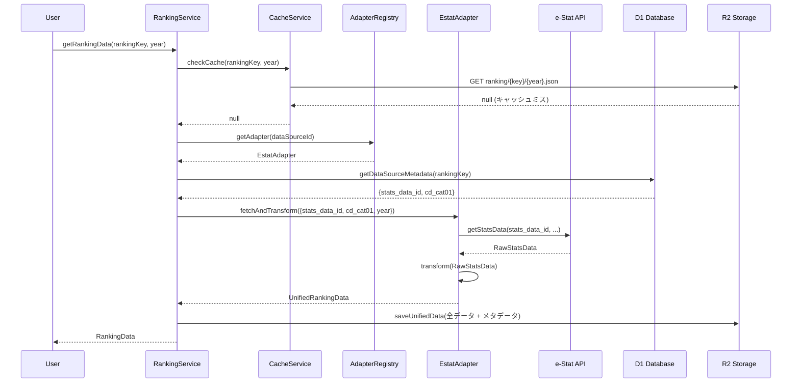
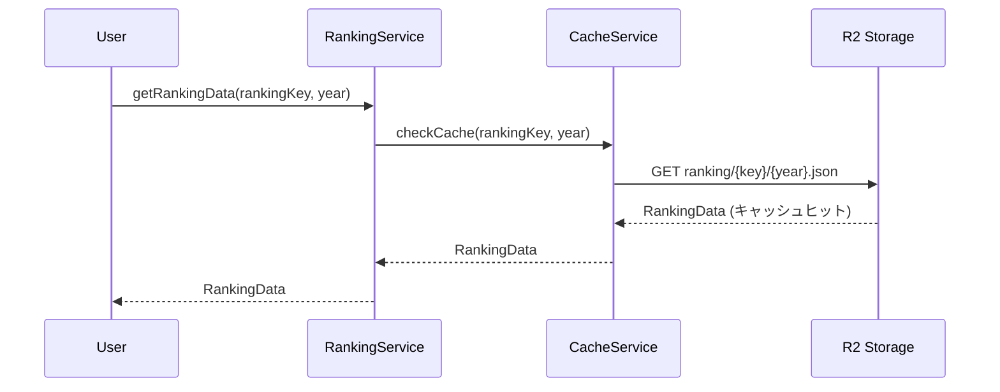
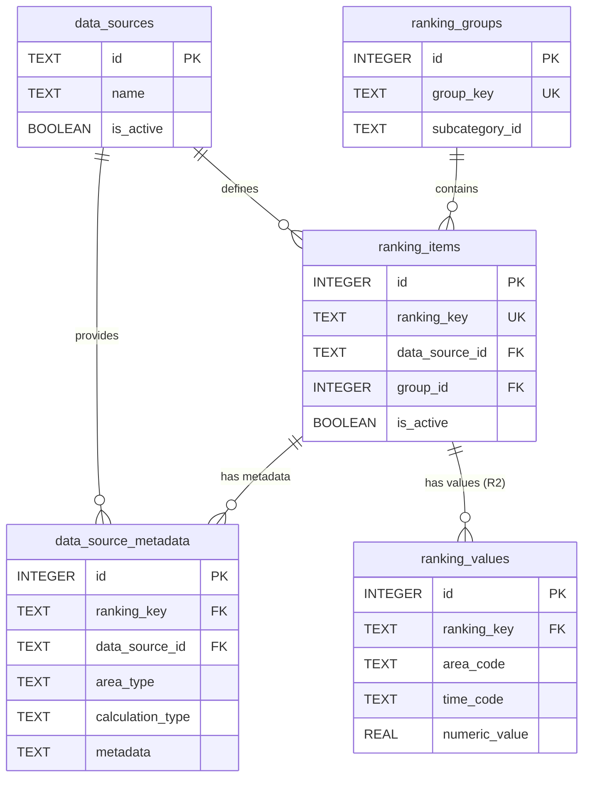

# Ranking ドメイン

## 概要

Ranking ドメインは、stats47 プロジェクトのコアドメインの一つで、ビジネスの中核価値を提供する最も重要なドメインです。統計データのランキング計算、地域プロファイル生成、比較分析など、統計サイトの中核機能を担当します。

### ビジネス価値

- **データドリブンな意思決定支援**: 統計データの分析により、ユーザーがデータに基づいた判断を行える
- **地域の特徴把握**: 地域プロファイル機能により、地域の強みや特徴を可視化
- **比較分析**: 複数地域間の比較により、相対的な位置づけを理解

### 最新の改善 (2025-01-27)

- **ランキンググループ機能**: 関連する複数のランキング項目をグループ化して管理
- **改善された UI**: グループ化により、サイドバーでの項目管理がより明確に

---

## 目次

1. [責務と主要概念](#責務と主要概念)
2. [ドメインモデル](#ドメインモデル)
3. [アーキテクチャ設計](#アーキテクチャ設計)
4. [データ永続化戦略](#データ永続化戦略)
5. [マルチデータソース対応](#マルチデータソース対応)
6. [開発ガイド](#開発ガイド)

---

## 責務と主要概念

### 責務

- ランキング計算とデータ取得
- **ランキング項目のグループ管理**
- **マルチデータソース統合**（e-Stat、気象庁、CSV 等）
- 比較分析
- 傾向分析
- 統計サマリー生成
- データ品質評価
- 地域プロファイル生成
- 地域の強み検出
- 類似地域検出

### 主要概念

#### RankingKey（ランキングキー）

ランキング項目の一意識別子を表現する値オブジェクト。

**具体例**:

- `total-population`: 総人口
- `population-density`: 人口密度
- `gdp-per-capita`: 一人当たり GDP
- `unemployment-rate`: 失業率
- `elderly-population-ratio`: 高齢化率

**制約**:

- 空文字列は不可
- ケバブケース形式（小文字とハイフン）
- 一意である必要がある
- 最大 50 文字

**用途**:

- ランキング項目の識別
- URL パラメータとして使用（例: `/population/basic-population/ranking/total-population`）
- データベースのキーとして使用
- API レスポンスでの項目指定

---

## ドメインモデル

### 主要エンティティ

#### RankingGroup（ランキンググループ）

関連するランキング項目をグループ化して管理するエンティティ。複数の関連項目（例：「製造品出荷額」「製造品出荷額（事業所あたり）」）をまとめて表示する。

**属性**:

- `groupKey`: グループの一意識別子
- `subcategoryId`: サブカテゴリ ID
- `name`: グループ名
- `description`: グループの説明
- `displayOrder`: サブカテゴリ内での表示順
- `isCollapsed`: デフォルトで折り畳み表示するか
- `items`: グループに属するランキング項目の配列

#### RankingItem（ランキング項目）

統計指標の定義とメタデータを管理するエンティティ。

**属性**:

- `rankingKey`: ランキングの一意識別子
- `label`: 表示用ラベル
- `unit`: 単位
- `dataSource`: データソース
- `groupId`: ランキンググループID
- `displayOrderInGroup`: グループ内表示順
- `isFeatured`: おすすめフラグ
- `isActive`: 有効フラグ

#### RankingValue（ランキング値）

地域ごとの統計値とランキング情報を管理するエンティティ。

**属性**:

- `areaCode`: 地域コード
- `value`: 値
- `rank`: 順位
- `percentile`: パーセンタイル
- `year`: 年度
- `timeCode`: 時間コード

#### RegionProfile（地域プロファイル）

地域の総合的な統計プロファイルを管理するエンティティ。

**属性**:

- `areaCode`: 地域コード
- `basicInfo`: 基本情報
- `keyIndicators`: 主要指標リスト
- `strengths`: 強み（トップ 10 ランキング項目）
- `radarData`: レーダーチャート用データ
- `similarRegions`: 類似地域リスト

### 値オブジェクト

#### Rank（順位）

ランキングの順位を表現する値オブジェクト。

**具体例**:

- `1`: 1 位（東京都の総人口）
- `10`: 10 位（大阪府の総人口）
- `47`: 47 位（鳥取県の総人口）

**制約**:

- 1 以上の整数
- 最大 47（都道府県数）
- 同順位は同じ数値を使用

**用途**:

- 都道府県の順位表示
- ランキング表での位置表示
- 上位・下位の判定（例: 上位 10 位以内）
- 順位変動の計算

#### Percentile（パーセンタイル）

パーセンタイル値を表現する値オブジェクト。

**具体例**:

- `95.7`: 上位 5%（東京都の人口密度）
- `50.0`: 中央値（全国平均レベル）
- `15.3`: 下位 15%（鳥取県の人口密度）
- `99.2`: 上位 1%（非常に高い値）

**制約**:

- 0〜100 の実数
- 小数点以下 2 桁まで
- 0 は最小値、100 は最大値を意味

**用途**:

- 相対的な位置づけの表現
- 全国平均との比較
- 上位・下位の判定
- データの分布理解

### ドメインサービス

#### RankingCalculationService

ランキング計算のビジネスロジックを実装するドメインサービス。

- **責務**: ランキング計算、全国平均との比較、パーセンタイル算出
- **主要メソッド**:
  - `calculateRanks(values)`: 統計値のランキング計算と順位付け
  - `compareWithNational(prefectureValue, nationalAverage)`: 全国平均との比較分析
  - `calculatePercentile(rank, total)`: パーセンタイル値の算出
- **使用例**: 都道府県ランキングの生成、相対的位置づけの評価、全国平均比較

#### RankingRepository

ランキングデータの永続化を抽象化するリポジトリインターフェース。

- **責務**: ランキングデータの CRUD 操作、検索、フィルタリング
- **主要メソッド**:
  - `findByKey(rankingKey)`: ランキングキーによる項目取得
  - `findAll(filter)`: カテゴリ・サブカテゴリによるフィルタリング検索
  - `save(item)` / `delete(id)`: ランキング項目の保存・削除
  - `exists(key)`: ランキングキーの存在確認

---

## アーキテクチャ設計

### システムアーキテクチャ全体像

```
┌─────────────────────────────────────────────────────────────┐
│                     Presentation Layer                      │
│  (コロプレス地図、ランキングテーブル、グラフ)               │
└────────────────────┬────────────────────────────────────────┘
                     │
┌────────────────────▼────────────────────────────────────────┐
│                   Ranking Domain (中核)                     │
│  ┌──────────────────────────────────────────────────────┐   │
│  │ RankingItem (ranking_items)                          │   │
│  │ - ranking_key, label, unit, 可視化設定              │   │
│  └──────────────────────────────────────────────────────┘   │
│  ┌──────────────────────────────────────────────────────┐   │
│  │ RankingService                                       │   │
│  │ - getRankingData(rankingKey, year)                   │   │
│  │ - refreshRankingData(rankingKey)                     │   │
│  └──────────────────────────────────────────────────────┘   │
└────────────────────┬────────────────────────────────────────┘
                     │
       ┌─────────────┼─────────────┐
       │             │             │
┌──────▼──────┐ ┌───▼────┐ ┌──────▼──────┐
│ Adapter     │ │ Cache  │ │ Metadata    │
│ Registry    │ │ Service│ │ Service     │
└──────┬──────┘ └───┬────┘ └──────┬──────┘
       │            │             │
┌──────▼────────────▼─────────────▼──────────────────────────┐
│              Data Source Adapters                           │
│  ┌────────────┐  ┌────────────┐  ┌────────────┐            │
│  │ e-Stat     │  │ 気象庁     │  │ CSV        │            │
│  │ Adapter    │  │ Adapter    │  │ Adapter    │            │
│  └────┬───────┘  └────┬───────┘  └────┬───────┘            │
└───────┼──────────────┼──────────────┼────────────────────┘
        │              │              │
┌───────▼──────────────▼──────────────▼────────────────────┐
│           Storage Layer (D1 + R2)                         │
│  ┌──────────────────┐  ┌──────────────────────────────┐  │
│  │ D1 Database      │  │ R2 Storage                   │  │
│  │ (メタデータ)     │  │ (ランキング値データ)         │  │
│  │                  │  │                              │  │
│  │ - ranking_items  │  │ - ranking_values (全データ)  │  │
│  │ - data_sources   │  │   - 都道府県レベル           │  │
│  │ - data_source_   │  │   - 市区町村レベル           │  │
│  │   metadata       │  │   - 全年度                   │  │
│  │ - ranking_groups │  │ - 変換済みJSON形式           │  │
│  └──────────────────┘  └──────────────────────────────┘  │
└───────────────────────────────────────────────────────────┘
        │              │              │
┌───────▼──────────────▼──────────────▼────────────────────┐
│              External Data Sources                        │
│  ┌────────────┐  ┌────────────┐  ┌────────────┐          │
│  │ e-Stat API │  │ 気象庁 API │  │ User CSV   │          │
│  └────────────┘  └────────────┘  └────────────┘          │
└───────────────────────────────────────────────────────────┘
```

### 5層アーキテクチャ設計

Ranking ドメインは以下の 5 層アーキテクチャで設計されています：

#### Layer 1: Presentation Layer

**責務**: UI コンポーネント、ユーザーインタラクション

**コンポーネント**:

- コロプレス地図（ChoroplethMap）
- ランキングテーブル（RankingTable）
- 統計グラフ（StatisticsChart）

**ディレクトリ**: `src/components/organisms/visualization/`

#### Layer 2: Service Layer

**責務**: ビジネスロジック、データ取得調整

**主要サービス**:

- RankingService: ランキングデータの取得・更新
- CacheService: キャッシュ管理
- MetadataService: メタデータ取得

**ディレクトリ**: `src/features/ranking/services/`

#### Layer 3: Repository Layer

**責務**: データアクセス抽象化

**主要リポジトリ**:

- MetadataRepository: ランキング項目・データソースメタデータ取得
- CacheRepository: D1/R2 からのキャッシュデータ取得

**ディレクトリ**: `src/features/ranking/repositories/`

#### Layer 4: Adapter Layer

**責務**: 外部データソース統合

**アダプター**:

- EstatRankingAdapter: e-Stat API 統合
- JmaRankingAdapter: 気象庁 API 統合
- CsvRankingAdapter: CSV/Excel ファイル統合

**ディレクトリ**: `src/features/ranking/adapters/`

#### Layer 5: Infrastructure Layer

**責務**: データベース、ストレージ、外部 API

**コンポーネント**:

- D1 Database クライアント
- R2 Storage クライアント
- e-Stat API クライアント

**ディレクトリ**: `src/infrastructure/`

### データフロー設計

#### シナリオ1: 初回データ取得



**処理時間**: 約1.3〜3.3秒

#### シナリオ2: キャッシュヒット



**処理時間**: 約60〜100ms（初回の1/20〜1/30）

### ディレクトリ構造

```
src/features/ranking/
├── adapters/
│   ├── base/
│   │   ├── RankingDataAdapter.ts
│   │   └── AdapterRegistry.ts
│   ├── estat/
│   │   ├── EstatRankingAdapter.ts
│   │   └── EstatTransformer.ts
│   ├── jma/
│   │   └── JmaRankingAdapter.ts
│   └── csv/
│       └── CsvRankingAdapter.ts
├── services/
│   ├── RankingService.ts
│   ├── CacheService.ts
│   └── MetadataService.ts
├── repositories/
│   ├── MetadataRepository.ts
│   └── CacheRepository.ts
├── types/
│   ├── RankingItem.ts
│   ├── RankingDataPoint.ts
│   ├── UnifiedRankingData.ts
│   ├── RankingKey.ts
│   ├── Rank.ts
│   └── Percentile.ts
└── calculators/
    └── RankingCalculator.ts
```

---

## データ永続化戦略

### データベース設計の概要

Rankingドメインは以下のテーブルで構成されています。詳細は [データベース設計ドキュメント](../04_インフラ設計/01_データベース設計.md#31-ランキング管理) を参照してください。

#### 主要テーブル

| テーブル名            | 説明                                         | 保存先 |
| --------------------- | -------------------------------------------- | ------ |
| data_sources          | データソース定義（e-Stat、気象庁、CSV等）   | D1     |
| ranking_items         | ランキング項目定義（可視化設定含む）         | D1     |
| data_source_metadata  | データソース固有の取得パラメータ             | D1     |
| ranking_groups        | ランキング項目のグループ定義                 | D1     |
| ranking_values        | ランキング値データ（**R2推奨**）             | R2     |

#### テーブル間の関係（簡易版）



**設計のポイント**:
1. **ranking_items → ranking_groups**: 直接参照（中間テーブル不要）
2. **ranking_groups → subcategory**: `subcategory_id` で紐付け
3. **ranking_items → data_source_metadata**: `ranking_key` 経由で複数メタデータ保持可能
4. **ranking_values**: 大量データのため **R2 推奨**（D1 はメタデータのみ）

### ストレージ分担の原則

#### D1 Database（メタデータ専用）

- **用途**: ランキング項目定義、データソース設定、グループ定義
- **保存データ**: ranking_items, data_sources, data_source_metadata, ranking_groups
- **特徴**: 低レイテンシ（10-50ms）、SQL クエリ可能、トランザクション対応
- **容量**: 小規模（数 MB 程度）

#### R2 Storage（値データ専用）

- **用途**: すべてのランキング値データ（都道府県・市区町村レベル）
- **保存データ**: ranking_values（JSON 形式）
- **特徴**: 大容量対応、低コスト、HTTP アクセス、レイテンシ 100-300ms
- **容量**: 大規模（数 GB〜数十 GB）

#### 保存ルール

```typescript
// ルール1: すべてのranking_valuesはR2に保存
await r2.put(
  `ranking/${rankingKey}/${timeCode}.json`,
  JSON.stringify(unifiedData)
);

// ルール2: D1にはメタデータのみ
await db.prepare(`
  INSERT INTO ranking_items (ranking_key, label, unit, data_source_id, ...)
  VALUES (?, ?, ?, ?, ...)
`).bind(...).run();

// ルール3: ranking_valuesテーブルは使用しない（R2のみ）
```

### R2 ストレージ構造

#### ディレクトリ構造

```
ranking/
├── {ranking_key}/
    ├── prefecture/
    │   ├── 2020.json
    │   ├── 2021.json
    │   └── 2023.json
    └── municipality/
        ├── 2020.json
        ├── 2021.json
        └── 2023.json
```

#### JSON ファイル構造

```json
{
  "metadata": {
    "rankingKey": "population_density",
    "timeCode": "2023",
    "timeName": "2023年",
    "unit": "人/km²",
    "targetAreaLevel": "prefecture",
    "lastUpdated": "2025-01-01T00:00:00Z"
  },
  "values": [
    {
      "areaCode": "13000",
      "areaName": "東京都",
      "value": 6439.3,
      "rank": 1,
      "percentile": 100
    }
  ],
  "statistics": {
    "min": 64.5,
    "max": 6439.3,
    "mean": 338.7,
    "median": 124.5
  }
}
```

### キャッシュ戦略

#### 階層型キャッシュ

1. **メモリキャッシュ**（Workers 実行中）: 10 分 TTL
2. **R2 キャッシュ**（永続）: 全データ、90 日 TTL

#### データフロー

```
1. メモリチェック → ヒット: 即座に返却（最速）
2. R2チェック → ヒット: メモリに保存して返却（高速）
3. API取得 → R2保存 → メモリ保存 → 返却（低速）
```

---

## マルチデータソース対応

### Adapter Pattern 設計

#### 設計思想

- 各データソースの差異をアダプターで吸収
- 統一インターフェースで扱える
- 新しいデータソースの追加が容易

#### 統一インターフェース

```typescript
interface RankingDataAdapter {
  readonly sourceId: string;
  readonly sourceName: string;

  fetchAndTransform(params: AdapterFetchParams): Promise<UnifiedRankingData>;
  getAvailableYears(
    rankingKey: string,
    level: TargetAreaLevel
  ): Promise<string[]>;
  isAvailable(): Promise<boolean>;
}
```

#### 統一データモデル

```typescript
interface UnifiedRankingData {
  metadata: {
    rankingKey: string;
    dataSourceId: string;
    label: string;
    unit: string;
    targetAreaLevel: "prefecture" | "municipality";
    lastUpdated: string;
  };
  values: RankingDataPoint[];
  quality: DataQuality;
}
```

#### 対応データソース

- **e-Stat API**: REST API 型、JSON 応答、認証キー必須
- **気象庁 API**: リアルタイム API 型、頻繁な更新
- **CSV/Excel**: ファイルベース型、パース・バリデーション必須

### データソースメタデータ設計

#### data_sources（データソース定義）

各データソース（e-Stat、気象庁、CSV等）の基本情報を管理。

**初期データ**:

| id     | name           | description              | base_url                 |
| ------ | -------------- | ------------------------ | ------------------------ |
| estat  | e-Stat         | 政府統計の総合窓口       | https://api.e-stat.go.jp |
| jma    | 気象庁         | 気象データ               | https://www.jma.go.jp    |
| custom | カスタムデータ | ユーザー定義データソース | NULL                     |

#### data_source_metadata（取得パラメータ定義）

ランキング項目ごとに「どのデータソースから」「どう取得するか」を定義。

**metadata JSON 構造例**:

1. **直接ランキング**（calculation_type='direct', area_type='prefecture'）:

```json
{
  "stats_data_id": "0000010102",
  "cd_cat01": "B1101",
  "cd_area": "00000"
}
```

2. **計算ランキング**（calculation_type='ratio', area_type='prefecture'）:

```json
{
  "numerator": {
    "source_key": "population",
    "stats_data_id": "0000010102",
    "cd_cat01": "A1101"
  },
  "denominator": {
    "source_key": "area",
    "stats_data_id": "0000020101",
    "cd_cat01": "B1101"
  },
  "multiplier": 1000,
  "decimal_places": 2
}
```

**設計の利点**:

- 同じランキング項目でも都道府県・市区町村で異なるパラメータを使用可能
- 計算型ランキング（人口密度 = 人口 ÷ 面積 × 1000）に対応
- データソース切り替えが容易

---

## 関連ドメイン

- **Area Management ドメイン**: 地域情報の取得
- **Data Integration ドメイン**: 統計データの取得
- **Taxonomy Management ドメイン**: カテゴリ情報の管理

---

## 開発ガイド

実装手順やトラブルシューティングについては、以下の開発ガイドを参照してください:

➡️ [ランキングドメイン 開発ガイド](01_技術設計/03_ドメイン設計/ranking/README.md)

**内容**:
- [新機能追加ガイド](01_新機能追加ガイド.md): データソース追加、ランキング項目追加、グループ作成
- [実装パターン集](02_実装パターン集.md): よく使うコード例とパターン
- [トラブルシューティング](03_トラブルシューティング.md): エラー対処法とデバッグ方法

---

**更新履歴**:

- 2025-10-29: テーブル定義を削除し参照形式に変更、構成を再編成（What→Why→How）
- 2025-01-27: ランキンググループ機能を追加
- 2025-01-20: 初版作成
