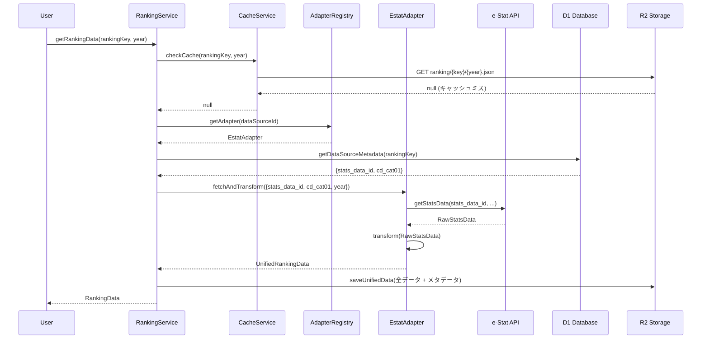
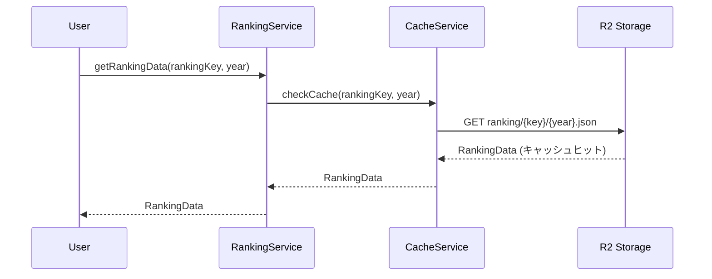
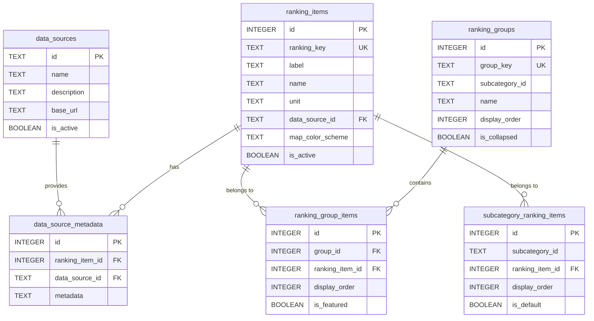

# Ranking ドメイン

## 概要

Ranking ドメインは、stats47 プロジェクトのコアドメインの一つで、ビジネスの中核価値を提供する最も重要なドメインです。統計データのランキング計算、地域プロファイル生成、比較分析など、統計サイトの中核機能を担当します。

### 最新の改善 (2025-01-27)

- **ランキンググループ機能**: 関連する複数のランキング項目をグループ化して管理
- **改善された UI**: グループ化により、サイドバーでの項目管理がより明確に

### ビジネス価値

- **データドリブンな意思決定支援**: 統計データの分析により、ユーザーがデータに基づいた判断を行える
- **地域の特徴把握**: 地域プロファイル機能により、地域の強みや特徴を可視化
- **比較分析**: 複数地域間の比較により、相対的な位置づけを理解

## 責務

- ランキング計算とデータ取得
- **ランキング項目のグループ管理**
- **マルチデータソース統合**（e-Stat、気象庁、CSV 等）
- 比較分析
- 傾向分析
- 統計サマリー生成
- データ品質評価
- 地域プロファイル生成
- 地域の強み検出
- 類似地域検出

## 主要エンティティ

### RankingGroup（ランキンググループ）

関連するランキング項目をグループ化して管理するエンティティ。複数の関連項目（例：「製造品出荷額」「製造品出荷額（事業所あたり）」）をまとめて表示する。

**属性:**

- `groupKey`: グループの一意識別子
- `subcategoryId`: サブカテゴリ ID
- `name`: グループ名
- `description`: グループの説明
- `displayOrder`: サブカテゴリ内での表示順
- `isCollapsed`: デフォルトで折り畳み表示するか
- `items`: グループに属するランキング項目の配列

### RankingItem（ランキング項目）

統計指標の定義とメタデータを管理するエンティティ。

**属性:**

- `rankingKey`: ランキングの一意識別子
- `label`: 表示用ラベル
- `unit`: 単位
- `dataSource`: データソース
- `categoryId`: カテゴリ ID
- `isActive`: 有効フラグ

### RankingValue（ランキング値）

地域ごとの統計値とランキング情報を管理するエンティティ。

**属性:**

- `areaCode`: 地域コード
- `value`: 値
- `rank`: 順位
- `percentile`: パーセンタイル
- `year`: 年度
- `timeCode`: 時間コード

### RegionProfile（地域プロファイル）

地域の総合的な統計プロファイルを管理するエンティティ。

**属性:**

- `areaCode`: 地域コード
- `basicInfo`: 基本情報
- `keyIndicators`: 主要指標リスト
- `strengths`: 強み（トップ 10 ランキング項目）
- `radarData`: レーダーチャート用データ
- `similarRegions`: 類似地域リスト

### RegionStrength（地域の強み）

地域の特定指標における強みを表現するエンティティ。

**属性:**

- `indicator`: 統計指標
- `rank`: 順位
- `value`: 値
- `nationalAvg`: 全国平均
- `percentile`: パーセンタイル

### SimilarRegion（類似地域）

地域間の類似度を表現するエンティティ。

**属性:**

- `areaCode`: 地域コード
- `similarityScore`: 類似度スコア
- `calculationMethod`: 計算方法（ユークリッド距離/コサイン類似度）

## 値オブジェクト

### RankingKey（ランキングキー）

ランキング項目の一意識別子を表現する値オブジェクト。

**具体例:**

- `total-population`: 総人口
- `population-density`: 人口密度
- `gdp-per-capita`: 一人当たり GDP
- `unemployment-rate`: 失業率
- `elderly-population-ratio`: 高齢化率

**制約:**

- 空文字列は不可
- ケバブケース形式（小文字とハイフン）
- 一意である必要がある
- 最大 50 文字

**用途:**

- ランキング項目の識別
- URL パラメータとして使用（例: `/population/basic-population/ranking/total-population`）
- データベースのキーとして使用
- API レスポンスでの項目指定

### Rank（順位）

ランキングの順位を表現する値オブジェクト。

**具体例:**

- `1`: 1 位（東京都の総人口）
- `10`: 10 位（大阪府の総人口）
- `47`: 47 位（鳥取県の総人口）

**制約:**

- 1 以上の整数
- 最大 47（都道府県数）
- 同順位は同じ数値を使用

**用途:**

- 都道府県の順位表示
- ランキング表での位置表示
- 上位・下位の判定（例: 上位 10 位以内）
- 順位変動の計算

### Percentile（パーセンタイル）

パーセンタイル値を表現する値オブジェクト。

**具体例:**

- `95.7`: 上位 5%（東京都の人口密度）
- `50.0`: 中央値（全国平均レベル）
- `15.3`: 下位 15%（鳥取県の人口密度）
- `99.2`: 上位 1%（非常に高い値）

**制約:**

- 0〜100 の実数
- 小数点以下 2 桁まで
- 0 は最小値、100 は最大値を意味

**用途:**

- 相対的な位置づけの表現
- 全国平均との比較
- 上位・下位の判定
- データの分布理解

## ドメインサービス

### RankingCalculationService

ランキング計算のビジネスロジックを実装するドメインサービス。

- **責務**: ランキング計算、全国平均との比較、パーセンタイル算出
- **主要メソッド**:
  - `calculateRanks(values)`: 統計値のランキング計算と順位付け
  - `compareWithNational(prefectureValue, nationalAverage)`: 全国平均との比較分析
  - `calculatePercentile(rank, total)`: パーセンタイル値の算出
- **使用例**: 都道府県ランキングの生成、相対的位置づけの評価、全国平均比較

### RankingRepository

ランキングデータの永続化を抽象化するリポジトリインターフェース。

- **責務**: ランキングデータの CRUD 操作、検索、フィルタリング
- **主要メソッド**:
  - `findByKey(rankingKey)`: ランキングキーによる項目取得
  - `findAll(filter)`: カテゴリ・サブカテゴリによるフィルタリング検索
  - `save(item)` / `delete(id)`: ランキング項目の保存・削除
  - `exists(key)`: ランキングキーの存在確認

## アーキテクチャ設計

### システムアーキテクチャ全体像

```
┌─────────────────────────────────────────────────────────────┐
│                     Presentation Layer                      │
│  (コロプレス地図、ランキングテーブル、グラフ)               │
└────────────────────┬────────────────────────────────────────┘
                     │
┌────────────────────▼────────────────────────────────────────┐
│                   Ranking Domain (中核)                     │
│  ┌──────────────────────────────────────────────────────┐   │
│  │ RankingItem (ranking_items)                          │   │
│  │ - ranking_key, label, unit, 可視化設定              │   │
│  └──────────────────────────────────────────────────────┘   │
│  ┌──────────────────────────────────────────────────────┐   │
│  │ RankingService                                       │   │
│  │ - getRankingData(rankingKey, year)                   │   │
│  │ - refreshRankingData(rankingKey)                     │   │
│  └──────────────────────────────────────────────────────┘   │
└────────────────────┬────────────────────────────────────────┘
                     │
       ┌─────────────┼─────────────┐
       │             │             │
┌──────▼──────┐ ┌───▼────┐ ┌──────▼──────┐
│ Adapter     │ │ Cache  │ │ Metadata    │
│ Registry    │ │ Service│ │ Service     │
└──────┬──────┘ └───┬────┘ └──────┬──────┘
       │            │             │
┌──────▼────────────▼─────────────▼──────────────────────────┐
│              Data Source Adapters                           │
│  ┌────────────┐  ┌────────────┐  ┌────────────┐            │
│  │ e-Stat     │  │ 気象庁     │  │ CSV        │            │
│  │ Adapter    │  │ Adapter    │  │ Adapter    │            │
│  └────┬───────┘  └────┬───────┘  └────┬───────┘            │
└───────┼──────────────┼──────────────┼────────────────────┘
        │              │              │
┌───────▼──────────────▼──────────────▼────────────────────┐
│           Storage Layer (D1 + R2)                         │
│  ┌──────────────────┐  ┌──────────────────────────────┐  │
│  │ D1 Database      │  │ R2 Storage                   │  │
│  │ (メタデータ)     │  │ (ランキング値データ)         │  │
│  │                  │  │                              │  │
│  │ - ranking_items  │  │ - ranking_values (全データ)  │  │
│  │ - data_sources   │  │   - 都道府県レベル           │  │
│  │ - data_source_   │  │   - 市区町村レベル           │  │
│  │   metadata       │  │   - 全年度                   │  │
│  │ - ranking_groups │  │ - 変換済みJSON形式           │  │
│  │ - ranking_group_ │  │                              │  │
│  │   items          │  │                              │  │
│  │ - subcategory_   │  │                              │  │
│  │   ranking_items  │  │                              │  │
│  └──────────────────┘  └──────────────────────────────┘  │
└───────────────────────────────────────────────────────────┘
        │              │              │
┌───────▼──────────────▼──────────────▼────────────────────┐
│              External Data Sources                        │
│  ┌────────────┐  ┌────────────┐  ┌────────────┐          │
│  │ e-Stat API │  │ 気象庁 API │  │ User CSV   │          │
│  └────────────┘  └────────────┘  └────────────┘          │
└───────────────────────────────────────────────────────────┘
```

### 5層アーキテクチャ設計

Ranking ドメインは以下の 5 層アーキテクチャで設計されています：

#### Layer 1: Presentation Layer

**責務**: UI コンポーネント、ユーザーインタラクション

**コンポーネント**:

- コロプレス地図（ChoroplethMap）
- ランキングテーブル（RankingTable）
- 統計グラフ（StatisticsChart）

**ディレクトリ**: `src/components/organisms/visualization/`

#### Layer 2: Service Layer

**責務**: ビジネスロジック、データ取得調整

**主要サービス**:

- RankingService: ランキングデータの取得・更新
- CacheService: キャッシュ管理
- MetadataService: メタデータ取得

**ディレクトリ**: `src/features/ranking/services/`

#### Layer 3: Repository Layer

**責務**: データアクセス抽象化

**主要リポジトリ**:

- MetadataRepository: ランキング項目・データソースメタデータ取得
- CacheRepository: D1/R2 からのキャッシュデータ取得

**ディレクトリ**: `src/features/ranking/repositories/`

#### Layer 4: Adapter Layer

**責務**: 外部データソース統合

**アダプター**:

- EstatRankingAdapter: e-Stat API 統合
- JmaRankingAdapter: 気象庁 API 統合
- CsvRankingAdapter: CSV/Excel ファイル統合

**ディレクトリ**: `src/features/ranking/adapters/`

#### Layer 5: Infrastructure Layer

**責務**: データベース、ストレージ、外部 API

**コンポーネント**:

- D1 Database クライアント
- R2 Storage クライアント
- e-Stat API クライアント

**ディレクトリ**: `src/infrastructure/`

### データ永続化戦略

#### ストレージ分担の原則

**D1 Database（メタデータ専用）**:

- **用途**: ランキング項目定義、データソース設定、グループ定義
- **保存データ**: ranking_items, data_sources, data_source_metadata, ranking_groups
- **特徴**: 低レイテンシ（10-50ms）、SQL クエリ可能、トランザクション対応
- **容量**: 小規模（数 MB 程度）

**R2 Storage（値データ専用）**:

- **用途**: すべてのランキング値データ（都道府県・市区町村レベル）
- **保存データ**: ranking_values（JSON 形式）
- **特徴**: 大容量対応、低コスト、HTTP アクセス、レイテンシ 100-300ms
- **容量**: 大規模（数 GB〜数十 GB）

**保存ルール**:

```typescript
// ルール1: すべてのranking_valuesはR2に保存
await r2.put(
  `ranking/${rankingKey}/${timeCode}.json`,
  JSON.stringify(unifiedData)
);

// ルール2: D1にはメタデータのみ
await db.prepare(`
  INSERT INTO ranking_items (ranking_key, label, unit, data_source_id, ...)
  VALUES (?, ?, ?, ?, ...)
`).bind(...).run();

// ルール3: ranking_valuesテーブルは使用しない（R2のみ）
```

#### キャッシュ戦略

**階層型キャッシュ**:

1. **メモリキャッシュ**（Workers 実行中）: 10 分 TTL
2. **R2 キャッシュ**（永続）: 全データ、90 日 TTL

**データフロー**:

```
1. メモリチェック → ヒット: 即座に返却（最速）
2. R2チェック → ヒット: メモリに保存して返却（高速）
3. API取得 → R2保存 → メモリ保存 → 返却（低速）
```

### データフロー設計

#### シナリオ1: 初回データ取得



**処理時間**: 約1.3〜3.3秒

#### シナリオ2: キャッシュヒット



**処理時間**: 約60〜100ms（初回の1/20〜1/30）

### マルチデータソース対応

#### Adapter Pattern 設計

**設計思想**:

- 各データソースの差異をアダプターで吸収
- 統一インターフェースで扱える
- 新しいデータソースの追加が容易

**統一インターフェース**:

```typescript
interface RankingDataAdapter {
  readonly sourceId: string;
  readonly sourceName: string;

  fetchAndTransform(params: AdapterFetchParams): Promise<UnifiedRankingData>;
  getAvailableYears(
    rankingKey: string,
    level: TargetAreaLevel
  ): Promise<string[]>;
  isAvailable(): Promise<boolean>;
}
```

**統一データモデル**:

```typescript
interface UnifiedRankingData {
  metadata: {
    rankingKey: string;
    dataSourceId: string;
    label: string;
    unit: string;
    targetAreaLevel: "prefecture" | "municipality";
    lastUpdated: string;
  };
  values: RankingDataPoint[];
  quality: DataQuality;
}
```

**対応データソース**:

- **e-Stat API**: REST API 型、JSON 応答、認証キー必須
- **気象庁 API**: リアルタイム API 型、頻繁な更新
- **CSV/Excel**: ファイルベース型、パース・バリデーション必須

#### データソースメタデータ設計

##### data_sources（データソース定義）

各データソース（e-Stat、気象庁、CSV等）の基本情報を管理。

**初期データ**:

| id     | name           | description              | base_url                 |
| ------ | -------------- | ------------------------ | ------------------------ |
| estat  | e-Stat         | 政府統計の総合窓口       | https://api.e-stat.go.jp |
| jma    | 気象庁         | 気象データ               | https://www.jma.go.jp    |
| custom | カスタムデータ | ユーザー定義データソース | NULL                     |

##### data_source_metadata（取得パラメータ定義）

ランキング項目ごとに「どのデータソースから」「どう取得するか」を定義。

**metadata JSON 構造例**:

1. **直接ランキング**（calculation_type='direct', area_type='prefecture'）:

```json
{
  "stats_data_id": "0000010102",
  "cd_cat01": "B1101",
  "cd_area": "00000"
}
```

2. **計算ランキング**（calculation_type='ratio', area_type='prefecture'）:

```json
{
  "numerator": {
    "source_key": "population",
    "stats_data_id": "0000010102",
    "cd_cat01": "A1101"
  },
  "denominator": {
    "source_key": "area",
    "stats_data_id": "0000020101",
    "cd_cat01": "B1101"
  },
  "multiplier": 1000,
  "decimal_places": 2
}
```

**設計の利点**:

- 同じランキング項目でも都道府県・市区町村で異なるパラメータを使用可能
- 計算型ランキング（人口密度 = 人口 ÷ 面積 × 1000）に対応
- データソース切り替えが容易

## データベース設計

### テーブル設計

#### 1. ranking_items（ランキング項目定義）

| カラム名               | データ型 | 制約                      | デフォルト値       | 説明               |
| ---------------------- | -------- | ------------------------- | ------------------ | ------------------ |
| id                     | INTEGER  | PRIMARY KEY AUTOINCREMENT | -                  | 項目 ID            |
| ranking_key            | TEXT     | UNIQUE NOT NULL           | -                  | ランキングキー     |
| label                  | TEXT     | NOT NULL                  | -                  | 短縮ラベル         |
| name                   | TEXT     | NOT NULL                  | -                  | 正式名称           |
| description            | TEXT     | -                         | NULL               | 説明               |
| unit                   | TEXT     | NOT NULL                  | -                  | 単位               |
| data_source_id         | TEXT     | NOT NULL FK               | -                  | データソース ID    |
| map_color_scheme       | TEXT     | -                         | 'interpolateBlues' | 地図カラースキーム |
| map_diverging_midpoint | TEXT     | -                         | 'zero'             | 発散型カラー中央値 |
| ranking_direction      | TEXT     | -                         | 'desc'             | ランキング方向     |
| conversion_factor      | REAL     | -                         | 1                  | 変換係数           |
| decimal_places         | INTEGER  | -                         | 0                  | 小数点以下桁数     |
| is_active              | BOOLEAN  | -                         | 1                  | アクティブフラグ   |
| created_at             | DATETIME | -                         | CURRENT_TIMESTAMP  | 作成日時           |
| updated_at             | DATETIME | -                         | CURRENT_TIMESTAMP  | 更新日時           |

**インデックス**: `idx_ranking_items_data_source`, `idx_ranking_items_active`

**外部キー**: data_source_id → data_sources(id)

#### 2. data_sources（データソース定義）

| カラム名    | データ型 | 制約        | デフォルト値      | 説明             |
| ----------- | -------- | ----------- | ----------------- | ---------------- |
| id          | TEXT     | PRIMARY KEY | -                 | データソース ID  |
| name        | TEXT     | NOT NULL    | -                 | データソース名   |
| description | TEXT     | -           | NULL              | 説明             |
| base_url    | TEXT     | -           | NULL              | ベース URL       |
| api_version | TEXT     | -           | NULL              | API バージョン   |
| is_active   | BOOLEAN  | -           | 1                 | アクティブフラグ |
| created_at  | DATETIME | -           | CURRENT_TIMESTAMP | 作成日時         |
| updated_at  | DATETIME | -           | CURRENT_TIMESTAMP | 更新日時         |

**初期データ**:

- `estat`: e-Stat（政府統計の総合窓口）
- `jma`: 気象庁
- `csv`: カスタム CSV

#### 3. data_source_metadata（データソースメタデータ）

| カラム名         | データ型 | 制約                      | デフォルト値      | 説明                           |
| ---------------- | -------- | ------------------------- | ----------------- | ------------------------------ | ------- | ------------ |
| id               | INTEGER  | PRIMARY KEY AUTOINCREMENT | -                 | メタデータ ID                  |
| ranking_key      | TEXT     | NOT NULL FK               | -                 | ランキングキー                 |
| data_source_id   | TEXT     | NOT NULL FK               | -                 | データソース ID                |
| area_type        | TEXT     | NOT NULL                  | -                 | 地域レベル ('prefecture'       | 'city'  | 'national')  |
| calculation_type | TEXT     | NOT NULL                  | 'direct'          | 計算タイプ ('direct'           | 'ratio' | 'aggregate') |
| metadata         | TEXT     | NOT NULL                  | -                 | データソースパラメータ（JSON） |
| created_at       | DATETIME | -                         | CURRENT_TIMESTAMP | 作成日時                       |
| updated_at       | DATETIME | -                         | CURRENT_TIMESTAMP | 更新日時                       |

**UNIQUE 制約**: (ranking_key, data_source_id, area_type)

**インデックス**: `idx_data_source_metadata_ranking`, `idx_data_source_metadata_source`, `idx_data_source_metadata_area`

**外部キー**:

- ranking_key → ranking_items(ranking_key) ON DELETE CASCADE
- data_source_id → data_sources(id)

**metadata JSON 例**（e-Stat）:

```json
{
  "stats_data_id": "0000010102",
  "cd_cat01": "B1101"
}
```

#### 4. ranking_groups（ランキンググループ）

| カラム名       | データ型 | 制約                      | デフォルト値      | 説明               |
| -------------- | -------- | ------------------------- | ----------------- | ------------------ |
| id             | INTEGER  | PRIMARY KEY AUTOINCREMENT | -                 | グループ ID        |
| group_key      | TEXT     | UNIQUE NOT NULL           | -                 | グループキー       |
| subcategory_id | TEXT     | NOT NULL                  | -                 | サブカテゴリ ID    |
| name           | TEXT     | NOT NULL                  | -                 | グループ名         |
| description    | TEXT     | -                         | NULL              | 説明               |
| icon           | TEXT     | -                         | NULL              | アイコン           |
| display_order  | INTEGER  | -                         | 0                 | 表示順             |
| is_collapsed   | BOOLEAN  | -                         | 0                 | デフォルト折り畳み |
| created_at     | DATETIME | -                         | CURRENT_TIMESTAMP | 作成日時           |
| updated_at     | DATETIME | -                         | CURRENT_TIMESTAMP | 更新日時           |

**インデックス**: `idx_ranking_groups_subcategory`, `idx_ranking_groups_display_order`

#### 5. ranking_group_items（グループ・アイテム関連）

| カラム名        | データ型 | 制約                      | デフォルト値      | 説明              |
| --------------- | -------- | ------------------------- | ----------------- | ----------------- |
| id              | INTEGER  | PRIMARY KEY AUTOINCREMENT | -                 | ID                |
| group_id        | INTEGER  | NOT NULL FK               | -                 | グループ ID       |
| ranking_item_id | INTEGER  | NOT NULL FK               | -                 | ランキング項目 ID |
| display_order   | INTEGER  | -                         | 0                 | 表示順            |
| is_featured     | BOOLEAN  | -                         | 0                 | 注目項目フラグ    |
| created_at      | DATETIME | -                         | CURRENT_TIMESTAMP | 作成日時          |

**UNIQUE 制約**: (group_id, ranking_item_id)

**インデックス**: `idx_ranking_group_items_group`, `idx_ranking_group_items_item`, `idx_ranking_group_items_order`

**外部キー**:

- group_id → ranking_groups(id) ON DELETE CASCADE
- ranking_item_id → ranking_items(id) ON DELETE CASCADE

#### 6. subcategory_ranking_items（サブカテゴリ・アイテム関連）

| カラム名        | データ型 | 制約                      | デフォルト値      | 説明              |
| --------------- | -------- | ------------------------- | ----------------- | ----------------- |
| id              | INTEGER  | PRIMARY KEY AUTOINCREMENT | -                 | ID                |
| subcategory_id  | TEXT     | NOT NULL                  | -                 | サブカテゴリ ID   |
| ranking_item_id | INTEGER  | NOT NULL FK               | -                 | ランキング項目 ID |
| display_order   | INTEGER  | -                         | 0                 | 表示順            |
| is_default      | BOOLEAN  | -                         | 0                 | デフォルト選択    |
| created_at      | DATETIME | -                         | CURRENT_TIMESTAMP | 作成日時          |

**UNIQUE 制約**: (subcategory_id, ranking_item_id)

**インデックス**: `idx_subcategory_ranking_subcategory`, `idx_subcategory_ranking_item`, `idx_subcategory_ranking_order`

**外部キー**: ranking_item_id → ranking_items(id) ON DELETE CASCADE

### R2 ストレージ構造

**ディレクトリ構造**:

```
ranking/
├── {ranking_key}/
    ├── prefecture/
    │   ├── 2020.json
    │   ├── 2021.json
    │   └── 2023.json
    └── municipality/
        ├── 2020.json
        ├── 2021.json
        └── 2023.json
```

**JSON ファイル構造**:

```json
{
  "metadata": {
    "rankingKey": "population_density",
    "timeCode": "2023",
    "timeName": "2023年",
    "unit": "人/km²",
    "targetAreaLevel": "prefecture",
    "lastUpdated": "2025-01-01T00:00:00Z"
  },
  "values": [
    {
      "areaCode": "13000",
      "areaName": "東京都",
      "value": 6439.3,
      "rank": 1,
      "percentile": 100
    }
  ],
  "statistics": {
    "min": 64.5,
    "max": 6439.3,
    "mean": 338.7,
    "median": 124.5
  }
}
```

### ER 図



## ディレクトリ構造

```
src/features/ranking/
├── adapters/
│   ├── base/
│   │   ├── RankingDataAdapter.ts
│   │   └── AdapterRegistry.ts
│   ├── estat/
│   │   ├── EstatRankingAdapter.ts
│   │   └── EstatTransformer.ts
│   ├── jma/
│   │   └── JmaRankingAdapter.ts
│   └── csv/
│       └── CsvRankingAdapter.ts
├── services/
│   ├── RankingService.ts
│   ├── CacheService.ts
│   └── MetadataService.ts
├── repositories/
│   ├── MetadataRepository.ts
│   └── CacheRepository.ts
├── types/
│   ├── RankingItem.ts
│   ├── RankingDataPoint.ts
│   ├── UnifiedRankingData.ts
│   ├── RankingKey.ts
│   ├── Rank.ts
│   └── Percentile.ts
└── calculators/
    └── RankingCalculator.ts
```

## ベストプラクティス

### 1. ビジネスルールのドメイン層配置

統計計算のロジックは必ずドメイン層に配置し、アプリケーション層に漏らさない。

### 2. 不変性の維持

値オブジェクト（Rank、Percentile 等）は不変にし、変更時は新しいインスタンスを作成。

### 3. エラーハンドリング

Result 型を使用して、ビジネスルール違反を適切にハンドリング。

### 4. テスト容易性

ドメインロジックは外部依存を排除し、単体テストを容易にする。

## 関連ドメイン

- **Area Management ドメイン**: 地域情報の取得
- **Data Integration ドメイン**: 統計データの取得
- **Taxonomy Management ドメイン**: カテゴリ情報の管理

---

## 開発ガイド

実装手順やトラブルシューティングについては、以下の開発ガイドを参照してください:

➡️ [ランキングドメイン 開発ガイド](../../04_開発ガイド/01_ドメイン/ranking/README.md)

**内容**:
- [新機能追加ガイド](../../04_開発ガイド/01_ドメイン/ranking/01_新機能追加ガイド.md): データソース追加、ランキング項目追加、グループ作成
- [実装パターン集](../../04_開発ガイド/01_ドメイン/ranking/02_実装パターン集.md): よく使うコード例とパターン
- [トラブルシューティング](../../04_開発ガイド/01_ドメイン/ranking/03_トラブルシューティング.md): エラー対処法とデバッグ方法

---

**更新履歴**:

- 2025-10-29: データフロー設計とマルチデータソース設計を追加、開発ガイドへの参照を追加
- 2025-01-27: ランキンググループ機能を追加
- 2025-01-20: 初版作成
