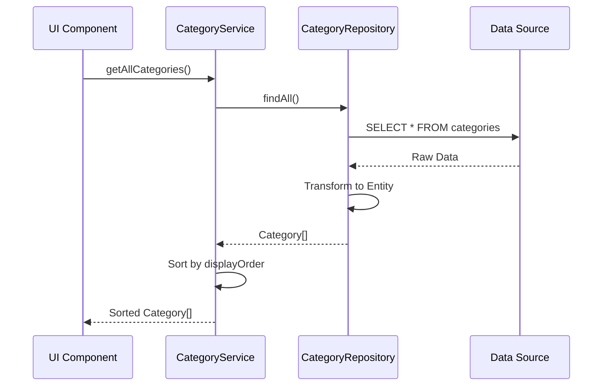
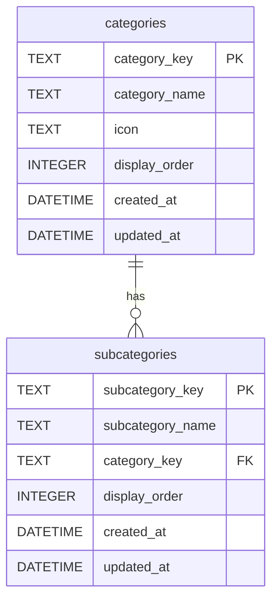

# Category（カテゴリ管理）ドメイン設計

## 概要

Category（カテゴリ管理）ドメインは、stats47 プロジェクトにおける統計データの分類・管理・ナビゲーション機能を提供する支援ドメインです。

### ビジネス価値

- **情報の構造化**: 統計データを体系的に分類し、ユーザーが目的のデータを発見しやすくする
- **ナビゲーション支援**: 階層的なカテゴリ構造により、直感的なサイト内移動を実現
- **拡張性**: 新しいカテゴリやサブカテゴリの追加が容易

---

## 目次

1. [責務と主要概念](#責務と主要概念)
2. [ドメインモデル](#ドメインモデル)
3. [アーキテクチャ設計](#アーキテクチャ設計)
4. [データベース設計](#データベース設計)
5. [主要機能](#主要機能)
6. [ベストプラクティス](#ベストプラクティス)
7. [制約と前提条件](#制約と前提条件)
8. [関連ドメイン](#関連ドメイン)

---

## 責務と主要概念

### 責務

1. **カテゴリ・サブカテゴリの管理**

   - カテゴリの定義と構造化
   - サブカテゴリの階層管理
   - 表示順序の制御

2. **検索・フィルタリング機能**

   - カテゴリ名での検索
   - 条件によるフィルタリング
   - ソート機能（名前順、表示順序順）

3. **ナビゲーション機能**

   - UI コンポーネントでのカテゴリ表示
   - ルーティング情報の提供
   - サイドバー用データ生成

4. **データ正規化・バリデーション**
   - データの整合性確保
   - 型安全性の提供

### 主要概念

#### CategoryKey（カテゴリキー）

カテゴリの一意識別子を表現する値オブジェクト。データベースの主キーとして使用されます。

**具体例**:

- `population`: 人口関連カテゴリ
- `economy`: 経済関連カテゴリ
- `environment`: 環境関連カテゴリ

**制約**:

- 英小文字とハイフンのみ使用
- 一意である必要がある
- URL セーフな文字列

**用途**:

- カテゴリの識別（データベースの主キー）
- URL パラメータとして使用（例: `/population/basic-population`）
- 外部キー参照の基準

#### CategoryName（カテゴリ名）

カテゴリの表示用名称を表現する値オブジェクト。

**具体例**:

- `"人口・世帯"`: population カテゴリの表示名
- `"経済・産業"`: economy カテゴリの表示名
- `"環境"`: environment カテゴリの表示名

**制約**:

- 日本語での表示名
- ユーザーに分かりやすい名称
- 一意である必要がある

**用途**:

- UI での表示
- 検索対象
- ユーザー向けの識別

---

## ドメインモデル

### データベース層（DB 層）

データベーステーブルのカラム構造を表現するモデル。スネークケース（snake_case）のカラム名を使用します。

#### CategoryDB（カテゴリデータベースモデル）

**属性**:

- `category_key`: カテゴリの一意識別子（主キー）
- `category_name`: カテゴリの表示名
- `icon`: Lucide React のアイコン名（nullable）
- `display_order`: 表示順序（0 から始まる）
- `created_at`: 作成日時
- `updated_at`: 更新日時

**型定義**:

```typescript
interface CategoryDB {
  category_key: string;
  category_name: string;
  icon: string | null;
  display_order: number;
  created_at: string;
  updated_at: string;
}
```

#### SubcategoryDB（サブカテゴリデータベースモデル）

**属性**:

- `subcategory_key`: サブカテゴリの一意識別子（主キー）
- `subcategory_name`: サブカテゴリの表示名
- `category_key`: 親カテゴリへの参照（外部キー）
- `display_order`: カテゴリ内での表示順序（0 から始まる）
- `created_at`: 作成日時
- `updated_at`: 更新日時

**型定義**:

```typescript
interface SubcategoryDB {
  subcategory_key: string;
  subcategory_name: string;
  category_key: string;
  display_order: number;
  created_at: string;
  updated_at: string;
}
```

### ドメイン層（Domain 層）

アプリケーション内で使用するモデル。キャメルケース（camelCase）のプロパティ名を使用し、データベースモデルから変換されます。

#### Category（カテゴリドメインモデル）

**属性**:

- `categoryKey`: カテゴリの一意識別子（主キー）
- `categoryName`: カテゴリの表示名
- `icon`: Lucide React のアイコン名（optional）
- `displayOrder`: 表示順序（0 から始まる）
- `subcategories`: このカテゴリに属するサブカテゴリのリスト（optional）

**型定義**:

```typescript
interface Category {
  categoryKey: string;
  categoryName: string;
  icon?: string;
  displayOrder: number;
  subcategories?: Subcategory[];
}
```

#### Subcategory（サブカテゴリドメインモデル）

**属性**:

- `subcategoryKey`: サブカテゴリの一意識別子（主キー）
- `subcategoryName`: サブカテゴリの表示名
- `categoryKey`: 親カテゴリへの参照（外部キー）
- `displayOrder`: カテゴリ内での表示順序（0 から始まる）

**型定義**:

```typescript
interface Subcategory {
  subcategoryKey: string;
  subcategoryName: string;
  categoryKey: string;
  displayOrder: number;
}
```

### 型変換

データベース層からドメイン層への変換は、以下の変換ヘルパー関数で行われます：

- `convertCategoryFromDB()`: CategoryDB → Category
- `convertSubcategoryFromDB()`: SubcategoryDB → Subcategory

**変換ルール**:

- スネークケース → キャメルケース
- `null` → `undefined`（optional プロパティ）
- サブカテゴリの配列を結合

### 値オブジェクト

#### DisplayOrder（表示順序）

カテゴリやサブカテゴリの表示順序を表現する値オブジェクト。

**制約**:

- 0 以上の整数
- 数値が小さいほど上位に表示

**用途**:

- UI での表示順序制御
- デフォルトソート順

### 検索・フィルタオプション

```typescript
interface CategorySearchOptions {
  query?: string;
  hasSubcategories?: boolean;
}

interface CategorySortOptions {
  field: "name" | "display_order" | "category_name";
  order: "asc" | "desc";
}
```

---

## アーキテクチャ設計

### レイヤー構造

```
┌─────────────────────────────────────────┐
│     Presentation Layer                  │
│  (サイドバー、ナビゲーション、検索UI)    │
└──────────────────┬──────────────────────┘
                   │
┌──────────────────▼──────────────────────┐
│     Application Layer                   │
│  (CategoryService) - 目標設計           │
│  - getAllCategories()                   │
│  - getCategoryById()                    │
│  - searchCategories()                   │
└──────────────────┬──────────────────────┘
                   │
┌──────────────────▼──────────────────────┐
│     Repository Layer - 現状実装          │
│  (CategoryRepository)                    │
│  - listCategories()                      │
│  - findCategoryByName()                  │
│  - findSubcategoriesByCategory()         │
└──────────────────┬──────────────────────┘
                   │
┌──────────────────▼──────────────────────┐
│     Infrastructure Layer                │
│  (D1 Database, JSON Config)             │
└─────────────────────────────────────────┘
```

### 設計パターン

#### 1. Service Layer パターン（目標設計）

**目的**: ビジネスロジックを集約し、アプリケーション全体で一貫した API を提供

**責務**:

- カテゴリデータの取得・検索
- データのソート・フィルタリング
- ナビゲーション用データの変換

**※現在リファクタリング中。現行実装は Repository 層の関数を直接使用**

#### 2. Repository パターン（現状実装）

**目的**: データアクセスロジックを抽象化し、データソースの変更に対する柔軟性を確保

**実装**:

- 環境によってデータソースを切り替え（JSON / D1 Database）
- テスト容易性の向上
- 純粋関数として実装（`listCategories()`, `findCategoryByName()` など）

#### 3. Type Safety パターン

**目的**: TypeScript の型システムを活用し、コンパイル時のエラー検出

**利点**:

- IDE の補完機能が利用可能
- リファクタリングが安全
- ランタイムエラーの削減
- DB 層とドメイン層の型変換で安全性を確保

### データフロー



### ディレクトリ構造

```
src/features/category/
├── types/
│   ├── category.types.ts    # Category, Subcategory型定義
│   └── index.ts
├── repositories/
│   ├── category-repository.ts  # データアクセス層
│   ├── category-queries.ts     # SQLクエリ定義
│   └── index.ts
├── services/
│   ├── category-service.ts  # ビジネスロジック層
│   └── index.ts
├── converters/
│   └── category-converters.ts  # データ変換ロジック
└── index.ts
```

---

## データベース設計

### テーブル設計の概要

Category ドメインは以下のテーブルで構成されています。詳細は [データベース設計ドキュメント](../04_インフラ設計/01_データベース設計.md#21-カテゴリ管理) を参照してください。

#### 主要テーブル

| テーブル名    | 説明             | 主キー          |
| ------------- | ---------------- | --------------- |
| categories    | カテゴリ定義     | category_key    |
| subcategories | サブカテゴリ定義 | subcategory_key |

#### テーブル定義

**categories テーブル**:

```sql
CREATE TABLE categories (
  category_key TEXT PRIMARY KEY,
  category_name TEXT NOT NULL,
  icon TEXT,
  display_order INTEGER DEFAULT 0,
  created_at DATETIME DEFAULT CURRENT_TIMESTAMP,
  updated_at DATETIME DEFAULT CURRENT_TIMESTAMP
);
```

**subcategories テーブル**:

```sql
CREATE TABLE subcategories (
  subcategory_key TEXT PRIMARY KEY,
  subcategory_name TEXT NOT NULL,
  category_key TEXT NOT NULL,
  display_order INTEGER DEFAULT 0,
  created_at DATETIME DEFAULT CURRENT_TIMESTAMP,
  updated_at DATETIME DEFAULT CURRENT_TIMESTAMP,
  FOREIGN KEY (category_key) REFERENCES categories(category_key) ON DELETE CASCADE
);
```

#### テーブル間の関係



**設計のポイント**:

1. **キーベース主キー**: `category_key`, `subcategory_key`を主キーとして使用
2. **階層構造**: `subcategories.category_key`でカテゴリとサブカテゴリを紐付け
3. **表示順序**: `display_order`でソート順を明示的に管理（0 から始まる）
4. **外部キー制約**: カスケード削除で整合性を保つ
5. **監査フィールド**: `created_at`, `updated_at`で変更履歴を管理

### データソース戦略

| 環境            | データソース  | 用途                      |
| --------------- | ------------- | ------------------------- |
| **mock**        | JSON ファイル | Storybook、オフライン開発 |
| **development** | ローカル D1   | ローカル開発              |
| **staging**     | リモート D1   | 本番前テスト              |
| **production**  | リモート D1   | 本番運用                  |

---

## 主要機能

### 1. カテゴリ取得機能

**機能**: カテゴリ一覧の取得

**設計判断**:

- 全カテゴリを一度に取得（カテゴリ数は多くないため）
- メモリキャッシュで高速化
- `displayOrder`でソート済みのデータを返却

### 2. 検索機能

**機能**: カテゴリ名での検索

**設計判断**:

- 部分一致検索をサポート
- 大文字小文字を区別しない
- サブカテゴリも検索対象に含める

### 3. ナビゲーション機能

**機能**: UI コンポーネント用データの生成

**設計判断**:

- サイドバー用に href プロパティを自動生成
- 階層構造を保持したまま変換
- 表示に不要なプロパティは除外

---

## ベストプラクティス

### 1. カテゴリキーの命名規則

- 英小文字とハイフン（`-`）のみ使用
- 意味が明確な名前を付ける
- 将来の拡張を考慮した名前空間

**例**:

```
✅ good: "population", "basic-population", "labor-force"
❌ bad: "pop", "pop1", "data123"
```

### 2. 表示順序の管理

- 10 単位で番号を振る（1, 10, 20, 30...）
- 後から挿入しやすい余裕を持たせる
- 明示的に順序を指定する（配列順に依存しない）

### 3. データの正規化

- カテゴリとサブカテゴリは別テーブルで管理
- 重複データを排除
- 整合性を保つ外部キー制約

---

## 制約と前提条件

### 制約

1. **カテゴリ数の制限**: 実用上、カテゴリ数は 100 以下を想定
2. **階層の深さ**: 2 階層（カテゴリ → サブカテゴリ）のみサポート
3. **キーの一意性**: `category_name`, `subcategory_name`は全体で一意

### 前提条件

1. **データの静的性**: カテゴリ構造は比較的固定的で、頻繁な変更は想定しない
2. **パフォーマンス**: 全カテゴリの取得は高速である必要がある（<10ms）
3. **国際化**: 将来的な多言語対応を考慮した設計

---

## 関連ドメイン

- **Ranking ドメイン**: ランキング項目がサブカテゴリに属する
- **Dashboard ドメイン**: ダッシュボードがサブカテゴリに紐付く
- **Navigation ドメイン**: カテゴリ情報を利用してナビゲーションを構築
