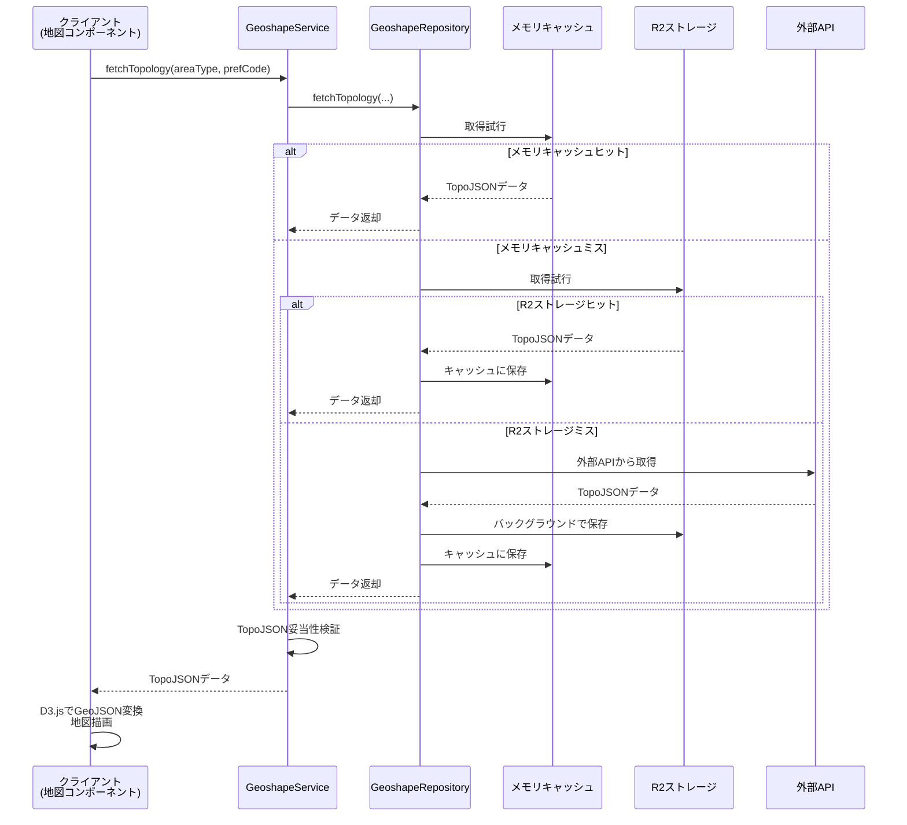

# Geoshape（地理データ管理）ドメイン設計

## 概要

Geoshape（地理データ管理）ドメインは、stats47 プロジェクトにおける日本の地理空間データ（歴史的行政区域データセットを含む）を管理する支援ドメインです。主な責務は、TopoJSON 形式の地理データを外部ソースから取得し、キャッシュを通じて効率的に提供することです。

### ビジネス価値

- **地理データの一元管理**: 日本の行政区域データを統一的に管理
- **高速データ配信**: キャッシュ戦略により地理データを高速に配信
- **データ提供元の適切な管理**: CC BY 4.0 ライセンスに基づいた出典表記の管理
- **効率的な解像度設計**: 都道府県は低解像度、市区町村は高解像度を固定で使用し、用途に応じた最適なバランスを実現

---

## 責務

1. **地理データの取得**: 外部 API（Geoshape API 等）から TopoJSON 形式のデータを取得
2. **キャッシュ管理**: 取得したデータを Cloudflare R2 などのストレージにキャッシュし、高速なデータ配信を実現
3. **データ提供**: アプリケーションの各機能（地図可視化など）に対して、要求された TopoJSON データを提供
4. **フォールバック戦略**: データ取得の信頼性を高めるため、メモリキャッシュ → R2 → 外部 API の順でフォールバック
5. **データソース表記管理**: データ提供元のライセンス（CC BY 4.0 等）に基づいた適切な出典表記を管理

### 技術的特徴

- **TopoJSON の直接利用**: クライアント側（D3.js）で GeoJSON に変換することを前提とし、サーバーは TopoJSON を直接扱う。これにより、データ転送量とサーバーサイドの処理負荷を削減
- **固定解像度**: 都道府県データは低解像度（`l`、~1MB）、市区町村データは高解像度（`h`、~15MB）を固定で使用。用途に応じた適切なバランスを実現
- **CDN による高速配信**: Cloudflare CDN を活用し、キャッシュされた地理データを高速に配信

---

## 目次

1. [責務](#責務)
2. [ドメインモデル](#ドメインモデル)
3. [アーキテクチャ設計](#アーキテクチャ設計)
4. [データソース仕様](#データソース仕様)
5. [主要機能](#主要機能)
6. [ドメインサービス](#ドメインサービス)
7. [パフォーマンス](#パフォーマンス)
8. [ベストプラクティス](#ベストプラクティス)
9. [制約と前提条件](#制約と前提条件)
10. [関連ドメイン](#関連ドメイン)

---

## 責務

1. **地理データの取得**: 外部 API（Geoshape API 等）から TopoJSON 形式のデータを取得
2. **キャッシュ管理**: 取得したデータを Cloudflare R2 などのストレージにキャッシュし、高速なデータ配信を実現
3. **データ提供**: アプリケーションの各機能（地図可視化など）に対して、要求された TopoJSON データを提供
4. **フォールバック戦略**: データ取得の信頼性を高めるため、メモリキャッシュ → R2 → 外部 API の順でフォールバック
5. **データソース表記管理**: データ提供元のライセンス（CC BY 4.0 等）に基づいた適切な出典表記を管理

---

## ドメインモデル

### 主要エンティティ

#### TopoJSONTopology（トポロジー）

地理データの TopoJSON 形式表現。

**属性**:

- `type`: "Topology"
- `objects`: ジオメトリオブジェクト
- `arcs`: アークデータ
- `transform`: 座標変換情報
- `bbox`: バウンディングボックス

**型定義**:

```typescript
interface TopoJSONTopology {
  type: "Topology";
  objects: Record<string, TopoJSONGeometryCollection>;
  arcs: number[][][];
  transform?: {
    scale: [number, number];
    translate: [number, number];
  };
  bbox?: [number, number, number, number];
}
```

#### PrefectureFeature（都道府県フィーチャー）

都道府県の地理的特徴を表現する GeoJSON Feature。

**属性**:

- `type`: "Feature"
- `properties.prefCode`: 都道府県コード（5 桁）
- `properties.prefName`: 都道府県名
- `geometry`: ジオメトリ情報

#### MunicipalityFeature（市区町村フィーチャー）

市区町村の地理的特徴を表現する GeoJSON Feature。

**属性**:

- `type`: "Feature"
- `properties.cityCode`: 市区町村コード（5 桁）
- `properties.cityName`: 市区町村名
- `properties.prefCode`: 都道府県コード
- `properties.prefName`: 都道府県名
- `geometry`: ジオメトリ情報

### 値オブジェクト

#### Resolution（解像度）

解像度レベルを表す値オブジェクト。

**値**: `l` (低解像度), `c` (中解像度), `h` (高解像度), `f` (完全解像度)

**使用方針**:
- 都道府県データ: 固定で `l`（低解像度）を使用
- 市区町村データ: 固定で `h`（高解像度）を使用

**推定サイズ**:

- `l`: ~1MB（都道府県データで使用）
- `c`: ~5MB（未使用）
- `h`: ~15MB（市区町村データで使用）
- `f`: ~50MB（未使用）

#### CityVersion（市区町村版タイプ）

市区町村データの版タイプを表現する値オブジェクト。

**値**: `merged` (統合版), `split` (分割版)

**責務**: 市区町村データのバージョン管理、用途に応じた適切な版の選択

#### DataSourceType（データソースタイプ）

データソースを表現する値オブジェクト。

**値**: `memory` (メモリキャッシュ), `r2` (R2 ストレージ), `external` (外部 API)

**責務**: データ取得元の識別、パフォーマンス追跡

---

## アーキテクチャ設計

### レイヤー構造

```
┌─────────────────────────────────────────┐
│     Presentation Layer                  │
│  (地図コンポーネント、D3.js)            │
└──────────────────┬──────────────────────┘
                   │
┌──────────────────▼──────────────────────┐
│     Service Layer                       │
│  (GeoshapeService)                      │
│  - fetchPrefectureTopology()            │
│  - fetchMunicipalityTopology()          │
└──────────────────┬──────────────────────┘
                   │
┌──────────────────▼──────────────────────┐
│     Repository Layer                    │
│  (GeoshapeRepository)                   │
│  - フォールバック戦略の制御             │
└──────┬───────────────┬──────────────────┘
       │               │
┌──────▼──────┐  ┌─────▼──────┐  ┌──────────────┐
│   Memory    │  │     R2     │  │  External    │
│   Cache     │  │  Storage   │  │     API      │
│ (24h TTL)   │  │ (Persistent)│  │  (Fallback)  │
└─────────────┘  └────────────┘  └──────────────┘
```

### データフロー

```
1. リクエスト: クライアント（地図コンポーネント）がGeoshapeServiceに地理データを要求
   ↓
2. メモリキャッシュチェック: インメモリキャッシュから取得を試みる
   ↓
3. R2ストレージチェック: メモリにない場合はR2から取得
   ↓
4. 外部API: R2にもない場合は外部APIから取得し、バックグラウンドでR2に保存
   ↓
5. データ提供: TopoJSONデータをクライアントに返す
   ↓
6. クライアント側変換: D3.jsがtopojson.feature()でGeoJSONに変換して描画
```

### データフロー詳細（フォールバック戦略）



### ディレクトリ構造

```
src/features/gis/geoshape/
├── services/
│   └── geoshape-service.ts       # ドメインサービス
├── repositories/
│   ├── geoshape-repository.ts    # データソースの抽象化とフォールバック
│   ├── external-data-source.ts   # 外部APIデータソース
│   └── r2-data-source.ts         # Cloudflare R2ストレージ
├── types/
│   └── index.ts                  # TopoJSON関連の型定義
├── utils/
│   ├── topojson-converter.ts     # TopoJSON変換ユーティリティ
│   └── area-code-converter.ts    # 地域コード変換ユーティリティ
└── config/
    └── geoshape-config.ts        # 設定ファイル
```

### 設計パターン

#### 1. Repository パターン

**目的**: データソースの抽象化とフォールバック戦略

**責務**:

- メモリキャッシュ、R2 ストレージ、外部 API の統一的なインターフェース
- フォールバック順序の管理（メモリ → R2 → 外部 API）
- データ取得結果の追跡

#### 2. Service Layer パターン

**目的**: ビジネスロジックの集約

**責務**:

- データ取得のビジネスロジック
- TopoJSON の妥当性検証
- 地域コードの自動判定

#### 3. フォールバック戦略

**目的**: データ取得の信頼性向上

**実装**:

- メモリキャッシュ（24 時間有効期限）
- R2 ストレージ（永続キャッシュ）
- 外部 API（Geoshape API）
- 各データソースの可用性チェック

---

## データソース仕様

### 提供元情報

- **データセット名**: 歴史的行政区域データセット β 版
- **提供者**: GeoNLP プロジェクト、ROIS-DS 人文学オープンデータ共同利用センター（CODH）
- **ライセンス**: CC BY 4.0
- **URL**: https://geoshape.ex.nii.ac.jp/

### API 仕様

**都道府県データのURL形式**:
```
https://geoshape.ex.nii.ac.jp/city/topojson/{YYYYMMDD}/jp_pref.l.topojson
```

**市区町村データのURL形式**:
- **政令指定都市分割版**: `https://geoshape.ex.nii.ac.jp/city/topojson/{YYYYMMDD}/{prefCode}/{prefCode}_city.h.topojson`
- **政令指定都市統合版**: `https://geoshape.ex.nii.ac.jp/city/topojson/{YYYYMMDD}/{prefCode}/{prefCode}_city_dc.h.topojson`

**パラメータ**:

- `YYYYMMDD`: 対象年度（例: `20230101`）
- `prefCode`: 都道府県コード（2桁、例: `01`, `13`, `40`）
- 都道府県データ: 固定で低解像度（`l`）を使用
- 市区町村データ: 固定で高解像度（`h`）を使用

### R2ストレージ構造

R2ストレージへのキャッシュは以下のディレクトリ構造で管理されます。詳細は [R2ストレージ設計ドキュメント](../04_インフラ設計/02_R2ストレージ設計.md#geoshape-ドメイン) を参照してください。

```
geoshape/
└── cache/
    └── 2023/                           # 年度
        ├── prefecture.topojson         # 都道府県データ（全国）
        └── municipality/               # 市区町村データ
            ├── 01.merged.topojson      # 北海道（統合版）
            ├── 01.split.topojson       # 北海道（分割版）
            ├── 13.merged.topojson      # 東京都（統合版）
            ├── 13.split.topojson       # 東京都（分割版）
            └── ...
```

**キー生成規則**:

- **都道府県**: `geoshape/cache/{year}/prefecture.topojson`
- **市区町村（統合版）**: `geoshape/cache/{year}/municipality/{prefCode}.merged.topojson`
- **市区町村（分割版）**: `geoshape/cache/{year}/municipality/{prefCode}.split.topojson`

**パラメータ**:

- `year`: 年度（例: `2023`）
- `prefCode`: 都道府県コード（2桁、例: `01`, `13`, `40`）

### 解像度仕様

| 解像度 | 説明       | 用途               | 推定サイズ |
| :----- | :--------- | :----------------- | :--------- |
| `l`    | 低解像度   | 概要表示、モバイル | ~1MB       |
| `c`    | 中解像度   | 標準表示           | ~5MB       |
| `h`    | 高解像度   | 詳細表示           | ~15MB      |
| `f`    | 完全解像度 | 最高品質           | ~50MB      |

---

## 主要機能

### 1. 都道府県データ取得

**機能**: 全国の都道府県の TopoJSON トポロジーを取得

**設計判断**:

- 1 ファイルで全国データを提供
- 低解像度（`l`）を固定で使用（ファイルサイズ約1MB）
- TopoJSON 形式で配信し、クライアントで GeoJSON に変換

**URL**: `https://geoshape.ex.nii.ac.jp/city/topojson/20230101/jp_pref.l.topojson`

### 2. 市区町村データ取得

**機能**: 指定された都道府県の市区町村 TopoJSON トポロジーを取得

**設計判断**:

- 都道府県ごとにファイルを分離（メモリ効率）
- 高解像度（`h`）を固定で使用（ファイルサイズ約15MB/都道府県）
- 統合版（`merged`）と分割版（`split`）を選択可能
- フォールバック戦略で信頼性を確保

**URL例**:
- 分割版: `https://geoshape.ex.nii.ac.jp/city/topojson/20230101/40/40_city.h.topojson`（福岡県）
- 統合版: `https://geoshape.ex.nii.ac.jp/city/topojson/20230101/40/40_city_dc.h.topojson`（福岡県）

### 3. 地域コードによる取得

**機能**: 地域コード（都道府県または市区町村）に基づいて TopoJSON トポロジーを取得

**設計判断**:

- 地域コードの形式から自動的に地域タイプを判定
- 都道府県データと市区町村データを透過的に扱う
- エラーハンドリングを統一的に実装

---

## ドメインサービス

### GeoshapeService

地理データの取得を統括するサービス。

**責務**:

- TopoJSON データの取得
- TopoJSON の妥当性検証
- 地域コードの自動判定
- データソース可用性のチェック

**主要機能**:

- 都道府県 TopoJSON の取得
- 市区町村 TopoJSON の取得
- 地域コードによる TopoJSON 取得
- データソース可用性チェック

### GeoshapeRepository

データソースの抽象化とフォールバック戦略を実装。

**責務**:

- メモリキャッシュの管理
- R2 ストレージとの連携
- 外部 API からのデータ取得
- フォールバック順序の制御

**主要機能**:

- TopoJSON データの取得（フォールバック付き）
- キャッシュの管理
- データソース可用性のチェック
- キャッシュステータスの取得

---

## パフォーマンス

### キャッシュ戦略

- **メモリキャッシュ**: 24 時間の有効期限、Map 構造で管理
- **R2 ストレージ**: 永続キャッシュ、CDN 配信で高速化
- **外部 API**: フォールバック用、取得後に R2 に自動保存

### データサイズ

| データタイプ     | 解像度 | サイズ  | 用途     |
| ---------------- | ------ | ------- | -------- |
| 都道府県（全国） | 低     | ~1MB    | 概要表示 |
| 市区町村（1 県） | 高     | ~15MB   | 詳細表示 |

### アクセスパターン

1. **都道府県データ**: 頻繁（国全体の表示）
2. **市区町村データ**: 中頻度（都道府県選択後の詳細表示）

---

## ベストプラクティス

### 1. TopoJSON の直接利用

- サーバー側では GeoJSON への変換を行わない
- クライアント側（D3.js）で `topojson.feature()` を使用して変換
- データ転送量とサーバー処理負荷を削減

### 2. フォールバック戦略

- メモリ → R2 → 外部 API の順で検索
- 外部 API から取得したデータはバックグラウンドで R2 に保存
- エラー時は自動的に次のデータソースへ

### 3. キャッシュ管理

- メモリキャッシュは 24 時間で無効化
- R2 ストレージは永続的に保持
- キャッシュヒット率の監視

### 4. データ出典表記

- CC BY 4.0 ライセンスに基づく適切な出典表記
- データ提供元情報の管理
- 利用規約の遵守

---

## 制約と前提条件

### 制約

1. **データ提供元への依存**: 外部 API（Geoshape API）の可用性に依存
2. **解像度の制限**: 4 段階の解像度レベル（l, c, h, f）のみ
3. **年度ごとのデータ**: データは年度ごとに区分（YYYYMMDD 形式）

### 前提条件

1. **外部 API の存在**: Geoshape API が利用可能であること
2. **R2 ストレージ**: Cloudflare R2 へのアクセス権限が必要
3. **TopoJSON 対応クライアント**: D3.js などの TopoJSON 対応ライブラリの利用を想定

---

## 関連ドメイン

- **Area ドメイン**: 地域コードと地理データを関連付け
- **Visualization ドメイン**: 本ドメインが提供する TopoJSON データを利用してコロプレス地図などを描画
