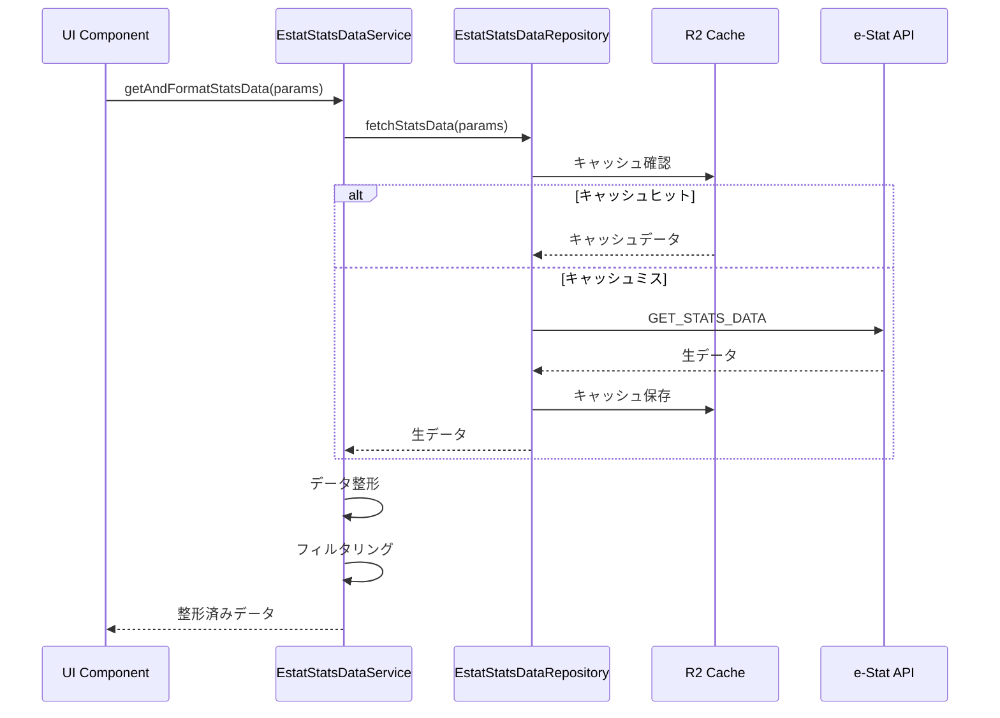

# eStat API 統計データ管理ドメイン設計

## 概要

eStat API 統計データ管理ドメインは、stats47 プロジェクトにおける e-Stat API の `GET_STATS_DATA` エンドポイントを通じた統計データ取得・整形・提供機能を担当する支援ドメインです。

### ビジネス価値

- **統計データの一元取得**: e-Stat API から統計データを統一的に取得
- **データ整形の標準化**: 多次元データを扱いやすい形式に変換
- **パフォーマンス最適化**: キャッシュとフィルタリングによる高速データ配信
- **UI連携**: ダッシュボードや可視化コンポーネントへのデータ提供

---

## 目次

1. [責務](#責務)
2. [ドメインモデル](#ドメインモデル)
3. [アーキテクチャ設計](#アーキテクチャ設計)
4. [API仕様](#api仕様)
5. [データ構造](#データ構造)
6. [主要機能](#主要機能)
7. [ドメインサービス](#ドメインサービス)
8. [パフォーマンス](#パフォーマンス)
9. [ベストプラクティス](#ベストプラクティス)
10. [制約と前提条件](#制約と前提条件)
11. [関連ドメイン](#関連ドメイン)
12. [将来の拡張計画](#将来の拡張計画)

---

## 責務

1. **統計データの取得**: e-Stat API の `GET_STATS_DATA` エンドポイントから統計データを取得
2. **データ整形**: 多次元データをアプリケーションが扱いやすい形式に変換
3. **フィルタリング**: 地域、年次、分類項目によるデータ絞り込み
4. **キャッシュ管理**: R2ストレージを活用したデータキャッシング
5. **エラーハンドリング**: API エラーやタイムアウトの適切な処理

---

## ドメインモデル

### 主要エンティティ

#### StatsData（統計データ）

e-Stat API から取得した統計データの表現。

**属性**:

- `statsDataId`: 統計表ID（8-10桁）
- `values`: 統計値の配列
- `metadata`: メタ情報（表情報、分類情報）
- `resultInfo`: 取得結果情報（件数、ページング情報）

**型定義**:

```typescript
interface StatsData {
  statsDataId: string;
  values: StatsValue[];
  metadata: StatsMetadata;
  resultInfo: ResultInfo;
}
```

#### StatsValue（統計値）

個別の統計値データ。

**属性**:

- `dimensions`: 多次元データの次元情報（地域、年次、分類など）
- `value`: 統計値（数値または文字列）

**型定義**:

```typescript
interface StatsValue {
  dimensions: {
    area?: string;    // 地域コード
    time?: string;    // 時間軸コード
    cat01?: string;   // 分類事項01
    // ... cat02-cat15
  };
  value: number | string | null;
}
```

### 値オブジェクト

#### StatsDataId（統計表ID）

統計表の一意識別子。

**制約**:

- 8-10桁の数字
- e-Stat API で登録されている統計表ID

#### AreaCode（地域コード）

統計データの地域を表すコード。

**形式**: 5桁の数字（例: `13000`=東京都、`13101`=千代田区）

---

## アーキテクチャ設計

### レイヤー構造

```
┌─────────────────────────────────────────┐
│     Presentation Layer                  │
│  (ダッシュボード、可視化コンポーネント)  │
└──────────────────┬──────────────────────┘
                   │
┌──────────────────▼──────────────────────┐
│     Service Layer                       │
│  (EstatStatsDataService)                │
│  - getAndFormatStatsData()              │
│  - getPrefectureDataByYear()            │
│  - formatStatsData()                    │
└──────────────────┬──────────────────────┘
                   │
┌──────────────────▼──────────────────────┐
│     Repository Layer                    │
│  (EstatStatsDataRepository)             │
│  - データ取得の抽象化                   │
│  - キャッシュ管理                       │
└──────┬───────────────┬──────────────────┘
       │               │
┌──────▼──────┐  ┌─────▼──────┐  ┌──────────────┐
│     e-Stat  │  │     R2     │  │   Memory     │
│     API     │  │  Storage   │  │    Cache     │
│  (External) │  │ (Persistent)│  │ (Temporary)  │
└─────────────┘  └────────────┘  └──────────────┘
```

### データフロー



### 設計パターン

#### 1. Service Layer パターン

**目的**: ビジネスロジックの集約

**責務**:

- データ取得のビジネスロジック
- データ整形とフォーマット変換
- フィルタリングとソート

#### 2. Repository パターン

**目的**: データソースの抽象化

**責務**:

- e-Stat API との通信
- キャッシュ管理（R2、メモリ）
- エラーハンドリングとリトライ

#### 3. Data Transfer Object (DTO) パターン

**目的**: APIレスポンスとドメインモデルの変換

**責務**:

- e-Stat API の複雑なレスポンス構造を簡潔なドメインモデルに変換
- データ整形と正規化

---

## API仕様

### エンドポイント

```
https://api.e-stat.go.jp/rest/3.0/app/json/getStatsData?<パラメータ>
```

### 主要パラメータ

| パラメータ名  | 必須 | 説明                   | 例            |
| ------------- | ---- | ---------------------- | ------------- |
| `appId`       | ○    | アプリケーション ID    | `YOUR_APP_ID` |
| `statsDataId` | △    | 統計表 ID（8-10 桁）   | `0003412313`  |
| `cdArea`      | -    | 地域コード             | `13000,27000` |
| `cdTime`      | -    | 時間軸コード           | `2023000000`  |
| `cdCat01-15`  | -    | 分類事項01-15の絞り込み | `001,002`     |
| `limit`       | -    | 取得件数（最大100,000）| `10000`       |
| `startPosition` | -  | 取得開始位置           | `1`           |

詳細は [e-Stat API 公式ドキュメント](https://www.e-stat.go.jp/api/api-info/api-spec) を参照してください。

---

## データ構造

### レスポンス構造

```typescript
interface GetStatsDataResponse {
  GET_STATS_DATA: {
    RESULT: {
      STATUS: number;
      ERROR_MSG?: string;
      DATE: string;
    };
    STATISTICAL_DATA: {
      RESULT_INF: {
        TOTAL_NUMBER: number;
        FROM_NUMBER: number;
        TO_NUMBER: number;
        NEXT_KEY?: number;
      };
      TABLE_INF: TableInfo;
      CLASS_INF: ClassInfo;
      DATA_INF: DataInfo;
    };
  };
}
```

### 主要な型定義

**TableInfo**: 統計表情報

**ClassInfo**: 分類情報（地域、年次、分類事項の定義）

**DataInfo**: 実際の数値データ

詳細な型定義は実装コードを参照してください。

---

## 主要機能

### 1. 統計データ取得

**機能**: e-Stat API から統計データを取得

**設計判断**:

- R2ストレージによるキャッシングでAPI呼び出しを削減
- ページング機能を活用して大量データを段階的に取得
- エラーハンドリングとリトライ機構を実装

### 2. データ整形

**機能**: 多次元データを扱いやすい形式に変換

**設計判断**:

- 地域情報の正規化（5桁コードの抽出）
- 分類情報の階層構造のフラット化
- NULL値と特殊文字の適切な処理

### 3. フィルタリング

**機能**: 地域、年次、分類項目によるデータ絞り込み

**設計判断**:

- APIパラメータレベルでのフィルタリング（サーバー側）
- 取得後データでのフィルタリング（クライアント側）
- 両方の方法をサポート

### 4. 時系列データ取得

**機能**: 特定地域・指標の時系列データを取得

**設計判断**:

- 時間軸コードの自動判定
- 最新年度データの取得（`cdTime=max`）
- 特定範囲の時系列データ取得

---

## ドメインサービス

### EstatStatsDataService

統計データの取得と整形を統括するサービス。

**責務**:

- 統計データの取得と整形
- フィルタリングとソート
- エラーハンドリング

**主要機能**:

- `getAndFormatStatsData()`: データ取得と整形を一括実行
- `getStatsDataRaw()`: 生データの取得
- `formatStatsData()`: データ整形のみ
- `getPrefectureDataByYear()`: 都道府県別年次データ取得

---

## パフォーマンス

### キャッシュ戦略

- **R2ストレージ**: 統計データの永続キャッシュ
- **メモリキャッシュ**: 頻繁にアクセスされるデータの一時キャッシュ
- **キャッシュキー**: パラメータのハッシュ値

### データ取得の最適化

- **limit パラメータ**: 必要な件数のみ取得（最大100,000件）
- **フィルタリング**: APIパラメータでの事前絞り込み
- **並列処理**: 複数統計表の同時取得

### データサイズ

| データタイプ        | サイズ      | 備考           |
| ------------------- | ----------- | -------------- |
| 都道府県データ      | ~10KB-1MB   | 統計表により異なる |
| 市区町村データ      | ~100KB-10MB | 統計表により異なる |
| 時系列データ        | ~50KB-5MB   | 年数により異なる   |

---

## ベストプラクティス

### 1. 必要なデータのみ取得

- `cdArea`、`cdTime`、`cdCat` パラメータで事前にフィルタリング
- `limit` パラメータで取得件数を制限

### 2. キャッシュの活用

- 頻繁にアクセスされるデータはキャッシュを活用
- キャッシュキーはパラメータを正確に反映

### 3. エラーハンドリング

- APIエラー時のリトライ機構の実装
- タイムアウト処理の適切な設定
- レート制限への対応

### 4. データ検証

- 取得データの妥当性チェック
- NULL値と特殊文字の適切な処理

---

## 制約と前提条件

### 制約

1. **APIレート制限**: e-Stat API のレート制限に準拠
2. **データサイズ**: 1回のリクエストで最大100,000件まで取得可能
3. **パラメータ制限**: 分類事項は最大15個（cdCat01-cdCat15）

### 前提条件

1. **APIキーの取得**: e-Stat API のアプリケーションIDが必要
2. **ネットワーク接続**: e-Stat API へのアクセス権限
3. **R2ストレージ**: キャッシュ用のR2ストレージへのアクセス権限

---

## 関連ドメイン

- **Estat API メタ情報ドメイン**: 統計表IDや分類情報の取得
- **Area ドメイン**: 地域コードの検証と変換
- **Ranking ドメイン**: 統計データをランキング形式に変換
- **Visualization ドメイン**: 統計データの可視化

---

## 将来の拡張計画

### データ更新の自動化

- **目標**: 統計データの定期更新機能
- **実装**: Cloudflare Workers によるスケジュール実行
- **優先度**: 中

### 高度なフィルタリング

- **目標**: 複合条件による柔軟なデータ絞り込み
- **実装**: クエリビルダーパターンの採用
- **優先度**: 低

### データ品質チェック

- **目標**: 取得データの自動検証
- **実装**: データバリデーション機能の追加
- **優先度**: 低

### パフォーマンス監視

- **目標**: API呼び出しとデータ取得のメトリクス収集
- **実装**: ログとメトリクスシステムの統合
- **優先度**: 低

---

## TODO

### 設計ドキュメント化の完了

- [ ] 実装詳細の別ドキュメントへの分離
- [ ] 実装ガイドドキュメントの作成
- [ ] テストガイドドキュメントの作成

### 機能拡張

- [ ] データ更新の自動化機能
- [ ] 高度なフィルタリング機能
- [ ] データ品質チェック機能
- [ ] パフォーマンス監視機能
