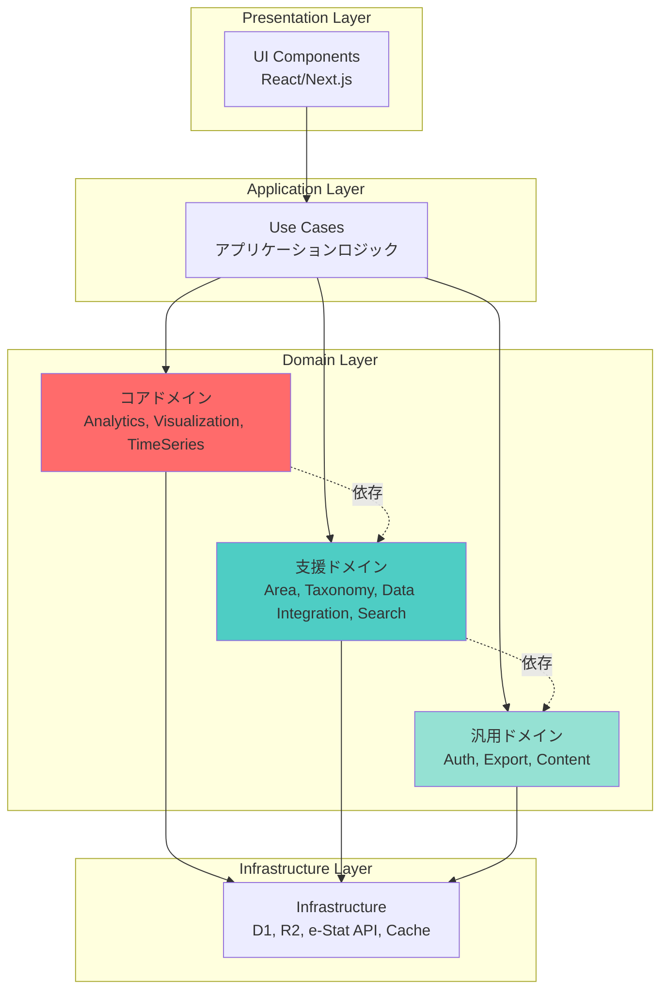

# ドメイン駆動設計によるドメイン分類設計書

## 目次

1. [概要](#概要)
2. [ドメイン分類](#ドメイン分類)
3. [推奨ディレクトリ構造](#推奨ディレクトリ構造)
4. [ドメイン間の依存関係](#ドメイン間の依存関係)
5. [DDD パターンの適用例](#ddドメイン設計パターンの適用例)
6. [移行戦略](#移行戦略)

---

## 概要

このドキュメントは、stats47 プロジェクトをドメイン駆動設計（Domain-Driven Design, DDD）の原則に基づいて再構成するためのドメイン分類を定義します。

### DDD の主要な利点

- **ビジネスロジックの明確化**: ドメイン知識がコードに反映される
- **保守性の向上**: 関心の分離により変更が局所化される
- **拡張性**: 新しいドメインの追加が容易
- **テスタビリティ**: ドメインロジックが独立してテスト可能
- **チーム開発**: ドメインごとに担当を分けやすい

### ユビキタス言語

プロジェクト内で統一された用語を使用することで、開発者とドメインエキスパート間のコミュニケーションを円滑にします。

---

## ドメイン分類

ドメイン駆動設計では、ドメインを以下の 3 つのカテゴリーに分類します：

1. **コアドメイン（Core Domain）**: ビジネスの競争優位性を生み出す中核機能
2. **支援ドメイン（Supporting Domain）**: コアドメインを支える重要機能
3. **汎用ドメイン（Generic Domain）**: 標準的な機能（既製品で代替可能）

---

### ドメイン全体像

| ドメイン名 | 分類 | 責務 |
|-----------|------|------|
| Analytics | コアドメイン | ランキング計算、比較分析、傾向分析、統計サマリー生成、地域プロファイル生成、地域の強み検出、類似地域検出 |
| TimeSeries Analysis | コアドメイン | 複数年度データの取得・管理、CAGR計算、トレンドライン計算、前年比・前年同期比計算、時系列グラフ生成、複数地域の時系列比較 |
| Visualization | コアドメイン | 地図表示（コロプレスマップ）、グラフ生成、チャート設定管理、色スケール管理、凡例生成、歴史的行政区域データの管理、データソース表記の生成 |
| Area Management | 支援ドメイン | 都道府県・市区町村の階層構造管理、地域コードの検証と変換、地理形状データ管理、地域検索・フィルタリング、歴史的行政区域の変遷管理 |
| Taxonomy Management | 支援ドメイン | 分類体系の管理（カテゴリ・タグ・メタデータ）、階層構造とフラット構造の統合管理、ナビゲーション機能、複合フィルタリング、分類ベース検索 |
| Data Integration | 支援ドメイン | 外部API（e-Stat、World Bank、OECD等）との統合、データ取得・変換・正規化、APIパラメータマッピング、キャッシュ管理（R2/D1）、データ品質管理 |
| Search | 支援ドメイン | 全文検索エンジン、検索インデックス管理、検索演算子処理、オートコンプリート、サジェスト機能、検索履歴管理、ファセット検索、スペルチェック |
| Authentication & Authorization | 汎用ドメイン | ユーザー認証、セッション管理、権限制御、ロール管理 |
| Export | 汎用ドメイン | CSV/Excel/PDF出力、フォーマット変換、ダウンロード管理、エクスポートジョブ管理 |
| Content Management | 汎用ドメイン | ブログ記事管理、MDXコンテンツ処理、関連記事生成、SEO最適化 |

### レイヤー構造



---

## 1. コアドメイン（Core Domain）

### 🎯 統計分析ドメイン（Analytics Domain）

ビジネスの中核価値を提供する最も重要なドメイン。

#### 責務

- ランキング計算
- 比較分析
- 傾向分析
- 統計サマリー生成
- データ品質評価
- 地域プロファイル生成
- 地域の強み検出
- 類似地域検出

#### 主要エンティティ

- **RankingItem**（ランキング項目）

  - `rankingKey`: ランキングの一意識別子
  - `label`: 表示用ラベル
  - `unit`: 単位
  - `dataSource`: データソース

- **RankingValue**（ランキング値）

  - `areaCode`: 地域コード
  - `value`: 値
  - `rank`: 順位
  - `percentile`: パーセンタイル

- **StatisticalAnalysis**（統計分析結果）

  - `mean`: 平均値
  - `median`: 中央値
  - `stdDev`: 標準偏差
  - `min/max`: 最小値/最大値

- **Comparison**（比較データ）
  - `baseValue`: 基準値
  - `comparisonValue`: 比較対象値
  - `difference`: 差分
  - `ratio`: 比率

- **RegionProfile**（地域プロファイル）

  - `areaCode`: 地域コード
  - `basicInfo`: 基本情報
  - `keyIndicators`: 主要指標リスト
  - `strengths`: 強み（トップ10ランキング項目）
  - `radarData`: レーダーチャート用データ
  - `similarRegions`: 類似地域リスト

- **RegionStrength**（地域の強み）

  - `indicator`: 統計指標
  - `rank`: 順位
  - `value`: 値
  - `nationalAvg`: 全国平均
  - `percentile`: パーセンタイル

- **SimilarRegion**（類似地域）

  - `areaCode`: 地域コード
  - `similarityScore`: 類似度スコア
  - `calculationMethod`: 計算方法（ユークリッド距離/コサイン類似度）

#### 境界づけられたコンテキスト

データの取得から分析、ランキング生成までの一連の処理。

#### 現在の配置

`src/lib/ranking/`

#### 提案される構造

```
src/domain/analytics/
├── ranking/
│   ├── entities/
│   │   ├── RankingItem.ts
│   │   └── RankingValue.ts
│   ├── value-objects/
│   │   ├── RankingKey.ts
│   │   ├── Rank.ts
│   │   └── Percentile.ts
│   ├── services/
│   │   ├── RankingCalculationService.ts
│   │   └── RankingComparisonService.ts
│   ├── repositories/
│   │   └── RankingRepository.ts
│   └── aggregates/
│       └── RankingAggregate.ts
├── comparison/
│   ├── entities/
│   │   └── ComparisonResult.ts
│   └── services/
│       └── ComparisonService.ts
├── trend-analysis/
│   ├── entities/
│   │   └── Trend.ts
│   └── services/
│       └── TrendAnalysisService.ts
├── statistics/
│   ├── value-objects/
│   │   ├── Mean.ts
│   │   ├── Median.ts
│   │   └── StandardDeviation.ts
│   └── services/
│       └── StatisticsCalculationService.ts
└── region-profile/
    ├── entities/
    │   ├── RegionProfile.ts
    │   ├── RegionStrength.ts
    │   └── SimilarRegion.ts
    ├── value-objects/
    │   ├── SimilarityScore.ts
    │   └── StrengthThreshold.ts
    ├── services/
    │   ├── RegionProfileService.ts
    │   ├── StrengthDetectionService.ts
    │   └── SimilarityCalculationService.ts
    └── repositories/
        └── RegionProfileRepository.ts
```

---

### 📈 時系列分析ドメイン（TimeSeries Analysis Domain）

時系列データの分析と可視化を担当するコアドメイン。

#### 責務

- 複数年度データの取得・管理
- CAGR（年平均成長率）計算
- トレンドライン計算（線形回帰、移動平均）
- 前年比・前年同期比計算
- 時系列グラフ生成
- 複数地域の時系列比較

#### 主要エンティティ

- **TimeSeriesData**（時系列データ）

  - `indicatorId`: 統計指標 ID
  - `areaCode`: 地域コード
  - `year`: 年度
  - `value`: 値
  - `metadata`: メタデータ

- **TrendAnalysis**（トレンド分析）

  - `trendType`: トレンドタイプ（線形回帰、移動平均）
  - `equation`: 回帰式
  - `rSquared`: 決定係数
  - `slope`: 傾き
  - `intercept`: 切片

- **CAGRCalculation**（CAGR 計算）

  - `startValue`: 開始値
  - `endValue`: 終了値
  - `years`: 年数
  - `cagr`: CAGR 値
  - `isValid`: 有効性

- **YearOverYearChange**（前年比）

  - `currentYear`: 当年
  - `previousYear`: 前年
  - `changeRate`: 変化率
  - `changeValue`: 変化量

#### 境界づけられたコンテキスト

時系列データの分析に関するすべての処理。

#### 現在の配置

`src/lib/time-series/`

#### 提案される構造

```
src/domain/time-series/
├── entities/
│   ├── TimeSeriesData.ts
│   ├── TrendAnalysis.ts
│   ├── CAGRCalculation.ts
│   └── YearOverYearChange.ts
├── value-objects/
│   ├── TimePeriod.ts
│   ├── CAGR.ts
│   ├── TrendType.ts
│   └── ChangeRate.ts
├── services/
│   ├── TimeSeriesService.ts
│   ├── TrendCalculationService.ts
│   ├── CAGRCalculationService.ts
│   └── YearOverYearService.ts
├── repositories/
│   └── TimeSeriesRepository.ts
└── aggregates/
    └── TimeSeriesAggregate.ts
```

---

### 🗺️ 可視化ドメイン（Visualization Domain）

統計データの視覚表現を担当するコアドメイン。

#### 責務

- 地図表示（コロプレスマップ）
- グラフ生成（折れ線、棒、円グラフ）
- チャート設定管理
- レスポンシブ表示
- 色スケール管理
- 凡例生成
- 時系列グラフ生成
- インタラクティブ地図
- 歴史的行政区域データの管理
- データソース表記の生成
- 年度別地理データの管理

#### 主要エンティティ

- **ChoroplethMap**（コロプレスマップ）

  - `geoData`: 地理データ（TopoJSON）
  - `values`: 値データ
  - `colorScale`: 色スケール
  - `legend`: 凡例設定
  - `classificationMethod`: 分類方法（等間隔、分位数、自然分類）
  - `interactiveOptions`: インタラクティブ設定

- **ChartConfiguration**（チャート設定）

  - `chartType`: チャートタイプ
  - `dataSource`: データソース
  - `displayOptions`: 表示オプション

- **VisualizationOption**（可視化オプション）

  - `colorScheme`: 配色（Sequential、Diverging）
  - `labelFormat`: ラベル形式
  - `tooltipFormat`: ツールチップ形式

- **GeoShape**（地理形状）

  - `areaCode`: 市区町村 ID（歴史的行政区域データセット）
  - `standardAreaCode`: 標準地域コード（e-Stat 対応）
  - `areaName`: 地域名
  - `areaType`: 地域タイプ（prefecture/municipality）
  - `year`: 適用年度（歴史的データの場合）
  - `topoJson`: TopoJSON データ
  - `boundingBox`: バウンディングボックス
  - `representativePoint`: 代表点（{lat, lng}）
  - `properties`: 地理的プロパティ（人口、面積等）
  - `dataSource`: データソース（'geoshape_codh'/'ksj'）
  - `dataVersion`: データバージョン
  - `lastUpdated`: データ更新日
  - `resolution`: 解像度（'low'/'medium'/'high'/'full'）
  - `cacheKey`: R2 キャッシュキー
  - `fetchUrl`: Geoshape API URL

- **DataSourceAttribution**（データソース表記）

  - `source`: データソース名
  - `attribution`: 表記文字列
  - `license`: ライセンス（CC BY 4.0）
  - `url`: データソース URL
  - `doi`: DOI 識別子（例：doi:10.20676/00000447）
  - `publisher`: 発行者（CODH 作成）

- **ColorScale**（色スケール）

  - `type`: スケールタイプ（Sequential、Diverging）
  - `colors`: 色配列
  - `domain`: 値の範囲
  - `range`: 色の範囲

- **BasemapType**（ベースマップタイプ）

  - `type`: ベースマップタイプ（'std'/'pale'/'blank'/'photo'）
  - `url`: タイル URL
  - `attribution`: 出典表示文字列
  - `maxZoom`: 最大ズームレベル
  - `name`: 表示名（標準地図、淡色地図等）
  - `icon`: アイコン（絵文字）

#### 境界づけられたコンテキスト

データの視覚表現に関するすべての処理。

#### 現在の配置

`src/components/organisms/visualization/`

#### 提案される構造

```
src/domain/visualization/
├── map/
│   ├── choropleth/
│   │   ├── entities/
│   │   │   ├── ChoroplethMap.ts
│   │   │   ├── GeoShape.ts          # ← 拡張
│   │   │   ├── ColorScale.ts
│   │   │   └── DataSourceAttribution.ts  # ← 新規追加
│   │   ├── value-objects/
│   │   │   ├── ColorScheme.ts
│   │   │   ├── ClassificationMethod.ts
│   │   │   ├── Legend.ts
│   │   │   ├── DataSource.ts        # ← 新規追加
│   │   │   ├── YearRange.ts         # ← 新規追加（時系列対応）
│   │   │   ├── Resolution.ts        # ← 新規追加（解像度管理）
│   │   │   ├── CacheKey.ts          # ← 新規追加（キャッシュ管理）
│   │   │   └── BasemapType.ts       # ← 新規追加（ベースマップ管理）
│   │   ├── services/
│   │   │   ├── ChoroplethRenderService.ts
│   │   │   ├── ColorScaleService.ts
│   │   │   ├── ClassificationService.ts
│   │   │   ├── AttributionService.ts  # ← 新規追加
│   │   │   ├── GeoshapeFetchService.ts # ← 新規追加（Geoshape API取得）
│   │   │   ├── CacheService.ts         # ← 新規追加（R2キャッシュ管理）
│   │   │   └── BasemapService.ts       # ← 新規追加（ベースマップ管理）
│   │   └── repositories/
│   │       └── GeoShapeRepository.ts  # ← 拡張
│   └── geoshape/
│       ├── entities/
│       │   └── HistoricalGeoShape.ts  # ← 新規追加（時系列用）
│       └── repositories/
│           └── GeoShapeRepository.ts
├── chart/
│   ├── time-series/
│   │   ├── entities/
│   │   │   ├── LineChart.ts
│   │   │   └── TrendLine.ts
│   │   └── services/
│   │       └── TimeSeriesChartService.ts
│   ├── bar-chart/
│   │   └── entities/
│   │       └── BarChart.ts
│   └── recharts/
│       └── adapters/
│           └── RechartsAdapter.ts
└── dashboard/
    ├── layout/
    │   ├── entities/
    │   │   └── DashboardLayout.ts
    │   └── services/
    │       └── LayoutService.ts
    └── widgets/
        └── entities/
            └── Widget.ts
```

---

## 2. 支援ドメイン（Supporting Domain）

### 🌏 地域管理ドメイン（Area Management Domain）

日本の行政区画の階層構造と地理データを管理する支援ドメイン。

#### 責務

- 都道府県・市区町村の階層構造管理
- 地域コードの検証と変換
- 地理形状データ（GeoJSON/TopoJSON）管理
- 地域検索・フィルタリング
- 市区町村 ID と標準地域コードのマッピング管理
- 歴史的行政区域の変遷管理
- データソース別の地理データ管理

#### 主要エンティティ

- **Prefecture**（都道府県）

  - `code`: 都道府県コード（5 桁）
  - `name`: 都道府県名
  - `region`: 地方区分
  - `municipalities`: 所属市区町村のリスト

- **Municipality**（市区町村）

  - `code`: 市区町村コード（5 桁）
  - `name`: 市区町村名
  - `prefectureCode`: 所属都道府県コード
  - `type`: 市区町村タイプ（市/町/村/特別区）

- **AreaHierarchy**（地域階層）

  - `level`: 階層レベル（国/地方/都道府県/市区町村）
  - `parent`: 親地域
  - `children`: 子地域のリスト

- **GeoShape**（地理形状データ）

  - `areaCode`: 地域コード
  - `geoJson`: GeoJSON データ
  - `boundingBox`: バウンディングボックス

- **AreaCodeMapping**（地域コードマッピング）

  - `municipalityId`: 市区町村 ID（歴史的行政区域データセット）
  - `standardAreaCode`: 標準地域コード（e-Stat）
  - `name`: 地域名
  - `prefectureName`: 都道府県名
  - `validFrom`: 有効開始日
  - `validTo`: 有効終了日

- **HistoricalArea**（歴史的行政区域）

  - `areaCode`: 地域コード
  - `name`: 地域名
  - `year`: 年度
  - `parentAreaCode`: 親地域コード
  - `changes`: 変更履歴（合併、分割等）

#### 境界づけられたコンテキスト

日本の行政区画に関するすべての情報と操作。

#### 現在の配置

`src/lib/area/`

#### 提案される構造

```
src/domain/area/
├── entities/
│   ├── Prefecture.ts
│   ├── Municipality.ts
│   ├── AreaHierarchy.ts
│   ├── GeoShape.ts
│   ├── AreaCodeMapping.ts        # ← 新規追加
│   └── HistoricalArea.ts         # ← 新規追加
├── value-objects/
│   ├── AreaCode.ts
│   ├── AreaLevel.ts
│   ├── AreaType.ts
│   ├── Region.ts
│   ├── MunicipalityId.ts         # ← 新規追加
│   └── StandardAreaCode.ts       # ← 新規追加
├── services/
│   ├── AreaService.ts
│   ├── AreaHierarchyService.ts
│   ├── GeoShapeService.ts
│   ├── AreaCodeMappingService.ts  # ← 新規追加
│   └── HistoricalAreaService.ts   # ← 新規追加
├── repositories/
│   ├── AreaRepository.ts
│   ├── GeoShapeRepository.ts
│   ├── AreaCodeMappingRepository.ts  # ← 新規追加
│   └── HistoricalAreaRepository.ts   # ← 新規追加
└── specifications/
    ├── PrefectureSpecification.ts
    └── MunicipalitySpecification.ts
```

---

### 📊 分類体系管理ドメイン（Taxonomy Management Domain）

統計データの分類体系を管理する支援ドメイン。

#### 責務

- 分類体系の管理（カテゴリ・タグ・メタデータ）
- 階層構造とフラット構造の統合管理
- ナビゲーション機能
- 表示順序の管理
- 複合フィルタリング
- 分類ベース検索

#### 主要エンティティ

- **Category**（カテゴリ）

  - `id`: カテゴリ ID
  - `name`: カテゴリ名
  - `icon`: アイコン
  - `color`: テーマカラー
  - `displayOrder`: 表示順序
  - `subcategories`: サブカテゴリのリスト

- **Subcategory**（サブカテゴリ）

  - `id`: サブカテゴリ ID
  - `name`: サブカテゴリ名
  - `categoryId`: 所属カテゴリ ID
  - `displayOrder`: 表示順序
  - `dashboardComponent`: ダッシュボードコンポーネント

- **CategoryHierarchy**（カテゴリ階層）
  - `root`: ルートカテゴリ
  - `depth`: 階層の深さ

- **Tag**（タグ）

  - `id`: タグID
  - `name`: タグ名
  - `slug`: URLスラッグ
  - `usageCount`: 使用回数
  - `relatedTags`: 関連タグ

- **TagCloud**（タグクラウド）

  - `tags`: タグリスト
  - `weights`: 重み付け
  - `maxSize`: 最大サイズ
  - `minSize`: 最小サイズ

- **FilterCriteria**（フィルタ条件）

  - `categoryId`: カテゴリID
  - `tags`: タグリスト
  - `areaCode`: 地域コード
  - `dateRange`: 期間範囲

#### 境界づけられたコンテキスト

統計データの分類に関するすべての情報。

#### 現在の配置

`src/lib/category/`

#### 提案される構造

```
src/domain/taxonomy/
├── entities/
│   ├── Category.ts
│   ├── Subcategory.ts
│   ├── CategoryHierarchy.ts
│   ├── Tag.ts
│   ├── TagCloud.ts
│   └── FilterCriteria.ts
├── value-objects/
│   ├── CategoryId.ts
│   ├── DisplayOrder.ts
│   ├── CategoryIcon.ts
│   ├── TagId.ts
│   └── TagWeight.ts
├── services/
│   ├── CategoryService.ts
│   ├── NavigationService.ts
│   ├── HierarchyService.ts
│   ├── TagService.ts
│   ├── TagCloudService.ts
│   └── FilteringService.ts
└── repositories/
    ├── CategoryRepository.ts
    └── TagRepository.ts
```

---

### 🔗 データ統合ドメイン（Data Integration Domain）

外部データソースとの統合を担当する支援ドメイン。

#### 責務

- 外部 API（e-Stat、World Bank、OECD 等）との統合
- データ取得・変換・正規化
- API パラメータマッピング
- キャッシュ管理（R2/D1）
- データ品質管理

#### 主要エンティティ

- **DataSource**（データソース）

  - `id`: データソース ID
  - `name`: データソース名
  - `type`: データソースタイプ（API/Database/File）
  - `endpoint`: エンドポイント URL
  - `authentication`: 認証情報

- **DataAdapter**（データアダプター）

  - `sourceId`: データソース ID
  - `transformRules`: 変換ルール
  - `mappingConfig`: マッピング設定

- **ApiParameter**（API パラメータ）

  - `rankingKey`: ランキングキー
  - `timeCode`: 時間コード
  - `params`: パラメータのマップ

- **CacheEntry**（キャッシュエントリ）

  - `key`: キャッシュキー
  - `data`: キャッシュデータ
  - `ttl`: 有効期限
  - `lastUpdated`: 最終更新日時
  - `metadata`: メタデータ（API 種別、パラメータ等）
  - `size`: データサイズ
  - `hitCount`: ヒット回数

- **CacheStatistics**（キャッシュ統計）
  - `totalRequests`: 総リクエスト数
  - `hitCount`: ヒット数
  - `missCount`: ミス数
  - `hitRate`: ヒット率
  - `averageResponseTime`: 平均応答時間
  - `cacheSize`: キャッシュサイズ

#### 境界づけられたコンテキスト

外部データソースとの連携に関するすべての処理。

#### 現在の配置

`src/lib/estat-api/`, `src/lib/database/`

#### 提案される構造

```
src/domain/data-integration/
├── estat-api/
│   ├── adapters/
│   │   ├── EstatRankingAdapter.ts
│   │   └── EstatMetaInfoAdapter.ts
│   ├── entities/
│   │   ├── EstatMetaInfo.ts
│   │   ├── EstatStatsData.ts
│   │   └── EstatStatsList.ts
│   ├── value-objects/
│   │   ├── StatsDataId.ts
│   │   └── ApiParameter.ts
│   ├── services/
│   │   ├── MetaInfoService.ts
│   │   ├── StatsDataService.ts
│   │   ├── StatsListService.ts
│   │   ├── ApiParamsService.ts
│   │   ├── EstatCacheService.ts
│   │   ├── GeoshapeCacheService.ts
│   │   ├── CacheInvalidationService.ts
│   │   └── CacheStatsService.ts
│   └── repositories/
│       └── EstatRepository.ts
├── world-bank/              # 将来の拡張
│   └── adapters/
├── oecd/                    # 将来の拡張
│   └── adapters/
└── cache/
    ├── entities/
    │   └── CacheEntry.ts
    ├── services/
    │   ├── R2CacheService.ts
    │   └── D1CacheService.ts
    └── repositories/
        └── CacheRepository.ts
```

#### データソース管理のベストプラクティス

##### 7. e-Stat API キャッシュパターン

```typescript
// EstatCacheService の実装例
export class EstatCacheService {
  private readonly r2Client: R2Client;
  private readonly d1Client: D1Client;

  async getCachedResponse(
    apiType: "getMetaInfo" | "getStatsData" | "getStatsList",
    parameters: Record<string, any>
  ): Promise<any> {
    const cacheKey = this.generateCacheKey(apiType, parameters);

    // R2からキャッシュを確認
    const cached = await this.r2Client.get(cacheKey);
    if (cached) {
      // ヒット統計を更新
      await this.updateHitStats(cacheKey);
      return JSON.parse(cached);
    }

    // e-Stat APIを呼び出し
    const response = await this.callEstatApi(apiType, parameters);

    // R2にキャッシュ保存
    await this.r2Client.put(cacheKey, JSON.stringify(response), {
      metadata: {
        ttl: this.getTtlForApiType(apiType),
        createdAt: new Date().toISOString(),
        apiType,
        parameters: JSON.stringify(parameters),
        size: JSON.stringify(response).length,
      },
    });

    // D1にメタデータ保存
    await this.saveCacheMetadata(cacheKey, apiType, parameters);

    return response;
  }

  private generateCacheKey(
    apiType: string,
    parameters: Record<string, any>
  ): string {
    const paramHash = crypto
      .createHash("sha256")
      .update(JSON.stringify(parameters))
      .digest("hex")
      .substring(0, 12);

    return `estat:${apiType}:${paramHash}`;
  }

  private getTtlForApiType(apiType: string): number {
    const ttlMap = {
      getMetaInfo: 7 * 24 * 60 * 60, // 7日
      getStatsData: 24 * 60 * 60, // 24時間
      getStatsList: 7 * 24 * 60 * 60, // 7日
    };
    return ttlMap[apiType] || 24 * 60 * 60;
  }
}
```

##### 8. キャッシュ無効化戦略

```typescript
// CacheInvalidationService の実装例
export class CacheInvalidationService {
  async invalidateByPattern(pattern: string): Promise<void> {
    // R2のキー一覧を取得
    const keys = await this.r2Client.list({ prefix: pattern });

    // バッチで削除
    const deletePromises = keys.objects.map((obj) =>
      this.r2Client.delete(obj.key)
    );

    await Promise.all(deletePromises);

    // D1のメタデータも削除
    await this.d1Client
      .prepare("DELETE FROM cache_metadata WHERE cache_key LIKE ?")
      .bind(`${pattern}%`)
      .run();
  }

  async invalidateByApiType(apiType: string): Promise<void> {
    await this.invalidateByPattern(`estat:${apiType}:`);
  }

  async invalidateExpired(): Promise<void> {
    const expiredKeys = await this.d1Client
      .prepare(
        `
        SELECT cache_key FROM cache_metadata 
        WHERE expires_at < datetime('now')
      `
      )
      .all();

    for (const row of expiredKeys.results) {
      await this.r2Client.delete(row.cache_key);
    }

    // メタデータも削除
    await this.d1Client
      .prepare('DELETE FROM cache_metadata WHERE expires_at < datetime("now")')
      .run();
  }
}
```

##### 9. TTL 管理とバージョン管理

```typescript
// TTL管理の実装例
export class TTLManager {
  private readonly ttlConfig = {
    "estat:getMetaInfo": 7 * 24 * 60 * 60, // 7日
    "estat:getStatsData": 24 * 60 * 60, // 24時間
    "estat:getStatsList": 7 * 24 * 60 * 60, // 7日
    "geo:topojson": 7 * 24 * 60 * 60, // 7日
    "calc:cagr": 6 * 60 * 60, // 6時間
    "calc:correlation": 6 * 60 * 60, // 6時間
  };

  getTTL(cacheKey: string): number {
    for (const [pattern, ttl] of Object.entries(this.ttlConfig)) {
      if (cacheKey.startsWith(pattern)) {
        return ttl;
      }
    }
    return 24 * 60 * 60; // デフォルト24時間
  }

  async updateTTL(cacheKey: string, newTTL: number): Promise<void> {
    await this.d1Client
      .prepare(
        `
        UPDATE cache_metadata 
        SET ttl = ?, expires_at = datetime('now', '+' || ? || ' seconds')
        WHERE cache_key = ?
      `
      )
      .bind(newTTL, newTTL, cacheKey)
      .run();
  }
}
```

---

### 🔍 検索ドメイン（Search Domain）

全コンテンツを横断する高度な検索機能を担当する支援ドメイン。

#### 責務

- 全文検索エンジン
- 検索インデックス管理
- 検索演算子処理（AND/OR/NOT/フレーズ/ワイルドカード）
- オートコンプリート
- サジェスト機能
- 検索履歴管理
- ファセット検索
- スペルチェック

#### 主要エンティティ

- **SearchQuery**（検索クエリ）

  - `query`: 検索文字列
  - `filters`: フィルタ条件
  - `operators`: 検索演算子
  - `options`: 検索オプション

- **SearchResult**（検索結果）

  - `items`: 検索結果アイテム
  - `totalCount`: 総件数
  - `facets`: ファセット情報
  - `suggestions`: サジェスト
  - `highlightedText`: ハイライトされたテキスト

- **SearchIndex**（検索インデックス）

  - `contentType`: コンテンツタイプ
  - `indexedFields`: インデックス化されたフィールド
  - `lastUpdated`: 最終更新日時
  - `documentCount`: ドキュメント数

- **SearchHistory**（検索履歴）

  - `userId`: ユーザーID（オプション）
  - `query`: 検索クエリ
  - `timestamp`: タイムスタンプ
  - `resultCount`: 結果件数

- **AutoCompleteResult**（オートコンプリート結果）

  - `suggestions`: 候補リスト
  - `score`: スコア
  - `type`: 候補タイプ

#### 境界づけられたコンテキスト

全コンテンツの検索に関するすべての処理。

#### 現在の配置

新規実装（Phase 2）

#### 提案される構造

```
src/domain/search/
├── entities/
│   ├── SearchQuery.ts
│   ├── SearchResult.ts
│   ├── SearchIndex.ts
│   ├── SearchHistory.ts
│   └── AutoCompleteResult.ts
├── value-objects/
│   ├── SearchOperator.ts
│   ├── ContentType.ts
│   ├── SearchScore.ts
│   └── QueryString.ts
├── services/
│   ├── FullTextSearchService.ts
│   ├── AutoCompleteService.ts
│   ├── SearchHistoryService.ts
│   ├── FacetSearchService.ts
│   ├── SpellCheckService.ts
│   └── SearchIndexService.ts
└── repositories/
    ├── SearchIndexRepository.ts
    └── SearchHistoryRepository.ts
```

---

## 3. 汎用ドメイン（Generic Domain）

### 🔐 認証・認可ドメイン（Authentication & Authorization Domain）

ユーザー認証とアクセス制御を担当する汎用ドメイン。

#### 責務

- ユーザー認証
- セッション管理
- 権限制御
- ロール管理

#### 主要エンティティ

- **User**（ユーザー）

  - `id`: ユーザー ID
  - `email`: メールアドレス
  - `name`: ユーザー名
  - `roles`: ロールのリスト

- **Session**（セッション）

  - `sessionId`: セッション ID
  - `userId`: ユーザー ID
  - `expiresAt`: 有効期限

- **Role**（役割）

  - `name`: ロール名
  - `permissions`: 権限のリスト

- **Permission**（権限）
  - `resource`: リソース
  - `action`: アクション（read/write/delete）

#### 現在の配置

`src/lib/auth/`

#### 提案される構造

```
src/domain/auth/
├── entities/
│   ├── User.ts
│   ├── Session.ts
│   ├── Role.ts
│   └── Permission.ts
├── value-objects/
│   ├── UserId.ts
│   ├── Email.ts
│   └── Password.ts
├── services/
│   ├── AuthService.ts
│   ├── SessionService.ts
│   └── PermissionService.ts
└── repositories/
    ├── UserRepository.ts
    └── SessionRepository.ts
```

---

### 📤 エクスポートドメイン（Export Domain）

データのエクスポート機能を担当する汎用ドメイン。

#### 責務

- CSV/Excel/PDF 出力
- フォーマット変換
- ダウンロード管理
- エクスポートジョブ管理

#### 主要エンティティ

- **ExportFormat**（エクスポート形式）

  - `type`: フォーマットタイプ（CSV/Excel/PDF）
  - `options`: フォーマットオプション

- **ExportJob**（エクスポートジョブ）

  - `jobId`: ジョブ ID
  - `format`: エクスポート形式
  - `data`: エクスポート対象データ
  - `status`: ジョブステータス

- **ExportConfiguration**（エクスポート設定）
  - `columns`: エクスポート列
  - `filters`: フィルタ条件
  - `sorting`: ソート順序

#### 現在の配置

`src/lib/export/`

#### 提案される構造

```
src/domain/export/
├── entities/
│   ├── ExportJob.ts
│   └── ExportConfiguration.ts
├── value-objects/
│   └── ExportFormat.ts
├── formats/
│   ├── csv/
│   │   └── CsvExporter.ts
│   ├── excel/
│   │   └── ExcelExporter.ts
│   └── pdf/
│       └── PdfExporter.ts
├── services/
│   ├── ExportService.ts
│   └── ExportJobService.ts
└── converters/
    ├── DataConverter.ts
    └── FormatConverter.ts
```

---

### 📝 コンテンツ管理ドメイン（Content Management Domain）

ブログ記事や MDX コンテンツを管理する汎用ドメイン。

#### 責務

- ブログ記事管理
- MDX コンテンツ処理
- 関連記事生成
- SEO 最適化

#### 主要エンティティ

- **BlogPost**（ブログ記事）

  - `id`: 記事 ID
  - `title`: タイトル
  - `content`: コンテンツ（MDX）
  - `publishedAt`: 公開日時
  - `tags`: タグのリスト

- **ContentMetadata**（コンテンツメタデータ）

  - `title`: メタタイトル
  - `description`: メタディスクリプション
  - `keywords`: キーワード

- **RelatedContent**（関連コンテンツ）
  - `sourceId`: 元記事 ID
  - `relatedIds`: 関連記事 ID のリスト
  - `similarity`: 類似度

#### 提案される構造

```
src/domain/content/
├── blog/
│   ├── entities/
│   │   ├── BlogPost.ts
│   │   └── ContentMetadata.ts
│   ├── value-objects/
│   │   ├── PostId.ts
│   │   └── Slug.ts
│   ├── services/
│   │   ├── BlogService.ts
│   │   └── RelatedPostService.ts
│   └── repositories/
│       └── BlogPostRepository.ts
└── seo/
    ├── services/
    │   └── SeoService.ts
    └── value-objects/
        └── MetaTags.ts
```

---

## 4. 共有カーネル（Shared Kernel）

複数のドメイン間で共有される基盤的な型とユーティリティ。

### 構造

```
src/shared/
├── value-objects/
│   ├── ID.ts                    # 汎用ID型
│   ├── Timestamp.ts             # タイムスタンプ
│   ├── Money.ts                 # 金額
│   ├── Percentage.ts            # パーセンテージ
│   └── Result.ts                # 結果型（成功/失敗）
├── types/
│   ├── primitives.ts            # プリミティブ型拡張
│   ├── pagination.ts            # ページネーション型
│   └── error.ts                 # エラー型
└── utils/
    ├── date-utils.ts            # 日付ユーティリティ
    ├── validation.ts            # バリデーション
    └── formatting.ts            # フォーマット処理
```

### 主要な共有型

```typescript
// src/shared/value-objects/Result.ts
export class Result<T> {
  private constructor(
    private readonly isSuccess: boolean,
    private readonly value?: T,
    private readonly error?: string
  ) {}

  static ok<U>(value: U): Result<U> {
    return new Result(true, value);
  }

  static fail<U>(error: string): Result<U> {
    return new Result(false, undefined, error);
  }

  getValue(): T {
    if (!this.isSuccess) {
      throw new Error("Cannot get value from failed result");
    }
    return this.value!;
  }

  getError(): string {
    if (this.isSuccess) {
      throw new Error("Cannot get error from successful result");
    }
    return this.error!;
  }
}
```

---

## 推奨ディレクトリ構造

### 完全な構造

```
src/
├── domain/                          # ドメイン層（ビジネスロジック）
│   ├── analytics/                   # 【コアドメイン】統計分析
│   │   ├── ranking/
│   │   │   ├── entities/
│   │   │   │   ├── RankingItem.ts
│   │   │   │   └── RankingValue.ts
│   │   │   ├── value-objects/
│   │   │   │   ├── RankingKey.ts
│   │   │   │   ├── Rank.ts
│   │   │   │   └── Percentile.ts
│   │   │   ├── services/
│   │   │   │   ├── RankingCalculationService.ts
│   │   │   │   └── RankingComparisonService.ts
│   │   │   ├── repositories/
│   │   │   │   └── RankingRepository.ts
│   │   │   └── aggregates/
│   │   │       └── RankingAggregate.ts
│   │   ├── comparison/
│   │   ├── trend-analysis/
│   │   └── statistics/
│   │
│   ├── visualization/               # 【コアドメイン】可視化
│   │   ├── map/
│   │   │   ├── choropleth/
│   │   │   ├── geoshape/
│   │   │   └── leaflet/
│   │   ├── chart/
│   │   │   ├── line-chart/
│   │   │   ├── bar-chart/
│   │   │   └── recharts/
│   │   └── dashboard/
│   │       ├── layout/
│   │       └── widgets/
│   │
│   ├── area/                        # 【支援ドメイン】地域管理
│   │   ├── entities/
│   │   │   ├── Prefecture.ts
│   │   │   ├── Municipality.ts
│   │   │   ├── AreaHierarchy.ts
│   │   │   └── GeoShape.ts
│   │   ├── value-objects/
│   │   │   ├── AreaCode.ts
│   │   │   └── AreaLevel.ts
│   │   ├── services/
│   │   │   ├── AreaService.ts
│   │   │   └── GeoShapeService.ts
│   │   └── repositories/
│   │       ├── AreaRepository.ts
│   │       └── GeoShapeRepository.ts
│   │
│   ├── taxonomy/                    # 【支援ドメイン】分類体系管理
│   │   ├── entities/
│   │   │   ├── Category.ts
│   │   │   ├── Subcategory.ts
│   │   │   ├── Tag.ts
│   │   │   ├── TagCloud.ts
│   │   │   └── FilterCriteria.ts
│   │   ├── services/
│   │   │   ├── CategoryService.ts
│   │   │   ├── NavigationService.ts
│   │   │   ├── TagService.ts
│   │   │   ├── TagCloudService.ts
│   │   │   └── FilteringService.ts
│   │   └── repositories/
│   │       ├── CategoryRepository.ts
│   │       └── TagRepository.ts
│   │
│   ├── data-integration/            # 【支援ドメイン】データ統合
│   │   ├── estat-api/
│   │   │   ├── adapters/
│   │   │   ├── entities/
│   │   │   ├── services/
│   │   │   └── repositories/
│   │   ├── cache/
│   │   │   ├── services/
│   │   │   └── repositories/
│   │   └── adapters/
│   │
│   └── search/                       # 【支援ドメイン】検索
│       ├── entities/
│       ├── value-objects/
│       ├── services/
│       └── repositories/
│
├── auth/                            # 【汎用ドメイン】認証
│   │   ├── entities/
│   │   │   ├── User.ts
│   │   │   └── Session.ts
│   │   ├── services/
│   │   │   ├── AuthService.ts
│   │   │   └── SessionService.ts
│   │   └── repositories/
│   │       ├── UserRepository.ts
│   │       └── SessionRepository.ts
│   │
│   ├── export/                      # 【汎用ドメイン】エクスポート
│   │   ├── formats/
│   │   │   ├── csv/
│   │   │   ├── excel/
│   │   │   └── pdf/
│   │   ├── services/
│   │   │   └── ExportService.ts
│   │   └── converters/
│   │
│   └── content/                     # 【汎用ドメイン】コンテンツ
│       └── blog/
│           ├── entities/
│           ├── services/
│           └── repositories/
│
├── application/                     # アプリケーション層（ユースケース）
│   ├── analytics/
│   │   ├── GetRankingUseCase.ts
│   │   ├── CompareAreasUseCase.ts
│   │   └── CalculateTrendUseCase.ts
│   ├── visualization/
│   │   ├── GenerateChoroplethMapUseCase.ts
│   │   └── CreateDashboardUseCase.ts
│   ├── area/
│   │   ├── GetAreaHierarchyUseCase.ts
│   │   └── SearchAreasUseCase.ts
│   └── export/
│       └── ExportRankingDataUseCase.ts
│
├── infrastructure/                  # インフラストラクチャ層
│   ├── database/
│   │   ├── d1/
│   │   │   ├── D1RankingRepository.ts
│   │   │   ├── D1AreaRepository.ts
│   │   │   └── D1UserRepository.ts
│   │   └── r2/
│   │       ├── R2CacheRepository.ts
│   │       └── R2FileRepository.ts
│   ├── api/
│   │   └── estat/
│   │       ├── EstatApiClient.ts
│   │       └── EstatApiAdapter.ts
│   └── cache/
│       ├── EdgeCacheService.ts
│       └── CacheFactory.ts
│
├── presentation/                    # プレゼンテーション層（UI）
│   ├── components/                  # Reactコンポーネント
│   │   ├── atoms/
│   │   ├── molecules/
│   │   ├── organisms/
│   │   │   ├── analytics/
│   │   │   │   ├── RankingTable/
│   │   │   │   └── ComparisonChart/
│   │   │   ├── visualization/
│   │   │   │   ├── ChoroplethMap/
│   │   │   │   └── DashboardWidget/
│   │   │   ├── area/
│   │   │   │   └── AreaSelector/
│   │   │   └── category/
│   │   │       └── CategoryNavigation/
│   │   ├── templates/
│   │   └── pages/
│   └── app/                         # Next.js App Router
│       ├── [category]/
│       │   └── [subcategory]/
│       │       ├── dashboard/
│       │       └── ranking/
│       └── api/
│           ├── ranking/
│           └── export/
│
└── shared/                          # 共有カーネル
    ├── value-objects/
    │   ├── ID.ts
    │   ├── Timestamp.ts
    │   ├── Money.ts
    │   ├── Percentage.ts
    │   └── Result.ts
    ├── types/
    │   ├── primitives.ts
    │   ├── pagination.ts
    │   └── error.ts
    └── utils/
        ├── date-utils.ts
        ├── validation.ts
        └── formatting.ts
```

---

## ドメイン間の依存関係

### レイヤー間の依存方向

```
【依存方向: 上位 → 下位】

Presentation Layer (UI)
        ↓
Application Layer (Use Cases)
        ↓
Domain Layer (Business Logic)
        ↓
Infrastructure Layer (Data Access)
```

### ドメイン間の依存

```
【依存方向: コア → 支援 → 汎用】

コアドメイン
  ├── Analytics Domain
  │   ↓ 依存
  └── Visualization Domain
      ↓ 依存
支援ドメイン
  ├── Area Domain
  ├── Taxonomy Domain            # ← 拡張（タグ管理追加）
  ├── Data Integration Domain
  └── Search Domain              # ← 新規追加
      ↓ 依存
汎用ドメイン
  ├── Auth Domain
  ├── Export Domain
  └── Content Domain
      ↓ 依存
共有カーネル
  └── Shared Value Objects & Utilities
```

### 依存関係の原則

1. **上位レイヤーは下位レイヤーに依存できる**

   - Presentation → Application → Domain → Infrastructure

2. **下位レイヤーは上位レイヤーに依存してはいけない**

   - インターフェースを使った依存性逆転の原則（DIP）を適用

3. **コアドメインは他のドメインに依存しない**

   - ビジネスロジックの純粋性を保つ

4. **支援ドメインはコアドメインを支援するが、逆は不可**

   - 一方向の依存のみ

5. **汎用ドメインは独立している**
   - どのドメインからも利用可能

---

## DDD パターンの適用例

### 1. エンティティ（Entity）

一意の識別子を持ち、ライフサイクルを通じて同一性を保つオブジェクト。

```typescript
// src/domain/analytics/ranking/entities/RankingItem.ts
import { Result } from "@/shared/value-objects/Result";
import { RankingItemId } from "../value-objects/RankingItemId";
import { RankingKey } from "../value-objects/RankingKey";
import { Label } from "../value-objects/Label";
import { Unit } from "../value-objects/Unit";

export class RankingItem {
  private constructor(
    private readonly id: RankingItemId,
    private readonly rankingKey: RankingKey,
    private label: Label,
    private name: string,
    private unit: Unit,
    private dataSourceId: string,
    private isActive: boolean
  ) {}

  static create(props: {
    id: RankingItemId;
    rankingKey: RankingKey;
    label: Label;
    name: string;
    unit: Unit;
    dataSourceId: string;
  }): Result<RankingItem> {
    // バリデーションロジック
    if (!props.name || props.name.trim().length === 0) {
      return Result.fail("Name cannot be empty");
    }

    // ビジネスルール検証
    return Result.ok(
      new RankingItem(
        props.id,
        props.rankingKey,
        props.label,
        props.name,
        props.unit,
        props.dataSourceId,
        true
      )
    );
  }

  // ドメインメソッド
  updateLabel(newLabel: Label): Result<void> {
    // ビジネスルールに基づく更新
    this.label = newLabel;
    return Result.ok();
  }

  deactivate(): void {
    this.isActive = false;
  }

  activate(): void {
    this.isActive = true;
  }

  // ゲッター
  getId(): RankingItemId {
    return this.id;
  }

  getRankingKey(): RankingKey {
    return this.rankingKey;
  }

  getLabel(): Label {
    return this.label;
  }

  getName(): string {
    return this.name;
  }

  getUnit(): Unit {
    return this.unit;
  }

  getDataSourceId(): string {
    return this.dataSourceId;
  }

  getIsActive(): boolean {
    return this.isActive;
  }
}
```

---

### 2. 値オブジェクト（Value Object）

同一性ではなく、属性によって識別されるオブジェクト。不変（immutable）であるべき。

```typescript
// src/domain/area/value-objects/AreaCode.ts
import { Result } from "@/shared/value-objects/Result";

export class AreaCode {
  private constructor(private readonly value: string) {}

  static create(code: string): Result<AreaCode> {
    // バリデーション
    if (!/^\d{5}$/.test(code)) {
      return Result.fail("Area code must be 5 digits");
    }

    return Result.ok(new AreaCode(code));
  }

  // ドメインメソッド
  isPrefecture(): boolean {
    return this.value.endsWith("000");
  }

  isMunicipality(): boolean {
    return !this.isPrefecture();
  }

  getPrefectureCode(): AreaCode {
    if (this.isPrefecture()) {
      return this;
    }
    // 市区町村コードから都道府県コードを抽出
    const prefCode = this.value.substring(0, 2) + "000";
    return new AreaCode(prefCode);
  }

  toString(): string {
    return this.value;
  }

  equals(other: AreaCode): boolean {
    return this.value === other.value;
  }
}
```

---

### 3. ドメインサービス（Domain Service）

エンティティや値オブジェクトに自然に属さない、ドメインロジックを実装するサービス。

```typescript
// src/domain/analytics/ranking/services/RankingCalculationService.ts
import { RankingValue } from "../entities/RankingValue";
import { Rank } from "../value-objects/Rank";
import { Percentile } from "../value-objects/Percentile";

export interface RankedValue {
  value: RankingValue;
  rank: Rank;
  percentile: Percentile;
}

export class RankingCalculationService {
  /**
   * ランキングを計算
   */
  calculateRanks(values: RankingValue[]): RankedValue[] {
    // ビジネスロジック: 降順でソート
    const sorted = [...values].sort((a, b) => b.getValue() - a.getValue());

    // ランクとパーセンタイルを計算
    return sorted.map((value, index) => {
      const rank = Rank.create(index + 1).getValue();
      const percentile = Percentile.create(
        ((sorted.length - index) / sorted.length) * 100
      ).getValue();

      return {
        value,
        rank,
        percentile,
      };
    });
  }

  /**
   * 全国平均との比較
   */
  compareWithNational(
    prefectureValue: number,
    nationalAverage: number
  ): ComparisonResult {
    const difference = prefectureValue - nationalAverage;
    const ratio = (prefectureValue / nationalAverage) * 100;

    return {
      difference,
      ratio,
      isAboveAverage: difference > 0,
    };
  }

  /**
   * 偏差値を計算
   */
  calculateDeviation(value: number, mean: number, stdDev: number): number {
    if (stdDev === 0) {
      return 50; // 標準偏差が0の場合は偏差値50
    }
    return 50 + ((value - mean) / stdDev) * 10;
  }
}

export interface ComparisonResult {
  difference: number;
  ratio: number;
  isAboveAverage: boolean;
}
```

---

### 4. リポジトリ（Repository）

エンティティのコレクションを抽象化し、永続化の詳細を隠蔽するパターン。

```typescript
// src/domain/analytics/ranking/repositories/RankingRepository.ts
import { RankingItem } from "../entities/RankingItem";
import { RankingItemId } from "../value-objects/RankingItemId";
import { RankingKey } from "../value-objects/RankingKey";

export interface RankingFilter {
  categoryId?: string;
  subcategoryId?: string;
  isActive?: boolean;
}

export interface RankingRepository {
  /**
   * IDでランキング項目を取得
   */
  findById(id: RankingItemId): Promise<RankingItem | null>;

  /**
   * ランキングキーで取得
   */
  findByKey(key: RankingKey): Promise<RankingItem | null>;

  /**
   * 条件でフィルタして取得
   */
  findAll(filter: RankingFilter): Promise<RankingItem[]>;

  /**
   * 保存
   */
  save(item: RankingItem): Promise<void>;

  /**
   * 削除
   */
  delete(id: RankingItemId): Promise<void>;

  /**
   * 存在確認
   */
  exists(key: RankingKey): Promise<boolean>;
}
```

```typescript
// src/infrastructure/database/d1/D1RankingRepository.ts
import {
  RankingRepository,
  RankingFilter,
} from "@/domain/analytics/ranking/repositories/RankingRepository";
import { RankingItem } from "@/domain/analytics/ranking/entities/RankingItem";
import { RankingItemId } from "@/domain/analytics/ranking/value-objects/RankingItemId";
import { RankingKey } from "@/domain/analytics/ranking/value-objects/RankingKey";

export class D1RankingRepository implements RankingRepository {
  constructor(private db: D1Database) {}

  async findById(id: RankingItemId): Promise<RankingItem | null> {
    const result = await this.db
      .prepare("SELECT * FROM ranking_items WHERE id = ?")
      .bind(id.toString())
      .first();

    if (!result) {
      return null;
    }

    return this.mapToEntity(result);
  }

  async findByKey(key: RankingKey): Promise<RankingItem | null> {
    const result = await this.db
      .prepare("SELECT * FROM ranking_items WHERE ranking_key = ?")
      .bind(key.toString())
      .first();

    if (!result) {
      return null;
    }

    return this.mapToEntity(result);
  }

  async findAll(filter: RankingFilter): Promise<RankingItem[]> {
    let query = "SELECT * FROM ranking_items WHERE 1=1";
    const params: any[] = [];

    if (filter.categoryId) {
      query += " AND category = ?";
      params.push(filter.categoryId);
    }

    if (filter.subcategoryId) {
      query += " AND subcategory = ?";
      params.push(filter.subcategoryId);
    }

    if (filter.isActive !== undefined) {
      query += " AND is_active = ?";
      params.push(filter.isActive ? 1 : 0);
    }

    const results = await this.db
      .prepare(query)
      .bind(...params)
      .all();

    return results.results.map((row) => this.mapToEntity(row));
  }

  async save(item: RankingItem): Promise<void> {
    await this.db
      .prepare(
        `INSERT OR REPLACE INTO ranking_items
         (id, ranking_key, label, name, unit, data_source_id, is_active)
         VALUES (?, ?, ?, ?, ?, ?, ?)`
      )
      .bind(
        item.getId().toString(),
        item.getRankingKey().toString(),
        item.getLabel().toString(),
        item.getName(),
        item.getUnit().toString(),
        item.getDataSourceId(),
        item.getIsActive() ? 1 : 0
      )
      .run();
  }

  async delete(id: RankingItemId): Promise<void> {
    await this.db
      .prepare("DELETE FROM ranking_items WHERE id = ?")
      .bind(id.toString())
      .run();
  }

  async exists(key: RankingKey): Promise<boolean> {
    const result = await this.db
      .prepare(
        "SELECT COUNT(*) as count FROM ranking_items WHERE ranking_key = ?"
      )
      .bind(key.toString())
      .first();

    return (result?.count as number) > 0;
  }

  private mapToEntity(row: any): RankingItem {
    // データベースの行からエンティティへのマッピング
    const result = RankingItem.create({
      id: RankingItemId.create(row.id).getValue(),
      rankingKey: RankingKey.create(row.ranking_key).getValue(),
      label: Label.create(row.label).getValue(),
      name: row.name,
      unit: Unit.create(row.unit).getValue(),
      dataSourceId: row.data_source_id,
    });

    if (!result.isSuccess) {
      throw new Error(result.getError());
    }

    const item = result.getValue();
    if (!row.is_active) {
      item.deactivate();
    }

    return item;
  }
}
```

---

### 5. アグリゲート（Aggregate）

関連するエンティティと値オブジェクトをグループ化し、整合性の境界を定義するパターン。

```typescript
// src/domain/analytics/ranking/aggregates/RankingAggregate.ts
import { RankingItem } from "../entities/RankingItem";
import { RankingValue } from "../entities/RankingValue";
import { RankingMetadata } from "../value-objects/RankingMetadata";
import { RankingStatistics } from "../value-objects/RankingStatistics";
import { Result } from "@/shared/value-objects/Result";

export class RankingAggregate {
  private constructor(
    private readonly item: RankingItem,
    private values: RankingValue[],
    private metadata: RankingMetadata,
    private statistics: RankingStatistics
  ) {}

  static create(
    item: RankingItem,
    values: RankingValue[],
    metadata: RankingMetadata
  ): RankingAggregate {
    const statistics = this.calculateStatistics(values);
    return new RankingAggregate(item, values, metadata, statistics);
  }

  /**
   * 値を追加（整合性チェックあり）
   */
  addValue(value: RankingValue): Result<void> {
    // ビジネスルール: 同じ地域コードの値が既に存在しないか確認
    const exists = this.values.some((v) =>
      v.getAreaCode().equals(value.getAreaCode())
    );

    if (exists) {
      return Result.fail("Value for this area already exists");
    }

    // ビジネスルール: 値の範囲チェック
    if (!this.isValueInValidRange(value.getValue())) {
      return Result.fail("Value is out of valid range");
    }

    // 整合性を保ちながら追加
    this.values.push(value);
    this.statistics = RankingAggregate.calculateStatistics(this.values);

    return Result.ok();
  }

  /**
   * 値を更新
   */
  updateValue(areaCode: AreaCode, newValue: number): Result<void> {
    const index = this.values.findIndex((v) =>
      v.getAreaCode().equals(areaCode)
    );

    if (index === -1) {
      return Result.fail("Value for this area does not exist");
    }

    // 値オブジェクトは不変なので、新しいインスタンスを作成
    const valueResult = RankingValue.create({
      areaCode,
      value: newValue,
      areaName: this.values[index].getAreaName(),
    });

    if (!valueResult.isSuccess) {
      return Result.fail(valueResult.getError());
    }

    this.values[index] = valueResult.getValue();
    this.statistics = RankingAggregate.calculateStatistics(this.values);

    return Result.ok();
  }

  /**
   * 値を削除
   */
  removeValue(areaCode: AreaCode): Result<void> {
    const initialLength = this.values.length;
    this.values = this.values.filter((v) => !v.getAreaCode().equals(areaCode));

    if (this.values.length === initialLength) {
      return Result.fail("Value for this area does not exist");
    }

    this.statistics = RankingAggregate.calculateStatistics(this.values);
    return Result.ok();
  }

  /**
   * 統計情報を再計算
   */
  private static calculateStatistics(
    values: RankingValue[]
  ): RankingStatistics {
    if (values.length === 0) {
      return RankingStatistics.empty();
    }

    const numericValues = values.map((v) => v.getValue());
    const sum = numericValues.reduce((acc, val) => acc + val, 0);
    const mean = sum / numericValues.length;

    const sorted = [...numericValues].sort((a, b) => a - b);
    const median = sorted[Math.floor(sorted.length / 2)];

    const min = Math.min(...numericValues);
    const max = Math.max(...numericValues);

    const variance =
      numericValues.reduce((acc, val) => acc + Math.pow(val - mean, 2), 0) /
      numericValues.length;
    const stdDev = Math.sqrt(variance);

    return RankingStatistics.create({
      count: values.length,
      mean,
      median,
      min,
      max,
      stdDev,
    }).getValue();
  }

  /**
   * ビジネスルール: 値の範囲チェック
   */
  private isValueInValidRange(value: number): boolean {
    // 統計的外れ値のチェック（平均 ± 3σ）
    const mean = this.statistics.getMean();
    const stdDev = this.statistics.getStdDev();

    if (stdDev === 0) {
      return true; // 標準偏差が0の場合はチェックしない
    }

    const zScore = Math.abs((value - mean) / stdDev);
    return zScore <= 3;
  }

  // ゲッター
  getItem(): RankingItem {
    return this.item;
  }

  getValues(): ReadonlyArray<RankingValue> {
    return this.values;
  }

  getMetadata(): RankingMetadata {
    return this.metadata;
  }

  getStatistics(): RankingStatistics {
    return this.statistics;
  }

  /**
   * アグリゲートの整合性を検証
   */
  validate(): Result<void> {
    // ビジネスルール: 最小データ数のチェック
    if (this.values.length < 2) {
      return Result.fail("At least 2 values are required");
    }

    // ビジネスルール: 重複地域コードのチェック
    const areaCodes = this.values.map((v) => v.getAreaCode().toString());
    const uniqueAreaCodes = new Set(areaCodes);
    if (areaCodes.length !== uniqueAreaCodes.size) {
      return Result.fail("Duplicate area codes found");
    }

    return Result.ok();
  }
}
```

---

### 6. ユースケース（Application Service）

アプリケーション層で、ドメインオブジェクトを組み合わせてビジネスユースケースを実現。

```typescript
// src/application/analytics/GetRankingUseCase.ts
import { RankingRepository } from "@/domain/analytics/ranking/repositories/RankingRepository";
import { RankingKey } from "@/domain/analytics/ranking/value-objects/RankingKey";
import { AreaLevel } from "@/domain/area/value-objects/AreaLevel";
import { RankingCalculationService } from "@/domain/analytics/ranking/services/RankingCalculationService";
import { Result } from "@/shared/value-objects/Result";

export interface GetRankingUseCaseRequest {
  rankingKey: string;
  areaLevel: "prefecture" | "municipality";
  timeCode: string;
}

export interface GetRankingUseCaseResponse {
  rankingItem: {
    key: string;
    label: string;
    unit: string;
  };
  rankedValues: {
    areaCode: string;
    areaName: string;
    value: number;
    rank: number;
    percentile: number;
  }[];
  statistics: {
    mean: number;
    median: number;
    min: number;
    max: number;
  };
}

export class GetRankingUseCase {
  constructor(
    private rankingRepository: RankingRepository,
    private rankingCalculationService: RankingCalculationService
  ) {}

  async execute(
    request: GetRankingUseCaseRequest
  ): Promise<Result<GetRankingUseCaseResponse>> {
    // 1. バリデーション
    const rankingKeyResult = RankingKey.create(request.rankingKey);
    if (!rankingKeyResult.isSuccess) {
      return Result.fail(rankingKeyResult.getError());
    }

    const areaLevelResult = AreaLevel.create(request.areaLevel);
    if (!areaLevelResult.isSuccess) {
      return Result.fail(areaLevelResult.getError());
    }

    // 2. ランキング項目を取得
    const rankingItem = await this.rankingRepository.findByKey(
      rankingKeyResult.getValue()
    );

    if (!rankingItem) {
      return Result.fail("Ranking item not found");
    }

    // 3. ランキング値を取得（実装省略）
    // const values = await this.fetchRankingValues(...);

    // 4. ランキングを計算
    // const rankedValues = this.rankingCalculationService.calculateRanks(values);

    // 5. レスポンスを構築
    const response: GetRankingUseCaseResponse = {
      rankingItem: {
        key: rankingItem.getRankingKey().toString(),
        label: rankingItem.getLabel().toString(),
        unit: rankingItem.getUnit().toString(),
      },
      rankedValues: [], // 実装省略
      statistics: {
        mean: 0,
        median: 0,
        min: 0,
        max: 0,
      },
    };

    return Result.ok(response);
  }
}
```

---

## 移行戦略

### フェーズ 1: 現状分析とユビキタス言語の定義（1 週間）

#### 目標

- 既存コードからドメイン知識を抽出
- チーム共通の用語（ユビキタス言語）を定義
- ドメイン境界を明確化

#### タスク

- [ ] 既存コードの構造分析
- [ ] ビジネスルールの洗い出し
- [ ] ドメインエキスパートへのインタビュー
- [ ] ユビキタス言語辞書の作成
- [ ] ドメイン境界の特定

#### 成果物

- ユビキタス言語辞書ドキュメント
- ドメイン境界マップ
- 現状分析レポート

---

### フェーズ 2: コアドメインの整理（2 週間）

#### 目標

- Analytics ドメインと Visualization ドメインの境界づけ
- エンティティと値オブジェクトの抽出
- ドメインサービスの実装

#### タスク

**Week 1:**

- [ ] Analytics ドメインの境界づけ
  - [ ] エンティティの特定（RankingItem, RankingValue）
  - [ ] 値オブジェクトの抽出（RankingKey, Rank, Percentile）
  - [ ] ドメインサービスの設計（RankingCalculationService）
- [ ] 型定義の作成
- [ ] ユニットテストの作成

**Week 2:**

- [ ] Visualization ドメインの境界づけ
  - [ ] エンティティの特定（ChoroplethMap, ChartConfiguration）
  - [ ] 値オブジェクトの抽出（ColorScale, Legend）
  - [ ] ドメインサービスの設計
- [ ] リポジトリインターフェースの定義
- [ ] ドキュメント作成

#### 成果物

- Analytics ドメインの実装
- Visualization ドメインの実装
- ドメインモデル図

---

### フェーズ 3: 支援ドメインの整理（2 週間）

#### 目標

- Area, Category, Data Integration ドメインの境界づけ
- リポジトリパターンの適用
- インフラストラクチャ層の分離

#### タスク

**Week 1:**

- [ ] Area ドメインの実装
  - [ ] Prefecture, Municipality エンティティ
  - [ ] AreaCode 値オブジェクト
  - [ ] AreaRepository インターフェース
- [ ] Category ドメインの実装
  - [ ] Category, Subcategory エンティティ
  - [ ] CategoryService 実装

**Week 2:**

- [ ] Data Integration ドメインの実装
  - [ ] e-Stat API アダプター
  - [ ] キャッシュサービス
  - [ ] リポジトリ実装（D1, R2）
- [ ] インフラストラクチャ層の分離
- [ ] 統合テスト

#### 成果物

- 支援ドメインの実装
- リポジトリ実装
- インフラストラクチャ層の分離

---

### フェーズ 4: 汎用ドメインの整理（1 週間）

#### 目標

- Auth, Export, Content ドメインの実装
- 共有カーネルの定義

#### タスク

- [ ] Auth ドメインの実装
- [ ] Export ドメインの実装
- [ ] Content ドメインの実装
- [ ] 共有カーネルの定義
  - [ ] Result 型
  - [ ] ID, Timestamp, Money などの値オブジェクト
  - [ ] 共通ユーティリティ

#### 成果物

- 汎用ドメインの実装
- 共有カーネル

---

### フェーズ 5: 段階的リファクタリング（継続的）

#### 戦略: Strangler Fig パターン

新しいコードを徐々に追加し、古いコードを置き換えていく戦略。

#### アプローチ

1. **新機能は新構造で実装**

   - 新しいドメイン構造に従って実装
   - 既存コードへの影響を最小化

2. **既存機能は必要に応じてリファクタリング**

   - 修正が必要な箇所から段階的に移行
   - テストカバレッジを確保しながら進める

3. **リスクの低い部分から着手**
   - 依存関係の少ない部分から開始
   - 段階的にコアドメインへ移行

#### タスク

- [ ] リファクタリング優先順位リストの作成
- [ ] テストカバレッジの向上
- [ ] 継続的な改善とレビュー

---

## メリットとトレードオフ

### メリット

#### 1. ビジネスロジックの明確化

- ドメイン知識がコードに直接反映される
- 非技術者でも理解しやすいコード構造

#### 2. 保守性の向上

- 関心の分離により変更が局所化される
- 影響範囲が明確になる

#### 3. 拡張性

- 新しいドメインの追加が容易
- 既存コードへの影響を最小化

#### 4. テスタビリティ

- ドメインロジックが独立してテスト可能
- モックやスタブの作成が容易

#### 5. チーム開発

- ドメインごとに担当を分けやすい
- 並行開発がしやすい

### トレードオフ

#### 1. 学習コスト

- DDD の概念を理解する必要がある
- チーム全体での教育が必要

#### 2. 初期実装コスト

- 従来より多くのファイルとクラスが必要
- ボイラープレートコードの増加

#### 3. 過度な抽象化のリスク

- 小規模プロジェクトには過剰な場合がある
- 適切なバランスを見極める必要がある

---

## ベストプラクティス

### 1. ユビキタス言語の徹底

コード、ドキュメント、会話で同じ用語を使用する。

```typescript
// ❌ 悪い例: 技術的な用語
class DataProcessor {
  processData(input: any[]): any[] {}
}

// ✅ 良い例: ビジネス用語
class RankingCalculationService {
  calculateRanks(values: RankingValue[]): RankedValue[] {}
}
```

### 2. 境界づけられたコンテキストの明確化

ドメイン境界を明確にし、不適切な依存を避ける。

```typescript
// ❌ 悪い例: コアドメインが支援ドメインに依存
// src/domain/analytics/ranking/services/RankingService.ts
import { CategoryService } from "@/domain/category/services/CategoryService";

// ✅ 良い例: 依存性逆転の原則を適用
// src/domain/analytics/ranking/services/RankingService.ts
import { CategoryProvider } from "../interfaces/CategoryProvider";
```

### 3. 不変性の維持

値オブジェクトは不変にする。

```typescript
// ✅ 良い例: 不変な値オブジェクト
export class AreaCode {
  private constructor(private readonly value: string) {}

  // valueを変更するメソッドは提供しない
  toString(): string {
    return this.value;
  }
}
```

### 4. ビジネスルールのドメイン層への配置

ビジネスルールはドメイン層に配置し、アプリケーション層やプレゼンテーション層に漏らさない。

```typescript
// ❌ 悪い例: アプリケーション層にビジネスルール
// src/application/analytics/GetRankingUseCase.ts
if (value < 0 || value > 100) {
  return Result.fail("Invalid value");
}

// ✅ 良い例: ドメイン層にビジネスルール
// src/domain/analytics/ranking/value-objects/Percentile.ts
export class Percentile {
  static create(value: number): Result<Percentile> {
    if (value < 0 || value > 100) {
      return Result.fail("Percentile must be between 0 and 100");
    }
    return Result.ok(new Percentile(value));
  }
}
```

### 5. リポジトリパターンの活用

データアクセスの詳細をドメイン層から隠蔽する。

```typescript
// ✅ 良い例: インターフェースで抽象化
// src/domain/analytics/ranking/repositories/RankingRepository.ts
export interface RankingRepository {
  findByKey(key: RankingKey): Promise<RankingItem | null>;
  save(item: RankingItem): Promise<void>;
}

// src/infrastructure/database/d1/D1RankingRepository.ts
export class D1RankingRepository implements RankingRepository {
  // D1固有の実装
}
```

---

## データソース管理のベストプラクティス

### 1. データソース表記の自動生成パターン

複数のデータソースを統合する際の表記管理を自動化する。

````typescript
// src/domain/visualization/map/choropleth/services/AttributionService.ts
### 1. Geoshape API取得パターン

歴史的行政区域データセット（CODH）からのTopoJSON取得を管理する。

```typescript
// src/domain/visualization/map/choropleth/value-objects/Resolution.ts
export class Resolution {
  private constructor(private readonly value: string) {}

  static readonly LOW = new Resolution("low");        // ~0.05MB
  static readonly MEDIUM = new Resolution("medium");  // ~0.19MB
  static readonly HIGH = new Resolution("high");      // ~1MB
  static readonly FULL = new Resolution("full");      // ~3MB

  static create(value: string): Result<Resolution> {
    const validValues = ["low", "medium", "high", "full"];
    if (!validValues.includes(value)) {
      return Result.fail(`Invalid resolution: ${value}`);
    }
    return Result.ok(new Resolution(value));
  }

  getValue(): string {
    return this.value;
  }

  getFileExtension(): string {
    const extensions = {
      low: ".l.topojson",
      medium: ".c.topojson",
      high: ".h.topojson",
      full: ".f.topojson"
    };
    return extensions[this.value as keyof typeof extensions];
  }

  getEstimatedSize(): string {
    const sizes = {
      low: "~0.05MB",
      medium: "~0.19MB",
      high: "~1MB",
      full: "~3MB"
    };
    return sizes[this.value as keyof typeof sizes];
  }
}

// src/domain/visualization/map/choropleth/services/GeoshapeFetchService.ts
export class GeoshapeFetchService {
  constructor(
    private readonly cacheService: CacheService,
    private readonly httpClient: HttpClient
  ) {}

  async fetchPrefectureTopoJson(
    date: string,
    resolution: Resolution
  ): Promise<Result<TopoJsonData>> {
    const url = this.buildPrefectureUrl(date, resolution);
    const cacheKey = this.buildCacheKey("prefecture", date, resolution);

    // R2キャッシュから取得を試行
    const cached = await this.cacheService.get(cacheKey);
    if (cached) {
      return Result.ok(cached);
    }

    // Geoshape APIから取得
    try {
      const response = await this.httpClient.get(url);
      const topoJson = await response.json();

      // R2にキャッシュ保存（TTL: 30日）
      await this.cacheService.set(cacheKey, topoJson, 30 * 24 * 60 * 60);

      return Result.ok(topoJson);
    } catch (error) {
      return Result.fail(`Failed to fetch TopoJSON: ${error.message}`);
    }
  }

  async fetchCityTopoJson(
    prefCode: string,
    date: string,
    resolution: Resolution
  ): Promise<Result<TopoJsonData>> {
    const url = this.buildCityUrl(prefCode, date, resolution);
    const cacheKey = this.buildCacheKey("city", `${prefCode}_${date}`, resolution);

    // R2キャッシュから取得を試行
    const cached = await this.cacheService.get(cacheKey);
    if (cached) {
      return Result.ok(cached);
    }

    // Geoshape APIから取得
    try {
      const response = await this.httpClient.get(url);
      const topoJson = await response.json();

      // R2にキャッシュ保存（TTL: 30日）
      await this.cacheService.set(cacheKey, topoJson, 30 * 24 * 60 * 60);

      return Result.ok(topoJson);
    } catch (error) {
      return Result.fail(`Failed to fetch TopoJSON: ${error.message}`);
    }
  }

  private buildPrefectureUrl(date: string, resolution: Resolution): string {
    const baseUrl = "https://geoshape.ex.nii.ac.jp/city/topojson";
    const extension = resolution.getFileExtension();
    return `${baseUrl}/${date}/jp_pref${extension}`;
  }

  private buildCityUrl(prefCode: string, date: string, resolution: Resolution): string {
    const baseUrl = "https://geoshape.ex.nii.ac.jp/city/topojson";
    const extension = resolution.getFileExtension();
    return `${baseUrl}/${date}/${prefCode}/${prefCode}_city_dc${extension}`;
  }

  private buildCacheKey(type: string, identifier: string, resolution: Resolution): string {
    return `geoshape:${type}:${identifier}:${resolution.getValue()}`;
  }
}
````

````

### 2. ライセンス管理のベストプラクティス

データソースごとのライセンス情報を一元管理する。

```typescript
// src/domain/visualization/map/choropleth/value-objects/LicenseInfo.ts
export class LicenseInfo {
  private constructor(
    private readonly type: string,
    private readonly version: string,
    private readonly attribution: string,
    private readonly url: string
  ) {}

  static create(type: string): Result<LicenseInfo> {
    const licenseMap = {
      CC_BY_4_0: {
        version: "4.0",
        attribution: "CC BY 4.0",
        url: "https://creativecommons.org/licenses/by/4.0/",
      },
      MIT: {
        version: "MIT",
        attribution: "MIT License",
        url: "https://opensource.org/licenses/MIT",
      },
    };

    const license = licenseMap[type as keyof typeof licenseMap];
    if (!license) {
      return Result.fail(`Unknown license type: ${type}`);
    }

    return Result.ok(
      new LicenseInfo(type, license.version, license.attribution, license.url)
    );
  }

  getType(): string {
    return this.type;
  }

  getAttribution(): string {
    return this.attribution;
  }

  getUrl(): string {
    return this.url;
  }
}

// src/domain/visualization/map/choropleth/services/AttributionService.ts
export class AttributionService {
  generateAttribution(dataSources: DataSource[]): DataSourceAttribution[] {
    return dataSources.map((source) => {
      switch (source.type) {
        case "geoshape_codh":
          return new DataSourceAttribution({
            source: "geoshape_codh",
            attribution: "『歴史的行政区域データセットβ版』（CODH作成）",
            license: "CC BY 4.0",
            url: "https://geoshape.ex.nii.ac.jp/city/",
            doi: "doi:10.20676/00000447",
            publisher: "CODH作成"
          });
        case "ksj":
          return new DataSourceAttribution({
            source: "ksj",
            attribution: "国土数値情報（国土交通省）",
            license: "CC BY 4.0",
            url: "https://nlftp.mlit.go.jp/ksj/",
            publisher: "国土交通省"
          });
        default:
          throw new Error(`Unknown data source: ${source.type}`);
      }
    });
  }
}
````

### 3. R2 キャッシュ管理パターン

Cloudflare R2 を活用した地理データのキャッシュ戦略を実装する。

```typescript
// src/domain/visualization/map/choropleth/services/CacheService.ts
export class CacheService {
  constructor(private readonly r2Bucket: R2Bucket) {}

  async get(key: string): Promise<any | null> {
    try {
      const object = await this.r2Bucket.get(key);
      if (!object) {
        return null;
      }
      return await object.json();
    } catch (error) {
      console.warn(`Cache miss for key: ${key}`, error);
      return null;
    }
  }

  async set(key: string, data: any, ttlSeconds: number): Promise<void> {
    try {
      await this.r2Bucket.put(key, JSON.stringify(data), {
        httpMetadata: {
          contentType: "application/json",
        },
        customMetadata: {
          ttl: ttlSeconds.toString(),
          cachedAt: new Date().toISOString(),
        },
      });
    } catch (error) {
      console.error(`Failed to cache data for key: ${key}`, error);
      throw error;
    }
  }

  async invalidate(pattern: string): Promise<void> {
    try {
      const objects = await this.r2Bucket.list({ prefix: pattern });
      const deletePromises = objects.objects.map((obj) =>
        this.r2Bucket.delete(obj.key)
      );
      await Promise.all(deletePromises);
    } catch (error) {
      console.error(`Failed to invalidate cache pattern: ${pattern}`, error);
      throw error;
    }
  }

  async getCacheStats(): Promise<CacheStats> {
    try {
      const objects = await this.r2Bucket.list();
      const totalSize = objects.objects.reduce((sum, obj) => sum + obj.size, 0);

      return {
        totalObjects: objects.objects.length,
        totalSizeBytes: totalSize,
        totalSizeMB: Math.round((totalSize / (1024 * 1024)) * 100) / 100,
        lastUpdated: new Date().toISOString(),
      };
    } catch (error) {
      console.error("Failed to get cache stats", error);
      throw error;
    }
  }
}

interface CacheStats {
  totalObjects: number;
  totalSizeBytes: number;
  totalSizeMB: number;
  lastUpdated: string;
}
```

```typescript
// src/domain/visualization/map/choropleth/services/GeoDataIntegrationService.ts
export class GeoDataIntegrationService {
  constructor(
    private readonly geoshapeRepository: GeoShapeRepository,
    private readonly ksjRepository: GeoShapeRepository,
    private readonly attributionService: AttributionService
  ) {}

  async getIntegratedGeoData(
    areaCode: string,
    year: number,
    dataSources: DataSourceType[]
  ): Promise<IntegratedGeoData> {
    const geoData: GeoShape[] = [];
    const attributions: DataSourceAttribution[] = [];

    for (const source of dataSources) {
      let data: GeoShape | null = null;

      switch (source) {
        case "geoshape_codh":
          data = await this.geoshapeRepository.findByAreaCodeAndYear(
            areaCode,
            year
          );
          break;
        case "ksj":
          data = await this.ksjRepository.findByAreaCodeAndYear(areaCode, year);
          break;
      }

      if (data) {
        geoData.push(data);
        attributions.push(
          this.attributionService.generateAttribution([{ type: source }])[0]
        );
      }
    }

    return new IntegratedGeoData({
      geoData,
      attributions,
      integratedAt: new Date(),
    });
  }
}
```

### 4. 複数データソースの統合パターン

異なるデータソースからの地理データを統合管理する。

```typescript
// src/domain/visualization/map/choropleth/services/GeoDataIntegrationService.ts
export class GeoDataIntegrationService {
  constructor(
    private readonly geoshapeService: GeoshapeFetchService,
    private readonly ksjService: KsjFetchService,
    private readonly attributionService: AttributionService
  ) {}

  async integrateGeoData(
    areaCode: string,
    year: number,
    dataSources: string[]
  ): Promise<Result<IntegratedGeoData>> {
    const geoData: GeoShape[] = [];
    const attributions: DataSourceAttribution[] = [];

    for (const source of dataSources) {
      let data: GeoShape | null = null;

      switch (source) {
        case "geoshape_codh":
          data = await this.geoshapeService.findByAreaCodeAndYear(
            areaCode,
            year
          );
          break;
        case "ksj":
          data = await this.ksjService.findByAreaCodeAndYear(areaCode, year);
          break;
        default:
          console.warn(`Unknown data source: ${source}`);
          continue;
      }

      if (data) {
        geoData.push(data);
        const attribution = this.attributionService.generateAttribution([
          { type: source },
        ]);
        attributions.push(...attribution);
      }
    }

    if (geoData.length === 0) {
      return Result.fail("No geo data found for the specified criteria");
    }

    return Result.ok(
      new IntegratedGeoData({
        geoData,
        attributions,
        integratedAt: new Date(),
      })
    );
  }
}
```

### 5. データバージョン管理パターン

地理データの更新履歴を追跡し、適切なバージョンを選択する。

```typescript
// src/domain/visualization/map/choropleth/value-objects/DataVersion.ts
export class DataVersion {
  private constructor(
    private readonly version: string,
    private readonly releasedAt: Date,
    private readonly dataSource: string
  ) {}

  static create(
    version: string,
    releasedAt: Date,
    dataSource: string
  ): Result<DataVersion> {
    if (!version || version.trim().length === 0) {
      return Result.fail("Version cannot be empty");
    }

    if (releasedAt > new Date()) {
      return Result.fail("Release date cannot be in the future");
    }

    return Result.ok(new DataVersion(version, releasedAt, dataSource));
  }

  isNewerThan(other: DataVersion): boolean {
    return this.releasedAt > other.releasedAt;
  }

  getVersion(): string {
    return this.version;
  }

  getReleasedAt(): Date {
    return this.releasedAt;
  }
}
```

### 6. ベースマップ管理パターン

国土地理院タイルの管理とベースマップ選択機能を提供する。

```typescript
// src/domain/visualization/map/choropleth/value-objects/BasemapType.ts
export class BasemapType {
  private constructor(
    private readonly type: string,
    private readonly url: string,
    private readonly attribution: string,
    private readonly maxZoom: number,
    private readonly name: string,
    private readonly icon: string
  ) {}

  static readonly STANDARD = new BasemapType(
    "std",
    "https://cyberjapandata.gsi.go.jp/xyz/std/{z}/{x}/{y}.png",
    "国土地理院",
    18,
    "標準地図",
    "🗺️"
  );

  static readonly PALE = new BasemapType(
    "pale",
    "https://cyberjapandata.gsi.go.jp/xyz/pale/{z}/{x}/{y}.png",
    "国土地理院",
    18,
    "淡色地図",
    "🌫️"
  );

  static readonly BLANK = new BasemapType(
    "blank",
    "https://cyberjapandata.gsi.go.jp/xyz/blank/{z}/{x}/{y}.png",
    "国土地理院",
    18,
    "白地図",
    "⬜"
  );

  static readonly PHOTO = new BasemapType(
    "photo",
    "https://cyberjapandata.gsi.go.jp/xyz/seamlessphoto/{z}/{x}/{y}.jpg",
    "国土地理院",
    18,
    "航空写真",
    "📸"
  );

  static create(type: string): Result<BasemapType> {
    const basemapMap = {
      std: BasemapType.STANDARD,
      pale: BasemapType.PALE,
      blank: BasemapType.BLANK,
      photo: BasemapType.PHOTO,
    };

    const basemap = basemapMap[type as keyof typeof basemapMap];
    if (!basemap) {
      return Result.fail(`Invalid basemap type: ${type}`);
    }

    return Result.ok(basemap);
  }

  getType(): string {
    return this.type;
  }

  getUrl(): string {
    return this.url;
  }

  getAttribution(): string {
    return this.attribution;
  }

  getMaxZoom(): number {
    return this.maxZoom;
  }

  getName(): string {
    return this.name;
  }

  getIcon(): string {
    return this.icon;
  }
}

// src/domain/visualization/map/choropleth/services/BasemapService.ts
export class BasemapService {
  getAvailableBasemaps(): BasemapType[] {
    return [
      BasemapType.STANDARD,
      BasemapType.PALE,
      BasemapType.BLANK,
      BasemapType.PHOTO,
    ];
  }

  getBasemapUrl(type: string): Result<string> {
    const basemapResult = BasemapType.create(type);
    if (!basemapResult.isSuccess) {
      return Result.fail(basemapResult.getError());
    }

    return Result.ok(basemapResult.getValue().getUrl());
  }

  getBasemapAttribution(type: string): Result<string> {
    const basemapResult = BasemapType.create(type);
    if (!basemapResult.isSuccess) {
      return Result.fail(basemapResult.getError());
    }

    return Result.ok(basemapResult.getValue().getAttribution());
  }

  getBasemapInfo(
    type: string
  ): Result<{ name: string; icon: string; maxZoom: number }> {
    const basemapResult = BasemapType.create(type);
    if (!basemapResult.isSuccess) {
      return Result.fail(basemapResult.getError());
    }

    const basemap = basemapResult.getValue();
    return Result.ok({
      name: basemap.getName(),
      icon: basemap.getIcon(),
      maxZoom: basemap.getMaxZoom(),
    });
  }
}
```

### 7. データ品質検証パターン

地理データの品質を検証し、問題のあるデータをフィルタリングする。

```typescript
// src/domain/visualization/map/choropleth/specifications/GeoDataQualitySpecification.ts
export class GeoDataQualitySpecification {
  static isValid(geoShape: GeoShape): boolean {
    // 必須フィールドの検証
    if (!geoShape.getAreaCode() || !geoShape.getTopoJson()) {
      return false;
    }

    // バウンディングボックスの検証
    const bbox = geoShape.getBoundingBox();
    if (!bbox || !this.isValidBoundingBox(bbox)) {
      return false;
    }

    // TopoJSONの構造検証
    if (!this.isValidTopoJson(geoShape.getTopoJson())) {
      return false;
    }

    // 解像度の検証
    if (!this.isValidResolution(geoShape.getResolution())) {
      return false;
    }

    return true;
  }

  private static isValidBoundingBox(bbox: BoundingBox): boolean {
    const { minLat, maxLat, minLng, maxLng } = bbox;
    return (
      minLat < maxLat &&
      minLng < maxLng &&
      minLat >= -90 &&
      maxLat <= 90 &&
      minLng >= -180 &&
      maxLng <= 180
    );
  }

  private static isValidTopoJson(topoJson: any): boolean {
    return (
      topoJson &&
      topoJson.type === "Topology" &&
      topoJson.objects &&
      topoJson.arcs
    );
  }

  private static isValidResolution(resolution: string): boolean {
    const validResolutions = ["low", "medium", "high", "full"];
    return validResolutions.includes(resolution);
  }
}
```

---

## まとめ

このドメイン分類設計書により、stats47 プロジェクトを以下のように整理できます：

### ドメイン分類

1. **コアドメイン**: Analytics, Visualization
2. **支援ドメイン**: Area, Category, Data Integration, Search
3. **汎用ドメイン**: Auth, Export, Content
4. **共有カーネル**: 共通の値オブジェクトとユーティリティ

### 期待される効果

- ビジネスロジックの明確化と保守性の向上
- ドメイン境界の明確化による変更の局所化
- テスタビリティの向上
- チーム開発の効率化

### 移行アプローチ

Strangler Fig パターンによる段階的な移行により、リスクを最小化しながら DDD 構造へ移行できます。

---

## 関連ドキュメント

- [システムアーキテクチャ](システムアーキテクチャ.md)
- [大規模実装ガイド](../../01_開発ガイド/大規模実装ガイド.md)
- [TypeScript 型ガイド](TypeScript型ガイド.md)
- [コーディング規約](../../01_開発ガイド/コーディング規約.md)

---

**更新履歴**:

- 2025-01-20: 初版作成
