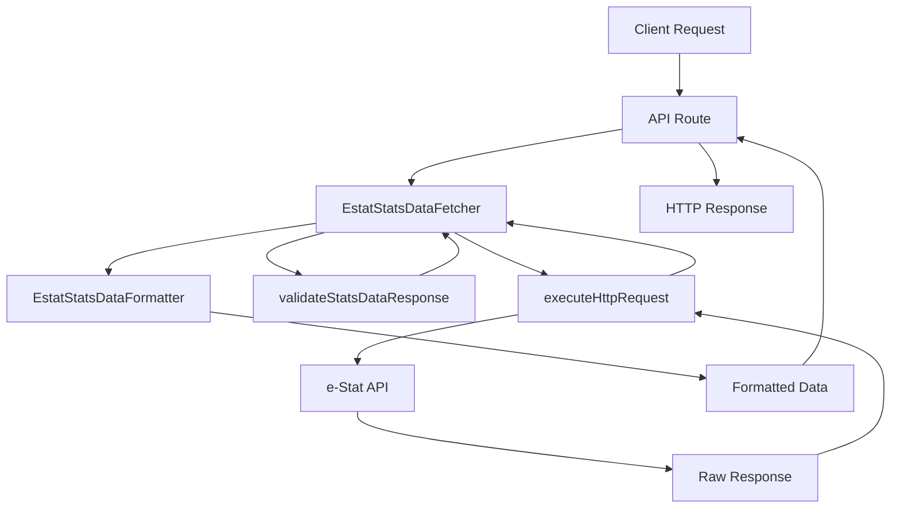
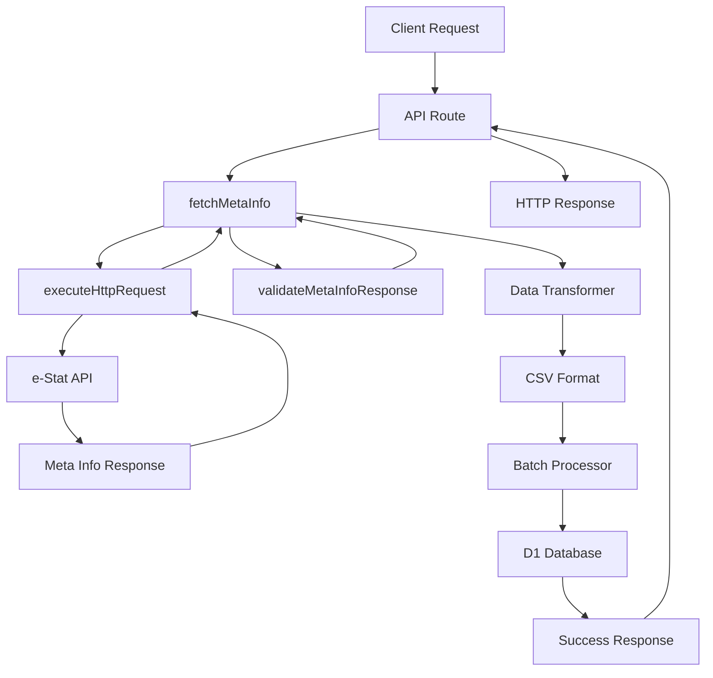

# e-Stat API ドメイン概要

## 目的

`src/infrastructure/estat` ライブラリは、政府統計ポータルサイト「e-Stat」の API からデータを取得・整形・保存するための TypeScript ライブラリです。統計データの可視化や分析に必要なデータを効率的に取得し、アプリケーションで利用しやすい形式に変換します。

## 主要な機能

### 1. 統計データの取得と整形

e-Stat API から統計データを取得し、構造化された形式に変換します。

- API レスポンスのパース
- データのフィルタリング（カテゴリ、年度、地域）
- 使いやすい形式への変換
- NULL 値や特殊文字の適切な処理

### 2. メタ情報の管理

統計表のメタ情報（カテゴリ、単位など）を取得・保存・検索します。

- メタ情報の取得と変換
- データベースへの保存
- 効率的な一括処理
- 検索機能

### 3. 統計リストの取得

利用可能な統計表の一覧を取得します。

- キーワード検索
- フィルタリング
- ページネーション

## アーキテクチャ

### レイヤー構造

```
┌─────────────────────────────────────┐
│   Application Layer                 │
│   (API Routes, Handlers)            │
└───────────┬─────────────────────────┘
            │
┌───────────▼─────────────────────────┐
│   Service Layer                     │
│   - EstatStatsDataService           │
│   - EstatStatsListService           │
│   - EstatMetaInfoService            │
└───────────┬─────────────────────────┘
            │
┌───────────▼─────────────────────────┐
│   API Client Layer                  │
│   (@/services/estat-api)            │
└───────────┬─────────────────────────┘
            │
┌───────────▼─────────────────────────┐
│   e-Stat API                        │
│   (External Service)                │
└─────────────────────────────────────┘
```

### データフロー

#### 1. 統計データ取得フロー

```
User Request
    │
    ▼
EstatStatsDataService.getAndFormatStatsData()
    │
    ├─► getStatsDataRaw()
    │       │
    │       ▼
    │   estatAPI.getStatsData()
    │       │
    │       ▼
    │   e-Stat API
    │       │
    │       ▼
    │   Raw Response
    │
    └─► formatStatsData()
            │
            ├─► formatAreas()
            ├─► formatCategories()
            ├─► formatYears()
            └─► formatValues()
                    │
                    ▼
            Formatted Data
```

#### 2. メタ情報取得・保存フロー

```
User Request
    │
    ▼
EstatMetaInfoService.processAndSaveMetaInfo()
    │
    ├─► estatAPI.getMetaInfo()
    │       │
    │       ▼
    │   e-Stat API Response
    │
    ├─► transformToCSVFormat()
    │       │
    │       ▼
    │   Transformed Data
    │
    └─► saveTransformedData()
            │
            ├─► processBatch()
            │       │
            │       ▼
            │   D1 Database
            │
            └─► findRankingKey()
```

## 主要な概念

### 1. 統計表 ID (statsDataId)

e-Stat の各統計表に付与される一意の識別子です。10 桁の数字で表されます。

例: `0000010101`

### 2. カテゴリコード (cat01-15)

統計データの分類を示すコードです。最大 15 種類まで設定可能ですが、通常は `cat01` が主要なカテゴリとして使用されます。

例:

- `A1101`: 総人口
- `A1301`: 男性人口
- `A1401`: 女性人口

### 3. 地域コード (area)

統計データの対象地域を示すコードです。

例:

- `00000`: 全国
- `13000`: 東京都
- `27000`: 大阪府

### 4. 時間軸コード (time)

統計データの対象時期を示すコードです。

例:

- `2020`: 2020 年
- `2020CY`: 2020 暦年
- `202001`: 2020 年 1 月

### 5. データ整形の段階

#### Raw Response (生 API レスポンス)

e-Stat API から返される生の JSON 形式のデータ。

#### Formatted Data (整形済みデータ)

アプリケーションで扱いやすいように変換されたデータ。

- 構造化された形式
- NULL 値の適切な処理
- 数値の正規化

#### Processed Data (処理済みデータ)

さらに高度な処理を施したデータ（統計量の計算など）。

## サービス別の役割

### EstatStatsDataService

**役割**: 統計データの取得と整形

**主な責務**:

- 統計表からデータを取得
- 地域・カテゴリ・年度情報の整形
- フィルタリング条件の適用
- 都道府県データの抽出
- 利用可能な年度リストの取得

### EstatStatsListService

**役割**: 統計表リストの取得

**主な責務**:

- 統計表の検索
- リスト情報の整形
- ページネーション処理

### EstatMetaInfoService

**役割**: メタ情報の管理

**主な責務**:

- メタ情報の取得と変換
- データベースへの保存
- 一括処理（バッチ処理）
- メタ情報の検索
- サマリー情報の生成

## ディレクトリ構成

```
src/infrastructure/estat/
├── index.ts                          # エントリーポイント
├── statsdata/                        # 統計データサービス
│   ├── EstatStatsDataService.ts
│   ├── index.ts
│   └── __tests__/
├── statslist/                        # 統計リストサービス
│   ├── EstatStatsListService.ts
│   └── index.ts
├── metainfo/                         # メタ情報サービス
│   ├── EstatMetaInfoService.ts
│   └── index.ts
└── types/                            # 型定義
    ├── index.ts
    ├── parameters.ts                 # APIパラメータ型
    ├── formatted.ts                  # 整形済みデータ型
    ├── processed.ts                  # 処理済みデータ型
    ├── metainfo.ts                   # メタ情報型
    ├── raw-response.ts               # 生APIレスポンス型
    ├── meta-response.ts
    ├── list-response.ts
    ├── catalog-response.ts
    └── errors.ts                     # エラー型
```

## クイックスタート

### インストール

このライブラリはプロジェクトに含まれています。

```typescript
import {
  EstatStatsDataService,
  EstatStatsListService,
  EstatMetaInfoService,
} from "@/infrastructure/estat";
```

### 基本的な使用例

```typescript
// 統計データを取得して整形
const data = await EstatStatsDataService.getAndFormatStatsData("0000010101", {
  categoryFilter: "A1101",
  yearFilter: "2020",
  areaFilter: "13000",
});

// 統計リストを取得
const list = await EstatStatsListService.getAndFormatStatsList({
  searchWord: "人口",
  limit: 20,
});

// メタ情報を取得（要D1Database）
const metaService = new EstatMetaInfoService(db);
await metaService.processAndSaveMetaInfo("0000010101");
```

## ドキュメント構成

### サブドメイン別ドキュメント

#### meta-info サブドメイン

- **[overview.md](meta-info/overview.md)**: メタ情報サブドメイン概要
- **[specifications/](meta-info/specifications/)**: 仕様書
  - [api.md](meta-info/specifications/api.md): get-meta-info API 仕様
  - [service.md](meta-info/specifications/service.md): メタ情報サービス仕様
- **[implementation/](meta-info/implementation/)**: 実装ガイド
  - [fetcher.md](meta-info/implementation/fetcher.md): フェッチャー実装ガイド
  - [formatter.md](meta-info/implementation/formatter.md): フォーマッター実装ガイド
  - [batch-processor.md](meta-info/implementation/batch-processor.md): バッチ処理実装ガイド

#### stats-data サブドメイン

- **[overview.md](04_ドメイン設計/e-Stat%20API/04_統計データ/overview.md)**: 統計データサブドメイン概要
- **[specifications/](stats-data/specifications/)**: 仕様書
  - [api.md](04_ドメイン設計/e-Stat%20API/04_統計データ/specifications/api.md): get-stats-data API 仕様
  - [service.md](04_ドメイン設計/e-Stat%20API/04_統計データ/specifications/service.md): 統計データサービス仕様
- **[implementation/](stats-data/implementation/)**: 実装ガイド
  - [fetcher.md](stats-data/implementation/fetcher.md): フェッチャー実装ガイド
  - [formatter.md](stats-data/implementation/formatter.md): フォーマッター実装ガイド

#### stats-list サブドメイン

- **[overview.md](04_ドメイン設計/e-Stat%20API/02_統計表リスト/overview.md)**: 統計リストサブドメイン概要
- **[specifications/](stats-list/specifications/)**: 仕様書
  - [api.md](04_ドメイン設計/e-Stat%20API/02_統計表リスト/api.md): get-stats-list API 仕様
  - [service.md](04_ドメイン設計/e-Stat%20API/02_統計表リスト/service.md): 統計リストサービス仕様
- **[implementation/](stats-list/implementation/)**: 実装ガイド
  - [fetcher.md](stats-list/implementation/fetcher.md): フェッチャー実装ガイド
  - [formatter.md](stats-list/implementation/formatter.md): フォーマッター実装ガイド

### 共通ドキュメント

#### アーキテクチャ

- **[architecture.md](04_ドメイン設計/e-Stat%20API/architecture.md)**: 全体アーキテクチャ設計

#### 共有仕様

- **[shared/](shared/)**: 共通仕様
  - [api-endpoints.md](api-endpoints.md): API エンドポイント一覧
  - [type-system.md](type-system.md): 型システム
  - [error-handling.md](error-handling.md): エラーハンドリング戦略
  - [best-practices.md](04_ドメイン設計/e-Stat%20API/01_共有/best-practices.md): ベストプラクティス

#### 実装ガイド

- **[implementation/](implementation/)**: 全般的な実装ガイド
  - [getting-started.md](04_ドメイン設計/e-Stat%20API/01_共有/getting-started.md): 開始ガイド
  - [api-integration.md](api-integration.md): API 統合ガイド
  - [data-fetching.md](data-fetching.md): データ取得実装

#### テスト

- **[testing/](testing/)**: テスト戦略
  - [testing-strategy.md](testing/testing-strategy.md): テスト戦略
  - [unit-testing.md](04_ドメイン設計/e-Stat%20API/04_統計データ/testing/unit-testing.md): 単体テスト

## パフォーマンス最適化

### 1. バッチ処理

メタ情報の保存時に、複数レコードをバッチでまとめて処理することで、データベース操作を効率化しています。

```typescript
// バッチサイズ: 20件
// 並列実行: 最大3チャンク同時
```

### 2. 並列処理

複数の統計表を処理する際、並列処理により処理時間を短縮します。

```typescript
await Promise.allSettled(
  batch.map(async (id) => ({
    statsDataId: id,
    ...(await this.processAndSaveMetaInfo(id)),
  }))
);
```

### 3. レート制限対応

API 制限を考慮し、バッチ間に待機時間を設けています。

```typescript
// デフォルト: 1000ms
await new Promise((resolve) => setTimeout(resolve, delayMs));
```

## エラーハンドリング

### エラーの種類

1. **API 通信エラー**: e-Stat API との通信に失敗した場合
2. **データ形式エラー**: API レスポンスが期待した形式でない場合
3. **データベースエラー**: データベース操作に失敗した場合

### エラーログ

詳細なエラーログを出力することで、問題の特定を容易にしています。

```typescript
console.error("Failed to fetch stats data:", error);
console.error("Error details:", {
  statsDataId,
  options,
  error: error instanceof Error ? error.message : String(error),
  stack: error instanceof Error ? error.stack : undefined,
});
```

## データベーススキーマ

### estat_metainfo テーブル

メタ情報を保存するテーブルです。

| カラム名      | 型        | 説明                      |
| ------------- | --------- | ------------------------- |
| stats_data_id | TEXT      | 統計表 ID                 |
| stat_name     | TEXT      | 政府統計名                |
| title         | TEXT      | 統計表題名                |
| cat01         | TEXT      | カテゴリコード            |
| item_name     | TEXT      | 項目名                    |
| unit          | TEXT      | 単位                      |
| ranking_key   | TEXT      | ランキングキー（NULL 可） |
| updated_at    | TIMESTAMP | 更新日時                  |

複合主キー: `(stats_data_id, cat01)`

## 型安全性

TypeScript の型システムを活用し、コンパイル時の型チェックによりバグを防ぎます。

- すべての API パラメータに型定義
- レスポンスデータの型定義
- 内部データ構造の型定義

詳細は [型システム](02-type-system.md) を参照してください。

## 拡張性

### 新しい API エンドポイントの追加

新しい e-Stat API エンドポイントを追加する場合：

1. `types/` に型定義を追加
2. `@/services/estat-api` に API クライアントメソッドを追加
3. 適切なサービスクラスにメソッドを追加

### 新しいデータ変換の追加

データ変換ロジックを追加する場合：

1. サービスクラスに private メソッドを追加
2. 既存の `format*()` メソッドから呼び出す
3. 必要に応じて型定義を追加

## ベストプラクティス

### 1. フィルタリングの活用

大量のデータを取得する前に、必要なデータのみを取得するようフィルタリングを活用します。

```typescript
// 良い例: 必要なデータのみを取得
const data = await EstatStatsDataService.getAndFormatStatsData(
  statsDataId,
  {
    categoryFilter: 'A1101',
    yearFilter: '2020',
    areaFilter: '13000'
  }
);

// 悪い例: すべてのデータを取得してから絞り込み
const data = await EstatStatsDataService.getAndFormatStatsData(statsDataId);
const filtered = data.values.filter(...);
```

### 2. エラーハンドリング

必ず try-catch でエラーをハンドリングします。

```typescript
try {
  const data = await EstatStatsDataService.getAndFormatStatsData(statsDataId);
  // データ処理
} catch (error) {
  console.error("データ取得に失敗:", error);
  // エラー処理
}
```

### 3. メタ情報のキャッシュ

メタ情報は頻繁に変更されないため、データベースに保存してキャッシュとして活用します。

```typescript
// 初回: APIから取得してDBに保存
await metaService.processAndSaveMetaInfo(statsDataId);

// 2回目以降: DBから取得
const metadata = await metaService.getSavedMetadataByStatsId(statsDataId);
```

## 次のステップ

- [アーキテクチャ設計](01-architecture.md)
- [型システム](02-type-system.md)
- [API 仕様](apis/)
- [サービス仕様](services/)
- [実装ガイド](../implementation/)
- [テスト戦略](../testing/)

## 参考リンク

- [e-Stat API 仕様](https://www.e-stat.go.jp/api/)
- [e-Stat ポータルサイト](https://www.e-stat.go.jp/)

# e-Stat API 開始ガイド

## 概要

このガイドでは、e-Stat API ライブラリの基本的な使用方法から、実際のデータ取得までを段階的に説明します。

## 前提条件

### 必要な環境

- Node.js 18 以上
- TypeScript 4.5 以上
- Next.js 13 以上（App Router 対応）

### 必要な依存関係

```bash
npm install @types/node
```

## セットアップ

### 1. 環境変数の設定

`.env.local`ファイルを作成し、e-Stat API のアプリケーション ID を設定します。

```bash
# .env.local
NEXT_PUBLIC_ESTAT_APP_ID=your-actual-app-id
```

### 2. アプリケーション ID の取得

1. [e-Stat API](https://www.e-stat.go.jp/api/)にアクセス
2. ユーザー登録（無料）
3. アプリケーション登録
4. アプリケーション ID を取得

### 3. ライブラリのインポート

```typescript
import {
  EstatStatsDataService,
  EstatStatsListService,
  EstatMetaInfoService,
} from "@/infrastructure/estat";
```

## 基本的な使用方法

### 1. 統計リストの取得

利用可能な統計表を検索します。

```typescript
// 統計表を検索
const statsList = await EstatStatsListService.getAndFormatStatsList({
  searchWord: "人口",
  limit: 10,
});

console.log("検索結果:", statsList);
```

**レスポンス例**:

```typescript
{
  list: [
    {
      statsDataId: "0000010101",
      title: "人口推計",
      description: "都道府県別人口推計",
      updatedAt: "2024-01-01"
    }
  ],
  totalCount: 100,
  startPosition: 1,
  limit: 10
}
```

### 2. 統計データの取得

統計表から実際のデータを取得します。

```typescript
// 統計データを取得
const statsData = await EstatStatsDataService.getAndFormatStatsData(
  "0000010101", // 統計表ID
  {
    categoryFilter: "A1101", // 総人口
    yearFilter: "2023", // 2023年
    areaFilter: "13000", // 東京都
  }
);

console.log("取得したデータ:", statsData);
```

**レスポンス例**:

```typescript
{
  values: [
    {
      areaCode: "13000",
      areaName: "東京都",
      value: 14000000,
      unit: "人",
      categoryCode: "A1101",
      categoryName: "総人口",
      timeCode: "2023",
      timeName: "2023年"
    }
  ],
  areas: [...],
  categories: [...],
  years: [...]
}
```

### 3. メタ情報の取得

統計表の構造情報を取得します。

```typescript
// メタ情報を取得
const metaInfo = await EstatMetaInfoService.getMetaInfo("0000010101");

console.log("メタ情報:", metaInfo);
```

**レスポンス例**:

```typescript
{
  categories: [
    {
      code: "A1101",
      name: "総人口",
      level: 1
    }
  ],
  areas: [
    {
      code: "13000",
      name: "東京都",
      level: 1
    }
  ],
  years: [
    {
      code: "2023",
      name: "2023年"
    }
  ]
}
```

## 実践的な使用例

### 1. 都道府県別人口ランキングの作成

```typescript
async function createPrefecturePopulationRanking() {
  try {
    // 1. 統計データを取得
    const data = await EstatStatsDataService.getAndFormatStatsData(
      "0000010101", // 人口推計の統計表ID
      {
        categoryFilter: "A1101", // 総人口
        yearFilter: "2023", // 2023年
      }
    );

    // 2. 都道府県データのみを抽出
    const prefectureData = data.values.filter(
      (item) =>
        item.areaCode !== "00000" && // 全国データを除外
        item.areaCode.length === 5 // 都道府県コード（5桁）
    );

    // 3. 人口順でソート
    const ranking = prefectureData
      .sort((a, b) => (b.value || 0) - (a.value || 0))
      .map((item, index) => ({
        rank: index + 1,
        prefecture: item.areaName,
        population: item.value,
        unit: item.unit,
      }));

    console.log("都道府県別人口ランキング:", ranking);
    return ranking;
  } catch (error) {
    console.error("ランキング作成エラー:", error);
    throw error;
  }
}
```

### 2. 複数年度のデータ比較

```typescript
async function comparePopulationByYear() {
  try {
    const years = ["2020", "2021", "2022", "2023"];
    const results = [];

    for (const year of years) {
      const data = await EstatStatsDataService.getAndFormatStatsData(
        "0000010101",
        {
          categoryFilter: "A1101",
          yearFilter: year,
          areaFilter: "13000", // 東京都
        }
      );

      if (data.values.length > 0) {
        results.push({
          year,
          population: data.values[0].value,
          unit: data.values[0].unit,
        });
      }
    }

    console.log("東京都の人口推移:", results);
    return results;
  } catch (error) {
    console.error("年度比較エラー:", error);
    throw error;
  }
}
```

### 3. 利用可能な年度の取得

```typescript
async function getAvailableYears(statsDataId: string) {
  try {
    const years = await EstatStatsDataService.getAvailableYears(statsDataId);
    console.log("利用可能な年度:", years);
    return years;
  } catch (error) {
    console.error("年度取得エラー:", error);
    throw error;
  }
}

// 使用例
const years = await getAvailableYears("0000010101");
```

## エラーハンドリング

### 基本的なエラーハンドリング

```typescript
async function safeDataFetch(statsDataId: string) {
  try {
    const data = await EstatStatsDataService.getAndFormatStatsData(statsDataId);
    return { success: true, data };
  } catch (error) {
    console.error("データ取得エラー:", error);

    // エラーの種類に応じた処理
    if (error instanceof EstatApiError) {
      return {
        success: false,
        error: "APIエラー: " + error.message,
      };
    } else if (error instanceof ValidationError) {
      return {
        success: false,
        error: "バリデーションエラー: " + error.message,
      };
    } else {
      return {
        success: false,
        error: "予期しないエラーが発生しました",
      };
    }
  }
}
```

### リトライ機能の実装

```typescript
async function fetchWithRetry(
  fetchFunction: () => Promise<any>,
  maxRetries: number = 3,
  delay: number = 1000
) {
  for (let attempt = 1; attempt <= maxRetries; attempt++) {
    try {
      return await fetchFunction();
    } catch (error) {
      console.warn(`試行 ${attempt}/${maxRetries} 失敗:`, error);

      if (attempt === maxRetries) {
        throw error;
      }

      // 指数バックオフで待機
      await new Promise((resolve) =>
        setTimeout(resolve, delay * Math.pow(2, attempt - 1))
      );
    }
  }
}

// 使用例
const data = await fetchWithRetry(() =>
  EstatStatsDataService.getAndFormatStatsData("0000010101")
);
```

## パフォーマンス最適化

### 1. 並列処理

```typescript
async function fetchMultipleStatsData(statsDataIds: string[]) {
  try {
    // 並列で複数の統計データを取得
    const promises = statsDataIds.map((id) =>
      EstatStatsDataService.getAndFormatStatsData(id)
    );

    const results = await Promise.allSettled(promises);

    return results.map((result, index) => ({
      statsDataId: statsDataIds[index],
      success: result.status === "fulfilled",
      data: result.status === "fulfilled" ? result.value : null,
      error: result.status === "rejected" ? result.reason : null,
    }));
  } catch (error) {
    console.error("並列取得エラー:", error);
    throw error;
  }
}
```

### 2. キャッシュの活用

```typescript
class DataCache {
  private cache = new Map<string, { data: any; timestamp: number }>();
  private ttl = 5 * 60 * 1000; // 5分

  get(key: string) {
    const item = this.cache.get(key);
    if (!item) return null;

    if (Date.now() - item.timestamp > this.ttl) {
      this.cache.delete(key);
      return null;
    }

    return item.data;
  }

  set(key: string, data: any) {
    this.cache.set(key, {
      data,
      timestamp: Date.now(),
    });
  }
}

const cache = new DataCache();

async function getCachedStatsData(statsDataId: string, options: any) {
  const cacheKey = `${statsDataId}-${JSON.stringify(options)}`;

  // キャッシュをチェック
  const cached = cache.get(cacheKey);
  if (cached) {
    console.log("キャッシュから取得");
    return cached;
  }

  // データを取得してキャッシュに保存
  const data = await EstatStatsDataService.getAndFormatStatsData(
    statsDataId,
    options
  );
  cache.set(cacheKey, data);

  return data;
}
```

## デバッグとログ

### デバッグログの有効化

```typescript
// 環境変数でデバッグモードを制御
const DEBUG = process.env.NODE_ENV === "development";

function debugLog(message: string, data?: any) {
  if (DEBUG) {
    console.log(`[DEBUG] ${message}`, data);
  }
}

// 使用例
async function debugDataFetch(statsDataId: string) {
  debugLog("統計データ取得開始", { statsDataId });

  try {
    const data = await EstatStatsDataService.getAndFormatStatsData(statsDataId);
    debugLog("統計データ取得完了", {
      statsDataId,
      valueCount: data.values.length,
    });
    return data;
  } catch (error) {
    debugLog("統計データ取得エラー", { statsDataId, error });
    throw error;
  }
}
```

### パフォーマンス測定

```typescript
async function measurePerformance<T>(
  name: string,
  operation: () => Promise<T>
): Promise<T> {
  const start = performance.now();

  try {
    const result = await operation();
    const end = performance.now();
    console.log(`${name} 実行時間: ${(end - start).toFixed(2)}ms`);
    return result;
  } catch (error) {
    const end = performance.now();
    console.error(`${name} エラー (${(end - start).toFixed(2)}ms):`, error);
    throw error;
  }
}

// 使用例
const data = await measurePerformance("統計データ取得", () =>
  EstatStatsDataService.getAndFormatStatsData("0000010101")
);
```

## 次のステップ

- [API 統合ガイド](api-integration.md)
- [データ取得実装](data-fetching.md)
- [エラーハンドリング](error-handling.md)
- [ベストプラクティス](best-practices%201.md)
- [使用例](examples.md)

## トラブルシューティング

### よくある問題

#### 1. API キーエラー

**症状**: `401 Unauthorized` エラー

**解決方法**:

- 環境変数 `NEXT_PUBLIC_ESTAT_APP_ID` が正しく設定されているか確認
- API キーが有効か確認
- アプリケーション登録が完了しているか確認

#### 2. データが見つからない

**症状**: 空のレスポンスまたは `404 Not Found`

**解決方法**:

- 統計表 ID が正しいか確認
- フィルタ条件が適切か確認
- 年度や地域コードが存在するか確認

#### 3. レート制限エラー

**症状**: `429 Too Many Requests` エラー

**解決方法**:

- リクエスト頻度を下げる
- キャッシュを活用する
- バッチ処理でまとめて取得する

### サポート

問題が解決しない場合は、以下を確認してください：

1. [API 仕様](apis/)でパラメータを確認
2. [エラーハンドリングガイド](error-handling.md)でエラー処理を確認
3. [ベストプラクティス](best-practices%201.md)で推奨事項を確認

# 型定義

## 概要

`src/infrastructure/estat/types` ディレクトリには、e-Statライブラリで使用されるすべての型定義が含まれています。型定義は以下のカテゴリに分類されます：

1. **APIパラメータ型**: API呼び出し時のパラメータ
2. **生APIレスポンス型**: e-Stat APIから返される生のレスポンス
3. **整形済みデータ型**: アプリケーションで使用しやすい形式に整形されたデータ
4. **処理済みデータ型**: 統計処理が施されたデータ
5. **メタ情報型**: メタデータ関連の型
6. **エラー型**: エラー情報

## APIパラメータ型

### GetStatsDataParams

統計データ取得APIのパラメータ。

**ファイル**: `types/parameters.ts`

```typescript
interface GetStatsDataParams {
  // 必須パラメータ
  appId: string;                       // アプリケーションID
  statsDataId: string;                 // 統計表ID

  // 絞り込み条件（階層）
  lvTab?: string;                      // 表章項目の階層レベル
  lvCat01?: string;                    // 分類01の階層レベル
  lvCat02?: string;                    // 分類02の階層レベル
  // ... (cat03-15)
  lvArea?: string;                     // 地域の階層レベル
  lvTime?: string;                     // 時間軸の階層レベル

  // 絞り込み条件（コード）
  cdTab?: string;                      // 表章項目コード（カンマ区切り）
  cdCat01?: string;                    // 分類01コード（カンマ区切り）
  cdCat02?: string;                    // 分類02コード（カンマ区切り）
  // ... (cat03-15)
  cdArea?: string;                     // 地域コード（カンマ区切り）
  cdTime?: string;                     // 時間軸コード（カンマ区切り）

  // 絞り込み条件（From-To）
  cdTimeFrom?: string;                 // 時間軸From
  cdTimeTo?: string;                   // 時間軸To

  // データ取得位置
  startPosition?: number;              // データ開始位置（デフォルト:1）
  limit?: number;                      // データ取得件数（デフォルト:100000）

  // 出力オプション
  lang?: 'J' | 'E';                   // 言語（デフォルト:J）
  metaGetFlg?: 'Y' | 'N';             // メタ情報取得（デフォルト:Y）
  cntGetFlg?: 'Y' | 'N';              // 件数取得（デフォルト:N）
  explanationGetFlg?: 'Y' | 'N';      // 解説情報取得（デフォルト:N）
  annotationGetFlg?: 'Y' | 'N';       // 注釈情報取得（デフォルト:N）
  replaceSpChars?: '0' | '1' | '2';   // 特殊文字置換（0:置換しない、1:NULL、2:0）
  sectionHeaderFlg?: '1' | '2';       // セクションヘッダ（1:有り、2:無し）
}
```

#### 使用例

```typescript
const params: GetStatsDataParams = {
  appId: 'YOUR_APP_ID',
  statsDataId: '0000010101',
  cdCat01: 'A1101',
  cdTime: '2020',
  cdArea: '13000',
  limit: 1000,
  metaGetFlg: 'Y'
};
```

### GetMetaInfoParams

メタ情報取得APIのパラメータ。

```typescript
interface GetMetaInfoParams {
  appId: string;                       // アプリケーションID
  statsDataId: string;                 // 統計表ID
  lang?: 'J' | 'E';                   // 言語（デフォルト:J）
}
```

### GetStatsListParams

統計リスト取得APIのパラメータ。

```typescript
interface GetStatsListParams {
  appId: string;                       // アプリケーションID

  // 検索条件
  searchKind?: '1' | '2' | '3';       // 検索種別（1:政府統計名、2:統計表題、3:項目名）
  surveyYears?: string;                // 調査年月（YYYY、YYYYMM、YYYY-YYYY）
  openYears?: string;                  // 公開年月（YYYY、YYYYMM、YYYY-YYYY）
  updatedDate?: string;                // 更新日付（YYYY-MM-DD、YYYY-MM-DD-YYYY-MM-DD）
  statsCode?: string;                  // 政府統計コード
  searchWord?: string;                 // キーワード
  statsName?: string;                  // 政府統計名
  govOrg?: string;                     // 作成機関
  statsNameList?: string;              // 提供統計名
  title?: string;                      // 統計表題
  explanation?: string;                // 統計表の説明
  field?: string;                      // 分野
  layout?: string;                     // 統計大分類
  toukei?: string;                     // 統計小分類

  // ページング
  startPosition?: number;              // データ開始位置（デフォルト:1）
  limit?: number;                      // データ取得件数（デフォルト:100）

  // 出力オプション
  lang?: 'J' | 'E';                   // 言語（デフォルト:J）
  replaceSpChars?: '0' | '1' | '2';   // 特殊文字置換
}
```

## 整形済みデータ型

### FormattedEstatData

整形された統計データの全体構造。

**ファイル**: `types/formatted.ts`

```typescript
interface FormattedEstatData {
  tableInfo: {
    id: string;                        // 統計表ID
    title: string;                     // 統計表題名
    statName: string;                  // 政府統計名
    govOrg: string;                    // 作成機関名
    statisticsName: string;            // 提供統計名
    totalNumber: number;               // 総データ件数
    fromNumber: number;                // 開始番号
    toNumber: number;                  // 終了番号
  };
  areas: FormattedArea[];              // 地域情報
  categories: FormattedCategory[];     // カテゴリ情報
  years: FormattedYear[];              // 年情報
  values: FormattedValue[];            // 値情報
  metadata: {
    processedAt: string;               // 処理日時
    totalRecords: number;              // 総レコード数
    validValues: number;               // 有効な値の数
    nullValues: number;                // NULL値の数
  };
}
```

#### 使用例

```typescript
const data: FormattedEstatData =
  await EstatStatsDataService.getAndFormatStatsData('0000010101');

console.log(`統計表: ${data.tableInfo.title}`);
console.log(`地域数: ${data.areas.length}`);
console.log(`カテゴリ数: ${data.categories.length}`);
console.log(`データ件数: ${data.values.length}`);
```

### FormattedArea

整形された地域情報。

```typescript
interface FormattedArea {
  areaCode: string;                    // 地域コード
  areaName: string;                    // 地域名
  level: string;                       // 階層レベル
  parentCode?: string;                 // 親地域コード
}
```

#### 使用例

```typescript
const tokyo: FormattedArea = {
  areaCode: '13000',
  areaName: '東京都',
  level: '2',
  parentCode: '00000'
};
```

### FormattedCategory

整形されたカテゴリ情報。

```typescript
interface FormattedCategory {
  categoryCode: string;                // カテゴリコード
  categoryName: string;                // カテゴリ名
  displayName: string;                 // 表示名（クリーンアップ済み）
  unit: string | null;                 // 単位
}
```

#### 使用例

```typescript
const population: FormattedCategory = {
  categoryCode: 'A1101',
  categoryName: '総人口',
  displayName: '総人口',
  unit: '人'
};
```

### FormattedYear

整形された年情報。

```typescript
interface FormattedYear {
  timeCode: string;                    // 時間軸コード
  timeName: string;                    // 時間軸名
}
```

### FormattedValue

整形された値情報。

```typescript
interface FormattedValue {
  value: number;                       // 数値
  unit: string | null;                 // 単位
  areaCode: string;                    // 地域コード
  areaName: string;                    // 地域名
  categoryCode: string;                // カテゴリコード
  categoryName: string;                // カテゴリ名
  timeCode: string;                    // 時間軸コード
  timeName: string;                    // 時間軸名
  rank?: number;                       // ランク（任意）
}
```

#### 使用例

```typescript
const tokyoPopulation: FormattedValue = {
  value: 13921000,
  unit: '人',
  areaCode: '13000',
  areaName: '東京都',
  categoryCode: 'A1101',
  categoryName: '総人口',
  timeCode: '2020',
  timeName: '2020年'
};
```

### FormattedStatListItem

統計データリストの項目。

```typescript
interface FormattedStatListItem {
  id: string;                          // 統計表ID
  statName: string;                    // 政府統計名
  title: string;                       // 統計表題名
  govOrg: string;                      // 作成機関名
  statisticsName: string;              // 提供統計名
  surveyDate: string;                  // 調査年月
  updatedDate: string;                 // 更新日
  description?: string;                // 説明（任意）
}
```

## メタ情報型

### EstatMetaCategoryData

CSV形式に変換されたメタデータ。

**ファイル**: `types/formatted.ts`

```typescript
interface EstatMetaCategoryData {
  stats_data_id: string;               // 統計表ID
  stat_name: string;                   // 政府統計名
  title: string;                       // 統計表題名
  cat01: string;                       // カテゴリコード
  item_name: string | null;            // 項目名
  unit: string | null;                 // 単位
}
```

#### 使用例

```typescript
const metadata: EstatMetaCategoryData = {
  stats_data_id: '0000010101',
  stat_name: '国勢調査',
  title: '人口等基本集計',
  cat01: 'A1101',
  item_name: '総人口',
  unit: '人'
};
```

### TransformedMetadataEntry

変換されたメタデータエントリ（内部使用）。

**ファイル**: `types/metainfo.ts`

```typescript
interface TransformedMetadataEntry {
  stats_data_id: string;
  stat_name: string;
  title: string;
  cat01: string;
  item_name: string | null;
  unit: string | null;
}
```

### MetadataSummary

メタデータサマリー情報。

```typescript
interface MetadataSummary {
  totalEntries: number;                // 総エントリ数
  uniqueStats: number;                 // ユニークな統計表数
  categories: Array<{                  // カテゴリ別件数
    code: string;
    name: string;
    count: number;
  }>;
  lastUpdated: string | null;          // 最終更新日時
}
```

#### 使用例

```typescript
const summary: MetadataSummary = {
  totalEntries: 15000,
  uniqueStats: 350,
  categories: [
    { code: 'A1101', name: '総人口', count: 1200 },
    { code: 'A1301', name: '男性人口', count: 1100 },
    // ...
  ],
  lastUpdated: '2024-01-15T10:30:00Z'
};
```

### MetadataSearchResult

メタデータ検索結果。

```typescript
interface MetadataSearchResult {
  entries: EstatMetaCategoryData[];    // 検索結果
  totalCount: number;                  // 総件数
  searchQuery: string;                 // 検索クエリ
  executedAt: string;                  // 実行日時
}
```

## 処理済みデータ型

### ProcessedStatsData

整形済み統計データ（汎用）。

**ファイル**: `types/processed.ts`

```typescript
interface ProcessedStatsData {
  metadata: StatsMetadata;             // メタデータ
  dimensions: StatsDimensions;         // 次元情報
  data: StatsDataRecord[];             // データレコード
  statistics?: StatsStatistics;        // 統計情報
  notes?: string[];                    // 注釈
}
```

### StatsMetadata

統計メタデータ。

```typescript
interface StatsMetadata {
  // 基本情報
  statsDataId: string;                 // 統計表ID
  title: string;                       // 統計表題名
  statName: string;                    // 政府統計名
  govOrg: string;                      // 作成機関名
  govOrgCode?: string;                 // 作成機関コード

  // 時期情報
  surveyDate?: string;                 // 調査年月
  openDate?: string;                   // 公開日
  updatedDate?: string;                // 更新日
  cycle?: string;                      // 提供周期

  // 分類情報
  mainCategory?: string;               // 分野（大分類）
  mainCategoryCode?: string;           // 分野コード（大分類）
  subCategory?: string;                // 分野（小分類）
  subCategoryCode?: string;            // 分野コード（小分類）

  // 地域情報
  collectArea?: string;                // 集計地域区分
  smallArea?: '0' | '1' | '2';        // 小地域属性

  // データ情報
  totalRecords: number;                // 総データ件数
  responseRecords?: number;            // 取得データ件数

  // システム情報
  lastFetched: string;                 // 取得日時
  source: 'e-stat';                    // データソース
}
```

### StatsDimensions

次元情報。

```typescript
interface StatsDimensions {
  [dimensionId: string]: DimensionInfo;
}
```

### DimensionInfo

次元詳細。

```typescript
interface DimensionInfo {
  id: string;                          // 次元ID (tab, cat01-15, area, time)
  name: string;                        // 次元名
  required: boolean;                   // 必須フラグ
  position?: number;                   // 表示位置
  items: DimensionItem[];              // 次元項目リスト
}
```

### DimensionItem

次元項目。

```typescript
interface DimensionItem {
  code: string;                        // 項目コード
  name: string;                        // 項目名
  level: string;                       // 階層レベル
  unit?: string;                       // 単位
  parentCode?: string;                 // 親コード
  explanation?: string;                // 説明
}
```

### StatsDataRecord

データレコード。

```typescript
interface StatsDataRecord {
  // 値
  value: number | null;                // 数値（nullは欠損値）
  rawValue: string;                    // 元の値（特殊文字含む）

  // 次元情報（コードと名称）
  tab?: { code: string; name: string; };
  cat01?: { code: string; name: string; };
  cat02?: { code: string; name: string; };
  // ... (cat03-15)
  area?: { code: string; name: string; };
  time?: { code: string; name: string; };

  // 追加情報
  unit?: string;                       // 単位
  annotation?: string;                 // 注釈記号
}
```

### StatsStatistics

統計情報（基本統計量）。

```typescript
interface StatsStatistics {
  // 基本統計量
  count: number;                       // データ件数
  validCount: number;                  // 有効データ件数
  missingCount: number;                // 欠損データ件数

  // 代表値
  min: number;                         // 最小値
  max: number;                         // 最大値
  sum: number;                         // 合計
  mean: number;                        // 平均
  median: number;                      // 中央値
  mode?: number;                       // 最頻値

  // ばらつき
  range: number;                       // 範囲
  variance: number;                    // 分散
  stdDev: number;                      // 標準偏差
  cv?: number;                        // 変動係数

  // 分位数
  quartiles: {
    q1: number;                        // 第1四分位数
    q2: number;                        // 第2四分位数（中央値）
    q3: number;                        // 第3四分位数
    iqr: number;                       // 四分位範囲
  };

  // 外れ値
  outliers?: {
    lower: number[];                   // 下側外れ値
    upper: number[];                   // 上側外れ値
  };
}
```

## 生APIレスポンス型

生APIレスポンス型は `types/raw-response.ts`, `types/meta-response.ts`, `types/list-response.ts` などに定義されています。これらはe-Stat APIの実際のレスポンス構造を表現しています。

通常、これらの型は直接使用せず、整形済みデータ型を使用することを推奨します。

## 型のインポート

### 基本的なインポート

```typescript
import {
  FormattedEstatData,
  FormattedValue,
  FormattedArea,
  FormattedCategory,
  FormattedYear,
  FormattedStatListItem,
  EstatMetaCategoryData,
  MetadataSummary,
  MetadataSearchResult
} from '@/infrastructure/estat/types';
```

### パラメータ型のインポート

```typescript
import {
  GetStatsDataParams,
  GetMetaInfoParams,
  GetStatsListParams
} from '@/infrastructure/estat/types';
```

### 処理済みデータ型のインポート

```typescript
import {
  ProcessedStatsData,
  StatsMetadata,
  StatsDataRecord,
  StatsStatistics
} from '@/infrastructure/estat/types';
```

## 型ガード

型の安全性を確保するためのヘルパー関数の例。

```typescript
// FormattedValue が有効な値を持つかチェック
function hasValidValue(value: FormattedValue): boolean {
  return value.value !== null && !isNaN(value.value);
}

// FormattedArea が都道府県かチェック
function isPrefecture(area: FormattedArea): boolean {
  return area.level === '2' && area.areaCode !== '00000';
}

// 使用例
const validValues = data.values.filter(hasValidValue);
const prefectures = data.areas.filter(isPrefecture);
```

## 関連ドキュメント

- [EstatStatsDataService](stats-data-service.md)
- [EstatStatsListService](stats-list-service.md)
- [EstatMetaInfoService](metainfo-service.md)
- [使用例](examples.md)
- [ライブラリ概要](02_domain/estat-api/specifications/overview.md)

# API 統合ガイド

## 概要

このドキュメントでは、e-Stat API の統合方法について包括的に説明します。エンドポイントの仕様、Next.js 統合、データ取得パターン、パフォーマンス最適化まで、API 利用に必要なすべての情報を網羅しています。

## 目次

1. [e-Stat API エンドポイント](#e-stat-apiエンドポイント)
2. [Next.js API Routes での統合](#nextjs-api-routes-での統合)
3. [クライアントサイドでの使用](#クライアントサイドでの使用)
4. [データ取得パターン](#データ取得パターン)
5. [認証とセキュリティ](#認証とセキュリティ)
6. [パフォーマンス最適化](#パフォーマンス最適化)
7. [エラーハンドリング](#エラーハンドリング)

---

# 第 1 章: e-Stat API エンドポイント

## 基本情報

### 環境変数

```bash
# .env.local
NEXT_PUBLIC_ESTAT_APP_ID=your-actual-app-id
```

## e-Stat API エンドポイント

### 1. 統計リスト取得 (GET_STATS_LIST)

**エンドポイント**: `/getStatsList`

**用途**: 統計表の一覧情報を取得

**パラメータ**:

- `appId`: アプリケーション ID（必須）
- `lang`: 言語設定（J: 日本語、E: 英語）
- `surveyYears`: 調査年月
- `openYears`: 公開年月
- `statsField`: 統計分野
- `statsCode`: 政府統計コード
- `searchWord`: 検索キーワード
- `startPosition`: 開始位置
- `limit`: 取得件数

### 2. メタ情報取得 (GET_META_INFO)

**エンドポイント**: `/getMetaInfo`

**用途**: 統計表のメタ情報（分類情報、地域情報、時間軸情報など）を取得

**パラメータ**:

- `appId`: アプリケーション ID（必須）
- `statsDataId`: 統計データ ID（必須）
- `metaGetFlg`: メタデータ取得フラグ（Y/N）
- `cntGetFlg`: 件数取得フラグ（Y/N）

### 3. 統計データ取得 (GET_STATS_DATA)

**エンドポイント**: `/getStatsData`

**用途**: 統計表の実際のデータを取得

**パラメータ**:

- `appId`: アプリケーション ID（必須）
- `statsDataId`: 統計データ ID（必須）
- `metaGetFlg`: メタデータ取得フラグ（Y/N）
- `cntGetFlg`: 件数取得フラグ（Y/N）
- `cdCat01-15`: カテゴリコード（最大 15 種類）
- `cdArea`: 地域コード
- `cdTime`: 時間軸コード
- `startPosition`: 開始位置
- `limit`: 取得件数

## 内部 API エンドポイント

### 統計データ関連

#### 統計データ取得

```http
GET /api/stats/data
```

**パラメータ**:

- `statsDataId`: 統計データ ID（必須）
- `categoryFilter`: カテゴリフィルタ
- `yearFilter`: 年度フィルタ
- `areaFilter`: 地域フィルタ
- `limit`: 取得件数

**レスポンス**:

```json
{
  "success": true,
  "data": {
    "values": [...],
    "areas": [...],
    "categories": [...],
    "years": [...]
  }
}
```

## エラーハンドリング

### HTTP ステータスコード

- `200`: 成功
- `400`: リクエストエラー
- `401`: 認証エラー
- `403`: アクセス拒否
- `404`: データが見つからない
- `429`: レート制限
- `500`: サーバーエラー

### エラーレスポンス形式

```json
{
  "success": false,
  "error": {
    "code": "INVALID_STATS_DATA_ID",
    "message": "統計データIDが無効です",
    "details": {
      "statsDataId": "invalid-id",
      "expectedFormat": "10桁の数字"
    }
  }
}
```

## レート制限

### e-Stat API 制限

- **1 日あたり**: 1,000 回
- **1 時間あたり**: 100 回（推奨）
- **同時接続**: 5 接続まで

### 内部 API 制限

- **統計データ取得**: 1 分あたり 60 回
- **メタ情報取得**: 1 分あたり 30 回
- **ランキングデータ取得**: 1 分あたり 120 回

---

# 第 2 章: Next.js API Routes での統合

## 1. 統計データ取得 API

`src/app/api/stats/data/route.ts`

```typescript
import { NextRequest, NextResponse } from "next/server";
import { EstatStatsDataFetcher } from "@/features/estat-api/stats-data";
import { z } from "zod";

// リクエストスキーマ
const GetStatsDataSchema = z.object({
  statsDataId: z
    .string()
    .regex(/^\d{10}$/, "統計表IDは10桁の数字である必要があります"),
  categoryFilter: z.string().optional(),
  yearFilter: z.string().optional(),
  areaFilter: z.string().optional(),
  limit: z.number().min(1).max(10000).optional().default(10000),
});

export async function GET(request: NextRequest) {
  try {
    const { searchParams } = new URL(request.url);

    // パラメータの検証
    const params = GetStatsDataSchema.parse({
      statsDataId: searchParams.get("statsDataId"),
      categoryFilter: searchParams.get("categoryFilter"),
      yearFilter: searchParams.get("yearFilter"),
      areaFilter: searchParams.get("areaFilter"),
      limit: searchParams.get("limit")
        ? parseInt(searchParams.get("limit")!)
        : undefined,
    });

    // 統計データを取得（Fetcherを使用）
    const data = await EstatStatsDataFetcher.fetchAndFormat(
      params.statsDataId,
      {
        categoryFilter: params.categoryFilter,
        yearFilter: params.yearFilter,
        areaFilter: params.areaFilter,
        limit: params.limit,
      }
    );

    return NextResponse.json({
      success: true,
      data,
      metadata: {
        timestamp: new Date().toISOString(),
        statsDataId: params.statsDataId,
      },
    });
  } catch (error) {
    console.error("統計データ取得エラー:", error);

    if (error instanceof z.ZodError) {
      return NextResponse.json(
        {
          success: false,
          error: {
            code: "VALIDATION_ERROR",
            message: "パラメータが無効です",
            details: error.errors,
          },
        },
        { status: 400 }
      );
    }

    return NextResponse.json(
      {
        success: false,
        error: {
          code: "INTERNAL_ERROR",
          message: "サーバー内部エラーが発生しました",
        },
      },
      { status: 500 }
    );
  }
}
```

## 2. 統計リスト検索 API

`src/app/api/stats/list/route.ts`

```typescript
import { NextRequest, NextResponse } from "next/server";
import { EstatStatsListFetcher } from "@/features/estat-api/stats-list";
import { z } from "zod";

const GetStatsListSchema = z.object({
  searchWord: z.string().min(1).max(100),
  limit: z.number().min(1).max(100).optional().default(20),
  startPosition: z.number().min(1).optional().default(1),
});

export async function GET(request: NextRequest) {
  try {
    const { searchParams } = new URL(request.url);

    const params = GetStatsListSchema.parse({
      searchWord: searchParams.get("searchWord"),
      limit: searchParams.get("limit")
        ? parseInt(searchParams.get("limit")!)
        : undefined,
      startPosition: searchParams.get("startPosition")
        ? parseInt(searchParams.get("startPosition")!)
        : undefined,
    });

    // 統計リストを取得（Fetcherを使用）
    const result = await EstatStatsListFetcher.searchByKeyword(
      params.searchWord,
      { limit: params.limit, startPosition: params.startPosition }
    );

    return NextResponse.json({
      success: true,
      data: result,
    });
  } catch (error) {
    console.error("統計リスト取得エラー:", error);

    return NextResponse.json(
      {
        success: false,
        error: {
          code: "INTERNAL_ERROR",
          message: "サーバー内部エラーが発生しました",
        },
      },
      { status: 500 }
    );
  }
}
```

---

# 第 3 章: クライアントサイドでの使用

## 1. カスタムフックの作成

`src/hooks/useStatsData.ts`

```typescript
import { useState, useEffect } from "react";

interface UseStatsDataOptions {
  statsDataId: string;
  categoryFilter?: string;
  yearFilter?: string;
  areaFilter?: string;
  limit?: number;
  enabled?: boolean;
}

interface UseStatsDataResult {
  data: any | null;
  loading: boolean;
  error: string | null;
  refetch: () => void;
}

export function useStatsData(options: UseStatsDataOptions): UseStatsDataResult {
  const [data, setData] = useState<any | null>(null);
  const [loading, setLoading] = useState(false);
  const [error, setError] = useState<string | null>(null);

  const fetchData = async () => {
    if (!options.enabled) return;

    setLoading(true);
    setError(null);

    try {
      const params = new URLSearchParams({
        statsDataId: options.statsDataId,
        ...(options.categoryFilter && {
          categoryFilter: options.categoryFilter,
        }),
        ...(options.yearFilter && { yearFilter: options.yearFilter }),
        ...(options.areaFilter && { areaFilter: options.areaFilter }),
        ...(options.limit && { limit: options.limit.toString() }),
      });

      const response = await fetch(`/api/stats/data?${params}`);
      const result = await response.json();

      if (result.success) {
        setData(result.data);
      } else {
        setError(result.error.message);
      }
    } catch (err) {
      setError(err instanceof Error ? err.message : "データ取得に失敗しました");
    } finally {
      setLoading(false);
    }
  };

  useEffect(() => {
    fetchData();
  }, [
    options.statsDataId,
    options.categoryFilter,
    options.yearFilter,
    options.areaFilter,
    options.limit,
    options.enabled,
  ]);

  return {
    data,
    loading,
    error,
    refetch: fetchData,
  };
}
```

## 2. React コンポーネントでの使用

`src/components/StatsDataDisplay.tsx`

```typescript
"use client";

import { useStatsData } from "@/hooks/useStatsData";
import { useState } from "react";

interface StatsDataDisplayProps {
  statsDataId: string;
}

export function StatsDataDisplay({ statsDataId }: StatsDataDisplayProps) {
  const [filters, setFilters] = useState({
    categoryFilter: "",
    yearFilter: "",
    areaFilter: "",
  });

  const { data, loading, error, refetch } = useStatsData({
    statsDataId,
    ...filters,
    enabled: true,
  });

  if (loading) {
    return <div>データを読み込み中...</div>;
  }

  if (error) {
    return (
      <div>
        <p>エラー: {error}</p>
        <button onClick={refetch}>再試行</button>
      </div>
    );
  }

  if (!data) {
    return <div>データがありません</div>;
  }

  return (
    <div>
      <h3>統計データ ({data.values.length}件)</h3>
      <table>
        <thead>
          <tr>
            <th>地域</th>
            <th>カテゴリ</th>
            <th>年度</th>
            <th>値</th>
            <th>単位</th>
          </tr>
        </thead>
        <tbody>
          {data.values.map((item: any, index: number) => (
            <tr key={index}>
              <td>{item.areaName}</td>
              <td>{item.categoryName}</td>
              <td>{item.timeName}</td>
              <td>{item.value?.toLocaleString()}</td>
              <td>{item.unit}</td>
            </tr>
          ))}
        </tbody>
      </table>
    </div>
  );
}
```

---

# 第 4 章: データ取得パターン

## 基本的なデータ取得パターン

### 1. 単一統計表の取得

```typescript
import { EstatStatsDataFetcher } from "@/features/estat-api/stats-data";

async function fetchSingleStatsData(statsDataId: string) {
  try {
    const data = await EstatStatsDataFetcher.fetchAndFormat(statsDataId);

    console.log("取得したデータ:", {
      valueCount: data.values.length,
      areaCount: data.areas.length,
      categoryCount: data.categories.length,
      yearCount: data.years.length,
    });

    return data;
  } catch (error) {
    console.error("データ取得エラー:", error);
    throw error;
  }
}
```

### 2. フィルタリング付きデータ取得

```typescript
import { EstatStatsDataFetcher } from "@/features/estat-api/stats-data";
import type { FetchOptions } from "@/features/estat-api/stats-data/types";

async function fetchFilteredData(statsDataId: string, options: FetchOptions) {
  const data = await EstatStatsDataFetcher.fetchAndFormat(statsDataId, {
    categoryFilter: options.categoryFilter,
    yearFilter: options.yearFilter,
    areaFilter: options.areaFilter,
    limit: options.limit || 10000,
  });

  return data;
}
```

// 使用例
const populationData = await fetchFilteredData("0000010101", {
categoryFilter: "A1101", // 総人口
yearFilter: "2023", // 2023 年
limit: 1000,
});

````

## 高度なデータ取得パターン

### 1. 複数年度のデータ取得

```typescript
import { EstatStatsDataFetcher } from "@/features/estat-api/stats-data";
import type { FetchOptions } from "@/features/estat-api/stats-data/types";

async function fetchMultiYearData(
  statsDataId: string,
  years: string[],
  options: FetchOptions = {}
) {
  const results = await Promise.allSettled(
    years.map(async (year) => {
      const data = await EstatStatsDataFetcher.fetchAndFormat(statsDataId, {
        ...options,
        yearFilter: year,
      });

      return {
        year,
        data,
        success: true,
      };
    })
  );

  return results.map((result, index) => ({
    year: years[index],
    success: result.status === "fulfilled",
    data: result.status === "fulfilled" ? result.value.data : null,
    error: result.status === "rejected" ? result.reason : null,
  }));
}
````

### 2. バッチ処理でのデータ取得

```typescript
import { EstatStatsDataFetcher } from "@/features/estat-api/stats-data";

interface BatchFetchOptions {
  statsDataIds: string[];
  concurrency?: number;
  delayMs?: number;
}

async function batchFetchData(options: BatchFetchOptions) {
  const { statsDataIds, concurrency = 3, delayMs = 1000 } = options;
  const results = [];

  // チャンクに分割
  for (let i = 0; i < statsDataIds.length; i += concurrency) {
    const chunk = statsDataIds.slice(i, i + concurrency);

    // 並列処理
    const chunkResults = await Promise.allSettled(
      chunk.map(async (statsDataId) => {
        const data = await EstatStatsDataFetcher.fetchAndFormat(statsDataId);
        return { statsDataId, data };
      })
    );

    results.push(...chunkResults);

    // レート制限対応のため待機
    if (i + concurrency < statsDataIds.length) {
      await new Promise((resolve) => setTimeout(resolve, delayMs));
    }
  }

  return results.map((result, index) => ({
    statsDataId: statsDataIds[index],
    success: result.status === "fulfilled",
    data: result.status === "fulfilled" ? result.value.data : null,
    error: result.status === "rejected" ? result.reason : null,
  }));
}
```

---

# 第 5 章: 認証とセキュリティ

## 1. API キーの管理

`src/infrastructure/auth/api-key.ts`

```typescript
export class ApiKeyManager {
  private static instance: ApiKeyManager;
  private apiKey: string | null = null;

  private constructor() {}

  static getInstance(): ApiKeyManager {
    if (!ApiKeyManager.instance) {
      ApiKeyManager.instance = new ApiKeyManager();
    }
    return ApiKeyManager.instance;
  }

  getApiKey(): string {
    if (!this.apiKey) {
      this.apiKey = process.env.NEXT_PUBLIC_ESTAT_APP_ID;

      if (!this.apiKey) {
        throw new Error("ESTAT_APP_ID is not configured");
      }
    }

    return this.apiKey;
  }

  validateApiKey(apiKey: string): boolean {
    return /^[a-zA-Z0-9]{32}$/.test(apiKey);
  }
}
```

## 2. レート制限の実装

`src/infrastructure/rate-limit.ts`

```typescript
interface RateLimitConfig {
  windowMs: number;
  maxRequests: number;
}

class RateLimiter {
  private requests: Map<string, { count: number; resetTime: number }> =
    new Map();
  private config: RateLimitConfig;

  constructor(config: RateLimitConfig) {
    this.config = config;
  }

  async checkLimit(identifier: string): Promise<boolean> {
    const now = Date.now();
    const current = this.requests.get(identifier);

    if (!current || now > current.resetTime) {
      this.requests.set(identifier, {
        count: 1,
        resetTime: now + this.config.windowMs,
      });
      return true;
    }

    if (current.count >= this.config.maxRequests) {
      return false;
    }

    current.count++;
    return true;
  }

  getRemainingRequests(identifier: string): number {
    const current = this.requests.get(identifier);
    if (!current) return this.config.maxRequests;

    const now = Date.now();
    if (now > current.resetTime) return this.config.maxRequests;

    return Math.max(0, this.config.maxRequests - current.count);
  }
}

// グローバルレート制限インスタンス
export const rateLimiter = new RateLimiter({
  windowMs: 60 * 1000, // 1分
  maxRequests: 60, // 1分間に60リクエスト
});
```

---

# 第 6 章: パフォーマンス最適化

## 1. キャッシュを活用したデータ取得

```typescript
class CachedDataFetcher {
  private cache = new Map<string, { data: any; timestamp: number }>();
  private ttl = 5 * 60 * 1000; // 5分

  async fetchWithCache(statsDataId: string, options: DataFetchOptions = {}) {
    const cacheKey = this.generateCacheKey(statsDataId, options);

    // キャッシュをチェック
    const cached = this.cache.get(cacheKey);
    if (cached && Date.now() - cached.timestamp < this.ttl) {
      console.log("キャッシュから取得:", cacheKey);
      return cached.data;
    }

    // データを取得
    console.log("APIから取得:", cacheKey);
    const data = await EstatStatsDataService.getAndFormatStatsData(
      statsDataId,
      options
    );

    // キャッシュに保存
    this.cache.set(cacheKey, {
      data,
      timestamp: Date.now(),
    });

    return data;
  }

  private generateCacheKey(
    statsDataId: string,
    options: DataFetchOptions
  ): string {
    return `${statsDataId}-${JSON.stringify(options)}`;
  }

  clearCache() {
    this.cache.clear();
  }
}
```

## 2. 並列処理の最適化

```typescript
class ParallelDataFetcher {
  private concurrency: number;
  private delayMs: number;

  constructor(concurrency = 3, delayMs = 1000) {
    this.concurrency = concurrency;
    this.delayMs = delayMs;
  }

  async fetchMultiple(
    requests: Array<{ statsDataId: string; options?: DataFetchOptions }>
  ) {
    const results = [];

    for (let i = 0; i < requests.length; i += this.concurrency) {
      const chunk = requests.slice(i, i + this.concurrency);

      const chunkResults = await Promise.allSettled(
        chunk.map(async ({ statsDataId, options }) => {
          const data = await EstatStatsDataService.getAndFormatStatsData(
            statsDataId,
            options
          );
          return { statsDataId, data };
        })
      );

      results.push(...chunkResults);

      // レート制限対応
      if (i + this.concurrency < requests.length) {
        await this.delay(this.delayMs);
      }
    }

    return results;
  }

  private delay(ms: number): Promise<void> {
    return new Promise((resolve) => setTimeout(resolve, ms));
  }
}
```

---

# 第 7 章: エラーハンドリング

## 1. リトライ機能付きデータ取得

```typescript
interface RetryOptions {
  maxRetries: number;
  baseDelay: number;
  maxDelay: number;
  backoffMultiplier: number;
}

async function fetchWithRetry(
  statsDataId: string,
  options: DataFetchOptions = {},
  retryOptions: RetryOptions = {
    maxRetries: 3,
    baseDelay: 1000,
    maxDelay: 10000,
    backoffMultiplier: 2,
  }
) {
  let lastError: Error;

  for (let attempt = 1; attempt <= retryOptions.maxRetries; attempt++) {
    try {
      const data = await EstatStatsDataService.getAndFormatStatsData(
        statsDataId,
        options
      );

      console.log(
        `データ取得成功 (試行 ${attempt}/${retryOptions.maxRetries})`
      );
      return data;
    } catch (error) {
      lastError = error as Error;
      console.warn(
        `データ取得失敗 (試行 ${attempt}/${retryOptions.maxRetries}):`,
        error
      );

      if (attempt === retryOptions.maxRetries) {
        break;
      }

      // 指数バックオフで待機
      const delay = Math.min(
        retryOptions.baseDelay *
          Math.pow(retryOptions.backoffMultiplier, attempt - 1),
        retryOptions.maxDelay
      );

      console.log(`${delay}ms待機後に再試行...`);
      await new Promise((resolve) => setTimeout(resolve, delay));
    }
  }

  throw new Error(
    `データ取得に失敗しました (${retryOptions.maxRetries}回試行): ${lastError.message}`
  );
}
```

## 2. フォールバック機能

```typescript
interface FallbackOptions {
  primaryStatsDataId: string;
  fallbackStatsDataId: string;
  options: DataFetchOptions;
}

async function fetchWithFallback(fallbackOptions: FallbackOptions) {
  const { primaryStatsDataId, fallbackStatsDataId, options } = fallbackOptions;

  try {
    console.log("プライマリデータソースから取得中...");
    const data = await EstatStatsDataService.getAndFormatStatsData(
      primaryStatsDataId,
      options
    );

    return {
      data,
      source: "primary",
      statsDataId: primaryStatsDataId,
    };
  } catch (error) {
    console.warn("プライマリデータソースでエラー:", error);

    try {
      console.log("フォールバックデータソースから取得中...");
      const data = await EstatStatsDataService.getAndFormatStatsData(
        fallbackStatsDataId,
        options
      );

      return {
        data,
        source: "fallback",
        statsDataId: fallbackStatsDataId,
        originalError: error,
      };
    } catch (fallbackError) {
      console.error("フォールバックデータソースでもエラー:", fallbackError);
      throw new Error(
        `データ取得に失敗しました。プライマリ: ${error.message}, フォールバック: ${fallbackError.message}`
      );
    }
  }
}
```

## 関連ドキュメント

- [開始ガイド](estat-api-core.md)
- [型システム](02_型システム.md)
- [エラーハンドリング](05_エラーハンドリング.md)
- [ベストプラクティス](06_ベストプラクティス.md)
- [使用例](08_使用例.md)
# EstatAPI（e-Stat API 統合）ドメイン

## 概要

EstatAPI（e-Stat API 統合）ドメインは、stats47 プロジェクトの支援ドメインの一つで、e-Stat API との統合を担当します。e-Stat API（MetaInfo、StatsData、StatsList）との統合、API パラメータの管理とマッピング、データ取得・変換・正規化、e-Stat 特有のエラーハンドリングなど、e-Stat API との連携に関するすべての機能を提供します。

### ドメインの責務と目的

1. **統計データの取得と整形**: e-Stat API から統計データを取得し、構造化された形式に変換
2. **メタ情報の管理**: 統計表のメタ情報（カテゴリ、単位など）を取得・保存・検索
3. **統計リストの取得**: 利用可能な統計表の一覧を取得
4. **API パラメータの管理とマッピング**: e-Stat API 呼び出しのパラメータ管理
5. **データ取得・変換・正規化**: 生データの内部形式への変換
6. **e-Stat 特有のエラーハンドリングとリトライ**: レート制限管理とエラー処理

### ビジネス価値

- **e-Stat API 統合**: 政府統計データへの効率的なアクセス
- **データ品質保証**: e-Stat 特有のデータ検証と品質管理
- **パフォーマンス最適化**: API 呼び出しの最適化とキャッシュ連携
- **拡張性**: 新しい e-Stat API エンドポイントの追加が容易
- **統計データの可視化基盤**: ランキング、ダッシュボード、可視化のデータソース

## アーキテクチャ

### レイヤー構造

```
┌─────────────────────────────────────┐
│   Application Layer                 │
│   (API Routes, Handlers)            │
└───────────┬─────────────────────────┘
            │
┌───────────▼─────────────────────────┐
│   Service Layer                     │
│   - EstatStatsDataService           │
│   - EstatStatsListService           │
│   - EstatMetaInfoService            │
└───────────┬─────────────────────────┘
            │
┌───────────▼─────────────────────────┐
│   API Client Layer                  │
│   (@/services/estat-api)            │
└───────────┬─────────────────────────┘
            │
┌───────────▼─────────────────────────┐
│   e-Stat API                        │
│   (External Service)                │
└─────────────────────────────────────┘
```

### データフロー

#### 統計データ取得フロー

```
User Request
    │
    ▼
EstatStatsDataService.getAndFormatStatsData()
    │
    ├─► getStatsDataRaw()
    │       │
    │       ▼
    │   estatAPI.getStatsData()
    │       │
    │       ▼
    │   e-Stat API
    │       │
    │       ▼
    │   Raw Response
    │
    └─► formatStatsData()
            │
            ├─► formatAreas()
            ├─► formatCategories()
            ├─► formatYears()
            └─► formatValues()
                    │
                    ▼
            Formatted Data
```

#### メタ情報取得・保存フロー

```
User Request
    │
    ▼
EstatMetaInfoService.processAndSaveMetaInfo()
    │
    ├─► estatAPI.getMetaInfo()
    │       │
    │       ▼
    │   e-Stat API Response
    │
    ├─► transformToCSVFormat()
    │       │
    │       ▼
    │   Transformed Data
    │
    └─► saveTransformedData()
            │
            ├─► processBatch()
            │       │
            │       ▼
            │   D1 Database
            │
            └─► findRankingKey()
```

## モデル設計

### エンティティ

#### EstatMetaInfo（e-Stat メタ情報）

e-Stat API から取得したメタ情報を管理するエンティティ。

```typescript
interface EstatMetaInfo {
  /** 統計データID */
  statsDataId: string;
  /** 統計表のタイトル */
  title: string;
  /** 統計表の説明 */
  description: string;
  /** 調査年月日 */
  surveyDate: string;
  /** 公開日 */
  openDate: string;
  /** 小地域フラグ */
  smallArea: boolean;
  /** カテゴリ情報 */
  categories: CategoryInfo[];
  /** 最終更新日時 */
  lastUpdated: Date;
}
```

**属性:**

- `statsDataId`: 統計データ ID
- `title`: 統計表のタイトル
- `description`: 統計表の説明
- `surveyDate`: 調査年月日
- `openDate`: 公開日
- `smallArea`: 小地域フラグ
- `categories`: カテゴリ情報
- `lastUpdated`: 最終更新日時

#### EstatStatsData（e-Stat 統計データ）

e-Stat API から取得した統計データを管理するエンティティ。

```typescript
interface EstatStatsData {
  /** 統計データID */
  statsDataId: string;
  /** ランキングキー */
  rankingKey: string;
  /** 時間コード */
  timeCode: string;
  /** 地域コード */
  areaCode: string;
  /** 統計値 */
  value: number | null;
  /** 単位 */
  unit: string;
  /** 注釈 */
  annotation?: string;
  /** データソース */
  dataSource: string;
}
```

**属性:**

- `statsDataId`: 統計データ ID
- `rankingKey`: ランキングキー
- `timeCode`: 時間コード
- `areaCode`: 地域コード
- `value`: 統計値
- `unit`: 単位
- `annotation`: 注釈
- `dataSource`: データソース

#### EstatStatsList（e-Stat 統計リスト）

e-Stat API から取得した統計リストを管理するエンティティ。

```typescript
interface EstatStatsList {
  /** リストID */
  listId: string;
  /** リストタイトル */
  title: string;
  /** リスト説明 */
  description: string;
  /** 統計データのリスト */
  statistics: StatisticsItem[];
  /** 総件数 */
  totalCount: number;
  /** ページ情報 */
  pageInfo: PageInfo;
}
```

**属性:**

- `listId`: リスト ID
- `title`: リストタイトル
- `description`: リスト説明
- `statistics`: 統計データのリスト
- `totalCount`: 総件数
- `pageInfo`: ページ情報

## 値オブジェクト

### StatsDataId（統計データ ID）

e-Stat の統計データ ID を表現する値オブジェクト。

```typescript
class StatsDataId {
  constructor(private readonly value: string) {
    if (!value || !/^[0-9]{10}$/.test(value)) {
      throw new Error("Invalid stats data ID format");
    }
  }

  toString(): string {
    return this.value;
  }

  equals(other: StatsDataId): boolean {
    return this.value === other.value;
  }
}
```

- **具体例**: `0003000001`（人口・世帯）, `0003000002`（労働力調査）, `0003000003`（家計調査）
- **制約**: 10 桁の数字、e-Stat で定義された ID のみ有効
- **用途**: e-Stat API 呼び出し、データベースキー、統計データの一意識別

### ApiParameterType（API パラメータタイプ）

e-Stat API の種別を表現する値オブジェクト。

```typescript
type ApiParameterType = "getMetaInfo" | "getStatsData" | "getStatsList";

class ApiParameterType {
  constructor(private readonly value: ApiParameterType) {
    const validTypes = ["getMetaInfo", "getStatsData", "getStatsList"];
    if (!validTypes.includes(value)) {
      throw new Error("Invalid API parameter type");
    }
  }

  toString(): string {
    return this.value;
  }

  equals(other: ApiParameterType): boolean {
    return this.value === other.value;
  }
}
```

- **具体例**: `getMetaInfo`（メタ情報取得）, `getStatsData`（統計データ取得）, `getStatsList`（統計リスト取得）
- **制約**: 定義済みの 3 種類の API 種別のみ
- **用途**: API 呼び出しのルーティング、キャッシュキー生成、エラーハンドリング

### RankingKey（ランキングキー）

e-Stat のランキングキーを表現する値オブジェクト。

```typescript
class RankingKey {
  constructor(private readonly value: string) {
    if (!value || !/^[A-Z0-9]+$/.test(value)) {
      throw new Error("Invalid ranking key format");
    }
  }

  toString(): string {
    return this.value;
  }

  equals(other: RankingKey): boolean {
    return this.value === other.value;
  }
}
```

- **具体例**: `0003000001-001`（人口・世帯-基本人口）, `0003000002-001`（労働力調査-完全失業率）
- **制約**: 統計データ ID + ハイフン + 3 桁のサブ ID、e-Stat で定義された形式
- **用途**: 統計データの特定、ランキング計算、API 呼び出しパラメータ

## ドメインサービス

### EstatMetaInfoService

e-Stat メタ情報の取得と管理を実装するドメインサービス。

```typescript
export class EstatMetaInfoService {
  constructor(
    private readonly metaInfoRepository: EstatMetaInfoRepository,
    private readonly cacheService: CacheService
  ) {}

  async getMetaInfo(statsDataId: StatsDataId): Promise<EstatMetaInfo | null> {
    // キャッシュから取得を試行
    const cached = await this.cacheService.get(
      `meta:${statsDataId.toString()}`
    );
    if (cached) {
      return cached;
    }

    // データベースから取得
    const metaInfo = await this.metaInfoRepository.findByStatsDataId(
      statsDataId
    );
    if (metaInfo) {
      await this.cacheService.set(`meta:${statsDataId.toString()}`, metaInfo);
    }

    return metaInfo;
  }

  async getMetaInfoList(categoryId: string): Promise<EstatMetaInfo[]> {
    return await this.metaInfoRepository.findByCategoryId(categoryId);
  }

  async validateMetaInfo(metaInfo: EstatMetaInfo): Promise<boolean> {
    // メタ情報の妥当性検証ロジック
    return metaInfo.statsDataId && metaInfo.title && metaInfo.description;
  }
}
```

- **責務**: メタ情報の取得、キャッシュ連携、データ変換
- **主要メソッド**:
  - `getMetaInfo(statsDataId)`: 統計データ ID によるメタ情報取得
  - `getMetaInfoList(categoryId)`: カテゴリ別メタ情報一覧取得
  - `validateMetaInfo(metaInfo)`: メタ情報の妥当性検証
- **使用例**: 統計データの詳細表示、カテゴリ別統計一覧、データ品質チェック

### EstatStatsDataService

e-Stat 統計データの取得と管理を実装するドメインサービス。

```typescript
export class EstatStatsDataService {
  constructor(
    private readonly statsDataRepository: EstatStatsDataRepository,
    private readonly estatAPI: EstatAPI
  ) {}

  async getStatsData(params: EstatStatsDataParams): Promise<EstatStatsData[]> {
    // e-Stat APIから取得
    const rawData = await this.estatAPI.getStatsData(params);

    // データを正規化
    const normalizedData = this.normalizeStatsData(rawData);

    // データベースに保存
    await this.statsDataRepository.saveMany(normalizedData);

    return normalizedData;
  }

  async getStatsDataList(rankingKey: RankingKey): Promise<EstatStatsData[]> {
    return await this.statsDataRepository.findByRankingKey(rankingKey);
  }

  private normalizeStatsData(rawData: any[]): EstatStatsData[] {
    // 生データを内部形式に変換
    return rawData.map((item) => ({
      statsDataId: item.statsDataId,
      rankingKey: item.rankingKey,
      timeCode: item.timeCode,
      areaCode: item.areaCode,
      value: item.value,
      unit: item.unit,
      annotation: item.annotation,
      dataSource: "e-Stat API",
    }));
  }
}
```

- **責務**: 統計データの取得、パラメータ変換、データ正規化
- **主要メソッド**:
  - `getStatsData(params)`: パラメータによる統計データ取得
  - `getStatsDataList(rankingKey)`: ランキングキーによる統計データ一覧取得
  - `validateStatsData(statsData)`: 統計データの妥当性検証
- **使用例**: ランキング計算、地域別ダッシュボード、時系列データ生成

### EstatStatsListService

e-Stat 統計リストの取得と管理を実装するドメインサービス。

```typescript
export class EstatStatsListService {
  constructor(
    private readonly statsListRepository: EstatStatsListRepository,
    private readonly estatAPI: EstatAPI
  ) {}

  async getStatsList(params: EstatStatsListParams): Promise<EstatStatsList> {
    // e-Stat APIから取得
    const rawData = await this.estatAPI.getStatsList(params);

    // データを正規化
    const normalizedData = this.normalizeStatsList(rawData);

    return normalizedData;
  }

  async searchStatsList(query: string): Promise<EstatStatsList> {
    return await this.statsListRepository.search(query);
  }

  private normalizeStatsList(rawData: any): EstatStatsList {
    // 生データを内部形式に変換
    return {
      listId: rawData.listId,
      title: rawData.title,
      description: rawData.description,
      statistics: rawData.statistics,
      totalCount: rawData.totalCount,
      pageInfo: rawData.pageInfo,
    };
  }
}
```

- **責務**: 統計リストの取得、フィルタリング、ページング
- **主要メソッド**:
  - `getStatsList(params)`: パラメータによる統計リスト取得
  - `searchStatsList(query)`: 検索クエリによる統計リスト検索
  - `validateStatsList(statsList)`: 統計リストの妥当性検証
- **使用例**: 統計データの検索、カテゴリ別統計一覧、統計データの探索

### EstatApiParamsService

e-Stat API パラメータの管理を実装するドメインサービス。

```typescript
export class EstatApiParamsService {
  constructor(
    private readonly apiParamsRepository: ApiParamsRepository,
    private readonly cacheService: CacheService
  ) {}

  async createApiParameter(
    rankingKey: RankingKey,
    timeCode: string,
    areaCode: string
  ): Promise<ApiParameter> {
    const params = {
      rankingKey: rankingKey.toString(),
      timeCode,
      areaCode,
      params: {
        statsDataId: rankingKey.toString().split("-")[0],
        cdCat01: rankingKey.toString().split("-")[1],
      },
      apiType: "getStatsData" as ApiParameterType,
      lastUsed: new Date(),
    };

    // パラメータの妥当性検証
    await this.validateParameters(params);

    // データベースに保存
    await this.apiParamsRepository.save(params);

    return params;
  }

  async validateParameters(params: ApiParameter): Promise<boolean> {
    // パラメータの妥当性検証ロジック
    return params.rankingKey && params.timeCode && params.areaCode;
  }

  async generateCacheKey(params: ApiParameter): Promise<string> {
    return `estat:${params.apiType}:${params.rankingKey}:${params.timeCode}:${params.areaCode}`;
  }
}
```

- **責務**: パラメータの生成、変換、バリデーション、キャッシュキー生成
- **主要メソッド**:
  - `createApiParameter(rankingKey, timeCode, areaCode)`: API パラメータの生成
  - `validateParameters(params)`: パラメータの妥当性検証
  - `generateCacheKey(params)`: キャッシュキーの生成
- **使用例**: API 呼び出しの最適化、パラメータ検証、キャッシュ管理

## リポジトリ

### EstatMetaInfoRepository

e-Stat メタ情報の永続化を実装するリポジトリ。

```typescript
export interface EstatMetaInfoRepository {
  save(metaInfo: EstatMetaInfo): Promise<void>;
  findByStatsDataId(statsDataId: StatsDataId): Promise<EstatMetaInfo | null>;
  findByCategoryId(categoryId: string): Promise<EstatMetaInfo[]>;
  update(metaInfo: EstatMetaInfo): Promise<void>;
  delete(statsDataId: StatsDataId): Promise<void>;
}
```

- **責務**: メタ情報の保存、取得、更新、削除
- **主要メソッド**:
  - `save(metaInfo)`: メタ情報の保存
  - `findByStatsDataId(statsDataId)`: 統計データ ID によるメタ情報取得
  - `findByCategoryId(categoryId)`: カテゴリ別メタ情報一覧取得
  - `update(metaInfo)`: メタ情報の更新
  - `delete(statsDataId)`: メタ情報の削除
- **使用例**: データベース操作、キャッシュ連携、メタ情報永続化

### EstatStatsDataRepository

e-Stat 統計データの永続化を実装するリポジトリ。

```typescript
export interface EstatStatsDataRepository {
  saveMany(statsData: EstatStatsData[]): Promise<void>;
  findByRankingKey(rankingKey: RankingKey): Promise<EstatStatsData[]>;
  findByTimeCode(timeCode: string): Promise<EstatStatsData[]>;
  findByAreaCode(areaCode: string): Promise<EstatStatsData[]>;
  update(statsData: EstatStatsData): Promise<void>;
  delete(rankingKey: RankingKey): Promise<void>;
}
```

- **責務**: 統計データの保存、取得、更新、削除
- **主要メソッド**:
  - `saveMany(statsData)`: 統計データの一括保存
  - `findByRankingKey(rankingKey)`: ランキングキーによる統計データ取得
  - `findByTimeCode(timeCode)`: 時間コードによる統計データ取得
  - `findByAreaCode(areaCode)`: 地域コードによる統計データ取得
  - `update(statsData)`: 統計データの更新
  - `delete(rankingKey)`: 統計データの削除
- **使用例**: データベース操作、キャッシュ連携、統計データ永続化

### EstatStatsListRepository

e-Stat 統計リストの永続化を実装するリポジトリ。

```typescript
export interface EstatStatsListRepository {
  save(statsList: EstatStatsList): Promise<void>;
  findById(listId: string): Promise<EstatStatsList | null>;
  search(query: string): Promise<EstatStatsList>;
  findByCategoryId(categoryId: string): Promise<EstatStatsList[]>;
  update(statsList: EstatStatsList): Promise<void>;
  delete(listId: string): Promise<void>;
}
```

- **責務**: 統計リストの保存、取得、更新、削除
- **主要メソッド**:
  - `save(statsList)`: 統計リストの保存
  - `findById(listId)`: ID による統計リスト取得
  - `search(query)`: 検索クエリによる統計リスト検索
  - `findByCategoryId(categoryId)`: カテゴリ別統計リスト取得
  - `update(statsList)`: 統計リストの更新
  - `delete(listId)`: 統計リストの削除
- **使用例**: データベース操作、キャッシュ連携、統計リスト永続化

## 実装パターン

### API 統合パターン

#### 1. 統計データ取得パターン

```typescript
// 統計データ取得の典型的な流れ
export class EstatStatsDataService {
  async getAndFormatStatsData(
    params: EstatStatsDataParams
  ): Promise<FormattedStatsData> {
    // 1. 生データ取得
    const rawData = await this.getStatsDataRaw(params);

    // 2. データ変換
    const formattedData = this.formatStatsData(rawData);

    return formattedData;
  }

  private async getStatsDataRaw(
    params: EstatStatsDataParams
  ): Promise<EstatStatsDataResponse> {
    // e-Stat API呼び出し
    return await this.estatAPI.getStatsData(params);
  }

  private formatStatsData(rawData: EstatStatsDataResponse): FormattedStatsData {
    // データ変換ロジック
    return {
      areas: this.formatAreas(rawData.areas),
      categories: this.formatCategories(rawData.categories),
      years: this.formatYears(rawData.years),
      values: this.formatValues(rawData.values),
    };
  }
}
```

#### 2. メタ情報取得・保存パターン

```typescript
// メタ情報取得・保存の典型的な流れ
export class EstatMetaInfoService {
  async processAndSaveMetaInfo(statsDataId: string): Promise<void> {
    // 1. メタ情報取得
    const metaInfo = await this.estatAPI.getMetaInfo(statsDataId);

    // 2. データ変換
    const transformedData = this.transformToCSVFormat(metaInfo);

    // 3. データ保存
    await this.saveTransformedData(transformedData);
  }

  private transformToCSVFormat(
    metaInfo: EstatMetaInfoResponse
  ): TransformedData {
    // CSV形式への変換ロジック
    return {
      areas: this.transformAreas(metaInfo.areas),
      categories: this.transformCategories(metaInfo.categories),
      years: this.transformYears(metaInfo.years),
    };
  }

  private async saveTransformedData(data: TransformedData): Promise<void> {
    // バッチ処理でデータ保存
    await this.processBatch(data.areas, "areas");
    await this.processBatch(data.categories, "categories");
    await this.processBatch(data.years, "years");
  }
}
```

### エラーハンドリングパターン

#### 1. API 呼び出しエラー

```typescript
export class EstatAPIErrorHandler {
  async handleApiError(error: Error, context: string): Promise<never> {
    if (error instanceof EstatAPIError) {
      // e-Stat API固有のエラー処理
      switch (error.code) {
        case "RATE_LIMIT_EXCEEDED":
          await this.handleRateLimitError(error);
          break;
        case "INVALID_PARAMETER":
          await this.handleInvalidParameterError(error);
          break;
        default:
          await this.handleGenericError(error, context);
      }
    } else {
      // 一般的なエラー処理
      await this.handleGenericError(error, context);
    }
  }

  private async handleRateLimitError(error: EstatAPIError): Promise<void> {
    // レート制限エラーの処理
    const retryAfter = error.retryAfter || 60;
    await this.sleep(retryAfter * 1000);
    throw new Error(`Rate limit exceeded. Retry after ${retryAfter} seconds.`);
  }
}
```

#### 2. データ変換エラー

```typescript
export class EstatDataTransformer {
  transformStatsData(rawData: any): EstatStatsData[] {
    try {
      return rawData.map((item) => this.transformItem(item));
    } catch (error) {
      throw new EstatDataTransformError(
        `Failed to transform stats data: ${error.message}`,
        { rawData, error }
      );
    }
  }

  private transformItem(item: any): EstatStatsData {
    // データ変換ロジック
    return {
      statsDataId: this.validateStatsDataId(item.statsDataId),
      rankingKey: this.validateRankingKey(item.rankingKey),
      timeCode: this.validateTimeCode(item.timeCode),
      areaCode: this.validateAreaCode(item.areaCode),
      value: this.validateValue(item.value),
      unit: this.validateUnit(item.unit),
      annotation: item.annotation,
      dataSource: "e-Stat API",
    };
  }
}
```

### キャッシュパターン

#### 1. メタ情報キャッシュ

```typescript
export class EstatMetaInfoCache {
  constructor(
    private readonly cacheService: CacheService,
    private readonly ttl: number = 3600 // 1時間
  ) {}

  async get(statsDataId: string): Promise<EstatMetaInfo | null> {
    const key = `meta:${statsDataId}`;
    const cached = await this.cacheService.get(key);

    if (cached) {
      return cached;
    }

    return null;
  }

  async set(statsDataId: string, metaInfo: EstatMetaInfo): Promise<void> {
    const key = `meta:${statsDataId}`;
    await this.cacheService.set(key, metaInfo, this.ttl);
  }

  async invalidate(statsDataId: string): Promise<void> {
    const key = `meta:${statsDataId}`;
    await this.cacheService.delete(key);
  }
}
```

#### 2. 統計データキャッシュ

```typescript
export class EstatStatsDataCache {
  constructor(
    private readonly cacheService: CacheService,
    private readonly ttl: number = 1800 // 30分
  ) {}

  async get(
    rankingKey: string,
    timeCode: string,
    areaCode: string
  ): Promise<EstatStatsData[] | null> {
    const key = `stats:${rankingKey}:${timeCode}:${areaCode}`;
    const cached = await this.cacheService.get(key);

    if (cached) {
      return cached;
    }

    return null;
  }

  async set(
    rankingKey: string,
    timeCode: string,
    areaCode: string,
    data: EstatStatsData[]
  ): Promise<void> {
    const key = `stats:${rankingKey}:${timeCode}:${areaCode}`;
    await this.cacheService.set(key, data, this.ttl);
  }
}
```

## ディレクトリ構造

```
src/infrastructure/estat-api/
├── model/              # エンティティと値オブジェクト
│   ├── EstatMetaInfo.ts
│   ├── EstatStatsData.ts
│   ├── EstatStatsList.ts
│   ├── ApiParameter.ts
│   ├── StatsDataId.ts
│   ├── ApiParameterType.ts
│   └── RankingKey.ts
├── service/            # ドメインサービス
│   ├── EstatMetaInfoService.ts
│   ├── EstatStatsDataService.ts
│   ├── EstatStatsListService.ts
│   └── EstatApiParamsService.ts
├── adapters/           # アダプター
│   ├── EstatRankingAdapter.ts
│   └── EstatMetaInfoAdapter.ts
└── repositories/       # リポジトリ
    ├── EstatMetaInfoRepository.ts
    ├── EstatStatsDataRepository.ts
    └── EstatStatsListRepository.ts
```

## ベストプラクティス

### 1. API 呼び出し最適化

- **レート制限の実装**: e-Stat API の制限（1 秒間に 10 リクエスト）を遵守
- **パラメータの効率的な管理**: 共通パラメータの再利用とバリデーション
- **エラーハンドリングとリトライロジック**: 指数バックオフによる再試行
- **並列処理の活用**: 複数の API 呼び出しを並列実行してパフォーマンス向上

### 2. データ品質管理

- **e-Stat 特有のデータ検証ルール**: 統計データ ID、地域コード、時間コードの妥当性検証
- **異常値の検出と処理**: 統計値の範囲チェックと異常値のフラグ付け
- **データ変換の一貫性保証**: 統一されたデータ変換ロジックの適用
- **データソースの追跡**: データの出典と取得日時の記録

### 3. パフォーマンス最適化

- **キャッシュとの連携**: メタ情報は 1 時間、統計データは 30 分のキャッシュ
- **並列 API 呼び出しの活用**: 複数の統計データを同時取得
- **レスポンス時間の監視**: API 呼び出し時間の計測とアラート
- **データベース最適化**: 適切なインデックスの設定とクエリ最適化

### 4. 拡張性

- **新しい API エンドポイントの追加**: インターフェースベースの設計で拡張性を確保
- **パラメータ形式の変更への対応**: 設定ファイルによる柔軟なパラメータ管理
- **エラーハンドリングの改善**: エラーコードベースの処理で保守性向上
- **モック環境の提供**: 開発・テスト環境での e-Stat API 代替機能

## 関連ドメイン

- **Ranking ドメイン**: 取得した統計データの分析とランキング生成
- **TimeSeries ドメイン**: 時系列データの分析とトレンド抽出
- **Comparison ドメイン**: 地域間比較と相関分析
- **Area ドメイン**: 地域コードの管理と地域情報の提供
- **Taxonomy ドメイン**: 統計データの分類とカテゴリ管理
- **Cache ドメイン**: API 呼び出し結果のキャッシュ管理
- **DataIntegration ドメイン**: データの統合と変換処理

---

**更新履歴**:

- 2025-01-20: 初版作成
- 2025-01-20: ドメイン設計の統合・整理（04\_開発ガイドから移行）

# e-Stat API テストガイド

## 概要

e-Stat API ドメインのテスト戦略、統合テスト、テストデータ管理について包括的に説明します。単体テスト、統合テスト、E2Eテスト、テストデータの作成・管理方法まで網羅しています。

## 目次

1. [テスト戦略](#テスト戦略)
2. [単体テスト](#単体テスト)
3. [統合テスト](#統合テスト)
4. [テストデータ管理](#テストデータ管理)
5. [モック・スタブ](#モックスタブ)
6. [テスト実行](#テスト実行)

---

# 第1章: テスト戦略

## テストピラミッド

```
        /\
       /E2E\          少数
      /------\
     /統合テスト\       中程度
    /----------\
   /  単体テスト  \     多数
  /--------------\
```

### 単体テスト (70%)

- 個別の関数・クラスのテスト
- 高速で実行可能
- モックを活用

### 統合テスト (20%)

- 複数のモジュール間の連携テスト
- 実際のAPIとの通信
- データベースアクセス

### E2Eテスト (10%)

- ユーザーの操作フロー全体をテスト
- 実環境に近い状態でのテスト

## テストの原則

### 1. FIRST原則

- **Fast** (高速): テストは高速に実行されるべき
- **Independent** (独立): テスト間に依存関係を持たない
- **Repeatable** (再現可能): いつでも同じ結果を返す
- **Self-validating** (自己検証): 成功/失敗が明確
- **Timely** (適時): コードと同時にテストを書く

### 2. AAA パターン

```typescript
test("should calculate total correctly", () => {
  // Arrange: テスト準備
  const data = [10, 20, 30];

  // Act: 実行
  const result = calculateTotal(data);

  // Assert: 検証
  expect(result).toBe(60);
});
```

---

# 第2章: 単体テスト

## サービスクラスのテスト

### EstatStatsDataService のテスト

```typescript
import { describe, it, expect, beforeEach, vi } from "vitest";
import { EstatStatsDataService } from "@/features/estat-api/stats-data";

describe("EstatStatsDataService", () => {
  beforeEach(() => {
    vi.clearAllMocks();
  });

  describe("getAndFormatStatsData", () => {
    it("正常にデータを取得・整形できる", async () => {
      // Arrange
      const mockResponse = createMockStatsDataResponse();
      vi.spyOn(estatAPI, "getStatsData").mockResolvedValue(mockResponse);

      // Act
      const result = await EstatStatsDataService.getAndFormatStatsData(
        "0000010101"
      );

      // Assert
      expect(result.values).toHaveLength(1);
      expect(result.areas).toHaveLength(1);
      expect(result.categories).toHaveLength(1);
      expect(result.years).toHaveLength(1);
    });

    it("APIエラー時に適切なエラーをスローする", async () => {
      // Arrange
      vi.spyOn(estatAPI, "getStatsData").mockRejectedValue(
        new Error("API Error")
      );

      // Act & Assert
      await expect(
        EstatStatsDataService.getAndFormatStatsData("0000010101")
      ).rejects.toThrow("データ取得に失敗しました");
    });

    it("無効なstatsDataIdでエラーをスローする", async () => {
      // Act & Assert
      await expect(
        EstatStatsDataService.getAndFormatStatsData("invalid-id")
      ).rejects.toThrow("無効な統計表IDです");
    });
  });

  describe("getPrefectureDataByYear", () => {
    it("都道府県データのみを返す", async () => {
      // Arrange
      const mockData = createMockPrefectureData();
      vi.spyOn(
        EstatStatsDataService,
        "getAndFormatStatsData"
      ).mockResolvedValue(mockData);

      // Act
      const result = await EstatStatsDataService.getPrefectureDataByYear(
        "0000010101",
        "A1101",
        "2020"
      );

      // Assert
      expect(result.every((item) => item.areaCode.length === 5)).toBe(true);
      expect(result.every((item) => item.areaCode !== "00000")).toBe(true);
    });
  });
});
```

## フォーマッター関数のテスト

```typescript
import { EstatMetaInfoFormatter } from "@/features/estat-api/meta-info";

describe("EstatMetaInfoFormatter", () => {
  describe("parseCompleteMetaInfo", () => {
    it("メタ情報を正しくパースできる", () => {
      // Arrange
      const rawMetaInfo = createMockMetaInfoResponse();

      // Act
      const result = EstatMetaInfoFormatter.parseCompleteMetaInfo(rawMetaInfo);

      // Assert
      expect(result.categories).toHaveLength(3);
      expect(result.areas).toHaveLength(47);
      expect(result.years).toHaveLength(10);
    });

    it("空のメタ情報でエラーをスローする", () => {
      // Arrange
      const emptyMetaInfo = {};

      // Act & Assert
      expect(() =>
        EstatMetaInfoFormatter.parseCompleteMetaInfo(emptyMetaInfo)
      ).toThrow("メタ情報が空です");
    });
  });
});
```

## ユーティリティ関数のテスト

```typescript
describe("Utility Functions", () => {
  describe("validateStatsDataId", () => {
    it.each([
      ["0000010101", true],
      ["0003109687", true],
      ["invalid", false],
      ["123", false],
      ["00000101011", false],
    ])("validateStatsDataId('%s') should return %s", (id, expected) => {
      expect(validateStatsDataId(id)).toBe(expected);
    });
  });

  describe("formatNumber", () => {
    it("数値を正しくフォーマットする", () => {
      expect(formatNumber(1000000)).toBe("1,000,000");
      expect(formatNumber(0)).toBe("0");
      expect(formatNumber(null)).toBe("-");
    });
  });
});
```

---

# 第3章: 統合テスト

## API統合テスト

```typescript
import { describe, it, expect } from "vitest";

describe("Estat API Integration", () => {
  // 実際のAPIを使用するテスト（スキップ可能）
  it.skip("実際のAPIからデータを取得できる", async () => {
    const result = await EstatStatsDataService.getAndFormatStatsData(
      "0000010101"
    );

    expect(result).toBeDefined();
    expect(result.values).toBeInstanceOf(Array);
    expect(result.values.length).toBeGreaterThan(0);
  });

  // モックAPIを使用するテスト
  it("モックAPIとの統合が正常に動作する", async () => {
    // Mock Server起動
    const server = setupMockServer();

    try {
      const result = await EstatStatsDataService.getAndFormatStatsData(
        "0000010101"
      );

      expect(result.values).toHaveLength(47);
      expect(result.areas).toHaveLength(48);
    } finally {
      server.close();
    }
  });
});
```

## Next.js API Routes のテスト

```typescript
import { GET } from "@/app/api/stats/data/route";
import { NextRequest } from "next/server";

describe("API Route: /api/stats/data", () => {
  it("正常にデータを返す", async () => {
    // Arrange
    const request = new NextRequest(
      "http://localhost/api/stats/data?statsDataId=0000010101"
    );

    // Act
    const response = await GET(request);
    const data = await response.json();

    // Assert
    expect(response.status).toBe(200);
    expect(data.success).toBe(true);
    expect(data.data).toBeDefined();
  });

  it("無効なパラメータでエラーを返す", async () => {
    // Arrange
    const request = new NextRequest(
      "http://localhost/api/stats/data?statsDataId=invalid"
    );

    // Act
    const response = await GET(request);
    const data = await response.json();

    // Assert
    expect(response.status).toBe(400);
    expect(data.success).toBe(false);
    expect(data.error.code).toBe("VALIDATION_ERROR");
  });
});
```

## データベース統合テスト

```typescript
import { EstatMetaInfoService } from "@/features/estat-api/meta-info";

describe("Database Integration", () => {
  let db: D1Database;
  let service: EstatMetaInfoService;

  beforeAll(async () => {
    db = await setupTestDatabase();
    service = new EstatMetaInfoService(db);
  });

  afterAll(async () => {
    await teardownTestDatabase(db);
  });

  it("メタ情報を保存・取得できる", async () => {
    // Arrange
    const statsDataId = "0000010101";

    // Act: 保存
    await service.processAndSaveMetaInfo(statsDataId);

    // Assert: 取得
    const result = await service.getSavedMetadataByStatsId(statsDataId);
    expect(result.length).toBeGreaterThan(0);
  });

  it("検索が正常に動作する", async () => {
    // Act
    const result = await service.searchMetaInfo("人口", {
      searchType: "full",
      limit: 10,
    });

    // Assert
    expect(result.entries.length).toBeGreaterThan(0);
    expect(result.entries[0].stat_name).toContain("人口");
  });
});
```

---

# 第4章: テストデータ管理

## モックデータの作成

### ファイル構成

```
tests/
├── fixtures/
│   ├── stats-data.ts          # 統計データのモック
│   ├── meta-info.ts           # メタ情報のモック
│   ├── stats-list.ts          # 統計リストのモック
│   └── index.ts               # エクスポート
├── helpers/
│   ├── mock-server.ts         # Mock Server設定
│   └── test-utils.ts          # テストユーティリティ
└── setup.ts                   # テスト初期化
```

### モックデータの例

`tests/fixtures/stats-data.ts`

```typescript
export const MOCK_STATS_DATA_RESPONSE = {
  GET_STATS_DATA: {
    RESULT: {
      STATUS: 0,
      ERROR_MSG: "",
      DATE: "2024-01-01",
    },
    STATISTICAL_DATA: {
      TABLE_INF: {
        "@id": "0000010101",
        STAT_NAME: { $: "人口推計" },
        TITLE: { $: "都道府県別人口" },
        GOV_ORG: { $: "総務省" },
        STATISTICS_NAME: { $: "国勢調査" },
      },
      CLASS_INF: [
        {
          "@id": "cat01",
          "@name": "分類項目",
          CLASS: [
            { "@code": "A1101", "@name": "総人口", "@unit": "人" },
            { "@code": "A1301", "@name": "男性人口", "@unit": "人" },
            { "@code": "A1401", "@name": "女性人口", "@unit": "人" },
          ],
        },
        {
          "@id": "area",
          "@name": "地域",
          CLASS: [
            { "@code": "00000", "@name": "全国", "@level": "1" },
            { "@code": "13000", "@name": "東京都", "@level": "2" },
          ],
        },
        {
          "@id": "time",
          "@name": "時間軸",
          CLASS: [
            { "@code": "2020", "@name": "2020年" },
            { "@code": "2021", "@name": "2021年" },
          ],
        },
      ],
      DATA_INF: {
        VALUE: [
          {
            $: "13921000",
            "@cat01": "A1101",
            "@area": "13000",
            "@time": "2020",
          },
          {
            $: "7082000",
            "@cat01": "A1301",
            "@area": "13000",
            "@time": "2020",
          },
        ],
      },
    },
  },
};

export function createMockStatsDataResponse() {
  return JSON.parse(JSON.stringify(MOCK_STATS_DATA_RESPONSE));
}
```

## テストヘルパー関数

`tests/helpers/test-utils.ts`

```typescript
export function createMockPrefectureData(): FormattedStatsData {
  return {
    tableInfo: {
      id: "0000010101",
      title: "都道府県別人口",
      statName: "国勢調査",
      govOrg: "総務省",
      statisticsName: "人口推計",
      totalNumber: 47,
      fromNumber: 1,
      toNumber: 47,
    },
    areas: Array.from({ length: 47 }, (_, i) => ({
      areaCode: `${(i + 1).toString().padStart(2, "0")}000`,
      areaName: `都道府県${i + 1}`,
      level: "2",
    })),
    categories: [
      {
        categoryCode: "A1101",
        categoryName: "総人口",
        displayName: "総人口",
        unit: "人",
      },
    ],
    years: [{ timeCode: "2020", timeName: "2020年" }],
    values: Array.from({ length: 47 }, (_, i) => ({
      value: Math.floor(Math.random() * 10000000),
      unit: "人",
      areaCode: `${(i + 1).toString().padStart(2, "0")}000`,
      areaName: `都道府県${i + 1}`,
      categoryCode: "A1101",
      categoryName: "総人口",
      timeCode: "2020",
      timeName: "2020年",
    })),
    metadata: {
      processedAt: new Date().toISOString(),
      totalRecords: 47,
      validValues: 47,
      nullValues: 0,
    },
  };
}

export async function setupTestDatabase(): Promise<D1Database> {
  // テスト用データベースのセットアップ
  // 実装は環境に依存
  return {} as D1Database;
}

export async function teardownTestDatabase(db: D1Database): Promise<void> {
  // テスト用データベースのクリーンアップ
}
```

## Mock Server の設定

`tests/helpers/mock-server.ts`

```typescript
import { setupServer } from "msw/node";
import { http, HttpResponse } from "msw";

export function setupMockServer() {
  const handlers = [
    http.get(
      "https://api.e-stat.go.jp/rest/3.0/app/json/getStatsData",
      () => {
        return HttpResponse.json(MOCK_STATS_DATA_RESPONSE);
      }
    ),
    http.get(
      "https://api.e-stat.go.jp/rest/3.0/app/json/getMetaInfo",
      () => {
        return HttpResponse.json(MOCK_META_INFO_RESPONSE);
      }
    ),
  ];

  const server = setupServer(...handlers);
  server.listen();

  return server;
}
```

---

# 第5章: モック・スタブ

## Vitest でのモック

```typescript
import { vi } from "vitest";

describe("EstatStatsDataService with mocks", () => {
  it("API呼び出しをモックする", async () => {
    // APIをモック
    const mockGetStatsData = vi.fn().mockResolvedValue(MOCK_RESPONSE);
    vi.spyOn(estatAPI, "getStatsData").mockImplementation(mockGetStatsData);

    // テスト実行
    await EstatStatsDataService.getAndFormatStatsData("0000010101");

    // モックが呼ばれたことを検証
    expect(mockGetStatsData).toHaveBeenCalledWith({
      appId: expect.any(String),
      statsDataId: "0000010101",
    });
  });
});
```

## 部分的なモック

```typescript
vi.mock("@/infrastructure/estat", async () => {
  const actual = await vi.importActual("@/infrastructure/estat");
  return {
    ...actual,
    // 特定の関数のみモック
    getApiKey: vi.fn(() => "mock-api-key"),
  };
});
```

---

# 第6章: テスト実行

## テスト設定

`vitest.config.ts`

```typescript
import { defineConfig } from "vitest/config";

export default defineConfig({
  test: {
    globals: true,
    environment: "node",
    setupFiles: ["./tests/setup.ts"],
    coverage: {
      provider: "v8",
      reporter: ["text", "json", "html"],
      include: ["src/**/*.ts"],
      exclude: [
        "src/**/*.test.ts",
        "src/**/*.spec.ts",
        "src/**/types/**",
      ],
    },
  },
});
```

## テストスクリプト

`package.json`

```json
{
  "scripts": {
    "test": "vitest",
    "test:unit": "vitest run --testPathPattern=unit",
    "test:integration": "vitest run --testPathPattern=integration",
    "test:coverage": "vitest run --coverage",
    "test:watch": "vitest watch"
  }
}
```

## CI/CD での実行

`.github/workflows/test.yml`

```yaml
name: Tests

on: [push, pull_request]

jobs:
  test:
    runs-on: ubuntu-latest
    steps:
      - uses: actions/checkout@v3
      - uses: actions/setup-node@v3
        with:
          node-version: "20"
      - run: npm install
      - run: npm run test:coverage
      - uses: codecov/codecov-action@v3
```

## 関連ドキュメント

- [ベストプラクティス](06_ベストプラクティス.md)
- [API統合ガイド](03_API統合ガイド.md)
- [エラーハンドリング](05_エラーハンドリング.md)

# e-Stat API アーキテクチャ設計

## 概要

e-Stat API ドメインのアーキテクチャ設計について説明します。レイヤー構造、データフロー、サービスクラス設計、依存関係、設計パターンについて詳述します。

## レイヤー構造

### 4 層アーキテクチャ

```
┌─────────────────────────────────────┐
│   Application Layer                 │
│   (API Routes, Handlers)            │
│   - /api/estat-api/stats-data       │
│   - /api/estat-api/meta-info/*      │
└───────────┬─────────────────────────┘
            │
┌───────────▼─────────────────────────┐
│   Service Layer                     │
│   - EstatStatsDataService           │
│   - EstatStatsListService           │
│   - EstatMetaInfoService            │
└───────────┬─────────────────────────┘
            │
┌───────────▼─────────────────────────┐
│   API Client Layer                  │
│   (@/services/estat-api)            │
│   - EstatApiClient                  │
│   - Request/Response Handlers       │
└───────────┬─────────────────────────┘
            │
┌───────────▼─────────────────────────┐
│   External Services                 │
│   - e-Stat API                      │
│   - Cloudflare D1 Database          │
│   - Cloudflare R2 Storage           │
└─────────────────────────────────────┘
```

### 各レイヤーの責務

#### Application Layer

- **責務**: HTTP リクエストの受信とレスポンスの生成
- **コンポーネント**: Next.js API Routes
- **主要エンドポイント**:
  - `/api/estat-api/stats-data` - 統計データ取得
  - `/api/estat-api/meta-info/[statsDataId]` - メタ情報取得
  - `/api/estat-api/meta-info/save` - メタ情報保存
  - `/api/estat-api/meta-info/saved` - 保存済みメタ情報取得
- **特徴**:
  - リクエストバリデーション
  - 認証・認可
  - エラーハンドリング
  - レスポンス形式の統一

#### Service Layer

- **責務**: ビジネスロジックの実装
- **コンポーネント**: 各種サービスクラス
- **特徴**:
  - データ変換・整形
  - ビジネスルールの適用
  - トランザクション管理
  - キャッシュ戦略

#### API Client Layer (Core 層)

- **責務**: **純粋な HTTP 通信のみ**
- **コンポーネント**: `executeHttpRequest()` 関数
- **特徴**:
  - HTTP 通信の抽象化
  - タイムアウト処理
  - URL 構築とパラメータ変換

**注意**: Core 層はサブドメイン固有の知識を持たない。各サブドメインの fetcher が HTTP 通信を直接使用し、自身のレスポンス検証を実装する。

#### External Services

- **責務**: データの永続化と外部連携
- **コンポーネント**: データベース、ストレージ、外部 API
- **特徴**:
  - データの永続化
  - 外部サービス連携
  - スケーラビリティ

## データフロー

### 1. 統計データ取得フロー



### 2. メタ情報保存フロー



## サービスクラス設計

### EstatStatsDataFetcher (stats-data/sources/fetcher)

```typescript
export class EstatStatsDataFetcher {
  // パブリックメソッド
  static async fetchStatsData(
    statsDataId: string,
    options: FetchOptions = {}
  ): Promise<EstatStatsDataResponse>;

  static async fetchAndFormat(
    statsDataId: string,
    options: FetchOptions = {}
  ): Promise<FormattedEstatData>;

  // プライベートメソッド
  private static composeRequestParams(
    params: Record<string, unknown>
  ): Record<string, unknown>;
  private static validateStatsDataResponse(data: unknown, url: string): void;
}
```

### fetchMetaInfo (meta-info/services/fetcher)

```typescript
export async function fetchMetaInfo(
  statsDataId: string
): Promise<EstatMetaInfoResponse>;

export async function fetchAndTransformMetaInfo(
  statsDataId: string
): Promise<TransformedMetadataEntry[]>;

// プライベート関数
function composeRequestParams(
  params: Record<string, unknown>
): Record<string, unknown>;
function validateMetaInfoResponse(data: unknown, url: string): void;
```

### EstatStatsListFetcher (stats-list/services/fetcher)

```typescript
export class EstatStatsListFetcher {
  static async fetchStatsList(
    params: Omit<GetStatsListParams, "appId">
  ): Promise<EstatStatsListResponse>;

  static async searchByKeyword(
    keyword: string,
    options?: StatsListSearchOptions
  ): Promise<EstatStatsListResponse>;
  static async searchByStatsCode(
    statsCode: string,
    options?: StatsListSearchOptions
  ): Promise<EstatStatsListResponse>;
  static async searchByField(
    fieldCode: string,
    options?: StatsListSearchOptions
  ): Promise<EstatStatsListResponse>;

  // その他の検索メソッド...
}
```

> **詳細な実装**: データベース操作の詳細は[データベース仕様書](database-specification.md)を参照してください。

## 依存関係

### 内部依存関係

```typescript
// サービス層の依存関係
EstatStatsDataFetcher
├── core/client/http-client (executeHttpRequest)
├── core/constants (ESTAT_API, ESTAT_ENDPOINTS)
└── core/types (EstatStatsDataResponse)

fetchMetaInfo
├── core/client/http-client (executeHttpRequest)
├── core/constants (ESTAT_API, ESTAT_ENDPOINTS)
└── core/types (EstatMetaInfoResponse)

EstatStatsListFetcher
├── core/client/http-client (executeHttpRequest)
├── core/constants (ESTAT_API, ESTAT_ENDPOINTS)
└── core/types (EstatStatsListResponse)

**重要**: Core層は汎用的なHTTP通信のみを提供。各サブドメインは独自のレスポンス検証を実装。
```

### 外部依存関係

```typescript
// 外部サービス
e-Stat API
├── ベースURL: https://api.e-stat.go.jp/rest/3.0/app/json
├── 認証: アプリケーションID
└── 制限: レート制限あり

Cloudflare D1 Database
├── テーブル: estat_metainfo
├── 用途: メタ情報の永続化
└── 特徴: サーバーレスSQL
```

## 設計パターン

### 1. Repository Pattern

データアクセスの抽象化を提供します。

```typescript
interface MetadataRepository {
  save(metadata: Metadata[]): Promise<void>;
  findByStatsId(statsDataId: string): Promise<Metadata[]>;
  search(query: SearchQuery): Promise<Metadata[]>;
}

class D1MetadataRepository implements MetadataRepository {
  constructor(private db: D1Database) {}
  // 実装はデータベース仕様書を参照
}
```

> **詳細な実装**: Repository Pattern の詳細は[データベース仕様書](database-specification.md)を参照してください。

### 2. Adapter Pattern

異なるデータソースを統一的に扱います。

```typescript
interface RankingDataAdapter {
  fetchAndTransform(params: AdapterFetchParams): Promise<UnifiedRankingData>;
}

class EstatRankingAdapter implements RankingDataAdapter {
  async fetchAndTransform(
    params: AdapterFetchParams
  ): Promise<UnifiedRankingData> {
    // e-Stat API実装
  }
}

class CsvRankingAdapter implements RankingDataAdapter {
  async fetchAndTransform(
    params: AdapterFetchParams
  ): Promise<UnifiedRankingData> {
    // CSVファイル実装
  }
}
```

### 3. Strategy Pattern

データ変換ロジックの切り替えを可能にします。

```typescript
interface DataFormatter {
  format(data: RawData): FormattedData;
}

class StatsDataFormatter implements DataFormatter {
  format(data: RawStatsData): FormattedStatsData {
    // 統計データの整形ロジック
  }
}

class MetaInfoFormatter implements DataFormatter {
  format(data: RawMetaInfo): FormattedMetaInfo {
    // メタ情報の整形ロジック
  }
}
```

### 4. Factory Pattern

サービスクラスの生成を抽象化します。

```typescript
class ServiceFactory {
  static createStatsDataService(): EstatStatsDataService {
    return new EstatStatsDataService();
  }

  static createMetaInfoService(db: D1Database): EstatMetaInfoService {
    return new EstatMetaInfoService(db);
  }

  static createRankingDataService(
    db: D1Database,
    r2Service: R2Service
  ): RankingDataService {
    return new RankingDataService(db, r2Service);
  }
}
```

## エラーハンドリング戦略

### エラーレベルの定義

```typescript
enum ErrorLevel {
  CRITICAL = "critical", // システム全体に影響
  ERROR = "error", // 機能に影響
  WARNING = "warning", // 一部機能に影響
  INFO = "info", // 情報レベル
}

interface ApiError {
  level: ErrorLevel;
  code: string;
  message: string;
  details?: any;
  timestamp: Date;
}
```

### エラーハンドリングの実装

```typescript
class ErrorHandler {
  static handleApiError(error: unknown, context: string): ApiError {
    if (error instanceof EstatApiError) {
      return {
        level: ErrorLevel.ERROR,
        code: error.code,
        message: error.message,
        details: { context, statsDataId: error.statsDataId },
        timestamp: new Date(),
      };
    }

    return {
      level: ErrorLevel.ERROR,
      code: "UNKNOWN_ERROR",
      message: "An unexpected error occurred",
      details: { context, error: String(error) },
      timestamp: new Date(),
    };
  }
}
```

> **データベースエラーハンドリング**: データベース関連のエラーハンドリングは[データベース仕様書](database-specification.md)を参照してください。

## パフォーマンス最適化

### 1. キャッシュ戦略

```typescript
interface CacheStrategy {
  get(key: string): Promise<any | null>;
  set(key: string, value: any, ttl?: number): Promise<void>;
  delete(key: string): Promise<void>;
  clear(): Promise<void>;
}

class MultiLevelCache implements CacheStrategy {
  constructor(private memoryCache: MemoryCache, private r2Cache: R2Cache) {}

  async get(key: string): Promise<any | null> {
    // 1. メモリキャッシュをチェック
    let value = await this.memoryCache.get(key);
    if (value) return value;

    // 2. R2キャッシュをチェック
    value = await this.r2Cache.get(key);
    if (value) {
      // メモリキャッシュに保存
      await this.memoryCache.set(key, value);
      return value;
    }

    return null;
  }
}
```

### 2. 並列処理

```typescript
class ParallelProcessor {
  static async processBatch<T, R>(
    items: T[],
    processor: (item: T) => Promise<R>,
    concurrency: number = 3
  ): Promise<R[]> {
    const results: R[] = [];

    for (let i = 0; i < items.length; i += concurrency) {
      const batch = items.slice(i, i + concurrency);
      const batchResults = await Promise.allSettled(batch.map(processor));

      results.push(
        ...batchResults
          .filter(
            (result): result is PromiseFulfilledResult<R> =>
              result.status === "fulfilled"
          )
          .map((result) => result.value)
      );
    }

    return results;
  }
}
```

### 3. レート制限対応

```typescript
class RateLimiter {
  private requests: Map<string, number> = new Map();
  private resetTimes: Map<string, number> = new Map();

  async checkLimit(apiKey: string, limit: number = 1000): Promise<boolean> {
    const now = Date.now();
    const resetTime = this.resetTimes.get(apiKey) || now + 24 * 60 * 60 * 1000;

    if (now > resetTime) {
      this.requests.set(apiKey, 0);
      this.resetTimes.set(apiKey, now + 24 * 60 * 60 * 1000);
    }

    const currentRequests = this.requests.get(apiKey) || 0;
    if (currentRequests >= limit) {
      return false;
    }

    this.requests.set(apiKey, currentRequests + 1);
    return true;
  }
}
```

## セキュリティ考慮事項

### 1. 入力検証

```typescript
class InputValidator {
  static validateStatsDataId(statsDataId: string): boolean {
    return /^\d{10}$/.test(statsDataId);
  }

  static validateAreaCode(areaCode: string): boolean {
    return /^\d{5}$/.test(areaCode);
  }

  static validateCategoryCode(categoryCode: string): boolean {
    return /^[A-Z]\d{4}$/.test(categoryCode);
  }
}
```

### 2. API キー管理

```typescript
class ApiKeyManager {
  static getApiKey(): string {
    const apiKey = process.env.NEXT_PUBLIC_ESTAT_APP_ID;
    if (!apiKey) {
      throw new Error("ESTAT_APP_ID is not configured");
    }
    return apiKey;
  }

  static validateApiKey(apiKey: string): boolean {
    return /^[a-zA-Z0-9]{32}$/.test(apiKey);
  }
}
```

### 3. データサニタイゼーション

```typescript
class DataSanitizer {
  static sanitizeString(input: string): string {
    return input
      .replace(/[<>]/g, "") // HTMLタグの除去
      .replace(/['"]/g, "") // クォートの除去
      .trim();
  }

  static sanitizeNumber(input: any): number | null {
    const num = Number(input);
    return isNaN(num) ? null : num;
  }
}
```

## 監視・ログ戦略

### 1. ログレベル

```typescript
enum LogLevel {
  DEBUG = 0,
  INFO = 1,
  WARN = 2,
  ERROR = 3,
  CRITICAL = 4,
}

class Logger {
  static log(level: LogLevel, message: string, context?: any): void {
    if (level >= LogLevel.INFO) {
      console.log(`[${LogLevel[level]}] ${message}`, context);
    }
  }
}
```

### 2. メトリクス収集

```typescript
interface Metrics {
  apiCalls: number;
  cacheHits: number;
  cacheMisses: number;
  errors: number;
  responseTime: number;
}

class MetricsCollector {
  private metrics: Metrics = {
    apiCalls: 0,
    cacheHits: 0,
    cacheMisses: 0,
    errors: 0,
    responseTime: 0,
  };

  incrementApiCalls(): void {
    this.metrics.apiCalls++;
  }

  recordResponseTime(time: number): void {
    this.metrics.responseTime = time;
  }
}
```

## 拡張性の考慮

### 1. プラグインアーキテクチャ

```typescript
interface DataProcessor {
  process(data: any): any;
  canHandle(dataType: string): boolean;
}

class ProcessorRegistry {
  private processors: DataProcessor[] = [];

  register(processor: DataProcessor): void {
    this.processors.push(processor);
  }

  process(data: any, dataType: string): any {
    const processor = this.processors.find((p) => p.canHandle(dataType));
    if (!processor) {
      throw new Error(`No processor found for data type: ${dataType}`);
    }
    return processor.process(data);
  }
}
```

### 2. 設定の外部化

```typescript
interface ServiceConfig {
  apiBaseUrl: string;
  rateLimit: number;
  cacheTtl: number;
  batchSize: number;
}

class ConfigManager {
  static getConfig(): ServiceConfig {
    return {
      apiBaseUrl:
        process.env.ESTAT_API_BASE_URL ||
        "https://api.e-stat.go.jp/rest/3.0/app/json",
      rateLimit: parseInt(process.env.ESTAT_RATE_LIMIT || "1000"),
      cacheTtl: parseInt(process.env.CACHE_TTL || "3600"),
      batchSize: parseInt(process.env.BATCH_SIZE || "20"),
    };
  }
}
```

## 関連ドキュメント

- [e-Stat API データベース仕様](database-specification.md) - データベース設計と実装詳細
- [API エンドポイント一覧](02-api-endpoints.md) - エンドポイント仕様とパラメータ
- [型システム](02-type-system.md) - 型定義の詳細
- [API 仕様詳細](apis/) - 各エンドポイントの詳細仕様
- [サービス仕様](services/) - サービスクラスの実装詳細
- [実装ガイド](../implementation/) - 開発ガイドライン
- [テスト戦略](../testing/) - テスト方針と実装
