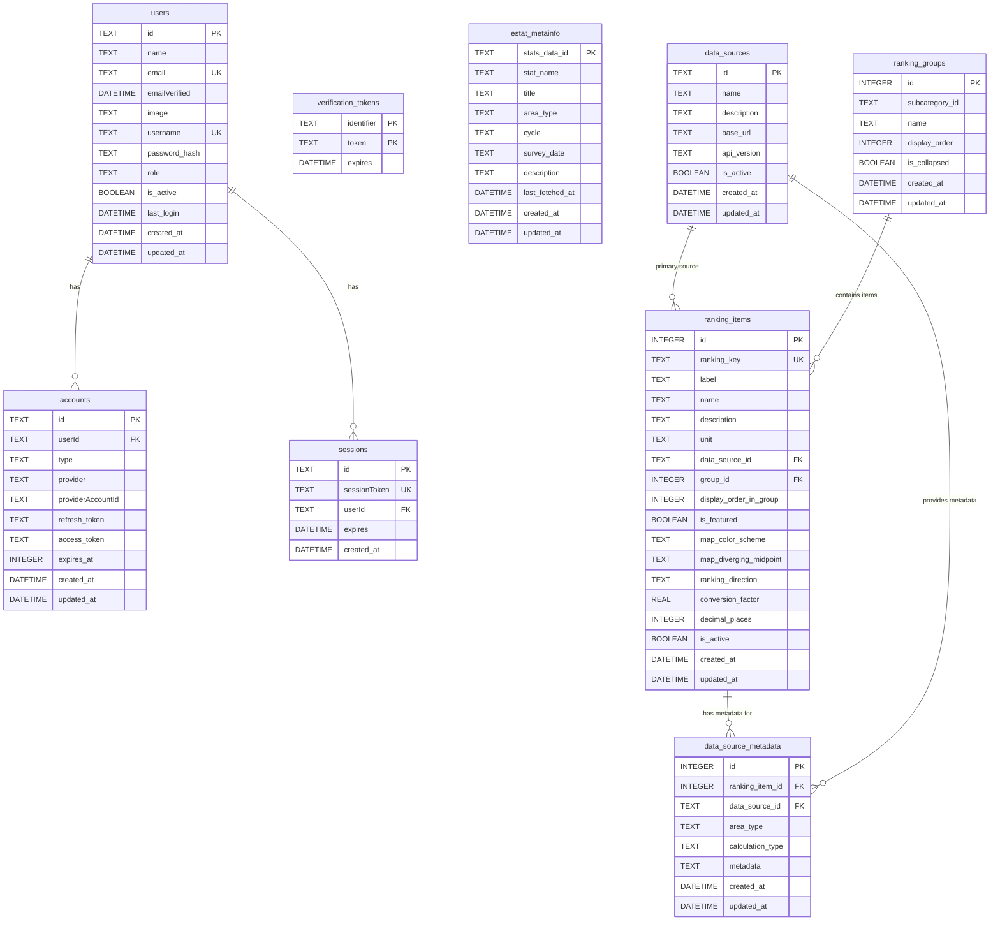

# データベース設計

## 概要

stats47 プロジェクトでは、Cloudflare D1（SQLite）を基盤とした統合データベース設計を採用しています。

## データベースアーキテクチャ

### 環境別データソース戦略

| 環境            | データソース  | 接続方法                    | 用途                      |
| --------------- | ------------- | --------------------------- | ------------------------- |
| **mock**        | JSON ファイル | `data/mock/database/*.json` | オフライン開発、Storybook |
| **development** | ローカル D1   | `.wrangler/state/v3/d1`     | ローカル開発              |
| **staging**     | リモート D1   | Cloudflare D1 API           | 本番前テスト              |
| **production**  | リモート D1   | Cloudflare D1 API           | 本番運用                  |

### 最新の改善 (2025-01-27)

ランキンググループ機能を追加：

- `ranking_groups` テーブル: ランキング項目のグループ定義
- `ranking_group_items` テーブル: グループと項目の関連
- 関連する複数のランキング項目をグループ化して管理可能に

### データフロー

```
[Server Component]
        ↓
[Data Access Layer (自動環境判定)]
        ↓
    ┌───┴───┬────────┬──────────┐
    ↓       ↓        ↓          ↓
  [Mock] [Local D1] [Remote D1] [Remote D1]
  (JSON)  (SQLite)  (Staging)   (Production)
```

## テーブル設計

### 1. 認証・ユーザー管理（Auth.js 準拠）

#### users

ユーザー認証・管理テーブル（Auth.js 準拠）

| カラム名      | データ型 | 制約        | デフォルト値      | 説明                 |
| ------------- | -------- | ----------- | ----------------- | -------------------- |
| id            | TEXT     | PRIMARY KEY | -                 | ユーザー ID (UUID)   |
| name          | TEXT     | -           | NULL              | ユーザー名           |
| email         | TEXT     | UNIQUE      | -                 | メールアドレス       |
| emailVerified | DATETIME | -           | NULL              | メール認証日時       |
| image         | TEXT     | -           | NULL              | プロフィール画像 URL |
| username      | TEXT     | UNIQUE      | NULL              | ユーザー名           |
| password_hash | TEXT     | -           | NULL              | パスワードハッシュ   |
| role          | TEXT     | -           | 'user'            | ロール               |
| is_active     | BOOLEAN  | -           | 1                 | アクティブフラグ     |
| last_login    | DATETIME | -           | NULL              | 最終ログイン日時     |
| created_at    | DATETIME | -           | CURRENT_TIMESTAMP | 作成日時             |
| updated_at    | DATETIME | -           | CURRENT_TIMESTAMP | 更新日時             |

**インデックス**:
- `idx_users_username` ON users(username)
- `idx_users_email` ON users(email)

```sql
CREATE TABLE users (
  id TEXT PRIMARY KEY,
  name TEXT,
  email TEXT UNIQUE NOT NULL,
  emailVerified DATETIME,
  image TEXT,
  username TEXT UNIQUE,
  password_hash TEXT,
  role TEXT DEFAULT 'user',
  is_active BOOLEAN DEFAULT 1,
  last_login DATETIME,
  created_at DATETIME DEFAULT CURRENT_TIMESTAMP,
  updated_at DATETIME DEFAULT CURRENT_TIMESTAMP
);

CREATE INDEX idx_users_username ON users(username);
CREATE INDEX idx_users_email ON users(email);
```

#### accounts

Auth.js アカウント連携テーブル

| カラム名          | データ型 | 制約        | デフォルト値      | 説明                 |
| ----------------- | -------- | ----------- | ----------------- | -------------------- |
| id                | TEXT     | PRIMARY KEY | -                 | アカウント ID        |
| userId            | TEXT     | NOT NULL    | -                 | ユーザー ID          |
| type              | TEXT     | NOT NULL    | -                 | アカウントタイプ     |
| provider          | TEXT     | NOT NULL    | -                 | プロバイダー名       |
| providerAccountId | TEXT     | NOT NULL    | -                 | プロバイダー ID      |
| refresh_token     | TEXT     | -           | NULL              | リフレッシュトークン |
| access_token      | TEXT     | -           | NULL              | アクセストークン     |
| expires_at        | INTEGER  | -           | NULL              | 有効期限             |
| token_type        | TEXT     | -           | NULL              | トークンタイプ       |
| scope             | TEXT     | -           | NULL              | スコープ             |
| id_token          | TEXT     | -           | NULL              | ID トークン          |
| session_state     | TEXT     | -           | NULL              | セッション状態       |
| created_at        | DATETIME | -           | CURRENT_TIMESTAMP | 作成日時             |
| updated_at        | DATETIME | -           | CURRENT_TIMESTAMP | 更新日時             |

**外部キー**: `userId` → `users(id)` ON DELETE CASCADE

**インデックス**: `idx_accounts_provider` ON accounts(provider, providerAccountId)

```sql
CREATE TABLE accounts (
  id TEXT PRIMARY KEY,
  userId TEXT NOT NULL,
  type TEXT NOT NULL,
  provider TEXT NOT NULL,
  providerAccountId TEXT NOT NULL,
  refresh_token TEXT,
  access_token TEXT,
  expires_at INTEGER,
  token_type TEXT,
  scope TEXT,
  id_token TEXT,
  session_state TEXT,
  created_at DATETIME DEFAULT CURRENT_TIMESTAMP,
  updated_at DATETIME DEFAULT CURRENT_TIMESTAMP,
  FOREIGN KEY (userId) REFERENCES users(id) ON DELETE CASCADE
);

CREATE INDEX idx_accounts_provider ON accounts(provider, providerAccountId);
```

#### sessions

Auth.js セッション管理テーブル

| カラム名     | データ型 | 制約            | デフォルト値      | 説明               |
| ------------ | -------- | --------------- | ----------------- | ------------------ |
| id           | TEXT     | PRIMARY KEY     | -                 | セッション ID      |
| sessionToken | TEXT     | UNIQUE NOT NULL | -                 | セッショントークン |
| userId       | TEXT     | NOT NULL        | -                 | ユーザー ID        |
| expires      | DATETIME | NOT NULL        | -                 | 有効期限           |
| created_at   | DATETIME | -               | CURRENT_TIMESTAMP | 作成日時           |

**外部キー**: `userId` → `users(id)` ON DELETE CASCADE

**インデックス**:
- `idx_sessions_userId` ON sessions(userId)
- `idx_sessions_sessionToken` ON sessions(sessionToken)

```sql
CREATE TABLE sessions (
  id TEXT PRIMARY KEY,
  sessionToken TEXT UNIQUE NOT NULL,
  userId TEXT NOT NULL,
  expires DATETIME NOT NULL,
  created_at DATETIME DEFAULT CURRENT_TIMESTAMP,
  FOREIGN KEY (userId) REFERENCES users(id) ON DELETE CASCADE
);

CREATE INDEX idx_sessions_userId ON sessions(userId);
CREATE INDEX idx_sessions_sessionToken ON sessions(sessionToken);
```

#### verification_tokens

認証トークンテーブル

| カラム名   | データ型 | 制約               | デフォルト値 | 説明                 |
| ---------- | -------- | ------------------ | ------------ | -------------------- |
| identifier | TEXT     | PRIMARY KEY (複合) | -            | 識別子（メールなど） |
| token      | TEXT     | PRIMARY KEY (複合) | -            | トークン             |
| expires    | DATETIME | NOT NULL           | -            | 有効期限             |

```sql
CREATE TABLE verification_tokens (
  identifier TEXT,
  token TEXT,
  expires DATETIME NOT NULL,
  PRIMARY KEY (identifier, token)
);
```

### 2. e-Stat API 関連

#### estat_metainfo

e-Stat メタデータテーブル（統計表レベル管理）

| カラム名        | データ型 | 制約        | デフォルト値      | 説明                |
| --------------- | -------- | ----------- | ----------------- | ------------------- |
| stats_data_id   | TEXT     | PRIMARY KEY | -                 | 統計表 ID（主キー） |
| stat_name       | TEXT     | NOT NULL    | -                 | 統計調査名          |
| title           | TEXT     | NOT NULL    | -                 | 統計表タイトル      |
| area_type       | TEXT     | NOT NULL    | 'country'         | 地域レベル          |
| cycle           | TEXT     | -           | NULL              | 調査周期            |
| survey_date     | TEXT     | -           | NULL              | 調査年月            |
| description     | TEXT     | -           | NULL              | 説明                |
| last_fetched_at | DATETIME | -           | CURRENT_TIMESTAMP | 最終取得日時        |
| created_at      | DATETIME | -           | CURRENT_TIMESTAMP | 作成日時            |
| updated_at      | DATETIME | -           | CURRENT_TIMESTAMP | 更新日時            |

**インデックス**:
- `idx_estat_metainfo_stat_name` ON estat_metainfo(stat_name)
- `idx_estat_metainfo_title` ON estat_metainfo(title)
- `idx_estat_metainfo_area_type` ON estat_metainfo(area_type)
- `idx_estat_metainfo_updated_at` ON estat_metainfo(updated_at)

```sql
CREATE TABLE estat_metainfo (
  stats_data_id TEXT PRIMARY KEY,
  stat_name TEXT NOT NULL,
  title TEXT NOT NULL,
  area_type TEXT NOT NULL DEFAULT 'country',
  cycle TEXT,
  survey_date TEXT,
  description TEXT,
  last_fetched_at DATETIME DEFAULT CURRENT_TIMESTAMP,
  created_at DATETIME DEFAULT CURRENT_TIMESTAMP,
  updated_at DATETIME DEFAULT CURRENT_TIMESTAMP
);

CREATE INDEX idx_estat_metainfo_stat_name ON estat_metainfo(stat_name);
CREATE INDEX idx_estat_metainfo_title ON estat_metainfo(title);
CREATE INDEX idx_estat_metainfo_area_type ON estat_metainfo(area_type);
CREATE INDEX idx_estat_metainfo_updated_at ON estat_metainfo(updated_at);
```

### 3. ランキング管理

#### data_sources

データソース定義テーブル

| カラム名    | データ型 | 制約        | デフォルト値      | 説明             |
| ----------- | -------- | ----------- | ----------------- | ---------------- |
| id          | TEXT     | PRIMARY KEY | -                 | データソース ID  |
| name        | TEXT     | NOT NULL    | -                 | 名称             |
| description | TEXT     | -           | NULL              | 説明             |
| base_url    | TEXT     | -           | NULL              | ベース URL       |
| api_version | TEXT     | -           | NULL              | API バージョン   |
| is_active   | BOOLEAN  | -           | 1                 | アクティブフラグ |
| created_at  | DATETIME | -           | CURRENT_TIMESTAMP | 作成日時         |
| updated_at  | DATETIME | -           | CURRENT_TIMESTAMP | 更新日時         |

```sql
CREATE TABLE data_sources (
  id TEXT PRIMARY KEY,
  name TEXT NOT NULL,
  description TEXT,
  base_url TEXT,
  api_version TEXT,
  is_active BOOLEAN DEFAULT 1,
  created_at DATETIME DEFAULT CURRENT_TIMESTAMP,
  updated_at DATETIME DEFAULT CURRENT_TIMESTAMP
);
```

#### ranking_items

ランキング項目設定テーブル（可視化設定を含む統合テーブル）

| カラム名               | データ型 | 制約                      | デフォルト値       | 説明                       |
| ---------------------- | -------- | ------------------------- | ------------------ | -------------------------- |
| id                     | INTEGER  | PRIMARY KEY AUTOINCREMENT | -                  | 項目 ID                    |
| ranking_key            | TEXT     | NOT NULL UNIQUE           | -                  | ランキングキー             |
| label                  | TEXT     | NOT NULL                  | -                  | 表示ラベル                 |
| name                   | TEXT     | NOT NULL                  | -                  | 正式名称                   |
| description            | TEXT     | -                         | NULL               | 説明                       |
| unit                   | TEXT     | NOT NULL                  | -                  | 単位                       |
| data_source_id         | TEXT     | NOT NULL                  | -                  | データソース ID            |
| group_id               | INTEGER  | -                         | NULL               | ランキンググループ ID      |
| display_order_in_group | INTEGER  | -                         | 0                  | グループ内での表示順       |
| is_featured            | BOOLEAN  | -                         | 0                  | おすすめフラグ             |
| map_color_scheme       | TEXT     | -                         | 'interpolateBlues' | 地図の色スキーム           |
| map_diverging_midpoint | TEXT     | -                         | 'zero'             | 色の分岐点設定             |
| ranking_direction      | TEXT     | -                         | 'desc'             | ランキング方向（asc/desc） |
| conversion_factor      | REAL     | -                         | 1                  | 変換係数                   |
| decimal_places         | INTEGER  | -                         | 0                  | 小数点以下桁数             |
| is_active              | BOOLEAN  | -                         | 1                  | アクティブフラグ           |
| created_at             | DATETIME | -                         | CURRENT_TIMESTAMP  | 作成日時                   |
| updated_at             | DATETIME | -                         | CURRENT_TIMESTAMP  | 更新日時                   |

**外部キー**:
- `data_source_id` → `data_sources(id)`
- `group_id` → `ranking_groups(id)` (オプショナル)

**インデックス**:
- `idx_ranking_items_ranking_key` ON ranking_items(ranking_key)
- `idx_ranking_items_data_source` ON ranking_items(data_source_id)
- `idx_ranking_items_group` ON ranking_items(group_id)
- `idx_ranking_items_is_active` ON ranking_items(is_active)

```sql
CREATE TABLE ranking_items (
  id INTEGER PRIMARY KEY AUTOINCREMENT,
  ranking_key TEXT NOT NULL UNIQUE,
  label TEXT NOT NULL,
  name TEXT NOT NULL,
  description TEXT,
  unit TEXT NOT NULL,
  data_source_id TEXT NOT NULL,
  group_id INTEGER,
  display_order_in_group INTEGER DEFAULT 0,
  is_featured BOOLEAN DEFAULT 0,
  map_color_scheme TEXT DEFAULT 'interpolateBlues',
  map_diverging_midpoint TEXT DEFAULT 'zero',
  ranking_direction TEXT DEFAULT 'desc',
  conversion_factor REAL DEFAULT 1,
  decimal_places INTEGER DEFAULT 0,
  is_active BOOLEAN DEFAULT 1,
  created_at DATETIME DEFAULT CURRENT_TIMESTAMP,
  updated_at DATETIME DEFAULT CURRENT_TIMESTAMP,
  FOREIGN KEY (data_source_id) REFERENCES data_sources(id),
  FOREIGN KEY (group_id) REFERENCES ranking_groups(id)
);

CREATE INDEX idx_ranking_items_ranking_key ON ranking_items(ranking_key);
CREATE INDEX idx_ranking_items_data_source ON ranking_items(data_source_id);
CREATE INDEX idx_ranking_items_group ON ranking_items(group_id);
CREATE INDEX idx_ranking_items_is_active ON ranking_items(is_active);
```

#### data_source_metadata

データソース固有メタデータテーブル（拡張版：地域レベル別、計算タイプ対応）

| カラム名         | データ型 | 制約                      | デフォルト値      | 説明                                   |
| ---------------- | -------- | ------------------------- | ----------------- | -------------------------------------- |
| id               | INTEGER  | PRIMARY KEY AUTOINCREMENT | -                 | メタデータ ID                          |
| ranking_item_id  | INTEGER  | NOT NULL                  | -                 | ランキング項目 ID                      |
| data_source_id   | TEXT     | NOT NULL                  | -                 | データソース ID                        |
| area_type        | TEXT     | NOT NULL                  | -                 | 地域レベル（prefecture/city/national） |
| calculation_type | TEXT     | NOT NULL                  | 'direct'          | 計算タイプ（direct/ratio/aggregate）   |
| metadata         | TEXT     | NOT NULL                  | -                 | データソース固有パラメータ（JSON）     |
| created_at       | DATETIME | -                         | CURRENT_TIMESTAMP | 作成日時                               |
| updated_at       | DATETIME | -                         | CURRENT_TIMESTAMP | 更新日時                               |

**外部キー**:
- `ranking_item_id` → `ranking_items(id)` ON DELETE CASCADE
- `data_source_id` → `data_sources(id)`

**UNIQUE 制約**: `(ranking_item_id, data_source_id, area_type)`

**CHECK 制約**:
- `area_type IN ('prefecture', 'city', 'national')`
- `calculation_type IN ('direct', 'ratio', 'aggregate')`

**インデックス**:
- `idx_data_source_metadata_ranking` ON data_source_metadata(ranking_item_id)
- `idx_data_source_metadata_source` ON data_source_metadata(data_source_id)
- `idx_data_source_metadata_area` ON data_source_metadata(area_type)

**metadata JSON構造例**:

```json
// 直接ランキング (calculation_type='direct')
{
  "stats_data_id": "0000010102",
  "cd_cat01": "B1101",
  "cd_area": "00000"
}

// 計算ランキング (calculation_type='ratio')
{
  "numerator": {
    "source_key": "population",
    "stats_data_id": "0000010102",
    "cd_cat01": "A1101"
  },
  "denominator": {
    "source_key": "area",
    "stats_data_id": "0000020101",
    "cd_cat01": "B1101"
  },
  "multiplier": 1000,
  "decimal_places": 2
}
```

```sql
CREATE TABLE data_source_metadata (
  id INTEGER PRIMARY KEY AUTOINCREMENT,
  ranking_item_id INTEGER NOT NULL,
  data_source_id TEXT NOT NULL,
  area_type TEXT NOT NULL,
  calculation_type TEXT NOT NULL DEFAULT 'direct',
  metadata TEXT NOT NULL,
  created_at DATETIME DEFAULT CURRENT_TIMESTAMP,
  updated_at DATETIME DEFAULT CURRENT_TIMESTAMP,
  UNIQUE(ranking_item_id, data_source_id, area_type),
  CHECK (area_type IN ('prefecture', 'city', 'national')),
  CHECK (calculation_type IN ('direct', 'ratio', 'aggregate')),
  FOREIGN KEY (ranking_item_id) REFERENCES ranking_items(id) ON DELETE CASCADE,
  FOREIGN KEY (data_source_id) REFERENCES data_sources(id)
);

CREATE INDEX idx_data_source_metadata_ranking ON data_source_metadata(ranking_item_id);
CREATE INDEX idx_data_source_metadata_source ON data_source_metadata(data_source_id);
CREATE INDEX idx_data_source_metadata_area ON data_source_metadata(area_type);
```

#### ranking_groups

ランキンググループ定義テーブル（サブカテゴリとランキング項目の中間層）

| カラム名       | データ型 | 制約                      | デフォルト値      | 説明             |
| -------------- | -------- | ------------------------- | ----------------- | ---------------- |
| id             | INTEGER  | PRIMARY KEY AUTOINCREMENT | -                 | グループ ID      |
| subcategory_id | TEXT     | NOT NULL                  | -                 | サブカテゴリ ID  |
| name           | TEXT     | NOT NULL                  | -                 | グループ名       |
| display_order  | INTEGER  | -                         | 0                 | 表示順序         |
| is_collapsed   | BOOLEAN  | -                         | 0                 | 折りたたみフラグ |
| created_at     | DATETIME | -                         | CURRENT_TIMESTAMP | 作成日時         |
| updated_at     | DATETIME | -                         | CURRENT_TIMESTAMP | 更新日時         |

**インデックス**:
- `idx_ranking_groups_subcategory` ON ranking_groups(subcategory_id)
- `idx_ranking_groups_order` ON ranking_groups(subcategory_id, display_order)

**設計意図**: サブカテゴリとランキング項目を紐付ける中間層。グループ単位での表示制御・折りたたみ機能を提供。

**階層構造**:
```
サブカテゴリ（subcategory_id）
  └─ ranking_groups（グループ定義）
      └─ ranking_items（ランキング項目、group_id で紐付け）
```

```sql
CREATE TABLE ranking_groups (
  id INTEGER PRIMARY KEY AUTOINCREMENT,
  subcategory_id TEXT NOT NULL,
  name TEXT NOT NULL,
  display_order INTEGER DEFAULT 0,
  is_collapsed BOOLEAN DEFAULT 0,
  created_at DATETIME DEFAULT CURRENT_TIMESTAMP,
  updated_at DATETIME DEFAULT CURRENT_TIMESTAMP
);

CREATE INDEX idx_ranking_groups_subcategory ON ranking_groups(subcategory_id);
CREATE INDEX idx_ranking_groups_order ON ranking_groups(subcategory_id, display_order);
```

> **注意**: `ranking_items`テーブルには可視化設定（`map_color_scheme`, `map_diverging_midpoint`, `ranking_direction`等）が統合されています。以前の`ranking_visualizations`テーブルは不要となり、マイグレーション 002/004 で統合されました。

### 4. 地図可視化

#### choropleth_data

```sql
CREATE TABLE choropleth_data (
  id TEXT PRIMARY KEY,
  area_code TEXT NOT NULL,
  area_name TEXT NOT NULL,
  area_type TEXT NOT NULL,
  geometry JSON,
  created_at DATETIME DEFAULT CURRENT_TIMESTAMP,
  updated_at DATETIME DEFAULT CURRENT_TIMESTAMP
);
```

### 5. 時系列データ

#### time_series_data

```sql
CREATE TABLE time_series_data (
  id TEXT PRIMARY KEY,
  indicator_id TEXT NOT NULL,
  area_code TEXT NOT NULL,
  year INTEGER NOT NULL,
  value REAL NOT NULL,
  metadata JSON,
  created_at DATETIME DEFAULT CURRENT_TIMESTAMP,
  updated_at DATETIME DEFAULT CURRENT_TIMESTAMP,
  UNIQUE(indicator_id, area_code, year)
);
```

#### trend_analysis

```sql
CREATE TABLE trend_analysis (
  id TEXT PRIMARY KEY,
  indicator_id TEXT NOT NULL,
  area_code TEXT NOT NULL,
  start_year INTEGER NOT NULL,
  end_year INTEGER NOT NULL,
  trend_type TEXT NOT NULL, -- 'linear_regression', 'moving_average'
  equation JSON, -- {slope, intercept, rSquared}
  created_at DATETIME DEFAULT CURRENT_TIMESTAMP,
  updated_at DATETIME DEFAULT CURRENT_TIMESTAMP,
  UNIQUE(indicator_id, area_code, start_year, end_year, trend_type)
);
```

#### cagr_calculations

```sql
CREATE TABLE cagr_calculations (
  id TEXT PRIMARY KEY,
  indicator_id TEXT NOT NULL,
  area_code TEXT NOT NULL,
  start_year INTEGER NOT NULL,
  end_year INTEGER NOT NULL,
  start_value REAL NOT NULL,
  end_value REAL NOT NULL,
  cagr REAL NOT NULL,
  is_valid BOOLEAN NOT NULL DEFAULT TRUE,
  created_at DATETIME DEFAULT CURRENT_TIMESTAMP,
  updated_at DATETIME DEFAULT CURRENT_TIMESTAMP,
  UNIQUE(indicator_id, area_code, start_year, end_year)
);
```

## ER図



### 6. 地理データ

#### geo_shapes

```sql
CREATE TABLE geo_shapes (
  id TEXT PRIMARY KEY,
  area_code TEXT NOT NULL, -- 市区町村ID（歴史的行政区域データセット）
  standard_area_code TEXT, -- 標準地域コード（e-Stat対応）
  area_name TEXT NOT NULL,
  area_type TEXT NOT NULL, -- 'prefecture', 'municipality'
  year INTEGER, -- 適用年度（歴史的データの場合）
  topojson JSON NOT NULL,
  bounding_box JSON, -- {minLat, maxLat, minLng, maxLng}
  representative_point JSON, -- {lat, lng} 代表点
  properties JSON, -- {population, area, etc.}
  data_source TEXT DEFAULT 'geoshape_codh', -- 'geoshape_codh', 'ksj'
  data_version TEXT, -- データバージョン
  last_updated DATE, -- データ更新日
  created_at DATETIME DEFAULT CURRENT_TIMESTAMP,
  updated_at DATETIME DEFAULT CURRENT_TIMESTAMP,
  UNIQUE(area_code, year, data_source)
);
```

#### area_boundaries

```sql
CREATE TABLE area_boundaries (
  id TEXT PRIMARY KEY,
  area_code TEXT NOT NULL,
  parent_area_code TEXT,
  level INTEGER NOT NULL, -- 1: 国, 2: 地方, 3: 都道府県, 4: 市区町村
  name TEXT NOT NULL,
  name_kana TEXT,
  name_romaji TEXT,
  created_at DATETIME DEFAULT CURRENT_TIMESTAMP,
  updated_at DATETIME DEFAULT CURRENT_TIMESTAMP,
  UNIQUE(area_code)
);

-- ユーザーのベースマップ設定（Phase 2以降で検討）
CREATE TABLE user_map_preferences (
  id INTEGER PRIMARY KEY AUTOINCREMENT,
  user_id TEXT,
  basemap_type TEXT DEFAULT 'std', -- 'std', 'pale', 'blank', 'photo'
  default_zoom INTEGER DEFAULT 5,
  default_center_lat REAL DEFAULT 36.5,
  default_center_lng REAL DEFAULT 138.0,
  created_at DATETIME DEFAULT CURRENT_TIMESTAMP,
  updated_at DATETIME DEFAULT CURRENT_TIMESTAMP,
  UNIQUE(user_id)
);
```

## インデックス設計

### パフォーマンス最適化

```sql
-- estat_metainfo
CREATE INDEX idx_estat_metainfo_category ON estat_metainfo(category_code);
CREATE INDEX idx_estat_metainfo_subcategory ON estat_metainfo(subcategory_code);
CREATE INDEX idx_estat_metainfo_area_type ON estat_metainfo(area_type);

-- estat_data_history
CREATE INDEX idx_estat_data_stats_code ON estat_data_history(stats_code);
CREATE INDEX idx_estat_data_area_code ON estat_data_history(area_code);
CREATE INDEX idx_estat_data_date ON estat_data_history(data_date);

-- ranking_items
CREATE INDEX idx_ranking_items_key ON ranking_items(ranking_key);

-- choropleth_data
CREATE INDEX idx_choropleth_area_code ON choropleth_data(area_code);
CREATE INDEX idx_choropleth_area_type ON choropleth_data(area_type);

-- time_series_data
CREATE INDEX idx_time_series_data_indicator ON time_series_data(indicator_id);
CREATE INDEX idx_time_series_data_area ON time_series_data(area_code);
CREATE INDEX idx_time_series_data_year ON time_series_data(year);
CREATE INDEX idx_time_series_data_indicator_area ON time_series_data(indicator_id, area_code);
CREATE INDEX idx_time_series_data_indicator_year ON time_series_data(indicator_id, year);

-- trend_analysis
CREATE INDEX idx_trend_analysis_indicator ON trend_analysis(indicator_id);
CREATE INDEX idx_trend_analysis_area ON trend_analysis(area_code);
CREATE INDEX idx_trend_analysis_period ON trend_analysis(start_year, end_year);

-- cagr_calculations
CREATE INDEX idx_cagr_calculations_indicator ON cagr_calculations(indicator_id);
CREATE INDEX idx_cagr_calculations_area ON cagr_calculations(area_code);
CREATE INDEX idx_cagr_calculations_period ON cagr_calculations(start_year, end_year);

-- geo_shapes
CREATE INDEX idx_geo_shapes_area_code ON geo_shapes(area_code);
CREATE INDEX idx_geo_shapes_standard_area_code ON geo_shapes(standard_area_code);
CREATE INDEX idx_geo_shapes_year ON geo_shapes(year);
CREATE INDEX idx_geo_shapes_area_type_year ON geo_shapes(area_type, year);

-- area_boundaries
CREATE INDEX idx_area_boundaries_area_code ON area_boundaries(area_code);
CREATE INDEX idx_area_boundaries_parent ON area_boundaries(parent_area_code);
CREATE INDEX idx_area_boundaries_level ON area_boundaries(level);

-- user_map_preferences
CREATE INDEX idx_user_map_preferences_user_id ON user_map_preferences(user_id);
CREATE INDEX idx_user_map_preferences_basemap_type ON user_map_preferences(basemap_type);
```

## データアクセス層

### 環境別データソース選択

```typescript
// src/lib/database/client.ts
import { getRequestContext } from "@cloudflare/next-on-pages";

/**
 * D1データベース接続を取得する純粋関数
 * @returns D1Database インスタンス
 */
export function getD1Database(): D1Database {
  const { env } = getRequestContext();
  return env.STATS47_DB;
}

/**
 * 環境に応じたデータソースを判定
 * @returns データソースタイプ
 */
export function detectDataSource(): "mock" | "local" | "remote" {
  const env = process.env.NEXT_PUBLIC_ENV;

  switch (env) {
    case "mock":
      return "mock";
    case "development":
      return "local";
    case "staging":
    case "production":
      return "remote";
    default:
      return "local";
  }
}
```

### データソース抽象化

```typescript
/**
 * D1データベースからクエリを実行
 * @param db D1Database インスタンス
 * @param sql SQLクエリ
 * @param params バインドパラメータ
 * @returns クエリ結果
 */
export async function executeQuery<T>(
  db: D1Database,
  sql: string,
  params: any[] = []
): Promise<T[]> {
  const result = await db
    .prepare(sql)
    .bind(...params)
    .all();
  return result.results as T[];
}

/**
 * 単一レコードを取得
 * @param db D1Database インスタンス
 * @param sql SQLクエリ
 * @param params バインドパラメータ
 * @returns 単一レコード
 */
export async function fetchFirst<T>(
  db: D1Database,
  sql: string,
  params: any[] = []
): Promise<T | null> {
  const result = await db
    .prepare(sql)
    .bind(...params)
    .first<T>();
  return result;
}

/**
 * バッチクエリを実行
 * @param db D1Database インスタンス
 * @param statements D1PreparedStatement配列
 * @returns バッチ実行結果
 */
export async function executeBatch(
  db: D1Database,
  statements: D1PreparedStatement[]
): Promise<D1Result[]> {
  return await db.batch(statements);
}
```

## マイグレーション管理

### マイグレーションファイル

```
database/migrations/
├── 001_auth_js_integration.sql
├── 002_add_visualization_to_ranking_items.sql
├── 003_remove_unused_columns_from_estat_ranking_values.sql
└── ...
```

### マイグレーション実行

```bash
# 開発環境
npm run db:migrate:dev

# ステージング環境
npm run db:migrate:staging

# 本番環境
npm run db:migrate:prod
```

## 設計原則

### 正規化

- **第3正規形**: データの冗長性を排除
- **適切な正規化**: パフォーマンスと正規化のバランス
- **外部キー**: 論理的な関係性の維持

### インデックス戦略

#### プライマリインデックス

- 全テーブルで `id` カラムにプライマリインデックス
- `users` テーブルで `id` (UUID) にプライマリインデックス

#### セカンダリインデックス

- **検索頻度の高いカラム**: `email`, `stats_data_id`, `ranking_key`
- **ソート用カラム**: `created_at`, `updated_at`, `sort_order`
- **フィルタ用カラム**: `is_active`, `category`, `subcategory`

#### 複合インデックス

```sql
-- 統計調査名とタイトルでの検索用
CREATE INDEX idx_estat_metainfo_stat_title
ON estat_metainfo(stat_name, title);

-- ランキングキーとアクティブフラグでの検索用
CREATE INDEX idx_ranking_items_key_active
ON ranking_items(ranking_key, is_active);
```

### セキュリティ

#### データ保護

1. **暗号化**: 機密データの暗号化
2. **アクセス制御**: ユーザーレベルの権限管理
3. **監査ログ**: データ変更の追跡

#### SQL インジェクション対策

1. **プリペアドステートメント**: パラメータ化クエリの使用
2. **入力検証**: ユーザー入力の検証
3. **エスケープ処理**: 特殊文字の適切な処理

### パフォーマンス考慮

#### クエリ最適化

1. **インデックスヒント**: 適切なインデックスを使用
2. **LIMIT句**: 大量データ取得時はLIMITを設定
3. **WHERE句**: インデックス付きカラムでの絞り込み

#### データサイズ管理

1. **JSONデータ**: 大きなJSONデータは別テーブルに分離を検討
2. **履歴データ**: 古い履歴データのアーカイブ
3. **ログローテーション**: ログテーブルの定期クリーンアップ

## データ整合性

### 制約とバリデーション

```sql
-- 外部キー制約
ALTER TABLE data_source_metadata
ADD CONSTRAINT fk_metadata_ranking_item
FOREIGN KEY (ranking_item_id) REFERENCES ranking_items(id) ON DELETE CASCADE;

ALTER TABLE data_source_metadata
ADD CONSTRAINT fk_metadata_data_source
FOREIGN KEY (data_source_id) REFERENCES data_sources(id);

-- チェック制約
ALTER TABLE users
ADD CONSTRAINT chk_user_role
CHECK (role IN ('user', 'admin', 'developer'));

ALTER TABLE data_source_metadata
ADD CONSTRAINT chk_area_type
CHECK (area_type IN ('prefecture', 'city', 'national'));

ALTER TABLE data_source_metadata
ADD CONSTRAINT chk_calculation_type
CHECK (calculation_type IN ('direct', 'ratio', 'aggregate'));

-- ユニーク制約
ALTER TABLE data_source_metadata
ADD CONSTRAINT uk_metadata_unique
UNIQUE (ranking_item_id, data_source_id, area_type);
```

### データバリデーション

```typescript
// src/infrastructure/database/validation.ts
export class DataValidator {
  static validateEstatMetaInfo(data: EstatMetaInfo): ValidationResult {
    const errors: string[] = [];

    if (!data.stats_code || data.stats_code.length === 0) {
      errors.push("stats_code is required");
    }

    if (!data.stats_name || data.stats_name.length === 0) {
      errors.push("stats_name is required");
    }

    if (!data.category_code || data.category_code.length === 0) {
      errors.push("category_code is required");
    }

    return {
      isValid: errors.length === 0,
      errors,
    };
  }
}
```

## パフォーマンス最適化

### クエリ最適化

1. **インデックスの活用**: 適切なインデックスの設定
2. **クエリの最適化**: 不要な JOIN の削除
3. **ページネーション**: 大量データの分割読み込み
4. **キャッシング**: 頻繁にアクセスされるデータのキャッシュ

### 接続プール

```typescript
// src/infrastructure/database/pool.ts
export class ConnectionPool {
  private static instance: ConnectionPool;
  private connections: D1Database[] = [];
  private maxConnections = 10;

  static getInstance(): ConnectionPool {
    if (!ConnectionPool.instance) {
      ConnectionPool.instance = new ConnectionPool();
    }
    return ConnectionPool.instance;
  }

  async getConnection(): Promise<D1Database> {
    if (this.connections.length > 0) {
      return this.connections.pop()!;
    }

    return getD1Database();
  }

  releaseConnection(connection: D1Database): void {
    if (this.connections.length < this.maxConnections) {
      this.connections.push(connection);
    }
  }
}
```

## バックアップ・復旧

### バックアップ戦略

1. **定期バックアップ**: 日次での自動バックアップ
2. **増分バックアップ**: 変更分のみのバックアップ
3. **クロスリージョン**: 複数リージョンでのバックアップ保存

### 復旧手順

```bash
# バックアップからの復旧
npm run db:restore:backup

# 特定時点への復旧
npm run db:restore:point-in-time --date=2024-01-20
```

## 監視・ログ

### パフォーマンス監視

1. **クエリ実行時間**: 遅いクエリの特定
2. **接続数**: 同時接続数の監視
3. **エラー率**: データベースエラーの監視

### ログ設定

```typescript
// src/infrastructure/database/logger.ts
export class DatabaseLogger {
  static logQuery(sql: string, params: any[], executionTime: number): void {
    console.log({
      type: "database_query",
      sql,
      params,
      executionTime,
      timestamp: new Date().toISOString(),
    });
  }

  static logError(error: Error, sql: string, params: any[]): void {
    console.error({
      type: "database_error",
      error: error.message,
      sql,
      params,
      timestamp: new Date().toISOString(),
    });
  }
}
```

## ビュー設計

### v_estat_metainfo_summary

統計表サマリービュー

```sql
CREATE VIEW v_estat_metainfo_summary AS
SELECT
  stats_data_id,
  stat_name,
  title,
  area_type,
  cycle,
  survey_date,
  last_fetched_at,
  created_at,
  updated_at
FROM estat_metainfo
ORDER BY updated_at DESC;
```

## データ型の詳細

### SQLite データ型

| 定義     | 実際の型 | 説明                |
| -------- | -------- | ------------------- |
| INTEGER  | INTEGER  | 整数                |
| TEXT     | TEXT     | テキスト            |
| DATETIME | TEXT     | 日時 (ISO8601 形式) |
| BOOLEAN  | INTEGER  | 真偽値 (0/1)        |
| REAL     | REAL     | 浮動小数点数        |

### カスタム型

- **UUID**: TEXT 型で UUID 形式の文字列を格納
- **JSON**: TEXT 型で JSON 形式の文字列を格納

## 関連ドキュメント

- [システムアーキテクチャ](../01_システム概要/02_システムアーキテクチャ.md)
- [D1実装ガイド](../../04_開発ガイド/03_インフラ/データベース/02_D1実装ガイド.md) - 実装・使い方
- [R2 ストレージ設計](./02_R2ストレージ設計.md)

## 更新履歴

- **v2.0.0** (2025-10-29): 詳細スキーマ定義、ER図、設計原則を統合
- **v1.0.0** (2025-01-20): 初版作成
