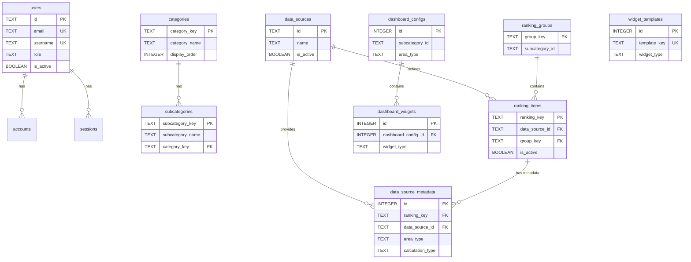

# データベース設計

## 概要

stats47 プロジェクトでは、Cloudflare D1（SQLite）を基盤とした統合データベース設計を採用しています。

### 環境別データソース戦略

| 環境            | データソース  | 接続方法                    | 用途                      |
| --------------- | ------------- | --------------------------- | ------------------------- |
| **mock**        | JSON ファイル | `data/mock/database/*.json` | オフライン開発、Storybook |
| **development** | ローカル D1   | `.wrangler/state/v3/d1`     | ローカル開発              |
| **staging**     | リモート D1   | Cloudflare D1 API           | 本番前テスト              |
| **production**  | リモート D1   | Cloudflare D1 API           | 本番運用                  |

---

## テーブル設計

テーブルは DDD（ドメイン駆動設計）の原則に従い、以下の順序で整理されています:

1. **汎用ドメイン**: 認証・ユーザー管理
2. **支援ドメイン**: カテゴリ、e-Stat、地理データ
3. **コアドメイン**: ランキング、可視化、時系列分析

---

## 1. 汎用ドメイン

### 1.1 認証・ユーザー管理（Auth.js 準拠）

#### users

ユーザー認証・管理テーブル

| カラム名      | データ型 | 制約        | デフォルト値      | 説明                 |
| ------------- | -------- | ----------- | ----------------- | -------------------- |
| id            | TEXT     | PRIMARY KEY | -                 | ユーザー ID (UUID)   |
| name          | TEXT     | -           | NULL              | ユーザー名           |
| email         | TEXT     | UNIQUE      | -                 | メールアドレス       |
| emailVerified | DATETIME | -           | NULL              | メール認証日時       |
| image         | TEXT     | -           | NULL              | プロフィール画像 URL |
| username      | TEXT     | UNIQUE      | NULL              | ユーザー名           |
| password_hash | TEXT     | -           | NULL              | パスワードハッシュ   |
| role          | TEXT     | -           | 'user'            | ロール               |
| is_active     | BOOLEAN  | -           | 1                 | アクティブフラグ     |
| last_login    | DATETIME | -           | NULL              | 最終ログイン日時     |
| created_at    | DATETIME | -           | CURRENT_TIMESTAMP | 作成日時             |
| updated_at    | DATETIME | -           | CURRENT_TIMESTAMP | 更新日時             |

**インデックス**:

- `idx_users_username` ON users(username)
- `idx_users_email` ON users(email)

#### accounts

Auth.js アカウント連携テーブル

| カラム名          | データ型 | 制約        | デフォルト値      | 説明                 |
| ----------------- | -------- | ----------- | ----------------- | -------------------- |
| id                | TEXT     | PRIMARY KEY | -                 | アカウント ID        |
| userId            | TEXT     | NOT NULL FK | -                 | ユーザー ID          |
| type              | TEXT     | NOT NULL    | -                 | アカウントタイプ     |
| provider          | TEXT     | NOT NULL    | -                 | プロバイダー名       |
| providerAccountId | TEXT     | NOT NULL    | -                 | プロバイダー ID      |
| refresh_token     | TEXT     | -           | NULL              | リフレッシュトークン |
| access_token      | TEXT     | -           | NULL              | アクセストークン     |
| expires_at        | INTEGER  | -           | NULL              | 有効期限             |
| token_type        | TEXT     | -           | NULL              | トークンタイプ       |
| scope             | TEXT     | -           | NULL              | スコープ             |
| id_token          | TEXT     | -           | NULL              | ID トークン          |
| session_state     | TEXT     | -           | NULL              | セッション状態       |
| created_at        | DATETIME | -           | CURRENT_TIMESTAMP | 作成日時             |
| updated_at        | DATETIME | -           | CURRENT_TIMESTAMP | 更新日時             |

**外部キー**: `userId` → `users(id)` ON DELETE CASCADE

**インデックス**: `idx_accounts_provider` ON accounts(provider, providerAccountId)

#### sessions

Auth.js セッション管理テーブル

| カラム名     | データ型 | 制約            | デフォルト値      | 説明               |
| ------------ | -------- | --------------- | ----------------- | ------------------ |
| id           | TEXT     | PRIMARY KEY     | -                 | セッション ID      |
| sessionToken | TEXT     | UNIQUE NOT NULL | -                 | セッショントークン |
| userId       | TEXT     | NOT NULL FK     | -                 | ユーザー ID        |
| expires      | DATETIME | NOT NULL        | -                 | 有効期限           |
| created_at   | DATETIME | -               | CURRENT_TIMESTAMP | 作成日時           |

**外部キー**: `userId` → `users(id)` ON DELETE CASCADE

**インデックス**:

- `idx_sessions_userId` ON sessions(userId)
- `idx_sessions_sessionToken` ON sessions(sessionToken)

#### verification_tokens

認証トークンテーブル

| カラム名   | データ型 | 制約               | デフォルト値 | 説明                 |
| ---------- | -------- | ------------------ | ------------ | -------------------- |
| identifier | TEXT     | PRIMARY KEY (複合) | -            | 識別子（メールなど） |
| token      | TEXT     | PRIMARY KEY (複合) | -            | トークン             |
| expires    | DATETIME | NOT NULL           | -            | 有効期限             |

---

## 2. 支援ドメイン

### 2.1 カテゴリ管理

#### categories

カテゴリ管理テーブル

| カラム名      | データ型 | 制約        | デフォルト値      | 説明         |
| ------------- | -------- | ----------- | ----------------- | ------------ |
| category_key  | TEXT     | PRIMARY KEY | -                 | カテゴリキー |
| category_name | TEXT     | NOT NULL    | -                 | 表示名       |
| icon          | TEXT     | -           | NULL              | アイコン     |
| display_order | INTEGER  | -           | 0                 | 表示順       |
| created_at    | DATETIME | -           | CURRENT_TIMESTAMP | 作成日時     |
| updated_at    | DATETIME | -           | CURRENT_TIMESTAMP | 更新日時     |

**インデックス**:

- `idx_categories_display_order` ON categories(display_order)

**設計ノート**: `category_key` を主キーとして使用（例: "population", "economy"）。`category_name`は表示名。

#### subcategories

サブカテゴリ管理テーブル

| カラム名         | データ型 | 制約        | デフォルト値      | 説明             |
| ---------------- | -------- | ----------- | ----------------- | ---------------- |
| subcategory_key  | TEXT     | PRIMARY KEY | -                 | サブカテゴリキー |
| subcategory_name | TEXT     | NOT NULL    | -                 | 表示名           |
| category_key     | TEXT     | NOT NULL FK | -                 | カテゴリキー     |
| display_order    | INTEGER  | -           | 0                 | 表示順           |
| created_at       | DATETIME | -           | CURRENT_TIMESTAMP | 作成日時         |
| updated_at       | DATETIME | -           | CURRENT_TIMESTAMP | 更新日時         |

**外部キー**: `category_key` → `categories(category_key)` ON DELETE CASCADE

**インデックス**:

- `idx_subcategories_category_key` ON subcategories(category_key)
- `idx_subcategories_display_order` ON subcategories(display_order)

**設計ノート**: `subcategory_key` を主キーとして使用（例: "basic-population", "labor-force"）。`category_key`でカテゴリと紐づける。

### 2.2 e-Stat API 関連

#### estat_metainfo

e-Stat メタデータテーブル（統計表レベル管理）

| カラム名            | データ型     | 制約          | デフォルト値            | 説明          |
| --------------- | -------- | ----------- | ----------------- | ----------- |
| stats_data_id   | TEXT     | PRIMARY KEY | -                 | 統計表 ID（主キー） |
| stat_name       | TEXT     | NOT NULL    | -                 | 統計調査名       |
| title           | TEXT     | NOT NULL    | -                 | 統計表タイトル     |
| area_type       | TEXT     | NOT NULL    | 'national'        | 地域レベル       |
| cycle           | TEXT     | -           | NULL              | 調査周期        |
| survey_date     | TEXT     | -           | NULL              | 調査年月        |
| description     | TEXT     | -           | NULL              | 説明          |
| last_fetched_at | DATETIME | -           | CURRENT_TIMESTAMP | 最終取得日時      |
| created_at      | DATETIME | -           | CURRENT_TIMESTAMP | 作成日時        |
| updated_at      | DATETIME | -           | CURRENT_TIMESTAMP | 更新日時        |

**CHECK 制約**: `area_type IN ('national', 'prefecture', 'city')`

**インデックス**:

- `idx_estat_metainfo_stat_name` ON estat_metainfo(stat_name)
- `idx_estat_metainfo_title` ON estat_metainfo(title)
- `idx_estat_metainfo_area_type` ON estat_metainfo(area_type)
- `idx_estat_metainfo_updated_at` ON estat_metainfo(updated_at)

---

## 3. コアドメイン

### 3.1 ランキング管理

#### data_sources

データソース定義テーブル

| カラム名    | データ型 | 制約        | デフォルト値      | 説明             |
| ----------- | -------- | ----------- | ----------------- | ---------------- |
| id          | TEXT     | PRIMARY KEY | -                 | データソース ID  |
| name        | TEXT     | NOT NULL    | -                 | 名称             |
| description | TEXT     | -           | NULL              | 説明             |
| base_url    | TEXT     | -           | NULL              | ベース URL       |
| api_version | TEXT     | -           | NULL              | API バージョン   |
| is_active   | BOOLEAN  | -           | 1                 | アクティブフラグ |
| created_at  | DATETIME | -           | CURRENT_TIMESTAMP | 作成日時         |
| updated_at  | DATETIME | -           | CURRENT_TIMESTAMP | 更新日時         |

**初期データ**:

- `estat`: e-Stat（政府統計の総合窓口）
- `custom`: カスタムデータ（ユーザー定義）

#### ranking_items

ランキング項目設定テーブル（可視化設定を含む統合テーブル）

| カラム名               | データ型 | 制約        | デフォルト値       | 説明                       |
| ---------------------- | -------- | ----------- | ------------------ | -------------------------- |
| ranking_key            | TEXT     | PRIMARY KEY | -                  | ランキングキー             |
| label                  | TEXT     | NOT NULL    | -                  | 表示ラベル                 |
| name                   | TEXT     | NOT NULL    | -                  | 正式名称                   |
| description            | TEXT     | -           | NULL               | 説明                       |
| unit                   | TEXT     | NOT NULL    | -                  | 単位                       |
| data_source_id         | TEXT     | NOT NULL FK | -                  | データソース ID            |
| group_key              | TEXT     | FK          | NULL               | ランキンググループキー     |
| display_order_in_group | INTEGER  | -           | 0                  | グループ内での表示順       |
| is_featured            | BOOLEAN  | -           | 0                  | おすすめフラグ             |
| map_color_scheme       | TEXT     | -           | 'interpolateBlues' | 地図の色スキーム           |
| map_diverging_midpoint | TEXT     | -           | 'zero'             | 色の分岐点設定             |
| ranking_direction      | TEXT     | -           | 'desc'             | ランキング方向（asc/desc） |
| conversion_factor      | REAL     | -           | 1                  | 変換係数                   |
| decimal_places         | INTEGER  | -           | 0                  | 小数点以下桁数             |
| is_active              | BOOLEAN  | -           | 1                  | アクティブフラグ           |
| created_at             | DATETIME | -           | CURRENT_TIMESTAMP  | 作成日時                   |
| updated_at             | DATETIME | -           | CURRENT_TIMESTAMP  | 更新日時                   |

**外部キー**:

- `data_source_id` → `data_sources(id)`
- `group_key` → `ranking_groups(group_key)`

**インデックス**:

- `idx_ranking_items_data_source` ON ranking_items(data_source_id)
- `idx_ranking_items_active` ON ranking_items(is_active)
- `idx_ranking_items_group_key` ON ranking_items(group_key)

**設計ノート**: `ranking_key` を主キーとして使用（例: "total-population", "gdp-per-capita"）

#### data_source_metadata

データソース固有メタデータテーブル（地域レベル別、計算タイプ対応）

| カラム名         | データ型 | 制約                      | デフォルト値      | 説明                                   |
| ---------------- | -------- | ------------------------- | ----------------- | -------------------------------------- |
| id               | INTEGER  | PRIMARY KEY AUTOINCREMENT | -                 | メタデータ ID                          |
| ranking_key      | TEXT     | NOT NULL FK               | -                 | ランキングキー                         |
| data_source_id   | TEXT     | NOT NULL FK               | -                 | データソース ID                        |
| area_type        | TEXT     | NOT NULL                  | -                 | 地域レベル（prefecture/city/national） |
| calculation_type | TEXT     | NOT NULL                  | 'direct'          | 計算タイプ（direct/ratio/aggregate）   |
| metadata         | TEXT     | NOT NULL                  | -                 | データソース固有パラメータ（JSON）     |
| created_at       | DATETIME | -                         | CURRENT_TIMESTAMP | 作成日時                               |
| updated_at       | DATETIME | -                         | CURRENT_TIMESTAMP | 更新日時                               |

**外部キー**:

- `ranking_key` → `ranking_items(ranking_key)` ON DELETE CASCADE
- `data_source_id` → `data_sources(id)`

**UNIQUE 制約**: (ranking_key, data_source_id, area_type)

**CHECK 制約**:

- `area_type IN ('prefecture', 'city', 'national')`
- `calculation_type IN ('direct', 'ratio', 'aggregate')`

**インデックス**:

- `idx_data_source_metadata_ranking` ON data_source_metadata(ranking_key)
- `idx_data_source_metadata_source` ON data_source_metadata(data_source_id)
- `idx_data_source_metadata_area` ON data_source_metadata(area_type)

**metadata JSON 構造例**:

```json
// 直接ランキング (calculation_type='direct')
{
  "stats_data_id": "0000010102",
  "cd_cat01": "B1101",
  "cd_area": "00000"
}

// 計算ランキング (calculation_type='ratio')
{
  "numerator": {
    "source_key": "population",
    "stats_data_id": "0000010102",
    "cd_cat01": "A1101"
  },
  "denominator": {
    "source_key": "area",
    "stats_data_id": "0000020101",
    "cd_cat01": "B1101"
  },
  "multiplier": 1000,
  "decimal_places": 2
}
```

#### ranking_groups

ランキンググループ定義テーブル

| カラム名       | データ型 | 制約        | デフォルト値      | 説明             |
| -------------- | -------- | ----------- | ----------------- | ---------------- |
| group_key      | TEXT     | PRIMARY KEY | -                 | グループキー     |
| subcategory_id | TEXT     | NOT NULL    | -                 | サブカテゴリ ID  |
| name           | TEXT     | NOT NULL    | -                 | グループ名       |
| description    | TEXT     | -           | NULL              | 説明             |
| icon           | TEXT     | -           | NULL              | アイコン         |
| display_order  | INTEGER  | -           | 0                 | 表示順序         |
| is_collapsed   | BOOLEAN  | -           | 0                 | 折りたたみフラグ |
| created_at     | DATETIME | -           | CURRENT_TIMESTAMP | 作成日時         |
| updated_at     | DATETIME | -           | CURRENT_TIMESTAMP | 更新日時         |

**インデックス**:

- `idx_ranking_groups_subcategory` ON ranking_groups(subcategory_id)
- `idx_ranking_groups_display_order` ON ranking_groups(subcategory_id, display_order)

**設計ノート**: `group_key` を主キーとして使用（例: "manufacturing-output", "employment-rate"）

**階層構造**:

```
サブカテゴリ（subcategory_id）
  └─ ranking_groups（グループ定義）
      └─ ranking_items（ランキング項目、group_keyで紐付け）
```

#### ranking_values（注意：使用しません）

> **重要**: ランキング値データは **R2 ストレージ** に保存します。D1 には ranking_values テーブルは作成しません。
>
> **保存先**: `ranking/{ranking_key}/{area_type}/{time_code}.json`
>
> **理由**:
>
> - D1 の容量制限（10GB）を考慮
> - 大量データ（都道府県 × 市区町村 × 年度 × 項目）を R2 で効率的に管理
> - R2 の低コスト・大容量特性を活用

### 3.2 ダッシュボード

#### dashboard_configs

ダッシュボード設定テーブル

| カラム名       | データ型 | 制約                      | デフォルト値      | 説明             |
| -------------- | -------- | ------------------------- | ----------------- | ---------------- |
| id             | INTEGER  | PRIMARY KEY AUTOINCREMENT | -                 | 設定 ID          |
| subcategory_id | TEXT     | NOT NULL                  | -                 | サブカテゴリ ID  |
| area_type      | TEXT     | NOT NULL                  | -                 | 地域タイプ       |
| layout_type    | TEXT     | NOT NULL                  | 'grid'            | レイアウトタイプ |
| version        | INTEGER  | NOT NULL                  | 1                 | バージョン       |
| is_active      | BOOLEAN  | NOT NULL                  | 1                 | アクティブフラグ |
| created_at     | DATETIME | -                         | CURRENT_TIMESTAMP | 作成日時         |
| updated_at     | DATETIME | -                         | CURRENT_TIMESTAMP | 更新日時         |

**UNIQUE 制約**: (subcategory_id, area_type)

**CHECK 制約**:

- `area_type IN ('national', 'prefecture')`
- `layout_type IN ('grid', 'stacked', 'custom')`

**インデックス**:

- `idx_dashboard_configs_subcategory` ON dashboard_configs(subcategory_id, area_type)
- `idx_dashboard_configs_active` ON dashboard_configs(is_active)

#### dashboard_widgets

ダッシュボードウィジェットテーブル

| カラム名            | データ型 | 制約                      | デフォルト値      | 説明                  |
| ------------------- | -------- | ------------------------- | ----------------- | --------------------- |
| id                  | INTEGER  | PRIMARY KEY AUTOINCREMENT | -                 | ウィジェット ID       |
| dashboard_config_id | INTEGER  | NOT NULL FK               | -                 | ダッシュボード設定 ID |
| widget_type         | TEXT     | NOT NULL                  | -                 | ウィジェットタイプ    |
| widget_key          | TEXT     | NOT NULL                  | -                 | ウィジェットキー      |
| title               | TEXT     | NOT NULL                  | -                 | タイトル              |
| config              | TEXT     | -                         | NULL              | 設定（JSON）          |
| data_source_type    | TEXT     | NOT NULL                  | -                 | データソースタイプ    |
| data_source_key     | TEXT     | NOT NULL                  | -                 | データソースキー      |
| grid_col_span       | INTEGER  | NOT NULL                  | 1                 | グリッド列スパン      |
| grid_row_span       | INTEGER  | NOT NULL                  | 1                 | グリッド行スパン      |
| display_order       | INTEGER  | NOT NULL                  | 0                 | 表示順                |
| is_visible          | BOOLEAN  | NOT NULL                  | 1                 | 表示フラグ            |
| created_at          | DATETIME | -                         | CURRENT_TIMESTAMP | 作成日時              |
| updated_at          | DATETIME | -                         | CURRENT_TIMESTAMP | 更新日時              |

**UNIQUE 制約**: (dashboard_config_id, widget_key)

**外部キー**: `dashboard_config_id` → `dashboard_configs(id)` ON DELETE CASCADE

**CHECK 制約**:

- `widget_type IN ('metric', 'line-chart', 'bar-chart', 'area-chart', 'table')`
- `data_source_type IN ('ranking', 'estat', 'mock', 'custom')`

**インデックス**:

- `idx_dashboard_widgets_config` ON dashboard_widgets(dashboard_config_id)
- `idx_dashboard_widgets_order` ON dashboard_widgets(dashboard_config_id, display_order)
- `idx_dashboard_widgets_visible` ON dashboard_widgets(is_visible)

#### widget_templates

ウィジェットテンプレートテーブル

| カラム名       | データ型 | 制約                      | デフォルト値      | 説明                 |
| -------------- | -------- | ------------------------- | ----------------- | -------------------- |
| id             | INTEGER  | PRIMARY KEY AUTOINCREMENT | -                 | テンプレート ID      |
| template_key   | TEXT     | NOT NULL UNIQUE           | -                 | テンプレートキー     |
| name           | TEXT     | NOT NULL                  | -                 | テンプレート名       |
| widget_type    | TEXT     | NOT NULL                  | -                 | ウィジェットタイプ   |
| default_config | TEXT     | -                         | NULL              | デフォルト設定(JSON) |
| description    | TEXT     | -                         | NULL              | 説明                 |
| created_at     | DATETIME | -                         | CURRENT_TIMESTAMP | 作成日時             |
| updated_at     | DATETIME | -                         | CURRENT_TIMESTAMP | 更新日時             |

**インデックス**:

- `idx_widget_templates_key` ON widget_templates(template_key)
- `idx_widget_templates_type` ON widget_templates(widget_type)

---

## ER 図



**設計のポイント**:

1. **categories, subcategories**: キーベース主キー（`category_key`, `subcategory_key`）、表示名（`category_name`, `subcategory_name`）と分離
2. **ranking_items, ranking_groups**: キーベース主キー（`ranking_key`, `group_key`）
3. **ranking_values**: D1 には保存せず、R2 ストレージを使用
4. **widget_templates**: ダッシュボードウィジェットのテンプレート管理

---

## データ型の詳細

### SQLite データ型

| 定義     | 実際の型 | 説明                |
| -------- | -------- | ------------------- |
| INTEGER  | INTEGER  | 整数                |
| TEXT     | TEXT     | テキスト            |
| DATETIME | TEXT     | 日時 (ISO8601 形式) |
| BOOLEAN  | INTEGER  | 真偽値 (0/1)        |
| REAL     | REAL     | 浮動小数点数        |
| JSON     | TEXT     | JSON 形式テキスト   |

---

## 設計原則

### 1. 正規化

- **第 3 正規形**: データの冗長性を排除
- **適切な正規化**: パフォーマンスと正規化のバランス
- **外部キー**: 論理的な関係性の維持

### 2. インデックス戦略

- **プライマリインデックス**: 全テーブルで `id` または一意キーに設定
- **セカンダリインデックス**: 検索頻度の高いカラム（email, ranking_key 等）
- **複合インデックス**: 複数カラムでの検索最適化

### 3. セキュリティ

- **プリペアドステートメント**: SQL インジェクション対策
- **入力検証**: ユーザー入力の検証
- **アクセス制御**: ユーザーレベルの権限管理

### 4. パフォーマンス

- **インデックス活用**: 適切なインデックスの設定
- **クエリ最適化**: 不要な JOIN の削除
- **ページネーション**: 大量データの分割読み込み
- **キャッシング**: 頻繁にアクセスされるデータのキャッシュ

---

## 関連ドキュメント

- [システムアーキテクチャ](../01_システム概要/02_システムアーキテクチャ.md)
- [Ranking ドメイン設計](21_ランキングデータ.md)
- [R2 ストレージ設計](./02_R2ストレージ設計.md)
- [D1 実装ガイド](../../04_開発ガイド/03_インフラ/データベース/02_D1実装ガイド.md)

---

## 更新履歴

- **v3.2.1** (2025-01-30): estat_data_history テーブルを削除
  - 未使用の estat_data_history テーブルを削除
  - 関連するインデックスも削除
  - ドキュメントから該当セクションを削除
- **v3.2.0** (2025-01-30): カテゴリテーブルのキー/名前分離
  - categories/subcategories を`category_key`/`category_name`に分離
  - subcategories の外部キーを`category_key`に変更
  - ER 図と設計ノートを最新状態に更新
- **v3.1.0** (2025-10-29): ローカルデータベース(main.sql)に合わせて更新
  - categories/subcategories をキーベース主キーに変更
  - ranking_items/ranking_groups をキーベース主キーに変更
  - geo_shapes テーブルを削除（現在未使用）
  - widget_templates テーブルを追加
  - ER 図を最新状態に更新
- **v3.0.0** (2025-10-29): DDD 順序に再構成、CREATE TABLE 文を削除、表形式に統一
- **v2.0.0** (2025-10-28): ランキンググループ機能追加
- **v1.0.0** (2025-01-20): 初版作成
