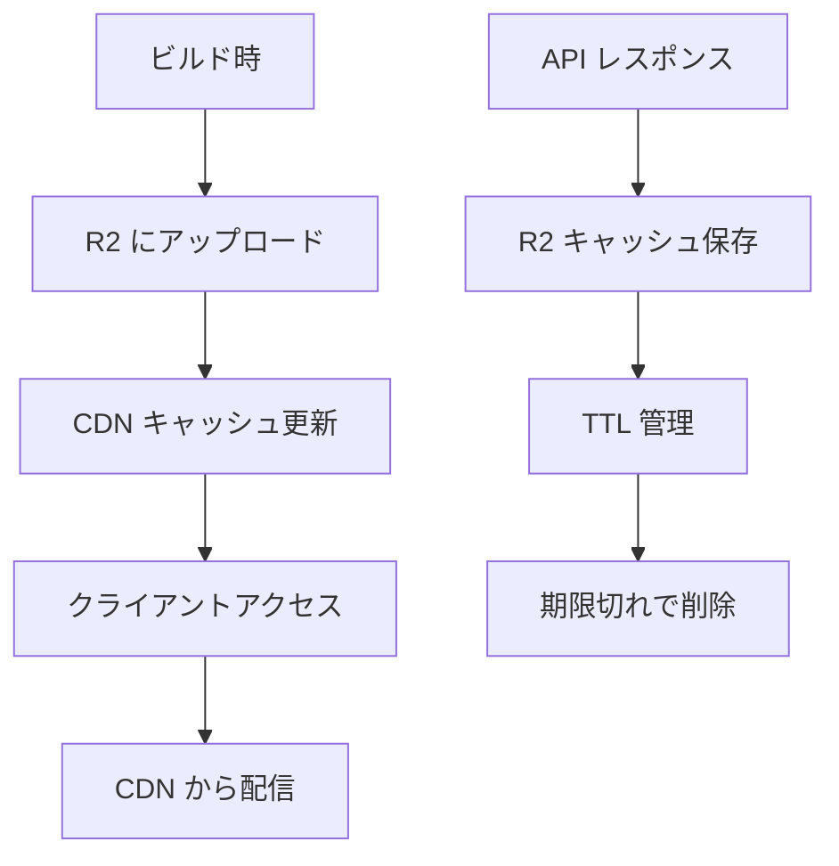

# R2 ストレージ設計

## 概要

Cloudflare R2 ストレージは、stats47 プロジェクトにおいて静的データの配信とキャッシュ戦略の中核を担います。D1 データベースと連携し、効率的なデータ管理と高速な配信を実現します。

## R2 ストレージの役割

### D1 との使い分け

| 特性               | D1 Database           | R2 Storage               |
| ------------------ | --------------------- | ------------------------ |
| **用途**           | 動的データ、CRUD 操作 | 静的データ、ファイル配信 |
| **クエリ**         | SQL による複雑な検索  | ファイルベースのアクセス |
| **更新**           | リアルタイム          | バッチ更新               |
| **コスト**         | 読み取り課金          | 読み取り無料             |
| **パフォーマンス** | データベースクエリ    | CDN 配信で高速           |

### stats47 での活用方針

- **静的マスタデータ**: 地域情報、カテゴリ情報
- **キャッシュデータ**: API レスポンス、地理データ
- **静的アセット**: ブログ画像、ドキュメント

## R2 バケット構造

```
stats47-r2/
├── areas/                    # 地域データ
│   ├── prefectures.json      # 都道府県マスタ
│   └── municipalities.json   # 市区町村マスタ
├── geoshape/                 # 地理データ
│   └── cache/
│       └── {year}/{level}.{resolution}.topojson
├── estat/                    # e-Stat API キャッシュ
│   └── cache/
│       └── {apiType}/{params_hash}.json
└── content/                  # 静的コンテンツ
    └── blog/
        └── {slug}/assets/
```

## ドメイン別の R2 活用

### Area ドメイン

**用途**: 地域マスタデータの配信

**ファイル**:

- `areas/prefectures.json`: 都道府県マスタ（47 件）
- `areas/municipalities.json`: 市区町村マスタ（11,000+ 件）

**更新**: ビルド時に最新化

**アクセス**: 静的配信（CDN 経由）

**キャッシュ戦略**:

- L1（クライアント）: 1 時間
- L2（CDN）: 1 日
- L3（R2）: 永続（ビルド時更新）

### Geoshape ドメイン

**用途**: TopoJSON データのキャッシュ

**ファイル**:

- `geoshape/cache/{year}/{level}.{resolution}.topojson`

**TTL**: 30 日

**キャッシュキー**: `geoshape:{year}:{level}:{resolution}`

**例**:

- `geoshape/cache/2023/pref.c.topojson`
- `geoshape/cache/2023/city.l.topojson`

### EstatAPI ドメイン

**用途**: API レスポンスのキャッシュ

**ファイル**:

- `estat/cache/{apiType}/{params_hash}.json`

**TTL**:

- `getMetaInfo`: 7 日
- `getStatsData`: 24 時間
- `getStatsList`: 7 日

**キャッシュキー**: `estat:{apiType}:{params_hash}`

**例**:

- `estat/cache/getMetaInfo/a1b2c3d4.json`
- `estat/cache/getStatsData/e5f6g7h8.json`

### Content ドメイン

**用途**: ブログ画像などの静的アセット

**ファイル**:

- `content/blog/{slug}/assets/{filename}`

**配信**: CDN 経由の高速配信

**キャッシュ戦略**:

- L2（CDN）: 1 日
- L3（R2）: 永続

## アクセスパターン

### ビルド時アップロード

```typescript
// scripts/upload-to-r2.ts
export async function uploadAreaData() {
  const prefectures = await fs.readFile("data/mock/area/prefectures.json");
  const municipalities = await fs.readFile(
    "data/mock/area/municipalities.json"
  );

  await r2.putObject("areas/prefectures.json", prefectures);
  await r2.putObject("areas/municipalities.json", municipalities);
}
```

### ランタイム読み取り

```typescript
// src/infrastructure/area/repository/AreaRepository.ts
export class AreaRepository {
  async getPrefectures(): Promise<Prefecture[]> {
    const response = await fetch("/api/r2/areas/prefectures.json");
    const data = await response.json();
    return data.prefectures.map(Prefecture.fromJson);
  }
}
```

### キャッシュ更新フロー



## ファイル命名規則

### 地域データ

```
areas/
├── prefectures.json          # 都道府県マスタ
├── municipalities.json       # 市区町村マスタ
└── mappings/
    └── {year}/
        └── municipality-to-estat.json  # マッピングデータ
```

### 地理データ

```
geoshape/
└── cache/
    └── {YYYYMMDD}/           # 年度
        ├── pref.{resolution}.topojson  # 都道府県
        ├── city.{resolution}.topojson  # 市区町村
        └── metadata.json     # メタデータ
```

### API キャッシュ

```
estat/
└── cache/
    ├── getMetaInfo/
    │   └── {hash}.json
    ├── getStatsData/
    │   └── {hash}.json
    └── getStatsList/
        └── {hash}.json
```

## パフォーマンス最適化

### CDN 配信の活用

- **エッジキャッシュ**: Cloudflare CDN による高速配信
- **圧縮**: gzip 圧縮による転送量削減
- **HTTP/2**: 並列リクエストによる高速化

### キャッシュ戦略

- **階層化キャッシュ**: L1 → L2 → L3 の段階的キャッシュ
- **TTL 最適化**: データ特性に応じた適切な TTL 設定
- **プリフェッチ**: 重要なデータの事前読み込み

### コスト最適化

- **読み取り無料**: R2 の読み取り課金なしを活用
- **圧縮**: ファイルサイズの削減
- **効率的な更新**: 差分更新による転送量削減

## セキュリティ

### アクセス制御

- **公開データ**: CDN 経由で公開
- **プライベートデータ**: 認証が必要なデータは別バケット
- **署名付き URL**: 一時的なアクセス権限

### データ整合性

- **チェックサム**: ファイル整合性の検証
- **バージョン管理**: ファイルのバージョン管理
- **ロールバック**: 問題発生時の復旧機能

## 監視・運用

### メトリクス

- **アクセス頻度**: ファイル別のアクセス統計
- **キャッシュヒット率**: CDN キャッシュの効果測定
- **エラー率**: アクセスエラーの監視

### アラート

- **容量監視**: ストレージ使用量の監視
- **エラー監視**: アクセスエラーの検知
- **パフォーマンス監視**: レスポンス時間の監視

## 関連ドキュメント

- [キャッシュ戦略](./03_キャッシュ戦略.md) - 3 層キャッシュアーキテクチャ
- [ストレージ選択ガイド](./04_ストレージ選択ガイド.md) - D1 vs R2 の判断基準
- [Area ドメイン](../03_ドメイン設計/02_支援ドメイン/01_Area.md) - 地域データの管理
- [Geoshape ドメイン](../03_ドメイン設計/02_支援ドメイン/04_Geoshape.md) - 地理データの管理

## 更新履歴

- 2025-01-20: 初版作成
