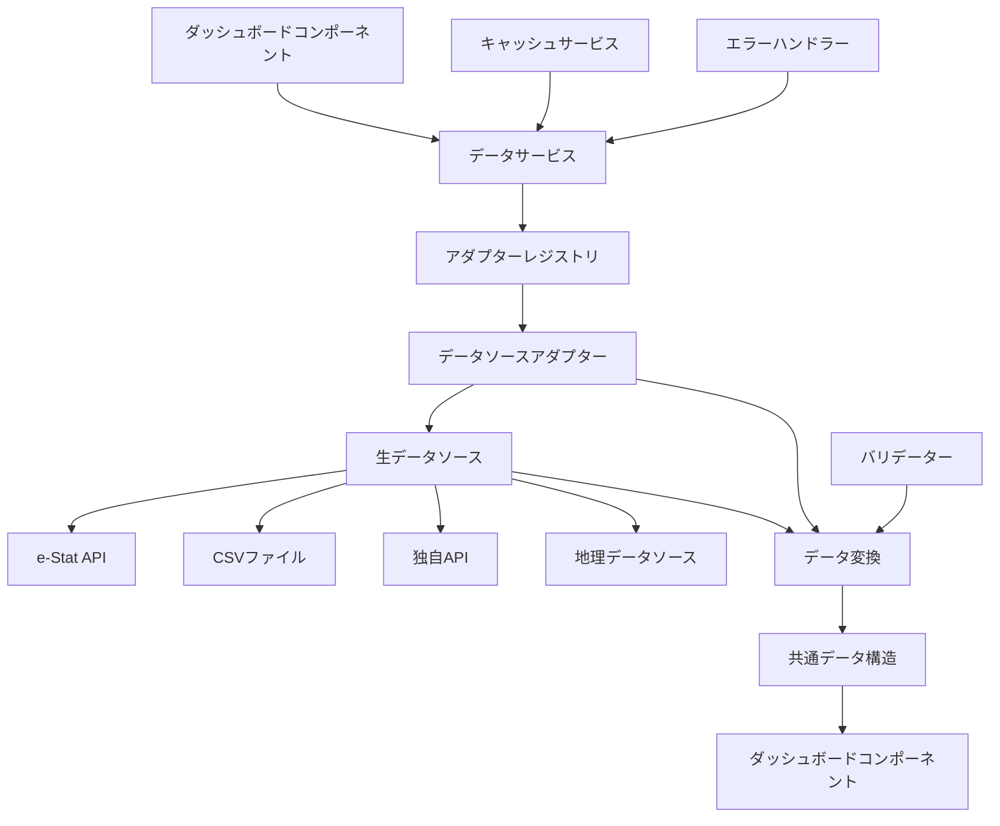

# ダッシュボードデータソース抽象化設計書

## 概要

現在のダッシュボードは各コンポーネントが直接 e-Stat API からデータを取得しており、データソースが密結合しています。将来的に他のデータソース（CSV、独自 API、他の統計 API 等）にも対応できるよう、共通データ構造とアダプターパターンを導入します。

## 現状の問題点

### 1. データソースとの密結合

- 各コンポーネントが`EstatStatsDataFormatter.getAndFormatStatsData`を直接呼び出し
- e-Stat API 専用のデータ構造に依存
- 他のデータソースへの対応が困難

### 2. データ構造の非統一

- コンポーネントごとに異なるデータ変換ロジック
- 共通のインターフェースが存在しない
- コードの重複が多い

### 3. 拡張性の欠如

- 新しいデータソースを追加する際の影響範囲が大きい
- テストが困難
- モックデータの作成が煩雑

## 設計方針

### 1. 共通データ構造（Unified Data Model）

すべてのデータソースから取得したデータを共通の形式に変換します。

#### 基本データ型

```typescript
// 基本データ値
interface DataValue {
  id: string; // 一意識別子
  areaCode: string; // 地域コード
  areaName: string; // 地域名
  categoryCode: string; // カテゴリコード
  categoryName: string; // カテゴリ名
  timeCode: string; // 時系列コード
  timeName: string; // 時系列名
  value: number | null; // 数値
  unit: string; // 単位
  source: DataSource; // データソース
  metadata?: Record<string, any>; // 追加メタデータ
}

// データソース定義
interface DataSource {
  type: "estat" | "csv" | "api" | "geographic" | "mock";
  name: string;
  version?: string;
  lastUpdated: string;
}

// ダッシュボードデータ
interface DashboardData {
  type: DataType; // データタイプ
  values: DataValue[]; // データ値配列
  metadata: DataMetadata; // メタデータ
  summary?: DataSummary; // サマリー情報
}

// データタイプ
type DataType =
  | "timeSeries" // 時系列データ
  | "ranking" // ランキングデータ
  | "comparison" // 比較データ
  | "distribution" // 分布データ
  | "geographic" // 地理データ（Leaflet統合対応）
  | "categorical"; // カテゴリデータ

// メタデータ
interface DataMetadata {
  title: string; // タイトル
  description?: string; // 説明
  areaLevel: AreaLevel; // 地域レベル
  timeRange: TimeRange; // 時間範囲
  categories: CategoryInfo[]; // カテゴリ情報
  areas: AreaInfo[]; // 地域情報
  source: DataSource; // データソース
  lastUpdated: string; // 最終更新日時
  cacheExpiry?: string; // キャッシュ有効期限
}

// 地域レベル
type AreaLevel = "national" | "prefecture" | "municipality";

// 時間範囲
interface TimeRange {
  start: string; // 開始時点
  end: string; // 終了時点
  frequency: "yearly" | "monthly" | "daily" | "irregular";
}

// カテゴリ情報
interface CategoryInfo {
  code: string;
  name: string;
  description?: string;
  color?: string;
  order?: number;
}

// 地域情報
interface AreaInfo {
  code: string;
  name: string;
  level: AreaLevel;
  parentCode?: string;
  coordinates?: {
    latitude: number;
    longitude: number;
  };
}

// サマリー情報
interface DataSummary {
  totalCount: number; // 総データ数
  valueRange: {
    // 値の範囲
    min: number;
    max: number;
    average: number;
    median: number;
  };
  timeRange: TimeRange; // 時間範囲
  areaCount: number; // 地域数
  categoryCount: number; // カテゴリ数
}
```

#### データタイプ別の特殊化

```typescript
// 時系列データ
interface TimeSeriesData extends DashboardData {
  type: "timeSeries";
  timePoints: TimePoint[]; // 時点データ
  trends: TrendAnalysis[]; // トレンド分析
}

interface TimePoint {
  timeCode: string;
  timeName: string;
  value: number;
  change?: {
    absolute: number; // 絶対変化
    relative: number; // 相対変化
  };
}

interface TrendAnalysis {
  period: string;
  direction: "increasing" | "decreasing" | "stable";
  rate: number; // 変化率
  significance: "high" | "medium" | "low";
}

// ランキングデータ
interface RankingData extends DashboardData {
  type: "ranking";
  rankings: RankingItem[]; // ランキング項目
  criteria: RankingCriteria; // ランキング基準
}

interface RankingItem {
  rank: number; // 順位
  areaCode: string;
  areaName: string;
  value: number;
  change?: {
    rankChange: number; // 順位変動
    valueChange: number; // 値の変動
  };
}

interface RankingCriteria {
  sortBy: "value" | "change" | "custom";
  order: "asc" | "desc";
  limit?: number;
}

// 比較データ
interface ComparisonData extends DashboardData {
  type: "comparison";
  comparisons: ComparisonItem[]; // 比較項目
  baseline?: ComparisonItem; // 基準値
}

interface ComparisonItem {
  areaCode: string;
  areaName: string;
  value: number;
  difference?: {
    absolute: number; // 絶対差
    relative: number; // 相対差
  };
  percentage?: number; // 割合
}

// 分布データ
interface DistributionData extends DashboardData {
  type: "distribution";
  distributions: DistributionItem[]; // 分布項目
  total: number; // 合計値
}

interface DistributionItem {
  categoryCode: string;
  categoryName: string;
  value: number;
  percentage: number; // 割合
  color?: string; // 表示色
}

// 地理データ
interface GeographicData extends DashboardData {
  type: "geographic";
  features: GeographicFeature[]; // 地理的特徴
  bounds: GeographicBounds; // 地理的境界
}

interface GeographicFeature {
  areaCode: string;
  areaName: string;
  geometry: any; // GeoJSON geometry
  properties: {
    value: number;
    [key: string]: any;
  };
}

interface GeographicBounds {
  north: number;
  south: number;
  east: number;
  west: number;
}
```

### 2. アダプターインターフェース

各データソースからダッシュボード共通形式への変換を担当するアダプターのインターフェースを定義します。

```typescript
// アダプター基本インターフェース
interface DataAdapter {
  readonly sourceType: string;
  readonly version: string;

  // データ取得
  fetchData(params: AdapterParams): Promise<RawDataSourceData>;

  // データ変換
  transform(
    data: RawDataSourceData,
    options?: TransformOptions
  ): Promise<DashboardData>;

  // データ検証
  validate(data: RawDataSourceData): ValidationResult;

  // メタデータ取得
  getMetadata(params: AdapterParams): Promise<DataSourceMetadata>;

  // サポート状況確認
  supports(params: AdapterParams): boolean;
}

// アダプターパラメータ
interface AdapterParams {
  source: string; // データソース識別子
  query: Record<string, any>; // クエリパラメータ
  options?: AdapterOptions; // オプション
}

interface AdapterOptions {
  cache?: boolean; // キャッシュ使用
  timeout?: number; // タイムアウト
  retries?: number; // リトライ回数
  format?: "json" | "csv" | "xml"; // データ形式
}

// 変換オプション
interface TransformOptions {
  areaLevel?: AreaLevel; // 地域レベル
  timeRange?: TimeRange; // 時間範囲
  categories?: string[]; // カテゴリフィルタ
  areas?: string[]; // 地域フィルタ
  aggregation?: AggregationType; // 集計方法
}

type AggregationType = "sum" | "average" | "median" | "max" | "min" | "count";

// 生データソースデータ
interface RawDataSourceData {
  source: string;
  data: any;
  metadata: {
    timestamp: string;
    size: number;
    format: string;
  };
}

// データソースメタデータ
interface DataSourceMetadata {
  name: string;
  description: string;
  version: string;
  supportedTypes: DataType[];
  supportedAreaLevels: AreaLevel[];
  supportedTimeRanges: TimeRange[];
  rateLimit?: {
    requests: number;
    period: string;
  };
  lastUpdated: string;
}

// 検証結果
interface ValidationResult {
  isValid: boolean;
  errors: ValidationError[];
  warnings: ValidationWarning[];
}

interface ValidationError {
  field: string;
  message: string;
  code: string;
}

interface ValidationWarning {
  field: string;
  message: string;
  code: string;
}
```

### 3. データフローアーキテクチャ



### 4. エラーハンドリング戦略

```typescript
// エラーレベル定義
enum ErrorLevel {
  CRITICAL = "critical", // システム全体に影響
  ERROR = "error", // 機能に影響
  WARNING = "warning", // 一部機能に影響
  INFO = "info", // 情報レベル
}

// ダッシュボードエラー
interface DashboardError {
  level: ErrorLevel;
  code: string;
  message: string;
  details: Record<string, any>;
  timestamp: string;
  source?: string;
}

// エラーハンドラー
class DashboardErrorHandler {
  static handleAdapterError(error: unknown, adapter: string): DashboardError {
    if (error instanceof AdapterError) {
      return {
        level: ErrorLevel.ERROR,
        code: "ADAPTER_ERROR",
        message: `データソース ${adapter} からのデータ取得に失敗しました`,
        details: {
          adapter,
          originalError: error.message,
          code: error.code,
        },
        timestamp: new Date().toISOString(),
        source: adapter,
      };
    }

    if (error instanceof ValidationError) {
      return {
        level: ErrorLevel.WARNING,
        code: "VALIDATION_ERROR",
        message: "データの検証に失敗しました",
        details: {
          adapter,
          validationErrors: error.errors,
        },
        timestamp: new Date().toISOString(),
        source: adapter,
      };
    }

    return {
      level: ErrorLevel.CRITICAL,
      code: "UNKNOWN_ERROR",
      message: "予期しないエラーが発生しました",
      details: {
        adapter,
        error: String(error),
      },
      timestamp: new Date().toISOString(),
      source: adapter,
    };
  }
}
```

## サブドメイン構造

### ディレクトリ構成

```
src/infrastructure/dashboard/
├── core/
│   ├── types.ts                 # 共通データ型定義
│   ├── interfaces.ts            # アダプターインターフェース
│   ├── errors.ts                # エラー定義
│   └── constants.ts             # 定数定義
├── adapters/
│   ├── estat/
│   │   ├── index.ts
│   │   ├── estat-adapter.ts     # e-Stat APIアダプター
│   │   ├── estat-transformer.ts # e-Statデータ変換
│   │   └── estat-validator.ts   # e-Statデータ検証
│   ├── csv/
│   │   ├── index.ts
│   │   ├── csv-adapter.ts       # CSVアダプター
│   │   └── csv-parser.ts        # CSVパーサー
│   ├── api/
│   │   ├── index.ts
│   │   └── custom-api-adapter.ts # 独自APIアダプター
│   └── mock/
│       ├── index.ts
│       └── mock-adapter.ts      # モックデータアダプター
├── services/
│   ├── data-service.ts          # データ取得サービス
│   ├── cache-service.ts         # キャッシュサービス
│   ├── adapter-registry.ts      # アダプターレジストリ
│   └── error-handler.ts         # エラーハンドラー
└── utils/
    ├── validators.ts            # データ検証ユーティリティ
    ├── transformers.ts          # データ変換ユーティリティ
    ├── formatters.ts            # データフォーマッター
    └── helpers.ts               # ヘルパー関数
```

### アダプターレジストリ

```typescript
// アダプターレジストリ
class AdapterRegistry {
  private adapters = new Map<string, DataAdapter>();

  register(adapter: DataAdapter): void {
    this.adapters.set(adapter.sourceType, adapter);
  }

  get(sourceType: string): DataAdapter | undefined {
    return this.adapters.get(sourceType);
  }

  getSupportedSources(): string[] {
    return Array.from(this.adapters.keys());
  }

  async getBestAdapter(params: AdapterParams): Promise<DataAdapter | null> {
    for (const adapter of this.adapters.values()) {
      if (adapter.supports(params)) {
        return adapter;
      }
    }
    return null;
  }
}

// データサービス
class DashboardDataService {
  constructor(
    private registry: AdapterRegistry,
    private cache: CacheService,
    private errorHandler: ErrorHandler
  ) {}

  async fetchData(params: AdapterParams): Promise<DashboardData> {
    try {
      // キャッシュチェック
      const cacheKey = this.generateCacheKey(params);
      const cachedData = await this.cache.get(cacheKey);
      if (cachedData) {
        return cachedData;
      }

      // アダプター選択
      const adapter = await this.registry.getBestAdapter(params);
      if (!adapter) {
        throw new Error(`Unsupported data source: ${params.source}`);
      }

      // データ取得
      const rawData = await adapter.fetchData(params);

      // データ検証
      const validation = adapter.validate(rawData);
      if (!validation.isValid) {
        throw new ValidationError(validation.errors);
      }

      // データ変換
      const transformedData = await adapter.transform(rawData);

      // キャッシュ保存
      await this.cache.set(cacheKey, transformedData);

      return transformedData;
    } catch (error) {
      const dashboardError = this.errorHandler.handleAdapterError(
        error,
        params.source
      );
      throw dashboardError;
    }
  }

  private generateCacheKey(params: AdapterParams): string {
    return `dashboard:${params.source}:${JSON.stringify(params.query)}`;
  }
}
```

## 実装例

### e-Stat API アダプター

```typescript
// e-Stat APIアダプター
export class EstatDataAdapter implements DataAdapter {
  readonly sourceType = "estat";
  readonly version = "1.0.0";

  async fetchData(params: AdapterParams): Promise<RawDataSourceData> {
    const estatParams = {
      appId: process.env.NEXT_PUBLIC_ESTAT_APP_ID,
      statsDataId: params.query.statsDataId,
      cdCat01: params.query.cdCat01,
      cdArea: params.query.areaCode,
      metaGetFlg: "Y",
      cntGetFlg: "N",
    };

    const response = await EstatApiClient.getStatsData(estatParams);

    return {
      source: this.sourceType,
      data: response,
      metadata: {
        timestamp: new Date().toISOString(),
        size: JSON.stringify(response).length,
        format: "json",
      },
    };
  }

  async transform(
    data: RawDataSourceData,
    options?: TransformOptions
  ): Promise<DashboardData> {
    const estatData = data.data.GET_STATS_DATA.STATISTICAL_DATA;
    const { VALUE } = estatData.DATA_INF;
    const { CLASS_OBJ } = estatData.CLASS_INF;

    // データ変換ロジック
    const values = this.transformValues(VALUE, CLASS_OBJ);
    const metadata = this.extractMetadata(estatData, options);

    return {
      type: this.determineDataType(options),
      values,
      metadata,
    };
  }

  validate(data: RawDataSourceData): ValidationResult {
    const errors: ValidationError[] = [];
    const warnings: ValidationWarning[] = [];

    if (!data.data.GET_STATS_DATA) {
      errors.push({
        field: "data",
        message: "Invalid e-Stat API response structure",
        code: "INVALID_STRUCTURE",
      });
    }

    return {
      isValid: errors.length === 0,
      errors,
      warnings,
    };
  }

  async getMetadata(params: AdapterParams): Promise<DataSourceMetadata> {
    return {
      name: "e-Stat API",
      description: "政府統計データAPI",
      version: "3.0",
      supportedTypes: ["timeSeries", "ranking", "comparison", "distribution"],
      supportedAreaLevels: ["national", "prefecture", "municipality"],
      supportedTimeRanges: [
        {
          start: "2000-01-01",
          end: new Date().toISOString().split("T")[0],
          frequency: "yearly",
        },
      ],
      rateLimit: {
        requests: 1000,
        period: "day",
      },
      lastUpdated: new Date().toISOString(),
    };
  }

  supports(params: AdapterParams): boolean {
    return (
      params.source === "estat" &&
      params.query.statsDataId &&
      params.query.cdCat01
    );
  }

  private transformValues(VALUE: any[], CLASS_OBJ: any[]): DataValue[] {
    // e-Stat APIデータを共通形式に変換
    // 実装詳細は省略
  }

  private extractMetadata(
    estatData: any,
    options?: TransformOptions
  ): DataMetadata {
    // メタデータ抽出
    // 実装詳細は省略
  }

  private determineDataType(options?: TransformOptions): DataType {
    // データタイプ判定
    // 実装詳細は省略
  }
}
```

### CSV アダプター

```typescript
// CSVアダプター
export class CSVDataAdapter implements DataAdapter {
  readonly sourceType = "csv";
  readonly version = "1.0.0";

  async fetchData(params: AdapterParams): Promise<RawDataSourceData> {
    const csvContent = await fetch(params.query.url).then((res) => res.text());

    return {
      source: this.sourceType,
      data: csvContent,
      metadata: {
        timestamp: new Date().toISOString(),
        size: csvContent.length,
        format: "csv",
      },
    };
  }

  async transform(
    data: RawDataSourceData,
    options?: TransformOptions
  ): Promise<DashboardData> {
    const csvData = this.parseCSV(data.data);
    const values = this.transformCSVData(csvData);
    const metadata = this.extractCSVMetadata(csvData, options);

    return {
      type: this.determineDataType(options),
      values,
      metadata,
    };
  }

  validate(data: RawDataSourceData): ValidationResult {
    // CSVデータの検証
    // 実装詳細は省略
  }

  async getMetadata(params: AdapterParams): Promise<DataSourceMetadata> {
    return {
      name: "CSV Data Source",
      description: "CSVファイルからのデータ取得",
      version: "1.0",
      supportedTypes: ["timeSeries", "ranking", "comparison"],
      supportedAreaLevels: ["national", "prefecture", "municipality"],
      supportedTimeRanges: [],
      lastUpdated: new Date().toISOString(),
    };
  }

  supports(params: AdapterParams): boolean {
    return params.source === "csv" && params.query.url;
  }

  private parseCSV(csvContent: string): any[] {
    // CSVパースロジック
    // 実装詳細は省略
  }

  private transformCSVData(csvData: any[]): DataValue[] {
    // CSVデータを共通形式に変換
    // 実装詳細は省略
  }

  private extractCSVMetadata(
    csvData: any[],
    options?: TransformOptions
  ): DataMetadata {
    // CSVメタデータ抽出
    // 実装詳細は省略
  }

  private determineDataType(options?: TransformOptions): DataType {
    // データタイプ判定
    // 実装詳細は省略
  }
}
```

## パフォーマンス考慮

### 1. キャッシュ戦略

```typescript
// 多層キャッシュ
class MultiLayerCache {
  private memoryCache = new Map<string, CachedData>();
  private redisCache: RedisCache;
  private fileCache: FileCache;

  async get(key: string): Promise<DashboardData | null> {
    // 1. メモリキャッシュ
    const memoryData = this.memoryCache.get(key);
    if (memoryData && !this.isExpired(memoryData)) {
      return memoryData.data;
    }

    // 2. Redisキャッシュ
    const redisData = await this.redisCache.get(key);
    if (redisData) {
      this.memoryCache.set(key, redisData);
      return redisData.data;
    }

    // 3. ファイルキャッシュ
    const fileData = await this.fileCache.get(key);
    if (fileData) {
      this.memoryCache.set(key, fileData);
      return fileData.data;
    }

    return null;
  }

  async set(
    key: string,
    data: DashboardData,
    ttl: number = 3600
  ): Promise<void> {
    const cachedData = {
      data,
      timestamp: Date.now(),
      ttl,
    };

    // メモリキャッシュ
    this.memoryCache.set(key, cachedData);

    // Redisキャッシュ（非同期）
    this.redisCache.set(key, cachedData, ttl).catch(console.error);

    // ファイルキャッシュ（非同期）
    this.fileCache.set(key, cachedData, ttl).catch(console.error);
  }
}
```

### 2. 並列処理

```typescript
// 並列データ取得
class ParallelDataFetcher {
  static async fetchMultipleData(
    requests: AdapterParams[],
    concurrency: number = 3
  ): Promise<Array<{ data: DashboardData | null; error: Error | null }>> {
    const results: Array<{ data: DashboardData | null; error: Error | null }> =
      [];

    for (let i = 0; i < requests.length; i += concurrency) {
      const batch = requests.slice(i, i + concurrency);

      const batchResults = await Promise.allSettled(
        batch.map(async (request) => {
          try {
            const data = await DashboardDataService.fetchData(request);
            return { data, error: null };
          } catch (error) {
            return { data: null, error: error as Error };
          }
        })
      );

      results.push(
        ...batchResults.map((result) =>
          result.status === "fulfilled"
            ? result.value
            : { data: null, error: result.reason }
        )
      );
    }

    return results;
  }
}
```

## まとめ

このデータソース抽象化設計により、以下の効果が期待されます：

1. **拡張性向上**: 新しいデータソースの追加が容易
2. **保守性向上**: データソース変更の影響を局所化
3. **テスタビリティ**: モックデータでのテストが容易
4. **再利用性**: 共通ロジックの集約
5. **一貫性**: 統一されたデータ構造とエラーハンドリング
6. **地理データ対応**: Leaflet 統合による地理データの可視化

この設計により、ダッシュボードは様々なデータソース（統計データ、地理データ等）に対応可能な柔軟で拡張可能なシステムになります。

---

**作成日**: 2025-10-16  
**最終更新日**: 2025-10-16  
**バージョン**: 1.0.0  
**承認者**: 開発チーム  
**ステータス**: 承認済み
