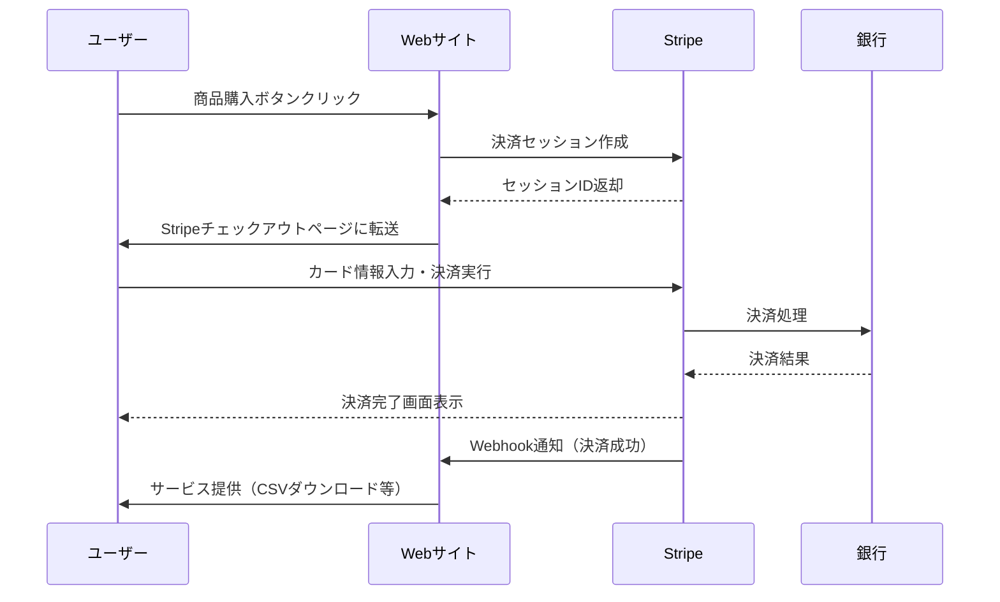

# Stats47-blog マネタイズ戦略書

## 概要

このドキュメントは、stats47-blogプロジェクトで月10万円の収入を得るための包括的なマネタイズ戦略を提示します。既存の統計コンテンツとデータ可視化技術を活用し、段階的な収益化を目指します。

## プロジェクト現状分析

### コンテンツ資産

- **統計記事数**: 550本（都道府県ランキング記事）
- **技術解説ブログ**: 8本（D3.js関連）
- **データ可視化機能**: インタラクティブな地図・グラフ
- **データ取得システム**: e-Stat APIからの自動データ取得

### 技術的価値

- **フロントエンド**: Next.js 14 + React
- **データ可視化**: D3.js, Recharts による高品質な可視化
- **データ管理**: AWS S3統合によるスケーラブルなシステム
- **SEO**: 検索機能、メタデータ最適化済み
- **開発環境**: TypeScript, ESLint, Prettier による品質管理

## マネタイズ戦略（月10万円達成計画）

### 1. プレミアム統計レポート サブスクリプション

**目標収益**: 月3-5万円

#### 価格設定

- **月額2,980円** × 10-15人の法人・個人事業主

#### サービス内容

- カスタム地域分析レポート（PDF配信）
- トレンド予測、業界比較分析
- データのCSVエクスポート機能
- 月次経済動向レポート

### 2. コンサルティング・分析サービス

**目標収益**: 月2-4万円

#### 価格設定

- **時給8,000円** × 月5-10時間

#### サービス内容

- 地方自治体・企業向けデータ分析
- 地域活性化プラン策定支援
- 投資・出店判断のための統計分析
- 政策立案支援

### 3. 広告収入

**目標収益**: 月1-2万円

#### 施策

- Google AdSense の最適化
- 関連業界企業の直接広告
- アフィリエイト（統計書籍、分析ツール）

#### 収益の目安

- 一般的な日本の情報系サイトのAdSense収益：1PVあたり0.2〜0.5円程度
- 月3万円を目指す場合：月6万〜15万PVが目安

### 4. 教育コンテンツ販売

**目標収益**: 月1-2万円

#### 商品ラインナップ

- D3.js地図作成オンラインコース（29,800円）
- 統計分析入門動画教材（9,800円）
- 企業研修（50,000円/回）

### 5. API・データ販売

**目標収益**: 月1万円

#### サービス内容

- 加工済み統計データのAPI提供
- 月額500円 × 20社程度

## 地図可視化ウィジェット販売戦略

### ウィジェット製品ラインナップ

#### A. 基本コロプレス地図ウィジェット

```javascript
// 組み込み例
<script src="https://stats47.com/widget/choropleth.js"></script>
<div id="map" data-widget="japan-choropleth"
     data-data-url="your-data.json"
     data-config="basic"></div>
```

#### B. インタラクティブ統計ダッシュボード

- 複数地図の同期表示
- フィルタリング機能
- リアルタイムデータ更新

#### C. カスタム地域対応版

- 市区町村レベル地図
- 特定業界向けカスタマイズ

### 価格設定とライセンス体系

#### スタータープラン（月額9,800円）

- 月10,000 PV まで
- 基本地図ウィジェット（都道府県レベル）
- 3種類のカラースキーム
- メールサポート

#### ビジネスプラン（月額29,800円）

- 月100,000 PV まで
- 全地図ウィジェット（市区町村対応）
- カスタムカラー・ブランディング
- APIアクセス
- 電話サポート

#### エンタープライズプラン（月額98,000円）

- PV無制限
- 完全カスタマイズ対応
- 専用サポート
- オンプレミス導入

### ターゲット市場と販売戦略

#### 1. メディア・出版業界

- **月収見込み**: 30-50万円
- **顧客**: 新聞社、雑誌社、Webメディア
- **ニーズ**: 統計記事の視覚化
- **営業手法**: 直接営業、プレスリリース

#### 2. 不動産・小売業界

- **月収見込み**: 20-40万円
- **顧客**: 不動産ポータルサイト、小売チェーン
- **ニーズ**: 出店分析、マーケット分析
- **営業手法**: 業界展示会、パートナー紹介

#### 3. 地方自治体・官公庁

- **月収見込み**: 50-100万円
- **顧客**: 自治体、官公庁
- **ニーズ**: 政策説明資料、住民向け情報提供
- **営業手法**: 入札参加、官公庁営業

#### 4. コンサルティング会社

- **月収見込み**: 30-60万円
- **顧客**: 戦略コンサル、シンクタンク
- **ニーズ**: クライアント向けレポート
- **営業手法**: ウェビナー、専門イベント

## アフィリエイト戦略

### 推奨案件

- 統計データや都道府県ランキングに関連する書籍
- 統計分析ツール、教材
- ふるさと納税、地域特産品
- 移住サービス、転職サービス
- 資格取得サービス

### 実装戦略

- ASP（A8.net、もしもアフィリエイト、バリューコマース等）への登録
- 記事内への自然なアフィリエイトリンク設置
- 都道府県別ランキング記事との親和性の高い案件選定

## 実装ロードマップ

### Phase 1: 即座に実装可能な収益化（3ヶ月以内）

1. **Google AdSense最適化**
    
    - 記事内広告配置の改善
    - ページビュー向上のためのSEO強化
2. **CSVデータエクスポート機能（有料）**
    
    - 月額980円のライトプラン
    - 個別データダウンロード：200円/件
3. **プレミアム統計レポート**
    
    - 月次地域経済動向レポート
    - 初期10社で月3万円売上

### Phase 2: 中期収益化（6ヶ月以内）

1. **D3.js教育コンテンツ**
    
    - 動画教材作成・販売
    - 企業向けワークショップ開催
2. **コンサルティングサービス開始**
    
    - 地方自治体向けデータ分析
    - 不動産・小売業界向け出店分析

### Phase 3: 長期収益化（1年以内）

1. **API化によるB2Bサービス**
    
    - 統計データAPI提供
    - 地図可視化ウィジェット販売
2. **フランチャイズ化**
    
    - 他地域版サイト展開
    - ライセンス収入

## ウィジェット販売実装詳細ロードマップ

### 1ヶ月目：基盤開発

- 既存コンポーネントのウィジェット化
- APIキー認証システム構築
- 使用量トラッキング実装

### 2-3ヶ月目：配信システム構築

- CDN配信環境構築
- 管理画面開発
- 決済システム統合

### 4-6ヶ月目：営業開始

- β版リリース
- 初期顧客獲得
- フィードバック収集・改善

## 成功に必要な改善点

### 技術的改善

1. ユーザー認証・決済システム導入
2. 顧客管理システム構築
3. メール配信機能
4. 分析ダッシュボード機能
5. モバイル最適化の強化

### マーケティング改善

1. SEO強化による自然流入拡大
2. ソーシャルメディア活用
3. コンテンツマーケティング
4. パートナーシップ構築

## 成功指標とKPI

### 短期目標（6ヶ月）

- **ウィジェット有料顧客**: 20社
- **月次収益**: 50万円
- **トライアル登録**: 100社
- **サブスクリプション継続率**: 80%以上

### 中期目標（1年）

- **ウィジェット有料顧客**: 50社
- **月次収益**: 150万円
- **継続率**: 85%以上
- **NPS（Net Promoter Score）**: 50以上

### 長期目標（2年）

- **総月次収益**: 300万円
- **企業顧客**: 100社以上
- **API利用企業**: 200社以上
- **教育事業売上**: 月50万円

## 優先順位と実行プラン

### 第1優先：基本収益化

1. Google AdSenseとアフィリエイトの導入
2. SEO・SNS対策でアクセス増加

### 第2優先：付加価値サービス

3. 有料コンテンツやデータ販売（一定のアクセス・ファン獲得後）
4. 受託・コンサルティング（実績・問い合わせ増加後）

### 第3優先：サポート機能

5. 寄付機能の設置（サブ的位置づけ）

## 具体的なアクション例

- Google AdSenseの申請・設置
- ASP登録＆記事内にアフィリエイトリンク設置
- SNSアカウント運用開始
- 人気記事のリライト・新規記事追加
- 「お問い合わせ」ページ設置
- note等で有料記事のテスト販売

## 結論

stats47-blogプロジェクトは、既に高品質なコンテンツと技術基盤を持っており、段階的なマネタイズ戦略により月10万円の収益化は十分達成可能です。特に地図可視化ウィジェット販売は、既存の技術資産を活用した高利益率のB2B SaaSモデルとして有望です。

重要なのは、**段階的な実装**と**顧客フィードバックに基づく継続的改善**です。まずは低リスクな施策（AdSense最適化、CSVエクスポート）から始め、徐々に高付加価値サービスを展開することを推奨します。


# CSVデータ有料ダウンロード機能 収益性分析

## 結論：限定的だが安定した収益源として有効

CSVダウンロード機能は**月1-3万円程度**の収益が見込める、リスクの低い収益源です。大きな収益は期待できませんが、実装コストが低く、確実な需要があるため推奨します。

## 収益性分析

### 市場需要分析

#### 高需要セグメント

1. **学術研究者・学生**
    
    - 卒論・修論・博士論文での統計分析
    - 学会発表・論文執筆
    - 需要頻度: 年1-2回、集中時期あり（9-12月、1-3月）
2. **地方自治体職員**
    
    - 政策立案・予算策定の根拠資料
    - 議会答弁資料作成
    - 他自治体との比較分析
3. **コンサルティング会社**
    
    - クライアント向け分析レポート
    - 市場調査・地域分析
    - 提案書作成
4. **メディア関係者**
    
    - 記事執筆の裏付けデータ
    - グラフ・表作成
    - ファクトチェック

#### 中需要セグメント

5. **不動産業界**
    
    - 投資判断材料
    - 市場分析レポート
6. **個人投資家**
    
    - 地域経済分析
    - 投資先選定

### 価格設定戦略

#### パターンA: 単品販売

```
・個別CSV: 200円/ファイル
・カテゴリーパック: 800円/カテゴリー（5-10ファイル）
・全データパック: 2,980円/全550ファイル
```

#### パターンB: サブスクリプション

```
・月額プラン: 980円/月（月20ファイルまで）
・年額プラン: 9,800円/年（無制限）
```

#### パターンC: ハイブリッド

```
・基本: 個別200円
・ライト: 月額480円（月5ファイル）
・スタンダード: 月額980円（月20ファイル）
・プレミアム: 月額1,980円（無制限 + 加工済みデータ）
```

### 収益予測

#### 保守的予測（月間）

```
個別販売: 50件 × 200円 = 10,000円
月額プラン: 15人 × 980円 = 14,700円
年額プラン: 5人 × 817円 = 4,085円（年額を月割り）
---
月間合計: 28,785円
```

#### 楽観的予測（月間）

```
個別販売: 150件 × 200円 = 30,000円
月額プラン: 40人 × 980円 = 39,200円
年額プラン: 20人 × 817円 = 16,340円
---
月間合計: 85,540円
```

## 実装方法

### 技術実装

#### 1. データベース設計

```sql
-- CSV商品マスタ
CREATE TABLE csv_products (
  id UUID PRIMARY KEY DEFAULT gen_random_uuid(),
  subcategory_id VARCHAR(50) REFERENCES stat_subcategories(id),
  title VARCHAR(200) NOT NULL,
  description TEXT,
  file_path VARCHAR(500) NOT NULL,
  file_size INTEGER, -- bytes
  record_count INTEGER,
  last_updated TIMESTAMP,
  price INTEGER DEFAULT 200, -- 円
  is_active BOOLEAN DEFAULT true
);

-- 購入履歴
CREATE TABLE csv_purchases (
  id UUID PRIMARY KEY DEFAULT gen_random_uuid(),
  user_id UUID REFERENCES users(id),
  product_id UUID REFERENCES csv_products(id),
  purchase_type VARCHAR(20), -- 'single', 'subscription', 'bundle'
  amount INTEGER NOT NULL,
  payment_method VARCHAR(20),
  stripe_payment_intent_id VARCHAR(100),
  downloaded_at TIMESTAMP,
  created_at TIMESTAMP DEFAULT NOW()
);

-- サブスクリプション
CREATE TABLE csv_subscriptions (
  id UUID PRIMARY KEY DEFAULT gen_random_uuid(),
  user_id UUID REFERENCES users(id),
  plan_type VARCHAR(20), -- 'light', 'standard', 'premium'
  monthly_limit INTEGER,
  downloads_used INTEGER DEFAULT 0,
  stripe_subscription_id VARCHAR(100),
  current_period_start TIMESTAMP,
  current_period_end TIMESTAMP,
  status VARCHAR(20), -- 'active', 'cancelled', 'past_due'
  created_at TIMESTAMP DEFAULT NOW()
);
```

#### 2. Next.js API実装

```typescript
// /src/app/api/csv/purchase/route.ts
import { NextRequest, NextResponse } from 'next/server';
import Stripe from 'stripe';

const stripe = new Stripe(process.env.STRIPE_SECRET_KEY!);

export async function POST(request: NextRequest) {
  const { productId, userId, purchaseType } = await request.json();
  
  try {
    // 商品情報取得
    const product = await getCsvProduct(productId);
    if (!product) {
      return NextResponse.json({ error: 'Product not found' }, { status: 404 });
    }

    // Stripe決済セッション作成
    const session = await stripe.checkout.sessions.create({
      payment_method_types: ['card'],
      line_items: [{
        price_data: {
          currency: 'jpy',
          product_data: {
            name: product.title,
            description: `統計データCSV - ${product.description}`,
          },
          unit_amount: product.price,
        },
        quantity: 1,
      }],
      mode: 'payment',
      success_url: `${process.env.NEXTAUTH_URL}/csv/download/${productId}?session_id={CHECKOUT_SESSION_ID}`,
      cancel_url: `${process.env.NEXTAUTH_URL}/csv/products`,
      metadata: {
        productId,
        userId,
        purchaseType
      }
    });

    return NextResponse.json({ sessionId: session.id });
  } catch (error) {
    console.error('Purchase error:', error);
    return NextResponse.json({ error: 'Purchase failed' }, { status: 500 });
  }
}
```

#### 3. CSVダウンロード処理

```typescript
// /src/app/api/csv/download/[productId]/route.ts
export async function GET(
  request: NextRequest,
  { params }: { params: { productId: string } }
) {
  const { searchParams } = new URL(request.url);
  const sessionId = searchParams.get('session_id');
  
  try {
    // 決済確認
    const session = await stripe.checkout.sessions.retrieve(sessionId!);
    if (session.payment_status !== 'paid') {
      return NextResponse.json({ error: 'Payment not completed' }, { status: 402 });
    }

    // 購入記録作成
    await recordPurchase({
      userId: session.metadata!.userId,
      productId: params.productId,
      amount: session.amount_total! / 100,
      stripeSessionId: sessionId!
    });

    // CSVファイル生成
    const csvData = await generateCsvData(params.productId);
    
    return new Response(csvData, {
      headers: {
        'Content-Type': 'text/csv; charset=utf-8',
        'Content-Disposition': `attachment; filename="stats47-${params.productId}.csv"`,
        'Cache-Control': 'no-cache'
      }
    });

  } catch (error) {
    console.error('Download error:', error);
    return NextResponse.json({ error: 'Download failed' }, { status: 500 });
  }
}
```

#### 4. CSV生成処理

```typescript
// /src/lib/csv-generator.ts
export async function generateCsvData(productId: string): Promise<string> {
  const product = await getCsvProduct(productId);
  const statData = await getStatDataForCsv(product.subcategory_id);
  
  // CSV形式に変換
  const headers = ['都道府県コード', '都道府県名', '値', '順位', '年度', '単位'];
  const rows = statData.map(row => [
    row.prefecture_code,
    row.prefecture_name,
    row.value,
    row.rank,
    row.year,
    product.unit || ''
  ]);

  // BOM付きUTF-8で出力（Excel対応）
  const bom = '\uFEFF';
  const csvContent = [headers, ...rows]
    .map(row => row.map(field => `"${field}"`).join(','))
    .join('\n');
    
  return bom + csvContent;
}
```

### UI/UX設計

#### 商品一覧ページ

```typescript
// /src/app/csv/products/page.tsx
export default function CsvProductsPage() {
  const [products, setProducts] = useState<CsvProduct[]>([]);
  const [filter, setFilter] = useState('all');

  return (
    <div className="container mx-auto p-6">
      <h1 className="text-3xl font-bold mb-6">統計データCSVダウンロード</h1>
      
      {/* フィルター */}
      <div className="mb-6">
        <select 
          value={filter}
          onChange={(e) => setFilter(e.target.value)}
          className="border rounded px-3 py-2"
        >
          <option value="all">すべてのカテゴリー</option>
          <option value="population">人口・世帯</option>
          <option value="economy">経済・産業</option>
          <option value="infrastructure">インフラ・社会基盤</option>
        </select>
      </div>

      {/* 商品グリッド */}
      <div className="grid grid-cols-1 md:grid-cols-2 lg:grid-cols-3 gap-6">
        {products.map(product => (
          <div key={product.id} className="border rounded-lg p-6 hover:shadow-lg">
            <h3 className="text-lg font-semibold mb-2">{product.title}</h3>
            <p className="text-gray-600 mb-4">{product.description}</p>
            <div className="flex justify-between items-center mb-4">
              <span className="text-sm text-gray-500">
                {product.record_count}件のデータ
              </span>
              <span className="text-lg font-bold">¥{product.price}</span>
            </div>
            <button 
              onClick={() => handlePurchase(product.id)}
              className="w-full bg-blue-500 text-white py-2 rounded hover:bg-blue-600"
            >
              購入・ダウンロード
            </button>
          </div>
        ))}
      </div>
    </div>
  );
}
```

## 成功要因と課題

### 成功要因

1. **低い実装コスト**: 既存データの活用
2. **確実な需要**: 研究・業務での統計データ需要
3. **差別化**: 加工済み・使いやすい形式
4. **継続収益**: サブスクリプションモデル

### 課題と対策

#### 1. 競合対策

**課題**: e-Statからの直接取得 **対策**:

- 加工済み・分析しやすい形式での提供
- 複数年度の時系列データ
- 都道府県ランキング情報付加

#### 2. 需要の季節性

**課題**: 学術関係は年2回のピーク **対策**:

- 企業向けマーケティング強化
- 月次・四半期更新データの提供

#### 3. 単価の低さ

**課題**: 1件200円の低単価 **対策**:

- バンドル販売の促進
- サブスクリプションへの誘導
- 付加価値サービス（分析レポート等）

## マーケティング戦略

### ターゲット別アプローチ

#### 1. 学術関係者

- **チャネル**: 大学図書館、学会サイト
- **メッセージ**: 「研究時間を短縮、信頼できるデータ」
- **施策**: 学生割引、研究室ライセンス

#### 2. 自治体職員

- **チャネル**: 自治体向けセミナー、業界誌
- **メッセージ**: 「政策立案の根拠データを効率取得」
- **施策**: 年度末需要への対応

#### 3. 企業

- **チャネル**: 業界展示会、ウェビナー
- **メッセージ**: 「市場分析・競合調査の効率化」
- **施策**: 法人プラン、請求書決済

### プロモーション施策

1. **無料サンプル提供**: 各カテゴリー1ファイル
2. **初回購入割引**: 50%オフクーポン
3. **紹介キャンペーン**: 紹介者・被紹介者両方に割引
4. **学割制度**: 学生証提示で30%オフ

## 実装優先度と ROI

### 実装コスト

- **開発工数**: 2-3週間（1人月）
- **初期費用**: 約50万円（Stripe連携、UI開発）
- **運営費**: 月1-2万円（決済手数料、サーバー費）

### ROI計算

```
保守的ケース:
月間収益: 28,785円
年間収益: 345,420円
初期投資回収: 約17ヶ月

楽観的ケース:
月間収益: 85,540円  
年間収益: 1,026,480円
初期投資回収: 約6ヶ月
```

## 推奨実装プラン

### Phase 1: MVP（4週間）

1. 基本的な個別販売機能
2. Stripe決済連携
3. CSV生成・ダウンロード機能
4. 基本的な商品ページ

### Phase 2: 機能拡張（4週間）

5. サブスクリプション機能
6. バンドル販売
7. ユーザーダッシュボード
8. 購入履歴管理

### Phase 3: 最適化（継続的）

9. A/Bテストによる価格最適化
10. マーケティング施策実施
11. 顧客フィードバック収集・改善

## 結論

CSVダウンロード機能は**月1-3万円の安定収益**が見込める、リスクの低い収益源です。大きな成長は期待できませんが、以下の理由で実装を推奨します：

1. **実装コストが低い**: 既存データの活用
2. **確実な需要**: 統計データへの継続的ニーズ
3. **拡張性**: API販売やコンサルティングへの発展可能性
4. **ブランド価値**: データ提供サービスとしての認知向上

特に、**他の高収益サービス（ウィジェット販売、コンサルティング）への入口**として位置づけることで、長期的な顧客獲得に寄与する可能性が高いです。


# Stripe連携 完全ガイド

## Stripeとは

Stripeは、オンライン決済を簡単に実装できる決済プラットフォームです。Webサイトやアプリにクレジットカード決済機能を追加する際の業界標準ツールです。

### 主な特徴

- **クレジットカード決済**: Visa、Mastercard、JCB、AMEXなど主要ブランド対応
- **多様な決済手段**: Apple Pay、Google Pay、コンビニ決済、銀行振込
- **サブスクリプション**: 月額・年額の継続課金
- **セキュリティ**: PCI DSS準拠で安全な決済処理
- **グローバル対応**: 世界120カ国以上で利用可能

## なぜStripeが必要か

### 従来の課題

```
個人・小規模事業者が決済機能を実装する際の障壁：

1. 決済代行会社との契約が複雑
2. セキュリティ要件（PCI DSS）への対応が困難
3. 開発・実装コストが高い
4. 審査に時間がかかる（数週間〜数ヶ月）
5. 初期費用・月額固定費が高額
```

### Stripeの解決策

```
✅ オンラインで即日アカウント作成可能
✅ 数行のコードで決済機能を実装
✅ セキュリティはStripeが担保
✅ 初期費用・月額費用なし（決済時のみ手数料）
✅ 豊富なドキュメントとサンプルコード
```

## Stripe連携の仕組み

### 決済フロー



### セキュリティモデル

- **カード情報はStripeが管理**: Webサイトにカード番号は通らない
- **PCI DSS準拠**: Stripeがセキュリティ要件を満たす
- **トークン化**: カード情報は安全なトークンに変換

## 実装方法

### 1. Stripeアカウント作成

```bash
# 1. https://stripe.com でアカウント作成
# 2. 事業者情報の登録
# 3. APIキーの取得
#    - 公開可能キー (pk_test_xxxx): フロントエンドで使用
#    - 秘密キー (sk_test_xxxx): サーバーサイドで使用
```

### 2. 環境変数設定

```bash
# .env.local
STRIPE_PUBLIC_KEY=pk_test_51Hxxxx...
STRIPE_SECRET_KEY=sk_test_51Hxxxx...
STRIPE_WEBHOOK_SECRET=whsec_xxx...
NEXTAUTH_URL=http://localhost:3000
```

### 3. パッケージインストール

```bash
npm install stripe @stripe/stripe-js
```

### 4. Stripe設定ファイル

```typescript
// /src/lib/stripe.ts
import Stripe from 'stripe';

export const stripe = new Stripe(process.env.STRIPE_SECRET_KEY!, {
  apiVersion: '2023-10-16',
});

// フロントエンド用
import { loadStripe } from '@stripe/stripe-js';

export const getStripe = () => {
  if (!stripePromise) {
    stripePromise = loadStripe(process.env.NEXT_PUBLIC_STRIPE_PUBLIC_KEY!);
  }
  return stripePromise;
};
```

### 5. 単発決済の実装

#### バックエンド（決済セッション作成）

```typescript
// /src/app/api/create-checkout-session/route.ts
import { NextRequest, NextResponse } from 'next/server';
import { stripe } from '@/lib/stripe';

export async function POST(request: NextRequest) {
  try {
    const { productId, userId, price, productName } = await request.json();

    // Stripe Checkout セッション作成
    const session = await stripe.checkout.sessions.create({
      payment_method_types: ['card'],
      line_items: [
        {
          price_data: {
            currency: 'jpy',
            product_data: {
              name: productName,
              description: `統計データCSV - ${productName}`,
            },
            unit_amount: price, // 円単位（200円 = 200）
          },
          quantity: 1,
        },
      ],
      mode: 'payment',
      success_url: `${process.env.NEXTAUTH_URL}/success?session_id={CHECKOUT_SESSION_ID}`,
      cancel_url: `${process.env.NEXTAUTH_URL}/cancel`,
      metadata: {
        productId: productId,
        userId: userId,
      },
    });

    return NextResponse.json({ sessionId: session.id });
  } catch (error) {
    console.error('Stripe session creation error:', error);
    return NextResponse.json(
      { error: 'セッションの作成に失敗しました' },
      { status: 500 }
    );
  }
}
```

#### フロントエンド（購入ボタン）

```typescript
// /src/components/PurchaseButton.tsx
'use client';

import { useState } from 'react';
import { getStripe } from '@/lib/stripe';

interface PurchaseButtonProps {
  productId: string;
  productName: string;
  price: number;
  userId: string;
}

export default function PurchaseButton({ 
  productId, 
  productName, 
  price, 
  userId 
}: PurchaseButtonProps) {
  const [loading, setLoading] = useState(false);

  const handlePurchase = async () => {
    setLoading(true);

    try {
      // 決済セッション作成
      const response = await fetch('/api/create-checkout-session', {
        method: 'POST',
        headers: {
          'Content-Type': 'application/json',
        },
        body: JSON.stringify({
          productId,
          productName,
          price,
          userId,
        }),
      });

      const { sessionId } = await response.json();

      // Stripeチェックアウトページに転送
      const stripe = await getStripe();
      const { error } = await stripe!.redirectToCheckout({
        sessionId,
      });

      if (error) {
        console.error('Stripe redirect error:', error);
        alert('決済ページへの転送に失敗しました');
      }
    } catch (error) {
      console.error('Purchase error:', error);
      alert('購入処理でエラーが発生しました');
    } finally {
      setLoading(false);
    }
  };

  return (
    <button
      onClick={handlePurchase}
      disabled={loading}
      className="bg-blue-500 hover:bg-blue-600 disabled:bg-gray-400 text-white font-bold py-2 px-4 rounded"
    >
      {loading ? '処理中...' : `¥${price.toLocaleString()} で購入`}
    </button>
  );
}
```

### 6. サブスクリプション（継続課金）の実装

#### 商品・料金プラン作成

```typescript
// /src/lib/stripe-products.ts
export const createStripeProducts = async () => {
  // 商品作成
  const product = await stripe.products.create({
    name: 'Stats47 CSV サブスクリプション',
    description: '統計データCSVダウンロードサービス',
  });

  // 料金プラン作成
  const priceStandard = await stripe.prices.create({
    product: product.id,
    currency: 'jpy',
    recurring: {
      interval: 'month',
    },
    unit_amount: 980, // 980円/月
    nickname: 'スタンダードプラン',
  });

  const pricePremium = await stripe.prices.create({
    product: product.id,
    currency: 'jpy',
    recurring: {
      interval: 'month',
    },
    unit_amount: 1980, // 1,980円/月
    nickname: 'プレミアムプラン',
  });

  return { product, priceStandard, pricePremium };
};
```

#### サブスクリプション作成API

```typescript
// /src/app/api/create-subscription/route.ts
export async function POST(request: NextRequest) {
  try {
    const { priceId, userId, customerEmail } = await request.json();

    // 顧客作成（初回のみ）
    let customer;
    try {
      const existingCustomers = await stripe.customers.list({
        email: customerEmail,
        limit: 1,
      });
      
      if (existingCustomers.data.length > 0) {
        customer = existingCustomers.data[0];
      } else {
        customer = await stripe.customers.create({
          email: customerEmail,
          metadata: {
            userId: userId,
          },
        });
      }
    } catch (error) {
      console.error('Customer creation error:', error);
      throw error;
    }

    // サブスクリプション用チェックアウトセッション作成
    const session = await stripe.checkout.sessions.create({
      payment_method_types: ['card'],
      mode: 'subscription',
      customer: customer.id,
      line_items: [
        {
          price: priceId,
          quantity: 1,
        },
      ],
      success_url: `${process.env.NEXTAUTH_URL}/subscription/success?session_id={CHECKOUT_SESSION_ID}`,
      cancel_url: `${process.env.NEXTAUTH_URL}/subscription/cancel`,
      metadata: {
        userId: userId,
      },
    });

    return NextResponse.json({ sessionId: session.id });
  } catch (error) {
    console.error('Subscription creation error:', error);
    return NextResponse.json(
      { error: 'サブスクリプションの作成に失敗しました' },
      { status: 500 }
    );
  }
}
```

### 7. Webhook（重要）

決済完了やサブスクリプション状態変更を受け取るWebhook実装：

```typescript
// /src/app/api/webhooks/stripe/route.ts
import { NextRequest, NextResponse } from 'next/server';
import { stripe } from '@/lib/stripe';
import { headers } from 'next/headers';

export async function POST(request: NextRequest) {
  const body = await request.text();
  const signature = headers().get('stripe-signature')!;

  let event;

  try {
    event = stripe.webhooks.constructEvent(
      body,
      signature,
      process.env.STRIPE_WEBHOOK_SECRET!
    );
  } catch (err) {
    console.error('Webhook signature verification failed:', err);
    return NextResponse.json({ error: 'Invalid signature' }, { status: 400 });
  }

  // イベント処理
  switch (event.type) {
    case 'checkout.session.completed':
      await handleCheckoutCompleted(event.data.object);
      break;
    
    case 'customer.subscription.created':
      await handleSubscriptionCreated(event.data.object);
      break;
    
    case 'customer.subscription.updated':
      await handleSubscriptionUpdated(event.data.object);
      break;
    
    case 'invoice.payment_succeeded':
      await handlePaymentSucceeded(event.data.object);
      break;
    
    case 'customer.subscription.deleted':
      await handleSubscriptionCancelled(event.data.object);
      break;

    default:
      console.log(`Unhandled event type: ${event.type}`);
  }

  return NextResponse.json({ received: true });
}

async function handleCheckoutCompleted(session: any) {
  // 単発購入の処理
  if (session.mode === 'payment') {
    const { productId, userId } = session.metadata;
    
    // データベースに購入記録を保存
    await savePurchaseRecord({
      userId,
      productId,
      amount: session.amount_total / 100,
      stripeSessionId: session.id,
      status: 'completed'
    });
    
    // ユーザーに購入完了メール送信
    await sendPurchaseConfirmationEmail(userId, productId);
  }
}

async function handleSubscriptionCreated(subscription: any) {
  // サブスクリプション開始処理
  const customerId = subscription.customer;
  const customer = await stripe.customers.retrieve(customerId);
  
  await saveSubscriptionRecord({
    userId: customer.metadata.userId,
    stripeSubscriptionId: subscription.id,
    status: 'active',
    currentPeriodStart: new Date(subscription.current_period_start * 1000),
    currentPeriodEnd: new Date(subscription.current_period_end * 1000),
  });
}
```

## 料金体系

### Stripeの手数料（日本）

- **クレジットカード**: 3.6%
- **JCB**: 3.9%
- **コンビニ決済**: 3.0% + 1回あたり190円
- **銀行振込**: 3.0% + 1回あたり250円

### 例：200円のCSV販売の場合

```
売上: 200円
Stripe手数料: 200円 × 3.6% = 7.2円（小数点切り上げで8円）
実際の収益: 200円 - 8円 = 192円
```

## 開発・テスト環境

### テストモード

```typescript
// テスト用のダミーカード番号
const testCards = {
  success: '4242424242424242', // 成功
  decline: '4000000000000002', // 決済失敗
  auth_required: '4000002500003155', // 3Dセキュア認証
};
```

### 本番環境移行

1. Stripeアカウントの本人確認完了
2. 環境変数をテストキーから本番キーに変更
3. Webhookエンドポイントの本番URL設定

## セキュリティのベストプラクティス

### 1. APIキーの管理

```bash
# ❌ 悪い例：コードにハードコーディング
const stripe = new Stripe('sk_test_xxxx');

# ✅ 良い例：環境変数を使用
const stripe = new Stripe(process.env.STRIPE_SECRET_KEY);
```

### 2. Webhook署名検証

```typescript
// ✅ 必須：署名を検証してStripeからの正当なリクエストか確認
event = stripe.webhooks.constructEvent(body, signature, webhookSecret);
```

### 3. 金額の検証

```typescript
// ✅ 重要：サーバーサイドで金額を再計算・検証
const expectedAmount = calculateProductPrice(productId);
if (session.amount_total !== expectedAmount * 100) {
  throw new Error('Amount mismatch');
}
```

## Stats47での活用例

### CSVダウンロード販売

```typescript
const products = [
  { id: 'population_csv', name: '人口統計CSV', price: 200 },
  { id: 'economy_csv', name: '経済統計CSV', price: 300 },
  { id: 'all_data_csv', name: '全統計データCSV', price: 2980 },
];
```

### サブスクリプションプラン

```typescript
const subscriptionPlans = [
  { 
    id: 'light', 
    name: 'ライトプラン', 
    price: 980, 
    features: ['月5ファイルまで', 'メールサポート'] 
  },
  { 
    id: 'standard', 
    name: 'スタンダードプラン', 
    price: 1980, 
    features: ['月20ファイルまで', '電話サポート', '優先処理'] 
  },
];
```

## まとめ

Stripe連携により、以下が実現できます：

### ✅ メリット

1. **簡単実装**: 数日で決済機能を追加可能
2. **低コスト**: 初期費用なし、使った分だけ手数料
3. **高セキュリティ**: PCI DSS準拠で安全
4. **豊富な機能**: 単発・継続課金・返金等に対応
5. **グローバル対応**: 海外展開時もそのまま使用可能

### 注意点

- 手数料（3.6%）を価格設定時に考慮
- Webhook実装は必須（決済完了を確実に処理）
- テスト環境での十分な動作確認

Stats47のCSVダウンロード機能やサブスクリプションサービスには最適な決済ソリューションです。