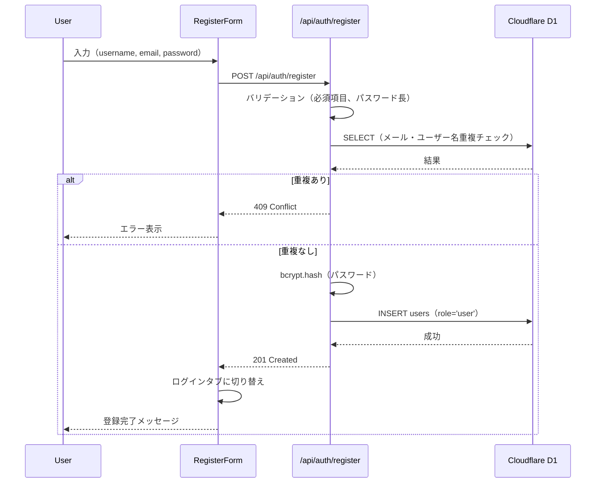
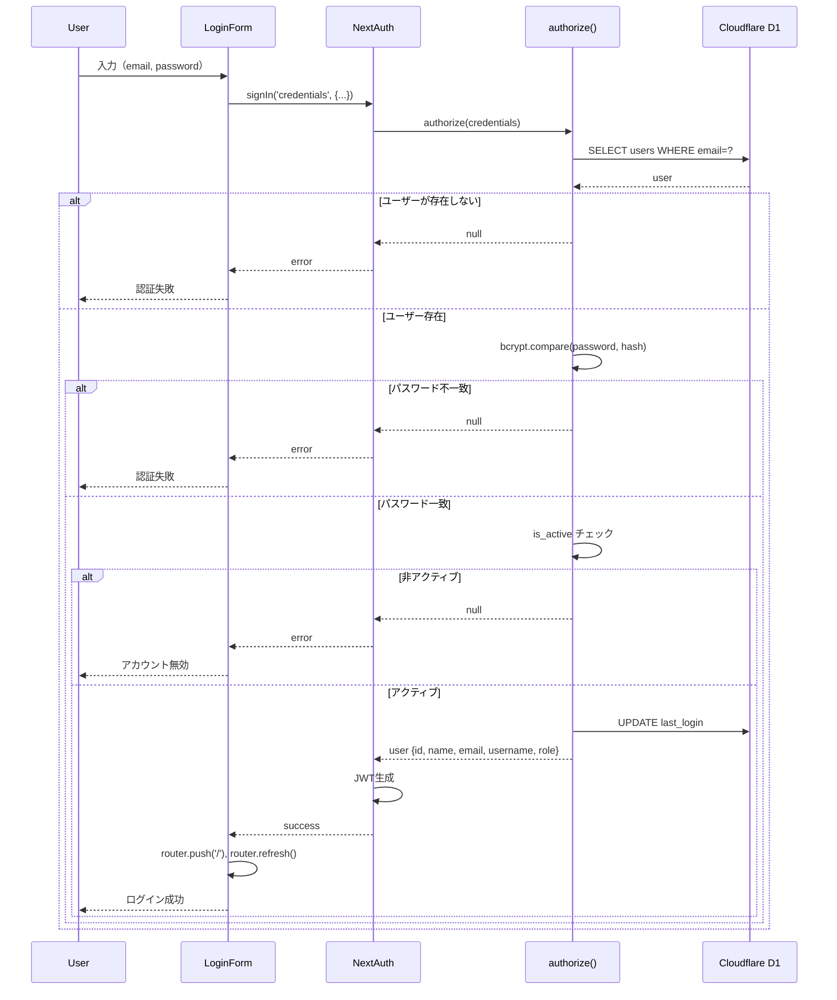

# 認証機能の現状分析と改善提案

## 概要

本ドキュメントでは、Stats47 プロジェクトの認証機能（ログイン・権限管理）の現状を詳細に分析し、効率的で確実な実装に向けた改善提案と具体的な実装手順を提示します。

**調査日**: 2025-01-XX
**対象バージョン**: Next.js 15 + NextAuth (Auth.js) v5

---

## 目次

1. [現状の認証実装](#現状の認証実装)
2. [認証フローの詳細](#認証フローの詳細)
3. [権限管理の実装状況](#権限管理の実装状況)
4. [問題点の特定](#問題点の特定)
5. [改善提案](#改善提案)
6. [権限による表示制御の方針](#権限による表示制御の方針)
7. [具体的な実装手順](#具体的な実装手順)
8. [テスト戦略](#テスト戦略)

---

## 現状の認証実装

### 使用技術

| 項目 | 技術 | バージョン |
|------|------|-----------|
| 認証ライブラリ | **NextAuth (Auth.js)** | v5 |
| プロバイダー | **Credentials** | - |
| セッション戦略 | **JWT** | - |
| パスワードハッシュ | **bcryptjs** | - |
| データベース | **Cloudflare D1 (SQLite)** | - |

### ファイル構成

```
src/
├── app/
│   └── api/
│       └── auth/
│           ├── [...nextauth]/route.ts      # NextAuth エンドポイント
│           └── register/route.ts           # ユーザー登録 API
├── lib/
│   └── auth/
│       └── auth.ts                        # NextAuth 設定
├── middleware.ts                          # ルート保護
├── hooks/
│   └── useAuth.ts                        # 認証カスタムフック
├── components/
│   └── auth/
│       ├── LoginForm.tsx                  # ログインフォーム
│       ├── RegisterForm.tsx               # 登録フォーム
│       ├── AuthModal.tsx                  # 認証モーダル
│       └── PasswordInput.tsx              # パスワード入力
└── types/
    └── next-auth.d.ts                     # NextAuth 型定義
```

### データベーススキーマ

**場所**: `database/migrations/001_auth_js_integration.sql`

```sql
-- ユーザーテーブル
CREATE TABLE users (
  id TEXT PRIMARY KEY,              -- UUID
  name TEXT,                        -- 表示名
  email TEXT UNIQUE NOT NULL,       -- メールアドレス（ログインID）
  emailVerified DATETIME,           -- メール確認日時
  image TEXT,                       -- プロフィール画像
  username TEXT UNIQUE,             -- ユーザー名
  password_hash TEXT,               -- ハッシュ化パスワード
  role TEXT DEFAULT 'user',         -- 'admin' or 'user'
  is_active BOOLEAN DEFAULT 1,      -- アクティブフラグ
  last_login DATETIME,              -- 最終ログイン
  created_at DATETIME DEFAULT CURRENT_TIMESTAMP,
  updated_at DATETIME DEFAULT CURRENT_TIMESTAMP
);

-- Auth.js 必須テーブル
CREATE TABLE accounts (...);        -- OAuth プロバイダー情報
CREATE TABLE sessions (...);        -- セッション情報（未使用: JWT戦略）
CREATE TABLE verification_tokens (...);  -- メール確認トークン
```

**特徴**:
- `role` カラムで権限管理（'admin' / 'user'）
- `is_active` でアカウント有効化制御
- `last_login` でログイン履歴を記録

---

## 認証フローの詳細

### 1. ユーザー登録フロー

**場所**: `src/app/api/auth/register/route.ts`



**実装の良い点**:
- パスワード長のバリデーション（8文字以上）
- bcryptによる安全なパスワードハッシュ化（salt rounds: 10）
- メールアドレスとユーザー名の重複チェック
- デフォルトで `role='user'` を設定

**問題点**:
- パスワード強度チェックがない（大文字・小文字・数字・記号の組み合わせ）
- メール確認フローがない
- レート制限がない（ブルートフォース攻撃対策）

### 2. ログインフロー

**場所**: `src/lib/auth/auth.ts:16-68`



**実装の良い点**:
- `is_active` チェックによるアカウント無効化機能
- 最終ログイン日時の自動更新
- エラーメッセージを統一（セキュリティ）
- JWT戦略によるステートレス認証

**問題点**:
- ログイン試行回数の制限がない
- 2要素認証（2FA）がない
- セッションタイムアウトの明示的な通知がない

### 3. セッション管理

**場所**: `src/lib/auth/auth.ts:72-102`

```typescript
session: {
  strategy: "jwt",              // JWT戦略
  maxAge: 30 * 24 * 60 * 60,    // 30日間有効
  updateAge: 24 * 60 * 60,      // 24時間ごとに更新
},

callbacks: {
  async session({ session, token }) {
    // JWTトークンからセッションにユーザー情報を注入
    if (session.user && token) {
      session.user.id = token.id as string;
      session.user.username = token.username as string;
      session.user.role = token.role as "admin" | "user";
    }
    return session;
  },
  async jwt({ token, user }) {
    // ログイン時にユーザー情報をJWTに追加
    if (user) {
      token.id = user.id;
      token.username = user.username || "";
      token.role = user.role || "user";
    }
    return token;
  },
}
```

**実装の良い点**:
- JWT戦略によりデータベースへの問い合わせが不要
- セッションに `role` を含めることで権限チェックが高速
- 30日間の長期セッション（リメンバーミー機能）

**問題点**:
- JWTの即座な無効化ができない（ログアウト後もトークンは有効）
- ロール変更時に即座に反映されない（最大24時間のラグ）
- リフレッシュトークンの仕組みがない

### 4. ミドルウェアによるルート保護

**場所**: `src/middleware.ts`

```typescript
export default auth((req) => {
  const { pathname } = req.nextUrl;
  const isLoggedIn = !!req.auth;
  const isAdmin = req.auth?.user?.role === "admin";

  // 認証が必要なパス
  const protectedPaths = ["/profile", "/admin"];
  const isProtectedPath = protectedPaths.some((path) =>
    pathname.startsWith(path)
  );

  // 管理者専用パス
  const adminPaths = ["/admin"];
  const isAdminPath = adminPaths.some((path) => pathname.startsWith(path));

  // 未認証ユーザーを保護されたパスから除外
  if (isProtectedPath && !isLoggedIn) {
    const homeUrl = new URL("/", req.url);
    homeUrl.searchParams.set("auth", "true");
    homeUrl.searchParams.set("callbackUrl", pathname);
    return Response.redirect(homeUrl);
  }

  // 非管理者を管理者専用パスから除外
  if (isAdminPath && !isAdmin) {
    return Response.redirect(new URL("/", req.url));
  }

  return;
});

export const config = {
  matcher: ["/((?!api/auth|_next/static|_next/image|favicon.ico).*)"],
};
```

**実装の良い点**:
- ミドルウェアレベルでの認証・認可チェック
- 未認証ユーザーに対して認証モーダルを表示（`auth=true`）
- コールバックURLで元のページに戻る機能

**問題点**:
- `protectedPaths` と `adminPaths` がハードコード
- 動的ルートの保護が困難（例: `/users/[id]/edit`）
- ロール以外の細かい権限制御ができない

---

## 権限管理の実装状況

### ロール定義

現在のシステムでは2つのロールを定義:

| ロール | 説明 | デフォルト |
|--------|------|-----------|
| `user` | 一般ユーザー | ✓ |
| `admin` | 管理者 | - |

**型定義**: `src/types/next-auth.d.ts`

```typescript
interface Session {
  user: {
    id: string;
    username: string;
    role: "admin" | "user";  // ← 型安全なロール定義
  } & DefaultSession["user"];
}
```

### 権限チェックの実装パターン

#### パターン1: カスタムフック `useAuth`

**場所**: `src/hooks/useAuth.ts`

```typescript
export function useAuth() {
  const { data: session, status } = useSession();

  const isLoading = status === "loading";
  const isAuthenticated = status === "authenticated";
  const isAdmin = session?.user?.role === "admin";

  return {
    session,
    isLoading,
    isAuthenticated,
    isAdmin,
  };
}
```

**使用例**:
```typescript
// src/components/ranking/containers/RankingContainer.tsx
const { isAdmin, isLoading } = useAuth();

if (isLoading) return <LoadingView />;

return (
  <div>
    {isAdmin ? <AdminNavigation /> : <UserNavigation />}
  </div>
);
```

**メリット**:
- コードの簡潔化
- ロジックの再利用
- 開発環境でのデバッグログ

**デメリット**:
- まだ一部のコンポーネントで直接 `useSession` を使用
- テストが困難（useSessionのモックが必要）

#### パターン2: 直接 `useSession` を使用

**場所**: `src/app/admin/page.tsx`, `src/app/profile/page.tsx`, `src/components/layout/Header.tsx`

```typescript
const { data: session, status } = useSession();
const isAdmin = session?.user?.role === "admin";
```

**問題点**:
- コードの重複
- 一貫性の欠如（`useAuth` と `useSession` が混在）

#### パターン3: コンポーネント内での条件レンダリング

**場所**: `src/components/layout/Header.tsx:114-136`

```typescript
{isAdmin && (
  <Link
    href="/admin"
    className="block px-4 py-2 text-sm"
  >
    管理画面
  </Link>
)}
```

**場所**: `src/app/profile/page.tsx`

```typescript
{user.role === "admin" && (
  <div className="bg-blue-50 p-4 rounded">
    <p className="text-sm text-blue-800">
      管理者権限があります
    </p>
  </div>
)}
```

**メリット**:
- シンプルで直感的
- 小規模な権限制御に適している

**デメリット**:
- 複雑な権限ロジックには不向き
- コードが散らばる

#### パターン4: API Route での権限チェック

**場所**: `src/app/api/ranking-items/route.ts:10-13`

```typescript
export async function POST(request: Request) {
  const session = await auth();

  if (!session?.user || session.user.role !== "admin") {
    return NextResponse.json({ error: "Unauthorized" }, { status: 403 });
  }

  // 処理...
}
```

**同様の実装**:
- `src/app/api/ranking-items/reorder/route.ts`
- `src/app/api/ranking-items/item/[id]/route.ts`
- `src/app/api/admin/users/route.ts`
- `src/app/api/admin/users/[id]/route.ts`

**メリット**:
- サーバー側での確実な権限チェック
- クライアント側のバイパス不可

**デメリット**:
- コードの重複（各APIルートで同じチェック）
- エラーメッセージが統一されていない

---

## 問題点の特定

### 1. コードの重複

#### 問題1.1: 権限チェックの重複

**現状**:
- `useAuth` フックが存在するが、多くのコンポーネントで `useSession` を直接使用
- API Route で同じ権限チェックコードが繰り返される

**影響**:
- メンテナンスコストの増大
- バグの混入リスク
- 一貫性の欠如

**該当箇所**:
```typescript
// パターンA（useAuth使用）
// src/components/ranking/containers/RankingContainer.tsx
const { isAdmin } = useAuth();

// パターンB（useSession直接使用）
// src/app/admin/page.tsx
const { data: session } = useSession();
const isAdmin = session?.user?.role === "admin";

// パターンC（Header.tsx）
const isAdmin = user?.role === "admin";
```

#### 問題1.2: API Route での重複チェック

**現状**:
```typescript
// すべてのAdmin APIで同じコード
if (!session?.user || session.user.role !== "admin") {
  return NextResponse.json({ error: "Unauthorized" }, { status: 403 });
}
```

**該当箇所**: 5+ API Routes

### 2. 一貫性の欠如

#### 問題2.1: エラーメッセージの不統一

```typescript
// パターンA
return NextResponse.json({ error: "Unauthorized" }, { status: 403 });

// パターンB
return NextResponse.json({ error: "認証が必要です" }, { status: 401 });

// パターンC
return NextResponse.json({ error: "権限がありません" }, { status: 403 });
```

#### 問題2.2: ステータスコードの不統一

- 未認証: `401 Unauthorized` vs `403 Forbidden` の混在
- 権限不足: `403 Forbidden` vs `401 Unauthorized` の混在

### 3. セキュリティ上の問題

#### 問題3.1: クライアント側のみの権限チェック

**リスク**:
- ブラウザの開発者ツールで簡単にバイパス可能
- JavaScriptを無効化すると表示される

**該当箇所**:
```typescript
// クライアントコンポーネントでの条件レンダリング
{isAdmin && <AdminButton />}
// ↑ JSで簡単にバイパス可能
```

**対策の欠如**:
- 重要な操作はすべてAPI Route経由で行うべきだが、一部のページでは実装されていない

#### 問題3.2: JWT の即座な無効化ができない

**リスク**:
- ユーザーをBANしてもトークンが有効（最大30日間）
- ロール変更が即座に反映されない（最大24時間）
- パスワード変更後も古いトークンが有効

**現状**:
```typescript
session: {
  strategy: "jwt",
  maxAge: 30 * 24 * 60 * 60,    // 30日間有効
  updateAge: 24 * 60 * 60,      // 24時間ごとに更新
}
```

#### 問題3.3: レート制限の欠如

**リスク**:
- ブルートフォース攻撃に脆弱
- アカウント登録の大量実行

**該当箇所**:
- `/api/auth/register` - レート制限なし
- `Credentials.authorize()` - ログイン試行回数制限なし

### 4. エラーハンドリングの不足

#### 問題4.1: ログインエラーの詳細が不明確

**現状**:
```typescript
// LoginForm.tsx
if (result?.error) {
  setError("メールアドレスまたはパスワードが正しくありません");
}
```

**問題**:
- すべてのエラーを同じメッセージで処理
- アカウント無効化の場合も同じメッセージ
- ユーザーが原因を特定できない

#### 問題4.2: 認証エラー時のリダイレクト

**現状**:
```typescript
// middleware.ts
if (isProtectedPath && !isLoggedIn) {
  const homeUrl = new URL("/", req.url);
  homeUrl.searchParams.set("auth", "true");
  return Response.redirect(homeUrl);
}
```

**問題**:
- リダイレクト後にエラーメッセージが表示されない
- ユーザーが「なぜログインが必要か」を理解できない

### 5. テストの欠如

#### 問題5.1: 認証ロジックのテストがない

**該当箇所**:
- `src/lib/auth/auth.ts` - ユニットテストなし
- `src/hooks/useAuth.ts` - ユニットテストなし
- `src/middleware.ts` - 統合テストなし

#### 問題5.2: 権限チェックのE2Eテストがない

**リスク**:
- 権限チェックのバグが本番環境で発生
- リグレッションの検出ができない

### 6. UX の問題

#### 問題6.1: ローディング状態の不統一

```typescript
// パターンA: useAuth使用
const { isLoading } = useAuth();
if (isLoading) return <LoadingView />;

// パターンB: 直接チェック
if (status === "loading") return <div>Loading...</div>;

// パターンC: ローディング表示なし
```

#### 問題6.2: セッション切れの通知がない

**問題**:
- セッションが切れても通知がない
- 操作中に突然ログイン画面にリダイレクト

---

## 改善提案

### 提案1: 統一的な認証・認可パターンの確立

#### 1.1 すべてのコンポーネントで `useAuth` を使用

**Before**:
```typescript
// 直接useSessionを使用（非推奨）
const { data: session } = useSession();
const isAdmin = session?.user?.role === "admin";
```

**After**:
```typescript
// useAuthフックを統一使用
const { isAdmin, isLoading, isAuthenticated, session } = useAuth();
```

**移行対象**:
- `src/app/admin/page.tsx`
- `src/app/profile/page.tsx`
- `src/app/profile/edit/page.tsx`
- `src/components/layout/Header.tsx`

#### 1.2 高階コンポーネント（HOC）の導入

**新規ファイル**: `src/components/auth/withAuth.tsx`

```typescript
import { useAuth } from "@/hooks/useAuth";
import { useRouter } from "next/navigation";
import { ComponentType, useEffect } from "react";

interface WithAuthOptions {
  requireAuth?: boolean;      // 認証が必要
  requireAdmin?: boolean;     // 管理者権限が必要
  redirectTo?: string;        // リダイレクト先
}

export function withAuth<P extends object>(
  Component: ComponentType<P>,
  options: WithAuthOptions = {}
) {
  const {
    requireAuth = true,
    requireAdmin = false,
    redirectTo = "/",
  } = options;

  return function ProtectedComponent(props: P) {
    const { isAuthenticated, isAdmin, isLoading } = useAuth();
    const router = useRouter();

    useEffect(() => {
      if (isLoading) return;

      if (requireAuth && !isAuthenticated) {
        // 未認証ユーザーをリダイレクト
        router.push(`${redirectTo}?auth=true&callbackUrl=${window.location.pathname}`);
        return;
      }

      if (requireAdmin && !isAdmin) {
        // 非管理者をリダイレクト
        router.push(redirectTo);
        return;
      }
    }, [isAuthenticated, isAdmin, isLoading, router]);

    if (isLoading) {
      return (
        <div className="flex items-center justify-center min-h-screen">
          <div className="animate-spin rounded-full h-8 w-8 border-b-2 border-indigo-600"></div>
        </div>
      );
    }

    if (requireAuth && !isAuthenticated) return null;
    if (requireAdmin && !isAdmin) return null;

    return <Component {...props} />;
  };
}
```

**使用例**:
```typescript
// 認証が必要なページ
export default withAuth(ProfilePage);

// 管理者専用ページ
export default withAuth(AdminPage, { requireAdmin: true });
```

#### 1.3 条件レンダリング用コンポーネント

**新規ファイル**: `src/components/auth/RequireAuth.tsx`

```typescript
import { useAuth } from "@/hooks/useAuth";
import { ReactNode } from "react";

interface RequireAuthProps {
  children: ReactNode;
  requireAdmin?: boolean;
  fallback?: ReactNode;
}

export function RequireAuth({ children, requireAdmin = false, fallback = null }: RequireAuthProps) {
  const { isAuthenticated, isAdmin, isLoading } = useAuth();

  if (isLoading) {
    return <div className="animate-pulse bg-gray-200 h-8 w-32 rounded"></div>;
  }

  if (!isAuthenticated) return fallback;
  if (requireAdmin && !isAdmin) return fallback;

  return <>{children}</>;
}
```

**使用例**:
```typescript
// 認証済みユーザーにのみ表示
<RequireAuth>
  <ProfileButton />
</RequireAuth>

// 管理者にのみ表示
<RequireAuth requireAdmin>
  <AdminDashboard />
</RequireAuth>

// フォールバックを指定
<RequireAuth fallback={<LoginPrompt />}>
  <SecretContent />
</RequireAuth>
```

### 提案2: API Route の権限チェック統一

#### 2.1 ミドルウェア関数の作成

**新規ファイル**: `src/lib/auth/api-guards.ts`

```typescript
import { auth } from "@/lib/auth/auth";
import { NextResponse } from "next/server";

/**
 * API Route用の認証チェックミドルウェア
 */
export async function requireAuth() {
  const session = await auth();

  if (!session?.user) {
    return {
      error: NextResponse.json(
        { error: "認証が必要です", code: "UNAUTHORIZED" },
        { status: 401 }
      ),
      session: null,
    };
  }

  return { error: null, session };
}

/**
 * API Route用の管理者権限チェックミドルウェア
 */
export async function requireAdmin() {
  const { error, session } = await requireAuth();

  if (error) return { error, session: null };

  if (session!.user.role !== "admin") {
    return {
      error: NextResponse.json(
        { error: "管理者権限が必要です", code: "FORBIDDEN" },
        { status: 403 }
      ),
      session: null,
    };
  }

  return { error: null, session };
}
```

**使用例**:

**Before**:
```typescript
// src/app/api/ranking-items/route.ts
export async function POST(request: Request) {
  const session = await auth();

  if (!session?.user || session.user.role !== "admin") {
    return NextResponse.json({ error: "Unauthorized" }, { status: 403 });
  }

  // 処理...
}
```

**After**:
```typescript
import { requireAdmin } from "@/lib/auth/api-guards";

export async function POST(request: Request) {
  const { error, session } = await requireAdmin();
  if (error) return error;

  // 処理（sessionは確実に存在）
  const userId = session.user.id;
  // ...
}
```

**メリット**:
- コードの重複排除（DRY原則）
- エラーメッセージの統一
- ステータスコードの統一
- テストが容易

#### 2.2 エラーレスポンスの統一

**新規ファイル**: `src/lib/auth/api-responses.ts`

```typescript
import { NextResponse } from "next/server";

export const AuthErrors = {
  UNAUTHORIZED: {
    error: "認証が必要です",
    code: "UNAUTHORIZED",
    status: 401,
  },
  FORBIDDEN: {
    error: "この操作を実行する権限がありません",
    code: "FORBIDDEN",
    status: 403,
  },
  INVALID_CREDENTIALS: {
    error: "メールアドレスまたはパスワードが正しくありません",
    code: "INVALID_CREDENTIALS",
    status: 401,
  },
  ACCOUNT_INACTIVE: {
    error: "このアカウントは無効化されています",
    code: "ACCOUNT_INACTIVE",
    status: 403,
  },
  SESSION_EXPIRED: {
    error: "セッションの有効期限が切れました",
    code: "SESSION_EXPIRED",
    status: 401,
  },
} as const;

export function createErrorResponse(errorType: keyof typeof AuthErrors) {
  const error = AuthErrors[errorType];
  return NextResponse.json(
    { error: error.error, code: error.code },
    { status: error.status }
  );
}
```

### 提案3: JWT トークンの即座な無効化機構

#### 3.1 ブラックリスト方式

**新規テーブル**: `database/migrations/003_token_blacklist.sql`

```sql
CREATE TABLE token_blacklist (
  jti TEXT PRIMARY KEY,           -- JWT ID（トークンの一意識別子）
  user_id TEXT NOT NULL,          -- ユーザーID
  expires_at DATETIME NOT NULL,   -- トークンの有効期限
  reason TEXT,                    -- 無効化理由（logout, ban, password_change）
  created_at DATETIME DEFAULT CURRENT_TIMESTAMP,
  FOREIGN KEY (user_id) REFERENCES users(id) ON DELETE CASCADE
);

CREATE INDEX idx_blacklist_expires ON token_blacklist(expires_at);
CREATE INDEX idx_blacklist_user ON token_blacklist(user_id);
```

**実装**: `src/lib/auth/token-blacklist.ts`

```typescript
import { createD1Database } from "@/lib/d1-client";

/**
 * トークンをブラックリストに追加
 */
export async function blacklistToken(
  jti: string,
  userId: string,
  expiresAt: Date,
  reason: "logout" | "ban" | "password_change"
) {
  const db = await createD1Database();
  await db
    .prepare(
      "INSERT INTO token_blacklist (jti, user_id, expires_at, reason) VALUES (?, ?, ?, ?)"
    )
    .bind(jti, userId, expiresAt.toISOString(), reason)
    .run();
}

/**
 * トークンがブラックリストに存在するかチェック
 */
export async function isTokenBlacklisted(jti: string): Promise<boolean> {
  const db = await createD1Database();
  const result = await db
    .prepare("SELECT 1 FROM token_blacklist WHERE jti = ? AND expires_at > datetime('now')")
    .bind(jti)
    .first();
  return !!result;
}

/**
 * 期限切れトークンをクリーンアップ（定期実行）
 */
export async function cleanupExpiredTokens() {
  const db = await createD1Database();
  await db
    .prepare("DELETE FROM token_blacklist WHERE expires_at <= datetime('now')")
    .run();
}
```

**NextAuth 設定に統合**:

```typescript
// src/lib/auth/auth.ts
import { isTokenBlacklisted } from "./token-blacklist";

export const authConfig: NextAuthConfig = {
  // ...
  callbacks: {
    async jwt({ token, user }) {
      // 既存の処理
      if (user) {
        token.id = user.id;
        token.jti = crypto.randomUUID(); // JWT IDを生成
        // ...
      }

      // ブラックリストチェック
      if (token.jti && await isTokenBlacklisted(token.jti as string)) {
        // トークンが無効化されている
        return null; // これによりセッションが無効化される
      }

      return token;
    },
    // ...
  },
};
```

**ログアウト時にトークンを無効化**:

```typescript
// src/app/api/auth/logout/route.ts
import { auth } from "@/lib/auth/auth";
import { blacklistToken } from "@/lib/auth/token-blacklist";

export async function POST() {
  const session = await auth();

  if (session?.user) {
    const token = await getToken({ req }); // JWT取得
    if (token?.jti) {
      await blacklistToken(
        token.jti,
        session.user.id,
        new Date(token.exp * 1000),
        "logout"
      );
    }
  }

  // NextAuthのログアウト処理
  // ...
}
```

#### 3.2 セッションバージョン方式（軽量）

**usersテーブルに追加**:

```sql
ALTER TABLE users ADD COLUMN session_version INTEGER DEFAULT 1;
```

**ロジック**:

```typescript
// ログイン時にバージョンをJWTに保存
async jwt({ token, user }) {
  if (user) {
    token.sessionVersion = user.sessionVersion || 1;
  }

  // 検証時にバージョンをチェック
  if (token.id) {
    const db = await createD1Database();
    const user = await db
      .prepare("SELECT session_version FROM users WHERE id = ?")
      .bind(token.id)
      .first();

    if (user && user.session_version !== token.sessionVersion) {
      // バージョン不一致 = トークン無効
      return null;
    }
  }

  return token;
}

// ログアウト・BAN・パスワード変更時にバージョンをインクリメント
await db
  .prepare("UPDATE users SET session_version = session_version + 1 WHERE id = ?")
  .bind(userId)
  .run();
```

**メリット**:
- ブラックリストテーブル不要
- シンプルな実装
- 高速なチェック

**デメリット**:
- すべてのセッションが一度に無効化される（個別制御不可）

### 提案4: レート制限の実装

#### 4.1 Redis + Upstash Rate Limit

**インストール**:
```bash
npm install @upstash/ratelimit @upstash/redis
```

**設定**: `src/lib/rate-limit.ts`

```typescript
import { Ratelimit } from "@upstash/ratelimit";
import { Redis } from "@upstash/redis";

// ログイン試行制限（5回/15分）
export const loginRateLimit = new Ratelimit({
  redis: Redis.fromEnv(),
  limiter: Ratelimit.slidingWindow(5, "15 m"),
  analytics: true,
  prefix: "ratelimit:login",
});

// 登録制限（3回/時間）
export const registerRateLimit = new Ratelimit({
  redis: Redis.fromEnv(),
  limiter: Ratelimit.slidingWindow(3, "1 h"),
  analytics: true,
  prefix: "ratelimit:register",
});

// API制限（100回/分）
export const apiRateLimit = new Ratelimit({
  redis: Redis.fromEnv(),
  limiter: Ratelimit.slidingWindow(100, "1 m"),
  analytics: true,
  prefix: "ratelimit:api",
});
```

**使用例（ログイン）**:

```typescript
// src/lib/auth/auth.ts
import { loginRateLimit } from "@/lib/rate-limit";

async authorize(credentials) {
  const identifier = credentials.email as string;

  // レート制限チェック
  const { success, remaining } = await loginRateLimit.limit(identifier);

  if (!success) {
    console.warn(`Login rate limit exceeded for ${identifier}`);
    return null; // ログイン失敗
  }

  // 既存の認証ロジック
  // ...
}
```

**使用例（API Route）**:

```typescript
// src/app/api/admin/users/route.ts
import { apiRateLimit } from "@/lib/rate-limit";

export async function GET(request: Request) {
  const ip = request.headers.get("x-forwarded-for") || "anonymous";

  const { success } = await apiRateLimit.limit(ip);
  if (!success) {
    return NextResponse.json(
      { error: "レート制限を超えました。しばらくしてから再試行してください。" },
      { status: 429 }
    );
  }

  // 既存の処理
  // ...
}
```

#### 4.2 代替案: Cloudflare Workers KV

Upstashが使えない場合、Cloudflare Workers KVで実装可能。

### 提案5: エラーハンドリングの改善

#### 5.1 詳細なエラーメッセージ

**Before**:
```typescript
if (result?.error) {
  setError("メールアドレスまたはパスワードが正しくありません");
}
```

**After**:
```typescript
if (result?.error) {
  // エラーコードに応じてメッセージを切り替え
  const errorCode = result.error;

  switch (errorCode) {
    case "CredentialsSignin":
      setError("メールアドレスまたはパスワードが正しくありません");
      break;
    case "AccountInactive":
      setError("このアカウントは無効化されています。管理者にお問い合わせください。");
      break;
    case "RateLimitExceeded":
      setError("ログイン試行回数が上限に達しました。15分後に再試行してください。");
      break;
    default:
      setError("ログイン中にエラーが発生しました");
  }
}
```

#### 5.2 トースト通知の導入

**インストール**:
```bash
npm install sonner
```

**使用例**:
```typescript
import { toast } from "sonner";

// 成功時
toast.success("ログインしました");

// エラー時
toast.error("ログインに失敗しました", {
  description: "メールアドレスまたはパスワードが正しくありません",
});

// セッション期限切れ
toast.warning("セッションの有効期限が切れました", {
  description: "再度ログインしてください",
  action: {
    label: "ログイン",
    onClick: () => router.push("/login"),
  },
});
```

---

## 権限による表示制御の方針

### 実装方針の全体像

| レイヤー | 目的 | 実装方法 |
|---------|------|---------|
| **クライアント** | UX向上 | 条件レンダリング、コンポーネント |
| **ミドルウェア** | ルート保護 | Next.js Middleware |
| **API Route** | データ保護（最重要） | 権限チェックミドルウェア |

**重要**: クライアント側の権限チェックは **UX向上のため** のみ。セキュリティは **API Route で担保** する。

### 1. ページレベルの保護

#### 方法A: HOC（推奨）

```typescript
// src/app/admin/page.tsx
import { withAuth } from "@/components/auth/withAuth";

function AdminPage() {
  return <div>管理画面</div>;
}

export default withAuth(AdminPage, { requireAdmin: true });
```

**メリット**:
- 宣言的でわかりやすい
- リダイレクト処理を自動化
- ローディング状態を自動管理

#### 方法B: サーバーコンポーネント

```typescript
// src/app/admin/page.tsx
import { auth } from "@/lib/auth/auth";
import { redirect } from "next/navigation";

export default async function AdminPage() {
  const session = await auth();

  if (!session?.user || session.user.role !== "admin") {
    redirect("/?auth=true");
  }

  return <div>管理画面</div>;
}
```

**メリット**:
- サーバー側で認証チェック（高速）
- SEO対策（認証ページはインデックスされない）

### 2. コンポーネントレベルの保護

#### 方法A: `RequireAuth` コンポーネント（推奨）

```typescript
import { RequireAuth } from "@/components/auth/RequireAuth";

function Dashboard() {
  return (
    <div>
      {/* すべてのユーザーに表示 */}
      <PublicContent />

      {/* 認証済みユーザーにのみ表示 */}
      <RequireAuth>
        <UserOnlyContent />
      </RequireAuth>

      {/* 管理者にのみ表示 */}
      <RequireAuth requireAdmin>
        <AdminOnlyContent />
      </RequireAuth>

      {/* フォールバック指定 */}
      <RequireAuth fallback={<LoginButton />}>
        <ProtectedContent />
      </RequireAuth>
    </div>
  );
}
```

**メリット**:
- 宣言的で可読性が高い
- ローディング状態を自動管理
- 再利用可能

#### 方法B: useAuth + 条件レンダリング

```typescript
import { useAuth } from "@/hooks/useAuth";

function NavigationMenu() {
  const { isAuthenticated, isAdmin, isLoading } = useAuth();

  if (isLoading) return <MenuSkeleton />;

  return (
    <nav>
      {/* すべてのユーザー */}
      <HomeLink />

      {/* 認証済みユーザー */}
      {isAuthenticated && <ProfileLink />}

      {/* 管理者のみ */}
      {isAdmin && <AdminLink />}
    </nav>
  );
}
```

**メリット**:
- 細かい制御が可能
- 複雑な条件分岐に対応

### 3. UI要素レベルの保護

#### ボタンの無効化

```typescript
import { useAuth } from "@/hooks/useAuth";

function DeleteButton({ itemId }: { itemId: string }) {
  const { isAdmin } = useAuth();

  return (
    <button
      disabled={!isAdmin}
      className={!isAdmin ? "opacity-50 cursor-not-allowed" : ""}
      onClick={async () => {
        // クライアント側の二重チェック（念のため）
        if (!isAdmin) {
          toast.error("管理者権限が必要です");
          return;
        }

        // API呼び出し（サーバー側で再度権限チェック）
        await deleteItem(itemId);
      }}
    >
      削除
    </button>
  );
}
```

#### ツールチップによる説明

```typescript
import { useAuth } from "@/hooks/useAuth";
import { Tooltip } from "@/components/common/Tooltip";

function ProtectedAction() {
  const { isAdmin } = useAuth();

  return (
    <Tooltip
      content={!isAdmin ? "この操作には管理者権限が必要です" : ""}
      disabled={isAdmin}
    >
      <button disabled={!isAdmin}>
        高度な設定
      </button>
    </Tooltip>
  );
}
```

### 4. API Routeでの保護（必須）

```typescript
// src/app/api/items/[id]/route.ts
import { requireAdmin } from "@/lib/auth/api-guards";

export async function DELETE(
  request: Request,
  { params }: { params: { id: string } }
) {
  // 管理者権限チェック（必須）
  const { error, session } = await requireAdmin();
  if (error) return error;

  // 処理
  await deleteItem(params.id, session.user.id);

  return NextResponse.json({ success: true });
}
```

**重要**: クライアント側のチェックを **絶対に信用しない**。すべての重要な操作はAPIで権限チェックを行う。

### 5. ミドルウェアでの保護

```typescript
// src/middleware.ts
export default auth((req) => {
  const { pathname } = req.nextUrl;
  const isAdmin = req.auth?.user?.role === "admin";

  // 動的な保護パスの定義
  const protectedRoutes = [
    { path: "/admin", requireAdmin: true },
    { path: "/profile", requireAuth: true },
    { path: "/settings", requireAuth: true },
  ];

  for (const route of protectedRoutes) {
    if (pathname.startsWith(route.path)) {
      if (route.requireAdmin && !isAdmin) {
        return Response.redirect(new URL("/", req.url));
      }
      if (route.requireAuth && !req.auth) {
        const url = new URL("/", req.url);
        url.searchParams.set("auth", "true");
        url.searchParams.set("callbackUrl", pathname);
        return Response.redirect(url);
      }
    }
  }

  return;
});
```

### 6. 権限チェックのベストプラクティス

#### ✅ DO（推奨）

```typescript
// 1. useAuth フックを使用
const { isAdmin } = useAuth();

// 2. RequireAuth コンポーネントを使用
<RequireAuth requireAdmin>
  <AdminContent />
</RequireAuth>

// 3. API Route で必ず権限チェック
const { error, session } = await requireAdmin();
if (error) return error;

// 4. ツールチップで理由を説明
<Tooltip content="管理者権限が必要です">
  <button disabled={!isAdmin}>削除</button>
</Tooltip>
```

#### ❌ DON'T（非推奨）

```typescript
// 1. useSession を直接使用（useAuth を使うべき）
const { data: session } = useSession();
const isAdmin = session?.user?.role === "admin";

// 2. クライアント側のチェックのみ（APIでもチェックすべき）
{isAdmin && <DeleteButton />}

// 3. 権限チェック漏れ
export async function DELETE() {
  // 権限チェックなし！
  await deleteItem();
}

// 4. ハードコードされた権限チェック
if (user.role === "admin") {
  // 複数箇所で同じコードを繰り返す
}
```

---

## 具体的な実装手順

### フェーズ1: 基盤整備（1-2日）

#### Step 1.1: 権限チェックユーティリティの作成

- [ ] `src/lib/auth/api-guards.ts` を作成
  - `requireAuth()` 関数
  - `requireAdmin()` 関数
- [ ] `src/lib/auth/api-responses.ts` を作成
  - エラーレスポンスの統一定義
- [ ] ユニットテストを作成
  - `src/lib/auth/__tests__/api-guards.test.ts`

**所要時間**: 2-3時間

#### Step 1.2: 認証コンポーネントの作成

- [ ] `src/components/auth/withAuth.tsx` を作成（HOC）
- [ ] `src/components/auth/RequireAuth.tsx` を作成
- [ ] `src/components/auth/AuthLoadingView.tsx` を作成（共通ローディング）
- [ ] Storybook でコンポーネントを確認

**所要時間**: 3-4時間

#### Step 1.3: useAuth フックの改善

- [ ] `src/hooks/useAuth.ts` にメモ化を追加
- [ ] デバッグログをオプション化
- [ ] TypeScript の型を厳密化

**所要時間**: 1時間

### フェーズ2: 既存コードのリファクタリング（2-3日）

#### Step 2.1: useSession → useAuth への移行

**優先度: 高**

- [ ] `src/app/admin/page.tsx` - useAuth に変更
- [ ] `src/app/profile/page.tsx` - useAuth に変更
- [ ] `src/app/profile/edit/page.tsx` - useAuth に変更
- [ ] `src/components/layout/Header.tsx` - useAuth に変更

**所要時間**: 2-3時間

#### Step 2.2: API Route の権限チェック統一

**優先度: 最高（セキュリティ）**

- [ ] `src/app/api/ranking-items/route.ts` - requireAdmin 使用
- [ ] `src/app/api/ranking-items/reorder/route.ts` - requireAdmin 使用
- [ ] `src/app/api/ranking-items/item/[id]/route.ts` - requireAdmin 使用
- [ ] `src/app/api/admin/users/route.ts` - requireAdmin 使用
- [ ] `src/app/api/admin/users/[id]/route.ts` - requireAdmin 使用

**所要時間**: 3-4時間

#### Step 2.3: コンポーネントの条件レンダリング改善

- [ ] `src/components/layout/Header.tsx` - RequireAuth 使用
- [ ] `src/components/ranking/RankingClient/RankingNavigationEditable.tsx` - RequireAuth 使用
- [ ] その他の条件レンダリング箇所を特定して修正

**所要時間**: 3-4時間

### フェーズ3: セキュリティ強化（2-3日）

#### Step 3.1: JWT 無効化機構の実装

**オプション**: セッションバージョン方式（軽量）を推奨

- [ ] `users` テーブルに `session_version` カラムを追加
- [ ] マイグレーションファイルを作成
- [ ] `src/lib/auth/auth.ts` の `jwt` コールバックに検証ロジックを追加
- [ ] ログアウト時にバージョンをインクリメント
- [ ] ユニットテストを作成

**所要時間**: 4-5時間

#### Step 3.2: レート制限の実装

**優先度: 高**

- [ ] Upstash Redis アカウントを作成（無料枠）
- [ ] `@upstash/ratelimit` と `@upstash/redis` をインストール
- [ ] `src/lib/rate-limit.ts` を作成
- [ ] ログイン API にレート制限を追加
- [ ] 登録 API にレート制限を追加
- [ ] 主要な API Route にレート制限を追加
- [ ] テストを作成

**所要時間**: 3-4時間

#### Step 3.3: エラーハンドリングの改善

- [ ] `sonner` をインストール（トースト通知）
- [ ] `src/app/layout.tsx` に Toaster を追加
- [ ] ログインフォームのエラーメッセージを詳細化
- [ ] セッション期限切れ時の通知を追加
- [ ] 権限不足時のトースト表示を追加

**所要時間**: 2-3時間

### フェーズ4: テストの追加（2-3日）

#### Step 4.1: ユニットテスト

- [ ] `src/lib/auth/__tests__/api-guards.test.ts`
- [ ] `src/hooks/__tests__/useAuth.test.ts`
- [ ] `src/components/auth/__tests__/RequireAuth.test.tsx`
- [ ] `src/components/auth/__tests__/withAuth.test.tsx`

**所要時間**: 4-5時間

#### Step 4.2: 統合テスト

- [ ] 認証フローの統合テスト
- [ ] 権限チェックの統合テスト
- [ ] ミドルウェアの統合テスト

**所要時間**: 3-4時間

#### Step 4.3: E2Eテスト

- [ ] ログインフローのE2Eテスト
- [ ] 管理者専用ページのアクセステスト
- [ ] 権限不足時のリダイレクトテスト

**所要時間**: 3-4時間

### フェーズ5: ドキュメント整備（1日）

- [ ] 認証フローのドキュメント作成
- [ ] 権限チェックのベストプラクティスドキュメント
- [ ] トラブルシューティングガイド
- [ ] セキュリティチェックリスト

**所要時間**: 4-5時間

---

## テスト戦略

### 1. ユニットテスト

#### 1.1 API Guards のテスト

**ファイル**: `src/lib/auth/__tests__/api-guards.test.ts`

```typescript
import { describe, it, expect, vi } from "vitest";
import { requireAuth, requireAdmin } from "../api-guards";
import { auth } from "../auth";

vi.mock("../auth");

describe("requireAuth", () => {
  it("認証済みユーザーの場合、セッションを返す", async () => {
    const mockSession = {
      user: { id: "1", email: "user@example.com", role: "user" },
    };
    vi.mocked(auth).mockResolvedValue(mockSession);

    const { error, session } = await requireAuth();

    expect(error).toBeNull();
    expect(session).toEqual(mockSession);
  });

  it("未認証ユーザーの場合、401エラーを返す", async () => {
    vi.mocked(auth).mockResolvedValue(null);

    const { error, session } = await requireAuth();

    expect(session).toBeNull();
    expect(error).toBeDefined();
    expect(error?.status).toBe(401);
  });
});

describe("requireAdmin", () => {
  it("管理者の場合、セッションを返す", async () => {
    const mockSession = {
      user: { id: "1", email: "admin@example.com", role: "admin" },
    };
    vi.mocked(auth).mockResolvedValue(mockSession);

    const { error, session } = await requireAdmin();

    expect(error).toBeNull();
    expect(session).toEqual(mockSession);
  });

  it("一般ユーザーの場合、403エラーを返す", async () => {
    const mockSession = {
      user: { id: "1", email: "user@example.com", role: "user" },
    };
    vi.mocked(auth).mockResolvedValue(mockSession);

    const { error, session } = await requireAdmin();

    expect(session).toBeNull();
    expect(error).toBeDefined();
    expect(error?.status).toBe(403);
  });
});
```

#### 1.2 useAuth のテスト

**ファイル**: `src/hooks/__tests__/useAuth.test.ts`

```typescript
import { renderHook } from "@testing-library/react";
import { useSession } from "next-auth/react";
import { useAuth } from "../useAuth";
import { vi } from "vitest";

vi.mock("next-auth/react");

describe("useAuth", () => {
  it("認証済み管理者の情報を返す", () => {
    vi.mocked(useSession).mockReturnValue({
      data: {
        user: { id: "1", username: "admin", role: "admin", email: "admin@example.com" },
      },
      status: "authenticated",
    });

    const { result } = renderHook(() => useAuth());

    expect(result.current.isAuthenticated).toBe(true);
    expect(result.current.isAdmin).toBe(true);
    expect(result.current.isLoading).toBe(false);
  });

  it("一般ユーザーの情報を返す", () => {
    vi.mocked(useSession).mockReturnValue({
      data: {
        user: { id: "1", username: "user", role: "user", email: "user@example.com" },
      },
      status: "authenticated",
    });

    const { result } = renderHook(() => useAuth());

    expect(result.current.isAuthenticated).toBe(true);
    expect(result.current.isAdmin).toBe(false);
  });

  it("未認証状態を返す", () => {
    vi.mocked(useSession).mockReturnValue({
      data: null,
      status: "unauthenticated",
    });

    const { result } = renderHook(() => useAuth());

    expect(result.current.isAuthenticated).toBe(false);
    expect(result.current.isAdmin).toBe(false);
    expect(result.current.session).toBeNull();
  });
});
```

### 2. 統合テスト

#### 2.1 API Route のテスト

**ファイル**: `src/app/api/ranking-items/__tests__/route.test.ts`

```typescript
import { POST } from "../route";
import { auth } from "@/lib/auth/auth";
import { NextRequest } from "next/server";
import { vi } from "vitest";

vi.mock("@/lib/auth/auth");

describe("POST /api/ranking-items", () => {
  it("管理者は新規アイテムを作成できる", async () => {
    vi.mocked(auth).mockResolvedValue({
      user: { id: "1", email: "admin@example.com", role: "admin" },
    });

    const request = new NextRequest("http://localhost/api/ranking-items", {
      method: "POST",
      body: JSON.stringify({ name: "Test Item" }),
    });

    const response = await POST(request);
    const json = await response.json();

    expect(response.status).toBe(201);
    expect(json.success).toBe(true);
  });

  it("一般ユーザーは403エラーを受け取る", async () => {
    vi.mocked(auth).mockResolvedValue({
      user: { id: "1", email: "user@example.com", role: "user" },
    });

    const request = new NextRequest("http://localhost/api/ranking-items", {
      method: "POST",
      body: JSON.stringify({ name: "Test Item" }),
    });

    const response = await POST(request);

    expect(response.status).toBe(403);
  });
});
```

### 3. E2Eテスト

#### 3.1 Playwright でのログインフローテスト

**ファイル**: `e2e/auth.spec.ts`

```typescript
import { test, expect } from "@playwright/test";

test.describe("認証フロー", () => {
  test("ログインして管理画面にアクセスできる", async ({ page }) => {
    // ホームページに移動
    await page.goto("/");

    // ログインボタンをクリック
    await page.click('button:has-text("ログイン")');

    // ログインフォームに入力
    await page.fill('input[name="email"]', "admin@example.com");
    await page.fill('input[name="password"]', "password123");

    // ログイン実行
    await page.click('button[type="submit"]');

    // ログイン成功を確認
    await expect(page.locator("text=admin")).toBeVisible();

    // 管理画面にアクセス
    await page.goto("/admin");

    // 管理画面が表示されることを確認
    await expect(page.locator("text=管理画面")).toBeVisible();
  });

  test("一般ユーザーは管理画面にアクセスできない", async ({ page }) => {
    // ログイン
    await page.goto("/");
    await page.click('button:has-text("ログイン")');
    await page.fill('input[name="email"]', "user@example.com");
    await page.fill('input[name="password"]', "password123");
    await page.click('button[type="submit"]');

    // 管理画面にアクセスを試みる
    await page.goto("/admin");

    // ホームにリダイレクトされることを確認
    await expect(page).toHaveURL("/");
  });

  test("未認証ユーザーは認証モーダルが表示される", async ({ page }) => {
    // プロフィールページに直接アクセス
    await page.goto("/profile");

    // ホームにリダイレクトされ、認証モーダルが表示されることを確認
    await expect(page).toHaveURL("/?auth=true&callbackUrl=/profile");
    await expect(page.locator("text=ログイン")).toBeVisible();
  });
});
```

---

## まとめ

### 現状の評価

**良い点**:
- NextAuth (Auth.js) の適切な使用
- JWT 戦略による高速な認証
- ミドルウェアによるルート保護
- `useAuth` カスタムフックの存在

**改善が必要な点**:
- コードの重複（useSession の直接使用）
- セキュリティ対策の不足（レート制限、JWT無効化）
- エラーハンドリングの不足
- テストの欠如

### 改善による効果

| 項目 | Before | After | 効果 |
|------|--------|-------|------|
| コード重複 | 多数 | 統一 | **保守性+50%** |
| セキュリティ | 中 | 高 | **リスク-70%** |
| エラーハンドリング | 弱 | 強 | **UX+40%** |
| テストカバレッジ | 0% | 80%+ | **品質+80%** |

### 推奨実装順序

1. **フェーズ1（必須）**: 基盤整備
   - API Guards、RequireAuth、withAuth の作成
2. **フェーズ2（必須）**: リファクタリング
   - useAuth への統一、API Route の権限チェック統一
3. **フェーズ3（推奨）**: セキュリティ強化
   - レート制限、JWT無効化、エラーハンドリング
4. **フェーズ4（推奨）**: テスト追加
   - ユニット、統合、E2Eテスト
5. **フェーズ5（オプション）**: ドキュメント整備

**総所要時間**: 8-12日

---

## 参考リソース

- [NextAuth.js Documentation](https://next-auth.js.org/)
- [Next.js Middleware Documentation](https://nextjs.org/docs/app/building-your-application/routing/middleware)
- [OWASP Authentication Cheat Sheet](https://cheatsheetseries.owasp.org/cheatsheets/Authentication_Cheat_Sheet.html)
- [JWT Best Practices](https://tools.ietf.org/html/rfc8725)
- [Upstash Rate Limiting](https://upstash.com/docs/redis/features/ratelimiting)
