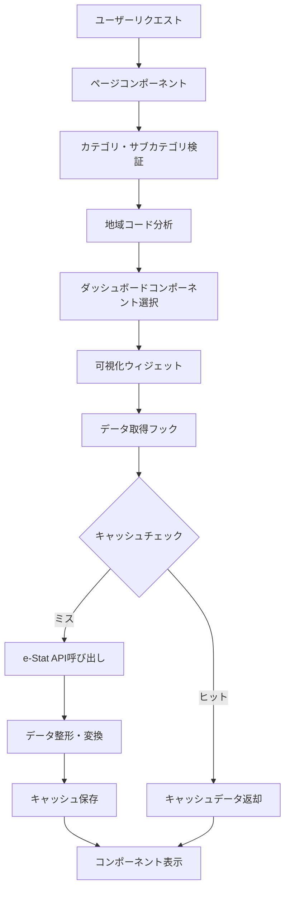

# データフロー

## 概要

ダッシュボードドメインのデータフローは、e-Stat APIから取得した統計データを、全国・都道府県・市区町村の3階層で効率的に表示するための一連の処理フローです。

## データフロー全体図



## データ取得ライフサイクル

### 1. リクエスト受信

```typescript
// ページコンポーネントでのリクエスト処理
export default async function DashboardPage({ params }: PageProps) {
  const { category, subcategory, areaCode } = await params;
  
  // 1. パラメータ検証
  const validationResult = validateParameters({ category, subcategory, areaCode });
  if (!validationResult.isValid) {
    notFound();
  }
  
  // 2. 地域レベル判定
  const areaLevel = determineAreaLevel(areaCode);
  
  // 3. ダッシュボードコンポーネント選択
  const DashboardComponent = getDashboardComponentByArea(
    subcategory,
    areaCode,
    category,
    areaLevel
  );
  
  return (
    <DashboardComponent
      category={category}
      subcategory={subcategory}
      areaCode={areaCode}
      areaLevel={areaLevel}
    />
  );
}
```

### 2. データ取得フック

```typescript
// 統計データ取得フック
export function useEstatData(
  params: { statsDataId: string; cdCat01: string },
  areaCode: string
) {
  const [data, setData] = useState<any>(null);
  const [loading, setLoading] = useState(true);
  const [error, setError] = useState<Error | null>(null);
  
  useEffect(() => {
    const fetchData = async () => {
      try {
        setLoading(true);
        setError(null);
        
        // データ取得の実行
        const result = await fetchDashboardData(params, areaCode);
        setData(result);
      } catch (err) {
        setError(err as Error);
        console.error('データ取得エラー:', err);
      } finally {
        setLoading(false);
      }
    };
    
    fetchData();
  }, [params.statsDataId, params.cdCat01, areaCode]);
  
  return { data, loading, error };
}
```

### 3. データ取得サービス

```typescript
// ダッシュボードデータ取得サービス
export class DashboardDataService {
  private static cache = new Map<string, CachedData>();
  private static r2Service: R2Service;
  private static d1Service: D1Database;
  
  static async fetchDashboardData(
    params: { statsDataId: string; cdCat01: string },
    areaCode: string
  ): Promise<DashboardData> {
    const cacheKey = this.generateCacheKey(params, areaCode);
    
    // 1. キャッシュチェック
    const cachedData = await this.getCachedData(cacheKey);
    if (cachedData) {
      return cachedData;
    }
    
    // 2. e-Stat API呼び出し
    const rawData = await this.fetchFromEstatAPI(params, areaCode);
    
    // 3. データ整形・変換
    const formattedData = this.formatData(rawData, areaCode);
    
    // 4. キャッシュ保存
    await this.saveToCache(cacheKey, formattedData);
    
    return formattedData;
  }
  
  private static async getCachedData(key: string): Promise<DashboardData | null> {
    // メモリキャッシュをチェック
    const memoryData = this.cache.get(key);
    if (memoryData && !this.isExpired(memoryData)) {
      return memoryData.data;
    }
    
    // R2キャッシュをチェック
    const r2Data = await this.r2Service.get(key);
    if (r2Data) {
      this.cache.set(key, r2Data);
      return r2Data.data;
    }
    
    // D1データベースをチェック
    const d1Data = await this.d1Service.get(key);
    if (d1Data) {
      this.cache.set(key, d1Data);
      return d1Data.data;
    }
    
    return null;
  }
  
  private static async fetchFromEstatAPI(
    params: { statsDataId: string; cdCat01: string },
    areaCode: string
  ): Promise<RawEstatData> {
    const estatParams = {
      appId: process.env.NEXT_PUBLIC_ESTAT_APP_ID,
      statsDataId: params.statsDataId,
      cdCat01: params.cdCat01,
      cdArea: areaCode,
      metaGetFlg: 'Y',
      cntGetFlg: 'N'
    };
    
    return await EstatApiClient.getStatsData(estatParams);
  }
  
  private static formatData(rawData: RawEstatData, areaCode: string): DashboardData {
    return {
      values: this.formatValues(rawData.STATISTICAL_DATA.DATA_INF.VALUE),
      areas: this.formatAreas(rawData.STATISTICAL_DATA.CLASS_INF.CLASS_OBJ),
      categories: this.formatCategories(rawData.STATISTICAL_DATA.CLASS_INF.CLASS_OBJ),
      years: this.formatYears(rawData.STATISTICAL_DATA.CLASS_INF.CLASS_OBJ),
      metadata: {
        areaCode,
        lastUpdated: new Date().toISOString(),
        source: 'e-Stat API'
      }
    };
  }
}
```

## 階層別データ取得戦略

### 全国レベルデータ取得

```typescript
// 全国データ取得
export async function fetchNationalData(
  statsDataId: string,
  areaCode: string
): Promise<NationalDashboardData> {
  const data = await EstatStatsDataService.getAndFormatStatsData(statsDataId, {
    areaFilter: '00000' // 全国
  });
  
  // 都道府県ランキングデータの取得
  const prefectureRanking = await RankingDataService.getPrefectureRanking(
    statsDataId,
    '2023' // 最新年度
  );
  
  return {
    nationalData: data,
    prefectureRanking,
    choroplethData: prefectureRanking.map(item => ({
      prefectureCode: item.areaCode,
      value: item.value,
      name: item.areaName
    }))
  };
}
```

### 都道府県レベルデータ取得

```typescript
// 都道府県データ取得
export async function fetchPrefectureData(
  statsDataId: string,
  areaCode: string
): Promise<PrefectureDashboardData> {
  // 都道府県データの取得
  const prefectureData = await EstatStatsDataService.getAndFormatStatsData(statsDataId, {
    areaFilter: areaCode
  });
  
  // 全国データとの比較用
  const nationalData = await EstatStatsDataService.getAndFormatStatsData(statsDataId, {
    areaFilter: '00000'
  });
  
  // 市区町村ランキングデータの取得
  const municipalityRanking = await RankingDataService.getMunicipalityRanking(
    statsDataId,
    areaCode,
    '2023'
  );
  
  return {
    prefectureData,
    nationalComparison: {
      national: nationalData.values[0],
      prefecture: prefectureData.values[0]
    },
    municipalityRanking,
    neighboringPrefectures: await getNeighboringPrefectures(areaCode)
  };
}
```

### 市区町村レベルデータ取得

```typescript
// 市区町村データ取得
export async function fetchMunicipalityData(
  statsDataId: string,
  areaCode: string
): Promise<MunicipalityDashboardData> {
  // 市区町村データの取得
  const municipalityData = await EstatStatsDataService.getAndFormatStatsData(statsDataId, {
    areaFilter: areaCode
  });
  
  const prefectureCode = getPrefectureCodeFromMunicipality(areaCode);
  
  // 都道府県データとの比較用
  const prefectureData = await EstatStatsDataService.getAndFormatStatsData(statsDataId, {
    areaFilter: prefectureCode
  });
  
  // 都道府県内ランキングの取得
  const prefectureRanking = await RankingDataService.getMunicipalityRanking(
    statsDataId,
    prefectureCode,
    '2023'
  );
  
  // 周辺市区町村の取得
  const neighboringMunicipalities = await getNeighboringMunicipalities(areaCode);
  
  return {
    municipalityData,
    prefectureComparison: {
      prefecture: prefectureData.values[0],
      municipality: municipalityData.values[0]
    },
    prefectureRanking,
    neighboringMunicipalities,
    municipalityMapData: await getMunicipalityMapData(prefectureCode)
  };
}
```

## キャッシュ戦略

### 多層キャッシュシステム

```typescript
// 多層キャッシュの実装
export class MultiLayerCache {
  private memoryCache = new Map<string, CachedData>();
  private r2Cache: R2Service;
  private d1Cache: D1Database;
  
  constructor(r2Service: R2Service, d1Cache: D1Database) {
    this.r2Service = r2Service;
    this.d1Cache = d1Cache;
  }
  
  async get(key: string): Promise<any> {
    // 1. メモリキャッシュをチェック
    const memoryData = this.memoryCache.get(key);
    if (memoryData && !this.isExpired(memoryData)) {
      return memoryData.data;
    }
    
    // 2. R2キャッシュをチェック
    const r2Data = await this.r2Cache.get(key);
    if (r2Data) {
      // メモリキャッシュに保存
      this.memoryCache.set(key, r2Data);
      return r2Data.data;
    }
    
    // 3. D1データベースをチェック
    const d1Data = await this.d1Cache.get(key);
    if (d1Data) {
      // メモリキャッシュに保存
      this.memoryCache.set(key, d1Data);
      return d1Data.data;
    }
    
    return null;
  }
  
  async set(key: string, data: any, ttl: number = 3600): Promise<void> {
    const cachedData = {
      data,
      timestamp: Date.now(),
      ttl
    };
    
    // メモリキャッシュに保存
    this.memoryCache.set(key, cachedData);
    
    // R2キャッシュに保存（非同期）
    this.r2Cache.set(key, cachedData, ttl).catch(console.error);
    
    // D1データベースに保存（非同期）
    this.d1Cache.set(key, cachedData, ttl).catch(console.error);
  }
  
  private isExpired(cachedData: CachedData): boolean {
    return Date.now() - cachedData.timestamp > cachedData.ttl;
  }
}
```

### キャッシュキー生成

```typescript
// キャッシュキーの生成
export function generateCacheKey(
  params: { statsDataId: string; cdCat01: string },
  areaCode: string,
  additionalParams?: Record<string, any>
): string {
  const baseKey = `dashboard:${params.statsDataId}:${params.cdCat01}:${areaCode}`;
  
  if (additionalParams) {
    const paramString = Object.entries(additionalParams)
      .sort(([a], [b]) => a.localeCompare(b))
      .map(([key, value]) => `${key}=${value}`)
      .join('&');
    return `${baseKey}:${paramString}`;
  }
  
  return baseKey;
}
```

## エラーハンドリング

### エラーレベルの定義

```typescript
// エラーレベルの定義
export enum ErrorLevel {
  CRITICAL = 'critical',    // システム全体に影響
  ERROR = 'error',          // 機能に影響
  WARNING = 'warning',      // 一部機能に影響
  INFO = 'info'             // 情報レベル
}

// エラーハンドリング
export class DashboardErrorHandler {
  static handleError(error: unknown, context: string): DashboardError {
    console.error(`Dashboard Error in ${context}:`, error);
    
    if (error instanceof EstatApiError) {
      return {
        level: ErrorLevel.ERROR,
        code: 'ESTAT_API_ERROR',
        message: '統計データの取得に失敗しました',
        details: {
          context,
          statsDataId: error.statsDataId,
          originalError: error.message
        },
        timestamp: new Date()
      };
    }
    
    if (error instanceof ValidationError) {
      return {
        level: ErrorLevel.WARNING,
        code: 'VALIDATION_ERROR',
        message: 'データの検証に失敗しました',
        details: {
          context,
          validationErrors: error.errors
        },
        timestamp: new Date()
      };
    }
    
    if (error instanceof CacheError) {
      return {
        level: ErrorLevel.WARNING,
        code: 'CACHE_ERROR',
        message: 'キャッシュの取得に失敗しました',
        details: {
          context,
          cacheKey: error.cacheKey
        },
        timestamp: new Date()
      };
    }
    
    // 予期しないエラー
    return {
      level: ErrorLevel.CRITICAL,
      code: 'UNKNOWN_ERROR',
      message: '予期しないエラーが発生しました',
      details: {
        context,
        error: String(error)
      },
      timestamp: new Date()
    };
  }
}
```

### フォールバック戦略

```typescript
// フォールバック戦略の実装
export class FallbackStrategy {
  static async fetchDataWithFallback(
    params: { statsDataId: string; cdCat01: string },
    areaCode: string
  ): Promise<DashboardData> {
    try {
      // 1. 通常のデータ取得を試行
      return await DashboardDataService.fetchDashboardData(params, areaCode);
    } catch (error) {
      console.warn('通常のデータ取得に失敗、フォールバックを試行:', error);
      
      try {
        // 2. キャッシュからの取得を試行
        return await this.fetchFromCache(params, areaCode);
      } catch (cacheError) {
        console.warn('キャッシュからの取得に失敗、サンプルデータを使用:', cacheError);
        
        // 3. サンプルデータの使用
        return await this.getSampleData(params, areaCode);
      }
    }
  }
  
  private static async fetchFromCache(
    params: { statsDataId: string; cdCat01: string },
    areaCode: string
  ): Promise<DashboardData> {
    const cacheKey = generateCacheKey(params, areaCode);
    const cachedData = await MultiLayerCache.get(cacheKey);
    
    if (!cachedData) {
      throw new Error('キャッシュデータが見つかりません');
    }
    
    return cachedData;
  }
  
  private static async getSampleData(
    params: { statsDataId: string; cdCat01: string },
    areaCode: string
  ): Promise<DashboardData> {
    // サンプルデータの生成
    return {
      values: [{
        areaCode,
        value: Math.floor(Math.random() * 1000000),
        unit: '人',
        categoryCode: params.cdCat01,
        categoryName: 'サンプルデータ',
        timeCode: '2023',
        timeName: '2023年'
      }],
      areas: [],
      categories: [],
      years: [],
      metadata: {
        areaCode,
        lastUpdated: new Date().toISOString(),
        source: 'Sample Data',
        isFallback: true
      }
    };
  }
}
```

## パフォーマンス最適化

### 並列データ取得

```typescript
// 並列データ取得の実装
export class ParallelDataFetcher {
  static async fetchMultipleData(
    requests: Array<{
      params: { statsDataId: string; cdCat01: string };
      areaCode: string;
    }>
  ): Promise<Array<{ data: DashboardData | null; error: Error | null }>> {
    const concurrency = 3; // 同時実行数
    const results: Array<{ data: DashboardData | null; error: Error | null }> = [];
    
    for (let i = 0; i < requests.length; i += concurrency) {
      const batch = requests.slice(i, i + concurrency);
      
      const batchResults = await Promise.allSettled(
        batch.map(async (request) => {
          try {
            const data = await DashboardDataService.fetchDashboardData(
              request.params,
              request.areaCode
            );
            return { data, error: null };
          } catch (error) {
            return { data: null, error: error as Error };
          }
        })
      );
      
      results.push(
        ...batchResults.map(result => 
          result.status === 'fulfilled' ? result.value : { data: null, error: result.reason }
        )
      );
      
      // レート制限対応のため待機
      if (i + concurrency < requests.length) {
        await new Promise(resolve => setTimeout(resolve, 1000));
      }
    }
    
    return results;
  }
}
```

### データプリフェッチ

```typescript
// データプリフェッチの実装
export class DataPrefetcher {
  static async prefetchRelatedData(
    category: string,
    subcategory: string,
    areaCode: string
  ): Promise<void> {
    const areaLevel = determineAreaLevel(areaCode);
    
    // 関連データのプリフェッチ
    const prefetchPromises: Promise<any>[] = [];
    
    if (areaLevel === 'national') {
      // 主要都道府県のデータをプリフェッチ
      const majorPrefectures = ['13000', '27000', '23000']; // 東京、大阪、愛知
      prefetchPromises.push(
        ...majorPrefectures.map(prefCode => 
          this.prefetchPrefectureData(category, subcategory, prefCode)
        )
      );
    } else if (areaLevel === 'prefecture') {
      // 主要市区町村のデータをプリフェッチ
      const majorMunicipalities = await getMajorMunicipalities(areaCode);
      prefetchPromises.push(
        ...majorMunicipalities.map(muniCode => 
          this.prefetchMunicipalityData(category, subcategory, muniCode)
        )
      );
    }
    
    // 非同期でプリフェッチを実行
    Promise.allSettled(prefetchPromises).catch(console.error);
  }
  
  private static async prefetchPrefectureData(
    category: string,
    subcategory: string,
    prefectureCode: string
  ): Promise<void> {
    // 都道府県データのプリフェッチ
    const cacheKey = `prefetch:${category}:${subcategory}:${prefectureCode}`;
    // プリフェッチロジックの実装
  }
  
  private static async prefetchMunicipalityData(
    category: string,
    subcategory: string,
    municipalityCode: string
  ): Promise<void> {
    // 市区町村データのプリフェッチ
    const cacheKey = `prefetch:${category}:${subcategory}:${municipalityCode}`;
    // プリフェッチロジックの実装
  }
}
```

## 監視とログ

### パフォーマンス監視

```typescript
// パフォーマンス監視の実装
export class PerformanceMonitor {
  private static metrics: Map<string, PerformanceMetric> = new Map();
  
  static recordTiming(operation: string, duration: number): void {
    const metric = this.metrics.get(operation) || {
      operation,
      count: 0,
      totalDuration: 0,
      averageDuration: 0,
      minDuration: Infinity,
      maxDuration: 0
    };
    
    metric.count++;
    metric.totalDuration += duration;
    metric.averageDuration = metric.totalDuration / metric.count;
    metric.minDuration = Math.min(metric.minDuration, duration);
    metric.maxDuration = Math.max(metric.maxDuration, duration);
    
    this.metrics.set(operation, metric);
  }
  
  static getMetrics(): PerformanceMetric[] {
    return Array.from(this.metrics.values());
  }
  
  static resetMetrics(): void {
    this.metrics.clear();
  }
}

// パフォーマンス測定デコレータ
export function measurePerformance(operation: string) {
  return function (target: any, propertyName: string, descriptor: PropertyDescriptor) {
    const method = descriptor.value;
    
    descriptor.value = async function (...args: any[]) {
      const start = performance.now();
      
      try {
        const result = await method.apply(this, args);
        const end = performance.now();
        PerformanceMonitor.recordTiming(operation, end - start);
        return result;
      } catch (error) {
        const end = performance.now();
        PerformanceMonitor.recordTiming(operation, end - start);
        throw error;
      }
    };
  };
}
```

### ログ管理

```typescript
// ログ管理の実装
export class DashboardLogger {
  private static logLevel: LogLevel = LogLevel.INFO;
  
  static setLogLevel(level: LogLevel): void {
    this.logLevel = level;
  }
  
  static debug(message: string, context?: any): void {
    if (this.logLevel <= LogLevel.DEBUG) {
      console.log(`[DEBUG] ${message}`, context);
    }
  }
  
  static info(message: string, context?: any): void {
    if (this.logLevel <= LogLevel.INFO) {
      console.log(`[INFO] ${message}`, context);
    }
  }
  
  static warn(message: string, context?: any): void {
    if (this.logLevel <= LogLevel.WARN) {
      console.warn(`[WARN] ${message}`, context);
    }
  }
  
  static error(message: string, context?: any): void {
    if (this.logLevel <= LogLevel.ERROR) {
      console.error(`[ERROR] ${message}`, context);
    }
  }
}
```

## まとめ

データフローは、ダッシュボードドメインの中核となる処理フローです。主な特徴は以下の通りです：

1. **階層別戦略**: 全国・都道府県・市区町村で最適化されたデータ取得
2. **多層キャッシュ**: メモリ・R2・D1の3層キャッシュによる高速化
3. **エラーハンドリング**: 包括的なエラー処理とフォールバック戦略
4. **パフォーマンス最適化**: 並列処理、プリフェッチ、監視による最適化
5. **監視・ログ**: パフォーマンス監視とログ管理による運用性向上

このデータフローにより、ユーザーは高速で信頼性の高い統計データを閲覧することができます。
