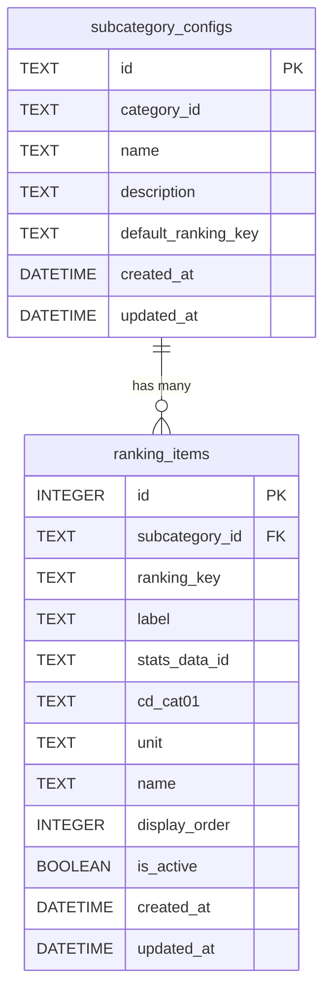

# データベース設計ドキュメント

## 概要

stats47 プロジェクトのデータベース設計について説明します。Cloudflare D1 を基盤とした統合データベース設計、ランキング設定管理、地図可視化設定のためのテーブル設計と、既存のテーブルとの関係について詳述します。

## Cloudflare D1 データベース

### 統合データベース設計

- **データベース名**: `stats47`
- **統合スキーマ**: `database/schemas/main.sql`
- **テーブル構成**:
  - `users`: ユーザー認証・管理
  - `estat_metainfo`: e-Stat メタデータ
  - `estat_data_history`: データ変更履歴
  - `ranking_visualizations`: 地図可視化設定管理
  - `subcategory_configs`: サブカテゴリ設定
  - `ranking_items`: ランキング項目設定

### 環境別設定

- **開発・本番共通**: Cloudflare D1 のリモートインスタンス
- **バインディング**: `STATS47_DB` (wrangler.toml)

`wrangler.toml` の設定により、ローカル開発環境 (`wrangler dev`) でも、本番環境と同じリモートの D1 データベースに接続します。これにより、開発と本番の環境差異を最小限に抑えています。

### スキーマ管理

- **統合スキーマ**: 認証、メタデータ、履歴管理を一元化
- **適用コマンド**: `npx wrangler d1 execute stats47 --remote --file=./database/schemas/main.sql`
- **簡易適用スクリプト**: `./database/manage.sh schema` を使用しても、内部的に `wrangler` コマンドが実行され、リモートデータベースにスキーマが適用されます。

## テーブル設計

### 認証・ユーザー管理

#### users テーブル

ユーザー認証・管理を行うテーブルです。

```sql
CREATE TABLE users (
  id UUID PRIMARY KEY DEFAULT gen_random_uuid(),
  email TEXT UNIQUE NOT NULL,
  password_hash TEXT NOT NULL,
  created_at DATETIME DEFAULT CURRENT_TIMESTAMP,
  updated_at DATETIME DEFAULT CURRENT_TIMESTAMP
);
```

#### フィールド説明

| フィールド      | 型       | 説明                       | 例                                     |
| --------------- | -------- | -------------------------- | -------------------------------------- |
| `id`            | UUID     | ユーザーの一意識別子       | `550e8400-e29b-41d4-a716-446655440000` |
| `email`         | TEXT     | メールアドレス（一意）     | `user@example.com`                     |
| `password_hash` | TEXT     | ハッシュ化されたパスワード | `$2b$10$...`                           |
| `created_at`    | DATETIME | 作成日時                   | `2024-01-01 00:00:00`                  |
| `updated_at`    | DATETIME | 更新日時                   | `2024-01-01 00:00:00`                  |

### e-Stat メタデータ

#### estat_metainfo テーブル

e-Stat API から取得したメタ情報を保存するテーブルです。

```sql
CREATE TABLE estat_metainfo (
  id TEXT PRIMARY KEY,
  stats_data_id TEXT NOT NULL,
  cat01 TEXT NOT NULL,
  stat_name TEXT NOT NULL,
  title TEXT NOT NULL,
  unit TEXT,
  item_name TEXT,
  created_at DATETIME DEFAULT CURRENT_TIMESTAMP,
  updated_at DATETIME DEFAULT CURRENT_TIMESTAMP
);
```

#### estat_data_history テーブル

データ変更履歴を管理するテーブルです。

```sql
CREATE TABLE estat_data_history (
  id INTEGER PRIMARY KEY AUTOINCREMENT,
  stats_data_id TEXT NOT NULL,
  cat01 TEXT NOT NULL,
  data_version TEXT NOT NULL,
  change_summary TEXT,
  created_at DATETIME DEFAULT CURRENT_TIMESTAMP
);
```

### ランキング設定管理

#### 1. サブカテゴリ設定テーブル (`subcategory_configs`)

サブカテゴリの基本情報とデフォルト設定を管理します。

#### スキーマ

```sql
CREATE TABLE subcategory_configs (
  id TEXT PRIMARY KEY,              -- 'land-area', 'land-use'
  category_id TEXT NOT NULL,        -- 'landweather'
  name TEXT NOT NULL,               -- '土地面積', '土地利用'
  description TEXT,
  default_ranking_key TEXT,         -- デフォルトの統計項目
  created_at DATETIME DEFAULT CURRENT_TIMESTAMP,
  updated_at DATETIME DEFAULT CURRENT_TIMESTAMP
);
```

#### フィールド説明

| フィールド            | 型   | 説明                         | 例                           |
| --------------------- | ---- | ---------------------------- | ---------------------------- |
| `id`                  | TEXT | サブカテゴリの一意識別子     | `'land-area'`                |
| `category_id`         | TEXT | 親カテゴリの ID              | `'landweather'`              |
| `name`                | TEXT | サブカテゴリの表示名         | `'土地面積'`                 |
| `description`         | TEXT | サブカテゴリの説明           | `'都道府県別の土地面積統計'` |
| `default_ranking_key` | TEXT | デフォルトで表示する統計項目 | `'totalAreaExcluding'`       |

### 2. ランキング項目テーブル (`ranking_items`)

各サブカテゴリの統計項目とその設定を管理します。

#### スキーマ

```sql
CREATE TABLE ranking_items (
  id INTEGER PRIMARY KEY AUTOINCREMENT,
  subcategory_id TEXT NOT NULL,     -- 'land-area', 'land-use'
  ranking_key TEXT NOT NULL,        -- 'totalAreaExcluding'など
  label TEXT NOT NULL,              -- '総面積（除く）'
  stats_data_id TEXT NOT NULL,      -- '0000010102'
  cd_cat01 TEXT NOT NULL,           -- 'B1101'
  unit TEXT NOT NULL,               -- 'ha'
  name TEXT NOT NULL,               -- '総面積（北方地域及び竹島を除く）'
  display_order INTEGER DEFAULT 0,
  is_active BOOLEAN DEFAULT 1,
  created_at DATETIME DEFAULT CURRENT_TIMESTAMP,
  updated_at DATETIME DEFAULT CURRENT_TIMESTAMP,
  UNIQUE(subcategory_id, ranking_key)
);
```

#### フィールド説明

| フィールド       | 型      | 説明                        | 例                                   |
| ---------------- | ------- | --------------------------- | ------------------------------------ |
| `subcategory_id` | TEXT    | サブカテゴリ ID（外部キー） | `'land-area'`                        |
| `ranking_key`    | TEXT    | 統計項目の一意識別子        | `'totalAreaExcluding'`               |
| `label`          | TEXT    | UI 表示用のラベル           | `'総面積（除く）'`                   |
| `stats_data_id`  | TEXT    | e-Stat API の統計表 ID      | `'0000010102'`                       |
| `cd_cat01`       | TEXT    | e-Stat API のカテゴリコード | `'B1101'`                            |
| `unit`           | TEXT    | データの単位                | `'ha'`, `'%'`                        |
| `name`           | TEXT    | 統計項目の正式名称          | `'総面積（北方地域及び竹島を除く）'` |
| `display_order`  | INTEGER | 表示順序                    | `1, 2, 3...`                         |
| `is_active`      | BOOLEAN | アクティブフラグ            | `true/false`                         |

### 3. ランキング設定ビュー (`v_ranking_configs`)

サブカテゴリとランキング項目を結合したビューです。

```sql
CREATE VIEW v_ranking_configs AS
SELECT
  sc.id as subcategory_id,
  sc.category_id,
  sc.name as subcategory_name,
  sc.description,
  sc.default_ranking_key,
  ri.ranking_key,
  ri.label,
  ri.stats_data_id,
  ri.cd_cat01,
  ri.unit,
  ri.name as ranking_name,
  ri.display_order,
  ri.is_active,
  ri.created_at,
  ri.updated_at
FROM subcategory_configs sc
LEFT JOIN ranking_items ri ON sc.id = ri.subcategory_id AND ri.is_active = 1
ORDER BY sc.id, ri.display_order;
```

### 地図可視化設定

#### ranking_visualizations テーブル

都道府県ランキングの可視化設定を管理する専用テーブルです。

```sql
CREATE TABLE IF NOT EXISTS ranking_visualizations (
  id INTEGER PRIMARY KEY AUTOINCREMENT,

  -- データ識別（複合キー）
  stats_data_id TEXT NOT NULL,         -- 統計表ID
  cat01 TEXT NOT NULL,                 -- カテゴリコード（estat_metainfoのcat01と対応）

  -- 地図可視化設定
  map_color_scheme TEXT DEFAULT 'interpolateBlues',
  map_diverging_midpoint TEXT DEFAULT 'zero',

  -- ランキング設定
  ranking_direction TEXT DEFAULT 'desc', -- 'asc', 'desc'

  -- 単位変換設定
  conversion_factor REAL DEFAULT 1,    -- 変換係数（元データ × 係数 = 表示値）
  decimal_places INTEGER DEFAULT 0,    -- 小数点以下桁数

  -- システム情報
  created_at DATETIME DEFAULT CURRENT_TIMESTAMP,
  updated_at DATETIME DEFAULT CURRENT_TIMESTAMP,

  -- 一意制約
  UNIQUE(stats_data_id, cat01)
);
```

#### インデックス

```sql
CREATE INDEX IF NOT EXISTS idx_ranking_viz_stats_id ON ranking_visualizations(stats_data_id);
CREATE INDEX IF NOT EXISTS idx_ranking_viz_cat01 ON ranking_visualizations(cat01);
CREATE UNIQUE INDEX IF NOT EXISTS idx_ranking_viz_composite ON ranking_visualizations(stats_data_id, cat01);
```

#### ビュー: メタデータ付きランキング設定

```sql
CREATE VIEW IF NOT EXISTS v_ranking_with_metadata AS
SELECT
  rv.*,
  m.stat_name,
  m.title,
  m.unit as original_unit,
  m.item_name
FROM ranking_visualizations rv
LEFT JOIN estat_metainfo m ON rv.stats_data_id = m.stats_data_id AND rv.cat01 = m.cat01;
```

#### 設計方針

- **専用テーブル方式**: estat_metainfo と分離し、設定項目の拡張が容易
- **単位変換機能**: conversion_factor と decimal_places で柔軟な単位変換に対応
- **デフォルト値**: 設定が存在しない場合も適切なデフォルト値で動作

#### 単位変換例

1. 百万円データを億円で表示: `conversion_factor = 0.01`, `decimal_places = 1`
2. 千人データを万人で表示: `conversion_factor = 0.1`, `decimal_places = 1`
3. 比率データをパーセント表示: `conversion_factor = 100`, `decimal_places = 1`

## データフロー

### ランキング設定データフロー

```
┌─────────────────┐    ┌─────────────────┐    ┌─────────────────┐
│  ランキングページ  │    │  API エンドポイント │    │  D1 データベース  │
│  (Server Comp)  │◄──►│ /api/rankings-   │◄──►│ ranking_items   │
│                 │    │ items/[id]      │    │ subcategory_    │
└─────────────────┘    └─────────────────┘    │ configs         │
                              │                └─────────────────┘
                              ▼
                       ┌─────────────────┐
                       │  フォールバック   │
                       │  FALLBACK_CONFIGS│
                       └─────────────────┘
```

### キャッシュ戦略

- **API レスポンス**: 5 分間キャッシュ
- **Stale-while-revalidate**: 6 分間
- **フォールバック**: データベース接続失敗時

## インデックス設計

### 主要インデックス

```sql
-- ユーザー認証
CREATE INDEX idx_users_email ON users(email);

-- e-Statメタデータ
CREATE INDEX idx_estat_metainfo_stats_id ON estat_metainfo(stats_data_id);
CREATE INDEX idx_estat_metainfo_cat01 ON estat_metainfo(cat01);

-- ランキング設定
CREATE INDEX idx_ranking_items_subcategory ON ranking_items(subcategory_id);
CREATE INDEX idx_ranking_items_active ON ranking_items(is_active);

-- 地図可視化設定
CREATE INDEX idx_ranking_viz_stats_id ON ranking_visualizations(stats_data_id);
CREATE INDEX idx_ranking_viz_cat01 ON ranking_visualizations(cat01);
CREATE UNIQUE INDEX idx_ranking_viz_composite ON ranking_visualizations(stats_data_id, cat01);
```

### パフォーマンス考慮事項

- **複合インデックス**: よく一緒に検索されるカラムの組み合わせ
- **部分インデックス**: アクティブなレコードのみにインデックス
- **一意制約**: データ整合性の確保

## マイグレーション戦略

### スキーマ管理

- **バージョン管理**: 各マイグレーションにバージョン番号を付与
- **ロールバック**: 問題発生時の前バージョンへの復帰
- **段階的適用**: 本番環境での安全な適用

### マイグレーション手順

1. **開発環境でのテスト**

   ```bash
   npx wrangler d1 execute stats47 --local --file=./database/migrations/001_new_table.sql
   ```

2. **ステージング環境での検証**

   ```bash
   npx wrangler d1 execute stats47 --remote --file=./database/migrations/001_new_table.sql
   ```

3. **本番環境への適用**
   ```bash
   ./database/manage.sh migrate
   ```

### データ移行

- **バックアップ**: 移行前のデータバックアップ
- **段階的移行**: 大量データの分割処理
- **検証**: 移行後のデータ整合性確認

## テーブル間の関係



## 使用例とクエリサンプル

### 1. サブカテゴリのランキング項目を取得

```sql
-- land-areaのすべてのランキング項目を取得
SELECT
  ranking_key,
  label,
  stats_data_id,
  cd_cat01,
  unit,
  name,
  display_order
FROM ranking_items
WHERE subcategory_id = 'land-area'
  AND is_active = 1
ORDER BY display_order;
```

### 2. デフォルトランキング項目を取得

```sql
-- サブカテゴリのデフォルトランキング項目を取得
SELECT
  sc.default_ranking_key,
  ri.stats_data_id,
  ri.cd_cat01,
  ri.unit,
  ri.name
FROM subcategory_configs sc
JOIN ranking_items ri ON sc.id = ri.subcategory_id
  AND sc.default_ranking_key = ri.ranking_key
WHERE sc.id = 'land-area';
```

### 3. ビューを使用した複雑なクエリ

```sql
-- サブカテゴリとランキング項目の完全な情報を取得
SELECT
  subcategory_name,
  ranking_key,
  label,
  stats_data_id,
  cd_cat01,
  unit,
  display_order
FROM v_ranking_configs
WHERE subcategory_id = 'land-use'
ORDER BY display_order;
```

## インデックス設計

パフォーマンス向上のためのインデックス：

```sql
-- サブカテゴリ検索用
CREATE INDEX idx_subcategory_configs_category ON subcategory_configs(category_id);

-- ランキング項目検索用
CREATE INDEX idx_ranking_items_subcategory ON ranking_items(subcategory_id);
CREATE INDEX idx_ranking_items_active ON ranking_items(is_active);
CREATE INDEX idx_ranking_items_display_order ON ranking_items(display_order);

-- 複合ユニーク制約
CREATE UNIQUE INDEX idx_ranking_items_unique ON ranking_items(subcategory_id, ranking_key);
```

## データ管理

### データの追加

新しいサブカテゴリを追加する場合：

```sql
-- 1. サブカテゴリ設定を追加
INSERT INTO subcategory_configs (id, category_id, name, description, default_ranking_key)
VALUES ('new-subcategory', 'category-id', '新サブカテゴリ', '説明', 'default-key');

-- 2. ランキング項目を追加
INSERT INTO ranking_items (subcategory_id, ranking_key, label, stats_data_id, cd_cat01, unit, name, display_order)
VALUES
  ('new-subcategory', 'item1', '項目1', 'stats-id', 'cat01', 'unit', '項目名', 1),
  ('new-subcategory', 'item2', '項目2', 'stats-id', 'cat02', 'unit', '項目名', 2);
```

### データの更新

ランキング項目の設定を変更する場合：

```sql
-- 表示順序の変更
UPDATE ranking_items
SET display_order = 5
WHERE subcategory_id = 'land-area' AND ranking_key = 'habitableArea';

-- アクティブ状態の変更
UPDATE ranking_items
SET is_active = 0
WHERE subcategory_id = 'land-area' AND ranking_key = 'majorLakeArea';
```

### データの削除

ランキング項目を削除する場合：

```sql
-- 論理削除（推奨）
UPDATE ranking_items
SET is_active = 0
WHERE subcategory_id = 'land-area' AND ranking_key = 'item-to-remove';

-- 物理削除（注意が必要）
DELETE FROM ranking_items
WHERE subcategory_id = 'land-area' AND ranking_key = 'item-to-remove';
```

## マイグレーション

### 既存データベースへの追加

```sql
-- 1. テーブル作成
-- ranking_items.sql の内容を実行

-- 2. シードデータの投入
-- database/seeds/ranking_items_seed.sql の内容を実行

-- 3. データ確認
SELECT COUNT(*) FROM subcategory_configs;
SELECT COUNT(*) FROM ranking_items;
```

### ロールバック

```sql
-- テーブルとビューの削除
DROP VIEW IF EXISTS v_ranking_configs;
DROP TABLE IF EXISTS ranking_items;
DROP TABLE IF EXISTS subcategory_configs;
```

## パフォーマンス考慮事項

1. **キャッシュ戦略**: API レスポンスに 5 分間のキャッシュを設定
2. **インデックス**: 頻繁に検索されるカラムにインデックスを設定
3. **ビュー**: 複雑な結合クエリをビューで簡素化
4. **フォールバック**: データベース接続失敗時のフォールバック機能

## セキュリティ考慮事項

1. **入力検証**: API エンドポイントでの入力値検証
2. **SQL インジェクション対策**: プリペアドステートメントの使用
3. **アクセス制御**: 管理画面での適切な権限管理
4. **データバリデーション**: データベースレベルでの制約設定
