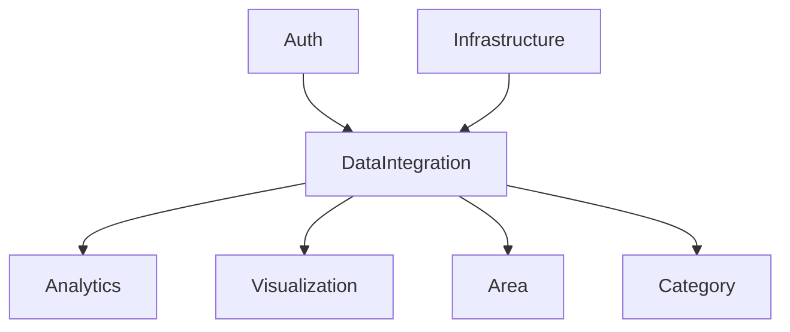
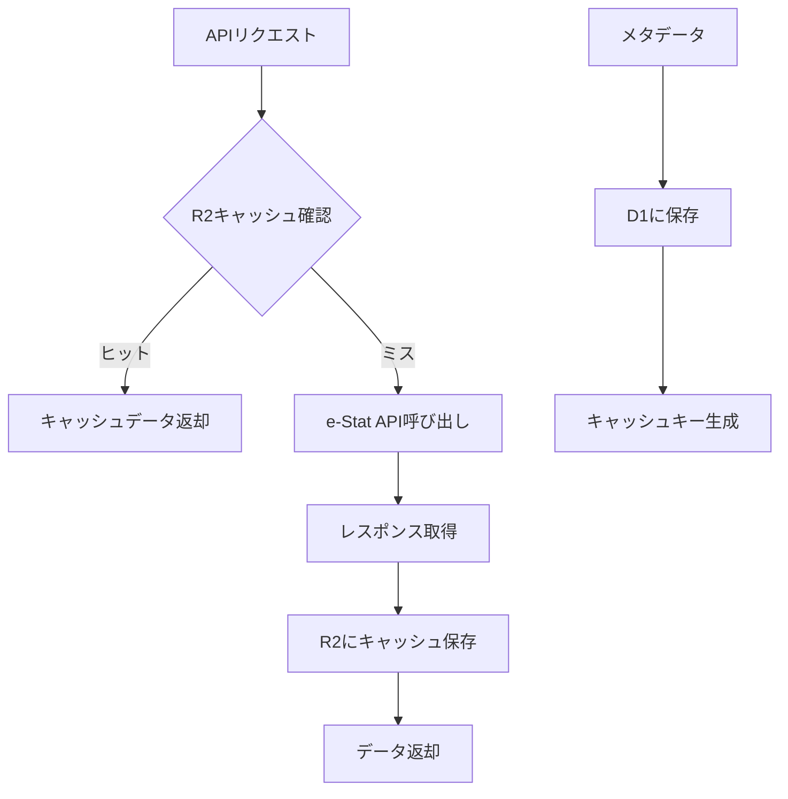

# DataIntegration ドメイン概要

## ドメインの責務

DataIntegration ドメインは、外部データソースとの統合とキャッシュ管理を担当する支援ドメインです。

### 主要な責務

1. **外部 API 統合**

   - e-Stat API との連携
   - Geoshape API との連携
   - 将来の外部データソース（World Bank、OECD 等）との統合

2. **データ変換・正規化**

   - 外部 API レスポンスの内部形式への変換
   - データ品質の確保
   - エラーハンドリング

3. **キャッシュ管理**

   - R2 ストレージでの API レスポンスキャッシュ
   - 地理データ（TopoJSON）のキャッシュ
   - 計算結果のキャッシュ
   - キャッシュ統計の管理

4. **API パラメータ管理**
   - ランキングキー、時間コード等の管理
   - パラメータのバリデーション
   - キャッシュキーの生成

## ユビキタス言語

### 主要な用語

- **DataSource**: データソース（e-Stat、Geoshape 等）
- **CacheEntry**: キャッシュエントリ（キー、データ、TTL、メタデータ）
- **ApiParameter**: API パラメータ（rankingKey、timeCode 等）
- **CacheStatistics**: キャッシュ統計（ヒット率、サイズ等）
- **TTL**: Time To Live（キャッシュの有効期限）
- **Cache Hit**: キャッシュヒット（キャッシュからデータを取得）
- **Cache Miss**: キャッシュミス（API からデータを取得）
- **Cache Invalidation**: キャッシュ無効化
- **Data Adapter**: データアダプター（外部データの変換）

### ビジネスルール

1. **キャッシュ戦略**

   - e-Stat API レスポンスは 24 時間キャッシュ
   - 地理データは 7 日間キャッシュ
   - 計算結果は 6 時間キャッシュ

2. **API 制限対応**

   - e-Stat API の制限（1 日 1000 リクエスト）を考慮
   - レート制限の実装
   - エラー時のリトライ戦略

3. **データ品質**
   - 外部 API レスポンスのバリデーション
   - 必須フィールドの確認
   - データ型の検証

## 境界づけられたコンテキスト

DataIntegration ドメインは以下の処理を担当します：

- 外部データソースとの通信
- データの取得、変換、正規化
- キャッシュの管理（R2、D1）
- API パラメータの管理
- キャッシュ統計の収集

### 境界外の処理

- ビジネスロジック（Analytics ドメイン）
- データの可視化（Visualization ドメイン）
- ユーザー認証（Auth ドメイン）
- データの永続化（Infrastructure ドメイン）

## 他ドメインとの関係性

### 依存関係



### データフロー

1. **Analytics ドメインへのデータ提供**

   - 統計データの取得
   - ランキングデータの提供
   - 時系列データの提供

2. **Visualization ドメインへのデータ提供**

   - 地理データ（TopoJSON）の提供
   - 可視化用データの提供

3. **Area ドメインとの連携**

   - 地域コードの管理
   - 地域メタデータの取得

4. **Category ドメインとの連携**
   - カテゴリ情報の取得
   - 統計分類の管理

## e-Stat API との統合戦略

### API 種別

1. **getMetaInfo**: 統計メタ情報の取得

   - TTL: 7 日
   - 用途: 統計データの詳細情報

2. **getStatsData**: 統計データの取得

   - TTL: 24 時間
   - 用途: 実際の統計値

3. **getStatsList**: 統計リストの取得
   - TTL: 7 日
   - 用途: 統計一覧

### キャッシュ戦略

```typescript
// キャッシュキーの生成例
const cacheKey = `estat:${apiType}:${hash(parameters)}`;

// TTL設定
const ttlConfig = {
  getMetaInfo: 7 * 24 * 60 * 60, // 7日
  getStatsData: 24 * 60 * 60, // 24時間
  getStatsList: 7 * 24 * 60 * 60, // 7日
};
```

## R2 キャッシュアーキテクチャ

### キャッシュ階層

1. **L1: クライアントキャッシュ（SWR）**

   - ユーザーセッション内でのキャッシュ
   - TTL: 5 分〜1 時間

2. **L2: CDN/Edge キャッシュ（Cloudflare）**

   - 地理的に分散したキャッシュ
   - TTL: 1 時間〜24 時間

3. **L3: オブジェクトストレージキャッシュ（R2）**
   - 重い計算結果と地理データの永続化
   - TTL: 1 日〜1 週間

### キャッシュフロー



## 実装方針

### 設計原則

1. **単一責務の原則**: 各サービスは明確な責務を持つ
2. **依存性逆転の原則**: 抽象化に依存する
3. **開閉の原則**: 拡張に開かれ、修正に閉じられている
4. **インターフェース分離の原則**: クライアントは不要なインターフェースに依存しない

### エラーハンドリング

1. **API 制限エラー**: レート制限の実装
2. **ネットワークエラー**: リトライ戦略
3. **データ形式エラー**: バリデーションとフォールバック
4. **キャッシュエラー**: フォールバック処理

### テスト戦略

1. **単体テスト**: 各サービスの個別テスト
2. **統合テスト**: API 連携のテスト
3. **モックテスト**: 外部 API のモック化
4. **パフォーマンステスト**: キャッシュの効果測定

## 関連ドキュメント

- [モデル定義](./02_モデル/エンティティ.md)
- [サービス定義](./03_サービス/ドメインサービス.md)
- [インフラ定義](./04_インフラ/リポジトリ.md)
- [e-Stat API サブドメイン](./05_サブドメイン/e-Stat-API/README.md)
- [システムアーキテクチャ](../../01_技術設計/01_システム概要/01_システムアーキテクチャ.md)

---

**更新履歴**:

- 2025-01-20: 初版作成
