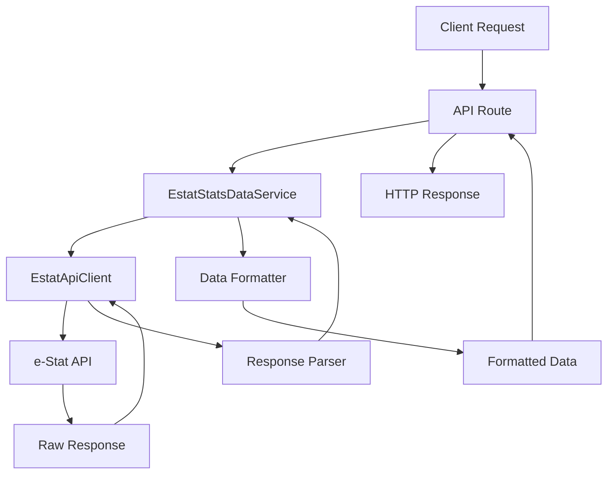
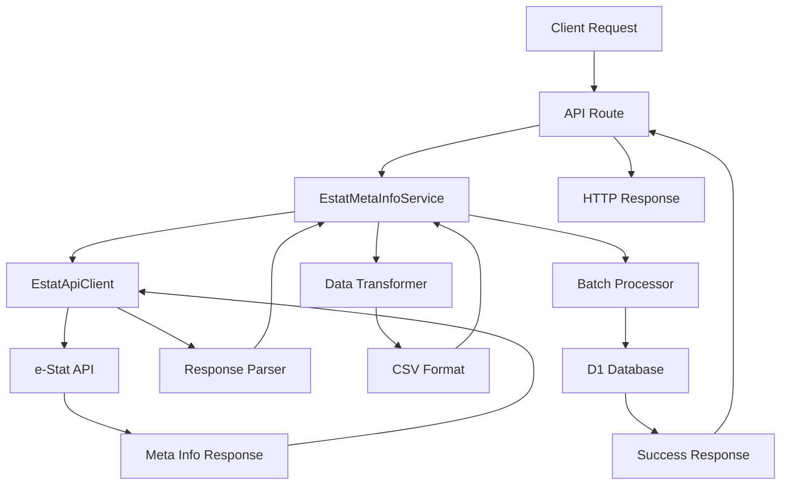

# e-Stat API アーキテクチャ設計

## 概要

e-Stat API ドメインのアーキテクチャ設計について説明します。レイヤー構造、データフロー、サービスクラス設計、依存関係、設計パターンについて詳述します。

## レイヤー構造

### 4 層アーキテクチャ

```
┌─────────────────────────────────────┐
│   Application Layer                 │
│   (API Routes, Handlers)            │
│   - /api/estat-api/stats-data       │
│   - /api/estat-api/meta-info/*      │
└───────────┬─────────────────────────┘
            │
┌───────────▼─────────────────────────┐
│   Service Layer                     │
│   - EstatStatsDataService           │
│   - EstatStatsListService           │
│   - EstatMetaInfoService            │
└───────────┬─────────────────────────┘
            │
┌───────────▼─────────────────────────┐
│   API Client Layer                  │
│   (@/services/estat-api)            │
│   - EstatApiClient                  │
│   - Request/Response Handlers       │
└───────────┬─────────────────────────┘
            │
┌───────────▼─────────────────────────┐
│   External Services                 │
│   - e-Stat API                      │
│   - Cloudflare D1 Database          │
│   - Cloudflare R2 Storage           │
└─────────────────────────────────────┘
```

### 各レイヤーの責務

#### Application Layer

- **責務**: HTTP リクエストの受信とレスポンスの生成
- **コンポーネント**: Next.js API Routes
- **主要エンドポイント**:
  - `/api/estat-api/stats-data` - 統計データ取得
  - `/api/estat-api/meta-info/[statsDataId]` - メタ情報取得
  - `/api/estat-api/meta-info/save` - メタ情報保存
  - `/api/estat-api/meta-info/saved` - 保存済みメタ情報取得
- **特徴**:
  - リクエストバリデーション
  - 認証・認可
  - エラーハンドリング
  - レスポンス形式の統一

#### Service Layer

- **責務**: ビジネスロジックの実装
- **コンポーネント**: 各種サービスクラス
- **特徴**:
  - データ変換・整形
  - ビジネスルールの適用
  - トランザクション管理
  - キャッシュ戦略

#### API Client Layer

- **責務**: 外部 API との通信
- **コンポーネント**: API クライアントクラス
- **特徴**:
  - HTTP 通信の抽象化
  - リトライ機能
  - レート制限対応
  - レスポンス変換

#### External Services

- **責務**: データの永続化と外部連携
- **コンポーネント**: データベース、ストレージ、外部 API
- **特徴**:
  - データの永続化
  - 外部サービス連携
  - スケーラビリティ

## データフロー

### 1. 統計データ取得フロー



### 2. メタ情報保存フロー



## サービスクラス設計

### EstatStatsDataService

```typescript
class EstatStatsDataService {
  // パブリックメソッド
  static async getAndFormatStatsData(
    statsDataId: string,
    options?: StatsDataOptions
  ): Promise<FormattedStatsData>;

  static async getAvailableYears(statsDataId: string): Promise<string[]>;

  static async getPrefectureData(
    statsDataId: string,
    options?: PrefectureDataOptions
  ): Promise<PrefectureData[]>;

  // プライベートメソッド
  private static async getStatsDataRaw(
    statsDataId: string,
    options: StatsDataOptions
  ): Promise<RawStatsData>;

  private static formatStatsData(rawData: RawStatsData): FormattedStatsData;

  private static formatAreas(areas: RawArea[]): FormattedArea[];
  private static formatCategories(
    categories: RawCategory[]
  ): FormattedCategory[];
  private static formatYears(years: RawYear[]): FormattedYear[];
  private static formatValues(values: RawValue[]): FormattedValue[];
}
```

### EstatMetaInfoService

```typescript
class EstatMetaInfoService {
  constructor(private db: D1Database) {}

  // パブリックメソッド
  async processAndSaveMetaInfo(statsDataId: string): Promise<ProcessResult>;
  async getSavedMetadataByStatsId(
    statsDataId: string
  ): Promise<SavedMetadata[]>;
  async searchMetadata(query: SearchQuery): Promise<SearchResult[]>;
  async getMetadataSummary(statsDataId: string): Promise<MetadataSummary>;
}
```

> **詳細な実装**: データベース操作の詳細は[データベース仕様書](database-specification.md)を参照してください。

## 依存関係

### 内部依存関係

```typescript
// サービス層の依存関係
EstatStatsDataService
├── @/services/estat-api (EstatApiClient)
└── @/lib/estat/types (型定義)

EstatMetaInfoService
├── @/services/estat-api (EstatApiClient)
├── @/lib/estat/types (型定義)
└── D1Database (Cloudflare D1)
```

### 外部依存関係

```typescript
// 外部サービス
e-Stat API
├── ベースURL: https://api.e-stat.go.jp/rest/3.0/app/json
├── 認証: アプリケーションID
└── 制限: レート制限あり

Cloudflare D1 Database
├── テーブル: estat_metainfo
├── 用途: メタ情報の永続化
└── 特徴: サーバーレスSQL
```

## 設計パターン

### 1. Repository Pattern

データアクセスの抽象化を提供します。

```typescript
interface MetadataRepository {
  save(metadata: Metadata[]): Promise<void>;
  findByStatsId(statsDataId: string): Promise<Metadata[]>;
  search(query: SearchQuery): Promise<Metadata[]>;
}

class D1MetadataRepository implements MetadataRepository {
  constructor(private db: D1Database) {}
  // 実装はデータベース仕様書を参照
}
```

> **詳細な実装**: Repository Pattern の詳細は[データベース仕様書](database-specification.md)を参照してください。

### 2. Adapter Pattern

異なるデータソースを統一的に扱います。

```typescript
interface RankingDataAdapter {
  fetchAndTransform(params: AdapterFetchParams): Promise<UnifiedRankingData>;
}

class EstatRankingAdapter implements RankingDataAdapter {
  async fetchAndTransform(
    params: AdapterFetchParams
  ): Promise<UnifiedRankingData> {
    // e-Stat API実装
  }
}

class CsvRankingAdapter implements RankingDataAdapter {
  async fetchAndTransform(
    params: AdapterFetchParams
  ): Promise<UnifiedRankingData> {
    // CSVファイル実装
  }
}
```

### 3. Strategy Pattern

データ変換ロジックの切り替えを可能にします。

```typescript
interface DataFormatter {
  format(data: RawData): FormattedData;
}

class StatsDataFormatter implements DataFormatter {
  format(data: RawStatsData): FormattedStatsData {
    // 統計データの整形ロジック
  }
}

class MetaInfoFormatter implements DataFormatter {
  format(data: RawMetaInfo): FormattedMetaInfo {
    // メタ情報の整形ロジック
  }
}
```

### 4. Factory Pattern

サービスクラスの生成を抽象化します。

```typescript
class ServiceFactory {
  static createStatsDataService(): EstatStatsDataService {
    return new EstatStatsDataService();
  }

  static createMetaInfoService(db: D1Database): EstatMetaInfoService {
    return new EstatMetaInfoService(db);
  }

  static createRankingDataService(
    db: D1Database,
    r2Service: R2Service
  ): RankingDataService {
    return new RankingDataService(db, r2Service);
  }
}
```

## エラーハンドリング戦略

### エラーレベルの定義

```typescript
enum ErrorLevel {
  CRITICAL = "critical", // システム全体に影響
  ERROR = "error", // 機能に影響
  WARNING = "warning", // 一部機能に影響
  INFO = "info", // 情報レベル
}

interface ApiError {
  level: ErrorLevel;
  code: string;
  message: string;
  details?: any;
  timestamp: Date;
}
```

### エラーハンドリングの実装

```typescript
class ErrorHandler {
  static handleApiError(error: unknown, context: string): ApiError {
    if (error instanceof EstatApiError) {
      return {
        level: ErrorLevel.ERROR,
        code: error.code,
        message: error.message,
        details: { context, statsDataId: error.statsDataId },
        timestamp: new Date(),
      };
    }

    return {
      level: ErrorLevel.ERROR,
      code: "UNKNOWN_ERROR",
      message: "An unexpected error occurred",
      details: { context, error: String(error) },
      timestamp: new Date(),
    };
  }
}
```

> **データベースエラーハンドリング**: データベース関連のエラーハンドリングは[データベース仕様書](database-specification.md)を参照してください。

## パフォーマンス最適化

### 1. キャッシュ戦略

```typescript
interface CacheStrategy {
  get(key: string): Promise<any | null>;
  set(key: string, value: any, ttl?: number): Promise<void>;
  delete(key: string): Promise<void>;
  clear(): Promise<void>;
}

class MultiLevelCache implements CacheStrategy {
  constructor(private memoryCache: MemoryCache, private r2Cache: R2Cache) {}

  async get(key: string): Promise<any | null> {
    // 1. メモリキャッシュをチェック
    let value = await this.memoryCache.get(key);
    if (value) return value;

    // 2. R2キャッシュをチェック
    value = await this.r2Cache.get(key);
    if (value) {
      // メモリキャッシュに保存
      await this.memoryCache.set(key, value);
      return value;
    }

    return null;
  }
}
```

### 2. 並列処理

```typescript
class ParallelProcessor {
  static async processBatch<T, R>(
    items: T[],
    processor: (item: T) => Promise<R>,
    concurrency: number = 3
  ): Promise<R[]> {
    const results: R[] = [];

    for (let i = 0; i < items.length; i += concurrency) {
      const batch = items.slice(i, i + concurrency);
      const batchResults = await Promise.allSettled(batch.map(processor));

      results.push(
        ...batchResults
          .filter(
            (result): result is PromiseFulfilledResult<R> =>
              result.status === "fulfilled"
          )
          .map((result) => result.value)
      );
    }

    return results;
  }
}
```

### 3. レート制限対応

```typescript
class RateLimiter {
  private requests: Map<string, number> = new Map();
  private resetTimes: Map<string, number> = new Map();

  async checkLimit(apiKey: string, limit: number = 1000): Promise<boolean> {
    const now = Date.now();
    const resetTime = this.resetTimes.get(apiKey) || now + 24 * 60 * 60 * 1000;

    if (now > resetTime) {
      this.requests.set(apiKey, 0);
      this.resetTimes.set(apiKey, now + 24 * 60 * 60 * 1000);
    }

    const currentRequests = this.requests.get(apiKey) || 0;
    if (currentRequests >= limit) {
      return false;
    }

    this.requests.set(apiKey, currentRequests + 1);
    return true;
  }
}
```

## セキュリティ考慮事項

### 1. 入力検証

```typescript
class InputValidator {
  static validateStatsDataId(statsDataId: string): boolean {
    return /^\d{10}$/.test(statsDataId);
  }

  static validateAreaCode(areaCode: string): boolean {
    return /^\d{5}$/.test(areaCode);
  }

  static validateCategoryCode(categoryCode: string): boolean {
    return /^[A-Z]\d{4}$/.test(categoryCode);
  }
}
```

### 2. API キー管理

```typescript
class ApiKeyManager {
  static getApiKey(): string {
    const apiKey = process.env.NEXT_PUBLIC_ESTAT_APP_ID;
    if (!apiKey) {
      throw new Error("ESTAT_APP_ID is not configured");
    }
    return apiKey;
  }

  static validateApiKey(apiKey: string): boolean {
    return /^[a-zA-Z0-9]{32}$/.test(apiKey);
  }
}
```

### 3. データサニタイゼーション

```typescript
class DataSanitizer {
  static sanitizeString(input: string): string {
    return input
      .replace(/[<>]/g, "") // HTMLタグの除去
      .replace(/['"]/g, "") // クォートの除去
      .trim();
  }

  static sanitizeNumber(input: any): number | null {
    const num = Number(input);
    return isNaN(num) ? null : num;
  }
}
```

## 監視・ログ戦略

### 1. ログレベル

```typescript
enum LogLevel {
  DEBUG = 0,
  INFO = 1,
  WARN = 2,
  ERROR = 3,
  CRITICAL = 4,
}

class Logger {
  static log(level: LogLevel, message: string, context?: any): void {
    if (level >= LogLevel.INFO) {
      console.log(`[${LogLevel[level]}] ${message}`, context);
    }
  }
}
```

### 2. メトリクス収集

```typescript
interface Metrics {
  apiCalls: number;
  cacheHits: number;
  cacheMisses: number;
  errors: number;
  responseTime: number;
}

class MetricsCollector {
  private metrics: Metrics = {
    apiCalls: 0,
    cacheHits: 0,
    cacheMisses: 0,
    errors: 0,
    responseTime: 0,
  };

  incrementApiCalls(): void {
    this.metrics.apiCalls++;
  }

  recordResponseTime(time: number): void {
    this.metrics.responseTime = time;
  }
}
```

## 拡張性の考慮

### 1. プラグインアーキテクチャ

```typescript
interface DataProcessor {
  process(data: any): any;
  canHandle(dataType: string): boolean;
}

class ProcessorRegistry {
  private processors: DataProcessor[] = [];

  register(processor: DataProcessor): void {
    this.processors.push(processor);
  }

  process(data: any, dataType: string): any {
    const processor = this.processors.find((p) => p.canHandle(dataType));
    if (!processor) {
      throw new Error(`No processor found for data type: ${dataType}`);
    }
    return processor.process(data);
  }
}
```

### 2. 設定の外部化

```typescript
interface ServiceConfig {
  apiBaseUrl: string;
  rateLimit: number;
  cacheTtl: number;
  batchSize: number;
}

class ConfigManager {
  static getConfig(): ServiceConfig {
    return {
      apiBaseUrl:
        process.env.ESTAT_API_BASE_URL ||
        "https://api.e-stat.go.jp/rest/3.0/app/json",
      rateLimit: parseInt(process.env.ESTAT_RATE_LIMIT || "1000"),
      cacheTtl: parseInt(process.env.CACHE_TTL || "3600"),
      batchSize: parseInt(process.env.BATCH_SIZE || "20"),
    };
  }
}
```

## 関連ドキュメント

- [e-Stat API データベース仕様](database-specification.md) - データベース設計と実装詳細
- [API エンドポイント一覧](02-api-endpoints.md) - エンドポイント仕様とパラメータ
- [型システム](02-type-system.md) - 型定義の詳細
- [API 仕様詳細](apis/) - 各エンドポイントの詳細仕様
- [サービス仕様](services/) - サービスクラスの実装詳細
- [実装ガイド](../implementation/) - 開発ガイドライン
- [テスト戦略](../testing/) - テスト方針と実装
