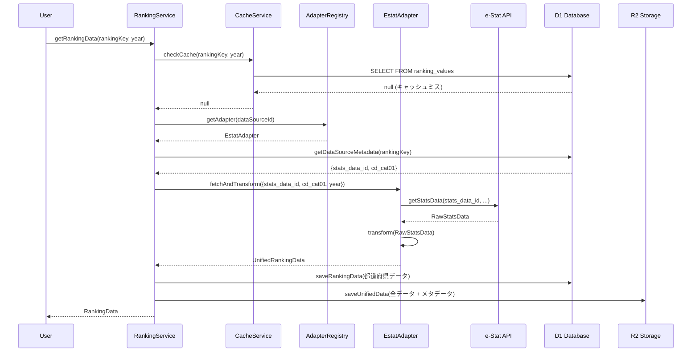
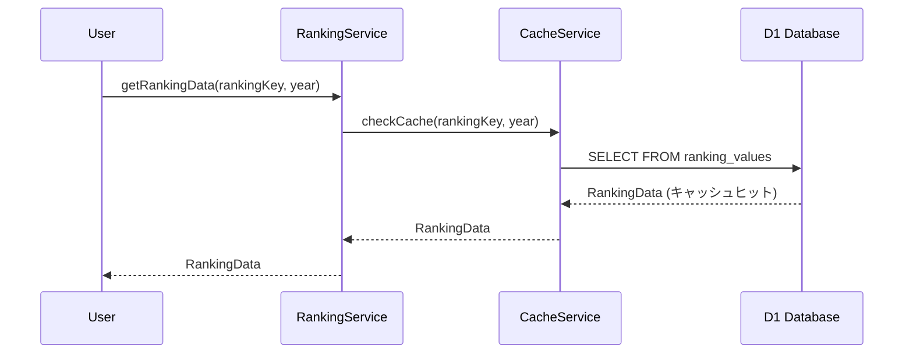
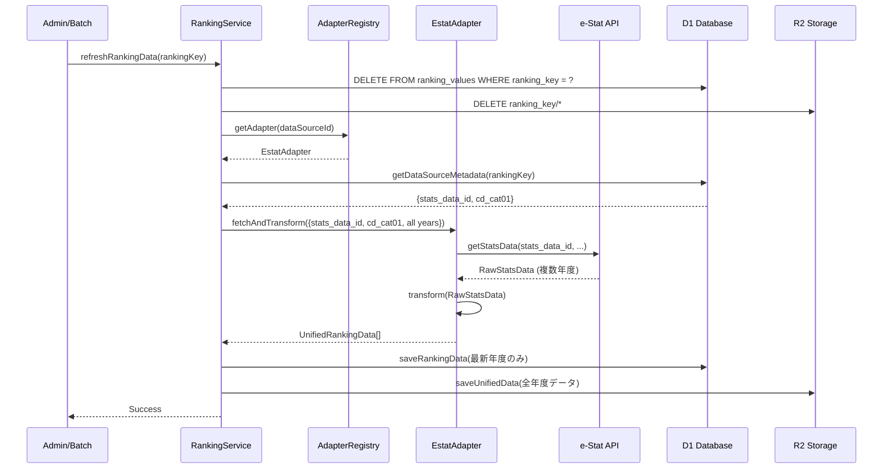

# ランキングデータアーキテクチャ設計

## ドキュメント情報

- **作成日**: 2025-10-26
- **最終更新**: 2025-10-26
- **対象**: ランキング・コロプレス地図機能のデータアーキテクチャ
- **ステータス**: 推奨設計

## 目次

1. [概要](#概要)
2. [要件定義](#要件定義)
3. [推奨アーキテクチャ](#推奨アーキテクチャ)
4. [データフロー](#データフロー)
5. [レイヤー設計](#レイヤー設計)
6. [データ永続化戦略](#データ永続化戦略)
7. [マルチデータソース対応](#マルチデータソース対応)
8. [実装例](#実装例)
9. [パフォーマンス最適化](#パフォーマンス最適化)
10. [セキュリティ考慮事項](#セキュリティ考慮事項)
11. [移行ガイド](#移行ガイド)

---

## 概要

本ドキュメントでは、都道府県ランキングとコロプレス地図の視覚化機能における**データアーキテクチャの推奨設計**を定義します。

### 設計の核心的な問い

**「estat-apiなど複数のデータソースからランキングデータを取得する際、どのようなアーキテクチャで設計すべきか？」**

2つの主要なアプローチ:

- **オプションA**: データソースから取得 → ランキング形式に変換 → 保存（データ中心）
- **オプションB**: ランキングドメインでデータソースパラメータを保存 → 必要時に取得・変換（メタデータ中心）

### 推奨設計

**「ハイブリッドアプローチ：変換後データ保存 + メタデータ管理」**

この設計は、両方のアプローチの利点を組み合わせたものです：

- データソースパラメータを`data_source_metadata`に保存（オプションB）
- 初回取得時に変換後データをD1/R2に保存（オプションA）
- 以降はキャッシュから高速取得
- 必要時にアダプターを使って再取得・更新可能

---

## 要件定義

### 機能要件

1. **マルチデータソース対応**
   - e-Stat API
   - 気象庁データ
   - カスタムCSV
   - その他外部API（世界銀行、OECDなど）

2. **時系列データ対応**
   - 全年度のデータを保持
   - 年度選択によるランキング切り替え
   - 時系列トレンド分析機能

3. **地域レベル対応**
   - 都道府県レベル
   - 市区町村レベル
   - 両方の階層構造を保持

4. **視覚化機能**
   - コロプレス地図
   - ランキングテーブル
   - 統計グラフ

### 非機能要件

1. **パフォーマンス**
   - 初回ロード: 3秒以内
   - キャッシュヒット時: 500ms以内
   - 年度切り替え: 1秒以内

2. **スケーラビリティ**
   - 都道府県レベル: D1データベース（〜5KB/年度）
   - 市区町村レベル: R2ストレージ（〜200KB/年度）
   - 複数年度: R2ストレージ（全年度保持）

3. **可用性**
   - キャッシュによる外部API障害への耐性
   - データソース追加時のゼロダウンタイム
   - 段階的な移行が可能

4. **保守性**
   - データソースの追加が容易
   - 変換ロジックの独立性
   - テストの容易性

### データ戦略

**ハイブリッドキャッシング戦略**:

- **初回取得**: API → 変換 → D1/R2保存
- **2回目以降**: D1/R2から直接取得（API呼び出しなし）
- **更新**: 手動トリガーまたはTTLベース（将来的にバッチ処理）

---

## 推奨アーキテクチャ

### アーキテクチャ図

```
┌─────────────────────────────────────────────────────────────┐
│                     Presentation Layer                      │
│  (コロプレス地図、ランキングテーブル、グラフ)                │
└────────────────────┬────────────────────────────────────────┘
                     │
┌────────────────────▼────────────────────────────────────────┐
│                   Ranking Domain (中核)                     │
│  ┌──────────────────────────────────────────────────────┐   │
│  │ RankingItem (ranking_items)                          │   │
│  │ - ranking_key, label, unit, 可視化設定              │   │
│  └──────────────────────────────────────────────────────┘   │
│  ┌──────────────────────────────────────────────────────┐   │
│  │ RankingService                                       │   │
│  │ - getRankingData(rankingKey, year)                   │   │
│  │ - refreshRankingData(rankingKey)                     │   │
│  └──────────────────────────────────────────────────────┘   │
└────────────────────┬────────────────────────────────────────┘
                     │
       ┌─────────────┼─────────────┐
       │             │             │
┌──────▼──────┐ ┌───▼────┐ ┌──────▼──────┐
│ Adapter     │ │ Cache  │ │ Metadata    │
│ Registry    │ │ Service│ │ Service     │
└──────┬──────┘ └───┬────┘ └──────┬──────┘
       │            │             │
┌──────▼────────────▼─────────────▼──────────────────────────┐
│              Data Source Adapters                           │
│  ┌────────────┐  ┌────────────┐  ┌────────────┐            │
│  │ e-Stat     │  │ 気象庁     │  │ CSV        │            │
│  │ Adapter    │  │ Adapter    │  │ Adapter    │            │
│  └────┬───────┘  └────┬───────┘  └────┬───────┘            │
└───────┼──────────────┼──────────────┼────────────────────┘
        │              │              │
┌───────▼──────────────▼──────────────▼────────────────────┐
│           Storage Layer (D1 + R2)                         │
│  ┌──────────────────┐  ┌──────────────────────────────┐  │
│  │ D1 Database      │  │ R2 Storage                   │  │
│  │ - ranking_items  │  │ - 変換後データ (JSON)        │  │
│  │ - ranking_values │  │ - 大容量データ               │  │
│  │ - metadata       │  │ - 全年度データ               │  │
│  └──────────────────┘  └──────────────────────────────┘  │
└───────────────────────────────────────────────────────────┘
        │              │              │
┌───────▼──────────────▼──────────────▼────────────────────┐
│              External Data Sources                        │
│  ┌────────────┐  ┌────────────┐  ┌────────────┐          │
│  │ e-Stat API │  │ 気象庁 API │  │ User CSV   │          │
│  └────────────┘  └────────────┘  └────────────┘          │
└───────────────────────────────────────────────────────────┘
```

### 主要コンポーネント

#### 1. Ranking Domain（中核ドメイン）

**責務**:
- ランキングデータの取得・管理
- 可視化設定の保持
- ビジネスロジックの実装

**主要エンティティ**:
```typescript
// ランキング項目（データソース非依存）
interface RankingItem {
  rankingKey: string;           // 一意識別子
  label: string;                // 表示名
  name: string;                 // 正式名称
  unit: string;                 // 単位
  dataSourceId: string;         // データソースID
  mapColorScheme: string;       // 色スキーム
  rankingDirection: "asc" | "desc";
}

// ランキングデータポイント
interface RankingDataPoint {
  areaCode: string;
  areaName: string;
  value: number;
  rank: number;
  timeCode: string;
  timeName: string;
}
```

#### 2. Data Source Metadata（メタデータ管理）

**責務**:
- データソース固有のパラメータ保存
- データ取得方法の定義
- アダプター設定の管理

**スキーマ**:
```sql
-- データソース定義
CREATE TABLE data_sources (
  id TEXT PRIMARY KEY,          -- 'estat', 'jma', 'csv'
  name TEXT NOT NULL,
  description TEXT,
  is_active BOOLEAN DEFAULT 1
);

-- データソース固有メタデータ
CREATE TABLE data_source_metadata (
  id INTEGER PRIMARY KEY,
  ranking_item_id INTEGER NOT NULL,
  data_source_id TEXT NOT NULL,
  metadata TEXT NOT NULL,       -- JSON形式
  -- 例: {"stats_data_id": "0000010102", "cd_cat01": "B1101"}
  FOREIGN KEY (ranking_item_id) REFERENCES ranking_items(id),
  FOREIGN KEY (data_source_id) REFERENCES data_sources(id)
);
```

#### 3. Adapter Layer（データ取得・変換）

**責務**:
- 外部データソースからのデータ取得
- 統一フォーマット（UnifiedRankingData）への変換
- エラーハンドリング

**インターフェース**:
```typescript
interface RankingDataAdapter {
  readonly sourceId: string;
  readonly sourceName: string;

  fetchAndTransform(params: AdapterFetchParams): Promise<UnifiedRankingData>;
  getAvailableYears(rankingKey: string, level: TargetAreaLevel): Promise<string[]>;
}
```

#### 4. Cache/Storage Layer（永続化）

**責務**:
- 変換後データの保存
- 高速データ取得
- ストレージ管理

**ストレージ分担**:
```typescript
// D1: 小規模・高頻度アクセスデータ
interface D1Storage {
  saveRankingData(rankingKey: string, data: RankingDataPoint[]): Promise<void>;
  getRankingData(rankingKey: string, timeCode: string): Promise<RankingDataPoint[]>;
}

// R2: 大容量・低頻度アクセスデータ
interface R2Storage {
  saveUnifiedData(rankingKey: string, data: UnifiedRankingData): Promise<void>;
  getUnifiedData(rankingKey: string, timeCode: string): Promise<UnifiedRankingData>;
}
```

---

## データフロー

### シナリオ1: 初回データ取得



**処理フロー詳細**:

1. **キャッシュチェック** (50ms)
   - D1で`ranking_values`テーブルを検索
   - 都道府県レベル: D1優先
   - 市区町村レベル: R2から取得

2. **メタデータ取得** (10ms)
   - `data_source_metadata`からデータソース固有パラメータを取得
   - 例: e-Statの場合 `{stats_data_id, cd_cat01}`

3. **アダプター実行** (1-3秒)
   - アダプターレジストリから適切なアダプターを取得
   - 外部APIを呼び出し
   - 統一フォーマットに変換

4. **データ保存** (200ms)
   - D1: 都道府県レベルデータ（高速アクセス用）
   - R2: 全データ + 統計情報（長期保存用）

5. **レスポンス返却** (50ms)
   - 変換後データをクライアントに返却

**合計時間**: 約1.3〜3.3秒

### シナリオ2: キャッシュヒット



**処理フロー詳細**:

1. **キャッシュチェック** (50ms)
   - D1で`ranking_values`テーブルを検索
   - データが存在すれば即座に返却

2. **レスポンス返却** (10ms)
   - キャッシュデータをクライアントに返却

**合計時間**: 約60〜100ms（**初回の1/20〜1/30**）

### シナリオ3: データ更新



**更新戦略**:

1. **手動更新**:
   - 管理画面から特定のランキング項目を更新
   - APIエンドポイント: `POST /api/rankings/data/refresh`

2. **バッチ更新**（将来実装）:
   - Cloudflare Workersの cron trigger
   - 月次・年次での自動更新

3. **TTLベース更新**（オプション）:
   - キャッシュにTTLを設定（例: 30日）
   - TTL切れ時に自動再取得

---

## レイヤー設計

### Layer 1: Presentation Layer

**責務**: UIコンポーネント、ユーザーインタラクション

**コンポーネント**:
```typescript
// コロプレス地図
<ChoroplethMap
  rankingKey={rankingKey}
  year={selectedYear}
  colorScheme={item.mapColorScheme}
/>

// ランキングテーブル
<RankingTable
  rankingKey={rankingKey}
  year={selectedYear}
  direction={item.rankingDirection}
/>
```

**ディレクトリ**: `src/components/organisms/visualization/`

### Layer 2: Service Layer

**責務**: ビジネスロジック、データ取得調整

**主要サービス**:
```typescript
// ランキングサービス
class RankingService {
  // データ取得（キャッシュファースト）
  async getRankingData(
    rankingKey: string,
    timeCode: string,
    options?: RankingDataOptions
  ): Promise<RankingDataPoint[]> {
    // 1. キャッシュチェック
    const cached = await this.cacheService.get(rankingKey, timeCode);
    if (cached) return cached;

    // 2. アダプター経由で取得
    const adapter = this.adapterRegistry.get(dataSourceId);
    const metadata = await this.getMetadata(rankingKey);
    const data = await adapter.fetchAndTransform({
      rankingKey,
      timeCode,
      sourceSpecific: metadata,
    });

    // 3. キャッシュ保存
    await this.cacheService.save(rankingKey, data);

    return data.values;
  }

  // データ更新
  async refreshRankingData(rankingKey: string): Promise<void> {
    // キャッシュ削除 → 再取得 → 保存
  }
}
```

**ディレクトリ**: `src/features/ranking/services/`

### Layer 3: Repository Layer

**責務**: データアクセス抽象化

**主要リポジトリ**:
```typescript
// メタデータリポジトリ
class MetadataRepository {
  async getDataSourceMetadata(
    rankingKey: string,
    dataSourceId: string
  ): Promise<Record<string, unknown>> {
    const result = await this.db.prepare(`
      SELECT dsm.metadata
      FROM data_source_metadata dsm
      JOIN ranking_items ri ON dsm.ranking_item_id = ri.id
      WHERE ri.ranking_key = ? AND dsm.data_source_id = ?
    `).bind(rankingKey, dataSourceId).first();

    return JSON.parse(result.metadata);
  }
}

// キャッシュリポジトリ
class CacheRepository {
  async getRankingData(
    rankingKey: string,
    timeCode: string
  ): Promise<RankingDataPoint[] | null> {
    // D1から取得
    const d1Data = await this.getFromD1(rankingKey, timeCode);
    if (d1Data) return d1Data;

    // R2から取得（フォールバック）
    const r2Data = await this.getFromR2(rankingKey, timeCode);
    return r2Data;
  }
}
```

**ディレクトリ**: `src/features/ranking/repositories/`

### Layer 4: Adapter Layer

**責務**: 外部データソース統合

**アダプター実装**:
```typescript
// e-Stat アダプター
class EstatRankingAdapter implements RankingDataAdapter {
  readonly sourceId = 'estat';
  readonly sourceName = 'e-Stat';

  async fetchAndTransform(
    params: AdapterFetchParams
  ): Promise<UnifiedRankingData> {
    // 1. メタデータからe-Statパラメータ抽出
    const { stats_data_id, cd_cat01 } = params.sourceSpecific;

    // 2. e-Stat APIを呼び出し
    const rawData = await this.estatClient.getStatsData({
      statsDataId: stats_data_id,
      cdCat01: cd_cat01,
      cdTime: params.timeCode,
    });

    // 3. 統一フォーマットに変換
    const transformer = new EstatTransformer();
    const dataPoints = transformer.transform(
      rawData,
      params.level,
      params.parentCode
    );

    // 4. UnifiedRankingData を構築
    return {
      metadata: {
        rankingKey: params.rankingKey,
        dataSourceId: this.sourceId,
        dataSourceName: this.sourceName,
        ...
      },
      values: dataPoints,
      quality: this.assessQuality(dataPoints),
    };
  }
}
```

**ディレクトリ**: `src/features/ranking/adapters/`

### Layer 5: Infrastructure Layer

**責務**: データベース、ストレージ、外部API

**コンポーネント**:
- D1 Database クライアント
- R2 Storage クライアント
- e-Stat API クライアント
- 気象庁 API クライアント

**ディレクトリ**: `src/infrastructure/database/`, `src/infrastructure/storage/`, `src/infrastructure/api/`

---

## データ永続化戦略

### ストレージ選定基準

#### D1 Database（SQLite）

**用途**:
- ランキング項目定義（`ranking_items`）
- メタデータ（`data_source_metadata`）
- 都道府県レベルランキングデータ（`ranking_values`）

**特徴**:
- 低レイテンシ（10〜50ms）
- SQL クエリ可能
- トランザクション対応
- 容量制限: 500MB〜2GB（プランによる）

**適用条件**:
```typescript
// D1に保存すべきデータ
interface D1DataCriteria {
  size: number;              // < 5KB per record
  accessFrequency: string;   // "high" (1日10回以上)
  queryComplexity: string;   // "complex" (JOIN, WHERE, GROUP BY)
  targetAreaLevel: string;   // "prefecture" (47件程度)
}
```

**例**:
```sql
-- 都道府県レベルランキング（2023年）
INSERT INTO ranking_values (
  ranking_key, area_code, area_name, time_code, value, rank
) VALUES
  ('population_density', '01', '北海道', '2023', 64.5, 47),
  ('population_density', '13', '東京都', '2023', 6439.3, 1),
  ...  -- 47件
```

#### R2 Storage（Object Storage）

**用途**:
- 大容量ランキングデータ（市区町村レベル）
- 複数年度の時系列データ
- 変換後の完全なUnifiedRankingData

**特徴**:
- 大容量対応（無制限）
- 低コスト
- HTTPアクセス
- レイテンシ: 100〜300ms

**適用条件**:
```typescript
// R2に保存すべきデータ
interface R2DataCriteria {
  size: number;              // > 5KB per record
  accessFrequency: string;   // "medium" or "low"
  queryComplexity: string;   // "simple" (keyベース取得のみ)
  targetAreaLevel: string;   // "municipality" (1000件以上)
}
```

**例**:
```typescript
// R2キー構造
const r2Key = `ranking/${rankingKey}/${timeCode}.json`;

// 保存データ（UnifiedRankingData）
const r2Data: R2RankingData = {
  metadata: {
    rankingKey: 'population_density',
    timeCode: '2023',
    timeName: '2023年',
    unit: '人/km²',
    targetAreaLevel: 'municipality',
    lastUpdated: '2025-01-01T00:00:00Z',
  },
  values: [
    { areaCode: '01101', areaName: '札幌市', value: 1752.8, rank: 15, ... },
    { areaCode: '01102', areaName: '函館市', value: 354.2, rank: 234, ... },
    ...  // 1741件（全市区町村）
  ],
  statistics: {
    min: 5.2,
    max: 15604.3,
    mean: 338.7,
    median: 124.5,
    ...
  },
};
```

### データ保存ルール

#### ルール1: 都道府県レベルはD1優先

```typescript
async saveRankingData(
  rankingKey: string,
  data: UnifiedRankingData
): Promise<void> {
  // 都道府県レベルのデータを抽出
  const prefectureData = data.values.filter(
    v => v.areaType === 'prefecture'
  );

  if (prefectureData.length > 0) {
    // D1に保存（高速アクセス用）
    await this.d1Repository.savePrefectureData(rankingKey, prefectureData);
  }

  // 完全なデータはR2に保存（バックアップ + 市区町村データ）
  await this.r2Repository.saveUnifiedData(rankingKey, data);
}
```

#### ルール2: 市区町村レベルはR2専用

```typescript
async getMunicipalityData(
  rankingKey: string,
  timeCode: string,
  prefectureCode?: string
): Promise<RankingDataPoint[]> {
  // R2から取得
  const r2Data = await this.r2Repository.getUnifiedData(rankingKey, timeCode);

  // 都道府県でフィルタリング（必要な場合）
  if (prefectureCode) {
    return r2Data.values.filter(
      v => v.parentAreaCode === prefectureCode
    );
  }

  return r2Data.values;
}
```

#### ルール3: 時系列データはR2に集約

```typescript
// R2キー構造（年度ごと）
const r2Keys = [
  'ranking/population_density/2020.json',
  'ranking/population_density/2021.json',
  'ranking/population_density/2022.json',
  'ranking/population_density/2023.json',
];

// 時系列取得
async getTimeSeriesData(
  rankingKey: string,
  years: string[]
): Promise<Map<string, UnifiedRankingData>> {
  const dataMap = new Map();

  for (const year of years) {
    const data = await this.r2Repository.getUnifiedData(rankingKey, year);
    dataMap.set(year, data);
  }

  return dataMap;
}
```

### キャッシュTTL戦略

```typescript
interface CacheTTLConfig {
  d1: {
    prefecture: number;        // 30日（頻繁に更新されない）
    municipality: number;      // 60日（更新頻度低い）
  };
  r2: {
    unified: number;           // 90日（長期保存）
    historical: number;        // 無期限（過去データは不変）
  };
}

// TTLチェック
async checkTTL(rankingKey: string, timeCode: string): Promise<boolean> {
  const metadata = await this.getMetadata(rankingKey, timeCode);
  const now = Date.now();
  const savedAt = new Date(metadata.created_at).getTime();
  const ttl = this.getTTL(metadata.targetAreaLevel);

  return (now - savedAt) < ttl;
}
```

---

## マルチデータソース対応

### Adapter Pattern実装

#### 1. アダプターインターフェース

```typescript
/**
 * すべてのデータソースアダプターが実装すべきインターフェース
 */
interface RankingDataAdapter {
  /**
   * データソースID（一意識別子）
   */
  readonly sourceId: string;

  /**
   * データソース名（表示用）
   */
  readonly sourceName: string;

  /**
   * データを取得して統一フォーマットに変換
   */
  fetchAndTransform(params: AdapterFetchParams): Promise<UnifiedRankingData>;

  /**
   * 利用可能な年度リストを取得
   */
  getAvailableYears(
    rankingKey: string,
    level: TargetAreaLevel
  ): Promise<string[]>;

  /**
   * データソースが利用可能かチェック
   */
  isAvailable(): Promise<boolean>;
}
```

#### 2. アダプターレジストリ

```typescript
/**
 * アダプターを登録・管理するレジストリ
 */
class AdapterRegistry {
  private adapters: Map<string, RankingDataAdapter> = new Map();

  /**
   * アダプターを登録
   */
  register(adapter: RankingDataAdapter): void {
    this.adapters.set(adapter.sourceId, adapter);
  }

  /**
   * アダプターを取得
   */
  get(sourceId: string): RankingDataAdapter {
    const adapter = this.adapters.get(sourceId);
    if (!adapter) {
      throw new Error(`Adapter not found: ${sourceId}`);
    }
    return adapter;
  }

  /**
   * 利用可能なアダプター一覧を取得
   */
  async getAvailable(): Promise<RankingDataAdapter[]> {
    const available: RankingDataAdapter[] = [];

    for (const adapter of this.adapters.values()) {
      if (await adapter.isAvailable()) {
        available.push(adapter);
      }
    }

    return available;
  }
}

// グローバルレジストリインスタンス
export const adapterRegistry = new AdapterRegistry();

// アダプター登録
adapterRegistry.register(new EstatRankingAdapter());
adapterRegistry.register(new JmaRankingAdapter());
adapterRegistry.register(new CsvRankingAdapter());
```

#### 3. データソース定義

```sql
-- data_sourcesテーブル
INSERT INTO data_sources (id, name, description, is_active) VALUES
  ('estat', 'e-Stat', '政府統計の総合窓口', 1),
  ('jma', '気象庁', '気象庁オープンデータ', 1),
  ('csv', 'CSV', 'カスタムCSVファイル', 1),
  ('resas', 'RESAS', '地域経済分析システム', 0),  -- 将来的に対応
  ('worldbank', 'World Bank', '世界銀行オープンデータ', 0);
```

### 各データソースの実装パターン

#### パターン1: REST API型（e-Stat、RESAS）

**特徴**:
- HTTP REST APIでデータ取得
- JSONレスポンス
- 認証キー必須
- レート制限あり

**実装例**: e-Stat Adapter（詳細は「実装例」セクション参照）

#### パターン2: ファイルベース型（CSV、Excel）

**特徴**:
- ローカルファイルまたはR2に保存
- パース処理が必要
- バリデーション必須

**実装例**:
```typescript
class CsvRankingAdapter implements RankingDataAdapter {
  readonly sourceId = 'csv';
  readonly sourceName = 'CSV';

  async fetchAndTransform(
    params: AdapterFetchParams
  ): Promise<UnifiedRankingData> {
    // 1. メタデータからCSVファイルパスを取得
    const { csv_file_path, column_mapping } = params.sourceSpecific;

    // 2. R2からCSVファイルを取得
    const csvContent = await this.r2.get(`csv/${csv_file_path}`);

    // 3. CSVパース
    const rows = this.parseCSV(csvContent);

    // 4. データポイントに変換
    const dataPoints: RankingDataPoint[] = rows.map(row => ({
      areaCode: row[column_mapping.area_code],
      areaName: row[column_mapping.area_name],
      value: parseFloat(row[column_mapping.value]),
      timeCode: params.timeCode,
      timeName: params.timeCode,
      ...
    }));

    // 5. バリデーション
    this.validate(dataPoints);

    // 6. ランク計算
    const rankedData = this.calculateRanks(dataPoints);

    return {
      metadata: { ... },
      values: rankedData,
      quality: this.assessQuality(rankedData),
    };
  }

  private validate(data: RankingDataPoint[]): void {
    for (const point of data) {
      if (!point.areaCode || isNaN(point.value)) {
        throw new Error(`Invalid data point: ${JSON.stringify(point)}`);
      }
    }
  }
}
```

**メタデータ例**:
```json
{
  "csv_file_path": "user_uploads/population_2023.csv",
  "column_mapping": {
    "area_code": "都道府県コード",
    "area_name": "都道府県名",
    "value": "人口",
    "unit": "人"
  }
}
```

#### パターン3: リアルタイムAPI型（気象庁）

**特徴**:
- リアルタイムデータ
- 頻繁な更新
- キャッシュTTL短め

**実装例**: 気象庁 Adapter（詳細は「実装例」セクション参照）

---

## 実装例

### 例1: e-Stat Adapter（完全版）

```typescript
// src/features/ranking/adapters/estat/estat-ranking-adapter.ts

import type {
  RankingDataAdapter,
  AdapterFetchParams,
  UnifiedRankingData,
  TargetAreaLevel,
} from '@/features/ranking/types';
import { EstatApiClient } from '@/infrastructure/api/estat';
import { EstatTransformer } from './estat-transformer';
import { RankingCalculator } from '@/features/ranking/calculators';

/**
 * e-Stat データソースアダプター
 */
export class EstatRankingAdapter implements RankingDataAdapter {
  readonly sourceId = 'estat';
  readonly sourceName = 'e-Stat';

  private client: EstatApiClient;
  private transformer: EstatTransformer;
  private calculator: RankingCalculator;

  constructor() {
    this.client = new EstatApiClient();
    this.transformer = new EstatTransformer();
    this.calculator = new RankingCalculator();
  }

  /**
   * e-Stat からデータ取得 → 変換
   */
  async fetchAndTransform(
    params: AdapterFetchParams
  ): Promise<UnifiedRankingData> {
    console.log(`🟢 [EstatAdapter] Starting fetch: ${params.rankingKey}`);

    // 1. メタデータからe-Statパラメータを抽出
    const estatParams = this.extractEstatParams(params);

    // 2. e-Stat API呼び出し
    const rawData = await this.client.getStatsData({
      statsDataId: estatParams.stats_data_id,
      cdCat01: estatParams.cd_cat01,
      cdTime: params.timeCode,
      cdArea: this.getAreaCodes(params.level, params.parentCode),
    });

    // 3. 統一フォーマットに変換
    const dataPoints = this.transformer.transform(
      rawData,
      params.level,
      params.parentCode
    );

    // 4. ランク計算
    const rankedData = this.calculator.calculateRanks(
      dataPoints,
      'desc' // デフォルト降順
    );

    // 5. 統計情報計算
    const statistics = this.calculator.calculateStatistics(rankedData);

    // 6. UnifiedRankingData構築
    return {
      metadata: {
        rankingKey: params.rankingKey,
        dataSourceId: this.sourceId,
        dataSourceName: this.sourceName,
        label: rawData.metadata.label,
        name: rawData.metadata.name,
        category: rawData.metadata.category,
        unit: rawData.metadata.unit,
        conversionFactor: 1,
        decimalPlaces: 1,
        visualization: {
          mapColorScheme: 'interpolateBlues',
          mapDivergingMidpoint: 'median',
          rankingDirection: 'desc',
        },
        statistics,
        lastUpdated: new Date().toISOString(),
        targetAreaLevel: params.level,
      },
      values: rankedData,
      quality: this.assessQuality(rankedData),
    };
  }

  /**
   * 利用可能な年度リスト取得
   */
  async getAvailableYears(
    rankingKey: string,
    level: TargetAreaLevel
  ): Promise<string[]> {
    // e-Stat メタ情報から時系列リストを取得
    const metaInfo = await this.client.getMetaInfo(rankingKey);
    return metaInfo.availableYears;
  }

  /**
   * e-Stat API が利用可能かチェック
   */
  async isAvailable(): Promise<boolean> {
    try {
      await this.client.healthCheck();
      return true;
    } catch (error) {
      console.error('[EstatAdapter] Health check failed:', error);
      return false;
    }
  }

  /**
   * メタデータからe-Statパラメータを抽出
   */
  private extractEstatParams(params: AdapterFetchParams): {
    stats_data_id: string;
    cd_cat01: string;
  } {
    const { stats_data_id, cd_cat01 } = params.sourceSpecific || {};

    if (!stats_data_id || !cd_cat01) {
      throw new Error(
        `Invalid e-Stat metadata: ${JSON.stringify(params.sourceSpecific)}`
      );
    }

    return { stats_data_id, cd_cat01 };
  }

  /**
   * レベルに応じた地域コードリストを取得
   */
  private getAreaCodes(
    level: TargetAreaLevel,
    parentCode?: string
  ): string[] {
    if (level === 'prefecture') {
      // 都道府県コード: 01000〜47000
      return Array.from({ length: 47 }, (_, i) =>
        `${String(i + 1).padStart(2, '0')}000`
      );
    }

    if (level === 'municipality' && parentCode) {
      // 特定都道府県の市区町村コードを取得
      return this.getMunicipalityCodes(parentCode);
    }

    throw new Error(`Unsupported area level: ${level}`);
  }

  /**
   * データ品質評価
   */
  private assessQuality(data: RankingDataPoint[]): DataQuality {
    const total = data.length;
    const missing = data.filter(d => d.value === 0).length;
    const estimated = data.filter(d => d.dataQuality?.isEstimated).length;

    return {
      completeness: (total - missing) / total,
      reliability: estimated > total * 0.1 ? 'medium' : 'high',
      missingAreas: data.filter(d => d.value === 0).map(d => d.areaCode),
      estimatedAreas: data.filter(d => d.dataQuality?.isEstimated).map(d => d.areaCode),
      lastValidated: new Date().toISOString(),
    };
  }
}
```

### 例2: 気象庁 Adapter

```typescript
// src/features/ranking/adapters/jma/jma-ranking-adapter.ts

import type {
  RankingDataAdapter,
  AdapterFetchParams,
  UnifiedRankingData,
} from '@/features/ranking/types';
import { JmaApiClient } from '@/infrastructure/api/jma';

/**
 * 気象庁データソースアダプター
 * 気温、降水量などの気象データを都道府県別に取得
 */
export class JmaRankingAdapter implements RankingDataAdapter {
  readonly sourceId = 'jma';
  readonly sourceName = '気象庁';

  private client: JmaApiClient;

  constructor() {
    this.client = new JmaApiClient();
  }

  async fetchAndTransform(
    params: AdapterFetchParams
  ): Promise<UnifiedRankingData> {
    // 1. メタデータから気象庁パラメータを抽出
    const { element_id, station_type } = params.sourceSpecific || {};
    // element_id: 'temperature', 'precipitation', etc.
    // station_type: 'prefecture_capital', 'all'

    // 2. 都道府県代表地点のデータを取得
    const prefectures = this.getPrefectureStations();
    const dataPoints: RankingDataPoint[] = [];

    for (const pref of prefectures) {
      const value = await this.client.getAnnualData({
        stationId: pref.stationId,
        elementId: element_id,
        year: params.timeCode,
      });

      dataPoints.push({
        areaCode: pref.code,
        areaName: pref.name,
        areaType: 'prefecture',
        value: value,
        rank: 0, // 後で計算
        timeCode: params.timeCode,
        timeName: `${params.timeCode}年`,
        dataQuality: {
          reliability: 'high',
          isEstimated: false,
          isInterpolated: false,
        },
      });
    }

    // 3. ランク計算（要素によって昇順/降順を切り替え）
    const direction = this.getRankingDirection(element_id);
    const rankedData = this.calculateRanks(dataPoints, direction);

    // 4. UnifiedRankingData構築
    return {
      metadata: {
        rankingKey: params.rankingKey,
        dataSourceId: this.sourceId,
        dataSourceName: this.sourceName,
        label: this.getElementLabel(element_id),
        name: this.getElementName(element_id),
        unit: this.getElementUnit(element_id),
        category: '気象',
        visualization: {
          mapColorScheme: this.getColorScheme(element_id),
          mapDivergingMidpoint: 'mean',
          rankingDirection: direction,
        },
        targetAreaLevel: 'prefecture',
        lastUpdated: new Date().toISOString(),
      },
      values: rankedData,
      quality: {
        completeness: 1.0,
        reliability: 'high',
        missingAreas: [],
        estimatedAreas: [],
        lastValidated: new Date().toISOString(),
      },
    };
  }

  async getAvailableYears(rankingKey: string): Promise<string[]> {
    // 気象庁データは1976年〜現在
    const currentYear = new Date().getFullYear();
    const years: string[] = [];
    for (let year = 1976; year <= currentYear; year++) {
      years.push(String(year));
    }
    return years;
  }

  async isAvailable(): Promise<boolean> {
    try {
      await this.client.ping();
      return true;
    } catch {
      return false;
    }
  }

  /**
   * 要素IDに応じたランキング方向を取得
   */
  private getRankingDirection(elementId: string): 'asc' | 'desc' {
    const ascElements = ['precipitation', 'snowfall']; // 降水量・降雪量は多い方が上位
    return ascElements.includes(elementId) ? 'desc' : 'desc';
  }

  /**
   * 要素IDに応じた色スキームを取得
   */
  private getColorScheme(elementId: string): string {
    const schemes: Record<string, string> = {
      temperature: 'interpolateRdYlBu',
      precipitation: 'interpolateBlues',
      snowfall: 'interpolatePurples',
    };
    return schemes[elementId] || 'interpolateViridis';
  }
}
```

### 例3: CSV Adapter（アップロード型）

```typescript
// src/features/ranking/adapters/csv/csv-ranking-adapter.ts

import type {
  RankingDataAdapter,
  AdapterFetchParams,
  UnifiedRankingData,
} from '@/features/ranking/types';

/**
 * CSVファイルアダプター
 * ユーザーがアップロードしたCSVファイルからランキングデータを生成
 */
export class CsvRankingAdapter implements RankingDataAdapter {
  readonly sourceId = 'csv';
  readonly sourceName = 'CSV';

  private r2: R2Bucket;

  constructor(r2: R2Bucket) {
    this.r2 = r2;
  }

  async fetchAndTransform(
    params: AdapterFetchParams
  ): Promise<UnifiedRankingData> {
    // 1. メタデータからCSV設定を取得
    const config = this.extractCsvConfig(params.sourceSpecific);

    // 2. R2からCSVファイルを取得
    const csvContent = await this.fetchCsvFile(config.file_path);

    // 3. CSVパース
    const rows = this.parseCSV(csvContent, config);

    // 4. データポイントに変換
    const dataPoints = this.convertToDataPoints(rows, config, params);

    // 5. バリデーション
    this.validate(dataPoints);

    // 6. ランク計算
    const rankedData = this.calculateRanks(
      dataPoints,
      config.ranking_direction || 'desc'
    );

    // 7. UnifiedRankingData構築
    return {
      metadata: {
        rankingKey: params.rankingKey,
        dataSourceId: this.sourceId,
        dataSourceName: this.sourceName,
        label: config.label,
        name: config.name,
        unit: config.unit,
        category: config.category || 'カスタム',
        visualization: {
          mapColorScheme: config.color_scheme || 'interpolateViridis',
          mapDivergingMidpoint: config.midpoint || 'median',
          rankingDirection: config.ranking_direction || 'desc',
        },
        targetAreaLevel: config.target_level || 'prefecture',
        lastUpdated: new Date().toISOString(),
      },
      values: rankedData,
      quality: this.assessQuality(rankedData),
    };
  }

  async getAvailableYears(rankingKey: string): Promise<string[]> {
    // CSVファイルのメタデータから年度情報を取得
    // 実装は省略
    return ['2023'];
  }

  async isAvailable(): Promise<boolean> {
    return true;
  }

  /**
   * CSVコンフィグ抽出
   */
  private extractCsvConfig(metadata: any): CsvConfig {
    const {
      file_path,
      column_mapping,
      label,
      name,
      unit,
      category,
      color_scheme,
      midpoint,
      ranking_direction,
      target_level,
      delimiter = ',',
      encoding = 'utf-8',
    } = metadata;

    if (!file_path || !column_mapping) {
      throw new Error('Invalid CSV metadata');
    }

    return {
      file_path,
      column_mapping,
      label,
      name,
      unit,
      category,
      color_scheme,
      midpoint,
      ranking_direction,
      target_level,
      delimiter,
      encoding,
    };
  }

  /**
   * CSVファイル取得
   */
  private async fetchCsvFile(filePath: string): Promise<string> {
    const object = await this.r2.get(`csv/${filePath}`);
    if (!object) {
      throw new Error(`CSV file not found: ${filePath}`);
    }
    return await object.text();
  }

  /**
   * CSVパース
   */
  private parseCSV(content: string, config: CsvConfig): any[] {
    const lines = content.split('\n');
    const delimiter = config.delimiter;

    // ヘッダー行
    const headers = lines[0].split(delimiter).map(h => h.trim());

    // データ行
    const rows = lines.slice(1).map(line => {
      const values = line.split(delimiter);
      const row: any = {};
      headers.forEach((header, index) => {
        row[header] = values[index]?.trim();
      });
      return row;
    });

    return rows.filter(row => Object.keys(row).length > 0);
  }

  /**
   * データポイント変換
   */
  private convertToDataPoints(
    rows: any[],
    config: CsvConfig,
    params: AdapterFetchParams
  ): RankingDataPoint[] {
    const mapping = config.column_mapping;

    return rows.map(row => ({
      areaCode: row[mapping.area_code],
      areaName: row[mapping.area_name],
      areaType: 'prefecture', // TODO: 自動判定
      value: parseFloat(row[mapping.value]),
      rank: 0,
      timeCode: params.timeCode,
      timeName: row[mapping.time_name] || params.timeCode,
      dataQuality: {
        reliability: 'medium',
        isEstimated: false,
        isInterpolated: false,
        notes: 'ユーザー提供データ',
      },
    }));
  }

  /**
   * バリデーション
   */
  private validate(dataPoints: RankingDataPoint[]): void {
    for (const point of dataPoints) {
      // 地域コードチェック
      if (!point.areaCode || point.areaCode.length !== 5) {
        throw new Error(
          `Invalid area code: ${point.areaCode} (${point.areaName})`
        );
      }

      // 数値チェック
      if (isNaN(point.value)) {
        throw new Error(
          `Invalid value: ${point.value} (${point.areaName})`
        );
      }
    }

    // 重複チェック
    const areaCodes = dataPoints.map(d => d.areaCode);
    const uniqueCodes = new Set(areaCodes);
    if (areaCodes.length !== uniqueCodes.size) {
      throw new Error('Duplicate area codes found in CSV');
    }
  }
}

interface CsvConfig {
  file_path: string;
  column_mapping: {
    area_code: string;
    area_name: string;
    value: string;
    time_name?: string;
  };
  label: string;
  name: string;
  unit: string;
  category?: string;
  color_scheme?: string;
  midpoint?: string;
  ranking_direction?: 'asc' | 'desc';
  target_level?: 'prefecture' | 'municipality';
  delimiter?: string;
  encoding?: string;
}
```

### 例4: RankingService統合

```typescript
// src/features/ranking/services/ranking-service.ts

import type { UnifiedRankingData, RankingDataPoint } from '../types';
import { AdapterRegistry } from '../adapters/base/adapter-registry';
import { CacheService } from './cache-service';
import { MetadataService } from './metadata-service';

/**
 * ランキングサービス
 * アダプター、キャッシュ、メタデータを統合
 */
export class RankingService {
  constructor(
    private adapterRegistry: AdapterRegistry,
    private cacheService: CacheService,
    private metadataService: MetadataService
  ) {}

  /**
   * ランキングデータ取得（キャッシュファースト）
   */
  async getRankingData(
    rankingKey: string,
    timeCode: string,
    options?: {
      level?: TargetAreaLevel;
      parentCode?: string;
      forceRefresh?: boolean;
    }
  ): Promise<RankingDataPoint[]> {
    const { level = 'prefecture', parentCode, forceRefresh = false } = options || {};

    console.log(`📊 [RankingService] getRankingData: ${rankingKey} (${timeCode})`);

    // 1. 強制更新でない場合はキャッシュチェック
    if (!forceRefresh) {
      const cached = await this.cacheService.get(rankingKey, timeCode, level);
      if (cached) {
        console.log(`✅ [RankingService] Cache hit`);
        return cached;
      }
      console.log(`❌ [RankingService] Cache miss`);
    }

    // 2. メタデータ取得
    const item = await this.metadataService.getRankingItem(rankingKey);
    if (!item) {
      throw new Error(`Ranking item not found: ${rankingKey}`);
    }

    const sourceMetadata = await this.metadataService.getDataSourceMetadata(
      rankingKey,
      item.dataSourceId
    );

    // 3. アダプター取得
    const adapter = this.adapterRegistry.get(item.dataSourceId);

    // 4. データ取得・変換
    const unifiedData = await adapter.fetchAndTransform({
      rankingKey,
      timeCode,
      level,
      parentCode,
      sourceSpecific: sourceMetadata,
    });

    // 5. キャッシュ保存
    await this.cacheService.save(rankingKey, timeCode, unifiedData);

    console.log(`✅ [RankingService] Data fetched and cached`);

    return unifiedData.values;
  }

  /**
   * データ更新（キャッシュクリア → 再取得）
   */
  async refreshRankingData(rankingKey: string): Promise<void> {
    console.log(`🔄 [RankingService] Refreshing: ${rankingKey}`);

    // 1. キャッシュクリア
    await this.cacheService.clear(rankingKey);

    // 2. 利用可能な年度を取得
    const years = await this.getAvailableYears(rankingKey);

    // 3. 各年度のデータを再取得
    for (const year of years) {
      await this.getRankingData(rankingKey, year, { forceRefresh: true });
    }

    console.log(`✅ [RankingService] Refresh completed: ${years.length} years`);
  }

  /**
   * 利用可能な年度リスト取得
   */
  async getAvailableYears(rankingKey: string): Promise<string[]> {
    const item = await this.metadataService.getRankingItem(rankingKey);
    if (!item) {
      throw new Error(`Ranking item not found: ${rankingKey}`);
    }

    const adapter = this.adapterRegistry.get(item.dataSourceId);
    return await adapter.getAvailableYears(rankingKey, 'prefecture');
  }
}
```

---

## パフォーマンス最適化

### 1. キャッシュ戦略

#### 階層型キャッシュ

```typescript
/**
 * 3層キャッシュ戦略
 * 1. メモリキャッシュ（Cloudflare Workers）
 * 2. D1キャッシュ（都道府県レベル）
 * 3. R2キャッシュ（市区町村レベル、全年度）
 */
class HierarchicalCacheService {
  private memoryCache: Map<string, any> = new Map();
  private d1: D1Database;
  private r2: R2Bucket;

  async get(
    rankingKey: string,
    timeCode: string,
    level: TargetAreaLevel
  ): Promise<RankingDataPoint[] | null> {
    const cacheKey = `${rankingKey}:${timeCode}:${level}`;

    // 1. メモリキャッシュチェック（最速）
    if (this.memoryCache.has(cacheKey)) {
      console.log(`🎯 [Cache] Memory hit: ${cacheKey}`);
      return this.memoryCache.get(cacheKey);
    }

    // 2. D1キャッシュチェック（都道府県レベル）
    if (level === 'prefecture') {
      const d1Data = await this.getFromD1(rankingKey, timeCode);
      if (d1Data) {
        console.log(`💾 [Cache] D1 hit: ${cacheKey}`);
        this.memoryCache.set(cacheKey, d1Data); // メモリにも保存
        return d1Data;
      }
    }

    // 3. R2キャッシュチェック（全レベル）
    const r2Data = await this.getFromR2(rankingKey, timeCode, level);
    if (r2Data) {
      console.log(`☁️ [Cache] R2 hit: ${cacheKey}`);
      this.memoryCache.set(cacheKey, r2Data.values); // メモリにも保存

      if (level === 'prefecture') {
        await this.saveToD1(rankingKey, timeCode, r2Data.values); // D1にも保存
      }

      return r2Data.values;
    }

    console.log(`❌ [Cache] Miss: ${cacheKey}`);
    return null;
  }

  async save(
    rankingKey: string,
    timeCode: string,
    data: UnifiedRankingData
  ): Promise<void> {
    const cacheKey = `${rankingKey}:${timeCode}:${data.metadata.targetAreaLevel}`;

    // 1. メモリキャッシュ保存
    this.memoryCache.set(cacheKey, data.values);

    // 2. 都道府県レベルはD1に保存
    if (data.metadata.targetAreaLevel === 'prefecture') {
      await this.saveToD1(rankingKey, timeCode, data.values);
    }

    // 3. 全データはR2に保存
    await this.saveToR2(rankingKey, timeCode, data);
  }
}
```

#### TTL管理

```typescript
interface CacheTTL {
  memory: number;     // 10分（Workers実行中のみ）
  d1: number;         // 30日
  r2: number;         // 90日
}

class TTLManager {
  private ttl: CacheTTL = {
    memory: 10 * 60 * 1000,       // 10分
    d1: 30 * 24 * 60 * 60 * 1000, // 30日
    r2: 90 * 24 * 60 * 60 * 1000, // 90日
  };

  isExpired(savedAt: Date, storage: keyof CacheTTL): boolean {
    const now = Date.now();
    const savedTime = savedAt.getTime();
    return (now - savedTime) > this.ttl[storage];
  }

  getExpiryDate(storage: keyof CacheTTL): Date {
    return new Date(Date.now() + this.ttl[storage]);
  }
}
```

### 2. バッチ処理

#### 複数年度の一括取得

```typescript
class BatchFetchService {
  /**
   * 複数年度のデータを並列取得
   */
  async fetchMultipleYears(
    rankingKey: string,
    years: string[],
    concurrency: number = 3
  ): Promise<Map<string, UnifiedRankingData>> {
    const results = new Map<string, UnifiedRankingData>();

    // 並列度を制限して取得（API制限対策）
    for (let i = 0; i < years.length; i += concurrency) {
      const batch = years.slice(i, i + concurrency);

      const batchResults = await Promise.allSettled(
        batch.map(year => this.rankingService.getRankingData(rankingKey, year))
      );

      batchResults.forEach((result, index) => {
        if (result.status === 'fulfilled') {
          results.set(batch[index], result.value);
        } else {
          console.error(`Failed to fetch year ${batch[index]}:`, result.reason);
        }
      });

      // レート制限対策: バッチ間で待機
      if (i + concurrency < years.length) {
        await this.sleep(1000); // 1秒待機
      }
    }

    return results;
  }

  private sleep(ms: number): Promise<void> {
    return new Promise(resolve => setTimeout(resolve, ms));
  }
}
```

### 3. データ圧縮

#### R2保存時の圧縮

```typescript
class CompressionService {
  /**
   * R2保存前にgzip圧縮
   */
  async saveCompressed(
    key: string,
    data: UnifiedRankingData,
    r2: R2Bucket
  ): Promise<void> {
    const jsonString = JSON.stringify(data);
    const compressed = await this.gzipCompress(jsonString);

    await r2.put(key, compressed, {
      httpMetadata: {
        contentType: 'application/json',
        contentEncoding: 'gzip',
      },
    });

    const originalSize = jsonString.length;
    const compressedSize = compressed.length;
    const ratio = (compressedSize / originalSize * 100).toFixed(1);

    console.log(`📦 [Compression] ${originalSize}B → ${compressedSize}B (${ratio}%)`);
  }

  /**
   * R2から取得して解凍
   */
  async getDecompressed(
    key: string,
    r2: R2Bucket
  ): Promise<UnifiedRankingData | null> {
    const object = await r2.get(key);
    if (!object) return null;

    const compressed = await object.arrayBuffer();
    const decompressed = await this.gzipDecompress(compressed);
    const jsonString = new TextDecoder().decode(decompressed);

    return JSON.parse(jsonString);
  }

  private async gzipCompress(text: string): Promise<ArrayBuffer> {
    const stream = new ReadableStream({
      start(controller) {
        controller.enqueue(new TextEncoder().encode(text));
        controller.close();
      },
    });

    const compressedStream = stream.pipeThrough(new CompressionStream('gzip'));
    const chunks: Uint8Array[] = [];

    for await (const chunk of compressedStream) {
      chunks.push(chunk);
    }

    const totalLength = chunks.reduce((acc, chunk) => acc + chunk.length, 0);
    const result = new Uint8Array(totalLength);
    let offset = 0;
    for (const chunk of chunks) {
      result.set(chunk, offset);
      offset += chunk.length;
    }

    return result.buffer;
  }

  private async gzipDecompress(buffer: ArrayBuffer): Promise<ArrayBuffer> {
    const stream = new ReadableStream({
      start(controller) {
        controller.enqueue(new Uint8Array(buffer));
        controller.close();
      },
    });

    const decompressedStream = stream.pipeThrough(
      new DecompressionStream('gzip')
    );
    const chunks: Uint8Array[] = [];

    for await (const chunk of decompressedStream) {
      chunks.push(chunk);
    }

    const totalLength = chunks.reduce((acc, chunk) => acc + chunk.length, 0);
    const result = new Uint8Array(totalLength);
    let offset = 0;
    for (const chunk of chunks) {
      result.set(chunk, offset);
      offset += chunk.length;
    }

    return result.buffer;
  }
}
```

---

## セキュリティ考慮事項

### 1. API キー管理

```typescript
/**
 * 環境変数からAPIキーを安全に取得
 */
class ApiKeyManager {
  private keys: Map<string, string> = new Map();

  constructor(env: Env) {
    // Cloudflare Workersの環境変数から取得
    this.keys.set('estat', env.ESTAT_APP_ID);
    this.keys.set('resas', env.RESAS_API_KEY);
    this.keys.set('jma', env.JMA_API_KEY);
  }

  getKey(sourceId: string): string {
    const key = this.keys.get(sourceId);
    if (!key) {
      throw new Error(`API key not found for source: ${sourceId}`);
    }
    return key;
  }

  validateKey(key: string): boolean {
    return /^[a-zA-Z0-9]{32,}$/.test(key);
  }
}
```

### 2. 入力バリデーション

```typescript
/**
 * ユーザー入力のバリデーション
 */
class InputValidator {
  /**
   * ranking_keyの検証
   */
  validateRankingKey(rankingKey: string): boolean {
    // 英数字、ハイフン、アンダースコアのみ許可
    if (!/^[a-zA-Z0-9_-]+$/.test(rankingKey)) {
      throw new Error(`Invalid ranking key: ${rankingKey}`);
    }
    return true;
  }

  /**
   * timeCodeの検証
   */
  validateTimeCode(timeCode: string): boolean {
    // 4桁の年度 or e-Stat形式（10桁）
    if (!/^\d{4}$|^\d{10}$/.test(timeCode)) {
      throw new Error(`Invalid time code: ${timeCode}`);
    }
    return true;
  }

  /**
   * areaCodeの検証
   */
  validateAreaCode(areaCode: string): boolean {
    // 5桁の地域コード
    if (!/^\d{5}$/.test(areaCode)) {
      throw new Error(`Invalid area code: ${areaCode}`);
    }
    return true;
  }

  /**
   * CSVファイルパスの検証
   */
  validateCsvPath(filePath: string): boolean {
    // パストラバーサル攻撃防止
    if (filePath.includes('..') || filePath.includes('~')) {
      throw new Error(`Invalid file path: ${filePath}`);
    }

    // 許可された拡張子のみ
    if (!filePath.endsWith('.csv')) {
      throw new Error(`Invalid file extension: ${filePath}`);
    }

    return true;
  }
}
```

### 3. レート制限

```typescript
/**
 * API呼び出しのレート制限
 */
class RateLimiter {
  private requests: Map<string, number[]> = new Map();

  /**
   * レート制限チェック
   * @param sourceId データソースID
   * @param limit 制限数（デフォルト: 10req/min）
   * @param window ウィンドウ（ミリ秒、デフォルト: 60秒）
   */
  async check(
    sourceId: string,
    limit: number = 10,
    window: number = 60000
  ): Promise<boolean> {
    const now = Date.now();
    const key = sourceId;

    // 過去のリクエストタイムスタンプを取得
    const timestamps = this.requests.get(key) || [];

    // ウィンドウ外のタイムスタンプを削除
    const validTimestamps = timestamps.filter(ts => now - ts < window);

    // 制限チェック
    if (validTimestamps.length >= limit) {
      const oldestTimestamp = validTimestamps[0];
      const waitTime = window - (now - oldestTimestamp);

      throw new Error(
        `Rate limit exceeded for ${sourceId}. Retry after ${Math.ceil(waitTime / 1000)}s`
      );
    }

    // 新しいタイムスタンプを追加
    validTimestamps.push(now);
    this.requests.set(key, validTimestamps);

    return true;
  }
}
```

### 4. データサニタイゼーション

```typescript
/**
 * データのサニタイゼーション
 */
class DataSanitizer {
  /**
   * 文字列のサニタイズ
   */
  sanitizeString(input: string): string {
    return input
      .replace(/[<>]/g, '')        // HTMLタグ除去
      .replace(/['"]/g, '')         // クォート除去
      .replace(/\\/g, '')           // バックスラッシュ除去
      .trim();
  }

  /**
   * 数値のサニタイズ
   */
  sanitizeNumber(input: any): number | null {
    const num = Number(input);

    if (isNaN(num) || !isFinite(num)) {
      return null;
    }

    return num;
  }

  /**
   * JSONのサニタイズ
   */
  sanitizeJSON(input: string): any {
    try {
      const parsed = JSON.parse(input);

      // オブジェクトのみ許可（関数やprototypeは除外）
      if (typeof parsed !== 'object' || parsed === null) {
        throw new Error('Invalid JSON object');
      }

      return parsed;
    } catch (error) {
      throw new Error(`Invalid JSON: ${error.message}`);
    }
  }
}
```

---

## 移行ガイド

### 既存実装から推奨パターンへの段階的移行

#### フェーズ1: アダプターレジストリの導入

**目的**: 現在のe-Stat専用実装をアダプターパターンに移行

**手順**:
1. `AdapterRegistry`クラスの作成
2. `EstatRankingAdapter`の実装
3. 既存の`EstatTransformer`を`EstatRankingAdapter`に統合
4. `RankingService`でアダプターを使用

**実装例**:
```typescript
// 既存コード（Before）
const estatData = await EstatApiClient.getStatsData(...);
const transformed = new EstatTransformer().transform(estatData);

// 新しいコード（After）
const adapter = adapterRegistry.get('estat');
const unifiedData = await adapter.fetchAndTransform({
  rankingKey,
  timeCode,
  sourceSpecific: { stats_data_id, cd_cat01 },
});
```

#### フェーズ2: キャッシュサービスの統合

**目的**: D1とR2の両方を使った階層型キャッシュを実装

**手順**:
1. `HierarchicalCacheService`の実装
2. `RankingCacheService`を`HierarchicalCacheService`に置き換え
3. メモリキャッシュの追加
4. TTL管理の導入

**実装例**:
```typescript
// 既存コード（Before）
const d1Data = await RankingCacheService.getRankingData(rankingKey, timeCode);

// 新しいコード（After）
const cacheService = new HierarchicalCacheService(db, r2);
const data = await cacheService.get(rankingKey, timeCode, 'prefecture');
```

#### フェーズ3: 新しいデータソースの追加

**目的**: 気象庁、CSVなどの新規データソースを追加

**手順**:
1. データソースのアダプター実装
2. `data_sources`テーブルに登録
3. `AdapterRegistry`に登録
4. テストケース作成

**実装例**:
```typescript
// 気象庁アダプターの登録
const jmaAdapter = new JmaRankingAdapter();
adapterRegistry.register(jmaAdapter);

// CSVアダプターの登録
const csvAdapter = new CsvRankingAdapter(env.R2_BUCKET);
adapterRegistry.register(csvAdapter);
```

#### フェーズ4: R2ストレージの本格活用

**目的**: 大容量データと複数年度データをR2に移行

**手順**:
1. 圧縮機能の実装
2. 既存のD1データをR2に移行
3. バッチ更新スクリプトの作成
4. 監視・ログ機能の追加

**実装例**:
```typescript
// R2へのデータ移行
async function migrateToR2(rankingKey: string) {
  // D1から既存データを取得
  const d1Data = await db.prepare(
    'SELECT * FROM ranking_values WHERE ranking_key = ?'
  ).bind(rankingKey).all();

  // UnifiedRankingDataに変換
  const unifiedData = convertToUnifiedData(d1Data);

  // R2に保存（圧縮）
  await compressionService.saveCompressed(
    `ranking/${rankingKey}/2023.json`,
    unifiedData,
    r2
  );
}
```

### 移行チェックリスト

- [ ] フェーズ1: アダプターレジストリの導入
  - [ ] `AdapterRegistry`実装
  - [ ] `EstatRankingAdapter`実装
  - [ ] 既存コードの置き換え
  - [ ] テスト実施

- [ ] フェーズ2: キャッシュサービスの統合
  - [ ] `HierarchicalCacheService`実装
  - [ ] メモリキャッシュ追加
  - [ ] TTL管理導入
  - [ ] パフォーマンス測定

- [ ] フェーズ3: 新しいデータソースの追加
  - [ ] 気象庁アダプター実装
  - [ ] CSVアダプター実装
  - [ ] データソース登録
  - [ ] 統合テスト

- [ ] フェーズ4: R2ストレージの本格活用
  - [ ] 圧縮機能実装
  - [ ] データ移行スクリプト
  - [ ] バッチ更新機能
  - [ ] 監視・ログ追加

---

## 関連ドキュメント

- [e-Stat API アーキテクチャ](04_開発ガイド/01_ドメイン/estat-api/architecture.md) - e-Stat固有のアーキテクチャ詳細
- [データベース仕様](database-specification.md) - D1データベーススキーマ
- [型システム](type-system.md) - TypeScript型定義
- [Adapter Pattern](https://refactoring.guru/design-patterns/adapter) - デザインパターン参考資料
- [Cloudflare R2 Documentation](https://developers.cloudflare.com/r2/) - R2ストレージ公式ドキュメント
- [Cloudflare D1 Documentation](https://developers.cloudflare.com/d1/) - D1データベース公式ドキュメント

---

## まとめ

### 推奨アーキテクチャの特徴

1. **ハイブリッドアプローチ**:
   - データソースパラメータをメタデータとして保存
   - 変換後データをキャッシュ
   - 両方の利点を享受

2. **階層型ストレージ**:
   - D1: 小規模・高頻度データ
   - R2: 大容量・低頻度データ
   - 最適なコストとパフォーマンス

3. **拡張性**:
   - Adapter Patternで新規データソース追加が容易
   - データソース固有ロジックの分離
   - テスト容易性の向上

4. **パフォーマンス**:
   - 3層キャッシュで高速レスポンス
   - 圧縮によるストレージ最適化
   - バッチ処理で効率化

5. **保守性**:
   - 明確な責務分離
   - 段階的な移行が可能
   - ドキュメント化された設計

この設計により、**マルチデータソース対応**、**高速レスポンス**、**スケーラビリティ**を実現しながら、将来的な拡張にも柔軟に対応できるアーキテクチャが構築できます。
