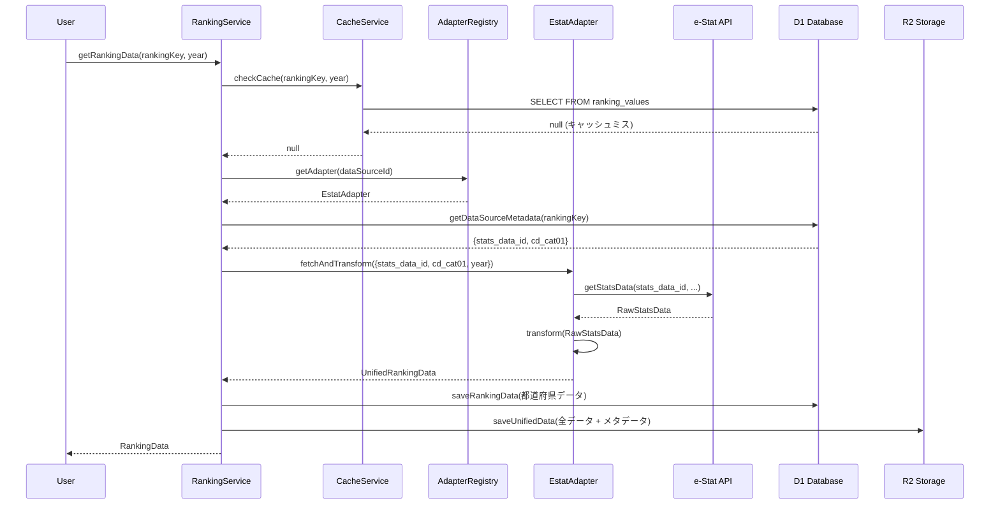
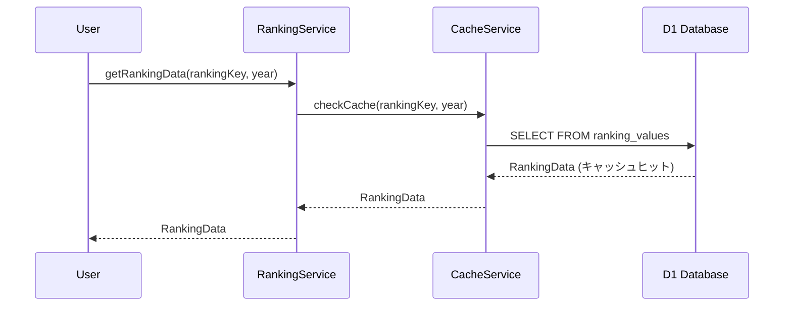
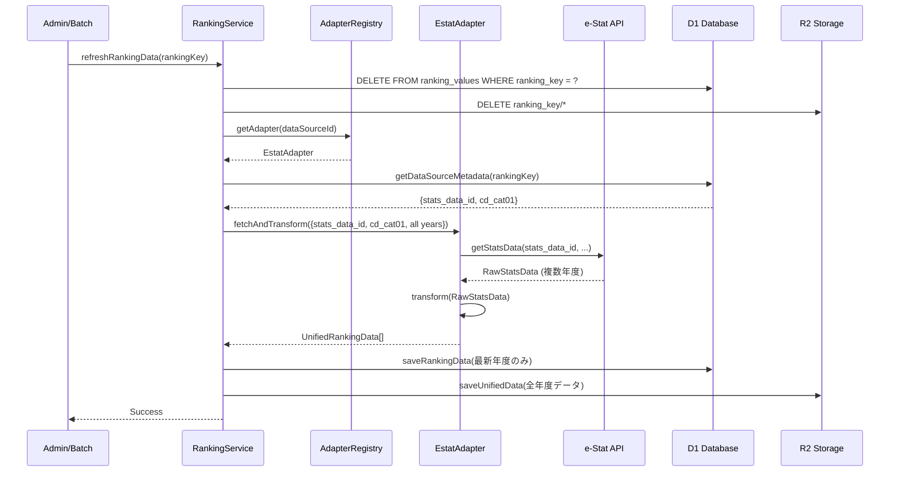

# ランキングドメイン - データ設計

**作成日**: 2025-10-28
**最終更新**: 2025-10-28
**対象**: データフロー、レイヤー設計、永続化戦略

---

## 目次

1. [データフロー](#データフロー)
2. [レイヤー設計](#レイヤー設計)
3. [データ永続化戦略](#データ永続化戦略)
4. [マルチデータソース対応](#マルチデータソース対応)
5. [ランキンググループ機能](#ランキンググループ機能)

---

## データフロー

### シナリオ1: 初回データ取得



**処理フロー詳細**:

1. **キャッシュチェック** (50ms)
   - D1で`ranking_values`テーブルを検索
   - 都道府県レベル: D1優先
   - 市区町村レベル: R2から取得

2. **メタデータ取得** (10ms)
   - `data_source_metadata`からデータソース固有パラメータを取得
   - 例: e-Statの場合 `{stats_data_id, cd_cat01}`

3. **アダプター実行** (1-3秒)
   - アダプターレジストリから適切なアダプターを取得
   - 外部APIを呼び出し
   - 統一フォーマットに変換

4. **データ保存** (200ms)
   - D1: 都道府県レベルデータ（高速アクセス用）
   - R2: 全データ + 統計情報（長期保存用）

5. **レスポンス返却** (50ms)
   - 変換後データをクライアントに返却

**合計時間**: 約1.3〜3.3秒

### シナリオ2: キャッシュヒット



**処理フロー詳細**:

1. **キャッシュチェック** (50ms)
   - D1で`ranking_values`テーブルを検索
   - データが存在すれば即座に返却

2. **レスポンス返却** (10ms)
   - キャッシュデータをクライアントに返却

**合計時間**: 約60〜100ms（**初回の1/20〜1/30**）

### シナリオ3: データ更新



**更新戦略**:

1. **手動更新**:
   - 管理画面から特定のランキング項目を更新
   - APIエンドポイント: `POST /api/rankings/data/refresh`

2. **バッチ更新**（将来実装）:
   - Cloudflare Workersの cron trigger
   - 月次・年次での自動更新

3. **TTLベース更新**（オプション）:
   - キャッシュにTTLを設定（例: 30日）
   - TTL切れ時に自動再取得

---

## レイヤー設計

### Layer 1: Presentation Layer

**責務**: UIコンポーネント、ユーザーインタラクション

**コンポーネント**:
```typescript
// コロプレス地図
<ChoroplethMap
  rankingKey={rankingKey}
  year={selectedYear}
  colorScheme={item.mapColorScheme}
/>

// ランキングテーブル
<RankingTable
  rankingKey={rankingKey}
  year={selectedYear}
  direction={item.rankingDirection}
/>
```

**ディレクトリ**: `src/components/organisms/visualization/`

### Layer 2: Service Layer

**責務**: ビジネスロジック、データ取得調整

**主要サービス**:
```typescript
// ランキングサービス
class RankingService {
  // データ取得（キャッシュファースト）
  async getRankingData(
    rankingKey: string,
    timeCode: string,
    options?: RankingDataOptions
  ): Promise<RankingDataPoint[]> {
    // 1. キャッシュチェック
    const cached = await this.cacheService.get(rankingKey, timeCode);
    if (cached) return cached;

    // 2. アダプター経由で取得
    const adapter = this.adapterRegistry.get(dataSourceId);
    const metadata = await this.getMetadata(rankingKey);
    const data = await adapter.fetchAndTransform({
      rankingKey,
      timeCode,
      sourceSpecific: metadata,
    });

    // 3. キャッシュ保存
    await this.cacheService.save(rankingKey, data);

    return data.values;
  }

  // データ更新
  async refreshRankingData(rankingKey: string): Promise<void> {
    // キャッシュ削除 → 再取得 → 保存
  }
}
```

**ディレクトリ**: `src/features/ranking/services/`

### Layer 3: Repository Layer

**責務**: データアクセス抽象化

**主要リポジトリ**:
```typescript
// メタデータリポジトリ
class MetadataRepository {
  async getDataSourceMetadata(
    rankingKey: string,
    dataSourceId: string
  ): Promise<Record<string, unknown>> {
    const result = await this.db.prepare(`
      SELECT dsm.metadata
      FROM data_source_metadata dsm
      JOIN ranking_items ri ON dsm.ranking_item_id = ri.id
      WHERE ri.ranking_key = ? AND dsm.data_source_id = ?
    `).bind(rankingKey, dataSourceId).first();

    return JSON.parse(result.metadata);
  }
}

// キャッシュリポジトリ
class CacheRepository {
  async getRankingData(
    rankingKey: string,
    timeCode: string
  ): Promise<RankingDataPoint[] | null> {
    // D1から取得
    const d1Data = await this.getFromD1(rankingKey, timeCode);
    if (d1Data) return d1Data;

    // R2から取得（フォールバック）
    const r2Data = await this.getFromR2(rankingKey, timeCode);
    return r2Data;
  }
}
```

**ディレクトリ**: `src/features/ranking/repositories/`

### Layer 4: Adapter Layer

**責務**: 外部データソース統合

**アダプター実装**:
```typescript
// e-Stat アダプター
class EstatRankingAdapter implements RankingDataAdapter {
  readonly sourceId = 'estat';
  readonly sourceName = 'e-Stat';

  async fetchAndTransform(
    params: AdapterFetchParams
  ): Promise<UnifiedRankingData> {
    // 1. メタデータからe-Statパラメータ抽出
    const { stats_data_id, cd_cat01 } = params.sourceSpecific;

    // 2. e-Stat APIを呼び出し
    const rawData = await this.estatClient.getStatsData({
      statsDataId: stats_data_id,
      cdCat01: cd_cat01,
      cdTime: params.timeCode,
    });

    // 3. 統一フォーマットに変換
    const transformer = new EstatTransformer();
    const dataPoints = transformer.transform(
      rawData,
      params.level,
      params.parentCode
    );

    // 4. UnifiedRankingData を構築
    return {
      metadata: {
        rankingKey: params.rankingKey,
        dataSourceId: this.sourceId,
        dataSourceName: this.sourceName,
        ...
      },
      values: dataPoints,
      quality: this.assessQuality(dataPoints),
    };
  }
}
```

**ディレクトリ**: `src/features/ranking/adapters/`

### Layer 5: Infrastructure Layer

**責務**: データベース、ストレージ、外部API

**コンポーネント**:
- D1 Database クライアント
- R2 Storage クライアント
- e-Stat API クライアント
- 気象庁 API クライアント

**ディレクトリ**: `src/infrastructure/database/`, `src/infrastructure/storage/`, `src/infrastructure/api/`

---

## データ永続化戦略

### ストレージ選定基準

#### D1 Database（SQLite）

**用途**:
- ランキング項目定義（`ranking_items`）
- メタデータ（`data_source_metadata`）
- 都道府県レベルランキングデータ（`ranking_values`）

**特徴**:
- 低レイテンシ（10〜50ms）
- SQL クエリ可能
- トランザクション対応
- 容量制限: 500MB〜2GB（プランによる）

**適用条件**:
```typescript
// D1に保存すべきデータ
interface D1DataCriteria {
  size: number;              // < 5KB per record
  accessFrequency: string;   // "high" (1日10回以上)
  queryComplexity: string;   // "complex" (JOIN, WHERE, GROUP BY)
  targetAreaLevel: string;   // "prefecture" (47件程度)
}
```

**例**:
```sql
-- 都道府県レベルランキング（2023年）
INSERT INTO ranking_values (
  ranking_key, area_code, area_name, time_code, value, rank
) VALUES
  ('population_density', '01', '北海道', '2023', 64.5, 47),
  ('population_density', '13', '東京都', '2023', 6439.3, 1),
  ...  -- 47件
```

#### R2 Storage（Object Storage）

**用途**:
- 大容量ランキングデータ（市区町村レベル）
- 複数年度の時系列データ
- 変換後の完全なUnifiedRankingData

**特徴**:
- 大容量対応（無制限）
- 低コスト
- HTTPアクセス
- レイテンシ: 100〜300ms

**適用条件**:
```typescript
// R2に保存すべきデータ
interface R2DataCriteria {
  size: number;              // > 5KB per record
  accessFrequency: string;   // "medium" or "low"
  queryComplexity: string;   // "simple" (keyベース取得のみ)
  targetAreaLevel: string;   // "municipality" (1000件以上)
}
```

**例**:
```typescript
// R2キー構造
const r2Key = `ranking/${rankingKey}/${timeCode}.json`;

// 保存データ（UnifiedRankingData）
const r2Data: R2RankingData = {
  metadata: {
    rankingKey: 'population_density',
    timeCode: '2023',
    timeName: '2023年',
    unit: '人/km²',
    targetAreaLevel: 'municipality',
    lastUpdated: '2025-01-01T00:00:00Z',
  },
  values: [
    { areaCode: '01101', areaName: '札幌市', value: 1752.8, rank: 15, ... },
    { areaCode: '01102', areaName: '函館市', value: 354.2, rank: 234, ... },
    ...  // 1741件（全市区町村）
  ],
  statistics: {
    min: 5.2,
    max: 15604.3,
    mean: 338.7,
    median: 124.5,
    ...
  },
};
```

### データ保存ルール

#### ルール1: 都道府県レベルはD1優先

```typescript
async saveRankingData(
  rankingKey: string,
  data: UnifiedRankingData
): Promise<void> {
  // 都道府県レベルのデータを抽出
  const prefectureData = data.values.filter(
    v => v.areaType === 'prefecture'
  );

  if (prefectureData.length > 0) {
    // D1に保存（高速アクセス用）
    await this.d1Repository.savePrefectureData(rankingKey, prefectureData);
  }

  // 完全なデータはR2に保存（バックアップ + 市区町村データ）
  await this.r2Repository.saveUnifiedData(rankingKey, data);
}
```

#### ルール2: 市区町村レベルはR2専用

```typescript
async getMunicipalityData(
  rankingKey: string,
  timeCode: string,
  prefectureCode?: string
): Promise<RankingDataPoint[]> {
  // R2から取得
  const r2Data = await this.r2Repository.getUnifiedData(rankingKey, timeCode);

  // 都道府県でフィルタリング（必要な場合）
  if (prefectureCode) {
    return r2Data.values.filter(
      v => v.parentAreaCode === prefectureCode
    );
  }

  return r2Data.values;
}
```

#### ルール3: 時系列データはR2に集約

```typescript
// R2キー構造（年度ごと）
const r2Keys = [
  'ranking/population_density/2020.json',
  'ranking/population_density/2021.json',
  'ranking/population_density/2022.json',
  'ranking/population_density/2023.json',
];

// 時系列取得
async getTimeSeriesData(
  rankingKey: string,
  years: string[]
): Promise<Map<string, UnifiedRankingData>> {
  const dataMap = new Map();

  for (const year of years) {
    const data = await this.r2Repository.getUnifiedData(rankingKey, year);
    dataMap.set(year, data);
  }

  return dataMap;
}
```

### キャッシュTTL戦略

```typescript
interface CacheTTLConfig {
  d1: {
    prefecture: number;        // 30日（頻繁に更新されない）
    municipality: number;      // 60日（更新頻度低い）
  };
  r2: {
    unified: number;           // 90日（長期保存）
    historical: number;        // 無期限（過去データは不変）
  };
}

// TTLチェック
async checkTTL(rankingKey: string, timeCode: string): Promise<boolean> {
  const metadata = await this.getMetadata(rankingKey, timeCode);
  const now = Date.now();
  const savedAt = new Date(metadata.created_at).getTime();
  const ttl = this.getTTL(metadata.targetAreaLevel);

  return (now - savedAt) < ttl;
}
```

---

## マルチデータソース対応

### Adapter Pattern実装

#### 1. アダプターインターフェース

```typescript
/**
 * すべてのデータソースアダプターが実装すべきインターフェース
 */
interface RankingDataAdapter {
  /**
   * データソースID（一意識別子）
   */
  readonly sourceId: string;

  /**
   * データソース名（表示用）
   */
  readonly sourceName: string;

  /**
   * データを取得して統一フォーマットに変換
   */
  fetchAndTransform(params: AdapterFetchParams): Promise<UnifiedRankingData>;

  /**
   * 利用可能な年度リストを取得
   */
  getAvailableYears(
    rankingKey: string,
    level: TargetAreaLevel
  ): Promise<string[]>;

  /**
   * データソースが利用可能かチェック
   */
  isAvailable(): Promise<boolean>;
}
```

#### 2. アダプターレジストリ

```typescript
/**
 * アダプターを登録・管理するレジストリ
 */
class AdapterRegistry {
  private adapters: Map<string, RankingDataAdapter> = new Map();

  /**
   * アダプターを登録
   */
  register(adapter: RankingDataAdapter): void {
    this.adapters.set(adapter.sourceId, adapter);
  }

  /**
   * アダプターを取得
   */
  get(sourceId: string): RankingDataAdapter {
    const adapter = this.adapters.get(sourceId);
    if (!adapter) {
      throw new Error(`Adapter not found: ${sourceId}`);
    }
    return adapter;
  }

  /**
   * 利用可能なアダプター一覧を取得
   */
  async getAvailable(): Promise<RankingDataAdapter[]> {
    const available: RankingDataAdapter[] = [];

    for (const adapter of this.adapters.values()) {
      if (await adapter.isAvailable()) {
        available.push(adapter);
      }
    }

    return available;
  }
}

// グローバルレジストリインスタンス
export const adapterRegistry = new AdapterRegistry();

// アダプター登録
adapterRegistry.register(new EstatRankingAdapter());
adapterRegistry.register(new JmaRankingAdapter());
adapterRegistry.register(new CsvRankingAdapter());
```

#### 3. データソース定義

```sql
-- data_sourcesテーブル
INSERT INTO data_sources (id, name, description, is_active) VALUES
  ('estat', 'e-Stat', '政府統計の総合窓口', 1),
  ('jma', '気象庁', '気象庁オープンデータ', 1),
  ('csv', 'CSV', 'カスタムCSVファイル', 1),
  ('resas', 'RESAS', '地域経済分析システム', 0),  -- 将来的に対応
  ('worldbank', 'World Bank', '世界銀行オープンデータ', 0);
```

### 各データソースの実装パターン

#### パターン1: REST API型（e-Stat、RESAS）

**特徴**:
- HTTP REST APIでデータ取得
- JSONレスポンス
- 認証キー必須
- レート制限あり

**メタデータ例**:
```json
{
  "stats_data_id": "0000010102",
  "cd_cat01": "B1101"
}
```

#### パターン2: ファイルベース型（CSV、Excel）

**特徴**:
- ローカルファイルまたはR2に保存
- パース処理が必要
- バリデーション必須

**メタデータ例**:
```json
{
  "csv_file_path": "user_uploads/population_2023.csv",
  "column_mapping": {
    "area_code": "都道府県コード",
    "area_name": "都道府県名",
    "value": "人口",
    "unit": "人"
  }
}
```

#### パターン3: リアルタイムAPI型（気象庁）

**特徴**:
- リアルタイムデータ
- 頻繁な更新
- キャッシュTTL短め

**メタデータ例**:
```json
{
  "element_id": "temperature",
  "station_type": "prefecture_capital"
}
```

---

## ランキンググループ機能

### 概要

ランキンググループ機能は、関連する複数のランキング項目をグループ化して管理する機能です。

**ビジネス課題**:
- サブカテゴリ内に多くの関連項目が存在する
- 例：「製造業」サブカテゴリに「製造品出荷額」「製造品出荷額（事業所あたり）」「製造品出荷額（従業員あたり）」など
- サイドバーに全ての項目を列挙すると見づらい

**解決策**:
- 関連する項目をグループ化
- グループ単位で表示・管理
- UI でグループごとに折り畳み表示が可能

### データベース設計

#### ranking_groups テーブル

```sql
CREATE TABLE ranking_groups (
  id INTEGER PRIMARY KEY AUTOINCREMENT,
  group_key TEXT UNIQUE NOT NULL,           -- 'manufacturing-output'
  subcategory_id TEXT NOT NULL,             -- 'manufacturing'
  name TEXT NOT NULL,                       -- '製造品出荷'
  description TEXT,                         -- グループの説明
  icon TEXT,                                -- グループアイコン（オプション）
  display_order INTEGER DEFAULT 0,          -- サブカテゴリ内での表示順
  is_collapsed BOOLEAN DEFAULT 0,           -- デフォルトで折り畳むか
  created_at DATETIME DEFAULT CURRENT_TIMESTAMP,
  updated_at DATETIME DEFAULT CURRENT_TIMESTAMP
);
```

**インデックス**:
- `idx_ranking_groups_subcategory ON ranking_groups(subcategory_id)`
- `idx_ranking_groups_display_order ON ranking_groups(subcategory_id, display_order)`

#### ranking_group_items テーブル

```sql
CREATE TABLE ranking_group_items (
  id INTEGER PRIMARY KEY AUTOINCREMENT,
  group_id INTEGER NOT NULL,
  ranking_item_id INTEGER NOT NULL,
  display_order INTEGER DEFAULT 0,         -- グループ内での表示順
  is_featured BOOLEAN DEFAULT 0,           -- 注目項目フラグ
  created_at DATETIME DEFAULT CURRENT_TIMESTAMP,

  UNIQUE(group_id, ranking_item_id),
  FOREIGN KEY (group_id) REFERENCES ranking_groups(id) ON DELETE CASCADE,
  FOREIGN KEY (ranking_item_id) REFERENCES ranking_items(id) ON DELETE CASCADE
);
```

**インデックス**:
- `idx_ranking_group_items_group ON ranking_group_items(group_id)`
- `idx_ranking_group_items_item ON ranking_group_items(ranking_item_id)`
- `idx_ranking_group_items_order ON ranking_group_items(group_id, display_order)`

### グループ化の例

```sql
-- グループを作成
INSERT INTO ranking_groups (group_key, subcategory_id, name, description, display_order)
VALUES
  ('manufacturing-output', 'manufacturing', '製造品出荷', '製造品の出荷額に関するランキング', 1),
  ('manufacturing-establishments', 'manufacturing', '事業所', '製造業事業所に関するランキング', 2);

-- グループとランキング項目を関連付ける
INSERT INTO ranking_group_items (group_id, ranking_item_id, display_order, is_featured)
VALUES
  (1, 101, 1, 1),  -- 製造品出荷額（注目項目）
  (1, 102, 2, 0),  -- 製造品出荷額（事業所あたり）
  (1, 103, 3, 0);  -- 製造品出荷額（従業員あたり）
```

### ベストプラクティス

1. **グループ名の命名規則**
   - わかりやすい名前を使用
   - 例：「製造品出荷」「事業所数」「売上高」

2. **表示順の管理**
   - `display_order` でグループの表示順を制御
   - 重要度の高いグループを上に配置

3. **デフォルト表示**
   - `is_collapsed` でグループの初期状態を制御
   - 重要度の低いグループは折り畳み表示

4. **注目項目の活用**
   - `is_featured` フラグで注目項目を指定
   - UI で強調表示することが可能

---

## 関連ドキュメント

- [01_アーキテクチャ概要.md](./01_アーキテクチャ概要.md) - 全体設計思想
- [03_実装ガイド.md](./03_実装ガイド.md) - 具体的な実装例
- [04_運用・保守ガイド.md](./04_運用・保守ガイド.md) - 運用とメンテナンス
