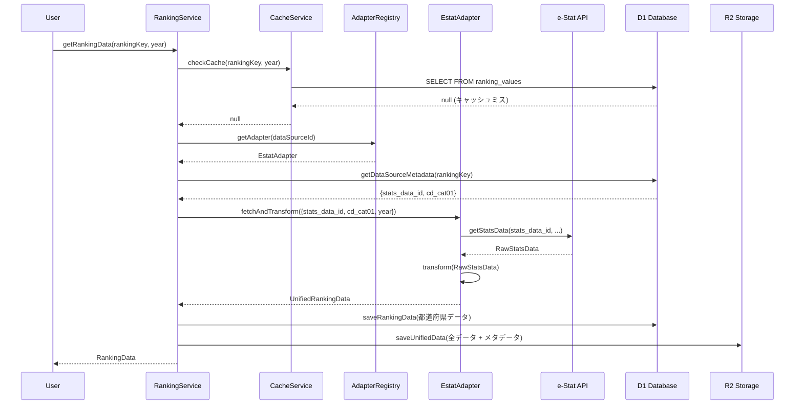
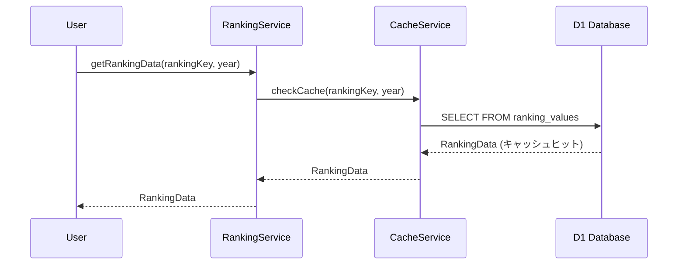
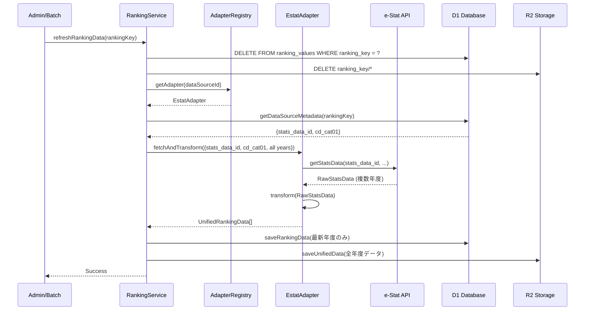

# ランキングドメイン - データ設計

**作成日**: 2025-10-28
**最終更新**: 2025-10-28
**対象**: データフロー、実装パターン

> **注意**: アーキテクチャ設計、データベース設計、マルチデータソース設計については [技術設計ドキュメント](../../../01_技術設計/03_ドメイン設計/10_ranking.md) を参照してください。

---

## 目次

1. [データフロー](#データフロー)

---

## データフロー

### シナリオ1: 初回データ取得

**処理フロー詳細**:

1. **キャッシュチェック** (50ms)
   - D1で`ranking_values`テーブルを検索
   - 都道府県レベル: D1優先
   - 市区町村レベル: R2から取得

2. **メタデータ取得** (10ms)
   - `data_source_metadata`からデータソース固有パラメータを取得
   - 例: e-Statの場合 `{stats_data_id, cd_cat01}`

3. **アダプター実行** (1-3秒)
   - アダプターレジストリから適切なアダプターを取得
   - 外部APIを呼び出し
   - 統一フォーマットに変換

4. **データ保存** (200ms)
   - D1: 都道府県レベルデータ（高速アクセス用）
   - R2: 全データ + 統計情報（長期保存用）

5. **レスポンス返却** (50ms)
   - 変換後データをクライアントに返却

**合計時間**: 約1.3〜3.3秒

### シナリオ2: キャッシュヒット

**処理フロー詳細**:

1. **キャッシュチェック** (50ms)
   - D1で`ranking_values`テーブルを検索
   - データが存在すれば即座に返却

2. **レスポンス返却** (10ms)
   - キャッシュデータをクライアントに返却

**合計時間**: 約60〜100ms（**初回の1/20〜1/30**）

### シナリオ3: データ更新

**更新戦略**:

1. **手動更新**:
   - 管理画面から特定のランキング項目を更新
   - APIエンドポイント: `POST /api/rankings/data/refresh`

2. **バッチ更新**（将来実装）:
   - Cloudflare Workersの cron trigger
   - 月次・年次での自動更新

3. **TTLベース更新**（オプション）:
   - キャッシュにTTLを設定（例: 30日）
   - TTL切れ時に自動再取得

---

