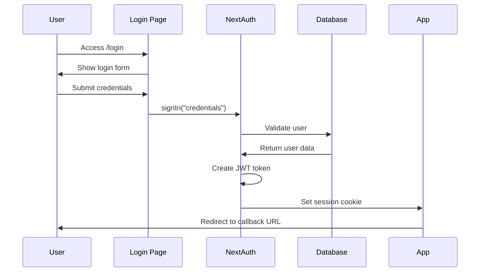
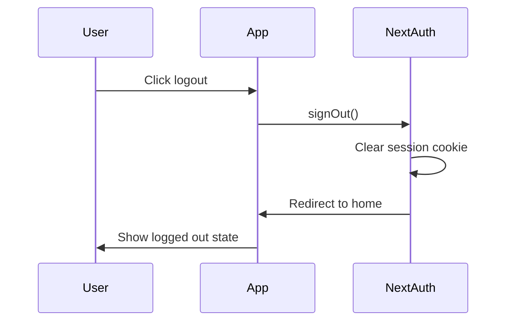

# NextAuth 実装ガイド

## 概要

stats47 プロジェクトでは、認証システムとして **NextAuth.js v5 (Auth.js)** を採用しています。このドキュメントでは、NextAuth の設定、実装、運用について詳しく説明します。

## 1. NextAuth の概要

### 1.1 選定理由

**NextAuth.js を選定した理由:**

- **業界標準**: React/Next.js エコシステムで最も広く使用されている認証ライブラリ
- **セキュリティ**: セキュリティベストプラクティスが組み込まれている
- **豊富なプロバイダー**: OAuth、Credentials、2FA など多様な認証方式をサポート
- **TypeScript サポート**: 型安全性を提供
- **Cloudflare Workers 対応**: ステートレスな JWT 戦略で Cloudflare 環境に最適
- **メンテナンス性**: 活発なコミュニティとドキュメント

### 1.2 アーキテクチャ概要

```
┌─────────────────┐    ┌──────────────────┐    ┌─────────────────┐
│   Frontend      │    │   NextAuth       │    │   Database      │
│   (React)       │◄──►│   (Auth.js)      │◄──►│   (D1)          │
│                 │    │                  │    │                 │
│ - useSession()  │    │ - JWT Strategy   │    │ - users table   │
│ - SessionProvider│    │ - Credentials    │    │ - sessions table│
│ - signIn()      │    │ - Callbacks      │    │                 │
└─────────────────┘    └──────────────────┘    └─────────────────┘
```

## 2. 環境変数設定

### 2.1 必須環境変数

各環境で以下の環境変数を設定する必要があります：

```bash
# NextAuth設定
NEXTAUTH_SECRET=<32文字以上のランダム文字列>
NEXTAUTH_URL=<アプリケーションのURL>

# 環境設定
NEXT_PUBLIC_ENV=<environment>
NODE_ENV=<node_environment>
```

### 2.2 環境別設定例

#### 開発環境 (.env.development)

```bash
NODE_ENV=development
AUTH_SECRET=dFIWzT92Oi8MA+m55uQJ3mw9HfNUT94BK1nZBELtdFc=
AUTH_URL=http://localhost:3000

# 注意: NEXT_PUBLIC_USE_MOCKはpackage.jsonのスクリプトで指定
# dev:mock → NEXT_PUBLIC_USE_MOCK=true
# dev:api → NEXT_PUBLIC_USE_MOCK=false
```

#### ステージング環境 (.env.staging)

```bash
NODE_ENV=production
AUTH_SECRET=Bfyg2rBcdObHoPpfDzBggskEgqZPhzw+t/Y5aPgbDl4=
AUTH_URL=https://staging.stats47.com
```

#### 本番環境 (.env.production)

```bash
NODE_ENV=production
AUTH_SECRET=h4ne0nzXDRpivDKzQv1Eivi5xJ3ssOm0+BjUD1qCqJY=
AUTH_URL=https://stats47.com
```

### 2.3 AUTH_SECRET の生成

**方法 1: Node.js で生成（推奨）:**

```bash
node -e "console.log(require('crypto').randomBytes(32).toString('base64'))"
```

**方法 2: OpenSSL で生成:**

```bash
openssl rand -base64 32
```

**セキュリティ注意事項:**

- 各環境で異なるシークレットを使用
- シークレットは最低 32 文字
- 本番環境のシークレットは特に厳重に管理
- `.env.*` ファイルは Git にコミットしない

**NextAuth v5 (Auth.js) の変更点:**

- 旧: `NEXTAUTH_SECRET` (NextAuth v4)
- 新: `AUTH_SECRET` (NextAuth v5 / Auth.js)

## 3. SessionProvider の設定

### 3.1 ルートレイアウトでの設定

`src/app/layout.tsx` で SessionProvider を設定：

```tsx
import { SessionProvider } from "next-auth/react";

export default function RootLayout({
  children,
}: {
  children: React.ReactNode;
}) {
  return (
    <html lang="ja">
      <body>
        <JotaiProvider>
          <SessionProvider>
            <Header />
            <Sidebar />
            <main className="lg:ps-60 pt-16">{children}</main>
          </SessionProvider>
        </JotaiProvider>
      </body>
    </html>
  );
}
```

### 3.2 カスタムフックの使用

`src/hooks/auth/useAuth.ts` で NextAuth のセッションをラップ：

```typescript
import { useSession } from "next-auth/react";

export function useAuth() {
  const { data: session, status } = useSession();

  const isLoading = status === "loading";
  const isAuthenticated = status === "authenticated";
  const isAdmin = session?.user?.role === "admin";

  return {
    session,
    isLoading,
    isAuthenticated,
    isAdmin,
  };
}
```

## 4. ミドルウェアの設定

### 4.1 認証保護の実装

`middleware.ts` でルートレベルの認証保護を実装：

```typescript
import { auth } from "@/infrastructure/auth/auth";
import { NextResponse } from "next/server";

export default auth((req) => {
  const { pathname } = req.nextUrl;

  // 認証が必要なパス
  const protectedPaths = ["/profile", "/admin"];
  const isProtectedPath = protectedPaths.some((path) =>
    pathname.startsWith(path)
  );

  // 管理者専用パス
  const adminPaths = ["/admin"];
  const isAdminPath = adminPaths.some((path) => pathname.startsWith(path));

  // 未認証ユーザーを保護されたパスから除外
  if (isProtectedPath && !req.auth) {
    const loginUrl = new URL("/login", req.url);
    loginUrl.searchParams.set("callbackUrl", pathname);
    return NextResponse.redirect(loginUrl);
  }

  // 非管理者を管理者専用パスから除外
  if (isAdminPath && req.auth?.user?.role !== "admin") {
    return NextResponse.redirect(new URL("/", req.url));
  }

  return NextResponse.next();
});

export const config = {
  matcher: ["/estat-api/:path*", "/profile/:path*", "/admin/:path*"],
};
```

### 4.2 保護されたルート

| パス               | 認証 | ロール | 説明                 |
| ------------------ | ---- | ------ | -------------------- |
| `/profile`         | 必須 | 任意   | ユーザープロフィール |
| `/admin`           | 必須 | admin  | 管理画面             |
| `/admin/dev-tools` | 必須 | admin  | 開発ツール           |

## 5. 認証フローの説明

### 5.1 ログインフロー



### 5.2 セッション管理

**JWT 戦略の特徴:**

- セッション情報は JWT トークンに保存
- データベースへの書き込みが不要（パフォーマンス向上）
- ステートレス（Cloudflare Workers に最適）
- トークンの有効期限: 30 日間

### 5.3 ログアウトフロー



## 6. 実装ファイル構成

### 6.1 認証関連ファイル

```
src/
├── lib/auth/
│   └── auth.ts                    # NextAuth設定
├── hooks/auth/
│   └── useAuth.ts                 # カスタムフック
├── app/
│   ├── api/auth/
│   │   └── [...nextauth]/
│   │       └── route.ts           # NextAuth APIルート
│   ├── login/
│   │   └── page.tsx               # ログインページ
│   └── layout.tsx                 # SessionProvider設定
└── middleware.ts                  # 認証ミドルウェア
```

### 6.2 設定ファイル

```
env.development.example            # 開発環境設定例
env.mock.example                   # モック環境設定例
env.staging.example                # ステージング環境設定例
env.production.example             # 本番環境設定例
```

## 7. トラブルシューティング

### 7.1 よくある問題

#### 問題: ログインできない

**症状:** ログインフォームでエラーが発生する

**原因と解決方法:**

1. **NEXTAUTH_SECRET が設定されていない**

   ```bash
   # 環境変数を確認
   echo $NEXTAUTH_SECRET
   ```

2. **データベース接続エラー**

   ```bash
   # データベースの状態を確認
   npx wrangler d1 list
   ```

3. **ユーザーが存在しない**
   ```bash
   # ユーザー一覧を確認
   npx wrangler d1 execute stats47 --local --command "SELECT * FROM users;"
   ```

#### 問題: セッションが維持されない

**症状:** ページリロード後にログアウトされる

**原因と解決方法:**

1. **NEXTAUTH_URL が間違っている**

   ```bash
   # 正しいURLを設定
   NEXTAUTH_URL=http://localhost:3000
   ```

2. **Cookie の設定問題**
   - ブラウザの開発者ツールで Cookie を確認
   - `authjs.session-token` が設定されているか確認

#### 問題: 管理者権限が認識されない

**症状:** 管理者でログインしても `isAdmin` が `false`

**原因と解決方法:**

1. **データベースのロールが正しくない**

   ```bash
   # ユーザーのロールを確認
   npx wrangler d1 execute stats47 --local --command "SELECT username, role FROM users WHERE username='admin';"
   ```

2. **NextAuth のコールバックが正しく動作していない**
   - `src/infrastructure/auth/auth.ts` の `jwt` と `session` コールバックを確認

### 7.2 デバッグ方法

#### ログの確認

```typescript
// 開発環境でデバッグログを有効化
export const authConfig: NextAuthConfig = {
  // ... 他の設定
  debug: process.env.NODE_ENV === "development",
};
```

#### セッション情報の確認

```typescript
// コンポーネントでセッション情報をログ出力
const { data: session } = useSession();
console.log("Current session:", session);
```

### 7.3 パフォーマンス問題

#### 問題: 認証チェックが遅い

**解決方法:**

1. **JWT 戦略を使用**（既に実装済み）
2. **ミドルウェアでキャッシュ**を活用
3. **不要な認証チェック**を削除

## 8. セキュリティ考慮事項

### 8.1 パスワードセキュリティ

- bcryptjs でハッシュ化（saltRounds: 10）
- パスワードは平文で保存しない
- 定期的なパスワード更新を推奨

### 8.2 セッションセキュリティ

- JWT トークンは暗号化されている
- セッションの有効期限: 30 日間
- ログアウト時にセッションを無効化

### 8.3 環境変数の管理

- 本番環境のシークレットは Cloudflare Secrets で管理
- 開発環境でも本番と同じレベルのセキュリティを維持
- 定期的なシークレットのローテーション

## 9. Mock 環境でのテスト

### 9.1 テストアカウント

mock 環境では以下のテストアカウントが利用可能です：

**管理者アカウント:**

- Email: admin@stats47.local
- Password: admin123
- Role: admin

**一般ユーザーアカウント:**

- Email: user@stats47.local
- Password: user123
- Role: user

### 9.2 使用方法

1. mock 環境を起動:

   ```bash
   npm run dev:mock
   ```

2. ログインページにアクセス:

   ```
   http://localhost:3000/login
   ```

3. テストアカウントでログイン

4. 管理画面のデザインを確認:
   ```
   http://localhost:3000/admin
   ```

### 9.3 注意事項

- mock 環境のデータは JSON ファイルから読み込まれます
- パスワード変更やユーザー追加などの操作は反映されません
- デザイン検証と UI テストのみを目的としています

## 10. 参考リソース

### 10.1 公式ドキュメント

- [NextAuth.js v5 (Auth.js)](https://authjs.dev/)
- [NextAuth.js Credentials Provider](https://authjs.dev/getting-started/providers/credentials)
- [NextAuth.js Database Adapters](https://authjs.dev/getting-started/adapters)
- [Cloudflare Workers + Auth.js](https://authjs.dev/getting-started/deployment/cloudflare)

### 10.2 関連ドキュメント

- [環境設定ガイド](../../02_環境設定ガイド.md)
- [認証システム仕様書](../specifications/authentication-system.md)
- [認証システム監査レポート](../../../99_課題管理/authentication-system-audit.md)

---

**作成日**: 2025 年 1 月 20 日  
**最終更新日**: 2025 年 1 月 20 日  
**バージョン**: 1.0
