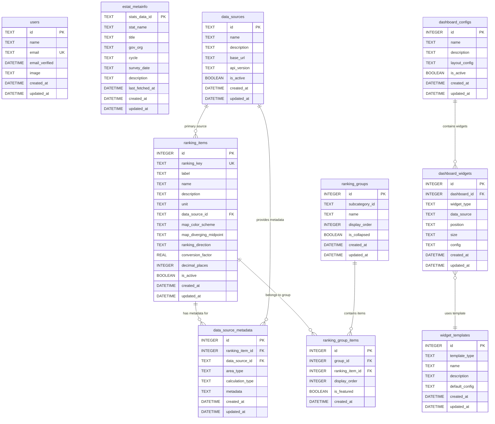

# D1 データベース概要

## 概要

stats47 プロジェクトの Cloudflare D1 データベースの設計とアーキテクチャについて説明します。

### プロジェクト情報

- **プロジェクト名**: stats47
- **データベース**: Cloudflare D1 (SQLite ベース)
- **データベース名**: `stats47`
- **統合スキーマ**: `database/schemas/main.sql`
- **ORM**: なし（生 SQL とプリペアドステートメント）
- **マイグレーション**: Wrangler D1 Migrations

### データベース環境

| 環境             | データベース                     | 接続方法       | 用途         |
| ---------------- | -------------------------------- | -------------- | ------------ |
| **ローカル開発** | `.wrangler/state/.../xxx.sqlite` | better-sqlite3 | 開発・テスト |
| **ステージング** | Cloudflare D1 (dev)              | REST API       | 統合テスト   |
| **本番**         | Cloudflare D1 (prod)             | REST API       | 本番運用     |

## スキーマ設計

### テーブル一覧

#### 認証関連（Auth.js 準拠）

##### 1. users

ユーザー認証・管理テーブル（Auth.js 準拠）

| カラム名      | データ型 | 制約        | デフォルト値      | 説明                 |
| ------------- | -------- | ----------- | ----------------- | -------------------- |
| id            | TEXT     | PRIMARY KEY | -                 | ユーザー ID (UUID)   |
| name          | TEXT     | -           | NULL              | ユーザー名           |
| email         | TEXT     | UNIQUE      | -                 | メールアドレス       |
| emailVerified | DATETIME | -           | NULL              | メール認証日時       |
| image         | TEXT     | -           | NULL              | プロフィール画像 URL |
| username      | TEXT     | UNIQUE      | NULL              | ユーザー名           |
| password_hash | TEXT     | -           | NULL              | パスワードハッシュ   |
| role          | TEXT     | -           | 'user'            | ロール               |
| is_active     | BOOLEAN  | -           | 1                 | アクティブフラグ     |
| last_login    | DATETIME | -           | NULL              | 最終ログイン日時     |
| created_at    | DATETIME | -           | CURRENT_TIMESTAMP | 作成日時             |
| updated_at    | DATETIME | -           | CURRENT_TIMESTAMP | 更新日時             |

**インデックス**:

- `idx_users_username` ON users(username)
- `idx_users_email` ON users(email)

##### 2. accounts

Auth.js アカウント連携テーブル

| カラム名          | データ型 | 制約        | デフォルト値      | 説明                 |
| ----------------- | -------- | ----------- | ----------------- | -------------------- |
| id                | TEXT     | PRIMARY KEY | -                 | アカウント ID        |
| userId            | TEXT     | NOT NULL    | -                 | ユーザー ID          |
| type              | TEXT     | NOT NULL    | -                 | アカウントタイプ     |
| provider          | TEXT     | NOT NULL    | -                 | プロバイダー名       |
| providerAccountId | TEXT     | NOT NULL    | -                 | プロバイダー ID      |
| refresh_token     | TEXT     | -           | NULL              | リフレッシュトークン |
| access_token      | TEXT     | -           | NULL              | アクセストークン     |
| expires_at        | INTEGER  | -           | NULL              | 有効期限             |
| token_type        | TEXT     | -           | NULL              | トークンタイプ       |
| scope             | TEXT     | -           | NULL              | スコープ             |
| id_token          | TEXT     | -           | NULL              | ID トークン          |
| session_state     | TEXT     | -           | NULL              | セッション状態       |
| created_at        | DATETIME | -           | CURRENT_TIMESTAMP | 作成日時             |
| updated_at        | DATETIME | -           | CURRENT_TIMESTAMP | 更新日時             |

**外部キー**: `userId` → `users(id)` ON DELETE CASCADE

**インデックス**:

- `idx_accounts_provider` ON accounts(provider, providerAccountId)

##### 3. sessions

Auth.js セッション管理テーブル

| カラム名     | データ型 | 制約            | デフォルト値      | 説明               |
| ------------ | -------- | --------------- | ----------------- | ------------------ |
| id           | TEXT     | PRIMARY KEY     | -                 | セッション ID      |
| sessionToken | TEXT     | UNIQUE NOT NULL | -                 | セッショントークン |
| userId       | TEXT     | NOT NULL        | -                 | ユーザー ID        |
| expires      | DATETIME | NOT NULL        | -                 | 有効期限           |
| created_at   | DATETIME | -               | CURRENT_TIMESTAMP | 作成日時           |

**外部キー**: `userId` → `users(id)` ON DELETE CASCADE

**インデックス**:

- `idx_sessions_userId` ON sessions(userId)
- `idx_sessions_sessionToken` ON sessions(sessionToken)

##### 4. verification_tokens

認証トークンテーブル

| カラム名   | データ型 | 制約               | デフォルト値 | 説明                 |
| ---------- | -------- | ------------------ | ------------ | -------------------- |
| identifier | TEXT     | PRIMARY KEY (複合) | -            | 識別子（メールなど） |
| token      | TEXT     | PRIMARY KEY (複合) | -            | トークン             |
| expires    | DATETIME | NOT NULL           | -            | 有効期限             |

#### e-Stat メタデータ関連

##### 5. estat_metainfo

e-Stat メタデータテーブル（統計表レベル管理）

| カラム名        | データ型 | 制約        | デフォルト値      | 説明                |
| --------------- | -------- | ----------- | ----------------- | ------------------- |
| stats_data_id   | TEXT     | PRIMARY KEY | -                 | 統計表 ID（主キー） |
| stat_name       | TEXT     | NOT NULL    | -                 | 統計調査名          |
| title           | TEXT     | NOT NULL    | -                 | 統計表タイトル      |
| area_type       | TEXT     | NOT NULL    | 'country'         | 地域レベル          |
| cycle           | TEXT     | -           | NULL              | 調査周期            |
| survey_date     | TEXT     | -           | NULL              | 調査年月            |
| description     | TEXT     | -           | NULL              | 説明                |
| last_fetched_at | DATETIME | -           | CURRENT_TIMESTAMP | 最終取得日時        |
| created_at      | DATETIME | -           | CURRENT_TIMESTAMP | 作成日時            |
| updated_at      | DATETIME | -           | CURRENT_TIMESTAMP | 更新日時            |

**インデックス**:

- `idx_estat_metainfo_stat_name` ON estat_metainfo(stat_name)
- `idx_estat_metainfo_title` ON estat_metainfo(title)
- `idx_estat_metainfo_area_type` ON estat_metainfo(area_type)
- `idx_estat_metainfo_updated_at` ON estat_metainfo(updated_at)

#### ランキング設定関連

##### 6. data_sources

データソース定義テーブル

| カラム名    | データ型 | 制約        | デフォルト値      | 説明             |
| ----------- | -------- | ----------- | ----------------- | ---------------- |
| id          | TEXT     | PRIMARY KEY | -                 | データソース ID  |
| name        | TEXT     | NOT NULL    | -                 | 名称             |
| description | TEXT     | -           | NULL              | 説明             |
| base_url    | TEXT     | -           | NULL              | ベース URL       |
| api_version | TEXT     | -           | NULL              | API バージョン   |
| is_active   | BOOLEAN  | -           | 1                 | アクティブフラグ |
| created_at  | DATETIME | -           | CURRENT_TIMESTAMP | 作成日時         |
| updated_at  | DATETIME | -           | CURRENT_TIMESTAMP | 更新日時         |

##### 7. ranking_items

ランキング項目設定テーブル（可視化設定を含む統合テーブル）

| カラム名               | データ型 | 制約                      | デフォルト値       | 説明                       |
| ---------------------- | -------- | ------------------------- | ------------------ | -------------------------- |
| id                     | INTEGER  | PRIMARY KEY AUTOINCREMENT | -                  | 項目 ID                    |
| ranking_key            | TEXT     | NOT NULL UNIQUE           | -                  | ランキングキー             |
| label                  | TEXT     | NOT NULL                  | -                  | 表示ラベル                 |
| name                   | TEXT     | NOT NULL                  | -                  | 正式名称                   |
| description            | TEXT     | -                         | NULL               | 説明                       |
| unit                   | TEXT     | NOT NULL                  | -                  | 単位                       |
| data_source_id         | TEXT     | NOT NULL                  | -                  | データソース ID            |
| map_color_scheme       | TEXT     | -                         | 'interpolateBlues' | 地図の色スキーム           |
| map_diverging_midpoint | TEXT     | -                         | 'zero'             | 色の分岐点設定             |
| ranking_direction      | TEXT     | -                         | 'desc'             | ランキング方向（asc/desc） |
| conversion_factor      | REAL     | -                         | 1                  | 変換係数                   |
| decimal_places         | INTEGER  | -                         | 0                  | 小数点以下桁数             |
| is_active              | BOOLEAN  | -                         | 1                  | アクティブフラグ           |
| created_at             | DATETIME | -                         | CURRENT_TIMESTAMP  | 作成日時                   |
| updated_at             | DATETIME | -                         | CURRENT_TIMESTAMP  | 更新日時                   |

**インデックス**:

- `idx_ranking_items_ranking_key` ON ranking_items(ranking_key)
- `idx_ranking_items_data_source` ON ranking_items(data_source_id)
- `idx_ranking_items_is_active` ON ranking_items(is_active)

##### 8. data_source_metadata

データソース固有メタデータテーブル（拡張版：地域レベル別、計算タイプ対応）

| カラム名         | データ型 | 制約                      | デフォルト値      | 説明                                   |
| ---------------- | -------- | ------------------------- | ----------------- | -------------------------------------- |
| id               | INTEGER  | PRIMARY KEY AUTOINCREMENT | -                 | メタデータ ID                          |
| ranking_item_id  | INTEGER  | NOT NULL                  | -                 | ランキング項目 ID                      |
| data_source_id   | TEXT     | NOT NULL                  | -                 | データソース ID                        |
| area_type        | TEXT     | NOT NULL                  | -                 | 地域レベル（prefecture/city/national） |
| calculation_type | TEXT     | NOT NULL                  | 'direct'          | 計算タイプ（direct/ratio/aggregate）   |
| metadata         | TEXT     | NOT NULL                  | -                 | データソース固有パラメータ（JSON）     |
| created_at       | DATETIME | -                         | CURRENT_TIMESTAMP | 作成日時                               |
| updated_at       | DATETIME | -                         | CURRENT_TIMESTAMP | 更新日時                               |

**外部キー**:

- `ranking_item_id` → `ranking_items(id)` ON DELETE CASCADE
- `data_source_id` → `data_sources(id)`

**UNIQUE 制約**: `(ranking_item_id, data_source_id, area_type)` - 1 つのランキング項目 × データソース × 地域レベルの組み合わせは 1 つのみ

**CHECK 制約**:

- `area_type IN ('prefecture', 'city', 'national')`
- `calculation_type IN ('direct', 'ratio', 'aggregate')`

**インデックス**:

- `idx_data_source_metadata_ranking` ON data_source_metadata(ranking_item_id)
- `idx_data_source_metadata_source` ON data_source_metadata(data_source_id)
- `idx_data_source_metadata_area` ON data_source_metadata(area_type)

**設計意図**:

このテーブルにより、1 つのランキング項目が複数のデータソースと地域レベルで管理できます。

例: "人口"ランキング項目の場合

```
ranking_items: id=1, ranking_key="population", data_source_id="estat"

↓

data_source_metadata:
  - ranking_item_id=1, data_source_id='estat', area_type='prefecture',
    calculation_type='direct',
    metadata='{"stats_data_id":"0000010102", "cd_cat01":"B1101", "cd_area":"00000"}'
  - ranking_item_id=1, data_source_id='estat', area_type='city',
    calculation_type='direct',
    metadata='{"stats_data_id":"0000010102", "cd_cat01":"B1101", "cd_area":"01000"}'
```

**metadata JSON 構造**:

#### 1. 直接ランキング（calculation_type='direct'）

```json
{
  "stats_data_id": "0000010102",
  "cd_cat01": "B1101",
  "cd_area": "00000"
}
```

#### 2. 計算ランキング（calculation_type='ratio'）

```json
{
  "numerator": {
    "source_key": "population",
    "stats_data_id": "0000010102",
    "cd_cat01": "A1101"
  },
  "denominator": {
    "source_key": "area",
    "stats_data_id": "0000020101",
    "cd_cat01": "B1101"
  },
  "multiplier": 1000,
  "decimal_places": 2
}
```

**計算例**:

- 人口密度 = 人口 ÷ 面積 × 1000
- 高齢化率 = 65 歳以上人口 ÷ 総人口 × 100
- 一人当たり GDP = GDP ÷ 人口

##### 9. ranking_groups

ランキンググループ定義テーブル（サブカテゴリとランキング項目の中間層）

| カラム名       | データ型 | 制約                      | デフォルト値      | 説明             |
| -------------- | -------- | ------------------------- | ----------------- | ---------------- |
| id             | INTEGER  | PRIMARY KEY AUTOINCREMENT | -                 | グループ ID      |
| subcategory_id | TEXT     | NOT NULL                  | -                 | サブカテゴリ ID  |
| name           | TEXT     | NOT NULL                  | -                 | グループ名       |
| display_order  | INTEGER  | -                         | 0                 | 表示順序         |
| is_collapsed   | BOOLEAN  | -                         | 0                 | 折りたたみフラグ |
| created_at     | DATETIME | -                         | CURRENT_TIMESTAMP | 作成日時         |
| updated_at     | DATETIME | -                         | CURRENT_TIMESTAMP | 更新日時         |

**インデックス**:

- `idx_ranking_groups_subcategory` ON ranking_groups(subcategory_id)
- `idx_ranking_groups_order` ON ranking_groups(subcategory_id, display_order)

**設計意図**:

サブカテゴリとランキング項目を紐付ける中間層。グループ単位での表示制御・折りたたみ機能を提供。

**階層構造**:

```
サブカテゴリ（subcategory_id）
  └─ ranking_groups（グループ定義）
      └─ ranking_group_items（ランキング項目）
```

**データ例**:

```
サブカテゴリ「人口統計」(population)
  └─ グループ「総人口」(total_population, display_order=0)
      ├─ 総人口（ranking_item_id=1）
      └─ 人口密度（ranking_item_id=2）
  └─ グループ「年齢別」(age_groups, display_order=1)
      ├─ 0-14歳人口（ranking_item_id=3）
      └─ 65歳以上人口（ranking_item_id=4）
```

##### 10. ranking_group_items

ランキンググループとアイテムの関係テーブル

| カラム名        | データ型 | 制約                      | デフォルト値      | 説明               |
| --------------- | -------- | ------------------------- | ----------------- | ------------------ |
| id              | INTEGER  | PRIMARY KEY AUTOINCREMENT | -                 | リレーション ID    |
| group_id        | INTEGER  | NOT NULL                  | -                 | グループ ID        |
| ranking_item_id | INTEGER  | NOT NULL                  | -                 | ランキング項目 ID  |
| display_order   | INTEGER  | -                         | 0                 | 表示順序           |
| is_featured     | BOOLEAN  | -                         | 0                 | 注目アイテムフラグ |
| created_at      | DATETIME | -                         | CURRENT_TIMESTAMP | 作成日時           |

**外部キー**:

- `group_id` → `ranking_groups(id)` ON DELETE CASCADE
- `ranking_item_id` → `ranking_items(id)` ON DELETE CASCADE

**UNIQUE 制約**: `(group_id, ranking_item_id)`

**インデックス**:

- `idx_ranking_group_items_group` ON ranking_group_items(group_id)
- `idx_ranking_group_items_order` ON ranking_group_items(group_id, display_order)

### ER 図



## アーキテクチャ

### 全体構成図

```
┌─────────────────────────────────────────────────────────────────┐
│                     stats47 データベース                          │
├─────────────────────────────────────────────────────────────────┤
│                                                                  │
│  ┌──────────────────┐   ┌──────────────────┐                   │
│  │ 認証・認可        │   │ e-Statメタデータ  │                   │
│  ├──────────────────┤   ├──────────────────┤                   │
│  │ • users          │   │ • estat_metainfo │                   │
│  │ • accounts       │   └──────────────────┘                   │
│  │ • sessions       │                                           │
│  │ • verification_  │                                           │
│  │   tokens         │                                           │
│  └──────────────────┘                                           │
│                                                                  │
│  ┌────────────────────────┐   ┌────────────────────────┐               │
│  │ ランキング設定          │   │ ダッシュボード          │               │
│  ├────────────────────────┤   ├────────────────────────┤               │
│  │ • data_sources         │   │ • dashboard_configs    │               │
│  │ • ranking_items        │   │ • dashboard_widgets   │               │
│  │ • data_source_metadata │   │ • widget_templates     │               │
│  │ • ranking_groups       │                                              │
│  │ • ranking_group_items  │                                              │
│  └────────────────────────┘                                              │
│                                                                  │
└─────────────────────────────────────────────────────────────────┘
```

### 環境別設定

- **開発・本番共通**: Cloudflare D1 のリモートインスタンス
- **バインディング**: `STATS47_DB` (wrangler.toml)

`wrangler.toml` の設定により、ローカル開発環境 (`wrangler dev`) でも、本番環境と同じリモートの D1 データベースに接続します。これにより、開発と本番の環境差異を最小限に抑えています。

### 接続方法

#### ローカル開発環境

```typescript
// wrangler dev での接続
const db = env.STATS47_DB; // D1Database インスタンス
```

#### 本番環境

```typescript
// Cloudflare Workers での接続
const db = env.STATS47_DB; // D1Database インスタンス
```

### データフロー

```
┌──────────────┐
│ ユーザー      │
└──────┬───────┘
       │ ① ログイン
       ▼
┌──────────────┐
│ NextAuth.js  │──────► users テーブル
└──────┬───────┘        accounts テーブル
       │ ② 認証済み      sessions テーブル
       ▼
┌──────────────┐
│ アプリケーション │
└──────┬───────┘
       │ ③ データ操作
       ▼
┌──────────────┐
│ D1 データベース │◄────── users, accounts, sessions
└──────────────┘        estat_metainfo
                         ranking_items, data_sources
                         ranking_groups, dashboard_configs
                         (その他のメタデータ)
```

## 設計原則

### 正規化

- **第 3 正規形**: データの冗長性を排除
- **適切な正規化**: パフォーマンスと正規化のバランス
- **外部キー**: 論理的な関係性の維持

### インデックス戦略

#### プライマリインデックス

- 全テーブルで `id` カラムにプライマリインデックス
- `users` テーブルで `id` (UUID) にプライマリインデックス

#### セカンダリインデックス

- **検索頻度の高いカラム**: `email`, `stats_data_id`, `ranking_key`
- **ソート用カラム**: `created_at`, `updated_at`, `sort_order`
- **フィルタ用カラム**: `is_active`, `category`, `subcategory`

#### 複合インデックス

```sql
-- 統計調査名とタイトルでの検索用
CREATE INDEX idx_estat_metainfo_stat_title
ON estat_metainfo(stat_name, title);

-- ランキングキーとアクティブフラグでの検索用
CREATE INDEX idx_ranking_items_key_active
ON ranking_items(ranking_key, is_active);
```

### パフォーマンス考慮

#### クエリ最適化

1. **インデックスヒント**: 適切なインデックスを使用
2. **LIMIT 句**: 大量データ取得時は LIMIT を設定
3. **WHERE 句**: インデックス付きカラムでの絞り込み

#### データサイズ管理

1. **JSON データ**: 大きな JSON データは別テーブルに分離を検討
2. **履歴データ**: 古い履歴データのアーカイブ
3. **ログローテーション**: ログテーブルの定期クリーンアップ

### セキュリティ

#### データ保護

1. **暗号化**: 機密データの暗号化
2. **アクセス制御**: ユーザーレベルの権限管理
3. **監査ログ**: データ変更の追跡

#### SQL インジェクション対策

1. **プリペアドステートメント**: パラメータ化クエリの使用
2. **入力検証**: ユーザー入力の検証
3. **エスケープ処理**: 特殊文字の適切な処理

## ビュー

### v_estat_metainfo_summary

統計表サマリービュー

```sql
CREATE VIEW v_estat_metainfo_summary AS
SELECT
  stats_data_id,
  stat_name,
  title,
  gov_org,
  cycle,
  survey_date,
  last_fetched_at,
  created_at,
  updated_at
FROM estat_metainfo
ORDER BY updated_at DESC;
```

## データ型の詳細

### SQLite データ型

| 定義     | 実際の型 | 説明                |
| -------- | -------- | ------------------- |
| INTEGER  | INTEGER  | 整数                |
| TEXT     | TEXT     | テキスト            |
| DATETIME | TEXT     | 日時 (ISO8601 形式) |
| BOOLEAN  | INTEGER  | 真偽値 (0/1)        |

### カスタム型

- **UUID**: TEXT 型で UUID 形式の文字列を格納
- **JSON**: TEXT 型で JSON 形式の文字列を格納

## 関連ドキュメント

- [D1 実装ガイド](02_D1実装ガイド.md) - 開発・実装手順
- [R2 ストレージガイド](03_R2ストレージガイド.md) - R2 ストレージの設計と実装
- [環境設定ガイド](04_環境設定ガイド.md) - 環境固有の設定
- [運用・保守ガイド](05_運用・保守ガイド.md) - 運用保守の手順
