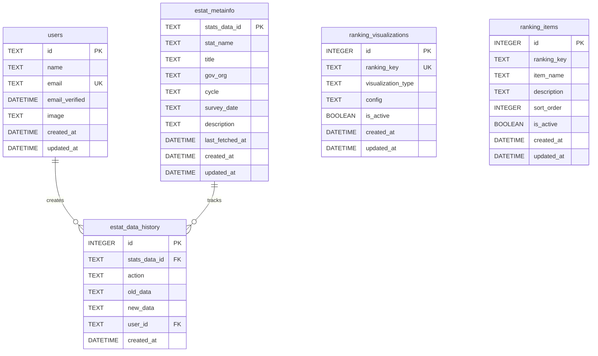

# D1 データベース概要

## 概要

stats47 プロジェクトの Cloudflare D1 データベースの設計とアーキテクチャについて説明します。

### プロジェクト情報

- **プロジェクト名**: stats47
- **データベース**: Cloudflare D1 (SQLite ベース)
- **データベース名**: `stats47`
- **統合スキーマ**: `database/schemas/main.sql`
- **ORM**: なし（生 SQL とプリペアドステートメント）
- **マイグレーション**: Wrangler D1 Migrations

### データベース環境

| 環境             | データベース                     | 接続方法       | 用途         |
| ---------------- | -------------------------------- | -------------- | ------------ |
| **ローカル開発** | `.wrangler/state/.../xxx.sqlite` | better-sqlite3 | 開発・テスト |
| **ステージング** | Cloudflare D1 (dev)              | REST API       | 統合テスト   |
| **本番**         | Cloudflare D1 (prod)             | REST API       | 本番運用     |

## スキーマ設計

### テーブル一覧

#### 1. users

ユーザー認証・管理テーブル

| カラム名       | データ型 | 制約        | デフォルト値      | 説明                 |
| -------------- | -------- | ----------- | ----------------- | -------------------- |
| id             | TEXT     | PRIMARY KEY | -                 | ユーザー ID (UUID)   |
| name           | TEXT     | NOT NULL    | -                 | ユーザー名           |
| email          | TEXT     | UNIQUE      | -                 | メールアドレス       |
| email_verified | DATETIME | -           | NULL              | メール認証日時       |
| image          | TEXT     | -           | NULL              | プロフィール画像 URL |
| created_at     | DATETIME | -           | CURRENT_TIMESTAMP | 作成日時             |
| updated_at     | DATETIME | -           | CURRENT_TIMESTAMP | 更新日時             |

**インデックス**:

- `idx_users_email` ON users(email)

#### 2. estat_metainfo

e-Stat メタデータテーブル（統計表レベル管理）

| カラム名        | データ型 | 制約        | デフォルト値      | 説明                |
| --------------- | -------- | ----------- | ----------------- | ------------------- |
| stats_data_id   | TEXT     | PRIMARY KEY | -                 | 統計表 ID（主キー） |
| stat_name       | TEXT     | NOT NULL    | -                 | 統計調査名          |
| title           | TEXT     | NOT NULL    | -                 | 統計表タイトル      |
| gov_org         | TEXT     | -           | NULL              | 提供機関            |
| cycle           | TEXT     | -           | NULL              | 調査周期            |
| survey_date     | TEXT     | -           | NULL              | 調査年月            |
| description     | TEXT     | -           | NULL              | 説明                |
| last_fetched_at | DATETIME | -           | CURRENT_TIMESTAMP | 最終取得日時        |
| created_at      | DATETIME | -           | CURRENT_TIMESTAMP | 作成日時            |
| updated_at      | DATETIME | -           | CURRENT_TIMESTAMP | 更新日時            |

**インデックス**:

- `idx_estat_metainfo_stat_name` ON estat_metainfo(stat_name)
- `idx_estat_metainfo_title` ON estat_metainfo(title)
- `idx_estat_metainfo_gov_org` ON estat_metainfo(gov_org)
- `idx_estat_metainfo_updated_at` ON estat_metainfo(updated_at)

#### 3. estat_data_history

データ変更履歴テーブル

| カラム名      | データ型 | 制約                      | デフォルト値      | 説明                              |
| ------------- | -------- | ------------------------- | ----------------- | --------------------------------- |
| id            | INTEGER  | PRIMARY KEY AUTOINCREMENT | -                 | 履歴 ID                           |
| stats_data_id | TEXT     | NOT NULL                  | -                 | 統計データ ID                     |
| action        | TEXT     | NOT NULL                  | -                 | アクション (INSERT/UPDATE/DELETE) |
| old_data      | TEXT     | -                         | NULL              | 変更前データ (JSON)               |
| new_data      | TEXT     | -                         | NULL              | 変更後データ (JSON)               |
| user_id       | TEXT     | -                         | NULL              | 変更者 ID                         |
| created_at    | DATETIME | -                         | CURRENT_TIMESTAMP | 作成日時                          |

**インデックス**:

- `idx_estat_data_history_stats_data_id` ON estat_data_history(stats_data_id)
- `idx_estat_data_history_created_at` ON estat_data_history(created_at)

#### 4. ranking_visualizations

地図可視化設定管理テーブル

| カラム名           | データ型 | 制約                      | デフォルト値      | 説明              |
| ------------------ | -------- | ------------------------- | ----------------- | ----------------- |
| id                 | INTEGER  | PRIMARY KEY AUTOINCREMENT | -                 | 設定 ID           |
| ranking_key        | TEXT     | NOT NULL UNIQUE           | -                 | ランキングキー    |
| visualization_type | TEXT     | NOT NULL                  | -                 | 可視化タイプ      |
| config             | TEXT     | -                         | NULL              | 設定データ (JSON) |
| is_active          | BOOLEAN  | -                         | 1                 | アクティブフラグ  |
| created_at         | DATETIME | -                         | CURRENT_TIMESTAMP | 作成日時          |
| updated_at         | DATETIME | -                         | CURRENT_TIMESTAMP | 更新日時          |

**インデックス**:

- `idx_ranking_visualizations_ranking_key` ON ranking_visualizations(ranking_key)
- `idx_ranking_visualizations_is_active` ON ranking_visualizations(is_active)

#### 5. ranking_items

ランキング項目設定テーブル

| カラム名    | データ型 | 制約                      | デフォルト値      | 説明             |
| ----------- | -------- | ------------------------- | ----------------- | ---------------- |
| id          | INTEGER  | PRIMARY KEY AUTOINCREMENT | -                 | 項目 ID          |
| ranking_key | TEXT     | NOT NULL                  | -                 | ランキングキー   |
| item_name   | TEXT     | NOT NULL                  | -                 | 項目名           |
| description | TEXT     | -                         | NULL              | 説明             |
| sort_order  | INTEGER  | -                         | 0                 | ソート順         |
| is_active   | BOOLEAN  | -                         | 1                 | アクティブフラグ |
| created_at  | DATETIME | -                         | CURRENT_TIMESTAMP | 作成日時         |
| updated_at  | DATETIME | -                         | CURRENT_TIMESTAMP | 更新日時         |

**インデックス**:

- `idx_ranking_items_ranking_key` ON ranking_items(ranking_key)
- `idx_ranking_items_sort_order` ON ranking_items(sort_order)
- `idx_ranking_items_is_active` ON ranking_items(is_active)

### ER 図



## アーキテクチャ

### 全体構成図

```
┌─────────────────────────────────────────────────────────────────┐
│                     stats47 データベース                          │
├─────────────────────────────────────────────────────────────────┤
│                                                                  │
│  ┌──────────────────┐   ┌──────────────────┐                   │
│  │ 認証・認可        │   │ e-Statメタデータ  │                   │
│  ├──────────────────┤   ├──────────────────┤                   │
│  │ • users          │   │ • estat_metainfo │                   │
│  │ • accounts       │   │ • estat_data_    │                   │
│  │ • sessions       │   │   history        │                   │
│  │ • verification_  │   └──────────────────┘                   │
│  │   tokens         │                                           │
│  └──────────────────┘                                           │
│                                                                  │
│  ┌──────────────────┐   ┌──────────────────┐                   │
│  │ ランキング設定    │   │ ランキングデータ  │                   │
│  ├──────────────────┤   ├──────────────────┤                   │
│  │ • ranking_items  │   │ • estat_ranking_ │                   │
│  │ • ranking_       │   │   values         │                   │
│  │   visualizations │   │ • ranking_values │                   │
│  │ • subcategory_   │   │   (将来)         │                   │
│  │   configs        │   └──────────────────┘                   │
│  └──────────────────┘                                           │
│                                                                  │
└─────────────────────────────────────────────────────────────────┘
```

### 環境別設定

- **開発・本番共通**: Cloudflare D1 のリモートインスタンス
- **バインディング**: `STATS47_DB` (wrangler.toml)

`wrangler.toml` の設定により、ローカル開発環境 (`wrangler dev`) でも、本番環境と同じリモートの D1 データベースに接続します。これにより、開発と本番の環境差異を最小限に抑えています。

### 接続方法

#### ローカル開発環境

```typescript
// wrangler dev での接続
const db = env.STATS47_DB; // D1Database インスタンス
```

#### 本番環境

```typescript
// Cloudflare Workers での接続
const db = env.STATS47_DB; // D1Database インスタンス
```

### データフロー

```
┌──────────────┐
│ ユーザー      │
└──────┬───────┘
       │ ① ログイン
       ▼
┌──────────────┐
│ NextAuth.js  │──────► users テーブル
└──────┬───────┘        accounts テーブル
       │ ② 認証済み      sessions テーブル
       ▼
┌──────────────┐
│ アプリケーション │
└──────┬───────┘
       │ ③ データ操作
       ▼
┌──────────────┐
│ D1 データベース │◄────── estat_metainfo
└──────────────┘        ranking_items
                         ranking_visualizations
```

## 設計原則

### 正規化

- **第 3 正規形**: データの冗長性を排除
- **適切な正規化**: パフォーマンスと正規化のバランス
- **外部キー**: 論理的な関係性の維持

### インデックス戦略

#### プライマリインデックス

- 全テーブルで `id` カラムにプライマリインデックス
- `users` テーブルで `id` (UUID) にプライマリインデックス

#### セカンダリインデックス

- **検索頻度の高いカラム**: `email`, `stats_data_id`, `ranking_key`
- **ソート用カラム**: `created_at`, `updated_at`, `sort_order`
- **フィルタ用カラム**: `is_active`, `category`, `subcategory`

#### 複合インデックス

```sql
-- 統計調査名とタイトルでの検索用
CREATE INDEX idx_estat_metainfo_stat_title
ON estat_metainfo(stat_name, title);

-- ランキングキーとアクティブフラグでの検索用
CREATE INDEX idx_ranking_items_key_active
ON ranking_items(ranking_key, is_active);
```

### パフォーマンス考慮

#### クエリ最適化

1. **インデックスヒント**: 適切なインデックスを使用
2. **LIMIT 句**: 大量データ取得時は LIMIT を設定
3. **WHERE 句**: インデックス付きカラムでの絞り込み

#### データサイズ管理

1. **JSON データ**: 大きな JSON データは別テーブルに分離を検討
2. **履歴データ**: 古い履歴データのアーカイブ
3. **ログローテーション**: ログテーブルの定期クリーンアップ

### セキュリティ

#### データ保護

1. **暗号化**: 機密データの暗号化
2. **アクセス制御**: ユーザーレベルの権限管理
3. **監査ログ**: データ変更の追跡

#### SQL インジェクション対策

1. **プリペアドステートメント**: パラメータ化クエリの使用
2. **入力検証**: ユーザー入力の検証
3. **エスケープ処理**: 特殊文字の適切な処理

## ビュー

### v_estat_metainfo_summary

統計表サマリービュー

```sql
CREATE VIEW v_estat_metainfo_summary AS
SELECT
  stats_data_id,
  stat_name,
  title,
  gov_org,
  cycle,
  survey_date,
  last_fetched_at,
  created_at,
  updated_at
FROM estat_metainfo
ORDER BY updated_at DESC;
```

## データ型の詳細

### SQLite データ型

| 定義     | 実際の型 | 説明                |
| -------- | -------- | ------------------- |
| INTEGER  | INTEGER  | 整数                |
| TEXT     | TEXT     | テキスト            |
| DATETIME | TEXT     | 日時 (ISO8601 形式) |
| BOOLEAN  | INTEGER  | 真偽値 (0/1)        |

### カスタム型

- **UUID**: TEXT 型で UUID 形式の文字列を格納
- **JSON**: TEXT 型で JSON 形式の文字列を格納

## 関連ドキュメント

- [D1 実装ガイド](02_D1実装ガイド.md) - 開発・実装手順
- [R2 ストレージガイド](03_R2ストレージガイド.md) - R2 ストレージの設計と実装
- [環境設定ガイド](04_環境設定ガイド.md) - 環境固有の設定
- [運用・保守ガイド](05_運用・保守ガイド.md) - 運用保守の手順
