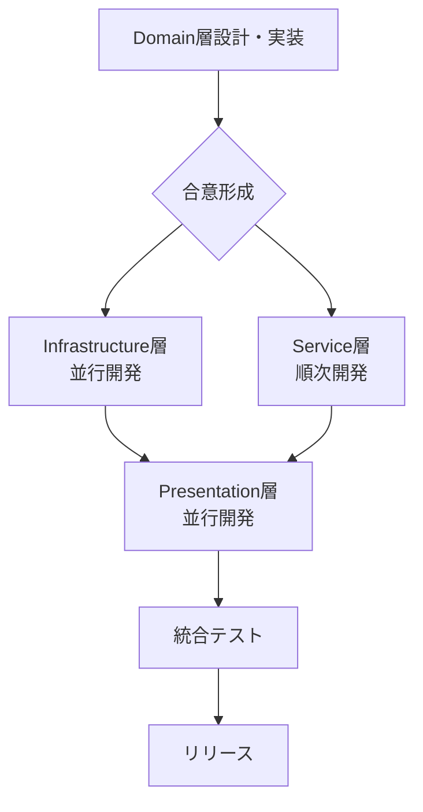

# 大規模プロジェクト実装手順ガイド

> 設計総論（WHAT/WHY）は `docs/01_技術設計/01_システム概要/実装パターン設計.md` に移設しました。本書は実装手順（HOW）にフォーカスします。

## 概要

このガイドは、stats47 プロジェクトのような大規模な Next.js + React アプリケーションにおける効率的な実装手順をまとめたものです。プロジェクト全体の構造を理解し、一貫性のある開発を進めるための指針として活用してください。

## プロジェクト全体の理解

### 技術スタック

- **フロントエンド**: Next.js 15, React 19, TypeScript
- **スタイリング**: Tailwind CSS 4
- **データ可視化**: Recharts, D3.js
- **開発・ビルド**: Turbopack, ESLint

### アーキテクチャパターン（要点のみ、設計詳細は別文書）

- **ドメイン駆動設計**（詳細: 実装パターン設計）
- **3 層アーキテクチャ**（詳細: 実装パターン設計）
- **Server/Client 分離**（詳細: 実装パターン設計）


## 推奨実装手順

### 1. 設計フェーズ（最優先） 📋

新機能実装前に必ず実施する設計作業：

#### a) 要件整理

```
docs/00_プロジェクト管理/02_要件定義/
└── 新機能の要件を明文化
    - 機能要件（何を実現するか）
    - 非機能要件（性能、UX、SEO）
    - 制約条件
    - 既存システムとの連携
```

#### b) アーキテクチャ設計

```
docs/00_プロジェクト管理/02_要件定義/
└── 以下を定義
    - データフロー図
    - API設計（型定義）
    - コンポーネント構成図
    - データベーススキーマ（必要な場合）
    - 環境別データソース戦略
```

#### c) 既存システムとの整合性確認

- `docs/01_技術設計/01_システム概要/システムアーキテクチャ.md`を確認
- 既存のパターンを踏襲（例: Fetcher/Formatter/Display パターン）
- 共通コンポーネントの再利用可能性を検討

### 2. 型定義から実装（Type-First） 🎯

#### なぜ型定義が最初か？

- TypeScript の恩恵を最大化
- インターフェース契約が明確になる
- 複数人で並行開発しやすい
- リファクタリング時の安全性向上

#### 実装順序（DDD 準拠）：

```typescript
// ステップ1: src/infrastructure/[domain]/models/entities/ (エンティティ定義)
export class NewFeatureItem {
  constructor(
    public readonly id: string,
    public name: string,
    public value: number
  ) {}

  // ビジネスルールをメソッドで実装
  validate(): boolean {
    return this.value >= 0;
  }
}

// ステップ2: src/infrastructure/[domain]/models/value-objects/ (値オブジェクト)
export class NewFeatureParams {
  constructor(public readonly startDate: Date, public readonly endDate: Date) {
    if (startDate > endDate) {
      throw new Error("Invalid date range");
    }
  }
}

// ステップ3: src/infrastructure/[domain]/repositories/ (リポジトリ)
export class NewFeatureRepository {
  async fetchRawData(params: NewFeatureParams): Promise<RawData[]> {
    // API通信やDB接続
  }
}

// ステップ4: src/infrastructure/[domain]/services/domain/ (ドメインサービス)
export class NewFeatureCalculator {
  static calculate(items: NewFeatureItem[]): NewFeatureItem[] {
    // ビジネスロジック
  }
}

// ステップ5: src/infrastructure/[domain]/services/application/ (アプリケーションサービス)
export class NewFeatureService {
  constructor(
    private repository: NewFeatureRepository,
    private calculator: NewFeatureCalculator
  ) {}

  async getProcessedData(params: NewFeatureParams): Promise<NewFeatureItem[]> {
    const rawData = await this.repository.fetchRawData(params);
    const items = rawData.map(
      (data) => new NewFeatureItem(data.id, data.name, data.value)
    );
    return this.calculator.calculate(items);
  }
}
```

### 3. Domain 層 → Infrastructure 層 → Application 層 → Presentation 層 📚

DDD に基づいた実装順序：

#### ① Domain 層（最重要・最優先）

```
src/infrastructure/[domain]/models/
├── entities/       # エンティティ（識別子を持つ）
│   └── [entity].ts
└── value-objects/  # 値オブジェクト（不変）
    └── [value-object].ts
```

**責務**: ビジネスの核心、ドメインルールとビジネスロジック
**特徴**: 他の層に依存しない、純粋なビジネスロジック
**実装内容**:

- エンティティのライフサイクル管理
- 値オブジェクトのバリデーション
- ビジネスルールの実装

#### ② Infrastructure 層（データアクセス）

```
src/infrastructure/[domain]/repositories/
├── api/            # API通信
│   └── [resource]-api-repository.ts
└── database/       # DB通信
    └── [resource]-db-repository.ts
```

**責務**: データの永続化、外部システムとの通信
**特徴**: Domain 層のインターフェースに従う
**実装内容**:

- API クライアント実装
- データベースアクセス
- 外部サービス連携

#### ③ Service 層（ビジネスロジック）

```
src/infrastructure/[domain]/services/
├── domain/         # ドメインサービス
│   └── [calculator].ts  # 計算・集計ロジック
└── application/    # アプリケーションサービス
    └── [service].ts     # ユースケース実装
```

**責務**:

- **Domain Service**: エンティティ/値オブジェクトに属さないビジネスロジック
- **Application Service**: ユースケースの実装、トランザクション管理

**依存関係**: Domain 層と Infrastructure 層を組み合わせる

#### ④ Presentation 層（UI）

```
src/components/[domain]/
├── [Feature]Container.tsx  # データ取得・状態管理
├── [Feature]View.tsx       # プレゼンテーション
└── [Feature]Page.tsx       # ページ統合
```

**責務**: ユーザーインターフェース、ユーザー操作の受付
**特徴**: Application Service を呼び出す
**実装内容**:

- コンポーネント実装
- 状態管理（hooks）
- イベントハンドリング

#### ⑤ Routing 層（Server Components）

```
src/app/[route]/
└── page.tsx                # Server Component
```

**責務**: ルーティング、初期データ取得
**特徴**: SSR/SSG の実装

## プロジェクト特有のパターン

### パターン 1: Server/Client 分離

```typescript
// Server Component (データ取得)
src/app/[route]/page.tsx
  ↓ props
// Client Component (インタラクション)
src/components/[domain]/[Feature]Page.tsx
```

### パターン 2: 環境別データソース

```typescript
// 環境検出
getEnvironmentConfig()
  ↓
// mock: JSONファイル
// development: ローカルD1
// staging/production: リモートD1
```

### パターン 3: Fetcher/Formatter/Display

```
Fetcher (データ取得)
  ↓
Formatter (データ整形)
  ↓
Display (データ表示)
```

### パターン 4: カスタムフックによる状態管理

```typescript
// 複雑な状態管理をカスタムフックに集約
src / hooks / [domain] / use[Feature].ts;
```

## 具体的な実装ステップ

### 新機能追加時の詳細手順

**例: 新しい統計表示機能を追加する場合**

#### ステップ 1: 設計書作成（1-2 時間）

```
docs/00_プロジェクト管理/02_要件定義/新機能設計.md
├── 要件定義
├── データフロー図
├── コンポーネント構成図
└── API設計
```

#### ステップ 2: Domain 層実装（1-2 時間）

```typescript
src/infrastructure/new-feature/models/
├── entities/
│   └── new-feature-item.ts    # エンティティ定義
└── value-objects/
    └── new-feature-params.ts   # 値オブジェクト定義
```

**実装内容**:

- ビジネスルールをメソッドとして実装
- バリデーションロジック
- 不変性の保証（値オブジェクト）

#### ステップ 3: Infrastructure 層実装（2-3 時間）

```typescript
src/infrastructure/new-feature/repositories/
├── api/
│   └── new-feature-api-repository.ts  # API通信
└── database/
    └── new-feature-db-repository.ts    # DB通信
```

**実装内容**:

- リポジトリインターフェース定義
- API/DB クライアント実装
- データマッピング（RawData → Entity 変換）

#### ステップ 4: Service 層実装（1-2 時間）

```typescript
src/infrastructure/new-feature/services/
├── domain/
│   └── new-feature-calculator.ts      # ドメインサービス
└── application/
    └── new-feature-service.ts          # アプリケーションサービス
```

**実装内容**:

- ドメインロジック（計算・集計）
- ユースケース実装
- トランザクション管理

#### ステップ 5: テスト用モックデータ作成（1 時間）

```
src/data/mock/new-feature/
└── sample-data.json
```

#### ステップ 6: カスタムフック（1 時間）

```typescript
src/hooks/new-feature/useNewFeature.ts
├── 状態管理
├── データ取得ロジック
└── エラーハンドリング
```

#### ステップ 7: UI コンポーネント（3-4 時間）

```typescript
src/components/new-feature/
├── NewFeatureFetcher.tsx    # データ取得UI
├── NewFeatureDisplay.tsx    # データ表示
├── NewFeaturePage.tsx       # ページ統合
└── index.ts                 # エクスポート
```

#### ステップ 8: ルーティング統合（30 分）

```typescript
src/app/new-feature/page.tsx
└── Server Component
```

#### ステップ 9: テスト & ドキュメント更新（1-2 時間）

```
__tests__/new-feature/
├── fetcher.test.ts
├── formatter.test.ts
└── components.test.tsx

docs/02_開発/
└── 関連ドキュメント更新
```

### 各ステップの所要時間目安（DDD 準拠）

| ステップ              | 所要時間 | 重要度 | 対応層         |
| --------------------- | -------- | ------ | -------------- |
| 設計書作成            | 1-2 時間 | ★★★★★  | -              |
| Domain 層実装         | 1-2 時間 | ★★★★★  | Domain         |
| Infrastructure 層実装 | 2-3 時間 | ★★★★☆  | Infrastructure |
| Service 層実装        | 1-2 時間 | ★★★★☆  | Service        |
| モックデータ作成      | 1 時間   | ★★★☆☆  | Infrastructure |
| カスタムフック        | 1 時間   | ★★★★☆  | Presentation   |
| UI コンポーネント     | 3-4 時間 | ★★★☆☆  | Presentation   |
| ルーティング統合      | 30 分    | ★★☆☆☆  | Routing        |
| テスト・ドキュメント  | 1-2 時間 | ★★★★☆  | -              |

## DDD レイヤー分離のメリット

### Domain・Service・Infrastructure の分離

DDD の層分離により、以下のメリットが得られます：

#### 1. 責務の明確化

```typescript
// ❌ 悪い例: 全てが混在
src/infrastructure/ranking/
├── fetcher.ts       // データ取得とビジネスロジックが混在
├── calculator.ts    // ビジネスロジックとデータ変換が混在
└── types.ts         // 型定義が混在

// ✅ 良い例: DDD準拠の責務分離
src/infrastructure/ranking/
├── models/
│   ├── entities/
│   │   └── ranking-item.ts      # ビジネスオブジェクト
│   └── value-objects/
│       └── ranking-params.ts     # 値オブジェクト
├── services/
│   ├── domain/
│   │   └── ranking-calculator.ts # ドメインロジック
│   └── application/
│       └── ranking-service.ts     # ユースケース
└── repositories/
    └── api/
        └── ranking-repository.ts  # データアクセス
```

#### 2. ビジネスロジックの保護

```typescript
// Domain層は他の層に依存しない
// src/infrastructure/ranking/models/entities/ranking-item.ts
export class RankingItem {
  constructor(public readonly id: string, private _rank: number) {}

  // ビジネスルールをメソッドで保護
  updateRank(newRank: number): void {
    if (newRank < 1) {
      throw new Error("Rank must be positive");
    }
    this._rank = newRank;
  }

  get rank(): number {
    return this._rank;
  }
}

// ❌ 悪い例: ビジネスルールが外部に露出
item.rank = -1; // バリデーションなし

// ✅ 良い例: ビジネスルールが保護される
item.updateRank(-1); // Error: Rank must be positive
```

#### 3. テスタビリティの飛躍的向上

```typescript
// Domain層のテスト: 外部依存なし
describe('RankingItem', () => {
  it('should validate rank', () => {
    const item = new RankingItem('1', 1);
    expect(() => item.updateRank(-1)).toThrow();
  });
});

// Service層のテスト: Repositoryをモック
describe('RankingService', () => {
  it('should calculate ranking', async () => {
    const mockRepo = {
      fetchRawData: jest.fn().mockResolvedValue([...])
    };
    const service = new RankingService(mockRepo, new RankingCalculator());
    const result = await service.getRanking(params);
    expect(result[0].rank).toBe(1);
  });
});
```

#### 4. 変更の局所化と影響範囲の最小化

| 変更内容           | 影響範囲                        | 他層への影響 |
| ------------------ | ------------------------------- | ------------ |
| API 仕様変更       | `repositories/api/`             | なし         |
| DB スキーマ変更    | `repositories/database/`        | なし         |
| ビジネスルール変更 | `models/` or `services/domain/` | 最小限       |
| ユースケース追加   | `services/application/`         | なし         |
| UI 変更            | `components/`                   | なし         |

#### 5. 依存関係の逆転（Dependency Inversion）

```typescript
// Application Service → Repository（インターフェースに依存）
// src/infrastructure/ranking/services/application/ranking-service.ts

interface IRankingRepository {
  fetchRawData(params: RankingParams): Promise<RawData[]>;
}

export class RankingService {
  constructor(
    private repository: IRankingRepository // 抽象に依存
  ) {}
}

// Infrastructure層が実装を提供
// src/infrastructure/ranking/repositories/api/ranking-api-repository.ts
export class RankingApiRepository implements IRankingRepository {
  async fetchRawData(params: RankingParams): Promise<RawData[]> {
    // API実装
  }
}

// src/infrastructure/ranking/repositories/database/ranking-db-repository.ts
export class RankingDbRepository implements IRankingRepository {
  async fetchRawData(params: RankingParams): Promise<RawData[]> {
    // DB実装
  }
}

// 実装の切り替えが容易
const service = new RankingService(new RankingApiRepository());
// または
const service = new RankingService(new RankingDbRepository());
```

#### 6. ユビキタス言語の実現

DDD では、ビジネス用語とコードが一致します：

```typescript
// ビジネス用語がそのままコードに
class Prefecture {} // 都道府県
class Municipality {} // 市区町村
class StatisticalIndicator {} // 統計指標
class RankingCalculator {} // ランキング計算機

// メソッド名もビジネス用語
calculatePopulationDensity(); // 人口密度を計算する
compareWithNationalAverage(); // 全国平均と比較する
```

## 避けるべき落とし穴（DDD 観点）

### ❌ NG: いきなりコンポーネントから書き始める

**問題**: ドメインモデルがないと後で大幅な修正が必要
**解決策**: 必ず Domain 層（Entity/Value Object）から始める

### ❌ NG: 貧血ドメインモデル（Anemic Domain Model）

**問題**: エンティティがデータの入れ物だけになる

```typescript
// ❌ 悪い例: ビジネスロジックがない
export class RankingItem {
  id: string;
  rank: number;
  value: number;
}

// ビジネスロジックがサービスに散在
export class RankingService {
  updateRank(item: RankingItem, newRank: number) {
    if (newRank < 1) throw new Error("Invalid");
    item.rank = newRank; // バリデーションが外部
  }
}
```

```typescript
// ✅ 良い例: リッチドメインモデル
export class RankingItem {
  constructor(
    public readonly id: string,
    private _rank: number,
    public value: number
  ) {}

  // ビジネスロジックがエンティティ内に
  updateRank(newRank: number): void {
    if (newRank < 1) {
      throw new Error("Rank must be positive");
    }
    this._rank = newRank;
  }

  get rank(): number {
    return this._rank;
  }
}
```

**解決策**: ビジネスルールをエンティティのメソッドとして実装

### ❌ NG: Domain 層が Infrastructure 層に依存

**問題**: ドメインロジックが技術的な実装に依存してしまう

```typescript
// ❌ 悪い例: Domainがインフラに依存
export class RankingItem {
  async save(): Promise<void> {
    await fetch('/api/ranking', { ... }); // APIに直接依存
  }
}
```

```typescript
// ✅ 良い例: 依存関係の逆転
export class RankingItem {
  // Domain層は純粋なビジネスロジックのみ
}

// Application層がRepositoryを使う
export class RankingService {
  constructor(private repository: IRankingRepository) {}

  async saveRanking(item: RankingItem): Promise<void> {
    await this.repository.save(item); // インターフェースに依存
  }
}
```

**解決策**: Repository パターンで依存を逆転させる

### ❌ NG: 層をまたいだ直接参照

**問題**: 依存関係が複雑になり、テストが困難

```typescript
// ❌ 悪い例: Presentationが直接Repositoryを呼ぶ
export function RankingComponent() {
  const data = await rankingRepository.fetchData(); // 層を飛び越えている
}
```

```typescript
// ✅ 良い例: Application Serviceを経由
export function RankingComponent() {
  const data = await rankingService.getRanking(); // Serviceを経由
}
```

**解決策**: 各層の責務を守り、Application Service を経由する

### ❌ NG: 技術的な実装詳細がドメイン用語を侵食

**問題**: ビジネス概念が技術用語で曖昧になる

```typescript
// ❌ 悪い例: 技術用語
class DataFetcher {}
class DataProcessor {}
class DataFormatter {}
```

```typescript
// ✅ 良い例: ビジネス用語（ユビキタス言語）
class StatisticalIndicator {} // 統計指標
class RankingCalculator {} // ランキング計算機
class GeographicRegion {} // 地理的領域
```

**解決策**: ビジネス用語をそのままクラス名・メソッド名に使う

### ❌ NG: 値オブジェクトが可変（Mutable）

**問題**: 予期しない副作用が発生

```typescript
// ❌ 悪い例: 値オブジェクトが変更可能
export class Coordinate {
  constructor(
    public latitude: number, // public で変更可能
    public longitude: number
  ) {}
}

const coord = new Coordinate(35.6812, 139.7671);
coord.latitude = 100; // 不正な値に変更できてしまう
```

```typescript
// ✅ 良い例: 値オブジェクトは不変
export class Coordinate {
  constructor(
    public readonly latitude: number,
    public readonly longitude: number
  ) {
    this.validate();
  }

  private validate(): void {
    if (this.latitude < -90 || this.latitude > 90) {
      throw new Error("Invalid latitude");
    }
  }

  // 新しいインスタンスを返す
  moveTo(lat: number, lng: number): Coordinate {
    return new Coordinate(lat, lng);
  }
}
```

**解決策**: 値オブジェクトは `readonly` で不変にする

### ❌ NG: Server/Client 境界を曖昧にする

**問題**: パフォーマンス低下、SEO 問題
**解決策**: 明確な境界を設ける（データ取得=Server、インタラクション=Client）

### ❌ NG: 環境別設定を考慮しない

**問題**: 本番環境でエラー
**解決策**: Repository パターンで環境別実装を切り替える

## 並行開発時の優先順位（DDD 準拠）

### 1. Domain 層（ドメインモデル）を先に全部決める（最重要）

**優先度**: ★★★★★

```
並行開発前に完成させる:
src/infrastructure/[domain]/models/
├── entities/        # 全エンティティの定義
└── value-objects/   # 全値オブジェクトの定義
```

**理由**:

- ビジネスロジックの核心であり、全ての層の基盤
- ドメインモデルが不安定だと全体が崩れる
- チーム全体で合意が必要（ユビキタス言語の確立）

**チェックポイント**:

- [ ] エンティティの識別子が明確か
- [ ] 値オブジェクトは不変か
- [ ] ビジネスルールがメソッドとして実装されているか
- [ ] ドメイン用語がビジネス用語と一致しているか

### 2. Infrastructure 層（Repository）は並行開発可能

**優先度**: ★★★★☆

```
並行開発可能:
src/infrastructure/[domain]/repositories/
├── api/         # API担当者
└── database/    # DB担当者
```

**理由**:

- Domain 層に依存するが、独立して実装可能
- インターフェースが決まっていれば並行開発できる
- モックを使ってテスト可能

**注意点**:

- リポジトリインターフェースを先に定義
- モックリポジトリを用意して Service 層の開発を阻害しない

### 3. Service 層は順次開発

**優先度**: ★★★★☆

```
順次開発推奨:
1. Domain Service（ドメインロジック）
2. Application Service（ユースケース）
```

**理由**:

- Domain Service と Application Service は密接に関連
- ユースケースを理解しながら実装する必要がある

**並行開発のコツ**:

- ユースケース単位で分割可能
- 各ユースケースは独立させる

### 4. Presentation 層（UI）は並行開発可能

**優先度**: ★★★☆☆

```
並行開発可能:
src/components/[domain]/
├── [Feature1]Component.tsx  # 担当者A
├── [Feature2]Component.tsx  # 担当者B
└── [Feature3]Component.tsx  # 担当者C
```

**理由**:

- Application Service のインターフェースが決まっていれば安全
- コンポーネント単位で完全に独立
- Storybook 等で個別に開発・確認可能

### 5. 統合・テストは最後に集中

**優先度**: ★★★★☆

```
最終フェーズ:
1. Domain層の単体テスト
2. Service層の統合テスト
3. E2Eテスト
4. パフォーマンステスト
```

## 並行開発の推奨フロー



### 並行開発時のコミュニケーション

1. **Domain 層の議論**: 全員参加（ユビキタス言語の確立）
2. **Infrastructure 層**: インターフェース定義後に独立開発
3. **Service 層**: ユースケース単位でレビュー
4. **Presentation 層**: デザインシステムに従って独立開発

### 並行開発を成功させるポイント

- Domain 層の設計に十分な時間を割く（急がば回れ）
- インターフェースを先に決めてから実装に入る
- モックを活用して依存を減らす
- 定期的な統合テストで早期に問題を発見

## 品質保証のベストプラクティス

### コード品質

- ESLint ルールの遵守
- TypeScript の strict mode 活用
- 単一責任の原則

### テスト戦略

- 単体テスト（lib 層）
- 統合テスト（UI 層）
- E2E テスト（重要フロー）

### パフォーマンス

- Server Component の活用
- 不要な再レンダリングの回避
- 画像最適化

### セキュリティ

- 入力値のバリデーション
- XSS 対策
- CSRF 対策

## トラブルシューティング

### よくある問題と解決策

#### 1. 型エラーが多発する

**原因**: 型定義が不十分
**解決策**: 型定義を最初にしっかり設計

#### 2. データが表示されない

**原因**: Server/Client 境界の問題
**解決策**: データフローを再確認

#### 3. パフォーマンスが悪い

**原因**: 不要な再レンダリング
**解決策**: useMemo, useCallback の活用

#### 4. 本番環境でエラー

**原因**: 環境別設定の不備
**解決策**: 環境変数の確認

## まとめ

大規模プロジェクトでは、**ドメイン駆動設計（DDD）の原則**と**段階的な実装**が成功の鍵です。

### DDD 実装の 5 つの原則

1. **Domain 層から始める** - ビジネスロジックが全ての基盤
2. **依存関係を守る** - Domain → Service → Infrastructure → Presentation
3. **ユビキタス言語を使う** - ビジネス用語をコードに反映
4. **リッチドメインモデル** - ビジネスルールをエンティティに実装
5. **Repository パターン** - インフラの実装詳細を隠蔽

### 実装の優先順位

```
1. Domain層設計 ★★★★★（全員で合意）
   ↓
2. Infrastructure層 ★★★★☆（並行開発可）
   ↓
3. Service層 ★★★★☆（順次開発）
   ↓
4. Presentation層 ★★★☆☆（並行開発可）
   ↓
5. 統合テスト ★★★★☆
```

### 避けるべき主な落とし穴

- ❌ いきなり UI から作る → ✅ Domain 層から
- ❌ 貧血ドメインモデル → ✅ リッチドメインモデル
- ❌ Domain が Infra に依存 → ✅ 依存関係の逆転
- ❌ 技術用語だけのクラス名 → ✅ ビジネス用語（ユビキタス言語）

### DDD 採用のメリット

1. **保守性**: ビジネスロジックが明確で変更しやすい
2. **テスタビリティ**: 各層を独立してテスト可能
3. **スケーラビリティ**: 責務が分離され拡張しやすい
4. **コミュニケーション**: ビジネス用語でチーム全体が会話できる

このガイドを参考に、**ビジネス価値を最大化する、保守性の高い開発**を進めてください。

---

## 関連ドキュメント

### アーキテクチャ・設計

- [アーキテクチャ設計書](../01_概要/02_アーキテクチャ.md)
- [実装パターン設計](../03_技術設計/01_アーキテクチャ/実装パターン設計.md)

### 開発ガイド

- [コーディング規約](01_コーディング規約.md)
- [コンポーネントガイド](./02_コンポーネントガイド.md)
- [テストガイド](./04_テストガイド.md)
- [パフォーマンス最適化ガイド](./08_パフォーマンス最適化ガイド.md)

### DDD 参考資料

- エンティティと値オブジェクトの詳細は各ドメインの設計書を参照
- Repository パターンの実装例は `src/infrastructure/*/repositories/` を参照
- ドメインサービスの実装例は `src/infrastructure/*/services/domain/` を参照
