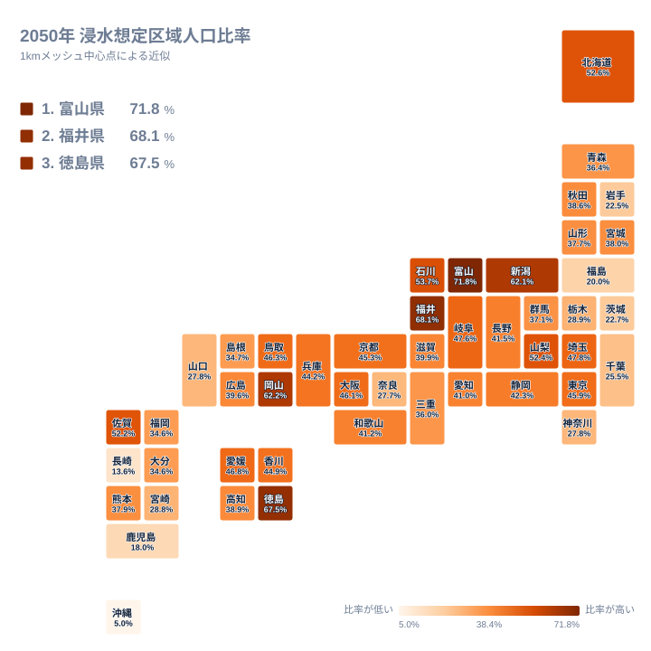
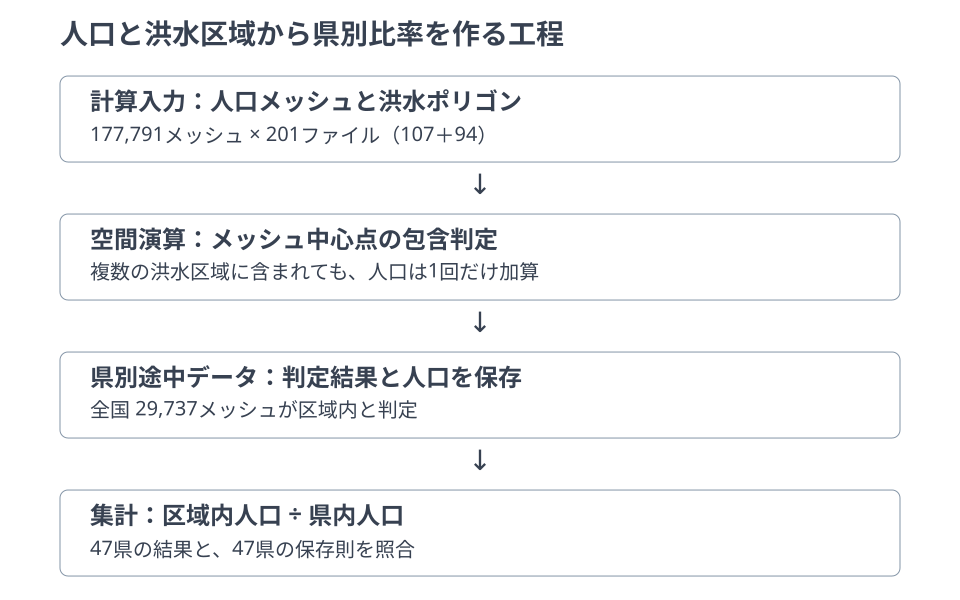
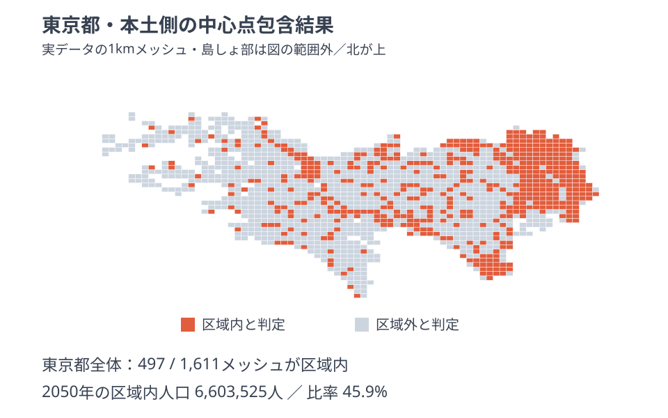

人口が減れば、洪水浸水想定区域に暮らす人口の割合も自然に下がるのでしょうか。2020年と2050年の人口メッシュを、同じ想定最大規模の洪水区域に重ねると、40県で区域内人口比率が上がります。人口の総量だけでなく、どこに人口が残るかを見る必要があります。

例えば富山県では、県全体の人口増減率が-26.4%でも、区域内人口比率は69.2%から71.8%へ上がります。ただし、これは洪水の発生確率や将来の被害人数ではありません。固定した洪水区域に、人口推計がどう重なるかを調べた値です。

> [!WARNING]
> 2026年9月5日訂正：初版には洪水データの河川区分を片方しか取り込まない不具合がありました。洪水予報河川・水位周知河川の107入力を補い、その他の河川と合わせた201入力で全47県を再計算しました。初版の比率・順位・区域内人口は撤回し、以下を訂正値とします。以前のゼロ表示を安全や丸めだけで説明することもできません。

## 富山71.8%と東京45.9%は何を表すか

<source-link href="/geo/population-flood-risk">人口メッシュと洪水区域の重なりを県別に見る</source-link>

主指標は、中心点が洪水区域内に入った1kmメッシュの2050年人口を、県内の2050年人口で割った比率です。富山県は71.8%、福井県は68.1%、徳島県は67.5%です。県別中央値は39.6%ですが、全国人口を合算した比率ではありません。県を一つずつ同じ重みで並べた際の中央の値です。

地図の色が濃いほど、この条件で区域内に分類される人口の割合が大きくなります。ただし、洪水の頻度、家屋の構造、避難しやすさを比較した色ではありません。各県の洪水ポリゴンの提供範囲も同じではないため、色の濃淡をそのまま「危険な県」「安全な県」に読み替えることはできません。

比率と人数も異なります。[富山県](/areas/16000)の区域内人口は2050年に546,918人ですが、[東京都](/areas/13000)は比率45.9%で6,603,525人です。地域の人口分布を見るには比率が役立つ一方、対象となる人口規模を知るには人数も必要です。さらに県内のどこへ分布しているかは、県を一色で塗った地図からは読み取れません。続く県内メッシュの確認で、この集約によって隠れた場所の違いを見ます。

> [!NOTE]
> 「区域内人口」は住所や建物を一軒ずつ数えた人口ではありません。1kmメッシュ中心点が区域内ならメッシュ全人口を加え、中心点が区域外なら加えない近似です。境界付近では、実際に区域内に住む人数との差が生じます。

## ランキングではなく、二つの地理データを重ねる

人口側は国土交通省の「1kmメッシュ別将来推計人口（R6国政局推計）」version 24です。2020年人口と2050年推計人口を持つ177,791メッシュを使います。洪水側は「洪水浸水想定区域（1次メッシュ単位、2025年度）」version 25で、201ファイルの想定最大規模レイヤに含まれる16,513,541ポリゴンです。

二つの入力は、都道府県名で順位表を結合するためのものではありません。人口メッシュの中心点が洪水ポリゴンの内側にあるかを、座標で判定します。複数の河川の区域が同じ中心点に重なっても、そのメッシュの人口は一度だけ加えます。全国で区域内と判定された29,737メッシュを県別に合計し、県内人口で割ることで比率を求めます。

ここで区別する必要があるのが、河川の区分と洪水の想定規模です。入力を分ける「洪水予報河川・水位周知河川」と「その他の河川」は、洪水の大小の区分ではありません。両方の河川区分から想定最大規模を取り出します。片方の区分だけでも計算自体は成立してしまうため、計算結果の合計が合っていることだけでは入力漏れを発見できません。

今回の訂正では、対象ファイルの一覧そのものを照合する検査を加えています。詳しい演算条件とデータの辿り方は[Geo分析の方法](/geo/method)で確認できます。図は入力から出力までの工程を表し、洪水ポリゴンそのものの形状や発生確率を描いたものではありません。

## 東京都の県内メッシュで集計の中身を見る

東京都の県別データは、島しょ部も含めて1,611メッシュを計算対象とし、497メッシュを区域内と判定しています。上図は位置関係を読めるよう本土側を切り出したものです。赤い四角は洪水ポリゴンの輪郭ではなく、中心点が区域内に入った人口メッシュです。灰色も「安全な土地」を意味せず、この判定で中心点が区域外になったことを表します。

人口比率は、赤い四角の数を全四角の数で割った値ではありません。メッシュごとに人口が違うため、四角の数が少ない地域でも人口比率が高くなる可能性があります。東京都の2050年区域内人口6,603,525人を、県内人口14,399,144人で割ると、表示上45.9%になります。人口は途中データの小数値を合計してから比率を計算し、本文の人数は人単位に丸めています。

同じ区域で判定した2020年の比率は45.4%でした。2050年の45.9%への変化は、洪水区域が拡大するという予測ではありません。区域を固定した比較なので、二つの人口分布の違いを示しています。将来の治水整備や洪水条件の変化をこの差から推定することはできません。

[東京都の途中データ](/geo/data/population-flood-risk/13)では、メッシュの人口と判定結果を確かめられます。県全体の比率から、県内の分布、個々のメッシュへと戻れることが、この分析を単なる順位比較と区別する点です。

> [!TIP]
> 県内の確認では、人口分布、区域内判定、検算の順に見てください。人口が密な場所に対象メッシュが集まっているか、県全体の割合と同じ印象になるかを分けて確認できます。

## 人口の保存則と入力の完全性は別に検査する

47県すべてについて、区域内人口と区域外人口の合計が県内人口に戻ること、メッシュ件数が脱落していないこと、途中データから再計算した人数と比率が県別結果に一致することを検査しています。入力の版、ファイル識別子、SHA-256、容量、処理工程は系譜台帳に記録しています。

しかし、この保存則は「与えられた入力の中で二重計上や脱落がないか」を検査するものです。必要な洪水入力が初めから欠けていても、区域外へ分類された人口を含めれば合計は一致してしまいます。入力一覧の照合と保存則の両方が必要だったことが、今回の訂正で明らかになりました。データが欠けた状態をゼロとして公開しないことも重要です。

補完後も、河川管理者から資料提供を受けた範囲という原資料の限界は残ります。例えば滋賀県の訂正値は39.9%ですが、この値を得たことは県内の洪水を網羅した保証ではありません。内水、高潮、土砂災害なども本分析の対象外です。低い比率や区域外判定から、個別の住所が安全だとは判断できません。

## 人口減少後の「残り方」を読む

富山県では、区域内人口は2020年の約716,083人から2050年の約546,918人へ減る一方、区域内人口比率は69.2%から71.8%へ上がります。人数が減ることと、県内人口に占める割合が減ることは同じではありません。[新潟県](/areas/15000)も県全体の人口増減率-30.7%に対して、区域内人口比率は59.3%から62.1%へ上がります。

比率が上がる県では、固定した区域内の人口増減率が区域外を上回ります。富山県のように両方で減少する場合だけでなく、東京都のように両方で増加し、区域内の伸びが大きい場合にも比率は上がります。ただし、その背景が転居、出生死亡、住宅開発などのどれかは、この集計から分離できません。人口推計の前提やメッシュ別の増減を追加で調べる必要があります。

この分析の用途は、地域の将来人口と洪水想定区域を重ね、詳しく確認すべき場所や論点を見つけることです。避難判断、個別住宅の安全確認、保険・不動産評価には使えません。実際の防災行動は、自治体と国の最新ハザードマップを住所単位で確認し、避難情報に従ってください。

## まとめ

- 同じ洪水区域で比較すると、40県で2050年の区域内人口比率が2020年より上がります。
- 比率は人口規模や被害人数ではなく、中心点包含で分類した人口の県内割合です。
- 両河川区分の201入力を使い、区域内29,737メッシュを47県へ集計しています。
- 入力一覧と保存則を別々に検査し、県内メッシュから集計の根拠へ戻れるようにしています。
- 中心点近似と原資料の提供範囲には限界があり、避難や個別住所の安全判断には使えません。

## データ出典

国土交通省[「1kmメッシュ別将来推計人口（R6国政局推計）」](https://nlftp.mlit.go.jp/ksj/gml/datalist/KsjTmplt-mesh1000r6.html) version 24、および[「洪水浸水想定区域（1次メッシュ単位、2025年度）」](https://nlftp.mlit.go.jp/ksj/gml/datalist/KsjTmplt-A31b-2025.html) version 25の想定最大規模レイヤを加工しました。原データの利用条件はCC BY 4.0です。背景地図タイルは図に使用していません。

本記事は2026年9月5日生成の[県別集計](https://storage.stats47.jp/app/geo/population-flood-risk/item.json)・[系譜台帳](https://storage.stats47.jp/app/geo/population-flood-risk/manifest.json)・県別途中データを根拠とします。原資料の更新ではなく、入力漏れの補完による訂正です。
