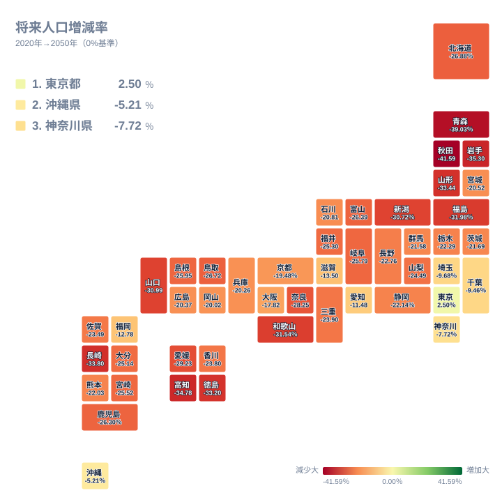
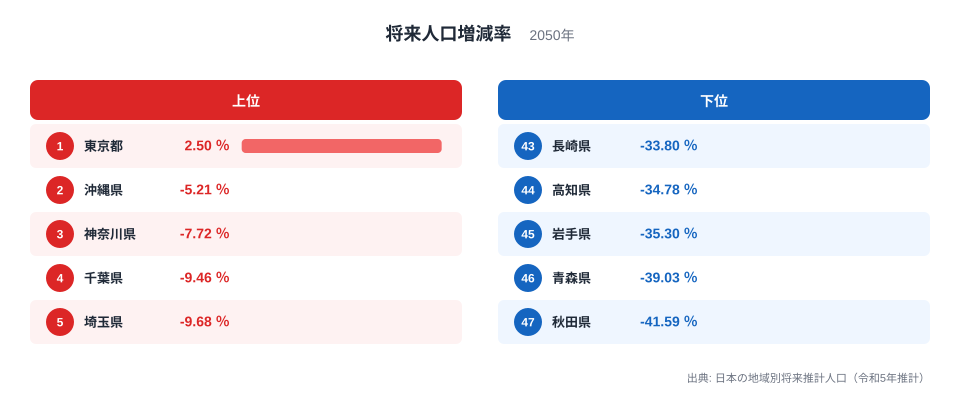

2050年の人口地図で、2020年を上回る推計になったのは東京都だけです。将来人口増減率は東京都が+2.5%、2位の沖縄県が-5.21%、3位の神奈川県が-7.72%でした。最下位の秋田県は-41.59%で、東京都との差は44.09ポイントです。

色は増減の方向と幅を見つける入口ですが、色だけでは「何人が残るか」「県内のどこが減るか」「暮らしやすいか」までは分かりません。本記事では、同じ47都道府県データを地図と順位で読み、何が言えて何が言えないかを切り分けます。東京都が唯一プラスになる背景の詳説は[東京パラドックスの記事](/blog/future-population-tokyo-paradox)、大幅減少県の詳説は[2050年に人口が4割減る県の記事](/blog/future-population-disappearing-prefectures)に分け、ここでは三つのGeo分析へ入るための基準線を作ります。

> [!NOTE]
> 将来人口増減率は、2020年の人口に対して2050年推計が何%増減するかを示します。2050年の人口総数や全国人口に占める割合ではありません。

## 東京だけプラスの47都道府県地図

<source-link href="/ranking/future-population-change-rate-2050">将来人口増減率の47都道府県値を確認する</source-link>

この地図は0%を中央に置いた発散配色です。赤は人口減少、緑は人口増加を表し、凡例の左右を-41.59%と+41.59%で対称に固定しました。0%から離れるほど色が強くなりますが、濃淡だけでは増減の方向を判別できないため、色相・符号・数値を併読します。東京都の+2.5%は0%をわずかに上回るため淡い緑で、秋田県の-41.59%は赤の端になります。

地図で最初に読むべきなのは、東京都の+2.5%だけが0%を上回り、残る46道府県はすべてマイナスという境界です。2位の沖縄県でも-5.21%、首都圏の神奈川県は-7.72%、千葉県は-9.46%、埼玉県は-9.68%でした。「上位県」という言葉は人口が増える県を意味しません。順位が高くても、東京都以外は2020年より人口が減る推計です。

次に、同じ色に見える県同士でも値を確認します。47県の中央に位置する24位は三重県の-23.9%です。2050年に2割以上減る推計は37県、3割以上減る推計は11県あります。地図は面的なまとまりを探す入口ですが、色の段階だけで閾値の内外を決めると、値の近い県を誤って分けたり、離れた県を同じ群として扱ったりします。

最後に、地図は都道府県を一つの値で塗っていると確認します。県内の市区町村差や1kmメッシュ差は、この図には出ません。県全体が-20%でも、中心市街地と周辺部が同じ割合で減るとは限りません。[2050年人口のGeo基準ページ](/geo/2050-population)は、この県比較を空間横断分析の入口として位置づけています。[東京都の地域データ](/areas/13000)と[秋田県の地域データ](/areas/05000)も開くと、将来人口増減率とは別の人口・暮らしの指標を確認できます。

## 上位でも減少、下位は3割超減少

上位5県では東京都だけが+2.5%で、沖縄県-5.21%、神奈川県-7.72%、千葉県-9.46%、埼玉県-9.68%と続きます。正の値と負の値が同じ「上位」に並ぶため、順位だけでなく0%との位置関係を読む必要があります。この図は順位カードとして符号と数値を読む設計で、負の値の棒の長さは比較に使いません。最大値を最小値で割る倍率も、符号が異なるこの指標では意味を持ちません。地域差は東京都と秋田県の44.09ポイント差として表す方が適切です。

下位5県は秋田県-41.59%、青森県-39.03%、岩手県-35.3%、高知県-34.78%、長崎県-33.8%です。上位・下位の図は差を見つけやすい一方、県の人口規模は示しません。同じ-30%でも、減る人数や行政サービスへの影響は基準となる2020年人口によって変わります。正確な47県値は図直上のランキングで確認し、人数の議論には別の人口総数を組み合わせる必要があります。

> [!WARNING]
> -41.59%は「2050年に秋田県がなくなる」「41.59%の市町村が消える」という意味ではありません。県全体の2020年人口と2050年推計人口を比べた割合です。

## 東京圏が上位、東北が下位に集まる構造

上位5県のうち東京都、神奈川県、千葉県、埼玉県の4都県は東京圏です。別指標の2024年転入超過率を見ると、東京都+0.56%、埼玉県+0.30%、神奈川県+0.29%、千葉県+0.13%で、4都県とも転入が転出を上回りました。これは2050年推計の直接の計算入力ではありませんが、東京圏で人口が相対的に維持される一つの構造的な補助線です。47県の値は[転入超過率ランキング](/ranking/moving-in-excess-rate)で確認できます。

一方、沖縄県は将来人口増減率が2位でも、2024年転入超過率は-0.10%でした。同年の自然増減率は-2.3‰で、47県のなかで減少幅が最も小さくなっています。上位県を転入だけで説明できない例です。人口は転入・転出の社会増減と、出生・死亡の自然増減が重なって変わります。[自然増減率ランキング](/ranking/natural-increase-rate)を併読すると、同じ上位でも人口が残る経路が異なると分かります。

下位5県では秋田県、青森県、岩手県の3県が東北です。2024年の自然増減率は秋田県-15.6‰、青森県-13.0‰、岩手県-12.7‰で、同年の転入超過率もそれぞれ-0.37%、-0.45%、-0.43%でした。自然減と社会減が同時に観測される構造は、2050年推計で減少幅が大きい地域分布と整合します。ただし、単年の2024年値から30年間の変化を因果的に説明したわけではありません。下位県の年齢構造や推計の背景は、前掲の大幅減少県の記事で詳しく扱います。

## 地図が示すのは基準線、原因の確定ではない

主地図から直接分かるのは、2020年から2050年までの県別人口増減率です。出生、死亡、転入、転出のどれが何ポイント寄与したかは、この一つの値だけでは分解できません。補助線に使った2024年の転入超過率と自然増減率も、2050年推計と期間が異なります。東京都の+2.5%を雇用や転入だけの効果と断定したり、秋田県の-41.59%を出生率だけで説明したりすることはできません。

また、推計値は将来を言い当てる予言ではありません。国立社会保障・人口問題研究所の令和5年推計が置く前提に基づく、比較可能な一つの将来像です。政策、移動、災害、住宅供給、交通網などが変われば、実際の人口経路も変わり得ます。更新時には、同じ「2050年」でも推計版と基準年をそろえて比較する必要があります。

**[仮説]** 東京圏では進学・就職・住宅移動を含む人口移動が人口維持に寄与し、東北の下位県では高齢化した年齢構成が自然減を大きくしている可能性があります。ただし、産業別雇用、年齢別移動、出生・死亡、住宅供給を同じ期間で追加しなければ検証できません。本記事の接地データだけで個々の要因の寄与率は確定できません。

## 三つのGIS分析で「どこに残るか」を見る

県別増減率は、三つの空間横断分析を読む共通の分母になります。[人口減少×住宅地価](/geo/population-land-price)では、人口が減る県でも住宅地の価格変動が同じ方向とは限らないかを検証します。[2050年人口×洪水浸水想定](/geo/population-flood-risk)では、人口がどの区域に残る推計かを重ねます。[2050年人口×駅アクセス](/geo/population-station-access)では、現在の駅代表点から直線800m以内に残る人口を集計します。

これらは単一指標ランキングの言い換えではありません。人口メッシュと別の点・面レイヤーを空間演算し、県別途中データと保存則を持つ分析です。一方、本記事の地図は都道府県別の将来人口増減率をそのまま可視化した基準線で、1kmメッシュ同士の空間演算は行っていません。役割を分けることで、「県の減少率」と「特定区域に残る人口比率」を混同せずに済みます。

> [!TIP]
> 地域を選ぶときは、まず県別増減率で全体像を確認し、次に地価・洪水区域・駅アクセスのGeoページで県別途中データまで降ります。最終判断には市区町村資料や現地条件も加えてください。

## 無料の結論と再利用物を分ける

47都道府県の値、地図、読み方、推計の限界は無料で公開します。有料化を検討する場合も、結論を隠すのではなく、同じ地図を再生成する入力辞書、加工済みCSV・JSON、計算手順、県比較テンプレートなど、繰り返し使える成果物を対象にします。

ただし、再現パックは閲覧やデータ導線の需要が確認できた場合だけ試します。将来人口の値を投資、移住、出店の推奨へ置き換えず、利用者が自分の問いで再検証できる工程に価値を置きます。推計版、基準年、単位、47県のcoverageを固定することが、販売物でも無料記事でも共通の品質条件です。

## まとめ

- 2050年の将来人口増減率がプラスなのは東京都+2.5%だけです。
- 2位の沖縄県も-5.21%で、東京都以外の46道府県はマイナスです。
- 最下位は秋田県-41.59%で、東京都との差は44.09ポイントです。
- 2050年に3割以上減る推計は11県ですが、減る人数や県内差はこの率だけでは分かりません。
- 県別地図を基準線にし、地価・洪水区域・駅アクセスは別のGIS分析で確認します。

## データ出典

主地図は国立社会保障・人口問題研究所「日本の地域別将来推計人口（令和5年推計）」に基づく、2020年国勢調査人口に対する2050年推計人口の増減率です。stats47の `future-population-change-rate-2050` と同じ公開R2観測値47件を使用し、欠損補完や倍率変換はしていません。構造説明の補助線にはstats47公開R2の2024年転入超過率と2024年自然増減率を使い、2050年推計の直接入力や因果効果としては扱っていません。
